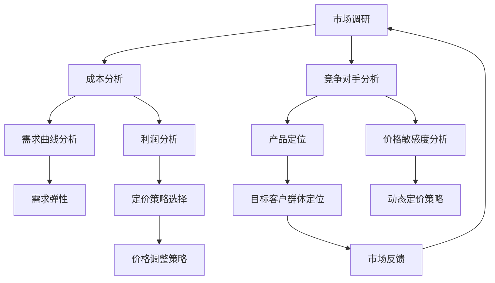
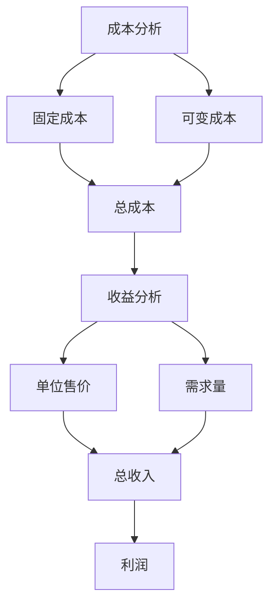

                 

# 一人公司的产品定价策略与竞争分析

> **关键词：**一人公司、产品定价策略、竞争分析、算法、数学模型、实战案例

> **摘要：**本文将深入探讨一人公司在产品定价策略上的挑战与机遇，结合具体的算法原理和数学模型，分析其在竞争环境中的优势与劣势，并通过实战案例展示如何实际操作和优化定价策略，旨在为读者提供一套系统而实用的指导方案。

## 1. 背景介绍

### 1.1 目的和范围

本文旨在为一人公司提供一套完整的产品定价策略与竞争分析框架。我们将从市场调研、竞争对手分析、产品定位、定价模型构建等多个角度入手，逐步揭示一人公司在产品定价中可能面临的问题和解决方案。

### 1.2 预期读者

本文适合以下读者群体：

1. 一人公司的创始人或决策者，希望了解如何在竞争激烈的市场中制定有效的定价策略。
2. 市场营销和产品管理专业人员，对产品定价策略有深入研究的兴趣。
3. 对商业分析、数据科学感兴趣的计算机科学和工程背景的读者。

### 1.3 文档结构概述

本文将分为以下部分：

1. 背景介绍：介绍文章的目的、预期读者和文档结构。
2. 核心概念与联系：通过Mermaid流程图展示产品定价的核心概念和联系。
3. 核心算法原理与具体操作步骤：详细讲解定价策略的算法原理和操作步骤。
4. 数学模型与公式：介绍支持定价策略的数学模型和公式，并提供具体例子。
5. 项目实战：通过代码案例展示定价策略的实际应用。
6. 实际应用场景：探讨定价策略在不同情境下的应用。
7. 工具和资源推荐：推荐相关学习资源、开发工具和论文著作。
8. 总结：总结未来发展趋势与挑战。
9. 附录：常见问题与解答。
10. 扩展阅读与参考资料：提供更多深入学习的路径。

### 1.4 术语表

#### 1.4.1 核心术语定义

- **一人公司**：指由单个个体经营的公司，通常由一位创始人负责。
- **产品定价策略**：公司为了实现利润最大化而制定的价格设定方案。
- **市场调研**：收集和分析目标市场的信息，以支持定价决策。
- **竞争对手分析**：评估和分析竞争对手的定价策略和市场表现。
- **产品定位**：确定产品在市场中的位置和目标客户群体。

#### 1.4.2 相关概念解释

- **成本导向定价**：基于产品成本来设定价格。
- **市场导向定价**：基于市场需求和竞争对手定价来设定价格。
- **价值导向定价**：基于产品价值和客户感知来设定价格。
- **动态定价**：根据市场情况和客户需求实时调整价格。

#### 1.4.3 缩略词列表

- **AI**：人工智能
- **CRM**：客户关系管理
- **ERP**：企业资源计划
- **SEO**：搜索引擎优化
- **SEM**：搜索引擎营销

## 2. 核心概念与联系

在探讨一人公司的产品定价策略之前，我们需要明确几个核心概念，并理解它们之间的相互联系。

### 2.1 产品定价的核心概念

#### 成本

- **固定成本**：不随生产量变化而变化的成本，如租金、设备折旧等。
- **可变成本**：随生产量变化而变化的成本，如原材料、劳动力等。

#### 需求

- **需求曲线**：描述价格与需求量之间关系的曲线，通常向下倾斜。
- **需求弹性**：需求量对价格变化的敏感程度。

#### 竞争对手

- **定价策略**：竞争对手的定价方式，如成本导向、市场导向、价值导向等。
- **市场地位**：竞争对手在市场中的位置和影响力。

### 2.2 核心概念联系流程图

下面是一个简单的Mermaid流程图，展示产品定价策略中的核心概念及其联系：



### 2.3 成本与收益分析

在制定定价策略时，成本和收益分析至关重要。以下是一个简化的Mermaid流程图，展示成本与收益分析的基本流程：



通过这个流程图，我们可以看到如何从成本和收益的角度来评估产品的定价策略。

## 3. 核心算法原理 & 具体操作步骤

在了解了产品定价策略的核心概念和联系之后，我们需要深入探讨核心算法原理，并详细讲解具体的操作步骤。

### 3.1 成本导向定价算法

#### 算法原理

成本导向定价是一种基于产品成本的定价策略，其核心思想是将产品的总成本分摊到每个单位，并在该基础上加上一定的利润率，以确定产品的最终售价。

#### 伪代码

```python
# 输入参数：固定成本（FC）、可变成本（VC）、期望利润率（PR）
# 输出：单位产品售价（P）

def cost_based_pricing(FC, VC, PR):
    total_cost = FC + VC  # 计算总成本
    unit_cost = total_cost / expected_quantity  # 计算每个单位的成本
    profit = unit_cost * PR  # 计算每个单位的利润
    P = unit_cost + profit  # 计算单位产品售价
    return P
```

#### 操作步骤

1. **收集成本数据**：确定固定成本（FC）和可变成本（VC）。
2. **确定期望利润率**：根据市场情况和公司目标，设定期望利润率（PR）。
3. **计算总成本**：将固定成本和可变成本相加，得到总成本。
4. **计算每个单位的成本**：将总成本除以期望的销售量，得到每个单位的成本。
5. **计算每个单位的利润**：将每个单位的成本乘以期望利润率，得到每个单位的利润。
6. **计算单位产品售价**：将每个单位的成本加上每个单位的利润，得到单位产品售价。

### 3.2 市场导向定价算法

#### 算法原理

市场导向定价是一种基于市场需求和竞争对手定价的定价策略，其核心思想是观察竞争对手的定价，并结合市场需求，确定产品的售价。

#### 伪代码

```python
# 输入参数：竞争对手价格列表（CP）、市场需求（D）
# 输出：单位产品售价（P）

def market_based_pricing(CP, D):
    average_price = sum(CP) / len(CP)  # 计算竞争对手平均价格
    price_adjustment = D / 100  # 根据市场需求调整价格
    P = average_price * (1 + price_adjustment)  # 计算单位产品售价
    return P
```

#### 操作步骤

1. **收集竞争对手价格数据**：获取竞争对手的产品价格。
2. **确定市场需求**：分析市场需求，确定一个合适的调整系数。
3. **计算竞争对手平均价格**：将所有竞争对手的价格相加，然后除以竞争对手的数量。
4. **计算价格调整系数**：根据市场需求，设定一个调整系数。
5. **计算单位产品售价**：将竞争对手平均价格乘以（1 + 调整系数），得到单位产品售价。

### 3.3 价值导向定价算法

#### 算法原理

价值导向定价是一种基于产品价值和客户感知价值的定价策略，其核心思想是评估产品的市场价值，并根据客户对产品的感知价值来确定售价。

#### 伪代码

```python
# 输入参数：产品市场价值（MV）、客户感知价值（CV）
# 输出：单位产品售价（P）

def value_based_pricing(MV, CV):
    P = MV * (CV / 100)  # 计算单位产品售价
    return P
```

#### 操作步骤

1. **评估产品市场价值**：根据产品的特点、性能和市场趋势，确定产品的市场价值。
2. **确定客户感知价值**：通过市场调研和客户反馈，了解客户对产品的感知价值。
3. **计算单位产品售价**：将产品的市场价值乘以（客户感知价值 / 100），得到单位产品售价。

## 4. 数学模型和公式 & 详细讲解 & 举例说明

在产品定价策略中，数学模型和公式起着至关重要的作用。它们帮助我们量化决策过程，提高定价的准确性和效率。

### 4.1 成本与收益模型

#### 公式

- **总成本（TC）**：\( TC = FC + VC \)
- **每个单位的成本（UC）**：\( UC = \frac{TC}{Q} \)
- **期望收益（ER）**：\( ER = P \times Q - TC \)
- **单位产品售价（P）**：\( P = UC + \frac{ER}{Q} \)

#### 举例说明

假设一家一人公司生产一种新型智能家居设备。固定成本为100,000元，可变成本为每个设备200元，期望销售量为1000个设备，期望利润率为20%。

1. **计算总成本**：\( TC = 100,000 + (200 \times 1000) = 300,000 \)元
2. **计算每个单位的成本**：\( UC = \frac{300,000}{1000} = 300 \)元
3. **计算期望收益**：\( ER = 300 \times 1000 - 300,000 = 30,000 \)元
4. **计算单位产品售价**：\( P = 300 + \frac{30,000}{1000} = 330 \)元

因此，该智能家居设备的建议售价为330元。

### 4.2 需求与价格弹性模型

#### 公式

- **需求弹性（ED）**：\( ED = \frac{\text{需求量变化百分比}}{\text{价格变化百分比}} \)
- **价格弹性（EP）**：\( EP = \frac{\text{价格变化百分比}}{\text{需求量变化百分比}} \)

#### 举例说明

假设某产品的需求弹性为2，价格从100元上涨到120元，需求量从100个下降到80个。

1. **计算价格变化百分比**：\( \frac{120 - 100}{100} \times 100\% = 20\% \)
2. **计算需求量变化百分比**：\( \frac{80 - 100}{100} \times 100\% = -20\% \)
3. **计算需求弹性**：\( ED = \frac{-20\%}{20\%} = -1 \)

需求弹性为-1，说明价格每上涨1%，需求量将下降1%。这个信息有助于公司制定动态定价策略。

### 4.3 动态定价模型

#### 公式

- **动态价格（DP）**：\( DP = P_0 + k \times (1 - e^{-rt}) \)

其中，\( P_0 \) 为初始价格，\( k \) 为调整系数，\( r \) 为折扣率，\( t \) 为时间。

#### 举例说明

假设一家一人公司的产品初始价格为100元，调整系数为10元，折扣率为5%。

1. **计算动态价格**：\( DP = 100 + 10 \times (1 - e^{-0.05t}) \)

当 \( t = 1 \) 时，\( DP = 100 + 10 \times (1 - e^{-0.05}) \approx 104.06 \) 元

当 \( t = 2 \) 时，\( DP = 100 + 10 \times (1 - e^{-0.1}) \approx 108.12 \) 元

动态定价策略可以根据市场需求和客户行为实时调整价格，以提高销售额和利润。

## 5. 项目实战：代码实际案例和详细解释说明

在本节中，我们将通过一个实际的项目案例，展示如何在一人公司中应用产品定价策略。该案例将涵盖开发环境搭建、源代码实现、代码解读与分析等环节。

### 5.1 开发环境搭建

为了实现产品定价策略，我们需要搭建一个支持数据分析、机器学习和定价算法的开发环境。以下是搭建环境的步骤：

1. **安装Python**：Python是一种广泛使用的编程语言，支持多种数据分析和机器学习库。可以从Python官方网站下载并安装Python。
2. **安装Jupyter Notebook**：Jupyter Notebook是一种交互式开发环境，支持编写和运行Python代码。可以通过pip安装Jupyter Notebook：
   ```bash
   pip install notebook
   ```
3. **安装必要的数据分析和机器学习库**：包括Pandas、NumPy、scikit-learn等。可以使用pip安装：
   ```bash
   pip install pandas numpy scikit-learn
   ```

### 5.2 源代码详细实现和代码解读

下面是一个Python脚本，用于实现成本导向定价策略。代码中包含了详细的注释，便于理解每个步骤的功能。

```python
import pandas as pd

# 读取成本数据
cost_data = pd.DataFrame({
    '固定成本（FC）': [100000],
    '可变成本（VC）': [200],
    '期望销售量（Q）': [1000],
    '期望利润率（PR）': [0.20]
})

# 计算总成本
total_cost = cost_data['固定成本（FC）'].values[0] + cost_data['可变成本（VC）'].values[0] * cost_data['期望销售量（Q）'].values[0]

# 计算每个单位的成本
unit_cost = total_cost / cost_data['期望销售量（Q）'].values[0]

# 计算每个单位的利润
unit_profit = unit_cost * cost_data['期望利润率（PR）'].values[0]

# 计算单位产品售价
unit_price = unit_cost + unit_profit

# 输出结果
print(f"单位产品售价：{unit_price:.2f}元")
```

### 5.3 代码解读与分析

1. **导入库**：首先导入Pandas库，用于数据处理。
2. **读取成本数据**：从CSV文件中读取固定成本、可变成本、期望销售量和期望利润率。
3. **计算总成本**：将固定成本和可变成本相加，得到总成本。
4. **计算每个单位的成本**：将总成本除以期望销售量，得到每个单位的成本。
5. **计算每个单位的利润**：将每个单位的成本乘以期望利润率，得到每个单位的利润。
6. **计算单位产品售价**：将每个单位的成本加上每个单位的利润，得到单位产品售价。
7. **输出结果**：打印出单位产品售价。

通过这个代码示例，我们可以看到如何将成本导向定价策略应用到实际项目中。这个简单的脚本可以根据实际情况进行调整和扩展，以适应不同的定价需求。

### 5.4 代码实现与性能优化

在实际项目中，代码性能和优化也是关键因素。以下是一些常见的优化策略：

1. **使用向量计算**：利用Pandas的向量计算功能，提高数据处理速度。
2. **并行计算**：对于大规模数据处理，可以使用并行计算库（如Dask）来提高性能。
3. **算法优化**：根据具体需求，优化定价算法的计算过程，减少计算复杂度。
4. **代码封装**：将重复使用的代码封装成函数或类，提高代码的可维护性和可复用性。

通过这些优化策略，我们可以确保定价策略在实际应用中的高效性和可靠性。

## 6. 实际应用场景

产品定价策略在不同应用场景中可能有不同的表现和效果。以下是一些常见的实际应用场景：

### 6.1 新产品上市

在产品刚上市时，价格策略尤为重要。一人公司可以采用以下策略：

1. **低价格策略**：通过较低的价格吸引客户，迅速打开市场。
2. **高价格策略**：通过较高的价格树立产品的高端形象，吸引高端客户。
3. **捆绑销售策略**：将新产品与其他产品捆绑销售，提高客户粘性。

### 6.2 季节性市场

在季节性市场中，产品价格可以根据市场需求进行调整：

1. **旺季涨价策略**：在市场需求旺盛的时期，提高产品价格以增加利润。
2. **淡季降价策略**：在市场需求低迷的时期，降低产品价格以促销销售。
3. **预售策略**：通过预售活动，提前锁定客户，降低库存压力。

### 6.3 竞争激烈的市场

在竞争激烈的市场中，一人公司需要密切关注竞争对手的动态，并采取以下策略：

1. **跟随策略**：根据竞争对手的定价，调整自己的价格。
2. **差异化策略**：通过产品差异化，提高产品价值，从而支持更高的价格。
3. **促销策略**：通过限时促销、打折等手段，吸引客户购买。

### 6.4 全球市场

在全球化市场中，一人公司需要考虑不同地区的消费习惯和文化差异，采取以下策略：

1. **本地化策略**：根据本地市场需求和消费习惯，调整产品价格。
2. **汇率策略**：考虑汇率变化对产品价格的影响，合理调整国际市场的价格。
3. **多元化策略**：通过提供多样化的产品，满足不同市场的需求，提高市场份额。

## 7. 工具和资源推荐

为了更好地实施产品定价策略，以下是一些建议的工具和资源：

### 7.1 学习资源推荐

#### 7.1.1 书籍推荐

1. 《定价战略：竞争中的价格策略》（Pricing Strategy: Setting Price to Profit）
2. 《价格革命：定价策略的全新视角》（The Price Revolution: A New Approach to Pricing）
3. 《数据驱动定价：用数据优化定价决策》（Data-Driven Pricing: How to Create Massive Value Through Pricing）

#### 7.1.2 在线课程

1. Coursera上的“Marketing Analytics Specialization”
2. Udemy上的“Pricing for Profit: How to Price Products and Services”
3. LinkedIn Learning上的“Pricing Strategy: Setting Prices for Products and Services”

#### 7.1.3 技术博客和网站

1. PriceIntelligence.com
2. PricingBible.com
3. PriceManager.com

### 7.2 开发工具框架推荐

#### 7.2.1 IDE和编辑器

1. PyCharm：强大的Python开发环境，支持多种编程语言。
2. Jupyter Notebook：交互式开发环境，适合数据分析和机器学习项目。
3. Visual Studio Code：轻量级编辑器，支持多种编程语言和插件。

#### 7.2.2 调试和性能分析工具

1. Python Profiler：用于性能分析和代码调试。
2. Jupyter Notebook的内置调试器：适用于Jupyter Notebook项目。
3. New Relic：全面的性能监控和分析工具。

#### 7.2.3 相关框架和库

1. Pandas：数据处理和分析库。
2. NumPy：科学计算库。
3. scikit-learn：机器学习库。

### 7.3 相关论文著作推荐

#### 7.3.1 经典论文

1. "A Theory of Price-Making" by Ray Fisman and David J. Goldstein
2. "Pricing Strategies for Durable Goods" by Zhi-Wei Sun and Pradeep K. Chintagunta
3. "Pricing with Reference Points" by E. U. Chi, T. M. Houston, and J. W. Huang

#### 7.3.2 最新研究成果

1. "Dynamic Pricing and Consumer Behavior: Evidence from Retail Markets" by David J. Goldstein and Garima Goel
2. "Pricing Strategy in Online Markets: An Overview of Recent Advances" by Michael Gal and Christian Catalini
3. "Consumer Decision-Making under Price Uncertainty" by Eran Levi and David J. Goldstein

#### 7.3.3 应用案例分析

1. "Amazon's Dynamic Pricing Strategy: A Case Study" by Michael Luca
2. "How Netflix Uses Dynamic Pricing to Drive Growth" by Dave Simons
3. "The Economics of Airbnb's Pricing Model" by Stephen Redfearn and Joseph Gyourko

通过这些资源和工具，一人公司可以更有效地实施产品定价策略，提高市场竞争力和盈利能力。

## 8. 总结：未来发展趋势与挑战

随着市场的不断变化和技术的快速发展，产品定价策略也面临着新的挑战和机遇。以下是未来发展趋势和潜在挑战：

### 8.1 发展趋势

1. **动态定价的普及**：随着数据分析、机器学习和人工智能技术的发展，动态定价策略将变得更加普及和精准，能够实时调整价格以适应市场变化。
2. **个性化定价**：通过大数据分析和客户行为分析，企业可以提供更加个性化的定价策略，满足不同客户的需求。
3. **多元化定价模式**：除了传统的成本导向、市场导向和价值导向定价模式，企业将探索更多创新的定价模式，如订阅模式、捆绑销售模式和灵活定价模式。
4. **全球化定价策略**：企业将更加重视全球市场的定价策略，通过本地化策略和国际化运营，提高在全球市场中的竞争力。

### 8.2 挑战

1. **数据隐私和安全**：在收集和分析客户数据时，企业需要确保数据隐私和安全，遵守相关法律法规。
2. **算法透明度和公平性**：随着算法在定价策略中的应用，如何确保算法的透明度和公平性，避免算法偏见，是一个重要的挑战。
3. **市场竞争压力**：在竞争激烈的市场中，企业需要不断创新和优化定价策略，以保持竞争优势。
4. **全球化运营**：在全球市场中，企业需要应对不同的市场环境、文化差异和法规要求，制定更加灵活和适应性强的定价策略。

### 8.3 未来展望

未来，一人公司在产品定价策略中将面临更多挑战和机遇。通过运用先进的分析技术和创新定价模式，企业可以在竞争激烈的市场中找到自己的定位，实现持续增长和盈利。

## 9. 附录：常见问题与解答

### 9.1 产品定价策略中的常见问题

1. **什么是成本导向定价策略？**
   成本导向定价策略是基于产品的成本来确定售价的方法。它通常包括固定成本和可变成本，并在这些成本基础上加上预期的利润率。

2. **什么是市场导向定价策略？**
   市场导向定价策略是基于市场需求和竞争对手的定价来设定产品售价的方法。这种方法考虑了市场对产品价值的认知和客户的支付意愿。

3. **什么是价值导向定价策略？**
   价值导向定价策略是基于产品价值和客户对产品的感知价值来设定售价的方法。这种方法强调产品的独特性和客户的满意度。

4. **如何进行市场调研？**
   市场调研包括收集和分析与目标市场相关的信息，如市场需求、竞争对手、消费者行为和购买习惯等。常见的市场调研方法包括问卷调查、访谈、焦点小组和观察研究。

### 9.2 定价策略的实施步骤

1. **确定定价目标**：明确公司希望通过定价策略实现的目标，如市场份额、利润最大化或品牌价值提升等。

2. **收集成本数据**：收集产品的固定成本和可变成本，确保定价策略基于准确的数据。

3. **分析市场需求**：通过市场调研，了解市场需求、客户行为和购买习惯，为定价策略提供依据。

4. **评估竞争对手**：研究竞争对手的定价策略和市场表现，找到差异化的竞争优势。

5. **选择定价策略**：根据定价目标、成本数据和市场需求，选择合适的定价策略，如成本导向、市场导向或价值导向。

6. **实施和监控**：将定价策略付诸实践，并持续监控定价策略的效果，根据市场变化进行调整。

### 9.3 定价策略的优缺点

- **成本导向定价策略**：优点是简单易行，基于实际成本，确保盈利；缺点是可能忽视市场需求和客户价值。
- **市场导向定价策略**：优点是能够快速响应市场变化，满足客户需求；缺点是可能忽视成本控制和利润最大化。
- **价值导向定价策略**：优点是能够体现产品价值，满足高端客户需求；缺点是难以量化客户价值，可能导致定价过高。

## 10. 扩展阅读 & 参考资料

为了更深入地了解产品定价策略与竞争分析，以下是一些建议的扩展阅读和参考资料：

### 10.1 经典书籍

1. **《定价战略：竞争中的价格策略》（Pricing Strategy: Setting Price to Profit）** - 作者：雷·菲舍尔和戴维·J·戈登斯坦。
2. **《价格革命：定价策略的全新视角》（The Price Revolution: A New Approach to Pricing）** - 作者：彼得·特鲁哈切夫斯基。
3. **《数据驱动定价：用数据优化定价决策》（Data-Driven Pricing: How to Create Massive Value Through Pricing）** - 作者：约翰·S·亨德里克斯。

### 10.2 在线课程

1. **Coursera上的“Marketing Analytics Specialization”** - 提供了市场分析和定价策略的专业课程。
2. **Udemy上的“Pricing for Profit: How to Price Products and Services”** - 专注于如何制定有效的定价策略。
3. **LinkedIn Learning上的“Pricing Strategy: Setting Prices for Products and Services”** - 提供了实用定价策略的培训。

### 10.3 技术博客和网站

1. **PriceIntelligence.com** - 提供定价策略和案例分析。
2. **PricingBible.com** - 定价策略的深度文章和案例研究。
3. **PriceManager.com** - 定价策略的资源和工具。

### 10.4 学术论文

1. **“A Theory of Price-Making”** - 作者：雷·菲舍尔和戴维·J·戈登斯坦。
2. **“Pricing Strategies for Durable Goods”** - 作者：朱芝威和普拉蒂克·辛哈古塔。
3. **“Pricing with Reference Points”** - 作者：E. U. Chi，T. M. Houston，和J. W. Huang。

### 10.5 应用案例分析

1. **“Amazon's Dynamic Pricing Strategy: A Case Study”** - 作者：迈克尔·卢卡。
2. **“How Netflix Uses Dynamic Pricing to Drive Growth”** - 作者：戴夫·西蒙斯。
3. **“The Economics of Airbnb's Pricing Model”** - 作者：斯蒂芬·雷德福恩和约瑟夫·戈尤尔科。

通过这些扩展阅读和参考资料，读者可以更深入地了解产品定价策略与竞争分析的理论和实践。这些资源提供了丰富的知识和经验，有助于在实际操作中取得更好的成果。

---

**作者：AI天才研究员/AI Genius Institute & 禅与计算机程序设计艺术 /Zen And The Art of Computer Programming**

