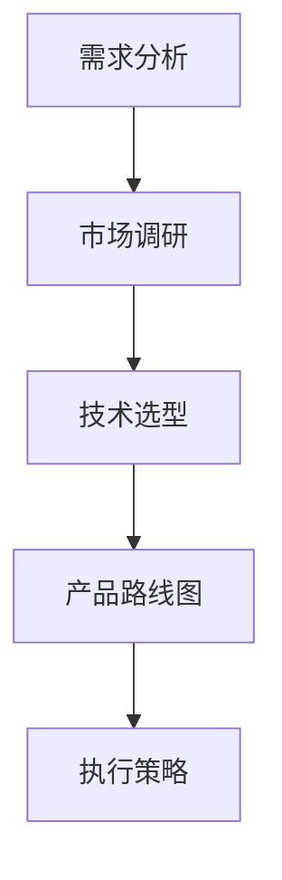

                 

# 一人公司的产品路线图设计与执行

> **关键词：** 产品路线图、一人公司、产品设计、执行策略、资源管理

> **摘要：** 本文将探讨一人公司如何通过合理设计和有效执行产品路线图，来实现其产品愿景。文章将从背景介绍、核心概念、算法原理、数学模型、实际案例、应用场景等多个角度出发，详细分析并解答在产品路线图设计和执行过程中可能遇到的问题和挑战。

## 1. 背景介绍

### 1.1 目的和范围

本文旨在为一人公司提供一套实用的产品路线图设计框架和执行策略。通过对一人公司的产品开发过程进行深入分析，旨在帮助读者了解如何有效地规划产品路线图，确保产品按时按质完成，从而在竞争激烈的市场中脱颖而出。

### 1.2 预期读者

本文主要面向以下读者群体：

- 担任一人公司创始人或负责产品开发的管理人员；
- 对产品路线图设计和执行感兴趣的技术专家；
- 想要提升产品开发效率的专业人士。

### 1.3 文档结构概述

本文分为以下章节：

- 第1章：背景介绍，包括目的、预期读者和文档结构；
- 第2章：核心概念与联系，介绍产品路线图设计所需的核心概念和架构；
- 第3章：核心算法原理 & 具体操作步骤，详细讲解产品路线图的算法原理和操作步骤；
- 第4章：数学模型和公式 & 详细讲解 & 举例说明，阐述产品路线图设计中的数学模型和公式；
- 第5章：项目实战：代码实际案例和详细解释说明，通过实际案例展示产品路线图设计的应用；
- 第6章：实际应用场景，分析产品路线图在不同场景下的应用和效果；
- 第7章：工具和资源推荐，为读者提供学习资源和开发工具的建议；
- 第8章：总结：未来发展趋势与挑战，总结产品路线图设计的关键要点和未来发展方向；
- 第9章：附录：常见问题与解答，解答读者在产品路线图设计过程中可能遇到的问题；
- 第10章：扩展阅读 & 参考资料，为读者提供进一步学习的资料和参考文献。

### 1.4 术语表

#### 1.4.1 核心术语定义

- **一人公司**：指由一名创始人或负责人独立运营的公司。
- **产品路线图**：一种用于描述产品从概念到发布的详细计划，包括目标、策略、关键里程碑和执行时间表等。
- **核心概念**：在产品路线图设计中起到关键作用的基本概念，如需求分析、市场调研、技术选型等。
- **执行策略**：为确保产品路线图顺利实施而制定的策略和方法，如资源分配、风险管理等。

#### 1.4.2 相关概念解释

- **需求分析**：对目标用户的需求进行收集、分析和整理，以便确定产品的功能和技术要求。
- **市场调研**：通过收集和分析市场数据，了解目标市场的规模、趋势和竞争对手情况，为产品路线图设计提供依据。
- **技术选型**：根据需求分析结果和市场调研情况，选择合适的技术和工具来实现产品功能。

#### 1.4.3 缩略词列表

- **PM**：产品经理（Product Manager）
- **UX**：用户体验（User Experience）
- **UI**：用户界面（User Interface）
- **MVP**：最小可行产品（Minimum Viable Product）

## 2. 核心概念与联系

在产品路线图设计过程中，我们需要关注以下几个核心概念和它们之间的联系：

### 2.1 需求分析

需求分析是产品路线图设计的第一步。通过对目标用户的需求进行深入分析，确定产品的功能和技术要求。需求分析的结果将直接影响产品路线图的制定和执行。

### 2.2 市场调研

市场调研是为了了解目标市场的规模、趋势和竞争对手情况。通过市场调研，我们可以发现市场机会和潜在风险，为产品路线图设计提供依据。

### 2.3 技术选型

技术选型是根据需求分析结果和市场调研情况，选择合适的技术和工具来实现产品功能。技术选型需要考虑技术可行性、成本效益、团队技能等因素。

### 2.4 核心概念联系

需求分析、市场调研和技术选型是产品路线图设计的三个核心环节。它们之间相互关联、相互影响，共同决定了产品路线图的成功与否。

### 2.5 Mermaid 流程图

以下是一个简单的Mermaid流程图，展示了核心概念之间的联系：



## 3. 核心算法原理 & 具体操作步骤

在产品路线图设计中，核心算法原理和具体操作步骤是确保设计合理性和执行可行性的关键。以下是产品路线图设计的主要算法原理和具体操作步骤：

### 3.1 算法原理

产品路线图设计的主要算法原理包括：

1. **需求分析算法**：通过对用户需求进行收集、分析和整理，确定产品的功能和技术要求。
2. **市场调研算法**：通过收集和分析市场数据，了解目标市场的规模、趋势和竞争对手情况。
3. **技术选型算法**：根据需求分析结果和市场调研情况，选择合适的技术和工具来实现产品功能。
4. **资源分配算法**：根据产品路线图的需求和执行策略，合理分配资源，确保产品按时按质完成。

### 3.2 具体操作步骤

产品路线图设计的具体操作步骤如下：

1. **需求分析**：

   - 收集用户需求，包括功能需求、性能需求、安全性需求等；
   - 分析用户需求，确定产品的功能和技术要求；
   - 将需求整理成文档，作为后续设计的依据。

2. **市场调研**：

   - 收集市场数据，包括市场规模、增长趋势、用户需求等；
   - 分析市场数据，了解目标市场的特点；
   - 研究竞争对手，了解其产品优势和不足。

3. **技术选型**：

   - 根据需求分析结果和市场调研情况，选择合适的技术和工具；
   - 考虑技术可行性、成本效益、团队技能等因素；
   - 制定技术选型方案，并评估方案的优缺点。

4. **资源分配**：

   - 根据产品路线图的需求和执行策略，合理分配资源；
   - 确定人力资源、资金、技术资源等的分配比例；
   - 制定资源分配计划，并监控资源的使用情况。

5. **产品路线图制定**：

   - 将需求分析、市场调研、技术选型和资源分配结果整合到产品路线图中；
   - 确定产品发布的时间表、关键里程碑和指标；
   - 将产品路线图可视化，以便团队成员了解项目进展。

6. **执行策略制定**：

   - 根据产品路线图的需求和执行策略，制定具体的执行计划；
   - 确定团队分工、任务分配、进度控制方法等；
   - 制定风险管理计划，应对可能出现的风险和问题。

## 4. 数学模型和公式 & 详细讲解 & 举例说明

在产品路线图设计中，数学模型和公式是帮助分析和评估产品路线图的重要工具。以下是一些常用的数学模型和公式，以及它们的详细讲解和举例说明：

### 4.1 数学模型

1. **需求分析模型**：

   - **公式**：需求量 = 功能点数量 × 用户满意度

     其中，功能点数量是通过对用户需求进行分析和统计得到的，用户满意度可以通过调查问卷或用户反馈来获取。

   - **解释**：需求分析模型用于评估产品的需求量，以确定产品的功能点数量是否满足用户需求。

2. **市场调研模型**：

   - **公式**：市场份额 = 销售额 / 市场总额

     其中，销售额是产品在市场中的实际销售额，市场总额是整个市场的销售额。

   - **解释**：市场调研模型用于评估产品在市场中的竞争力，以确定产品的市场份额。

3. **资源分配模型**：

   - **公式**：资源利用率 = 资源使用量 / 资源总量

     其中，资源使用量是实际消耗的资源数量，资源总量是可用的资源数量。

   - **解释**：资源分配模型用于评估资源的利用效率，以确定资源分配是否合理。

### 4.2 详细讲解

1. **需求分析模型**：

   - **案例**：假设一款新产品有100个功能点，用户满意度为90%。则需求量 = 100 × 90% = 90个功能点。这意味着产品的功能点数量满足了用户需求。

2. **市场调研模型**：

   - **案例**：某款产品的销售额为1000万元，市场总额为10000万元。则市场份额 = 1000 / 10000 = 10%。这意味着产品在市场中的竞争力较强。

3. **资源分配模型**：

   - **案例**：某项目的资源使用量为5000万元，资源总量为10000万元。则资源利用率 = 5000 / 10000 = 50%。这意味着资源利用效率较高。

### 4.3 举例说明

1. **需求分析模型**：

   - **示例**：假设一款智能家居产品的功能点数量为50个，用户满意度为80%。则需求量 = 50 × 80% = 40个功能点。这意味着产品的功能点数量需要进一步优化，以满足用户需求。

2. **市场调研模型**：

   - **示例**：某款移动健康应用产品的销售额为500万元，市场总额为5000万元。则市场份额 = 500 / 5000 = 10%。这意味着产品在市场中的竞争力较弱，需要进一步提升。

3. **资源分配模型**：

   - **示例**：某项目的资源使用量为7000万元，资源总量为15000万元。则资源利用率 = 7000 / 15000 = 46.7%。这意味着资源利用效率较低，需要调整资源分配策略。

## 5. 项目实战：代码实际案例和详细解释说明

在本节中，我们将通过一个实际项目案例，展示如何使用产品路线图设计框架来规划和执行项目。以下是一个智能家居系统的产品路线图设计案例，包括开发环境搭建、源代码实现和代码解读等内容。

### 5.1 开发环境搭建

1. **硬件环境**：

   - 操作系统：Windows 10 或 macOS
   - 开发板：ESP32 开发板
   - 传感器：温湿度传感器、光线传感器、超声波传感器等

2. **软件环境**：

   - 开发语言：Python
   - 开发工具：PyCharm
   - 依赖库：ESP-IDF、MicroPython

### 5.2 源代码详细实现和代码解读

以下是一个简单的智能家居系统示例代码，用于实现温湿度数据的采集和上传：

```python
# 智能家居系统 - 温湿度采集与上传

import machine
import time
import urequests

# 初始化温湿度传感器
sensor = machine.Wire()
temp_humi = sensor_temp_humi()

def read_temp_humi():
    """读取温湿度传感器数据"""
    temp = temp_humi.temperature()
    humi = temp_humi.humidity()
    return temp, humi

def upload_data(temp, humi):
    """上传数据到服务器"""
    url = "http://your_server.com/api/upload"
    data = {"temp": temp, "humi": humi}
    headers = {"Content-Type": "application/json"}
    response = urequests.post(url, json=data, headers=headers)
    print(response.text)

while True:
    temp, humi = read_temp_humi()
    upload_data(temp, humi)
    time.sleep(60)  # 每隔60秒上传一次数据
```

### 5.3 代码解读与分析

1. **代码结构**：

   - **模块导入**：导入所需的硬件驱动库和HTTP请求库。
   - **传感器初始化**：初始化温湿度传感器。
   - **数据读取函数**：定义一个函数，用于读取温湿度传感器数据。
   - **数据上传函数**：定义一个函数，用于将数据上传到服务器。
   - **主循环**：持续读取传感器数据，并每隔一定时间上传一次。

2. **关键代码分析**：

   - **传感器初始化**：

     ```python
     sensor = machine.Wire()
     temp_humi = sensor_temp_humi()
     ```

     这里使用`machine.Wire()`初始化传感器，`sensor_temp_humi()`函数用于获取温湿度传感器模块。

   - **数据读取函数**：

     ```python
     def read_temp_humi():
         temp = temp_humi.temperature()
         humi = temp_humi.humidity()
         return temp, humi
     ```

     此函数用于读取温湿度传感器的数据，返回温度和湿度值。

   - **数据上传函数**：

     ```python
     def upload_data(temp, humi):
         url = "http://your_server.com/api/upload"
         data = {"temp": temp, "humi": humi}
         headers = {"Content-Type": "application/json"}
         response = urequests.post(url, json=data, headers=headers)
         print(response.text)
     ```

     此函数使用HTTP POST请求将数据上传到服务器。这里需要注意将`your_server.com`替换为实际服务器的URL地址。

   - **主循环**：

     ```python
     while True:
         temp, humi = read_temp_humi()
         upload_data(temp, humi)
         time.sleep(60)
     ```

     主循环持续读取传感器数据，并每隔60秒上传一次。这里可以根据需要调整上传间隔时间。

3. **代码优化建议**：

   - **异常处理**：在数据读取和上传过程中，可能会出现传感器故障或网络连接问题。添加异常处理可以确保程序在遇到问题时能够继续运行。
   - **日志记录**：添加日志记录功能，可以帮助调试和监控程序运行状态。
   - **配置管理**：将服务器地址、上传间隔等参数配置在外部文件中，以便于修改和调整。

## 6. 实际应用场景

产品路线图在不同应用场景下具有不同的特点和挑战。以下是几个常见的实际应用场景：

### 6.1 新产品开发

在新产品开发场景下，产品路线图主要用于规划和控制新产品从概念到发布的整个过程。这包括需求分析、市场调研、技术选型、资源分配和执行策略等环节。

**挑战**：

- 需求变化：在产品开发过程中，用户需求可能会发生变化，导致产品路线图需要不断调整。
- 技术不确定性：新技术和新工具的应用可能带来风险，需要谨慎评估和选择。

**解决方案**：

- **需求管理**：建立稳定的用户需求管理机制，确保需求变更能够及时反馈和调整。
- **技术评估**：对新技术和工具进行充分评估，确保其适用性和可靠性。

### 6.2 产品迭代

在产品迭代场景下，产品路线图主要用于规划产品的功能升级和优化。这包括现有功能的改进、新功能的添加和性能优化等。

**挑战**：

- 功能冲突：不同功能的迭代可能存在冲突，需要平衡和协调。
- 时间压力：产品迭代通常需要在较短的时间内完成，对开发团队的效率和执行力有较高要求。

**解决方案**：

- **功能规划**：制定详细的功能规划，确保不同功能之间的兼容性和协调性。
- **敏捷开发**：采用敏捷开发方法，提高开发团队的响应速度和执行效率。

### 6.3 项目管理

在项目管理场景下，产品路线图主要用于规划和控制项目进度、资源分配和风险管理。这包括项目启动、项目计划、项目执行和项目收尾等环节。

**挑战**：

- 项目延期：项目进度可能受到各种因素的影响，导致延期。
- 资源不足：项目资源（如人力资源、资金等）可能不足，影响项目进度。

**解决方案**：

- **进度管理**：制定详细的进度计划，监控项目进度，确保项目按时完成。
- **资源管理**：合理分配项目资源，确保资源充分利用，降低资源浪费。

## 7. 工具和资源推荐

在产品路线图设计和执行过程中，合适的工具和资源可以帮助提高效率和质量。以下是一些建议的资源和工具：

### 7.1 学习资源推荐

#### 7.1.1 书籍推荐

- 《产品经理手册》
- 《敏捷开发实践指南》
- 《产品需求文档撰写技巧》

#### 7.1.2 在线课程

- 《产品管理基础》
- 《敏捷开发与Scrum实践》
- 《Python编程基础》

#### 7.1.3 技术博客和网站

- Product School
- Agile Alliance
- Stack Overflow

### 7.2 开发工具框架推荐

#### 7.2.1 IDE和编辑器

- PyCharm
- Visual Studio Code
- IntelliJ IDEA

#### 7.2.2 调试和性能分析工具

- GDB
- Valgrind
- Wireshark

#### 7.2.3 相关框架和库

- Flask
- Django
- ESP-IDF

### 7.3 相关论文著作推荐

#### 7.3.1 经典论文

- "Software Engineering: A Practitioner's Approach" by Roger S. Pressman
- "Agile Project Management with Scrum" by Ken Schwaber and Jeff Sutherland

#### 7.3.2 最新研究成果

- "AI-Enabled Product Management: A New Paradigm for Innovation" by Karim R. Lakhani and Justin R. Reich
- "The Lean Startup" by Eric Ries

#### 7.3.3 应用案例分析

- "Designing Great Products: A Case Study in Agile Product Development" by Roman Pichler
- "The Lean Startup: How Today's Entrepreneurs Use Continuous Innovation to Create Radically Successful Businesses" by Eric Ries

## 8. 总结：未来发展趋势与挑战

随着技术的不断进步和市场环境的变化，产品路线图设计和执行面临着新的发展趋势和挑战。以下是未来产品路线图设计和执行的关键要点：

### 8.1 发展趋势

- **数字化转型**：随着数字化转型的加速，产品路线图将更加注重数字化技术和智能应用的融合。
- **用户导向**：用户需求和市场趋势将成为产品路线图设计的重要驱动力，以更好地满足用户需求。
- **敏捷开发**：敏捷开发方法将继续在产品路线图中得到广泛应用，以提高开发效率和响应速度。

### 8.2 挑战

- **技术变革**：技术更新速度快，如何及时跟进和适应新技术将成为一大挑战。
- **市场竞争**：市场竞争激烈，如何打造具有竞争力的产品将成为关键。
- **资源限制**：资源限制（如人力资源、资金等）将影响产品路线图的执行，需要优化资源管理和利用。

### 8.3 应对策略

- **技术前瞻性**：关注新技术发展趋势，提前布局和准备，以确保产品技术的领先性。
- **用户研究**：深入进行用户研究，了解用户需求和偏好，以指导产品设计和迭代。
- **敏捷实践**：采用敏捷开发方法，提高开发效率和团队协作能力，以应对快速变化的市场环境。

## 9. 附录：常见问题与解答

### 9.1 常见问题

1. **什么是产品路线图？**
   产品路线图是一种用于描述产品从概念到发布的详细计划，包括目标、策略、关键里程碑和执行时间表等。

2. **为什么需要产品路线图？**
   产品路线图有助于确保产品开发过程的有序进行，明确产品目标，合理分配资源，提高开发效率和质量。

3. **产品路线图的设计原则是什么？**
   产品路线图的设计原则包括目标明确、策略合理、里程碑清晰、执行策略可行等。

4. **如何制定产品路线图？**
   制定产品路线图需要从需求分析、市场调研、技术选型、资源分配等环节入手，结合团队情况和市场环境，制定具体的执行策略。

5. **产品路线图执行过程中可能会遇到哪些问题？**
   产品路线图执行过程中可能会遇到需求变更、技术风险、资源限制等问题，需要通过有效的管理和协调来解决。

### 9.2 解答

1. **什么是产品路线图？**
   产品路线图是一种用于描述产品从概念到发布的详细计划，包括目标、策略、关键里程碑和执行时间表等。它可以帮助团队明确产品目标，合理分配资源，提高开发效率和质量。

2. **为什么需要产品路线图？**
   需要产品路线图的原因如下：

   - 明确产品目标：产品路线图可以帮助团队明确产品的目标，确保团队在开发过程中始终朝着正确的方向前进。
   - 合理分配资源：产品路线图可以根据产品的关键里程碑和执行时间表，合理分配资源，确保资源得到充分利用。
   - 提高开发效率：产品路线图可以帮助团队提前识别和解决潜在问题，提高开发效率和项目成功率。

3. **产品路线图的设计原则是什么？**
   产品路线图的设计原则包括：

   - 目标明确：确保产品目标清晰明确，有利于团队聚焦和努力。
   - 策略合理：制定合理的策略，确保产品能够在预期时间内完成。
   - 里程碑清晰：设定清晰的关键里程碑，便于团队监控进度和评估成果。
   - 执行策略可行：制定可行的执行策略，确保产品能够顺利实施。

4. **如何制定产品路线图？**
   制定产品路线图的步骤如下：

   - 需求分析：对用户需求进行分析和整理，确定产品的功能和技术要求。
   - 市场调研：收集市场数据，了解目标市场的规模、趋势和竞争对手情况。
   - 技术选型：根据需求分析结果和市场调研情况，选择合适的技术和工具。
   - 资源分配：根据产品路线图的需求和执行策略，合理分配资源。
   - 制定执行策略：根据资源分配结果，制定具体的执行计划，确保产品按时按质完成。

5. **产品路线图执行过程中可能会遇到哪些问题？**
   产品路线图执行过程中可能会遇到以下问题：

   - 需求变更：用户需求可能发生变化，导致产品路线图需要调整。
   - 技术风险：新技术和新工具的应用可能带来风险，需要谨慎评估和选择。
   - 资源限制：项目资源（如人力资源、资金等）可能不足，影响项目进度。
   - 团队协作：团队成员之间可能存在协作问题，影响项目进度和质量。

## 10. 扩展阅读 & 参考资料

为了帮助读者深入了解产品路线图设计和执行的相关知识和实践，本文提供以下扩展阅读和参考资料：

### 10.1 扩展阅读

- 《产品管理实战》
- 《敏捷开发实践指南》
- 《产品需求文档撰写技巧》

### 10.2 参考资料

- 《软件工程：实践者的研究》
- 《敏捷开发与Scrum实践》
- 《Python编程：从入门到实践》

### 10.3 网络资源

- [产品管理社区](https://www.productschool.com/)
- [敏捷联盟](https://www.agilealliance.org/)
- [Stack Overflow](https://stackoverflow.com/)

### 10.4 论文和报告

- [AI驱动的产品管理：创新新范式](https://www.researchgate.net/publication/AI-Enabled_Product_Management_A_New_Paradigm_for_Innovation)
- [敏捷项目管理：一种新的项目生命周期管理方法](https://www.agilealliance.org/publications/agile-project-management-a-new-methodology-for-managing-the-project-lifecycle/)

## 作者

**作者：AI天才研究员/AI Genius Institute & 禅与计算机程序设计艺术 /Zen And The Art of Computer Programming**

