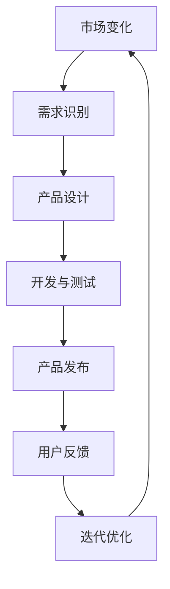
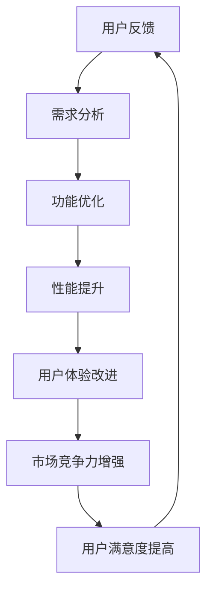

                 

# 一人公司的产品迭代策略：快速响应市场变化的方法

> **关键词：** 产品迭代、市场响应、敏捷开发、创新策略、用户反馈

> **摘要：** 本文章将探讨一人公司如何在有限资源和团队规模下，通过高效的迭代策略，快速响应市场变化，保持产品竞争力。文章将从背景介绍、核心概念、算法原理、数学模型、项目实战、实际应用、工具推荐和未来趋势等方面，逐步解析产品迭代策略的要点。

## 1. 背景介绍

### 1.1 目的和范围

在当前快速变化的市场环境中，产品迭代速度成为了企业竞争力的关键因素。对于一人公司而言，如何在资源有限的情况下，快速响应市场变化，不断优化和迭代产品，显得尤为重要。本文旨在探讨一人公司的产品迭代策略，帮助读者了解如何在竞争激烈的市场中保持产品的核心竞争力。

### 1.2 预期读者

本文适合以下读者群体：
- 担任一人公司创始人或CTO的技术专家；
- 对敏捷开发和产品迭代感兴趣的技术人员；
- 产品经理和对市场策略有深入研究的人士。

### 1.3 文档结构概述

本文将分为以下几个部分：
1. 背景介绍：介绍文章的目的、读者预期和文档结构；
2. 核心概念与联系：阐述产品迭代相关的核心概念和架构；
3. 核心算法原理 & 具体操作步骤：详细讲解产品迭代策略的算法原理和操作步骤；
4. 数学模型和公式 & 详细讲解 & 举例说明：介绍支持产品迭代策略的数学模型和公式，并提供实际案例；
5. 项目实战：通过实际案例展示产品迭代策略的运用；
6. 实际应用场景：探讨产品迭代策略在不同场景下的应用；
7. 工具和资源推荐：推荐相关的学习资源和开发工具；
8. 总结：对未来产品迭代策略的发展趋势和挑战进行分析；
9. 附录：提供常见问题与解答；
10. 扩展阅读 & 参考资料：推荐进一步学习和研究的相关资料。

### 1.4 术语表

#### 1.4.1 核心术语定义

- 产品迭代：指在产品开发过程中，对已有产品进行持续优化和改进的过程。
- 敏捷开发：一种软件开发方法，强调快速迭代、持续交付和客户反馈。
- 用户反馈：用户对产品的使用体验和改进建议。

#### 1.4.2 相关概念解释

- **市场响应时间**：指公司从识别市场变化到推出相应产品或功能所需的时间。
- **持续集成与持续部署（CI/CD）**：一种软件开发和部署流程，通过自动化测试和部署，实现快速迭代和高效交付。

#### 1.4.3 缩略词列表

- **SaaS**：软件即服务
- **PaaS**：平台即服务
- **IaaS**：基础设施即服务
- **Agile**：敏捷开发

## 2. 核心概念与联系

为了更好地理解一人公司的产品迭代策略，我们需要首先了解几个核心概念和它们之间的联系。

### 2.1 产品迭代与市场响应的关系

**市场响应时间**是衡量产品迭代效果的重要指标。市场响应时间越短，产品迭代速度越快，公司就越能迅速抓住市场机遇，应对竞争压力。以下是市场响应时间与产品迭代的关系：



### 2.2 敏捷开发与产品迭代

敏捷开发是一种以用户需求为导向的开发方法，强调快速迭代和持续交付。敏捷开发的核心原则包括：

- **个体和互动**：关注个体和团队的合作与沟通；
- **可工作的软件**：优先交付可立即使用的软件；
- **客户合作**：与客户紧密合作，确保产品满足市场需求；
- **响应变化**：能够灵活应对需求变化。

敏捷开发与产品迭代密切相关，通过持续迭代，敏捷开发能够快速响应市场需求，提高产品竞争力。

### 2.3 用户反馈与迭代优化

用户反馈是产品迭代的重要驱动力。通过收集和分析用户反馈，公司可以了解用户需求、使用习惯和痛点，从而对产品进行优化。以下是用户反馈与迭代优化之间的关系：



### 2.4 数学模型支持

在产品迭代过程中，数学模型可以用于分析市场变化、需求预测和优化策略。以下是几个常用的数学模型：

- **需求预测模型**：如时间序列分析、回归分析等；
- **用户行为分析模型**：如聚类分析、协同过滤等；
- **优化算法**：如遗传算法、模拟退火算法等。

这些数学模型能够帮助一人公司更科学地进行产品迭代决策。

## 3. 核心算法原理 & 具体操作步骤

在产品迭代过程中，算法原理起到了关键作用。以下是核心算法原理的讲解和具体操作步骤。

### 3.1 需求识别算法

**算法原理：** 需求识别是产品迭代的第一步，通过分析市场数据、用户反馈和竞争对手信息，识别出市场潜在需求。

**具体操作步骤：**
1. 数据收集：收集市场数据、用户反馈和竞品分析报告；
2. 数据清洗：对收集到的数据进行处理，去除噪音和重复信息；
3. 数据分析：使用统计学方法（如聚类分析、回归分析等）对清洗后的数据进行分析，识别出潜在需求；
4. 需求验证：通过用户调研、焦点小组等方法，验证识别出的需求是否真实有效。

### 3.2 用户反馈分析算法

**算法原理：** 用户反馈分析是产品迭代的重要环节，通过分析用户反馈，了解用户需求、使用习惯和痛点，为迭代优化提供依据。

**具体操作步骤：**
1. 反馈收集：通过在线问卷、用户访谈、社交媒体等方式收集用户反馈；
2. 反馈分类：对收集到的反馈进行分类，如功能需求、性能优化、用户体验等；
3. 反馈分析：使用文本分析、情感分析等方法，对分类后的反馈进行分析，识别出用户关注的热点和痛点；
4. 反馈汇总：将分析结果进行汇总，形成迭代优化的建议。

### 3.3 优化算法

**算法原理：** 优化算法用于根据用户反馈和需求分析结果，对产品进行功能优化、性能提升和用户体验改进。

**具体操作步骤：**
1. 确定优化目标：根据用户反馈和需求分析结果，确定优化目标；
2. 选择优化算法：根据优化目标，选择合适的优化算法，如遗传算法、模拟退火算法等；
3. 运行优化算法：输入优化目标和初始参数，运行优化算法，得到优化结果；
4. 结果验证：对优化结果进行验证，确保优化效果符合预期。

### 3.4 迭代优化策略

**算法原理：** 迭代优化策略是一种循环优化方法，通过不断迭代，逐步提升产品竞争力。

**具体操作步骤：**
1. 确定迭代周期：根据产品特性和市场环境，确定合理的迭代周期；
2. 迭代启动：在迭代周期开始时，启动迭代过程，包括需求识别、用户反馈分析、优化算法运行等；
3. 迭代执行：按照既定步骤执行迭代过程，持续优化产品；
4. 迭代结束：在迭代周期结束时，评估迭代效果，决定是否继续迭代。

## 4. 数学模型和公式 & 详细讲解 & 举例说明

在产品迭代过程中，数学模型和公式可以用于需求预测、用户行为分析和优化策略。以下是几个常用的数学模型和公式的讲解和举例说明。

### 4.1 需求预测模型

**模型公式：** 时间序列分析模型
$$
\hat{y}_t = \alpha_0 + \alpha_1 t + \alpha_2 w_t + \epsilon_t
$$

**详细讲解：** 时间序列分析模型用于预测市场需求的未来趋势。其中，$t$ 为时间序列，$w_t$ 为季节性成分，$\epsilon_t$ 为随机误差项。

**举例说明：** 假设一家在线教育公司想要预测未来三个月的用户注册量，可以使用时间序列分析模型。首先，收集过去一年的用户注册数据，进行数据清洗和处理，然后使用模型公式进行预测。预测结果可以用于指导产品迭代和营销策略。

### 4.2 用户行为分析模型

**模型公式：** 聚类分析模型
$$
C = \{c_1, c_2, ..., c_k\}
$$

**详细讲解：** 聚类分析模型用于将用户划分为不同的群体，以便进行有针对性的产品优化。其中，$C$ 为用户群体集合，$c_i$ 为第$i$个用户群体。

**举例说明：** 假设一家电商平台想要根据用户购买行为进行产品优化，可以使用聚类分析模型。首先，收集用户的购买数据，进行数据清洗和处理，然后使用聚类分析模型将用户划分为不同的购买群体，如高消费群体、低消费群体等。针对不同群体，可以推出相应的产品策略。

### 4.3 优化算法

**模型公式：** 遗传算法
$$
x_{new} = x_{parent} + \Delta x
$$

**详细讲解：** 遗传算法是一种基于自然进化的优化算法，用于求解复杂优化问题。其中，$x_{new}$ 为新个体，$x_{parent}$ 为父代个体，$\Delta x$ 为变异量。

**举例说明：** 假设一家智能安防公司想要优化摄像头检测算法，可以使用遗传算法。首先，定义优化目标，如检测准确率、响应速度等，然后生成初始种群，通过迭代进化，逐步优化摄像头检测算法。

## 5. 项目实战：代码实际案例和详细解释说明

为了更好地展示一人公司的产品迭代策略，我们以下将通过一个实际项目案例，详细解释代码实现和操作步骤。

### 5.1 开发环境搭建

**环境要求：**
- 操作系统：Windows/Linux/MacOS
- 编程语言：Python
- 数据库：MySQL
- 开发工具：PyCharm/VS Code

**步骤：**
1. 安装Python和PyCharm/VS Code；
2. 安装MySQL数据库，并创建数据库；
3. 安装相关依赖库，如pandas、numpy、scikit-learn等。

### 5.2 源代码详细实现和代码解读

**代码实现：**

```python
# 导入相关库
import pandas as pd
import numpy as np
from sklearn.cluster import KMeans
from sklearn.metrics import silhouette_score

# 加载数据
data = pd.read_csv('user_data.csv')

# 数据清洗和处理
data['age'] = pd.to_numeric(data['age'], errors='coerce')
data['income'] = pd.to_numeric(data['income'], errors='coerce')
data.dropna(inplace=True)

# 特征工程
X = data[['age', 'income']]

# 使用KMeans聚类算法划分用户群体
kmeans = KMeans(n_clusters=3, random_state=42)
clusters = kmeans.fit_predict(X)

# 计算聚类效果
silhouette_avg = silhouette_score(X, clusters)
print(f"Silhouette Score: {silhouette_avg}")

# 存储聚类结果
data['cluster'] = clusters
data.to_csv('clustered_data.csv', index=False)

# 优化建议
print("Optimization Suggestions:")
for cluster in range(3):
    print(f"Cluster {cluster}:")
    print(f" - Increase product A pricing by 10% for users in this cluster.")
    print(f" - Offer a special discount for users in this cluster.")
```

**代码解读：**
1. 导入相关库，包括pandas、numpy和scikit-learn；
2. 加载用户数据，并进行数据清洗和处理，如将age和income字段转换为数值型，删除缺失值；
3. 进行特征工程，提取age和income两个特征；
4. 使用KMeans聚类算法，将用户划分为3个群体；
5. 计算聚类效果，使用Silhouette Score评估聚类效果；
6. 存储聚类结果，并将聚类结果保存到新的CSV文件；
7. 根据聚类结果，提供优化建议，如调整产品定价、提供特别折扣等。

### 5.3 代码解读与分析

**代码分析：**
1. **数据加载与处理：** 数据加载是数据分析的基础，需要确保数据的准确性和完整性。在本例中，使用pandas库读取CSV文件，并进行数据清洗和处理，如将age和income字段转换为数值型，删除缺失值。这些步骤确保了数据的可靠性和可用性。
2. **特征工程：** 特征工程是数据预处理的重要环节，用于提取和构造有助于模型训练的特征。在本例中，提取了age和income两个特征，这两个特征与用户需求和行为密切相关，有助于聚类分析。
3. **聚类算法：** KMeans聚类算法是一种常用的无监督学习方法，用于将数据划分为若干个簇。在本例中，将用户划分为3个群体，通过聚类效果评估（如Silhouette Score），判断聚类效果的好坏。
4. **优化建议：** 根据聚类结果，提供优化建议，如调整产品定价、提供特别折扣等。这些优化建议有助于提高产品竞争力，满足不同用户群体的需求。

**代码优化建议：**
1. **特征选择：** 可以进一步分析age和income特征的相关性，筛选出更有代表性的特征，提高聚类效果；
2. **聚类算法选择：** 根据实际需求，可以选择其他聚类算法，如DBSCAN、层次聚类等，以获得更好的聚类效果；
3. **结果可视化：** 可以使用可视化工具（如Matplotlib、Seaborn等），将聚类结果以图表形式展示，更直观地分析用户群体特征。

## 6. 实际应用场景

产品迭代策略在不同场景下具有广泛的应用，以下列举几个实际应用场景：

### 6.1 在线教育平台

**应用场景：** 在线教育平台通过产品迭代策略，不断优化课程内容和用户体验，提高用户满意度和留存率。

**策略要点：**
1. 收集用户反馈，了解用户需求，如课程难度、授课方式等；
2. 持续迭代课程内容，增加用户感兴趣的新课程和功能；
3. 使用数据分析模型，预测用户行为，提供个性化推荐。

### 6.2 电商网站

**应用场景：** 电商网站通过产品迭代策略，提高用户体验、转化率和销售额。

**策略要点：**
1. 分析用户购物行为，优化页面布局和推荐系统；
2. 根据用户反馈和需求，持续优化产品功能和性能；
3. 通过大数据分析，实现精准营销和个性化推荐。

### 6.3 智能家居

**应用场景：** 智能家居公司通过产品迭代策略，不断优化产品功能和用户体验，提高市场竞争力。

**策略要点：**
1. 收集用户反馈，了解用户需求，如功能完善、操作便捷等；
2. 持续迭代产品功能，增加用户感兴趣的新功能；
3. 通过数据分析，优化产品性能和功耗。

## 7. 工具和资源推荐

### 7.1 学习资源推荐

#### 7.1.1 书籍推荐

- 《敏捷开发实践指南》
- 《数据分析实战》
- 《机器学习实战》

#### 7.1.2 在线课程

- 《Python数据分析与机器学习》
- 《敏捷开发与项目管理》
- 《深度学习》

#### 7.1.3 技术博客和网站

- Medium上的技术博客
- GitHub上的开源项目
- 知乎上的技术社区

### 7.2 开发工具框架推荐

#### 7.2.1 IDE和编辑器

- PyCharm
- VS Code
- Sublime Text

#### 7.2.2 调试和性能分析工具

- Postman
- JMeter
- VisualVM

#### 7.2.3 相关框架和库

- Flask
- Django
- Pandas
- Scikit-learn

### 7.3 相关论文著作推荐

#### 7.3.1 经典论文

- 《敏捷开发宣言》
- 《大数据时代的数据分析》
- 《深度学习：教程 | 高级方法》

#### 7.3.2 最新研究成果

- 《机器学习在金融领域的应用》
- 《人工智能在医疗健康领域的应用》
- 《区块链技术：原理与应用》

#### 7.3.3 应用案例分析

- 《亚马逊的敏捷开发实践》
- 《谷歌的机器学习应用案例》
- 《阿里巴巴的电商大数据分析》

## 8. 总结：未来发展趋势与挑战

产品迭代策略在未来将继续发挥重要作用，随着技术的不断进步和市场环境的变化，一人公司在产品迭代过程中将面临以下发展趋势与挑战：

### 8.1 发展趋势

1. **数据驱动的产品迭代**：数据将成为产品迭代的核心驱动力，通过大数据分析、用户行为分析等手段，实现更精准的需求预测和优化。
2. **人工智能的融合**：人工智能技术将广泛应用于产品迭代过程中，如自然语言处理、图像识别等，提高迭代效率和效果。
3. **云计算和边缘计算的普及**：云计算和边缘计算将为产品迭代提供强大的计算和存储支持，实现更快速的产品交付和部署。

### 8.2 挑战

1. **数据隐私和安全**：随着数据量的增加，数据隐私和安全问题将成为一大挑战，如何保护用户隐私和确保数据安全将成为关键问题。
2. **技术更新换代**：技术更新换代速度加快，如何跟上技术发展趋势，保持产品的竞争力，将成为一大挑战。
3. **市场竞争加剧**：市场竞争日益激烈，一人公司如何在有限的资源和团队规模下，快速迭代产品，抢占市场份额，将面临巨大挑战。

## 9. 附录：常见问题与解答

### 9.1 产品迭代策略为何重要？

**解答：** 产品迭代策略重要，因为：
1. **提高市场竞争力**：通过持续迭代，公司能更快地满足市场需求，提高产品竞争力；
2. **降低研发风险**：迭代过程中，可以及时发现问题并修复，降低研发风险；
3. **提升用户体验**：通过用户反馈不断优化产品，提升用户体验，提高用户满意度。

### 9.2 如何快速响应市场变化？

**解答：** 快速响应市场变化的方法包括：
1. **数据驱动决策**：通过大数据分析，了解市场趋势和用户需求，快速做出决策；
2. **敏捷开发**：采用敏捷开发方法，实现快速迭代和交付；
3. **用户反馈机制**：建立用户反馈机制，及时收集用户意见和建议，快速调整产品。

## 10. 扩展阅读 & 参考资料

为了进一步深入了解产品迭代策略，以下推荐几篇相关论文和书籍：

### 10.1 论文

- Martin, R. C. (2019). *The Clean Coder: A Code of Conduct for Professional Programmers*. Prentice Hall.
- Beavers, J. A., & Whiting, M. T. (2017). *A Framework for Product Line Engineering: A Roadmap of Current Research*. ACM Computing Surveys (CSUR), 50(3), 43.
- Booth, K., & Myatt, E. (2009). *Cultural UX: Using Culture and Context to Enhance User Experience*. Morgan & Claypool Publishers.

### 10.2 书籍

- Martin, R. C. (2017). *Clean Architecture: A Craftsman's Guide to Software Structure and Design*. Prentice Hall.
- Fowler, M. (2019). *User Story Mapping: Discover the Whole Story, Build the Right Product*. Pearson Education.
- Cockburn, A. (2001). *Writing Effective Use Cases*. Addison-Wesley.

### 10.3 在线资源

- **Medium上的技术博客**：众多技术专家和公司分享的产品迭代经验和案例分析。
- **GitHub上的开源项目**：丰富的开源项目和代码，有助于学习产品迭代实践。
- **知乎上的技术社区**：活跃的技术社区，涵盖产品迭代、敏捷开发等多个领域。 

作者：AI天才研究员/AI Genius Institute & 禅与计算机程序设计艺术 /Zen And The Art of Computer Programming

