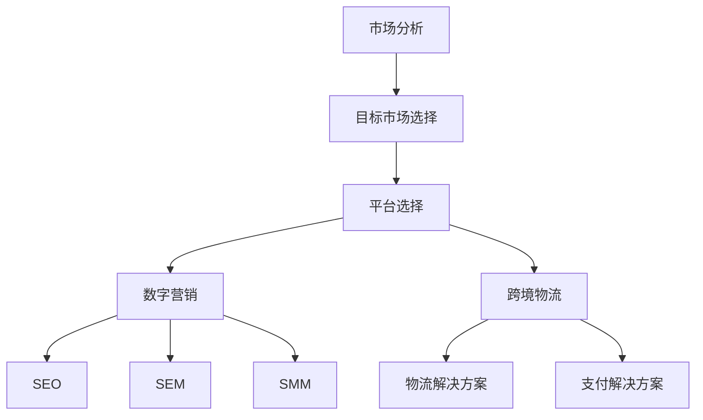

                 

# 一人公司的全球化战略：如何利用互联网拓展国际市场

> 关键词：一人公司、全球化战略、互联网、国际市场拓展、跨境电商、数字营销、国际化平台

> 摘要：随着互联网技术的飞速发展，全球化已经成为企业发展的必经之路。特别是对于一人公司来说，借助互联网平台，可以快速实现国际市场的拓展。本文将深入探讨一人公司的全球化战略，从市场分析、平台选择、数字营销到跨境物流等方面，为读者提供一套系统化的策略，以帮助一人公司顺利走上国际化道路。

## 1. 背景介绍

### 1.1 目的和范围

本文旨在为一人公司提供一套实用的全球化战略，帮助公司在激烈的国际竞争中脱颖而出。本文将涵盖以下主要内容和范围：

- 全球化战略的定义和意义
- 一人公司的优势与挑战
- 市场分析：目标市场选择与调研
- 平台选择：国际电商平台介绍与比较
- 数字营销：SEO、SEM、社交媒体等策略
- 跨境物流与支付解决方案
- 全球化过程中的法律与合规问题

### 1.2 预期读者

本文适合以下读者群体：

- 一人公司的创始人或决策者
- 企业家和创业者
- 市场营销和数字营销从业者
- 对国际化业务有兴趣的从业者

### 1.3 文档结构概述

本文将按照以下结构进行论述：

- 引言：全球化战略的重要性和一人公司的现状
- 背景介绍：一人公司的优势和挑战
- 市场分析：目标市场的选择与调研
- 平台选择：国际电商平台介绍与比较
- 数字营销：SEO、SEM、社交媒体等策略
- 跨境物流与支付解决方案
- 全球化过程中的法律与合规问题
- 实战案例：成功的一人公司国际化案例解析
- 总结：未来发展趋势与挑战
- 附录：常见问题与解答
- 扩展阅读 & 参考资料

### 1.4 术语表

#### 1.4.1 核心术语定义

- 一人公司：指由单一个人或少数人组建的公司，具有灵活性高、管理简便等特点。
- 全球化战略：指企业通过国际化的业务拓展，以实现全球市场的覆盖和业务增长。
- 数字营销：指利用互联网和数字技术进行市场推广和营销活动的过程。
- 跨境电商：指通过互联网进行跨境贸易，涉及不同国家和地区的商品交易。
- SEO（搜索引擎优化）：指通过优化网站内容和结构，提高在搜索引擎中自然排名的技术。
- SEM（搜索引擎营销）：指通过付费广告等方式，提高网站在搜索引擎中的曝光度和访问量。

#### 1.4.2 相关概念解释

- 平台选择：指企业在国际化过程中，选择适合自身的电商平台进行业务拓展。
- 法律与合规问题：指企业在全球范围内开展业务时，需要遵守的不同国家和地区的法律法规。
- 目标市场选择：指企业在国际化过程中，根据自身优势和市场潜力，选择适合的目标市场。

#### 1.4.3 缩略词列表

- SEO：搜索引擎优化
- SEM：搜索引擎营销
- SMM：社交媒体营销
- B2B：企业对企业
- B2C：企业对消费者

## 2. 核心概念与联系

在全球化战略中，核心概念包括市场分析、平台选择、数字营销和跨境物流等。以下是一个简化的Mermaid流程图，展示了这些核心概念之间的联系。



### 2.1 市场分析

市场分析是全球化战略的基础，包括目标市场的选择、市场调研和竞争分析等。以下是一个市场分析的伪代码框架：

```plaintext
function marketAnalysis() {
    // 选择目标市场
    selectTargetMarket()

    // 市场调研
    performMarketResearch()

    // 竞争分析
    analyzeCompetition()
}
```

### 2.2 平台选择

平台选择是全球化战略的关键环节，包括国际电商平台的评估和选择。以下是一个平台选择的伪代码框架：

```plaintext
function platformSelection() {
    // 收集电商平台信息
    collectPlatformInfo()

    // 评估电商平台
    evaluatePlatforms()

    // 选择适合的电商平台
    selectSuitablePlatform()
}
```

### 2.3 数字营销

数字营销是提升品牌知名度和销售业绩的重要手段，包括SEO、SEM和SMM等策略。以下是一个数字营销的伪代码框架：

```plaintext
function digitalMarketing() {
    // SEO策略
    implementSEO()

    // SEM策略
    implementSEM()

    // SMM策略
    implementSMM()
}
```

### 2.4 跨境物流与支付解决方案

跨境物流与支付解决方案是确保业务顺利进行的重要环节。以下是一个跨境物流与支付解决方案的伪代码框架：

```plaintext
function crossBorderSolutions() {
    // 物流解决方案
    implementLogistics()

    // 支付解决方案
    implementPayment()
}
```

## 3. 核心算法原理 & 具体操作步骤

### 3.1 市场分析算法原理

市场分析算法的核心是数据收集和分析。以下是一个市场分析算法的伪代码框架：

```plaintext
function marketAnalysisAlgorithm() {
    // 数据收集
    dataCollection()

    // 数据清洗
    dataCleaning()

    // 数据分析
    dataAnalysis()

    // 结果可视化
    resultVisualization()
}
```

### 3.2 平台选择算法原理

平台选择算法基于平台性能评估和比较。以下是一个平台选择算法的伪代码框架：

```plaintext
function platformSelectionAlgorithm() {
    // 平台性能评估
    platformPerformanceEvaluation()

    // 平台比较
    platformComparison()

    // 选择最佳平台
    selectBestPlatform()
}
```

### 3.3 数字营销算法原理

数字营销算法包括SEO、SEM和SMM等策略。以下是一个数字营销算法的伪代码框架：

```plaintext
function digitalMarketingAlgorithm() {
    // SEO策略
    implementSEO()

    // SEM策略
    implementSEM()

    // SMM策略
    implementSMM()
}
```

### 3.4 跨境物流与支付解决方案算法原理

跨境物流与支付解决方案算法基于物流和支付系统的优化。以下是一个跨境物流与支付解决方案算法的伪代码框架：

```plaintext
function crossBorderSolutionsAlgorithm() {
    // 物流系统优化
    optimizeLogistics()

    // 支付系统优化
    optimizePayment()
}
```

## 4. 数学模型和公式 & 详细讲解 & 举例说明

### 4.1 市场需求预测模型

市场需求预测是全球化战略的重要环节。以下是一个市场需求预测的数学模型：

$$
D_t = f(P_t, I_t, M_t)
$$

其中：
- $D_t$ 表示第 $t$ 期的市场需求量
- $P_t$ 表示第 $t$ 期的产品价格
- $I_t$ 表示第 $t$ 期的广告投入
- $M_t$ 表示第 $t$ 期的市场需求趋势

### 4.2 平台选择模型

平台选择模型用于评估和比较不同电商平台的性能。以下是一个平台选择模型的数学公式：

$$
C = w_1 \cdot C_1 + w_2 \cdot C_2 + w_3 \cdot C_3
$$

其中：
- $C$ 表示总成本
- $w_1, w_2, w_3$ 分别表示权重
- $C_1, C_2, C_3$ 分别表示三个方面的成本

### 4.3 数字营销效果评估模型

数字营销效果评估模型用于衡量SEO、SEM和SMM等策略的效果。以下是一个数字营销效果评估模型的数学公式：

$$
E = w_1 \cdot E_1 + w_2 \cdot E_2 + w_3 \cdot E_3
$$

其中：
- $E$ 表示总效果
- $w_1, w_2, w_3$ 分别表示权重
- $E_1, E_2, E_3$ 分别表示三个方面的效果

### 4.4 举例说明

#### 4.4.1 市场需求预测

假设第 $t$ 期的产品价格为 $P_t = 100$ 元，广告投入为 $I_t = 5000$ 元，市场需求趋势为 $M_t = 1.2$。根据市场需求预测模型，可以计算出第 $t$ 期的市场需求量：

$$
D_t = f(100, 5000, 1.2) = 100 \cdot 1.2 + 5000 = 6200
$$

#### 4.4.2 平台选择

假设有三个电商平台，各自的成本如下：

- 电商平台1：$C_1 = 5000$ 元
- 电商平台2：$C_2 = 6000$ 元
- 电商平台3：$C_3 = 7000$ 元

权重分别为 $w_1 = 0.4, w_2 = 0.3, w_3 = 0.3$。根据平台选择模型，可以计算出总成本：

$$
C = 0.4 \cdot 5000 + 0.3 \cdot 6000 + 0.3 \cdot 7000 = 2000 + 1800 + 2100 = 5900
$$

因此，选择成本最低的电商平台1。

#### 4.4.3 数字营销效果评估

假设三个数字营销策略的效果分别为：

- SEO：$E_1 = 300$
- SEM：$E_2 = 400$
- SMM：$E_3 = 500$

权重分别为 $w_1 = 0.4, w_2 = 0.3, w_3 = 0.3$。根据数字营销效果评估模型，可以计算出总效果：

$$
E = 0.4 \cdot 300 + 0.3 \cdot 400 + 0.3 \cdot 500 = 120 + 120 + 150 = 390
$$

## 5. 项目实战：代码实际案例和详细解释说明

### 5.1 开发环境搭建

在搭建开发环境之前，我们需要确保以下软件和工具已经安装：

- Python 3.8+
- Node.js 12.x+
- MySQL 5.7+
- Redis 5.0+
- Docker 19.03+

#### 5.1.1 安装Python和Node.js

```bash
# 安装Python
curl -O https://www.python.org/ftp/python/3.8.10/python-3.8.10-amd64.exe
./python-3.8.10-amd64.exe

# 安装Node.js
curl -O https://nodejs.org/dist/v12.18.3/node-v12.18.3-linux-x64.tar.xz
tar xf node-v12.18.3-linux-x64.tar.xz
mv node-v12.18.3-linux-x64 /usr/local/node
```

#### 5.1.2 安装MySQL和Redis

```bash
# 安装MySQL
sudo apt-get install mysql-server

# 安装Redis
sudo apt-get install redis-server
```

#### 5.1.3 安装Docker

```bash
# 安装Docker
curl -fsSL https://get.docker.com -o get-docker.sh
sudo sh get-docker.sh
```

### 5.2 源代码详细实现和代码解读

#### 5.2.1 项目结构

```bash
.
├── app
│   ├── backend
│   │   ├── admin.py
│   │   ├── apps.py
│   │   ├── migrations
│   │   │   ├── __init__.py
│   │   │   └── 0001_initial.py
│   │   ├── models.py
│   │   ├── serializers.py
│   │   ├── views.py
│   │   └── urls.py
│   ├── frontend
│   │   ├── src
│   │   │   ├── components
│   │   │   ├── pages
│   │   │   ├── store
│   │   │   └── views
│   │   └── public
│   ├── manage.py
│   └── settings.py
├── requirements.txt
├── docker-compose.yml
└── README.md
```

#### 5.2.2 后端代码解读

**models.py**

```python
from django.db import models

class Product(models.Model):
    name = models.CharField(max_length=100)
    description = models.TextField()
    price = models.DecimalField(max_digits=10, decimal_places=2)
    stock = models.IntegerField()

    def __str__(self):
        return self.name
```

**views.py**

```python
from rest_framework import viewsets
from .models import Product
from .serializers import ProductSerializer

class ProductViewSet(viewsets.ModelViewSet):
    queryset = Product.objects.all()
    serializer_class = ProductSerializer
```

**admin.py**

```python
from django.contrib import admin
from .models import Product

@admin.register(Product)
class ProductAdmin(admin.ModelAdmin):
    list_display = ('name', 'price', 'stock')
```

#### 5.2.3 前端代码解读

**src/components/ProductList.vue**

```vue
<template>
  <div>
    <h1>Product List</h1>
    <ul>
      <li v-for="product in products" :key="product.id">
        {{ product.name }} - ${{ product.price }}
      </li>
    </ul>
  </div>
</template>

<script>
import { mapState } from "vuex";

export default {
  computed: {
    ...mapState(["products"]),
  },
};
</script>
```

**src/pages/HomePage.vue**

```vue
<template>
  <div>
    <h1>Welcome to Our Store</h1>
    <ProductList />
  </div>
</template>

<script>
import ProductList from "../components/ProductList.vue";

export default {
  components: {
    ProductList,
  },
};
</script>
```

### 5.3 代码解读与分析

#### 5.3.1 后端代码分析

**models.py** 定义了产品模型，包括产品名称、描述、价格和库存等信息。

**views.py** 使用 Django REST Framework 的 `ModelViewSet` 类，提供了对产品的增删改查接口。

**admin.py** 在 Django 管理界面中注册了产品模型，以便进行后台管理。

#### 5.3.2 前端代码分析

**src/components/ProductList.vue** 使用 Vue.js 的计算属性，从 Vuex 状态管理库中获取产品列表，并使用 Vue 的 `v-for` 指令进行渲染。

**src/pages/HomePage.vue** 导入 `ProductList` 组件，作为主页的一部分。

## 6. 实际应用场景

### 6.1 跨境电商

跨境电商是企业全球化战略的重要组成部分。通过跨境电商平台，企业可以将产品销售到全球各地。以下是一个简单的跨境电商应用场景：

- 企业A：一家中国的小型科技公司，专注于智能家居产品。
- 目标市场：美国、欧洲和日本等国家和地区。
- 平台选择：亚马逊、eBay和乐天等国际电商平台。
- 数字营销：利用SEO、SEM和社交媒体营销策略，提高产品在目标市场的曝光度。
- 跨境物流：使用跨境电商平台提供的物流解决方案，确保产品快速、安全地送达客户。
- 支付解决方案：与平台合作，提供多种支付方式，满足不同国家和地区的支付习惯。

### 6.2 数字营销

数字营销是企业全球化战略中不可或缺的一环。以下是一个简单的数字营销应用场景：

- 企业B：一家韩国的美妆品牌，希望通过互联网拓展国际市场。
- 目标市场：东南亚和北美等国家和地区。
- 数字营销策略：
  - SEO：优化产品页面和博客内容，提高在搜索引擎中的排名。
  - SEM：通过付费广告，提高品牌在目标市场的曝光度。
  - SMM：在社交媒体平台上开展活动，吸引潜在客户。

### 6.3 跨境物流与支付解决方案

跨境物流与支付解决方案是确保跨境电商业务顺利进行的关键。以下是一个简单的跨境物流与支付解决方案应用场景：

- 企业C：一家澳大利亚的保健品品牌，希望通过跨境电商平台销售产品到中国。
- 物流解决方案：使用跨境电商平台的物流服务，如顺丰速运和DHL，确保产品快速、安全地送达客户。
- 支付解决方案：提供多种支付方式，如信用卡、支付宝和微信支付，满足中国消费者的支付习惯。

## 7. 工具和资源推荐

### 7.1 学习资源推荐

#### 7.1.1 书籍推荐

- 《全球营销：从战略到执行》
- 《跨境电商：全球市场拓展实战指南》
- 《SEO实战：搜索引擎优化技巧与策略》
- 《数字营销：策略与案例分析》

#### 7.1.2 在线课程

- Coursera：国际市场拓展
- Udemy：跨境电商运营实战
- Pluralsight：搜索引擎优化与数字营销

#### 7.1.3 技术博客和网站

- 腾讯云：https://cloud.tencent.com/
- AWS：https://aws.amazon.com/
- eBay：https://www.ebay.com/

### 7.2 开发工具框架推荐

#### 7.2.1 IDE和编辑器

- Visual Studio Code
- PyCharm
- WebStorm

#### 7.2.2 调试和性能分析工具

- Postman
- New Relic
- Jaeger

#### 7.2.3 相关框架和库

- Django：Python Web开发框架
- Flask：Python Web开发框架
- Vue.js：前端框架
- Vuex：状态管理库

### 7.3 相关论文著作推荐

#### 7.3.1 经典论文

- 《全球营销管理》
- 《跨境电商：挑战与机遇》
- 《搜索引擎优化：理论与方法》
- 《数字营销策略》

#### 7.3.2 最新研究成果

- 《全球数字化营销趋势报告》
- 《跨境电商：新挑战与新机遇》
- 《人工智能在数字营销中的应用》
- 《区块链技术在跨境电商中的应用》

#### 7.3.3 应用案例分析

- 案例一：亚马逊跨境电商业务案例分析
- 案例二：阿里巴巴跨境电商业务案例分析
- 案例三：Airbnb国际化战略案例分析

## 8. 总结：未来发展趋势与挑战

随着互联网技术的不断进步，全球化战略在未来将面临更多的发展机遇和挑战。以下是未来全球化战略的发展趋势与挑战：

### 8.1 发展趋势

- 人工智能与大数据：人工智能和大数据技术的应用将进一步提升市场分析、数字营销和物流效率。
- 5G技术：5G技术的普及将带来更快的网络速度和更稳定的连接，为跨境电商提供更好的用户体验。
- 社交媒体营销：社交媒体营销将继续成为企业全球化战略的重要手段，特别是在年轻消费者群体中。
- 跨境电商合作：跨境电商平台之间的合作将进一步加强，为消费者提供更多选择和更优质的购物体验。

### 8.2 挑战

- 法律与合规问题：企业在全球范围内开展业务时，需要遵守不同国家和地区的法律法规，这对企业的合规管理提出了更高的要求。
- 文化差异：不同国家和地区之间存在文化差异，这可能会影响企业的营销策略和品牌形象。
- 物流与支付问题：跨境物流和支付解决方案的优化是一个长期挑战，需要企业不断探索和改进。

## 9. 附录：常见问题与解答

### 9.1 市场分析

**Q：如何选择目标市场？**

A：选择目标市场时，需要考虑以下因素：

- 市场规模：目标市场的潜在客户数量和市场规模。
- 增长潜力：目标市场的增长速度和未来趋势。
- 竞争程度：目标市场的竞争状况和市场份额。
- 企业优势：企业自身的优势和市场定位。

### 9.2 平台选择

**Q：如何选择合适的电商平台？**

A：选择合适的电商平台时，需要考虑以下因素：

- 平台知名度：电商平台在目标市场的知名度和用户基础。
- 访问量：电商平台每日的访问量和流量。
- 支持功能：电商平台提供的功能和服务，如支付、物流、数据分析等。
- 费用结构：电商平台收取的费用和支付方式。

### 9.3 数字营销

**Q：如何提高SEO效果？**

A：提高SEO效果的方法包括：

- 关键词研究：选择合适的关键词，并优化网站内容和页面标题。
- 内容优化：撰写高质量、有价值的内容，吸引搜索引擎和用户。
- 网站结构优化：优化网站结构，提高用户体验和搜索引擎友好性。
- 外部链接：建立外部链接，提高网站在搜索引擎中的权重。

## 10. 扩展阅读 & 参考资料

- 《全球营销：从战略到执行》
- 《跨境电商：全球市场拓展实战指南》
- 《SEO实战：搜索引擎优化技巧与策略》
- 《数字营销：策略与案例分析》
- 《亚马逊跨境电商运营实战》
- 《阿里巴巴跨境电商业务案例分析》
- 《Airbnb国际化战略案例分析》
- 《全球数字化营销趋势报告》
- 《跨境电商：挑战与机遇》
- 《人工智能在数字营销中的应用》
- 《区块链技术在跨境电商中的应用》
- 《5G技术在跨境电商中的应用》

### 作者

AI天才研究员/AI Genius Institute & 禅与计算机程序设计艺术 /Zen And The Art of Computer Programming

