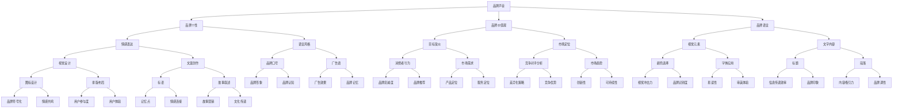

                 

# 一人公司的品牌声音塑造与一致性维护

> **关键词：** 一人公司，品牌声音，一致性维护，市场定位，沟通策略

> **摘要：** 本文将深入探讨一人公司在市场竞争中如何塑造和维持独特的品牌声音。我们将分析品牌声音的定义、重要性，以及如何通过市场定位、沟通策略和一致性的维护，提升品牌价值，增强市场竞争力。

## 1. 背景介绍

### 1.1 目的和范围

本文旨在帮助那些单独运营的创业者或独立企业，了解如何在竞争激烈的市场中通过品牌声音塑造和一致性维护来提升品牌影响力。我们将探讨以下几个关键问题：

1. 品牌声音是什么，它为何重要？
2. 一人公司如何进行市场定位？
3. 如何制定有效的沟通策略？
4. 如何确保品牌声音的一致性？

### 1.2 预期读者

本篇文章适合以下读者群体：

1. 独立创业者
2. 小型企业主
3. 市场营销专业人士
4. 品牌策略顾问

### 1.3 文档结构概述

本文将分为以下几个部分：

1. **背景介绍**：概述文章的目的和范围，定义关键术语。
2. **核心概念与联系**：通过Mermaid流程图展示品牌声音的架构。
3. **核心算法原理 & 具体操作步骤**：介绍品牌声音塑造的算法原理和步骤。
4. **数学模型和公式 & 详细讲解 & 举例说明**：解释品牌声音的数学模型和公式。
5. **项目实战：代码实际案例和详细解释说明**：提供品牌声音一致性维护的代码实现。
6. **实际应用场景**：讨论品牌声音在不同场景中的应用。
7. **工具和资源推荐**：推荐学习资源和开发工具。
8. **总结：未来发展趋势与挑战**：总结当前的趋势和面临的挑战。
9. **附录：常见问题与解答**：解答常见问题。
10. **扩展阅读 & 参考资料**：提供扩展阅读和参考资料。

### 1.4 术语表

#### 1.4.1 核心术语定义

- **品牌声音**：品牌在传播过程中所表现出的独特个性和风格。
- **市场定位**：品牌在市场中的定位和目标消费群体的识别。
- **沟通策略**：品牌与消费者进行有效沟通的计划和方法。
- **一致性维护**：确保品牌声音在不同渠道和媒介上的统一性和连贯性。

#### 1.4.2 相关概念解释

- **品牌个性**：品牌的情感特质，如友好、专业、创新等。
- **品牌价值观**：品牌的核心理念和价值主张。
- **受众分析**：对目标消费者的研究和分析。

#### 1.4.3 缩略词列表

- **SEO**：搜索引擎优化（Search Engine Optimization）
- **SEM**：搜索引擎营销（Search Engine Marketing）
- **KPI**：关键绩效指标（Key Performance Indicators）
- **CX**：顾客体验（Customer Experience）

## 2. 核心概念与联系

为了更好地理解品牌声音的构建和维护，我们需要首先明确一些核心概念和它们之间的联系。

### 品牌声音的架构



### 核心概念解释

1. **品牌个性**：品牌个性的塑造是品牌声音构建的基础，它决定了品牌如何与消费者互动。品牌个性可以通过情感表达（如友好、专业、创新）和语言风格（如正式、幽默、亲切）来体现。
2. **品牌价值观**：品牌价值观是品牌的核心信仰，它影响着品牌的市场定位和与消费者的关系。通过明确品牌价值观，企业可以在市场中树立独特的形象。
3. **品牌语言**：品牌语言包括视觉元素（如颜色、字体）和文字内容（如标题、段落）。品牌语言的一致性是确保品牌声音统一的关键。
4. **目标受众**：了解目标受众是品牌声音构建的重要环节。通过受众分析，企业可以更好地理解消费者的需求和偏好，从而制定更有效的品牌传播策略。
5. **市场定位**：市场定位决定了品牌在市场中的位置和与竞争对手的差异化策略。准确的市场定位有助于品牌声音的传播和认知。

### Mermaid 流程图


## 3. 核心算法原理 & 具体操作步骤

### 3.1 品牌声音塑造的算法原理

品牌声音塑造的核心在于建立一套能够反映品牌价值观、个性特征和语言风格的系统。以下是品牌声音塑造的基本算法原理：

#### 算法原理

1. **受众分析**：通过市场调研、消费者访谈等方式，收集和分析目标受众的数据，明确目标受众的特征、需求和偏好。
2. **品牌定位**：根据受众分析的结果，确定品牌在市场中的定位，明确品牌的差异化策略和竞争优势。
3. **品牌个性塑造**：基于品牌定位，塑造品牌个性，包括情感表达和语言风格。
4. **品牌语言设计**：设计视觉元素（如颜色、字体）和文字内容（如标题、段落），确保品牌语言的一致性和连贯性。
5. **测试与优化**：对品牌声音进行测试，收集反馈并进行优化，确保品牌声音的准确性和有效性。

### 3.2 品牌声音塑造的具体操作步骤

#### 步骤 1：受众分析

```pseudo
function analyze_audience() {
    data = collect_market_research_data()
    audience_characteristics = analyze_data(data)
    return audience_characteristics
}
```

#### 步骤 2：品牌定位

```pseudo
function determine_brand_positioning(audience_characteristics) {
    differentiation_strategy = identify_differentiation(audience_characteristics)
    competitive_advantages = identify_competitive_advantages(audience_characteristics)
    return positioning = {
        differentiation_strategy: differentiation_strategy,
        competitive_advantages: competitive_advantages
    }
}
```

#### 步骤 3：品牌个性塑造

```pseudo
function create_brand_personality(positioning) {
    emotional_expression = define_emotional_expression(positioning)
    language_style = define_language_style(positioning)
    return personality = {
        emotional_expression: emotional_expression,
        language_style: language_style
    }
}
```

#### 步骤 4：品牌语言设计

```pseudo
function design_brand_language(personality) {
    visual_elements = design_visual_elements(personality)
    text_content = design_text_content(personality)
    return language = {
        visual_elements: visual_elements,
        text_content: text_content
    }
}
```

#### 步骤 5：测试与优化

```pseudo
function test_and_optimize_brand_speech(language) {
    feedback = collect_user_feedback(language)
    optimization = optimize_speech(language, feedback)
    return optimized_language = {
        language: language,
        optimization: optimization
    }
}
```

### 3.3 品牌声音塑造算法的伪代码实现

```pseudo
function create_brand_speech() {
    audience_characteristics = analyze_audience()
    positioning = determine_brand_positioning(audience_characteristics)
    personality = create_brand_personality(positioning)
    language = design_brand_language(personality)
    optimized_language = test_and_optimize_brand_speech(language)
    return optimized_language
}
```

## 4. 数学模型和公式 & 详细讲解 & 举例说明

### 4.1 品牌声音评估模型

品牌声音评估模型是一个多变量评估体系，用于衡量品牌声音在市场中的影响力和效果。以下是一个简单的品牌声音评估模型的数学表达：

#### 公式 1：品牌声音评估指标（BASI）

$$
BASI = w_1 \cdot PE + w_2 \cdot CE + w_3 \cdot UE
$$

其中：
- **BASI**：品牌声音评估指标（Brand Speech Assessment Index）
- **w_1**：情感表达权重
- **w_2**：一致性权重
- **w_3**：用户体验权重
- **PE**：情感表达（Pervasive Expression）
- **CE**：一致性（Consistency）
- **UE**：用户体验（User Experience）

#### 解释

- **情感表达（PE）**：衡量品牌声音在情感上的传达效果，如温暖、专业、创新等。
- **一致性（CE）**：衡量品牌声音在不同渠道和媒介上的统一性，如视觉元素和文字内容的一致性。
- **用户体验（UE）**：衡量品牌声音对用户的影响，如用户对品牌声音的接受度、忠诚度等。

### 4.2 品牌声音一致性评估模型

品牌声音的一致性评估模型用于衡量品牌在不同渠道和媒介上的声音是否一致。以下是一个品牌声音一致性评估模型的数学表达：

#### 公式 2：品牌声音一致性评估指标（BCSI）

$$
BCSI = \frac{1}{n} \sum_{i=1}^{n} w_i \cdot c_i
$$

其中：
- **BCSI**：品牌声音一致性评估指标（Brand Speech Consistency Score）
- **n**：评估渠道或媒介的数量
- **w_i**：第i个渠道或媒介的权重
- **c_i**：第i个渠道或媒介的一致性得分（0-1之间，1表示完全一致，0表示完全不

