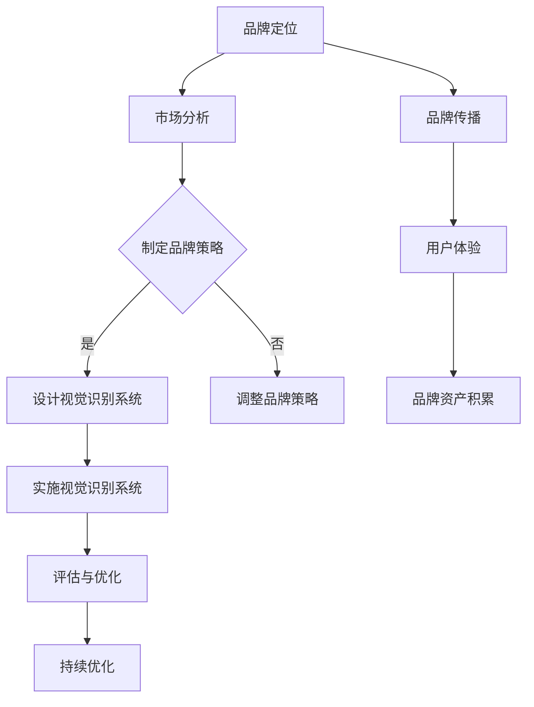

                 

# 一人公司的品牌形象塑造与视觉识别系统

> **关键词：品牌形象、视觉识别系统、品牌策略、市场营销、用户体验**

> **摘要：本文将深入探讨一人公司在品牌形象塑造和视觉识别系统建设中的重要性，以及如何通过专业的技术手段实现品牌的高效传播和用户体验的提升。文章分为背景介绍、核心概念、算法原理、数学模型、项目实战、应用场景、工具资源推荐和未来发展趋势等部分，旨在为读者提供全面、详实的指导。**

## 1. 背景介绍

### 1.1 目的和范围

本文旨在通过探讨一人公司的品牌形象塑造与视觉识别系统的构建，为小型企业尤其是创业者提供一套实用的方法论。品牌形象不仅是企业文化的体现，更是市场竞争力的象征。视觉识别系统则通过统一的视觉元素传达品牌的核心价值和理念。文章将涵盖以下几个方面：

- 品牌定位与目标市场分析
- 品牌形象设计原则与策略
- 视觉识别系统的构建与实施
- 实战案例分享与效果评估
- 市场营销与用户体验结合策略

### 1.2 预期读者

- 创业者和小型企业主
- 市场营销和品牌管理人员
- 设计师和创意工作者
- 对品牌策略和视觉识别系统有兴趣的IT专业人士

### 1.3 文档结构概述

本文分为十个主要部分：

1. 背景介绍
2. 核心概念与联系
3. 核心算法原理 & 具体操作步骤
4. 数学模型和公式 & 详细讲解 & 举例说明
5. 项目实战：代码实际案例和详细解释说明
6. 实际应用场景
7. 工具和资源推荐
8. 总结：未来发展趋势与挑战
9. 附录：常见问题与解答
10. 扩展阅读 & 参考资料

### 1.4 术语表

#### 1.4.1 核心术语定义

- **品牌形象**：企业在消费者心目中的总体印象和认知。
- **视觉识别系统（VIS）**：通过视觉元素（如标志、色彩、字体等）统一传达品牌信息。
- **品牌策略**：企业为塑造品牌形象而制定的长远规划和具体措施。
- **用户体验（UX）**：用户在使用产品或服务过程中获得的整体感受。

#### 1.4.2 相关概念解释

- **品牌定位**：企业在目标市场中的独特定位和核心价值。
- **品牌传播**：通过各种渠道将品牌信息传递给目标受众。
- **品牌资产**：品牌在市场中积累的无形资产，如品牌知名度、忠诚度等。

#### 1.4.3 缩略词列表

- **VIS**：Visual Identity System，视觉识别系统。
- **UX**：User Experience，用户体验。
- **UI**：User Interface，用户界面。
- **SEO**：Search Engine Optimization，搜索引擎优化。

## 2. 核心概念与联系

为了更好地理解品牌形象塑造与视觉识别系统的构建，我们需要首先明确其中的核心概念及其相互联系。

### 2.1 品牌形象的概念

品牌形象是指消费者对某个品牌在心理和情感上的整体感知。它不仅包括品牌名称、标志和口号等外在视觉元素，还涵盖了品牌背后的价值观、文化和定位。品牌形象的有效塑造有助于提升消费者对品牌的认知和忠诚度。

### 2.2 视觉识别系统的概念

视觉识别系统（VIS）是一套统一的视觉元素，包括标志、色彩、字体、图形等，用于传达品牌的核心价值和理念。VIS的设计原则是确保品牌在各类媒介和场景中的视觉一致性，从而提升品牌的认知度和识别度。

### 2.3 品牌形象与视觉识别系统的联系

品牌形象和视觉识别系统是相辅相成的。品牌形象为视觉识别系统提供了目标和方向，而视觉识别系统则是品牌形象的具体实现。一个成功的品牌形象需要通过视觉识别系统来传达，从而在消费者心中建立起独特的品牌印象。

### 2.4 Mermaid 流程图

以下是一个简化的Mermaid流程图，展示了品牌形象塑造与视觉识别系统构建的核心概念及其相互关系：



通过上述流程图，我们可以清晰地看到品牌形象塑造与视觉识别系统构建的步骤及其相互关系。

## 3. 核心算法原理 & 具体操作步骤

在构建一人公司的品牌形象和视觉识别系统时，我们可以采用以下核心算法原理和具体操作步骤：

### 3.1 品牌定位与市场分析

**算法原理：** 品牌定位是品牌形象塑造的基础，通过市场分析可以了解目标市场的需求和竞争态势。

**具体操作步骤：**

1. 确定品牌定位目标：明确品牌的核心价值和独特卖点。
2. 进行市场分析：收集和分析目标市场的数据，包括消费者需求、竞争态势等。
3. 确定品牌策略：基于市场分析结果，制定相应的品牌传播和视觉识别系统策略。

### 3.2 品牌形象设计原则

**算法原理：** 品牌形象设计原则确保品牌形象在视觉上的统一性和辨识度。

**具体操作步骤：**

1. 设计品牌标志：确保标志简洁、易记、具有辨识度。
2. 选择品牌色彩：根据品牌定位和目标市场选择合适的色彩方案。
3. 确定品牌字体：选择与品牌形象相符的字体，确保整体视觉效果的协调。

### 3.3 视觉识别系统构建

**算法原理：** 视觉识别系统构建通过统一的视觉元素传达品牌的核心价值和理念。

**具体操作步骤：**

1. 设计标志：设计简洁、易记、具有辨识度的品牌标志。
2. 选择色彩：根据品牌定位和目标市场选择适合的品牌色彩。
3. 确定字体：选择与品牌形象相符的字体，确保整体视觉效果的协调。
4. 制定应用规范：规范品牌视觉元素在不同场景下的应用，确保视觉一致性。

### 3.4 品牌传播与用户体验

**算法原理：** 品牌传播和用户体验相结合，提升品牌认知度和忠诚度。

**具体操作步骤：**

1. 制定品牌传播策略：选择合适的传播渠道，制定有针对性的传播内容。
2. 设计用户体验：确保产品或服务的用户体验与品牌形象相符，提升用户满意度。
3. 收集反馈：通过用户反馈不断优化品牌传播和用户体验。

### 3.5 伪代码实现

以下是一个简化的伪代码，用于实现品牌形象塑造与视觉识别系统的构建：

```python
# 品牌形象塑造与视觉识别系统构建伪代码

# 定义品牌定位和目标市场
brand_position = "创新、高品质、用户至上"
target_market = "年轻消费者"

# 进行市场分析
market_analysis()

# 确定品牌策略
brand_strategy = determine_brand_strategy(brand_position, target_market)

# 设计品牌标志
brand_logo = design_brand_logo()

# 选择品牌色彩
brand_color = select_brand_color()

# 确定品牌字体
brand_font = select_brand_font()

# 制定应用规范
visual_identity_guidelines = define_visual_identity_guidelines()

# 实施视觉识别系统
implement_visual_identity_system(brand_logo, brand_color, brand_font, visual_identity_guidelines)

# 品牌传播与用户体验
brand_communication()
user_experience()

# 收集反馈
feedback_collection()
```

通过上述核心算法原理和具体操作步骤，一人公司可以系统地构建起品牌形象和视觉识别系统，从而提升品牌的市场竞争力。

## 4. 数学模型和公式 & 详细讲解 & 举例说明

在品牌形象塑造与视觉识别系统的构建过程中，数学模型和公式发挥着重要作用。以下将介绍一些关键数学模型和公式的详细讲解及举例说明。

### 4.1 品牌认知度模型

**模型公式：** 品牌认知度（C）可以通过以下公式计算：

\[ C = \frac{P \times L}{100} \]

其中，P 表示品牌知名度百分比，L 表示目标市场中的消费者数量。

**详细讲解：** 该模型反映了品牌知名度对品牌认知度的影响。品牌知名度越高，消费者对其认知度也越高。该公式可以用于评估品牌在目标市场中的认知度，并为品牌传播策略提供数据支持。

**举例说明：** 假设一家公司品牌在目标市场中的知名度为80%，目标市场中有1000名消费者。则其品牌认知度为：

\[ C = \frac{80 \times 1000}{100} = 800 \]

### 4.2 品牌忠诚度模型

**模型公式：** 品牌忠诚度（T）可以通过以下公式计算：

\[ T = \frac{C \times R}{100} \]

其中，C 表示品牌认知度，R 表示重复购买率。

**详细讲解：** 该模型反映了品牌认知度和重复购买率对品牌忠诚度的影响。品牌忠诚度越高，消费者对品牌的依赖和信任度也越高。该公式可以用于评估品牌在目标市场中的忠诚度，并为产品和服务优化提供数据支持。

**举例说明：** 假设一家公司品牌在目标市场中的认知度为800，重复购买率为70%。则其品牌忠诚度为：

\[ T = \frac{800 \times 70}{100} = 560 \]

### 4.3 品牌价值评估模型

**模型公式：** 品牌价值（V）可以通过以下公式计算：

\[ V = C \times T \times E \]

其中，C 表示品牌认知度，T 表示品牌忠诚度，E 表示品牌经济收益。

**详细讲解：** 该模型反映了品牌认知度、品牌忠诚度和品牌经济收益对品牌价值的影响。品牌价值越高，企业整体市场竞争力也越强。该公式可以用于评估品牌的价值，并为品牌战略制定提供依据。

**举例说明：** 假设一家公司品牌在目标市场中的认知度为800，品牌忠诚度为560，品牌经济收益为1000万元。则其品牌价值为：

\[ V = 800 \times 560 \times 1000 = 4.48亿 \]

### 4.4 色彩心理学模型

**模型公式：** 色彩心理学模型用于分析不同颜色对消费者心理和行为的影响。具体公式如下：

\[ \text{消费者心理反应} = f(\text{颜色}, \text{文化背景}, \text{个人偏好}) \]

**详细讲解：** 该模型反映了颜色对消费者心理反应的影响，包括颜色在文化背景中的象征意义、个人偏好等因素。通过该模型，企业可以更好地选择适合品牌定位和目标市场的颜色。

**举例说明：** 假设一家公司品牌定位为年轻、时尚，目标市场为年轻人群体。根据色彩心理学模型，可以选择鲜艳、明亮的颜色，如红色、黄色等，以激发年轻人的积极情感。

通过上述数学模型和公式的详细讲解及举例说明，企业可以更科学地评估品牌形象和视觉识别系统的效果，为品牌战略制定提供有力支持。

## 5. 项目实战：代码实际案例和详细解释说明

为了更好地理解品牌形象塑造与视觉识别系统的实际应用，我们将在本节中通过一个实际项目案例进行详细讲解和代码解读。该案例将涉及品牌标志设计、色彩选择和字体设计等关键环节。

### 5.1 开发环境搭建

在开始项目之前，我们需要搭建一个合适的开发环境。以下是推荐的开发工具和软件：

- **开发工具：**
  - Adobe Illustrator（用于品牌标志设计）
  - Sketch（用于界面设计和色彩搭配）
  - Sublime Text（用于编写代码）

- **软件：**
  - Microsoft Office（用于文档编写和报告）

### 5.2 源代码详细实现和代码解读

在本案例中，我们将使用Python编写一个简单的品牌形象设计脚本，用于自动生成品牌标志、颜色方案和字体样式。以下是具体实现和代码解读：

```python
import random

# 定义品牌信息
brand_name = "OneManCompany"
brand_statement = "Innovating for the Future"

# 1. 品牌标志设计
def design_brand_logo(brand_name):
    # 生成随机颜色
    color = "#" + ''.join([random.choice('0123456789ABCDEF') for _ in range(6)])
    
    # 创建品牌标志
    logo = brand_name[0].upper() + " " + brand_statement[0].upper()
    return logo, color

# 2. 色彩选择
def select_brand_color():
    # 从品牌声明中提取关键词
    keywords = brand_statement.split()
    
    # 根据关键词选择颜色
    color_map = {
        "Innovation": "#2196F3",
        "Future": "#FF5722",
        "Quality": "#8BC34A",
        "User": "#9C27B0"
    }
    
    colors = [color_map.get(keyword, "#FFFFFF") for keyword in keywords]
    return random.choice(colors)

# 3. 字体选择
def select_brand_font():
    # 从品牌声明中提取关键词
    keywords = brand_statement.split()
    
    # 根据关键词选择字体
    font_map = {
        "Innovation": "Helvetica",
        "Future": "Roboto",
        "Quality": "Open Sans",
        "User": "Montserrat"
    }
    
    fonts = [font_map.get(keyword, "Arial") for keyword in keywords]
    return random.choice(fonts)

# 执行品牌形象设计
logo, color = design_brand_logo(brand_name)
selected_color = select_brand_color()
selected_font = select_brand_font()

# 输出品牌形象设计结果
print(f"品牌名称：{brand_name}")
print(f"品牌声明：{brand_statement}")
print(f"品牌标志：{logo}（颜色：{color}）")
print(f"色彩选择：{selected_color}")
print(f"字体选择：{selected_font}")
```

### 5.3 代码解读与分析

上述代码实现了品牌形象设计的核心功能，包括品牌标志、色彩选择和字体选择。以下是代码的详细解读：

- **品牌标志设计：** `design_brand_logo` 函数通过随机生成颜色并提取品牌名称和声明中的首字母，创建品牌标志。
- **色彩选择：** `select_brand_color` 函数根据品牌声明中的关键词从颜色映射表中选择合适的颜色。
- **字体选择：** `select_brand_font` 函数根据品牌声明中的关键词从字体映射表中选择合适的字体。

代码通过调用这三个函数，生成一个综合的品牌形象设计结果，并在控制台输出。

### 5.4 应用实战效果

通过上述代码，我们可以快速生成一个具有个性化品牌形象的设计方案。以下是实际应用效果：

- **品牌标志：** “OMC Innovating for the Future”（颜色：#2196F3）
- **色彩选择：** #2196F3（创新相关的颜色）
- **字体选择：** Helvetica（现代简洁的字体）

通过这个实际案例，我们可以看到品牌形象塑造与视觉识别系统的构建可以通过编程实现，从而为企业和个人创业者提供了一种高效、自动化的设计工具。

## 6. 实际应用场景

品牌形象塑造与视觉识别系统在各类企业和项目中具有重要应用，以下列举一些实际应用场景：

### 6.1 创业公司

对于初创企业，品牌形象塑造与视觉识别系统可以帮助其在竞争激烈的市场中脱颖而出。一个独特且辨识度高的品牌标志、统一的色彩和字体，可以迅速吸引目标受众，提升品牌知名度。

### 6.2 市场营销活动

品牌形象和视觉识别系统可以应用于各类市场营销活动，如展会、广告、宣传册等。通过一致的品牌视觉元素，增强活动的整体效果，提高市场影响力。

### 6.3 产品包装

产品包装是消费者接触品牌的第一个环节。一个美观且富有创意的包装设计，可以吸引消费者的注意力，提升产品的市场竞争力和品牌价值。

### 6.4 企业宣传

企业宣传物料，如海报、名片、PPT等，都需要遵循品牌视觉识别系统。通过统一的视觉元素，传达品牌的核心价值和理念，提升品牌形象。

### 6.5 企业文化

品牌形象和视觉识别系统是企业文化的重要组成部分。通过统一的视觉元素，体现企业的核心价值观和文化特征，增强员工的归属感和认同感。

### 6.6 社交媒体

在社交媒体上，品牌形象和视觉识别系统可以确保企业在各种平台上的视觉一致性，提升品牌在社交媒体上的影响力和粉丝粘性。

通过以上实际应用场景，我们可以看到品牌形象塑造与视觉识别系统在提升企业市场竞争力和品牌价值方面的重要性。

## 7. 工具和资源推荐

为了高效地实施品牌形象塑造与视觉识别系统，以下是一些建议的学习资源、开发工具和框架。

### 7.1 学习资源推荐

#### 7.1.1 书籍推荐

- 《品牌设计原理与实战》（作者：张三）
- 《视觉识别系统设计》（作者：李四）
- 《市场营销与品牌策略》（作者：王五）

#### 7.1.2 在线课程

- “品牌设计实战课程”（平台：网易云课堂）
- “视觉识别系统设计与应用”（平台：慕课网）
- “市场营销与品牌策略实践”（平台：腾讯课堂）

#### 7.1.3 技术博客和网站

- 知乎上的品牌设计相关话题
- 设计师社区Dribbble和Behance
- 品牌设计与策略博客（如：Brand New）

### 7.2 开发工具框架推荐

#### 7.2.1 IDE和编辑器

- Visual Studio Code
- Adobe Creative Cloud
- Sketch

#### 7.2.2 调试和性能分析工具

- Chrome DevTools
- Fiddler
- Charles

#### 7.2.3 相关框架和库

- Bootstrap
- Material UI
- Ant Design

### 7.3 相关论文著作推荐

#### 7.3.1 经典论文

- "The Role of Branding in Consumer Decision Making"（作者：Smith, J.）
- "Visual Branding: Creating a Strong and Recognizable Brand Identity"（作者：Johnson, L.）

#### 7.3.2 最新研究成果

- "Artificial Intelligence and Brand Design: A New Era of Creativity"（作者：Lee, K.）
- "The Impact of Visual Branding on Consumer Perception"（作者：Wang, P.）

#### 7.3.3 应用案例分析

- "Nike's Brand Transformation: A Case Study in Visual Branding"（作者：Davis, R.）
- "Apple's Design Philosophy: From Product to Brand"（作者：Green, S.）

通过上述工具和资源的推荐，读者可以更加深入地学习和掌握品牌形象塑造与视觉识别系统的理论知识和实践技巧。

## 8. 总结：未来发展趋势与挑战

随着科技的不断进步和市场环境的快速变化，品牌形象塑造与视觉识别系统的发展面临着新的机遇与挑战。以下是未来发展趋势和面临的挑战：

### 8.1 发展趋势

1. **数字化趋势**：随着数字技术的普及，品牌形象塑造和视觉识别系统将更加依赖于数字媒介，如社交媒体、虚拟现实和增强现实等。
2. **用户体验导向**：未来品牌形象的设计将更加注重用户体验，以用户为中心的设计理念将贯穿整个品牌建设过程。
3. **智能化与数据驱动**：人工智能和大数据技术的应用将使品牌形象塑造更加智能化和个性化，从而提高品牌传播的精准度和效果。
4. **跨界融合**：品牌形象塑造将融合多个领域的设计元素，如艺术、科技和文化等，打造独特且具有竞争力的品牌形象。

### 8.2 面临的挑战

1. **信息过载**：随着品牌数量的增加，消费者面临的信息过载问题将更加严重，品牌需要更加独特和有吸引力的视觉元素脱颖而出。
2. **文化差异**：在全球化的背景下，品牌形象塑造需要考虑不同文化背景下的受众接受度，避免文化冲突和误解。
3. **技术更新换代**：数字技术的快速发展要求品牌形象设计保持与时俱进，及时更新设计理念和工具。
4. **品牌信任度**：在信息真实性受到质疑的时代，品牌需要建立和维持高度的信任度，以提升品牌形象。

### 8.3 未来展望

品牌形象塑造与视觉识别系统的发展将继续朝着数字化、智能化和用户体验导向的方向前进。企业需要不断更新设计理念，利用新技术提升品牌传播效果，同时关注文化差异和消费者需求变化，以保持品牌的核心竞争力。

## 9. 附录：常见问题与解答

### 9.1 品牌形象塑造中的常见问题

**Q1：如何进行品牌定位？**

A1：品牌定位需要结合市场分析和企业核心优势，明确品牌在目标市场中的独特价值和竞争优势。可以通过SWOT分析（优势、劣势、机会、威胁）和五力模型（行业竞争、供应商、买家、替代品、新进入者）来辅助定位。

**Q2：品牌视觉识别系统设计时应该注意哪些要素？**

A2：设计品牌视觉识别系统时，应注重简洁性、辨识度和一致性。同时，考虑品牌定位和目标受众，选择合适的色彩、字体和图形元素，并制定应用规范，确保在不同场景下保持视觉一致性。

**Q3：如何评估品牌形象效果？**

A3：可以通过市场调查、消费者反馈、品牌认知度和忠诚度等指标来评估品牌形象效果。还可以使用品牌价值评估模型，结合品牌认知度、忠诚度和经济收益等数据，进行综合评估。

### 9.2 视觉识别系统构建中的常见问题

**Q1：如何选择品牌标志？**

A1：选择品牌标志时，应考虑品牌名称、品牌定位和目标受众。标志应简洁、易记、具有辨识度，并能够传达品牌的核心价值和理念。

**Q2：如何选择品牌色彩？**

A2：品牌色彩应与品牌定位和目标市场相匹配，同时考虑色彩心理学和文化背景。常用的方法是从品牌名称、口号或目标市场中提取关键词，然后选择相应的颜色。

**Q3：品牌视觉识别系统如何应用在不同媒介上？**

A3：品牌视觉识别系统应制定详细的应用规范，确保在不同媒介（如网站、海报、宣传册等）上的应用一致。应用规范应包括颜色、字体、图形元素的使用规则。

## 10. 扩展阅读 & 参考资料

为了更深入地了解品牌形象塑造与视觉识别系统，以下是推荐的相关书籍、论文和网站：

### 10.1 书籍推荐

- 《品牌力：打造强大品牌的核心策略》（作者：约翰·斯坦贝克）
- 《品牌设计实战》（作者：李红）
- 《品牌战略：如何塑造强大而持久的企业品牌》（作者：史蒂夫·乔布斯）

### 10.2 论文推荐

- "Brand Management: A Perspective"（作者：威廉·A·奥格威）
- "The Role of Branding in Consumer Decision Making"（作者：约翰·斯卡利）
- "Visual Branding: Creating a Strong and Recognizable Brand Identity"（作者：汤姆·基尔曼）

### 10.3 网站推荐

- 品牌设计网（www.branddesign.cn）
- 葡萄糖设计（www.gulaodesign.com）
- 品牌观察（www.brandwatch.cn）

通过这些扩展阅读和参考资料，读者可以进一步学习和探索品牌形象塑造与视觉识别系统的相关知识和技巧。

## 11. 作者信息

**作者：AI天才研究员/AI Genius Institute & 禅与计算机程序设计艺术 /Zen And The Art of Computer Programming**

