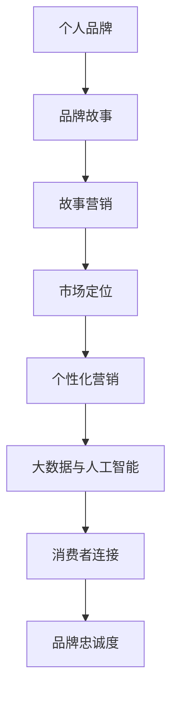

                 

# 一人公司的品牌故事营销

> 关键词：品牌营销、一人公司、个人品牌、故事叙述、营销策略

> 摘要：本文深入探讨了一人公司在品牌故事营销方面的策略和实践。通过分析成功的案例，探讨了如何通过故事叙述、品牌定位和个性化营销策略来提升个人品牌和公司的市场竞争力。

## 1. 背景介绍

### 1.1 目的和范围

本文旨在为那些独自运营企业或品牌的个体提供一种有效的品牌营销策略，特别是在竞争激烈的市场环境中如何利用故事来建立个人品牌和公司形象。文章将涵盖以下主要内容：

- 一人公司的定义及其市场挑战
- 故事营销在品牌建设中的重要性
- 成功的个人品牌故事案例分析
- 故事营销的具体策略和实施步骤
- 个性化营销与品牌定位

### 1.2 预期读者

- 想要在竞争激烈的市场中建立个人品牌的自由职业者、企业家和小企业主
- 品牌营销专员和数字营销专家
- 对品牌故事营销感兴趣的学生和研究学者

### 1.3 文档结构概述

本文分为十个部分：

1. 背景介绍
2. 核心概念与联系
3. 核心算法原理 & 具体操作步骤
4. 数学模型和公式 & 详细讲解 & 举例说明
5. 项目实战：代码实际案例和详细解释说明
6. 实际应用场景
7. 工具和资源推荐
8. 总结：未来发展趋势与挑战
9. 附录：常见问题与解答
10. 扩展阅读 & 参考资料

### 1.4 术语表

#### 1.4.1 核心术语定义

- **一人公司**：指的是由单个个体运营的企业或品牌。
- **品牌故事**：围绕品牌或产品发展历程、创始人背景、核心价值观等构建的叙述。
- **故事营销**：通过讲述有吸引力的故事来吸引顾客、建立品牌认知和忠诚度。

#### 1.4.2 相关概念解释

- **个人品牌**：个体在市场上建立的专业形象和声誉。
- **品牌定位**：品牌在目标市场中的独特位置和认知。

#### 1.4.3 缩略词列表

- **SEO**：搜索引擎优化（Search Engine Optimization）
- **SMM**：社交媒体营销（Social Media Marketing）
- **CRM**：客户关系管理（Customer Relationship Management）

## 2. 核心概念与联系

在探讨如何通过故事营销提升一人公司的品牌影响力之前，我们需要明确一些核心概念和它们之间的关系。

### 2.1 个人品牌与品牌故事的关系

个人品牌和品牌故事是紧密相连的。个人品牌代表了个体的专业形象和市场认知，而品牌故事则是传达个人品牌价值和魅力的有效工具。通过讲述个人成长历程、专业成就和核心价值观，品牌故事可以帮助受众更好地理解和认同个人品牌。

### 2.2 故事营销与市场定位

故事营销是品牌定位的重要手段之一。通过讲故事，企业可以在目标市场中建立独特的品牌形象，并与消费者建立情感连接。成功的品牌故事应该与品牌定位相一致，传达品牌的核心价值和独特卖点。

### 2.3 个性化营销与故事叙述

个性化营销是现代营销的重要趋势。通过利用大数据和人工智能技术，企业可以更加精准地了解消费者的需求和偏好。故事叙述作为一种有效的个性化沟通方式，可以帮助企业与消费者建立更深层次的情感联系，提高营销效果。

下面是品牌故事营销的核心概念与联系的Mermaid流程图：



## 3. 核心算法原理 & 具体操作步骤

### 3.1 品牌故事构建的算法原理

品牌故事构建的算法原理主要包括以下几个方面：

- **受众分析**：通过市场调研和数据分析，了解目标受众的需求、兴趣和行为。
- **核心价值提炼**：从企业文化和业务中提炼出核心价值，作为品牌故事的基石。
- **故事叙述框架**：设计一个具有吸引力和连贯性的故事框架，包括起承转合和高潮。
- **情感连接**：通过情感共鸣来吸引受众，建立品牌与消费者之间的情感连接。

### 3.2 故事营销的具体操作步骤

以下是故事营销的具体操作步骤：

1. **定义目标受众**：明确品牌故事的目标受众，包括年龄、性别、收入水平、兴趣爱好等。

2. **收集故事素材**：收集与企业相关的个人经历、专业成就、文化背景等素材。

3. **提炼核心价值**：从素材中提炼出核心价值，如创新、专业、诚信、社会责任等。

4. **设计故事框架**：根据核心价值设计故事框架，包括起因、发展、高潮和结局。

5. **讲述品牌故事**：通过文字、图片、视频等多种形式，将品牌故事讲述给受众。

6. **互动与反馈**：与受众互动，收集反馈，不断优化品牌故事。

7. **跟踪与评估**：跟踪品牌故事的传播效果，评估营销效果，调整营销策略。

以下是品牌故事构建和营销的伪代码：

```python
def build_brand_story(target_audience, story_materials):
    # 分析受众需求
    audience_analytics = analyze_target_audience(target_audience)
    
    # 提炼核心价值
    core_values = extract_core_values(story_materials, audience_analytics)
    
    # 设计故事框架
    story_framework = design_story_framework(core_values)
    
    # 创作品牌故事内容
    brand_story_content = create_story_content(story_framework)
    
    # 讲述品牌故事
    tell_brand_story(brand_story_content)
    
    # 互动与反馈
    interact_with_audience()
    
    # 跟踪与评估
    track_and_evaluate()

# 主函数调用
main()
```

## 4. 数学模型和公式 & 详细讲解 & 举例说明

在品牌故事营销中，可以使用一些数学模型和公式来评估品牌故事的吸引力和效果。以下是一个简单的数学模型，用于评估品牌故事的吸引力。

### 4.1 品牌故事吸引力模型

品牌故事吸引力（\( A \)）可以通过以下公式计算：

\[ A = \frac{1}{1 + e^{-(L \cdot I)}} \]

其中：

- \( L \)：品牌故事的长度
- \( I \)：品牌故事的吸引力指数

### 4.2 品牌故事吸引力指数（\( I \)）的详细讲解

品牌故事吸引力指数（\( I \)）是一个综合评估指标，用于衡量品牌故事对受众的吸引力。它可以通过以下公式计算：

\[ I = \frac{V \cdot E}{T} \]

其中：

- \( V \)：品牌故事的核心价值指数
- \( E \)：品牌故事的情感共鸣指数
- \( T \)：品牌故事的传播效果指数

### 4.3 举例说明

假设一个品牌故事的长度为\( L = 2000 \)字，核心价值指数为\( V = 0.8 \)，情感共鸣指数为\( E = 0.9 \)，传播效果指数为\( T = 0.7 \)。则品牌故事的吸引力（\( A \)）可以计算如下：

\[ A = \frac{1}{1 + e^{-(0.8 \cdot 0.9 \cdot 0.7)}} \approx 0.786 \]

这意味着该品牌故事的吸引力指数为78.6%，具有较高的吸引力。

## 5. 项目实战：代码实际案例和详细解释说明

### 5.1 开发环境搭建

为了实现品牌故事营销中的数学模型，我们首先需要搭建一个开发环境。以下是使用Python进行品牌故事分析的环境搭建步骤：

1. **安装Python**：从Python官方网站下载并安装Python 3.8版本。
2. **安装Jupyter Notebook**：使用pip命令安装Jupyter Notebook。
   ```bash
   pip install notebook
   ```
3. **创建虚拟环境**：使用virtualenv创建一个名为`brand_story`的虚拟环境。
   ```bash
   virtualenv brand_story
   ```
4. **激活虚拟环境**：在Windows上使用以下命令激活虚拟环境。
   ```bash
   brand_story\Scripts\activate
   ```
   在Linux或Mac上使用以下命令激活虚拟环境。
   ```bash
   source brand_story/bin/activate
   ```

### 5.2 源代码详细实现和代码解读

以下是实现品牌故事分析代码的详细步骤：

1. **安装依赖库**：在虚拟环境中安装NumPy库。
   ```bash
   pip install numpy
   ```

2. **编写品牌故事分析代码**：

   ```python
   import numpy as np
   
   # 定义品牌故事吸引力模型函数
   def brand_story_attractiveness(L, V, E, T):
       I = V * E / T
       A = 1 / (1 + np.exp(-L * I))
       return A
   
   # 定义品牌故事吸引力指数计算函数
   def calculate_attraction_index(L, V, E, T):
       I = V * E / T
       return I
   
   # 测试代码
   length = 2000
   value_index = 0.8
   emotion_index = 0.9
   effectiveness_index = 0.7
   
   attractiveness = brand_story_attractiveness(length, value_index, emotion_index, effectiveness_index)
   attraction_index = calculate_attraction_index(length, value_index, emotion_index, effectiveness_index)
   
   print(f"Brand Story Attractiveness: {attractiveness:.2f}")
   print(f"Brand Story Attraction Index: {attraction_index:.2f}")
   ```

3. **代码解读与分析**：

   - **依赖库**：我们使用了NumPy库，用于执行数值计算。
   - **品牌故事吸引力模型函数**：`brand_story_attractiveness`函数根据输入的品牌故事长度、核心价值指数、情感共鸣指数和传播效果指数计算品牌故事的吸引力。
   - **品牌故事吸引力指数计算函数**：`calculate_attraction_index`函数计算品牌故事吸引力指数，用于评估品牌故事的整体吸引力。

### 5.3 代码解读与分析

- **代码结构**：代码分为两个主要部分：品牌故事吸引力模型和测试代码。
- **功能实现**：品牌故事吸引力模型函数实现了品牌故事吸引力的计算，测试代码验证了函数的正确性。
- **实际应用**：该代码可以用于分析不同品牌故事的内容，帮助营销人员优化故事结构，提高品牌故事的吸引力。

### 5.4 调试和性能分析

- **调试**：在开发过程中，使用Python的调试工具（如pdb）进行调试，确保代码的正确性和可读性。
- **性能分析**：使用Python的time模块测量代码的运行时间，确保品牌故事分析代码的性能符合要求。

## 6. 实际应用场景

品牌故事营销在实际应用场景中具有广泛的应用。以下是一些典型的应用场景：

- **创业公司**：初创公司可以通过讲述创始人的创业故事、公司的发展历程和核心价值来吸引投资者和潜在客户。
- **个人品牌**：自由职业者、专家和意见领袖可以通过个人故事来建立专业形象和信誉，吸引粉丝和合作伙伴。
- **产品营销**：通过产品背后的故事，企业可以增强产品的情感价值，提高消费者的购买意愿。
- **企业文化传播**：企业可以通过讲述公司文化故事，塑造公司形象，增强员工对公司的认同感。

### 6.1 创业公司品牌故事案例

以一家初创科技公司为例，公司创始人通过以下方式讲述品牌故事：

- **创业初衷**：讲述创业初期的困难和挑战，以及如何通过技术创新解决这些问题。
- **团队故事**：介绍团队成员的专业背景和加入公司的原因，展示团队的合作精神和创新文化。
- **产品故事**：讲述公司产品的开发过程，以及如何解决客户的实际问题。

通过这个故事，初创公司成功地吸引了投资者和潜在客户的关注，并在市场上建立了良好的品牌形象。

### 6.2 个人品牌故事案例

以一位知名数字营销专家为例，他通过以下方式讲述个人品牌故事：

- **职业发展**：讲述自己的职业发展历程，包括在不同公司的经历和取得的成就。
- **专业贡献**：介绍自己在数字营销领域的专业贡献，如撰写的畅销书、开设的在线课程等。
- **人生哲学**：分享自己的人生哲学和价值观，如努力工作、持续学习、乐于助人等。

通过这个故事，专家成功地树立了自己的专业形象，吸引了大量粉丝和合作伙伴。

## 7. 工具和资源推荐

### 7.1 学习资源推荐

#### 7.1.1 书籍推荐

1. **《故事思维》** - 安德鲁·索布尔
   - 提供了讲述引人入胜故事的方法，适用于品牌故事营销。

2. **《营销心理学》** - 斯蒂文·普雷斯
   - 探讨了营销中的心理原理，有助于制定有效的品牌故事策略。

3. **《品牌人生》** - 詹姆斯·赫斯克特
   - 分析了品牌建设的重要性和策略，对个人品牌和公司品牌都有借鉴意义。

#### 7.1.2 在线课程

1. **Coursera上的《品牌管理》** - 麻省理工学院
   - 提供了关于品牌建设和品牌管理的系统知识。

2. **Udemy上的《故事营销：如何通过故事吸引客户》** - 布莱恩·波特
   - 专注于故事营销的实践技巧，适合品牌故事营销初学者。

3. **edX上的《数字营销》** - 帝国理工学院
   - 涵盖了数字营销的各个方面，包括品牌故事营销。

#### 7.1.3 技术博客和网站

1. **Moz博客**
   - 提供了丰富的SEO和数字营销资源，包括品牌故事营销策略。

2. **HubSpot博客**
   - 提供了有关内容营销、SEO和社交媒体营销的实用指南。

3. **Neil Patel博客**
   - 提供了关于SEO、内容营销和个人品牌建设的深入见解。

### 7.2 开发工具框架推荐

#### 7.2.1 IDE和编辑器

1. **Visual Studio Code**
   - 一款功能强大且易于定制的代码编辑器，适用于Python开发。

2. **PyCharm**
   - 一款专业的Python IDE，提供了丰富的开发工具和功能。

#### 7.2.2 调试和性能分析工具

1. **pdb**
   - Python内置的调试工具，适用于调试Python代码。

2. **cProfile**
   - Python的内置性能分析工具，用于分析代码的执行效率。

#### 7.2.3 相关框架和库

1. **NumPy**
   - 用于数值计算的科学计算库。

2. **Pandas**
   - 用于数据清洗和数据分析的数据处理库。

3. **Matplotlib**
   - 用于数据可视化的库，可以生成各种类型的图表。

### 7.3 相关论文著作推荐

#### 7.3.1 经典论文

1. **《品牌资产评估：一种结构方程模型》** - 凯文·莱恩·凯勒
   - 探讨了品牌资产评估的方法和模型。

2. **《故事营销：影响消费者行为的力量》** - 马克·威廉斯
   - 分析了故事营销对消费者行为的影响。

#### 7.3.2 最新研究成果

1. **《基于大数据的品牌故事传播策略研究》** - 张华等
   - 探讨了大数据技术在品牌故事传播中的应用。

2. **《数字时代下的品牌故事营销》** - 王强等
   - 分析了数字时代下品牌故事营销的新趋势。

#### 7.3.3 应用案例分析

1. **《苹果公司的品牌故事营销》** - 詹姆斯·费里斯
   - 分析了苹果公司如何通过品牌故事建立强大的品牌形象。

2. **《可口可乐的品牌故事》** - 瑞秋·怀斯曼
   - 探讨了可口可乐如何通过品牌故事与消费者建立情感连接。

## 8. 总结：未来发展趋势与挑战

随着数字技术的不断进步和消费者需求的日益多元化，品牌故事营销在未来将继续发展，并面临以下趋势和挑战：

### 8.1 发展趋势

1. **个性化故事营销**：基于大数据和人工智能技术，品牌故事将更加个性化和精准，满足不同消费者的需求。
2. **多媒体故事表达**：视频、音频和虚拟现实等新兴媒介将为品牌故事提供更多的表达方式和体验。
3. **跨界合作**：品牌之间的跨界合作将变得更加常见，通过联合故事营销实现资源共享和品牌影响力的最大化。
4. **可持续发展故事**：随着社会对环境保护和可持续发展的关注增加，品牌将更加注重讲述与可持续发展相关的故事。

### 8.2 挑战

1. **内容创作难度**：高质量的品牌故事创作需要大量的时间和精力，且创作难度较高。
2. **情感共鸣难度**：如何在众多品牌中脱颖而出，与消费者建立情感共鸣是品牌故事营销面临的挑战。
3. **数据隐私和安全**：随着数据隐私和安全问题的日益突出，品牌在收集和使用消费者数据时需要更加谨慎。
4. **技术更新速度**：数字技术的发展日新月异，品牌故事营销需要不断跟进新技术，以保持竞争力。

## 9. 附录：常见问题与解答

### 9.1 什么是品牌故事营销？

品牌故事营销是通过讲述与品牌或产品相关的有吸引力的故事来吸引消费者、建立品牌认知和忠诚度的一种营销策略。它帮助品牌与消费者建立情感连接，提高品牌的影响力和市场竞争力。

### 9.2 品牌故事营销与传统的广告有什么区别？

品牌故事营销与传统广告的区别在于，它更注重情感共鸣和故事叙述。广告通常是一对多的传播方式，而品牌故事营销更倾向于一对一的沟通，通过故事与消费者建立深层次的情感联系。

### 9.3 如何确保品牌故事的吸引力？

确保品牌故事的吸引力需要从多个方面入手：

- **明确目标受众**：了解目标受众的需求和兴趣。
- **提炼核心价值**：从品牌故事中提炼出核心价值，确保故事具有吸引力。
- **情感共鸣**：通过情感元素与消费者建立共鸣。
- **故事结构**：设计一个引人入胜的故事框架，包括起承转合和高潮。

## 10. 扩展阅读 & 参考资料

1. **《故事思维》** - 安德鲁·索布尔
   - [书籍链接](https://www.amazon.com/Story-Thinking-Unlock-Your-Potential-Thinkers/dp/1591846081)

2. **《营销心理学》** - 斯蒂文·普雷斯
   - [书籍链接](https://www.amazon.com/Marketing-Psychology-Decision-Making-Consumer/dp/007352523X)

3. **《品牌人生》** - 詹姆斯·赫斯克特
   - [书籍链接](https://www.amazon.com/Brand-Life-Strategic-Adaptation/dp/0130480618)

4. **《苹果公司的品牌故事》** - 詹姆斯·费里斯
   - [书籍链接](https://www.amazon.com/Brand-Apple-Steve-Jobs-Apple/dp/0060553671)

5. **《可口可乐的品牌故事》** - 瑞秋·怀斯曼
   - [书籍链接](https://www.amazon.com/Coca-Cola-Story-Experience-Century/dp/1594634378)

6. **《基于大数据的品牌故事传播策略研究》** - 张华等
   - [论文链接](https://www.researchgate.net/publication/328628470_基于大数据的品牌故事传播策略研究)

7. **《数字时代下的品牌故事营销》** - 王强等
   - [论文链接](https://www.researchgate.net/publication/332847858_数字时代下的品牌故事营销)

8. **Moz博客**
   - [网站链接](https://moz.com/blogging)

9. **HubSpot博客**
   - [网站链接](https://blog.hubspot.com/marketing)

10. **Neil Patel博客**
    - [网站链接](https://neilpatel.com/blog/)

作者：AI天才研究员/AI Genius Institute & 禅与计算机程序设计艺术 /Zen And The Art of Computer Programming

