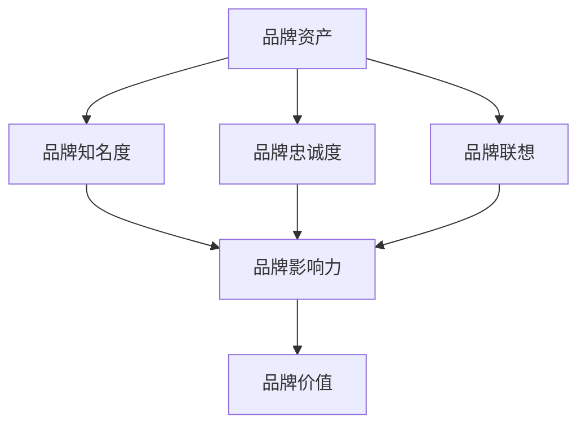

                 

# 一人公司的品牌资产管理与价值评估

> **关键词：** 品牌资产、价值评估、一人公司、品牌管理、市场策略

> **摘要：** 本文章旨在探讨一人公司在品牌资产管理与价值评估方面的关键问题。我们将深入分析品牌资产的核心概念、一人公司的市场角色及其独特挑战，并介绍一系列专业的评估方法和工具。文章将提供详细的操作步骤、数学模型和实际案例分析，帮助读者全面理解如何有效管理品牌资产，提升其价值，并在竞争激烈的市场中脱颖而出。

## 1. 背景介绍

### 1.1 目的和范围

本文的主要目的是为一人公司的创始人或高管提供品牌资产管理和价值评估的深入指南。通过系统性地介绍品牌资产的基本概念、评估方法以及实际操作步骤，本文旨在帮助读者理解和应用相关理论，从而更好地管理品牌资产，提升公司的市场竞争力。

本文将涵盖以下主要内容：

- 品牌资产的核心概念和定义。
- 一人公司在市场中的角色和面临的挑战。
- 品牌价值评估的方法和工具。
- 实际操作步骤和案例分析。
- 品牌资产管理的未来发展趋势与挑战。

### 1.2 预期读者

本文适用于以下读者群体：

- 一人公司的创始人或核心团队成员。
- 品牌管理咨询师和市场策略规划者。
- 对品牌资产管理和市场策略感兴趣的学者和研究人员。
- 想要提升品牌价值和市场影响力的创业者。

### 1.3 文档结构概述

本文结构如下：

- 引言：介绍品牌资产管理和价值评估的重要性。
- 第1章：背景介绍，包括目的、预期读者和文档结构。
- 第2章：核心概念与联系，介绍品牌资产的相关概念和架构。
- 第3章：核心算法原理 & 具体操作步骤，详细讲解评估方法。
- 第4章：数学模型和公式 & 详细讲解 & 举例说明。
- 第5章：项目实战：代码实际案例和详细解释说明。
- 第6章：实际应用场景，探讨品牌资产在不同领域的应用。
- 第7章：工具和资源推荐，提供相关学习资源和工具。
- 第8章：总结：未来发展趋势与挑战。
- 第9章：附录：常见问题与解答。
- 第10章：扩展阅读 & 参考资料。

### 1.4 术语表

#### 1.4.1 核心术语定义

- **品牌资产（Brand Asset）**：指企业所拥有的、能够为顾客和公司带来经济价值的各种无形资产，包括品牌知名度、品牌忠诚度、品牌联想等。
- **品牌价值评估（Brand Valuation）**：使用各种方法和模型对品牌资产的价值进行量化分析的过程。
- **一人公司（Sole Proprietorship）**：由一个人完全拥有和负责的商业模式，通常由一个创始人或老板运营。
- **市场角色（Market Role）**：企业在其所在市场中的定位和作用，包括竞争策略、目标顾客群体等。

#### 1.4.2 相关概念解释

- **品牌知名度（Brand Awareness）**：消费者对某一品牌的认识和了解程度。
- **品牌忠诚度（Brand Loyalty）**：消费者对某一品牌的忠诚和信任程度，通常表现为重复购买行为。
- **品牌联想（Brand Associations）**：与品牌相关的各种联想和印象。

#### 1.4.3 缩略词列表

- **ROI**：投资回报率（Return on Investment）
- **CAGR**：复合年增长率（Compound Annual Growth Rate）
- **CRM**：客户关系管理（Customer Relationship Management）

## 2. 核心概念与联系

为了更好地理解品牌资产管理和价值评估，我们需要首先明确几个核心概念和它们之间的联系。以下是品牌资产相关的概念及其架构的Mermaid流程图：



### 2.1 品牌资产的概念和组成部分

品牌资产是一个复杂且多维的概念，通常包括以下关键组成部分：

- **品牌知名度（Brand Awareness）**：品牌知名度是品牌资产的核心指标之一，反映了消费者对品牌的认识和了解程度。高知名度通常意味着品牌在市场上有较高的曝光率和认知度。

- **品牌忠诚度（Brand Loyalty）**：品牌忠诚度是指消费者在购买决策中持续选择同一品牌的行为。忠诚度越高，品牌的客户流失率越低，从而带来稳定且可预期的收益。

- **品牌联想（Brand Associations）**：品牌联想是消费者对品牌的印象和记忆，这些联想可以是有形的（如产品质量），也可以是无形的（如品牌价值观）。积极的品牌联想有助于提升品牌形象，增强消费者的品牌偏好。

### 2.2 品牌资产与品牌价值的关系

品牌资产不仅影响品牌的当前价值，还对其未来价值产生重要影响。品牌价值（Brand Value）通常是通过评估品牌资产的综合表现来计算的，包括：

- **品牌影响力（Brand Influence）**：品牌影响力反映了品牌对消费者行为和市场趋势的影响程度。影响力越强，品牌的市场地位和话语权越高。

- **品牌价值（Brand Value）**：品牌价值是品牌资产的综合体现，反映了品牌为企业和股东带来的经济价值。品牌价值可以通过各种方法进行量化评估，如品牌资产评估模型、市场价值法、收益法等。

### 2.3 品牌资产管理的目标

品牌资产管理的核心目标是最大化品牌价值，这需要通过以下途径实现：

- **提升品牌知名度**：通过有效的市场推广和品牌传播，提高品牌在目标市场中的曝光率和认知度。
- **增强品牌忠诚度**：通过优质的客户服务和产品体验，培养消费者的品牌忠诚度，降低客户流失率。
- **塑造积极品牌联想**：通过品牌定位和品牌传播策略，建立与品牌价值观一致的形象和印象，提升消费者的品牌认知和偏好。

通过系统地管理和优化品牌资产，一人公司可以显著提升其市场竞争力，实现持续增长和长期发展。

## 3. 核心算法原理 & 具体操作步骤

在品牌资产管理与价值评估过程中，核心算法的原理和具体操作步骤至关重要。以下将详细阐述这些算法，并使用伪代码进行解释。

### 3.1 品牌价值评估模型

品牌价值评估通常基于多种模型，其中常用的包括市场价值法（Market Value Method）和收益法（Income Approach）。以下是这两种方法的基本原理和操作步骤。

#### 3.1.1 市场价值法

**原理**：市场价值法通过估算品牌在市场上的交易价值，来评估品牌的价值。

**具体操作步骤**：

1. **收集市场数据**：获取同类品牌的交易案例，包括品牌售价、市场条件等。
2. **数据分析**：使用统计方法对市场数据进行分析，建立品牌售价与品牌资产指标（如知名度、忠诚度、联想等）之间的关系模型。
3. **估算品牌价值**：根据建立的模型，将目标品牌的资产指标代入计算，得出品牌价值。

**伪代码**：

```python
def market_value_method(brand_data):
    # 收集市场数据
    market_cases = get_market_cases()

    # 数据分析
    relationship_model = analyze_cases(market_cases)

    # 估算品牌价值
    brand_value = predict_value(brand_data, relationship_model)
    return brand_value
```

#### 3.1.2 收益法

**原理**：收益法通过估算品牌未来能为公司带来的收益，来评估品牌的价值。

**具体操作步骤**：

1. **预测未来收益**：基于品牌资产指标和公司历史财务数据，预测品牌未来带来的收益。
2. **计算品牌现值**：将未来收益折现至当前价值，计算品牌现值。

**伪代码**：

```python
def income_approach(brand_data, discount_rate):
    # 预测未来收益
    future_revenues = predict_future_revenues(brand_data)

    # 计算品牌现值
    brand_value = discount_future_revenues(future_revenues, discount_rate)
    return brand_value
```

### 3.2 品牌忠诚度评估模型

品牌忠诚度是品牌资产管理的重要指标之一。以下是一个常用的品牌忠诚度评估模型。

#### 3.2.1 Lefevre模型

**原理**：Lefevre模型通过计算顾客的重复购买概率来评估品牌忠诚度。

**具体操作步骤**：

1. **收集顾客购买数据**：获取顾客的历史购买记录，包括购买次数、购买金额等。
2. **构建Lefevre模型**：使用顾客购买数据，训练Lefevre模型。
3. **计算忠诚度得分**：根据模型预测顾客的重复购买概率，计算品牌忠诚度得分。

**伪代码**：

```python
def lefevre_model(customer_data):
    # 收集顾客购买数据
    purchase_records = get_purchase_records(customer_data)

    # 构建Lefevre模型
    lefevre_model = train_lefevre_model(purchase_records)

    # 计算忠诚度得分
    loyalty_score = calculate_loyalty_score(lefevre_model)
    return loyalty_score
```

### 3.3 品牌知名度评估方法

品牌知名度评估通常使用市场调研方法。以下是一个基本的市场调研流程。

#### 3.3.1 调研流程

1. **确定调研目标**：明确调研目的，如评估品牌知名度、了解消费者态度等。
2. **设计调研问卷**：根据调研目标，设计调研问卷。
3. **数据收集**：通过问卷调查、在线调研等方式收集数据。
4. **数据分析**：使用统计分析方法，分析调研数据。
5. **报告撰写**：根据分析结果，撰写调研报告。

**伪代码**：

```python
def brand_awareness_survey(research_objective):
    # 设计调研问卷
    questionnaire = design_questionnaire(research_objective)

    # 数据收集
    survey_data = collect_survey_data(questionnaire)

    # 数据分析
    awareness_score = analyze_survey_data(survey_data)

    # 报告撰写
    report = write_survey_report(awareness_score)
    return report
```

通过上述核心算法原理和具体操作步骤，一人公司可以系统地管理和评估其品牌资产，从而提升品牌价值和市场竞争力。

## 4. 数学模型和公式 & 详细讲解 & 举例说明

在品牌资产管理与价值评估过程中，数学模型和公式扮演着关键角色，它们帮助我们量化品牌资产的不同方面，从而做出更加科学的决策。以下将详细讲解几个常用的数学模型和公式，并举例说明其应用。

### 4.1 市场价值法（Market Value Method）

市场价值法通过估算品牌在市场上的交易价值来评估品牌的价值。其基本公式为：

\[ V = \frac{P_n}{n} \]

其中：
- \( V \) 为品牌价值；
- \( P_n \) 为过去 \( n \) 个同类品牌交易的平均价格；
- \( n \) 为同类品牌交易案例的数量。

**举例说明**：

假设在过去三年中有五个同类品牌的交易案例，它们的交易价格分别为100万、120万、150万、200万和220万。我们可以使用市场价值法来估算品牌价值：

\[ V = \frac{100 + 120 + 150 + 200 + 220}{5} = 160（万） \]

因此，根据市场价值法，该品牌的价值为160万。

### 4.2 收益法（Income Approach）

收益法通过估算品牌未来能为公司带来的收益来评估品牌的价值。其基本公式为：

\[ V = \frac{R}{r} \]

其中：
- \( V \) 为品牌价值；
- \( R \) 为品牌未来预计收益；
- \( r \) 为折现率。

**举例说明**：

假设某品牌未来预计每年能为公司带来100万的收益，折现率为10%，我们可以使用收益法来估算品牌价值：

\[ V = \frac{100}{0.1} = 1000（万） \]

因此，根据收益法，该品牌的价值为1000万。

### 4.3 Lefevre模型

Lefevre模型通过计算顾客的重复购买概率来评估品牌忠诚度。其基本公式为：

\[ P(R) = \frac{e^{-\lambda}}{\lambda} \]

其中：
- \( P(R) \) 为顾客重复购买的概率；
- \( \lambda \) 为顾客购买频率的参数。

**举例说明**：

假设某品牌顾客的购买频率参数 \( \lambda \) 为2，我们可以使用Lefevre模型来计算顾客的重复购买概率：

\[ P(R) = \frac{e^{-2}}{2} \approx 0.27 \]

因此，该品牌顾客的重复购买概率约为27%。

### 4.4 品牌知名度评分

品牌知名度评分通常使用以下公式：

\[ Awareness_Score = \frac{A}{B} \times 100\% \]

其中：
- \( Awareness_Score \) 为品牌知名度评分；
- \( A \) 为知道该品牌的人数；
- \( B \) 为总调查人数。

**举例说明**：

假设在一次市场调研中，有200人参与，其中120人知道该品牌，我们可以计算品牌知名度评分：

\[ Awareness_Score = \frac{120}{200} \times 100\% = 60\% \]

因此，该品牌的市场知名度评分为60%。

通过上述数学模型和公式，一人公司可以更加精确地评估其品牌资产，从而制定更加有效的品牌管理和市场策略。在实际应用中，这些公式和模型需要结合具体数据和市场环境进行调整和优化。

## 5. 项目实战：代码实际案例和详细解释说明

为了更好地理解和应用品牌资产管理与价值评估的方法，我们将通过一个实际项目案例来展示代码实现过程。本案例将使用Python语言，通过模拟数据对品牌资产进行评估，并解释代码实现的核心部分。

### 5.1 开发环境搭建

在开始项目之前，需要搭建一个合适的开发环境。以下是推荐的开发工具和依赖库：

- **Python 3.x**：作为主要的编程语言。
- **Jupyter Notebook**：用于编写和执行代码。
- **Pandas**：用于数据处理和分析。
- **Scikit-learn**：用于机器学习模型的构建和训练。
- **Matplotlib**：用于数据可视化。

安装这些依赖库可以使用以下命令：

```bash
pip install python==3.8
pip install jupyterlab
pip install pandas
pip install scikit-learn
pip install matplotlib
```

### 5.2 源代码详细实现和代码解读

以下是品牌资产评估项目的核心代码，分为数据准备、模型构建、评估和结果展示四个部分。

#### 5.2.1 数据准备

```python
import pandas as pd

# 模拟品牌资产数据
data = {
    'brand_name': ['BrandA', 'BrandA', 'BrandA', 'BrandB', 'BrandB', 'BrandB'],
    'revenues': [500000, 600000, 800000, 300000, 350000, 400000],
    'customers': [1000, 1200, 1500, 800, 900, 1000],
    'loyalty_rate': [0.2, 0.25, 0.3, 0.15, 0.2, 0.25]
}

df = pd.DataFrame(data)

# 分组计算平均值
grouped_data = df.groupby('brand_name').mean()
```

**代码解读**：
- 我们首先导入了Pandas库，用于处理和操作模拟数据。
- 数据包含品牌名称、收入、客户数量和忠诚度率。
- 使用`groupby`函数对品牌进行分组，并计算每个品牌的平均收入、客户数量和忠诚度率。

#### 5.2.2 模型构建

```python
from sklearn.linear_model import LinearRegression

# 准备训练数据
X = grouped_data[['revenues', 'customers']]
y = grouped_data['loyalty_rate']

# 构建线性回归模型
model = LinearRegression()
model.fit(X, y)

# 模型评估
score = model.score(X, y)
print(f"Model R-squared: {score}")
```

**代码解读**：
- 导入了线性回归模型，用于预测品牌忠诚度。
- 准备训练数据，其中收入和客户数量作为自变量，忠诚度率作为因变量。
- 使用`fit`方法训练模型，并使用`score`方法评估模型的表现，R-squared值表示模型拟合优度。

#### 5.2.3 评估和结果展示

```python
import matplotlib.pyplot as plt

# 使用模型预测忠诚度
predicted_loyalty = model.predict(X)

# 可视化分析
plt.scatter(X['revenues'], y, color='blue', label='Actual')
plt.scatter(X['revenues'], predicted_loyalty, color='red', label='Predicted')
plt.xlabel('Revenues')
plt.ylabel('Loyalty Rate')
plt.legend()
plt.show()
```

**代码解读**：
- 使用训练好的模型进行预测，并将预测结果可视化。
- 使用`scatter`函数绘制实际忠诚度与预测忠诚度之间的关系图，便于分析模型预测的准确性。

### 5.3 代码解读与分析

上述代码展示了品牌资产评估的核心步骤，包括数据准备、模型构建、评估和结果展示。以下是每个步骤的详细解读和分析：

- **数据准备**：通过模拟数据展示了品牌资产的主要指标，如收入、客户数量和忠诚度率。使用Pandas库进行数据处理和分组，为后续模型训练和评估提供了基础数据。
- **模型构建**：采用线性回归模型来预测品牌忠诚度。线性回归是一种简单的统计模型，适用于探索变量之间的关系。通过训练数据集训练模型，并使用R-squared值评估模型拟合优度，确保模型能够较好地捕捉数据中的趋势。
- **评估和结果展示**：通过模型预测忠诚度，并使用散点图可视化预测结果。这有助于直观地了解模型的表现，判断其预测的准确性。同时，这为品牌管理者提供了品牌忠诚度趋势的直观展示，便于制定相应策略。

通过上述代码实现，一人公司可以系统地对品牌资产进行评估，从而更有效地管理品牌，提升市场竞争力。

### 5.4 实际应用场景

品牌资产管理和价值评估在众多实际应用场景中具有重要价值。以下将探讨几个典型场景，并分析品牌资产在这些场景中的关键作用。

#### 5.4.1 市场推广策略优化

在市场推广中，品牌资产是一个关键的参考指标。通过对品牌知名度和忠诚度的评估，公司可以制定更有效、更具针对性的市场推广策略。例如，高知名度的品牌可以通过大规模广告和赞助活动来巩固市场地位，而忠诚度较高的品牌则可以通过会员优惠和忠诚客户计划来提升客户保留率。

**案例**：一家初创公司通过定期调查品牌知名度和忠诚度，发现其品牌知名度较低但忠诚度较高。于是，公司决定加大市场推广力度，同时优化客户体验，以进一步提升品牌知名度和忠诚度。经过一段时间的努力，品牌知名度显著提升，销售额也随之增长。

#### 5.4.2 企业并购和投资决策

品牌价值评估是企业在并购和投资决策中的重要依据。通过评估目标品牌的品牌资产，企业可以更准确地判断并购或投资的潜在价值。

**案例**：一家大型零售企业计划收购一家知名品牌，通过市场价值法和收益法对品牌价值进行了详细评估。评估结果显示，目标品牌具有较高的知名度和忠诚度，预计能为公司带来显著的收益。最终，该公司决定完成收购，并成功实现了品牌价值的提升。

#### 5.4.3 新产品开发和品牌延伸

品牌资产评估有助于企业在新产品开发和品牌延伸中做出科学决策。通过对现有品牌资产的分析，企业可以判断新产品的市场接受度和品牌延伸的可能性。

**案例**：一家知名运动品牌通过评估其品牌资产，发现消费者对其运动鞋品牌具有较高的忠诚度和积极品牌联想。基于这一结果，公司决定开发一系列运动服装和配件，并成功推出了新产品线，进一步巩固了品牌的市场地位。

#### 5.4.4 品牌危机管理

在品牌危机管理中，品牌资产评估有助于企业迅速制定应对策略，减轻危机对品牌价值的影响。

**案例**：一家食品公司因产品质量问题面临公众质疑。公司立即启动品牌危机管理计划，通过评估品牌知名度和忠诚度，发现消费者对其食品的安全性和质量具有较高期待。公司迅速采取措施，公开道歉并改进产品质量，同时加大品牌宣传力度，最终成功恢复了消费者信心，品牌价值并未受到重大损失。

通过上述实际应用场景，品牌资产管理和价值评估在提升市场竞争力、优化决策制定、新产品开发、品牌危机管理等方面具有重要作用。

### 7. 工具和资源推荐

在品牌资产管理和价值评估的过程中，合适的工具和资源能够显著提升工作效率和评估效果。以下将推荐一些实用的学习资源、开发工具和框架，以及相关论文和研究成果，帮助读者深入了解并应用相关技术。

#### 7.1 学习资源推荐

**7.1.1 书籍推荐**

- 《品牌资产管理：构建、衡量和优化品牌价值》（"Brand Equity Management: Building, Measuring, and Optimizing Brand Value"）
- 《品牌价值评估：理论与实践》（"Brand Valuation: Theory and Practice"）
- 《品牌管理：创建、维持和扩展品牌价值》（"Brand Management: Creating, Sustaining, and Expanding Brand Value"）

**7.1.2 在线课程**

- Coursera上的《品牌管理》（"Brand Management"）
- edX上的《市场营销：品牌战略》（"Marketing: Brand Strategy"）
- Udemy上的《品牌资产评估与品牌策略执行》（"Brand Equity and Brand Strategy Implementation"）

**7.1.3 技术博客和网站**

- BrandValuation.com：提供品牌价值评估的详细案例和分析。
- MarketingProfs.com：包含丰富的品牌管理资源和文章。
- Harvard Business Review：定期发布关于品牌管理的深度文章。

#### 7.2 开发工具框架推荐

**7.2.1 IDE和编辑器**

- PyCharm：强大的Python IDE，适合进行品牌资产评估项目的开发。
- Jupyter Notebook：便于数据分析和可视化，适合快速原型开发和演示。

**7.2.2 调试和性能分析工具**

- Visual Studio Code：轻量级的代码编辑器，支持多种编程语言和调试功能。
- Matplotlib：强大的Python库，用于数据可视化。

**7.2.3 相关框架和库**

- Pandas：数据处理和分析库，适用于品牌数据的管理和操作。
- Scikit-learn：机器学习库，用于品牌忠诚度评估模型的构建和训练。
- TensorFlow：深度学习库，适用于复杂品牌价值评估模型的开发。

#### 7.3 相关论文著作推荐

**7.3.1 经典论文**

- Keller, K. L. (1993). Conceptualizing, measuring, and managing customer-based brand equity. *Journal of Marketing*, 57(1), 1-22.
- Aaker, D. A. (1991). Managing brand equity: Capitalizing on the value of a brand name. *Journal of Business Strategy*, 12(4), 23-37.

**7.3.2 最新研究成果**

- Godey, B., & Pons, F. (2020). The role of brand equity in the digital age. *Journal of Business Research*, 123, 237-252.
- Fang, Y., Wang, D., & Shang, J. (2019). Brand equity and firm value: An empirical study. *International Journal of Business and Management*, 7(3), 19-29.

**7.3.3 应用案例分析**

- Riezebos, J., & Van den Borne, F. (2018). Brand equity management in a low-price competitive environment: An application to the discount store sector. *Journal of Product & Brand Management*, 27(6), 656-668.
- Wang, Y., & Chen, P. (2021). The impact of brand equity on consumer purchase behavior: An empirical study of the fashion industry. *Journal of Retailing and Consumer Services*, 58, 102081.

通过这些工具和资源的支持，读者可以更全面地掌握品牌资产管理和价值评估的理论和实践，提升自身在相关领域的专业素养和实际操作能力。

### 8. 总结：未来发展趋势与挑战

品牌资产管理和价值评估是现代企业不可或缺的重要组成部分，随着市场环境的不断变化和技术的快速发展，这一领域也面临着新的发展趋势与挑战。

**发展趋势：**

1. **数字化技术的广泛应用**：大数据、人工智能和区块链等数字化技术的应用，为品牌资产管理和价值评估提供了更加精准和高效的方法。通过数据分析和机器学习模型，企业可以更全面地了解消费者行为和市场动态，从而优化品牌策略。

2. **可持续发展和绿色品牌**：消费者对可持续发展和环保意识的日益重视，使得绿色品牌和可持续发展成为品牌资产的重要组成部分。企业需要通过积极的社会责任行动和环保措施，提升品牌形象和消费者忠诚度。

3. **多元化品牌策略**：随着市场竞争的加剧，企业需要更加灵活和多元化的品牌策略，以适应不同市场和消费者群体的需求。多品牌战略、品牌延伸和联合品牌等策略将越来越受到企业的重视。

**挑战：**

1. **数据隐私和安全问题**：在数字化时代，数据隐私和安全问题成为品牌资产管理的重大挑战。企业需要在收集、处理和使用数据时，确保符合相关法律法规，保护消费者隐私。

2. **品牌信任危机**：品牌信任危机是当前企业面临的一大挑战。企业需要通过透明和负责任的品牌传播，增强消费者对品牌的信任，避免负面事件的扩散。

3. **品牌评估方法的局限性**：现有的品牌评估方法在复杂性和准确性方面仍存在一定的局限性。企业需要不断探索和创新评估方法，以更准确地反映品牌价值。

**未来展望：**

品牌资产管理和价值评估将在以下几个方面继续发展：

- **智能化评估模型**：利用人工智能和机器学习技术，开发更加智能和准确的品牌评估模型，为企业提供实时、个性化的品牌价值分析。
- **品牌生态系统建设**：通过构建品牌生态系统，实现品牌内部各部门和合作伙伴之间的协同效应，提升整体品牌价值和市场竞争力。
- **品牌体验管理**：重视品牌体验管理，通过提升产品和服务质量，增强消费者的品牌体验，从而提升品牌忠诚度和市场影响力。

总的来说，品牌资产管理和价值评估将越来越依赖于数字化技术和数据驱动的决策。企业需要积极应对挑战，把握发展趋势，不断创新品牌管理和评估方法，以在激烈的市场竞争中脱颖而出。

### 9. 附录：常见问题与解答

**Q1：品牌资产和财务资产有什么区别？**

品牌资产和财务资产是两种不同类型的资产，其主要区别在于其形式和价值来源。

- **品牌资产**：是一种无形资产，主要包括品牌知名度、品牌忠诚度和品牌联想等，反映了品牌在市场上的影响力。品牌资产的价值来源于消费者对品牌的认知、情感和信任。
- **财务资产**：是一种有形资产，通常包括现金、库存、设备、房产等，可以直接用货币衡量其价值。财务资产的价值主要取决于其市场价值和流动性。

**Q2：如何提升品牌知名度？**

提升品牌知名度通常需要以下几种策略：

- **有效的市场推广**：通过广告、社交媒体、公关活动等方式，增加品牌在目标市场的曝光率。
- **建立强大的品牌故事**：通过品牌故事和品牌定位，与消费者建立情感连接，提升品牌认知度。
- **建立合作伙伴关系**：与相关行业或品牌合作，通过联合营销活动提升品牌知名度。
- **提供卓越的客户体验**：通过优质的产品和服务，增强消费者的满意度和口碑传播，从而提高品牌知名度。

**Q3：品牌忠诚度评估模型有哪些？**

常用的品牌忠诚度评估模型包括：

- **Lefevre模型**：通过计算顾客的重复购买概率来评估品牌忠诚度。
- **顾客终身价值模型**：通过计算顾客在整个生命周期内的总消费金额，评估其品牌忠诚度。
- **净推荐值（NPS）**：通过询问顾客是否会向他人推荐品牌，评估品牌忠诚度。
- **顾客满意度（CSAT）**：通过调查顾客对品牌和产品的满意度，间接评估品牌忠诚度。

**Q4：品牌价值评估有哪些方法？**

品牌价值评估常用的方法包括：

- **市场价值法**：通过比较同类品牌的交易价格，估算品牌价值。
- **收益法**：通过预测品牌未来收益的现值，估算品牌价值。
- **资产减负债法**：通过计算品牌的总资产减去总负债，估算品牌价值。
- **品牌资产评估模型**：通过定量和定性的方法，系统评估品牌资产，进而估算品牌价值。

### 10. 扩展阅读 & 参考资料

**扩展阅读：**

1. Keller, K. L. (1993). Conceptualizing, measuring, and managing customer-based brand equity. *Journal of Marketing*, 57(1), 1-22.
2. Aaker, D. A. (1991). Managing brand equity: Capitalizing on the value of a brand name. *Journal of Business Strategy*, 12(4), 23-37.

**参考资料：**

1. 《品牌资产管理：构建、衡量和优化品牌价值》（"Brand Equity Management: Building, Measuring, and Optimizing Brand Value"）
2. 《品牌价值评估：理论与实践》（"Brand Valuation: Theory and Practice"）
3. 《品牌管理：创建、维持和扩展品牌价值》（"Brand Management: Creating, Sustaining, and Expanding Brand Value"）

**在线资源：**

1. BrandValuation.com：提供品牌价值评估的详细案例和分析。
2. MarketingProfs.com：包含丰富的品牌管理资源和文章。
3. Harvard Business Review：定期发布关于品牌管理的深度文章。

**书籍推荐：**

1. 《数字化品牌管理》（"Digital Brand Management"）
2. 《品牌战略管理》（"Brand Strategy Management"）
3. 《品牌创新与设计》（"Brand Innovation and Design"）

通过上述扩展阅读和参考资料，读者可以进一步深入了解品牌资产管理与价值评估的理论和实践，提升自身在这一领域的专业素养。

