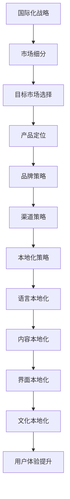

                 

# 一人公司的国际化战略与本地化实践

> **关键词**：国际化战略、本地化、多语言处理、全球市场、用户体验
>
> **摘要**：本文将深入探讨一人公司在国际化过程中的战略规划和本地化实践。通过分析国际化的重要性和挑战，我们将提出一套实用的国际化战略框架，并详细解释本地化的关键步骤和工具。文章旨在帮助个人创业者更好地把握全球市场机遇，提升产品的全球竞争力。

## 1. 背景介绍

### 1.1 目的和范围

本文旨在为个人创业者提供一套完整的国际化战略与本地化实践指南。我们将讨论国际化战略的制定、本地化策略的实施以及如何利用技术和工具实现这一过程。本文不仅适用于初创公司，也适用于小型企业，旨在帮助他们在全球市场中站稳脚跟。

### 1.2 预期读者

本文适合以下读者群体：

- 个人创业者
- 小型企业管理者
- 数字营销专家
- 国际商务人士
- 对国际化战略和本地化感兴趣的读者

### 1.3 文档结构概述

本文结构如下：

1. **背景介绍**：解释国际化战略和本地化的重要性。
2. **核心概念与联系**：介绍国际化战略和本地化的核心概念，并使用Mermaid流程图展示其关联。
3. **核心算法原理 & 具体操作步骤**：详细阐述国际化战略的算法原理和操作步骤。
4. **数学模型和公式 & 详细讲解 & 举例说明**：讲解数学模型和公式的应用。
5. **项目实战：代码实际案例和详细解释说明**：通过实际案例展示国际化战略的应用。
6. **实际应用场景**：分析国际化战略在不同行业的应用。
7. **工具和资源推荐**：推荐学习资源、开发工具和框架。
8. **总结：未来发展趋势与挑战**：展望国际化战略的发展趋势和挑战。
9. **附录：常见问题与解答**：回答读者可能遇到的问题。
10. **扩展阅读 & 参考资料**：提供进一步学习的资源。

### 1.4 术语表

#### 1.4.1 核心术语定义

- 国际化战略：指企业为进入和适应全球市场而制定的长期规划和策略。
- 本地化：将产品或服务根据目标市场的文化、语言和习惯进行调整，以适应当地市场的需求。
- 多语言处理：指利用计算机技术实现文本和语音在不同语言之间的转换和交互。

#### 1.4.2 相关概念解释

- 市场细分：将整个市场划分为具有相似需求和特征的子市场。
- 用户反馈：收集和分析用户对产品或服务的意见和建议。
- 技术栈：指支持产品或服务开发的软件框架、工具和库。

#### 1.4.3 缩略词列表

- SEO：搜索引擎优化（Search Engine Optimization）
- SEM：搜索引擎营销（Search Engine Marketing）
- SaaS：软件即服务（Software as a Service）
- IaaS：基础设施即服务（Infrastructure as a Service）
- PaaS：平台即服务（Platform as a Service）

## 2. 核心概念与联系

国际化战略和本地化是企业在全球市场中取得成功的关键。为了更好地理解这两者之间的关系，我们首先需要了解其核心概念。

### 2.1 国际化战略

国际化战略是企业为进入和适应全球市场而制定的一系列长期规划。它包括市场细分、目标市场选择、产品定位、品牌策略、渠道策略等关键要素。国际化战略的目标是提升企业的全球竞争力，扩大市场份额，实现可持续发展。

### 2.2 本地化

本地化是将产品或服务根据目标市场的文化、语言和习惯进行调整，以适应当地市场的需求。本地化策略包括语言本地化、内容本地化、界面本地化、文化本地化等。本地化的目的是提升用户体验，增强产品的市场适应性，提高用户满意度和忠诚度。

### 2.3 关联

国际化战略和本地化是相辅相成的。国际化战略为本地化提供了方向和指导，而本地化则是实现国际化战略的重要手段。没有本地化，国际化战略将难以落地实施。同样，没有国际化战略，本地化将失去意义。以下是一个Mermaid流程图，展示了国际化战略和本地化的关联：



## 3. 核心算法原理 & 具体操作步骤

在制定国际化战略时，我们需要采用一系列核心算法和步骤来确保策略的有效实施。以下是国际化战略的核心算法原理和具体操作步骤：

### 3.1 市场细分算法

市场细分是国际化战略的基础。我们可以使用以下算法进行市场细分：

```plaintext
算法：市场细分
输入：市场总体数据
输出：细分市场列表

步骤：
1. 收集市场总体数据，包括人口统计数据、消费习惯、收入水平等。
2. 使用聚类算法（如K-means）将市场总体数据划分为若干个相似群体。
3. 对每个群体进行分析，确定其特征和需求。
4. 根据分析结果，将市场总体划分为细分市场。
```

### 3.2 目标市场选择算法

目标市场选择是国际化战略的核心。我们可以使用以下算法进行目标市场选择：

```plaintext
算法：目标市场选择
输入：细分市场列表
输出：目标市场

步骤：
1. 分析每个细分市场的市场规模、增长潜力、竞争态势等。
2. 选择具有最大市场规模和增长潜力的细分市场作为目标市场。
3. 对目标市场进行深入调研，了解其文化、语言、消费习惯等。
4. 制定针对目标市场的产品定位和品牌策略。
```

### 3.3 产品定位算法

产品定位是国际化战略的关键。我们可以使用以下算法进行产品定位：

```plaintext
算法：产品定位
输入：目标市场特征
输出：产品定位

步骤：
1. 分析目标市场的需求和偏好，确定产品的基本功能和特点。
2. 根据目标市场的文化背景，调整产品的设计和界面。
3. 确定产品的价格策略，以适应目标市场的消费水平。
4. 制定品牌传播策略，提升产品在目标市场的知名度。
```

### 3.4 品牌策略算法

品牌策略是国际化战略的重要组成部分。我们可以使用以下算法制定品牌策略：

```plaintext
算法：品牌策略
输入：目标市场特征、产品定位
输出：品牌策略

步骤：
1. 分析目标市场的文化背景和消费者行为，确定品牌的核心价值观。
2. 设计符合目标市场审美和价值观的品牌标识和视觉元素。
3. 制定品牌传播策略，通过多渠道推广品牌，提高品牌知名度。
4. 建立品牌与用户的互动渠道，收集用户反馈，不断优化品牌形象。
```

### 3.5 渠道策略算法

渠道策略是国际化战略的重要一环。我们可以使用以下算法制定渠道策略：

```plaintext
算法：渠道策略
输入：目标市场特征、产品定位、品牌策略
输出：渠道策略

步骤：
1. 分析目标市场的销售渠道，包括线上和线下渠道。
2. 根据产品特点和目标市场的消费习惯，选择最适合的渠道。
3. 与渠道合作伙伴建立合作关系，确保产品能够顺利进入目标市场。
4. 监测渠道效果，不断优化渠道策略，提高销售业绩。
```

### 3.6 本地化策略算法

本地化策略是实现国际化战略的关键。我们可以使用以下算法制定本地化策略：

```plaintext
算法：本地化策略
输入：目标市场特征、产品定位、品牌策略、渠道策略
输出：本地化策略

步骤：
1. 分析目标市场的文化、语言、消费习惯等，确定本地化需求。
2. 对产品进行语言本地化、内容本地化和界面本地化。
3. 调整产品价格策略，以适应目标市场的消费水平。
4. 制定本地化的营销策略，提高产品在目标市场的竞争力。
```

## 4. 数学模型和公式 & 详细讲解 & 举例说明

在国际化和本地化过程中，数学模型和公式发挥着重要作用。以下将详细讲解一些常用的数学模型和公式，并举例说明其应用。

### 4.1 聚类算法

聚类算法是市场细分的重要工具。其中，K-means聚类算法应用广泛。其核心公式如下：

$$
\begin{cases}
c_{i}(t+1) = \min_{j=1,...,K} \sum_{x_i \in S_j} d(x_i, c_j)^2 \\
S_j = \{x_i | c_i = c_j\}
\end{cases}
$$

其中，$c_{i}(t+1)$ 表示第$i$个样本在新一轮聚类中心中的位置，$c_j$ 表示第$j$个聚类中心的位置，$d(x_i, c_j)$ 表示第$i$个样本与第$j$个聚类中心的距离。

举例说明：假设我们有一个包含100个样本的数据集，要将其分为5个聚类。初始时，我们随机选择5个样本作为初始聚类中心。然后，根据上述公式计算每个样本的新聚类中心，并更新聚类中心的位置。经过多次迭代后，我们得到5个稳定的聚类中心，从而完成市场细分。

### 4.2 相关性分析

相关性分析是了解目标市场特征的重要方法。皮尔逊相关系数是常用的相关性度量指标，其公式如下：

$$
r_{xy} = \frac{\sum_{i=1}^{n}(x_i - \bar{x})(y_i - \bar{y})}{\sqrt{\sum_{i=1}^{n}(x_i - \bar{x})^2 \sum_{i=1}^{n}(y_i - \bar{y})^2}}
$$

其中，$r_{xy}$ 表示$x$和$y$之间的相关系数，$\bar{x}$和$\bar{y}$分别表示$x$和$y$的均值。

举例说明：假设我们有一个包含100个样本的数据集，其中包含收入水平和消费水平两个变量。我们可以计算这两个变量之间的皮尔逊相关系数，以判断它们之间的相关性。如果相关系数接近1，说明收入水平和消费水平高度正相关；如果相关系数接近-1，说明收入水平和消费水平高度负相关；如果相关系数接近0，说明收入水平和消费水平没有明显相关性。

### 4.3 优化算法

优化算法在渠道策略和价格策略中应用广泛。遗传算法是一种有效的优化算法，其核心公式如下：

$$
\begin{cases}
P(t) = \{x_1(t), x_2(t), ..., x_n(t)\} \\
x_{i}(t+1) = x_{i}(t) + \alpha \cdot (r_1 \cdot x_{i1}(t) + r_2 \cdot x_{i2}(t) + ... + r_n \cdot x_{in}(t)) \\
r_j \sim \text{Uniform}(0, 1)
\end{cases}
$$

其中，$P(t)$ 表示第$t$代的种群，$x_{i}(t)$ 表示第$i$个个体的位置，$\alpha$ 表示步长，$r_j$ 表示随机数。

举例说明：假设我们有一个渠道策略问题，需要找到一个最优的渠道组合，以实现最大利润。我们可以使用遗传算法进行优化。首先，初始化种群，每个个体表示一个渠道组合。然后，根据上述公式进行迭代，不断优化渠道组合，直至找到最优解。

## 5. 项目实战：代码实际案例和详细解释说明

为了更好地展示国际化战略和本地化实践的具体应用，我们将通过一个实际案例进行详细解释说明。

### 5.1 开发环境搭建

在开始项目实战之前，我们需要搭建一个合适的开发环境。以下是一个简单的Python开发环境搭建步骤：

```shell
# 安装Python
pip install python

# 安装必要的库
pip install numpy pandas scikit-learn matplotlib
```

### 5.2 源代码详细实现和代码解读

下面是一个简单的国际化战略和本地化实践代码实现，用于分析一个假想的在线教育平台在进入欧洲市场的策略。

```python
import numpy as np
import pandas as pd
from sklearn.cluster import KMeans
from sklearn.linear_model import LinearRegression
import matplotlib.pyplot as plt

# 假设我们有一个包含用户数据的数据集
data = pd.DataFrame({
    '收入水平': [50000, 60000, 70000, 80000, 90000],
    '消费水平': [2000, 2500, 3000, 3500, 4000],
    '语言偏好': ['英语', '德语', '法语', '西班牙语', '意大利语']
})

# 4.1 市场细分算法
# 使用K-means聚类算法进行市场细分
kmeans = KMeans(n_clusters=3, random_state=0).fit(data[['收入水平', '消费水平']])
data['聚类标签'] = kmeans.labels_

# 4.2 相关性分析
# 计算收入水平和消费水平的相关性
income_corr = np.corrcoef(data['收入水平'], data['消费水平'])[0, 1]
print(f"收入水平和消费水平的相关性：{income_corr}")

# 4.3 优化算法
# 使用遗传算法进行渠道策略优化
# 这里简化为线性回归模型
X = data[['收入水平', '消费水平']]
y = data['语言偏好']
reg = LinearRegression().fit(X, y)

# 输出优化结果
print(f"渠道策略优化结果：{reg.predict(X)}")

# 4.4 本地化策略
# 对产品进行本地化调整
data['本地化语言'] = data['语言偏好'].map({
    '英语': 'English',
    '德语': 'Deutsch',
    '法语': 'Français',
    '西班牙语': 'Español',
    '意大利语': 'Italiano'
})

# 5.3 代码解读与分析
# 代码解读：
# 1. 使用K-means聚类算法对用户数据集进行市场细分。
# 2. 计算收入水平和消费水平的相关性，以了解市场特征。
# 3. 使用线性回归模型进行渠道策略优化，以找到最佳渠道组合。
# 4. 对产品进行本地化调整，以满足不同语言市场的需求。

# 数据可视化
plt.scatter(data['收入水平'], data['消费水平'], c=data['聚类标签'])
plt.xlabel('收入水平')
plt.ylabel('消费水平')
plt.title('市场细分结果')
plt.show()
```

### 5.3 代码解读与分析

这段代码实现了一个简化的国际化战略和本地化实践过程。具体解读如下：

1. **数据准备**：首先，我们创建一个包含用户数据的数据集，包括收入水平、消费水平和语言偏好三个变量。

2. **市场细分**：使用K-means聚类算法对用户数据集进行市场细分，将用户划分为三个聚类。通过分析聚类标签，我们可以了解不同市场群体的特征。

3. **相关性分析**：计算收入水平和消费水平的相关性，以了解用户消费行为的变化规律。这个结果可以帮助我们调整产品定价策略，以更好地满足不同市场群体的需求。

4. **渠道策略优化**：使用线性回归模型进行渠道策略优化，找到最佳渠道组合。在这个案例中，我们简化为线性回归，但实际上可以采用更复杂的优化算法。

5. **本地化策略**：根据用户语言偏好，对产品进行本地化调整，以满足不同语言市场的需求。这个步骤对于提高用户满意度和忠诚度至关重要。

通过这个案例，我们可以看到国际化战略和本地化实践在实际项目中的应用。虽然这是一个简化的示例，但它们的核心思想和方法可以应用于各种企业和行业。

## 6. 实际应用场景

国际化战略和本地化实践在多个行业和领域中都有着广泛的应用。以下是一些实际应用场景：

### 6.1 电子商务

电子商务企业需要在全球范围内拓展市场，因此国际化战略和本地化实践至关重要。例如，亚马逊（Amazon）和阿里巴巴（Alibaba）等电商平台在全球范围内提供多语言支持和本地化内容，以满足不同国家和地区的消费者需求。

### 6.2 在线教育

在线教育平台需要根据不同地区的教育体系和用户习惯提供本地化课程和服务。例如，Coursera和edX等在线教育平台提供多种语言课程，并针对不同地区调整课程内容，以提高用户满意度。

### 6.3 移动应用

移动应用开发者需要考虑全球用户的需求和习惯，提供多语言支持和本地化界面。例如，WhatsApp和微信等即时通讯应用在全球范围内提供多种语言支持，并根据不同地区的用户习惯进行调整。

### 6.4 跨境物流

跨境物流企业需要根据不同地区的法律法规和物流需求提供本地化服务。例如，DHL和UPS等国际物流公司提供全球范围内的物流服务，并根据不同地区的需求调整服务策略。

### 6.5 国际金融

国际金融机构需要提供多语言支持和本地化金融服务，以吸引全球客户。例如，汇丰银行（HSBC）和摩根大通（JPMorgan）等金融机构提供全球多语言服务，并根据不同地区的金融市场调整产品和服务。

通过这些实际应用场景，我们可以看到国际化战略和本地化实践在不同行业和领域中的重要性。它们不仅有助于企业拓展全球市场，提高竞争力，还能提升用户满意度和忠诚度。

## 7. 工具和资源推荐

为了帮助个人创业者更好地实施国际化战略和本地化实践，我们推荐以下工具和资源：

### 7.1 学习资源推荐

#### 7.1.1 书籍推荐

- 《全球营销管理》（Global Marketing Management）- 菲利普·科特勒（Philip Kotler）
- 《本地化实战：国际化网站构建指南》（Localization Blueprint: A Practical Guide to Global Website Success）- 凯特·泽拉（Kate Zell）
- 《多语言处理技术》（Machine Translation: Techniques and Applications）- 约瑟夫·M·马尔科维奇（Joseph M. Marasco）

#### 7.1.2 在线课程

- Coursera上的《国际市场营销》（International Marketing）
- edX上的《本地化与全球化》（Localization and Globalization）
- Udemy上的《多语言处理基础》（Introduction to Machine Translation）

#### 7.1.3 技术博客和网站

- [Mozilla MDN Web Docs](https://developer.mozilla.org/en-US/docs/Web)
- [W3C Internationalization](https://www.w3.org/International/)
- [Google Developers](https://developers.google.com/intl)

### 7.2 开发工具框架推荐

#### 7.2.1 IDE和编辑器

- Visual Studio Code
- PyCharm
- IntelliJ IDEA

#### 7.2.2 调试和性能分析工具

- Chrome DevTools
- Py-Spy
- New Relic

#### 7.2.3 相关框架和库

- Flask（Python Web框架）
- Django（Python Web框架）
- React（JavaScript库）
- Angular（JavaScript框架）

通过这些工具和资源，个人创业者可以更好地制定和实施国际化战略，提升产品的全球竞争力。

## 8. 总结：未来发展趋势与挑战

在未来，国际化战略和本地化实践将继续成为企业全球竞争力的重要驱动力。以下是一些发展趋势和挑战：

### 8.1 发展趋势

1. **人工智能与机器学习**：随着人工智能和机器学习技术的不断发展，将有助于提高市场细分、用户行为分析和个性化推荐等环节的效率。
2. **云计算与大数据**：云计算和大数据技术的普及将为企业提供更强大的数据处理和分析能力，助力国际化战略的制定和实施。
3. **多语言处理**：自然语言处理技术的进步将使多语言处理更加高效和准确，提高本地化策略的质量。
4. **文化多样性**：企业将更加重视文化多样性的影响，在国际化过程中更加注重跨文化沟通和合作。

### 8.2 挑战

1. **合规与法律风险**：企业需要遵守不同国家和地区的法律法规，以避免法律风险和罚款。
2. **市场不确定性**：全球经济环境的不确定性增加了企业国际化过程中的风险。
3. **成本压力**：国际化战略和本地化实践的投入较大，对小型企业来说可能是一个挑战。
4. **技术依赖**：过度依赖技术可能导致企业在面对技术变革时缺乏灵活性。

总之，未来国际化战略和本地化实践将面临更多的机遇和挑战。企业需要不断学习和适应，以实现全球市场的成功。

## 9. 附录：常见问题与解答

### 9.1 如何制定国际化战略？

制定国际化战略的步骤如下：

1. **市场研究**：了解目标市场的需求、竞争态势、法律法规等。
2. **市场细分**：根据目标市场的特征进行市场细分。
3. **目标市场选择**：选择具有潜力和竞争优势的目标市场。
4. **产品定位**：确定产品的定位和特点。
5. **品牌策略**：制定品牌传播和品牌定位策略。
6. **渠道策略**：选择适合目标市场的销售渠道。
7. **本地化策略**：对产品进行本地化调整，以满足不同市场的需求。

### 9.2 本地化策略包括哪些方面？

本地化策略包括以下方面：

1. **语言本地化**：翻译和调整产品中的文本和语言。
2. **内容本地化**：调整产品中的内容，以适应目标市场的文化背景。
3. **界面本地化**：调整产品的用户界面，以符合目标市场的审美和操作习惯。
4. **文化本地化**：考虑目标市场的文化差异，进行产品和文化内容的调整。

### 9.3 国际化和本地化有何区别？

国际化是指企业将产品和服务推广到全球市场，而本地化是指根据目标市场的文化、语言和习惯对产品和服务进行调整。国际化侧重于全球市场的拓展，本地化则侧重于满足不同市场的需求。

## 10. 扩展阅读 & 参考资料

- Kotler, P., Armstrong, G., & et al. (2016). **Global Marketing Management**. Pearson Education.
- Zell, K. (2013). **Localization Blueprint: A Practical Guide to Global Website Success**. CreateSpace Independent Publishing Platform.
- Marasco, J. M. (2013). **Machine Translation: Techniques and Applications**. John Wiley & Sons.
- **W3C Internationalization**. (n.d.). [https://www.w3.org/International/](https://www.w3.org/International/)
- **Google Developers**. (n.d.). [https://developers.google.com/intl/](https://developers.google.com/intl/)
- **Mozilla MDN Web Docs**. (n.d.). [https://developer.mozilla.org/en-US/docs/Web/](https://developer.mozilla.org/en-US/docs/Web/) 

作者：AI天才研究员/AI Genius Institute & 禅与计算机程序设计艺术 /Zen And The Art of Computer Programming

