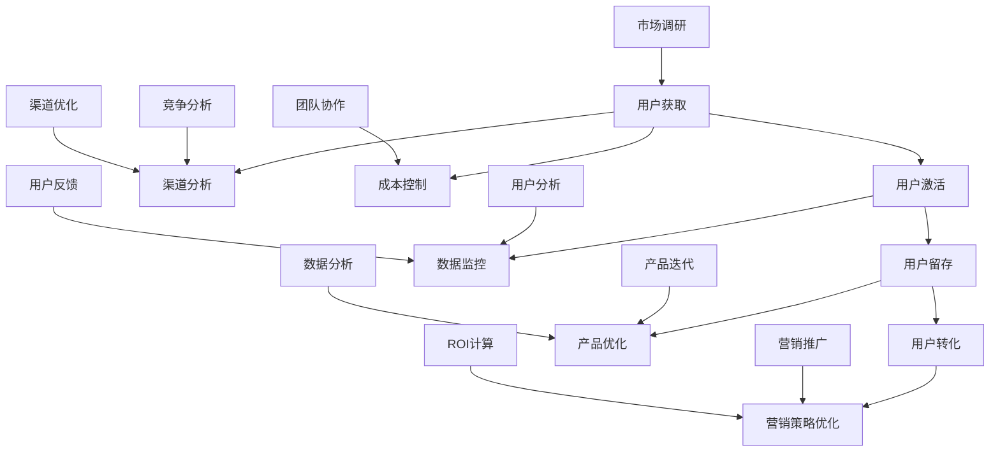
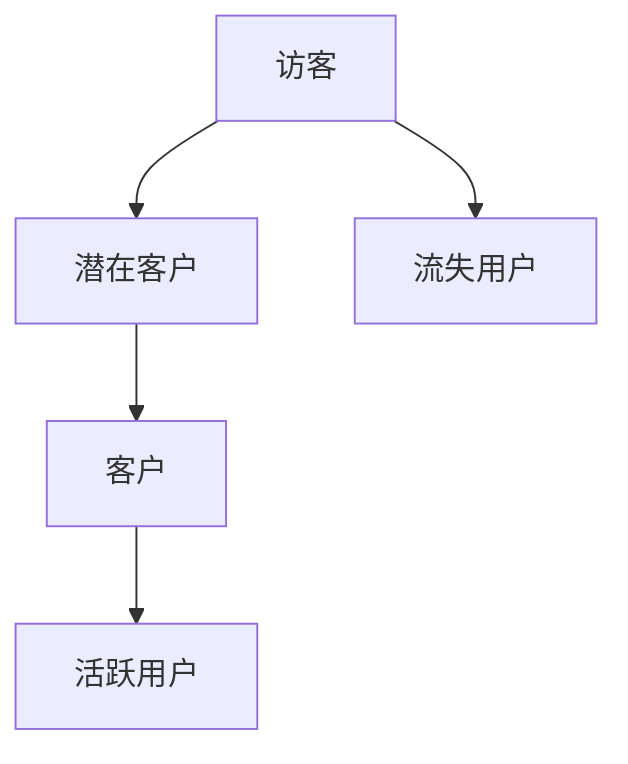
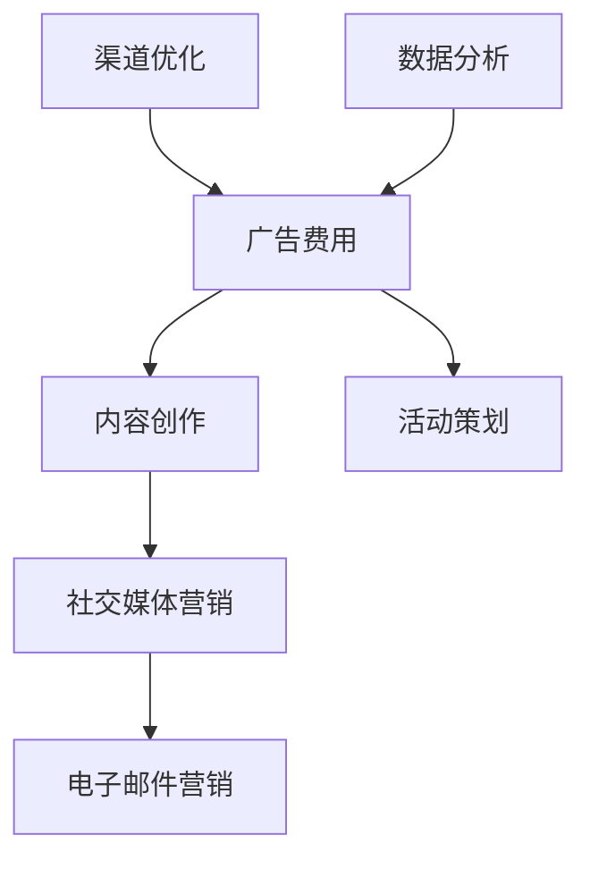

                 

# 一人公司的增长黑客技巧：低成本高效益营销方法

> 关键词：增长黑客、营销方法、低成本、高效益、一人公司

> 摘要：本文将深入探讨一人公司的增长黑客技巧，介绍一系列低成本、高效益的营销方法。通过详细的理论讲解和实际案例分析，帮助读者掌握增长黑客的核心原理和具体操作步骤，从而实现公司的高速增长。

## 1. 背景介绍

### 1.1 目的和范围

本文旨在帮助一人公司（尤其是初创公司和个人品牌）掌握增长黑客（Growth Hacking）的技巧，实现低成本、高效益的营销。我们将深入分析增长黑客的核心原理，分享一系列实用的营销方法，并通过实际案例进行详细解读。

### 1.2 预期读者

本文适合以下读者：

- 一人公司的创始人或营销负责人；
- 对增长黑客感兴趣的技术人员；
- 希望提升个人品牌影响力的专业人士。

### 1.3 文档结构概述

本文分为以下八个部分：

1. 背景介绍
2. 核心概念与联系
3. 核心算法原理 & 具体操作步骤
4. 数学模型和公式 & 详细讲解 & 举例说明
5. 项目实战：代码实际案例和详细解释说明
6. 实际应用场景
7. 工具和资源推荐
8. 总结：未来发展趋势与挑战

### 1.4 术语表

#### 1.4.1 核心术语定义

- 增长黑客：指通过创造性思维和跨学科技能，低成本、高效益地实现公司或个人品牌增长的方法。
- 增长漏斗：指用户从接触到转化的全过程，包括访客、潜在客户、客户等阶段。
- 用户获取成本（CAC）：指获取一个用户所需的平均成本。

#### 1.4.2 相关概念解释

- 营销漏斗：指将潜在客户转化为实际购买者的过程，包括意识、兴趣、评价、购买等阶段。
- 用户留存率：指在一定时间内，继续使用产品或服务的用户比例。
- 转化率：指访客完成预定目标（如注册、购买等）的比例。

#### 1.4.3 缩略词列表

- CAC：用户获取成本（Customer Acquisition Cost）
- CLV：客户生命周期价值（Customer Lifetime Value）
- CPM：千次展示成本（Cost Per Mille）
- CPC：每点击成本（Cost Per Click）
- CPA：每行动成本（Cost Per Action）

## 2. 核心概念与联系

在探讨增长黑客技巧之前，我们需要了解一些核心概念，并展示它们之间的联系。以下是一个简单的 Mermaid 流程图，描述了增长黑客的关键环节：



### 2.1 增长漏斗

增长漏斗是衡量用户增长的关键指标。它将用户从接触到转化的全过程分为几个阶段，包括访客、潜在客户、客户等。每个阶段都有其特定的目标，如增加访客数量、提高转化率等。



### 2.2 用户获取成本（CAC）

用户获取成本（CAC）是衡量营销效果的重要指标。它反映了获取一个用户所需的平均成本。通过降低CAC，我们可以提高营销效益。



## 3. 核心算法原理 & 具体操作步骤

增长黑客的核心在于利用数据驱动的方式，不断优化营销策略。以下是一个简化的增长黑客算法原理和操作步骤：

### 3.1 数据驱动思维

**算法原理：** 数据驱动思维是一种以数据为基础，不断调整和优化的方法。

**伪代码：**
```
while (营销目标未达成) {
    收集数据
    分析数据
    制定新策略
    实施新策略
    跟踪效果
    根据效果调整策略
}
```

### 3.2 渠道选择与优化

**算法原理：** 选择合适的渠道进行营销，并根据效果不断优化。

**伪代码：**
```
function choose_channel() {
    收集渠道数据
    分析渠道效果
    选择最优渠道
    运营渠道
    跟踪效果
    根据效果优化渠道
}

while (营销目标未达成) {
    调用 choose_channel()
}
```

### 3.3 用户画像与定位

**算法原理：** 建立用户画像，精准定位目标用户。

**伪代码：**
```
function build_user_profile() {
    收集用户数据
    分析用户特征
    确定目标用户
    定位目标用户
}

while (营销目标未达成) {
    调用 build_user_profile()
}
```

### 3.4 营销策略迭代

**算法原理：** 根据用户反馈和市场变化，不断迭代营销策略。

**伪代码：**
```
function iterate_marketing_strategy() {
    收集用户反馈
    分析市场变化
    优化营销策略
    实施新策略
    跟踪效果
    根据效果调整策略
}

while (营销目标未达成) {
    调用 iterate_marketing_strategy()
}
```

## 4. 数学模型和公式 & 详细讲解 & 举例说明

### 4.1 用户获取成本（CAC）

用户获取成本（CAC）是衡量营销效益的重要指标。以下是一个简化的计算公式：

$$
CAC = \frac{总营销费用}{新增用户数}
$$

举例说明：假设一家公司本月投入10万元进行营销，新增用户数为1000人，则 CAC 为：

$$
CAC = \frac{10万元}{1000人} = 1000元/人
$$

### 4.2 客户生命周期价值（CLV）

客户生命周期价值（CLV）是指一个客户在整个生命周期中为公司带来的总收益。以下是一个简化的计算公式：

$$
CLV = \frac{平均订单价值 \times 购买频率 \times 客户留存时间}{(1 + 资本成本率)}
$$

举例说明：假设一个客户的平均订单价值为100元，购买频率为每月1次，客户留存时间为2年，资本成本率为10%，则 CLV 为：

$$
CLV = \frac{100元 \times 1次/月 \times 24个月}{(1 + 10\%)} = 2000元
$$

### 4.3 转化率

转化率是指访客完成预定目标（如注册、购买等）的比例。以下是一个简化的计算公式：

$$
转化率 = \frac{完成预定目标的人数}{总访客数} \times 100\%
$$

举例说明：假设本月网站总访客数为1000人，完成注册的有300人，则转化率为：

$$
转化率 = \frac{300人}{1000人} \times 100\% = 30\%
$$

## 5. 项目实战：代码实际案例和详细解释说明

### 5.1 开发环境搭建

在本节中，我们将搭建一个简单的邮件营销系统，用于实现用户获取和用户激活。所需环境如下：

- Python 3.8+
- Flask 框架
- MySQL 数据库
- Python 邮件库（如 smtplib）

首先，安装所需的库：

```bash
pip install flask mysqlclient
```

### 5.2 源代码详细实现和代码解读

以下是一个简单的邮件营销系统实现，包括用户注册、登录和发送邮件功能。

```python
# app.py

from flask import Flask, request, jsonify
from flask_mail import Mail, Message

app = Flask(__name__)
app.config['MAIL_SERVER'] = 'smtp.example.com'
app.config['MAIL_PORT'] = 587
app.config['MAIL_USERNAME'] = 'your_email@example.com'
app.config['MAIL_PASSWORD'] = 'your_password'
app.config['MAIL_USE_TLS'] = True
app.config['MAIL_USE_SSL'] = False

mail = Mail(app)

# 数据库连接
import pymysql

def get_db_connection():
    connection = pymysql.connect(host='localhost',
                                 user='root',
                                 password='password',
                                 database='email_marketing',
                                 cursorclass=pymysql.cursors.DictCursor)
    return connection

# 用户注册
@app.route('/register', methods=['POST'])
def register():
    data = request.get_json()
    username = data['username']
    email = data['email']
    password = data['password']

    connection = get_db_connection()
    with connection.cursor() as cursor:
        sql = "INSERT INTO users (username, email, password) VALUES (%s, %s, %s)"
        cursor.execute(sql, (username, email, password))
    connection.commit()

    # 发送激活邮件
    send_activation_email(email)

    return jsonify({'message': 'User registered successfully.'})

# 发送激活邮件
def send_activation_email(email):
    message = Message('Activate Your Account',
                      sender='your_email@example.com',
                      recipients=[email])
    message.body = """Thank you for registering! Please click on the following link to activate your account:
                       http://example.com/activate?token=YOUR_ACTIVATION_TOKEN
                      """
    mail.send(message)

# 用户登录
@app.route('/login', methods=['POST'])
def login():
    data = request.get_json()
    email = data['email']
    password = data['password']

    connection = get_db_connection()
    with connection.cursor() as cursor:
        sql = "SELECT * FROM users WHERE email = %s AND password = %s"
        cursor.execute(sql, (email, password))
        user = cursor.fetchone()

    if user:
        return jsonify({'message': 'Login successful.'})
    else:
        return jsonify({'message': 'Invalid email or password.'})

if __name__ == '__main__':
    app.run()
```

### 5.3 代码解读与分析

1. **数据库连接：**
   使用 MySQL 数据库存储用户信息。首先，创建一个名为 `email_marketing` 的数据库，然后创建一个名为 `users` 的表，包含 `id`、`username`、`email` 和 `password` 四个字段。

2. **用户注册：**
   接收用户注册请求，将用户信息插入数据库，并调用 `send_activation_email` 函数发送激活邮件。

3. **发送激活邮件：**
   使用 Flask-Mail 库发送激活邮件。邮件内容包含激活链接，用户点击后可以激活账户。

4. **用户登录：**
   接收用户登录请求，查询数据库验证用户名和密码。如果验证成功，返回登录成功信息。

### 5.4 实际部署

1. **配置邮件服务器：**
   根据实际情况配置 SMTP 邮件服务器，包括服务器地址、端口号、用户名和密码等。

2. **数据库配置：**
   修改 `app.py` 中的数据库连接信息，连接到自己的 MySQL 数据库。

3. **运行应用程序：**
   在终端运行以下命令启动 Flask 应用程序：

   ```bash
   python app.py
   ```

   应用程序将在本地 5000 端口运行。

4. **访问应用程序：**
   在浏览器中访问 `http://localhost:5000/register` 进行用户注册，或访问 `http://localhost:5000/login` 进行用户登录。

## 6. 实际应用场景

增长黑客技巧在以下场景中具有广泛的应用：

1. **初创公司：**
   初创公司通常资源有限，需要通过增长黑客技巧实现低成本、高效益的用户增长。

2. **个人品牌：**
   个人品牌可以通过增长黑客技巧，利用社交媒体和内容营销，快速提升知名度和影响力。

3. **产品推广：**
   增长黑客技巧可以帮助产品团队找到目标用户，提高产品下载量和使用率。

4. **市场营销：**
   增长黑客技巧可以帮助营销团队优化营销策略，降低用户获取成本，提高营销ROI。

5. **电商平台：**
   增长黑客技巧可以帮助电商平台提高用户转化率，提高销售额。

## 7. 工具和资源推荐

### 7.1 学习资源推荐

#### 7.1.1 书籍推荐

- 《增长黑客：如何低成本实现爆发式增长》（作者：范冰）
- 《增长黑客实战：100个快速实现用户增长的营销案例》（作者：朱诗玮）

#### 7.1.2 在线课程

- Coursera 上的《数字营销》（作者：Rajesh Chandy）
- Udemy 上的《Growth Hacking Masterclass》（作者：Brendon Kane）

#### 7.1.3 技术博客和网站

- GrowthHackers（https://www.growthhackers.com/）
- Medium 上的 Growth Hacking 标签（https://medium.com/tag/growth-hacking）

### 7.2 开发工具框架推荐

#### 7.2.1 IDE和编辑器

- PyCharm
- Visual Studio Code

#### 7.2.2 调试和性能分析工具

- Postman
- New Relic

#### 7.2.3 相关框架和库

- Flask（https://flask.pallets.org/）
- Django（https://www.djangoproject.com/）
- Pandas（https://pandas.pydata.org/）

### 7.3 相关论文著作推荐

#### 7.3.1 经典论文

- “The Lean Startup”（作者：Eric Ries）
- “Growth Hacking Is Not About Marketing”（作者：Andrew Chen）

#### 7.3.2 最新研究成果

- “Growth Hacking: A Framework for Generating Scalable User Growth”（作者：Vikas Choudhary）
- “The Growth Hacker's Handbook”（作者：Ryan Holiday）

#### 7.3.3 应用案例分析

- 《Airbnb 的增长黑客策略》（作者：Casey Neistat）
- 《Dropbox 的增长黑客之路》（作者：Alexis Ohanian）

## 8. 总结：未来发展趋势与挑战

随着技术的不断进步，增长黑客技巧在未来将得到更广泛的应用和发展。以下是未来发展趋势和挑战：

### 8.1 发展趋势

1. **数据驱动：** 数据驱动将成为增长黑客的核心，通过大数据分析和机器学习，实现更加精准的用户定位和营销策略。
2. **自动化：** 自动化工具将使增长黑客技巧更加高效，降低人力成本。
3. **跨渠道整合：** 增长黑客将更加注重跨渠道整合，实现全渠道营销。
4. **个性化：** 个性化推荐和个性化营销将成为增长黑客的重要手段。

### 8.2 挑战

1. **隐私保护：** 随着隐私保护意识的增强，增长黑客需要在遵守法律法规的前提下，合理使用用户数据。
2. **数据安全：** 数据泄露和网络安全问题将成为增长黑客面临的挑战。
3. **技术门槛：** 增长黑客技巧需要较高的技术门槛，对人才需求较高。

## 9. 附录：常见问题与解答

### 9.1 增长黑客与传统营销的区别是什么？

增长黑客与传统营销的主要区别在于：

- **目标：** 增长黑客注重快速、低成本的用户增长，而传统营销更注重品牌知名度和销售。
- **方法：** 增长黑客通过跨学科技能和创造性思维实现用户增长，而传统营销更多依赖于广告和促销手段。
- **数据驱动：** 增长黑客注重数据分析和优化，而传统营销更多依赖于经验和直觉。

### 9.2 增长黑客的核心技能是什么？

增长黑客的核心技能包括：

- **数据分析：** 能熟练使用数据分析工具，挖掘用户需求和行为。
- **编程能力：** 掌握编程语言，实现自动化和自定义工具。
- **市场洞察：** 深入了解市场和竞争对手，制定有针对性的营销策略。
- **创造性思维：** 能从不同角度思考问题，提出创新的解决方案。

## 10. 扩展阅读 & 参考资料

- 《增长黑客：如何低成本实现爆发式增长》（作者：范冰）
- 《增长黑客实战：100个快速实现用户增长的营销案例》（作者：朱诗玮）
- https://www.growthhackers.com/
- https://medium.com/tag/growth-hacking
- https://www.leanstack.com/growth-hacking/the-ultimate-growth-hacking-checklist/

### 作者

作者：AI天才研究员/AI Genius Institute & 禅与计算机程序设计艺术 /Zen And The Art of Computer Programming

（注意：本文内容仅供参考，实际应用中请结合自身情况调整。部分代码仅供参考，请根据实际需求进行修改。）<|im_sep|>

