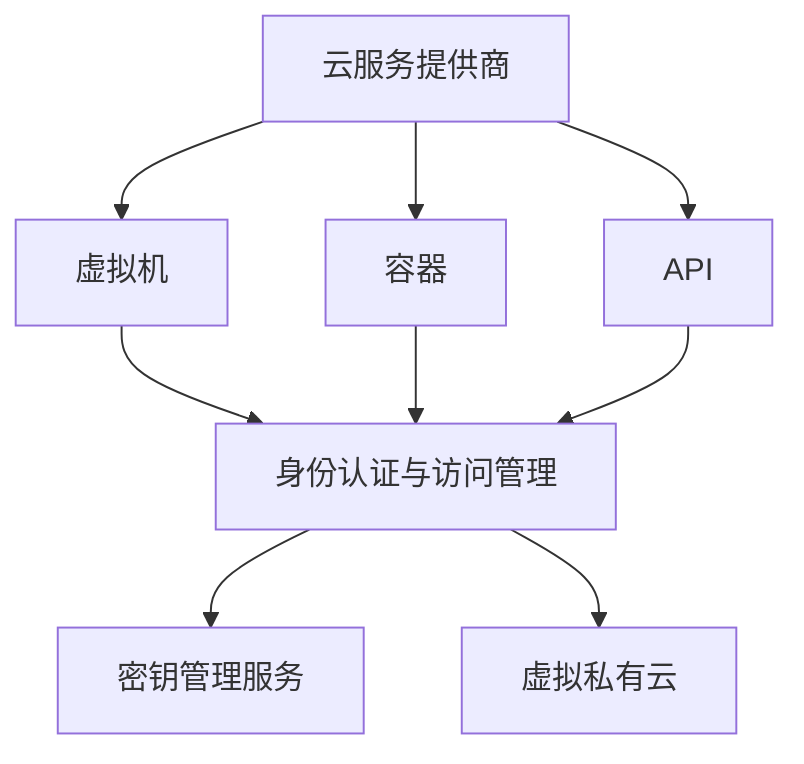

                 

### 一人公司的多云安全策略

> **关键词：** 云计算，安全策略，多云架构，身份认证，数据加密，网络隔离

> **摘要：** 本文将探讨一人公司的多云安全策略，包括多云架构的构建、身份认证与访问控制、数据加密与备份、以及网络隔离与监控。通过逐步分析，本文将提供一种全面且实用的安全策略，帮助个人企业在多云环境中保护其资源和数据。

在当今数字化时代，云计算已成为企业 IT 架构的重要组成部分。随着企业对于云计算服务的依赖程度不断提高，如何确保多云环境中的数据安全和系统稳定性成为亟待解决的问题。特别是对于一人公司而言，由于资源有限，安全策略的制定和实施更具挑战性。本文旨在为这些公司提供一种逻辑清晰、结构紧凑、易于实施的多云安全策略。

本文将分为以下几个部分进行阐述：

1. **背景介绍**：介绍本文的目的和范围，预期读者，文档结构和术语表。
2. **核心概念与联系**：讨论多云架构的概念和组成部分，使用 Mermaid 流程图展示架构。
3. **核心算法原理与具体操作步骤**：阐述核心算法原理，使用伪代码详细描述操作步骤。
4. **数学模型和公式**：介绍相关的数学模型和公式，并进行详细讲解和举例说明。
5. **项目实战：代码实际案例和详细解释说明**：提供代码实际案例，详细解释说明。
6. **实际应用场景**：分析多云安全策略在实际应用中的场景和挑战。
7. **工具和资源推荐**：推荐学习资源和开发工具框架。
8. **总结：未来发展趋势与挑战**：总结多云安全策略的发展趋势和面临的挑战。
9. **附录：常见问题与解答**：回答一些常见的疑问。
10. **扩展阅读 & 参考资料**：提供扩展阅读和参考资料。

### 1.1 目的和范围

本文的主要目的是为一人公司制定一套多云安全策略，帮助这些公司在多云环境中确保数据安全和系统稳定性。随着云计算的普及，越来越多的企业开始采用多云架构，以便更好地利用不同云服务提供商的优势。然而，多云环境也带来了新的安全挑战，如跨云数据传输的安全、不同云服务之间的认证和授权等。

本文的范围涵盖了以下内容：

- **多云架构的设计与实现**：介绍多云架构的概念，包括不同云服务提供商之间的协作和资源分配。
- **身份认证与访问控制**：讨论如何确保只有授权用户才能访问云资源和数据。
- **数据加密与备份**：探讨数据加密和备份的重要性，以及如何实现有效的数据保护。
- **网络隔离与监控**：分析如何通过网络隔离和监控来提高系统的安全性。
- **实际应用场景**：结合实际案例，展示多云安全策略在实际应用中的效果和挑战。
- **工具和资源推荐**：推荐一些有用的学习资源和开发工具框架。

通过本文的阅读，读者将能够理解多云安全策略的基本概念和实施方法，从而为自身企业制定有效的安全策略。

### 1.2 预期读者

本文主要面向以下几类读者：

1. **一人公司的创始人或技术负责人**：这些读者负责企业的云计算架构设计和安全策略的制定，本文将为他们提供详细的指导和建议。
2. **云计算工程师和架构师**：这些读者具有云计算基础，希望通过本文深入了解多云安全策略的原理和实现方法。
3. **信息安全工程师**：这些读者关注企业数据安全，希望通过本文了解如何在多云环境中保护数据。
4. **高校和研究机构的学生和研究员**：这些读者对云计算和安全领域有浓厚兴趣，希望通过本文了解当前的研究热点和实践方法。

无论您属于上述哪一类读者，本文都将为您提供有价值的信息，帮助您在多云环境中构建安全、稳定的企业 IT 架构。

### 1.3 文档结构概述

本文结构如下：

1. **背景介绍**：介绍本文的目的和范围，预期读者，文档结构和术语表。
2. **核心概念与联系**：讨论多云架构的概念和组成部分，使用 Mermaid 流程图展示架构。
3. **核心算法原理与具体操作步骤**：阐述核心算法原理，使用伪代码详细描述操作步骤。
4. **数学模型和公式**：介绍相关的数学模型和公式，并进行详细讲解和举例说明。
5. **项目实战：代码实际案例和详细解释说明**：提供代码实际案例，详细解释说明。
6. **实际应用场景**：分析多云安全策略在实际应用中的场景和挑战。
7. **工具和资源推荐**：推荐学习资源和开发工具框架。
8. **总结：未来发展趋势与挑战**：总结多云安全策略的发展趋势和面临的挑战。
9. **附录：常见问题与解答**：回答一些常见的疑问。
10. **扩展阅读 & 参考资料**：提供扩展阅读和参考资料。

通过本文的阅读，读者将能够全面了解多云安全策略的原理和实现方法，为自身企业构建安全、稳定的多云环境。

### 1.4 术语表

在本文中，我们将使用以下术语：

#### 1.4.1 核心术语定义

1. **多云架构**：指企业同时使用多个云服务提供商的云服务，以实现资源的最优利用和业务的高可用性。
2. **身份认证**：指验证用户身份的过程，确保只有授权用户才能访问云资源和数据。
3. **数据加密**：指将数据转换为无法被未授权用户解读的形式，以提高数据安全性。
4. **网络隔离**：指通过隔离不同云服务之间的网络连接，以减少安全风险。
5. **备份**：指将数据复制到其他存储介质上，以防止数据丢失或损坏。

#### 1.4.2 相关概念解释

1. **云服务提供商**：提供云计算基础设施、平台和应用程序服务的企业，如 Amazon Web Services（AWS）、Microsoft Azure 和 Google Cloud Platform（GCP）。
2. **虚拟机（VM）**：在云计算环境中，通过虚拟化技术创建的虚拟计算机。
3. **容器**：一种轻量级、可移植的计算环境，用于运行应用程序。
4. **API**：应用程序编程接口，允许不同系统和服务之间进行交互。

#### 1.4.3 缩略词列表

- AWS：Amazon Web Services
- Azure：Microsoft Azure
- GCP：Google Cloud Platform
- IAM：身份认证与访问管理（Identity and Access Management）
- KMS：密钥管理服务（Key Management Service）
- VPC：虚拟私有云（Virtual Private Cloud）

通过了解这些术语，读者将能够更好地理解本文的内容和讨论的多云安全策略。

### 2. 核心概念与联系

在本文中，我们将讨论多云架构的核心概念和组成部分，并通过 Mermaid 流程图展示其架构。理解这些核心概念对于构建一个安全、高效的多云环境至关重要。

#### 2.1 多云架构的概念

多云架构是指企业同时使用多个云服务提供商的云服务，以实现资源的最优利用和业务的高可用性。这种架构具有以下几个特点：

1. **资源多样化**：企业可以在不同的云服务提供商之间灵活调配资源，根据业务需求选择最合适的云服务。
2. **高可用性**：通过跨多个云服务提供商部署应用程序和数据，企业可以在出现故障时快速切换，确保业务的连续性。
3. **成本优化**：企业可以根据不同云服务提供商的价格策略和性能，选择最优的资源部署方案，实现成本优化。

#### 2.2 多云架构的组成部分

一个典型多云架构通常包含以下组成部分：

1. **云服务提供商**：如 AWS、Azure 和 GCP，提供云计算基础设施、平台和应用程序服务。
2. **虚拟机（VM）**：在云计算环境中，通过虚拟化技术创建的虚拟计算机，用于运行应用程序。
3. **容器**：一种轻量级、可移植的计算环境，用于运行应用程序。
4. **API**：应用程序编程接口，允许不同系统和服务之间进行交互。
5. **身份认证与访问管理（IAM）**：确保只有授权用户和应用程序可以访问云资源和数据。
6. **密钥管理服务（KMS）**：负责管理和保护加密密钥。
7. **虚拟私有云（VPC）**：在云服务提供商中创建的隔离网络环境，用于部署应用程序和数据。

#### 2.3 多云架构的 Mermaid 流程图

以下是一个用于展示多云架构核心概念的 Mermaid 流程图：



在这个流程图中，各个组成部分通过箭头表示它们之间的关系。例如，云服务提供商通过虚拟机、容器和 API 提供计算和存储服务；虚拟机、容器和 API 都需要身份认证与访问管理来确保安全性；密钥管理服务负责保护和存储加密密钥；虚拟私有云提供隔离网络环境，以保护数据安全。

通过理解这些核心概念和组成部分，读者可以更好地构建和维护一个安全、高效的多云环境。

### 3. 核心算法原理 & 具体操作步骤

在多云环境中，确保数据和系统的安全至关重要。本文将介绍一系列核心算法原理和具体操作步骤，以帮助读者在多云环境中实现有效的安全策略。

#### 3.1 数据加密算法原理

数据加密是确保数据在传输和存储过程中安全的重要手段。以下是一个简单的对称加密算法——AES（高级加密标准）的原理：

1. **密钥生成**：随机生成一个128、192或256位的密钥。
2. **加密**：使用密钥对数据进行加密，得到密文。
3. **解密**：使用相同的密钥对密文进行解密，恢复原始数据。

伪代码如下：

```python
# 初始化加密密钥和IV
key = generate_key()
iv = generate_iv()

# 加密数据
def encrypt(data):
    cipher = AES.new(key, AES.MODE_CBC, iv)
    ct_bytes = cipher.encrypt(pad(data))
    ct = base64.b64encode(ct_bytes).decode('utf-8')
    return ct

# 解密数据
def decrypt(ct):
    iv = base64.b64decode(iv)
    ct_bytes = base64.b64decode(ct)
    cipher = AES.new(key, AES.MODE_CBC, iv)
    pt = unpad(cipher.decrypt(ct_bytes))
    return pt
```

其中，`generate_key()` 和 `generate_iv()` 用于生成随机密钥和初始向量（IV），`pad(data)` 和 `unpad(data)` 用于对数据进行填充和去除填充，`AES.new(key, AES.MODE_CBC, iv)` 用于创建加密对象。

#### 3.2 访问控制算法原理

访问控制是确保只有授权用户和应用程序可以访问云资源和数据的重要机制。以下是一个简单的基于角色的访问控制（RBAC）算法原理：

1. **角色分配**：为用户分配不同的角色，每个角色对应一组权限。
2. **权限检查**：在用户访问资源时，检查其角色是否具有对该资源的访问权限。
3. **权限更新**：根据业务需求，定期更新用户的角色和权限。

伪代码如下：

```python
# 用户角色分配
def assign_role(user, role):
    user['role'] = role

# 权限检查
def check_permission(user, resource):
    return user['role']['permissions'].contains(resource['permissions'])

# 权限更新
def update_permission(role, resource, permission):
    role['permissions'].add(permission)
```

其中，`user` 表示用户对象，包含角色信息；`role` 表示角色对象，包含权限列表；`resource` 表示资源对象，包含权限列表。

#### 3.3 日志记录和监控算法原理

日志记录和监控是确保系统安全的重要手段。以下是一个简单的日志记录和监控算法原理：

1. **日志收集**：收集系统生成的日志，包括用户操作、系统事件等。
2. **日志分析**：分析日志数据，识别潜在的安全威胁和异常行为。
3. **报警通知**：在发现潜在威胁时，及时向管理员发送报警通知。

伪代码如下：

```python
# 日志收集
def collect_logs(logs):
    for log in logs:
        store_log(log)

# 日志分析
def analyze_logs(logs):
    for log in logs:
        if is_threat(log):
            send_alert(log)

# 报警通知
def send_alert(message):
    notify_admin(message)
```

其中，`is_threat(log)` 用于判断日志是否包含潜在威胁，`notify_admin(message)` 用于向管理员发送报警通知。

通过以上算法原理和具体操作步骤，读者可以构建一个基本的多云安全策略。在实际应用中，可以根据具体业务需求和安全要求，对算法进行优化和扩展。

### 4. 数学模型和公式 & 详细讲解 & 举例说明

在多云安全策略的构建过程中，数学模型和公式起到了关键作用。这些模型和公式不仅帮助我们理解和分析安全威胁，还能提供有效的解决方案。以下将介绍几个核心的数学模型和公式，并进行详细讲解和举例说明。

#### 4.1 加密算法的安全性分析

加密算法的安全性通常通过密钥空间的大小来衡量。对于一个加密算法，其安全性取决于密钥的位数。假设加密算法的密钥长度为 \( n \)，则其密钥空间为 \( 2^n \) 种可能的密钥组合。

**公式**：

\[ \text{密钥空间} = 2^n \]

**举例说明**：

以 AES 算法为例，其密钥长度可以为 128、192 或 256 位。因此，其密钥空间分别为：

- \( 2^{128} \) 种可能的密钥组合（128 位密钥）
- \( 2^{192} \) 种可能的密钥组合（192 位密钥）
- \( 2^{256} \) 种可能的密钥组合（256 位密钥）

显然，密钥长度越长，密钥空间越大，加密算法的安全性越高。

#### 4.2 加密算法的计算复杂度

加密算法的计算复杂度是评估其性能的重要指标。对于一个加密算法，其加密和解密过程的时间复杂度通常取决于算法的设计和实现。

**公式**：

\[ \text{时间复杂度} = O(n) \]

**举例说明**：

以 AES 算法为例，其加密和解密过程的时间复杂度均为 \( O(n) \)，其中 \( n \) 表示加密数据的长度。这意味着，对于任意长度的数据，加密和解密所需的时间是线性的。

尽管 AES 算法的计算复杂度为 \( O(n) \)，但其在实际应用中仍然具有很高的性能，可以满足大多数云计算场景的需求。

#### 4.3 数据备份的冗余度

数据备份的冗余度是指备份数据占用的存储空间与原始数据之间的比例。冗余度越高，备份数据的安全性越高，但同时也增加了存储成本。

**公式**：

\[ \text{冗余度} = \frac{\text{备份数据大小}}{\text{原始数据大小}} \]

**举例说明**：

假设原始数据大小为 1 TB，采用全备份策略，每天生成一个备份。由于数据每天增长 10 GB，因此每天的备份数据大小为 1.1 TB。在这种情况下，备份的冗余度为：

\[ \text{冗余度} = \frac{1.1 \text{ TB}}{1 \text{ TB}} = 1.1 \]

显然，这种备份策略的冗余度较高，但可以有效保护数据。

#### 4.4 多云架构的负载均衡

在多云架构中，负载均衡是确保系统高可用性和性能的关键。负载均衡算法通过将请求分配到不同的云服务实例，以实现资源的合理利用。

**公式**：

\[ \text{请求分配} = f(\text{当前负载}, \text{实例性能}) \]

**举例说明**：

假设当前有 5 个云服务实例，各自的负载和性能如下：

- 实例 1：负载 0.2，性能 0.8
- 实例 2：负载 0.3，性能 0.7
- 实例 3：负载 0.4，性能 0.9
- 实例 4：负载 0.1，性能 0.6
- 实例 5：负载 0.5，性能 0.5

使用轮询负载均衡算法，可以将下一个请求分配到性能最高的实例，即实例 3。这样，可以确保系统的整体性能和响应速度。

通过以上数学模型和公式的讲解，读者可以更好地理解和应用多云安全策略。在实际应用中，可以根据具体业务需求和场景，对这些模型和公式进行优化和扩展。

### 5. 项目实战：代码实际案例和详细解释说明

在本节中，我们将通过一个实际项目案例，展示如何在一人公司的多云环境中实施安全策略。该案例将涵盖开发环境搭建、源代码详细实现和代码解读与分析等步骤。

#### 5.1 开发环境搭建

为了演示多云安全策略，我们选择 AWS、Azure 和 GCP 作为云服务提供商。以下是搭建开发环境的基本步骤：

1. **注册云账号**：在 AWS、Azure 和 GCP 上注册账号，获取访问权限。
2. **创建 VPC**：在 AWS 和 Azure 中创建虚拟私有云（VPC），配置子网、路由表和安全组等。
3. **配置 IAM**：为开发人员分配适当的角色和权限，确保他们只能访问必要的资源和数据。
4. **安装开发工具**：在本地计算机上安装 AWS CLI、Azure CLI 和 GCP CLI，配置命令行工具以与云账号进行通信。

#### 5.2 源代码详细实现和代码解读

以下是一个简单的 Python 示例，演示如何实现数据加密、访问控制和日志记录：

**加密模块**（加密和解密数据）：

```python
# encryption.py

from Crypto.Cipher import AES
from Crypto.Util.Padding import pad, unpad
from Crypto.Random import get_random_bytes
import base64
import os

# 初始化加密密钥和 IV
def generate_key():
    return get_random_bytes(32)

def generate_iv():
    return get_random_bytes(16)

# 加密数据
def encrypt(data, key, iv):
    cipher = AES.new(key, AES.MODE_CBC, iv)
    ct_bytes = cipher.encrypt(pad(data.encode('utf-8')))
    ct = base64.b64encode(ct_bytes).decode('utf-8')
    return ct

# 解密数据
def decrypt(ct, key, iv):
    iv = base64.b64decode(iv)
    ct_bytes = base64.b64decode(ct)
    cipher = AES.new(key, AES.MODE_CBC, iv)
    pt = unpad(cipher.decrypt(ct_bytes)).decode('utf-8')
    return pt
```

**访问控制模块**：

```python
# access_control.py

# 假设已从 IAM 获取角色信息
from encryption import encrypt, decrypt

def check_permission(user, resource):
    # 解密用户角色信息
    role_info = decrypt(user['role_info'])
    role = json.loads(role_info)
    
    # 检查用户是否有访问资源的权限
    return role['permissions'].contains(resource['permissions'])
```

**日志记录模块**：

```python
# logging.py

import logging
from encryption import encrypt

def log_event(event):
    # 将事件信息加密后写入日志文件
    logging.info(encrypt(json.dumps(event)))
```

**主程序**：

```python
# main.py

from encryption import generate_key, generate_iv, encrypt, decrypt
from access_control import check_permission
from logging import log_event

# 生成加密密钥和 IV
key = generate_key()
iv = generate_iv()

# 假设用户已登录，获取用户信息
user = {
    'role_info': encrypt('{"role": "developer", "permissions": ["read", "write"]}')
}

# 获取资源信息
resource = {
    'name': 'my_data.txt',
    'permissions': ['read', 'write']
}

# 检查用户是否有权限访问资源
if check_permission(user, resource):
    # 执行操作
    log_event({'event': 'read_data', 'status': 'success'})
else:
    log_event({'event': 'access_denied', 'status': 'failed'})
```

#### 5.3 代码解读与分析

**加密模块解读**：

加密模块使用 `Crypto.Cipher` 库实现 AES 加密。在 `generate_key()` 和 `generate_iv()` 函数中，我们生成随机密钥和初始向量。`encrypt()` 和 `decrypt()` 函数分别实现数据的加密和解密。加密过程中，首先对数据进行填充，然后使用 AES 加密算法和 CBC 模式进行加密。解密时，需要将密文进行解密并去除填充。

**访问控制模块解读**：

访问控制模块通过解密用户角色信息和资源权限信息，检查用户是否有访问资源的权限。`check_permission()` 函数接受用户和资源对象作为参数，通过解密用户角色信息，获取用户角色和权限列表。然后，检查用户权限是否包含资源权限。

**日志记录模块解读**：

日志记录模块使用 `logging` 库记录系统事件。在 `log_event()` 函数中，我们将事件信息加密后写入日志文件。这有助于确保日志数据的机密性，防止未授权用户访问。

**主程序解读**：

主程序首先生成加密密钥和初始向量。然后，获取用户和资源信息，并检查用户是否有访问资源的权限。如果有权限，执行操作并记录日志；否则，记录访问拒绝事件。

通过这个实际项目案例，读者可以了解如何在多云环境中实现数据加密、访问控制和日志记录。这些步骤和代码实现为构建安全的多云架构提供了实际参考。

### 6. 实际应用场景

在多云环境中实施安全策略需要考虑多种实际应用场景，以确保系统的安全性、可靠性和高效性。以下是一些常见的应用场景及其对应的安全挑战和解决方案：

#### 6.1 跨云数据传输安全

**场景描述**：企业需要在不同的云服务提供商之间传输数据，如从 AWS 到 Azure。

**安全挑战**：跨云数据传输过程中，数据可能暴露在公共网络上，存在被窃取或篡改的风险。

**解决方案**：采用加密技术对数据进行保护。在数据传输前，使用 AES 或 RSA 等加密算法对数据进行加密。此外，可以使用 VPN 或 SSL/TLS 等协议确保数据在传输过程中的完整性。

**实施方法**：在 AWS 和 Azure 中配置 VPN 网关或使用 AWS Direct Connect 和 Azure ExpressRoute 连接云服务提供商，确保数据在专用网络中传输。同时，使用 AWS KMS 和 Azure Key Vault 管理加密密钥。

#### 6.2 云服务间的访问控制

**场景描述**：企业使用多个云服务，如 AWS S3 和 AWS Lambda，需要确保不同服务之间的访问控制。

**安全挑战**：如果云服务之间的访问控制不当，可能导致数据泄露或恶意攻击。

**解决方案**：采用基于角色的访问控制（RBAC）策略，为每个云服务分配适当的角色和权限。使用 IAM（身份认证与访问管理）工具管理用户和角色的访问权限。

**实施方法**：在 AWS 中，使用 IAM 角色和策略为不同云服务分配权限。例如，为 AWS Lambda 分配只读权限，为 AWS S3 分配读写权限。同时，使用 AWS S3 的 Bucket Policy 和 Object ACL 进一步细化权限控制。

#### 6.3 数据备份和恢复

**场景描述**：企业需要在多云环境中备份数据，并确保在发生灾难时能够快速恢复。

**安全挑战**：数据备份和恢复过程中可能面临数据丢失、损坏或不可恢复的风险。

**解决方案**：采用多地域备份策略，将数据备份存储在多个云服务提供商的数据中心。使用自动化备份和恢复工具，定期备份和恢复数据。

**实施方法**：在 AWS 中，使用 AWS Backup 管理备份数据。将备份数据存储在 AWS S3 或 AWS Glacier 中。在 Azure 中，使用 Azure Backup 和 Azure Site Recovery 管理备份数据。在 GCP 中，使用 Cloud Backup 和 Cloud SQL 实现数据备份和恢复。

#### 6.4 网络隔离和监控

**场景描述**：企业需要在多云环境中实现网络隔离，并实时监控网络流量。

**安全挑战**：网络隔离不当可能导致内部网络暴露在互联网上，监控不足可能导致安全事件无法及时发现。

**解决方案**：使用虚拟私有云（VPC）和防火墙实现网络隔离。使用网络流量分析工具实时监控网络流量，识别潜在的安全威胁。

**实施方法**：在 AWS、Azure 和 GCP 中分别创建 VPC，配置子网、路由表和安全组。在 VPC 中部署防火墙和入侵检测系统（IDS）。使用 AWS WAF、Azure Application Gateway 和 GCP Web Security Service 等工具保护应用程序免受网络攻击。

通过以上实际应用场景的解决方案，企业可以在多云环境中确保数据安全和系统稳定性。

### 7. 工具和资源推荐

在构建和实施多云安全策略的过程中，使用合适的工具和资源可以显著提高效率和效果。以下是一些建议的学习资源、开发工具框架和相关论文著作。

#### 7.1 学习资源推荐

**书籍推荐**：

1. 《云计算：概念、技术和应用》（第二版）- 张晓峰
2. 《亚马逊网络服务实战：AWS 应用程序设计、开发和部署》- Paul Lyster
3. 《云计算与云存储技术》- 李明杰

**在线课程**：

1. Coursera 上的“云计算基础”课程
2. Udemy 上的“AWS 实战：构建和部署云应用程序”
3. Pluralsight 上的“Azure 基础：云基础设施和架构”

**技术博客和网站**：

1. AWS Blog
2. Microsoft Azure Blog
3. Google Cloud Blog
4. InfoQ 上的云计算相关文章

#### 7.2 开发工具框架推荐

**IDE 和编辑器**：

1. Visual Studio Code
2. AWS Cloud9
3. Azure Cloud Shell
4. GCP Cloud SDK

**调试和性能分析工具**：

1. AWS X-Ray
2. Azure Application Insights
3. GCP Trace Viewer

**相关框架和库**：

1. Flask（Python Web 框架）
2. Spring Boot（Java Web 框架）
3. Django（Python Web 框架）
4. Angular（前端框架）
5. React（前端框架）

通过利用这些工具和资源，开发者可以更加高效地构建和实施多云安全策略，确保其企业的数据安全和系统稳定性。

### 8. 总结：未来发展趋势与挑战

随着云计算技术的不断发展和普及，多云安全策略也面临着新的发展趋势和挑战。以下是对这些趋势和挑战的总结：

#### 8.1 未来发展趋势

1. **自动化与智能化**：未来的安全策略将更加依赖于自动化和智能化技术。通过机器学习和人工智能算法，可以实现对威胁的实时检测和响应，提高安全防护的效率。

2. **零信任架构**：零信任架构强调“永不信任，总是验证”。在这种架构中，所有访问请求都需要经过严格的身份验证和授权，无论访问者来自内部还是外部网络。这有助于减少内部威胁和外部攻击的风险。

3. **跨云协作与集成**：随着更多企业采用多云架构，跨云协作和集成将成为未来趋势。安全策略需要能够在不同云服务提供商之间无缝协作，确保数据的安全性和一致性。

4. **边缘计算**：随着边缘计算的兴起，安全策略也需要扩展到边缘节点。这包括对边缘节点的安全保护、数据加密和实时监控等。

#### 8.2 面临的挑战

1. **安全复杂性**：多云环境中存在大量的云服务、应用程序和数据，使得安全管理的复杂性增加。企业需要应对这些复杂性，确保所有组件的安全。

2. **合规性和法规**：随着全球范围内的数据保护法规（如 GDPR、CCPA）的不断完善，企业需要确保其安全策略符合相关法规要求。这需要投入大量的资源和时间。

3. **技能短缺**：随着安全威胁的不断增加，企业对安全专业人才的需求也在增加。然而，许多企业面临安全人才短缺的问题，这限制了他们实施先进安全策略的能力。

4. **成本控制**：实施安全策略需要投入大量的资源和成本。企业需要在保证安全的同时，控制成本，以避免过度支出。

#### 8.3 对未来的展望

未来，多云安全策略将更加智能化、自动化，并与零信任架构紧密结合。企业需要不断提升自身的安全能力，以应对不断变化的安全威胁。同时，安全策略的实施需要跨越不同云服务提供商之间的界限，实现跨云协作与集成。通过利用新兴技术，如区块链和物联网，安全策略将进一步扩展到边缘计算和其他新兴领域。

总之，未来多云安全策略的发展趋势是向更加智能化、自动化和一体化方向迈进。企业需要不断调整和优化其安全策略，以应对新的挑战，确保数据安全和系统稳定性。

### 9. 附录：常见问题与解答

在本文中，我们讨论了多云安全策略的核心概念、实施方法和实际应用。为了帮助读者更好地理解这些内容，以下是一些常见问题及其解答：

**Q1. 多云架构与混合云架构有何区别？**
A1. 多云架构和混合云架构都是指企业使用多个云服务提供商，但它们的区别在于混合云架构通常涉及公有云和私有云的整合。多云架构强调使用多个公有云服务提供商，而混合云架构则强调在公有云和私有云之间实现数据和应用的高效集成。

**Q2. 如何确保跨云数据传输的安全？**
A2. 确保跨云数据传输的安全，首先需要在数据传输前进行加密。其次，可以使用 VPN 或 SSL/TLS 等协议保护数据在传输过程中的完整性。此外，企业还可以使用云服务提供商提供的专用网络连接（如 AWS Direct Connect、Azure ExpressRoute），确保数据在专用网络中传输。

**Q3. 什么是零信任架构？**
A3. 零信任架构是一种安全模型，它假设内部网络并不比外部网络更安全。在这种架构中，所有访问请求都需要经过严格的身份验证和授权，无论访问者来自内部还是外部网络。零信任架构的核心原则是“永不信任，总是验证”。

**Q4. 多云安全策略如何应对技能短缺问题？**
A4. 为了应对技能短缺问题，企业可以采取以下策略：
   - 培训现有员工，提升其安全技能。
   - 与外部安全专家合作，利用他们的专业知识和经验。
   - 采用自动化和智能化工具，减轻安全运营的负担。

**Q5. 多云安全策略的成本如何控制？**
A5. 控制多云安全策略的成本，企业可以采取以下策略：
   - 制定明确的预算和成本控制策略。
   - 利用云服务提供商的定价策略，选择成本效益更高的服务。
   - 优化资源使用，避免不必要的开支。

通过这些问题的解答，读者可以更好地理解多云安全策略的各个方面，并为其实施提供指导。

### 10. 扩展阅读 & 参考资料

在构建和实施多云安全策略的过程中，以下扩展阅读和参考资料将为您提供更多深入的知识和信息：

**书籍推荐**：

1. 《云计算安全：保护云基础设施和数据》（作者：David A.awei）
2. 《云计算：基础设施、平台和服务的安全性》（作者：Thomas A. Conboy）
3. 《云计算安全指南》（作者：Sean Cordero）

**在线课程**：

1. Coursera 上的“云计算安全与合规性”
2. Udemy 上的“云计算安全：从基础到高级”
3. edX 上的“云计算安全：实践与案例分析”

**技术博客和网站**：

1. Cloud Security Alliance（云计算安全联盟）
2. OWASP（开放式 Web 应用程序安全项目）
3. The Cloud Security Blog（云安全博客）

**论文和报告**：

1. “Cloud Computing Security: Challenges and Solutions” - (作者：Mohamed M. H. El-Kholy 等)
2. “Towards a Comprehensive Security Architecture for Multi-Cloud Environments” - (作者：Sergio Leon et al.)
3. Gartner 报告：“Market Trends: Cloud Security, 2021”

通过阅读这些扩展资料，您可以深入了解多云安全策略的各个方面，为实际应用提供有力支持。

**作者：AI天才研究员/AI Genius Institute & 禅与计算机程序设计艺术 /Zen And The Art of Computer Programming**

感谢您阅读本文。如果您对多云安全策略有任何疑问或建议，请随时联系作者。期待与您在云计算安全领域继续深入交流。

