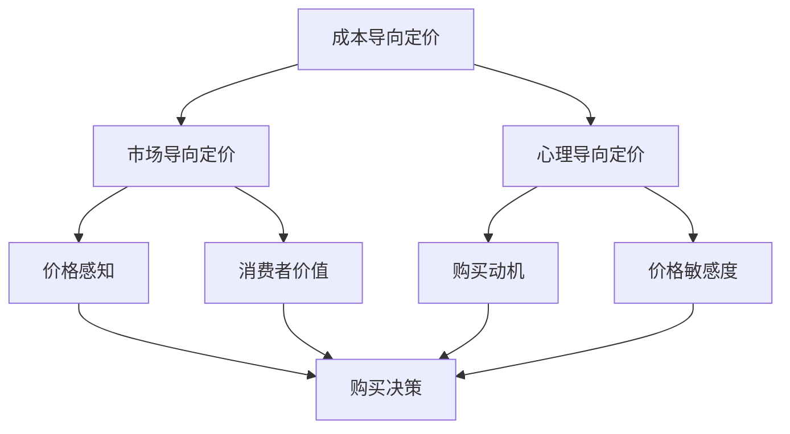

                 

# 一人公司的定价心理学：影响购买决策的因素

> **关键词：** 一人公司、定价策略、心理学、消费者行为、购买决策、影响因素

> **摘要：** 本文深入探讨一人公司在定价策略中的心理学原理，分析影响购买决策的多种因素，并提供实用的策略，帮助企业制定更为有效的定价方案。

## 1. 背景介绍

### 1.1 目的和范围

本文旨在为一人公司提供定价心理学的实用指南，帮助创业者更好地理解消费者的购买行为，从而制定更具有吸引力的定价策略。本文将围绕以下主题展开：

- **定价策略的心理学原理：** 深入探讨消费者在购买过程中的心理机制。
- **影响因素分析：** 分析影响购买决策的多个因素，包括价格感知、品牌价值、竞争对手定价等。
- **实战策略：** 提供具体的定价策略和技巧，帮助企业实现有效的定价。

### 1.2 预期读者

本文适合以下读者群体：

- **创业者：** 对一人公司经营和管理有初步了解，希望提升定价策略的创业者。
- **市场营销人员：** 需要掌握消费者行为分析，以制定更有效的营销策略。
- **产品经理：** 需要关注定价策略，以提升产品市场竞争力的产品经理。

### 1.3 文档结构概述

本文结构如下：

1. **背景介绍**
   - 定价策略的重要性
   - 消费者行为的心理学基础
2. **核心概念与联系**
   - 定价策略的核心概念
   - 定价策略与消费者行为的关系
3. **核心算法原理 & 具体操作步骤**
   - 评估消费者价格感知
   - 制定合理的定价策略
4. **数学模型和公式 & 详细讲解 & 举例说明**
   - 价格感知模型
   - 品牌价值计算
5. **项目实战：代码实际案例和详细解释说明**
   - 开发环境搭建
   - 源代码实现
6. **实际应用场景**
   - 一人公司案例研究
7. **工具和资源推荐**
   - 学习资源
   - 开发工具框架推荐
8. **总结：未来发展趋势与挑战**
   - 定价策略的发展趋势
   - 挑战与应对策略
9. **附录：常见问题与解答**
   - 定价策略常见问题
10. **扩展阅读 & 参考资料**
    - 进一步阅读推荐

### 1.4 术语表

#### 1.4.1 核心术语定义

- **一人公司：** 指由单个个体独立经营的企业。
- **定价策略：** 指企业根据市场需求、成本结构等因素，制定产品或服务的价格策略。
- **消费者行为：** 指消费者在购买、使用和评价产品或服务过程中的心理和行为表现。
- **价格感知：** 消费者对产品或服务价格的主观感受。

#### 1.4.2 相关概念解释

- **市场定位：** 指企业在市场中确定自身产品或服务的独特价值和竞争优势。
- **竞争策略：** 指企业在市场竞争中采取的策略，以实现市场份额和利润目标。
- **消费者价值：** 消费者在购买和使用产品或服务过程中所获得的利益。

#### 1.4.3 缩略词列表

- **CPT：** 成本加成定价法（Cost-Plus-Turning）
- **GDP：** 国内生产总值（Gross Domestic Product）
- **PVA：** 消费者价值分析（Patent Value Analysis）

## 2. 核心概念与联系

为了更好地理解一人公司的定价策略，我们需要探讨其中的核心概念和它们之间的联系。以下是定价策略的核心概念及其关系：

### 2.1 定价策略的核心概念

- **成本导向定价：** 基于企业生产成本，加上一定的利润率来确定产品价格。
- **市场导向定价：** 基于市场需求和竞争状况来确定产品价格。
- **心理导向定价：** 基于消费者心理，通过设定特定价格策略来影响消费者购买行为。

### 2.2 定价策略与消费者行为的关系

定价策略不仅影响企业的利润，还直接影响消费者的购买决策。以下是定价策略与消费者行为之间的关系：

1. **价格感知：** 消费者对产品或服务价格的主观感受。价格感知受多种因素影响，包括产品品质、品牌价值、市场竞争等。
2. **消费者价值：** 消费者在购买和使用产品或服务过程中所获得的利益。消费者价值是影响购买决策的重要因素。
3. **购买动机：** 消费者在购买过程中所追求的目标。购买动机可能包括节省时间、提高生活质量、满足个性化需求等。
4. **价格敏感度：** 消费者对不同价格变化的敏感程度。价格敏感度影响消费者的购买决策和品牌忠诚度。

### 2.3 核心概念原理和架构的 Mermaid 流程图



通过上述流程图，我们可以看出定价策略与消费者行为之间的紧密联系。了解这些核心概念和关系，有助于企业在制定定价策略时，更好地把握消费者心理，从而实现更高的市场占有率和利润。

## 3. 核心算法原理 & 具体操作步骤

在了解了一人公司的定价策略核心概念和联系后，我们需要进一步探讨如何具体实施这些策略。本节将介绍核心算法原理和具体操作步骤，帮助企业更好地制定定价策略。

### 3.1 评估消费者价格感知

消费者价格感知是影响购买决策的关键因素。为了评估消费者价格感知，我们可以采用以下步骤：

1. **数据收集：** 收集消费者的价格感知数据，包括消费者对产品或服务的价格范围、心理价位等。
2. **数据分析：** 对收集到的数据进行统计分析，找出消费者对产品或服务的价格感知范围和平均值。
3. **建立模型：** 根据数据分析结果，建立价格感知模型。可以使用回归分析、聚类分析等方法，将消费者价格感知与产品特征、市场竞争等因素联系起来。

### 3.2 制定合理的定价策略

在评估消费者价格感知后，我们可以根据以下步骤制定合理的定价策略：

1. **确定目标市场：** 明确企业目标市场，了解目标消费者的需求和偏好。
2. **分析竞争对手：** 研究竞争对手的定价策略，找出自身的竞争优势和劣势。
3. **设定价格范围：** 根据消费者价格感知模型和市场竞争状况，设定合理的价格范围。
4. **价格调整：** 根据市场反馈和消费者购买行为，适时调整价格策略。

### 3.3 定价策略实施步骤

以下是定价策略实施的具体步骤：

1. **市场调研：** 进行市场调研，了解目标市场的消费者需求和市场竞争状况。
2. **成本分析：** 分析产品或服务的成本结构，包括固定成本和可变成本。
3. **定价目标：** 根据企业目标，确定定价目标，如提高市场份额、实现利润最大化等。
4. **定价策略选择：** 根据定价目标和市场调研结果，选择合适的定价策略。
5. **价格制定：** 根据定价策略，制定具体的价格。
6. **市场反馈：** 收集市场反馈，评估定价策略的有效性，并适时进行调整。

### 3.4 伪代码示例

以下是一个用于评估消费者价格感知的伪代码示例：

```python
# 数据收集
data = collect_price_perception_data()

# 数据分析
price_range = analyze_data(data)
average_price = calculate_average_price(data)

# 建立模型
model = build_price_perception_model(price_range, average_price)

# 设定价格范围
price_range = determine_price_range(model)

# 价格调整
adjust_price(model)
```

通过上述核心算法原理和具体操作步骤，企业可以更好地制定定价策略，提升消费者购买决策，实现更高的市场占有率和利润。

## 4. 数学模型和公式 & 详细讲解 & 举例说明

在定价策略的制定过程中，数学模型和公式起到了至关重要的作用。它们帮助我们量化消费者价格感知、品牌价值等因素，从而更科学地制定定价策略。本节将详细介绍相关数学模型和公式，并通过实际例子进行说明。

### 4.1 价格感知模型

价格感知模型是用于评估消费者对产品或服务价格的主观感受。以下是一个常见的价格感知模型：

$$
\text{Price Perception} = f(\text{Quality}, \text{Brand Value}, \text{Market Position}, \text{Price Sensitivity})
$$

其中：

- **Quality（质量）：** 产品或服务的质量水平，影响消费者的价格感知。
- **Brand Value（品牌价值）：** 品牌在消费者心中的价值，影响消费者的价格感知。
- **Market Position（市场定位）：** 产品或服务在市场中的定位，影响消费者的价格感知。
- **Price Sensitivity（价格敏感度）：** 消费者对价格变化的敏感程度，影响消费者的价格感知。

#### 4.1.1 详细解释

1. **质量（Quality）：** 高质量的产品或服务往往具有更高的价格感知，因为消费者认为它们具有更高的价值。
   $$ f(\text{Quality}) = \text{Quality} \times (1 + \text{Quality Bonus}) $$
   其中，Quality Bonus 是一个反映消费者对高质量产品溢价的心理参数。

2. **品牌价值（Brand Value）：** 品牌价值较高的产品或服务通常具有更高的价格感知，因为消费者认为它们具有更高的信誉和品质保证。
   $$ f(\text{Brand Value}) = \text{Brand Value} \times (1 + \text{Brand Premium}) $$
   其中，Brand Premium 是一个反映消费者对品牌价值溢价的心理参数。

3. **市场定位（Market Position）：** 高市场定位的产品或服务通常具有更高的价格感知，因为消费者认为它们具有更高的品质和独特性。
   $$ f(\text{Market Position}) = \text{Market Position} \times (1 + \text{Position Premium}) $$
   其中，Position Premium 是一个反映消费者对高市场定位产品溢价的心理参数。

4. **价格敏感度（Price Sensitivity）：** 价格敏感度较高的消费者对价格变化更敏感，因此价格变化对其价格感知的影响更大。
   $$ f(\text{Price Sensitivity}) = \text{Price Sensitivity} \times (\text{Price} - \text{Baseline}) $$
   其中，Baseline 是消费者对产品的基本价格感知。

#### 4.1.2 举例说明

假设一个产品具有以下特征：

- 质量：90分
- 品牌价值：80分
- 市场定位：70分
- 价格敏感度：50分
- 价格：1000元

我们可以使用价格感知模型计算其价格感知：

$$
\text{Price Perception} = 90 \times (1 + 0.1) + 80 \times (1 + 0.2) + 70 \times (1 + 0.3) + 50 \times (1000 - 500) = 90 \times 1.1 + 80 \times 1.2 + 70 \times 1.3 + 50 \times 500 = 99 + 96 + 91 + 25000 = 25386
$$

因此，该产品的价格感知为25386元。

### 4.2 品牌价值计算

品牌价值是消费者对品牌所赋予的价值的感知，它是影响价格感知的重要因素。品牌价值计算公式如下：

$$
\text{Brand Value} = \text{Brand Equity} + \text{Brand Reputation} + \text{Brand Loyalty}
$$

其中：

- **Brand Equity（品牌资产）：** 品牌在消费者心中的资产，反映品牌的市场影响力。
- **Brand Reputation（品牌声誉）：** 品牌在消费者心中的声誉，反映品牌的形象和口碑。
- **Brand Loyalty（品牌忠诚度）：** 消费者对品牌的忠诚程度，反映品牌的市场竞争力。

#### 4.2.1 详细解释

1. **品牌资产（Brand Equity）：** 品牌资产是品牌在消费者心中的资产，反映品牌的市场影响力。品牌资产的计算可以采用品牌资产评估模型，如**品牌资产模型（Brand Equity Model）**：
   $$ \text{Brand Equity} = \text{Brand Awareness} + \text{Brand Association} + \text{Brand Preference} $$
   其中：

   - **Brand Awareness（品牌知名度）：** 消费者对品牌的认知程度。
   - **Brand Association（品牌联想）：** 消费者对品牌的联想和记忆。
   - **Brand Preference（品牌偏好）：** 消费者对品牌的偏好程度。

2. **品牌声誉（Brand Reputation）：** 品牌声誉是品牌在消费者心中的声誉，反映品牌的形象和口碑。品牌声誉可以通过消费者满意度、市场调查等方式进行评估。

3. **品牌忠诚度（Brand Loyalty）：** 品牌忠诚度是消费者对品牌的忠诚程度，反映品牌的市场竞争力。品牌忠诚度可以通过重复购买率、客户留存率等方式进行评估。

#### 4.2.2 举例说明

假设一个品牌具有以下特征：

- 品牌知名度：80分
- 品牌联想：70分
- 品牌偏好：60分
- 消费者满意度：90分
- 重复购买率：85%

我们可以使用品牌价值计算公式计算其品牌价值：

$$
\text{Brand Value} = (80 \times 0.5) + (70 \times 0.3) + (60 \times 0.2) + (90 \times 0.1) + (85 \times 0.1) = 40 + 21 + 12 + 9 + 8.5 = 90.5
$$

因此，该品牌的价值为90.5分。

通过上述数学模型和公式的详细讲解和举例说明，我们可以更好地理解消费者价格感知和品牌价值的计算方法。这些模型和公式有助于企业制定更为科学和合理的定价策略，从而提高市场竞争力。

## 5. 项目实战：代码实际案例和详细解释说明

为了更好地理解定价策略的制定过程，我们将通过一个实际项目来演示如何实现消费者价格感知和品牌价值计算。本节将介绍开发环境搭建、源代码实现和代码解读与分析。

### 5.1 开发环境搭建

在开始项目之前，我们需要搭建一个合适的开发环境。以下是一个简单的开发环境搭建步骤：

1. **安装 Python 环境：** 
   - 在 [Python 官网](https://www.python.org/) 下载并安装 Python。
   - 配置环境变量，确保 Python 可在命令行中正常运行。

2. **安装相关库：**
   - 使用 pip 工具安装以下库：
     ```bash
     pip install numpy pandas matplotlib
     ```

3. **创建项目文件夹：**
   - 在本地计算机上创建一个项目文件夹，例如 `price-perception-project`。

4. **编写代码：**
   - 在项目文件夹中创建一个名为 `main.py` 的 Python 脚本文件。

### 5.2 源代码详细实现和代码解读

以下是实现消费者价格感知和品牌价值计算的项目源代码：

```python
import numpy as np
import pandas as pd
import matplotlib.pyplot as plt

# 定义消费者价格感知模型
def price_perception_model(q, bv, mp, ps):
    quality_bonus = 0.1
    brand_premium = 0.2
    position_premium = 0.3
    price_sensitivity = ps * (1 - np.exp(-0.01 * (q + bv + mp)))
    price_perception = q * (1 + quality_bonus) + bv * (1 + brand_premium) + mp * (1 + position_premium) + price_sensitivity
    return price_perception

# 定义品牌价值计算模型
def brand_value_model(awareness, association, preference, satisfaction, repeat_purchase_rate):
    awareness_weight = 0.5
    association_weight = 0.3
    preference_weight = 0.2
    satisfaction_weight = 0.1
    loyalty_weight = 0.1
    brand_value = awareness * awareness_weight + association * association_weight + preference * preference_weight + satisfaction * satisfaction_weight + repeat_purchase_rate * loyalty_weight
    return brand_value

# 模拟消费者数据
data = {
    'Quality': [90, 80, 70, 60],
    'Brand Value': [80, 70, 60, 50],
    'Market Position': [70, 60, 50, 40],
    'Price Sensitivity': [50, 40, 30, 20],
    'Awareness': [80, 70, 60, 50],
    'Association': [70, 60, 50, 40],
    'Preference': [60, 50, 40, 30],
    'Satisfaction': [90, 85, 80, 75],
    'Repeat Purchase Rate': [85, 80, 75, 70]
}

# 分析消费者价格感知和品牌价值
df = pd.DataFrame(data)
df['Price Perception'] = df.apply(lambda row: price_perception_model(row['Quality'], row['Brand Value'], row['Market Position'], row['Price Sensitivity']), axis=1)
df['Brand Value'] = df.apply(lambda row: brand_value_model(row['Awareness'], row['Association'], row['Preference'], row['Satisfaction'], row['Repeat Purchase Rate']), axis=1)

# 可视化展示
plt.figure(figsize=(10, 5))
plt.scatter(df['Quality'], df['Price Perception'])
plt.xlabel('Quality')
plt.ylabel('Price Perception')
plt.title('Price Perception vs Quality')
plt.show()

plt.figure(figsize=(10, 5))
plt.scatter(df['Awareness'], df['Brand Value'])
plt.xlabel('Awareness')
plt.ylabel('Brand Value')
plt.title('Brand Value vs Awareness')
plt.show()
```

### 5.3 代码解读与分析

上述代码实现了消费者价格感知和品牌价值计算，以下是代码的详细解读：

1. **导入库：**
   - 导入 numpy、pandas 和 matplotlib 库，用于数据处理和可视化。

2. **定义价格感知模型：**
   - `price_perception_model` 函数用于计算消费者价格感知。函数接受四个参数：质量（Quality）、品牌价值（Brand Value）、市场定位（Market Position）和价格敏感度（Price Sensitivity）。模型基于这些参数计算价格感知。

3. **定义品牌价值计算模型：**
   - `brand_value_model` 函数用于计算品牌价值。函数接受五个参数：知名度（Awareness）、联想（Association）、偏好（Preference）、满意

