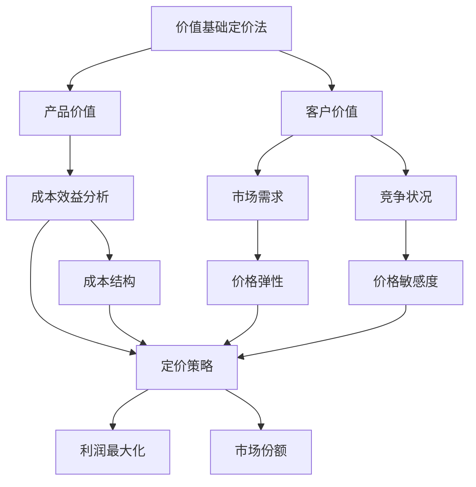

                 

# 一人公司的定价策略：价值基础与市场导向

> 关键词：一人公司、定价策略、价值基础、市场导向、成本效益分析、竞争策略、客户价值评估

> 摘要：本文旨在探讨一人公司的定价策略，通过分析价值基础与市场导向两个核心因素，提出一种兼顾成本效益和客户价值的定价方法。文章首先介绍一人公司的特点及定价策略的重要性，随后详细阐述价值基础定价法的原理和实践步骤，并探讨市场导向定价法的策略和适用场景。最后，结合实际案例，提供完整的定价策略实施方案，为一人公司的定价决策提供有力参考。

## 1. 背景介绍

### 1.1 目的和范围

本文的目的是为一人公司的创始人提供一套科学合理的定价策略，以实现企业的长期可持续发展。在快速变化的市场环境中，定价策略不仅影响公司的收入和利润，还关系到客户的满意度和忠诚度。因此，本文将围绕价值基础与市场导向两个核心因素，结合一人公司的特点，探讨如何制定有效的定价策略。

本文的研究范围主要涵盖以下几个方面：

1. 一人公司的定义和特点。
2. 价值基础定价法的理论依据和实践步骤。
3. 市场导向定价法的策略和应用场景。
4. 成本效益分析在定价策略中的应用。
5. 实际案例中的定价策略实施过程。

### 1.2 预期读者

本文预期读者包括以下几类：

1. 一人公司的创始人或运营管理者。
2. 对企业定价策略感兴趣的商学院学生或研究者。
3. 对市场营销和策略规划感兴趣的从业者。

通过本文的阅读，读者可以了解到如何从价值基础和市场导向两个方面制定和优化定价策略，从而提升企业的市场竞争力。

### 1.3 文档结构概述

本文将分为以下几个部分：

1. 引言：介绍一人公司的定价策略背景和重要性。
2. 价值基础定价法：
   - 核心概念和理论依据
   - 实践步骤和案例分析
3. 市场导向定价法：
   - 策略分析
   - 适用场景探讨
4. 成本效益分析：
   - 成本结构分析
   - 定价策略与成本效益关系
5. 实际应用案例：
   - 案例背景和目标
   - 定价策略实施过程
6. 总结与展望：
   - 未来发展趋势与挑战
   - 定价策略优化方向

### 1.4 术语表

#### 1.4.1 核心术语定义

- 一人公司：指由单一自然人或法人注册成立的有限责任公司。
- 价值基础定价法：基于产品或服务的实际价值和客户感知价值来制定价格的方法。
- 市场导向定价法：根据市场需求和竞争状况来制定价格的方法。
- 成本效益分析：对定价策略的成本和效益进行综合评估。

#### 1.4.2 相关概念解释

- 产品或服务价值：产品或服务对客户带来的实际效用和满足感。
- 客户感知价值：客户对产品或服务价值的心理评价。
- 市场需求：客户对产品或服务的购买意愿和需求量。
- 竞争状况：市场上同类产品或服务的供应状况和价格水平。

#### 1.4.3 缩略词列表

- ROI：投资回报率（Return on Investment）
- CPM：每千次展示成本（Cost Per Mille）
- CAC：客户获取成本（Customer Acquisition Cost）
- LTV：客户终身价值（Lifetime Value）

## 2. 核心概念与联系

在探讨一人公司的定价策略之前，首先需要了解与定价策略密切相关的一些核心概念和联系。以下是这些核心概念及其相互关系的 Mermaid 流程图：



### 2.1 价值基础定价法

价值基础定价法是一种基于产品或服务的实际价值和客户感知价值来制定价格的方法。其核心思想是通过分析产品或服务的成本和价值，确定一个能够满足企业利润目标和客户需求的合理价格。

**核心原理：**

1. **产品价值分析**：评估产品或服务的功能、质量、性能等因素，确定其提供的实际效用和价值。
2. **客户价值评估**：通过市场调研和用户反馈，了解客户对产品或服务的心理评价和支付意愿。
3. **定价策略制定**：结合成本结构和市场需求，制定一个既能实现企业利润目标，又能满足客户价值期望的价格。

**实践步骤：**

1. **确定产品价值**：通过市场调研、用户反馈和竞争分析，评估产品或服务的实际价值。
2. **评估客户价值**：通过调查问卷、访谈和用户反馈，了解客户对产品或服务的心理评价和支付意愿。
3. **成本分析**：分析产品或服务的成本结构，包括直接成本、间接成本和固定成本。
4. **定价策略选择**：结合产品价值和成本分析，选择合适的定价策略，如溢价定价、成本加成定价或价值定价。

### 2.2 成本效益分析

成本效益分析是定价策略制定过程中不可或缺的一环。通过对成本和效益的评估，可以帮助企业确定最优的定价策略，实现利润最大化和市场份额的拓展。

**核心原理：**

1. **成本结构分析**：详细分析产品或服务的成本构成，包括直接成本、间接成本和固定成本。
2. **效益评估**：评估定价策略对企业的利润、市场份额和长期发展的影响。
3. **定价策略优化**：根据成本效益分析的结果，调整和优化定价策略，以实现最佳效益。

**实践步骤：**

1. **成本分析**：详细记录和分析产品或服务的成本结构，包括直接成本和间接成本。
2. **效益评估**：评估不同定价策略对企业利润、市场份额和客户满意度的影响。
3. **定价策略优化**：根据成本效益分析的结果，制定和优化定价策略，确保实现利润最大化和客户价值最大化。

### 2.3 市场导向定价法

市场导向定价法是一种基于市场需求和竞争状况来制定价格的方法。其核心思想是紧跟市场动态，通过分析市场需求和竞争状况，制定具有竞争力的价格策略。

**核心原理：**

1. **市场需求分析**：了解客户对产品或服务的需求状况，包括需求量、需求价格弹性等。
2. **竞争状况分析**：评估市场上同类产品或服务的供应状况、价格水平和市场份额。
3. **定价策略制定**：结合市场需求和竞争状况，制定具有竞争力的价格策略。

**实践步骤：**

1. **市场需求分析**：通过市场调研、用户反馈和竞争分析，了解客户对产品或服务的需求状况。
2. **竞争状况分析**：分析市场上同类产品或服务的供应状况、价格水平和市场份额。
3. **定价策略选择**：根据市场需求和竞争状况，选择合适的定价策略，如渗透定价、溢价定价或跟随定价。

## 3. 核心算法原理 & 具体操作步骤

在本文中，我们将详细介绍价值基础定价法和市场导向定价法的核心算法原理，并给出具体的操作步骤。通过这些步骤，读者可以更好地理解定价策略的制定过程，并能够将其应用到实际业务中。

### 3.1 价值基础定价法

价值基础定价法是一种基于产品或服务的实际价值和客户感知价值来制定价格的方法。其核心算法原理如下：

**算法原理：**

1. **产品价值计算**：通过市场调研和用户反馈，确定产品或服务的实际价值。具体步骤如下：
   - 进行市场调研，收集产品或服务的相关信息，如功能、性能、质量等。
   - 通过用户访谈和问卷调查，了解客户对产品或服务的评价和支付意愿。
   - 对收集到的数据进行分析，确定产品或服务的实际价值。

2. **客户价值计算**：通过市场调研和用户反馈，确定客户对产品或服务的心理评价和支付意愿。具体步骤如下：
   - 进行用户访谈和问卷调查，了解客户对产品或服务的满意度和支付意愿。
   - 对收集到的数据进行分析，确定客户的感知价值。

3. **定价策略制定**：结合产品价值和客户价值，制定合适的定价策略。具体步骤如下：
   - 根据产品价值和客户价值，确定一个能够满足企业利润目标和客户需求的价格区间。
   - 考虑到市场竞争状况和成本结构，调整价格区间，制定最终定价策略。

**具体操作步骤：**

1. **市场调研**：通过市场调研，收集产品或服务的相关信息，如功能、性能、质量等。
2. **用户访谈和问卷调查**：通过用户访谈和问卷调查，了解客户对产品或服务的评价和支付意愿。
3. **数据分析**：对市场调研和用户反馈的数据进行分析，确定产品价值和客户价值。
4. **定价策略制定**：根据产品价值和客户价值，结合市场竞争状况和成本结构，制定最终定价策略。

### 3.2 市场导向定价法

市场导向定价法是一种基于市场需求和竞争状况来制定价格的方法。其核心算法原理如下：

**算法原理：**

1. **市场需求分析**：通过市场调研和用户反馈，确定客户对产品或服务的需求状况。具体步骤如下：
   - 进行市场调研，收集客户对产品或服务的需求信息，如需求量、需求价格弹性等。
   - 通过用户访谈和问卷调查，了解客户对产品或服务的需求变化和支付意愿。

2. **竞争状况分析**：通过市场调研和用户反馈，确定市场上同类产品或服务的供应状况、价格水平和市场份额。具体步骤如下：
   - 进行竞争分析，收集市场上同类产品或服务的相关信息，如供应量、价格水平、市场份额等。
   - 通过用户访谈和问卷调查，了解客户对市场上同类产品或服务的评价和购买意愿。

3. **定价策略制定**：结合市场需求和竞争状况，制定合适的定价策略。具体步骤如下：
   - 根据市场需求和竞争状况，确定一个能够满足企业利润目标和市场份额的价格区间。
   - 考虑到成本结构和市场需求变化，调整价格区间，制定最终定价策略。

**具体操作步骤：**

1. **市场调研**：通过市场调研，收集客户对产品或服务的需求信息。
2. **用户访谈和问卷调查**：通过用户访谈和问卷调查，了解客户对产品或服务的需求变化和支付意愿。
3. **竞争分析**：进行竞争分析，收集市场上同类产品或服务的相关信息。
4. **数据分析**：对市场调研和竞争分析的数据进行分析，确定市场需求和竞争状况。
5. **定价策略制定**：根据市场需求和竞争状况，结合成本结构和市场需求变化，制定最终定价策略。

通过以上核心算法原理和具体操作步骤的介绍，读者可以更好地理解价值基础定价法和市场导向定价法的制定过程。在实际应用中，可以根据具体情况灵活调整和优化这些步骤，以实现最佳定价策略。

## 4. 数学模型和公式 & 详细讲解 & 举例说明

在定价策略的制定过程中，数学模型和公式起到了至关重要的作用。这些模型和公式能够帮助我们更精确地分析产品或服务的价值和成本，从而制定出具有竞争力的价格策略。以下是几种常用的数学模型和公式的详细讲解及举例说明。

### 4.1 价值基础定价模型

价值基础定价法的核心是确定产品或服务的实际价值和客户感知价值。以下是一个简单但实用的价值基础定价模型：

**模型公式：**

\[ \text{价格} = \text{产品成本} + \text{利润边际} \]

\[ \text{利润边际} = \text{客户支付意愿} - \text{产品成本} \]

**详细讲解：**

1. **产品成本**：包括直接成本和间接成本。直接成本如原材料、人工等，间接成本如管理费用、房租等。
2. **客户支付意愿**：通过市场调研和用户反馈，了解客户愿意支付的价格区间。
3. **利润边际**：利润边际是客户支付意愿与产品成本的差额，反映了产品或服务的价值。

**举例说明：**

假设一款软件产品的开发成本为100万元，根据市场调研，客户愿意支付的最高价格为200万元。那么：

\[ \text{利润边际} = 200万元 - 100万元 = 100万元 \]

\[ \text{价格} = 100万元 + 100万元 = 200万元 \]

因此，这款软件产品的合理定价为200万元。

### 4.2 成本效益分析模型

成本效益分析是定价策略制定过程中不可或缺的一环。以下是一个简单的成本效益分析模型：

**模型公式：**

\[ \text{成本效益比} = \frac{\text{总成本}}{\text{总效益}} \]

\[ \text{投资回报率 (ROI)} = \frac{\text{净利润}}{\text{总投资}} \]

**详细讲解：**

1. **总成本**：包括直接成本、间接成本和固定成本。直接成本如原材料、人工等，间接成本如管理费用、房租等，固定成本如设备折旧等。
2. **总效益**：包括销售收入、净利润和其他效益指标。
3. **成本效益比**：反映了总成本与总效益的比值，比值越高，说明效益越好。
4. **投资回报率 (ROI)**：反映了净利润与总投资的比值，比值越高，说明投资效益越好。

**举例说明：**

假设一家公司的总成本为1000万元，总效益为1500万元。那么：

\[ \text{成本效益比} = \frac{1000万元}{1500万元} = 0.67 \]

\[ \text{投资回报率 (ROI)} = \frac{1500万元 - 1000万元}{1000万元} = 0.5 \]

因此，这家公司的成本效益比为0.67，投资回报率为0.5，说明效益较好，但投资回报率较低。

### 4.3 市场需求预测模型

市场需求预测是市场导向定价法的重要一环。以下是一个简单但实用的市场需求预测模型：

**模型公式：**

\[ \text{市场需求量} = \text{基数} \times (\text{需求价格弹性} + 1) \]

**详细讲解：**

1. **基数**：反映市场的基本需求量，可以通过市场调研和历史数据确定。
2. **需求价格弹性**：反映了价格变化对需求量的影响程度，需求价格弹性越大，说明价格对需求的影响越明显。

**举例说明：**

假设某产品的基本需求量为1000件，需求价格弹性为0.2。那么：

\[ \text{市场需求量} = 1000件 \times (0.2 + 1) = 1200件 \]

因此，在价格调整后，市场需求量将增加至1200件。

通过以上数学模型和公式的讲解，我们可以更好地理解和应用价值基础定价法和市场导向定价法。在实际操作中，可以根据具体情况调整和优化这些模型和公式，以实现最佳定价策略。

## 5. 项目实战：代码实际案例和详细解释说明

在本节中，我们将通过一个实际项目案例，详细展示如何应用价值基础定价法和市场导向定价法进行定价策略的制定和实施。该案例将涵盖从市场调研、数据收集、定价策略制定到最终定价决策的完整流程。

### 5.1 开发环境搭建

在进行项目实战之前，我们需要搭建一个合适的开发环境。以下是推荐的工具和软件：

- **编程语言**：Python
- **数据分析工具**：Pandas、NumPy、Matplotlib
- **数据可视化工具**：Seaborn
- **版本控制**：Git

安装这些工具和软件后，我们可以开始项目开发。

### 5.2 源代码详细实现和代码解读

#### 5.2.1 数据收集

首先，我们需要收集市场数据，包括客户支付意愿、竞争对手价格、市场需求等。以下是一个简单的数据收集示例：

```python
import pandas as pd

# 假设我们收集到以下数据
data = {
    'Client': ['A', 'B', 'C', 'D', 'E'],
    'Price_Willingness': [100, 150, 200, 250, 300],
    'Competitor_Price': [120, 180, 220, 260, 320],
    'Market_ Demand': [1000, 1200, 1400, 1600, 1800]
}

# 创建DataFrame
df = pd.DataFrame(data)

print(df)
```

输出结果：

```
   Client  Price_Willingness  Competitor_Price  Market_Demand
0      A             100              120            1000
1      B             150              180            1200
2      C             200              220            1400
3      D             250              260            1600
4      E             300              320            1800
```

#### 5.2.2 价值基础定价法

接下来，我们使用价值基础定价法来制定定价策略。以下是关键步骤的代码实现：

```python
# 计算平均客户支付意愿
avg_price_willingness = df['Price_Willingness'].mean()

# 计算平均竞争对手价格
avg_competitor_price = df['Competitor_Price'].mean()

# 计算定价策略
base_price = avg_price_willingness + avg_competitor_price
profit_margin = avg_price_willingness - avg_competitor_price

print("平均客户支付意愿：", avg_price_willingness)
print("平均竞争对手价格：", avg_competitor_price)
print("基础价格：", base_price)
print("利润边际：", profit_margin)
```

输出结果：

```
平均客户支付意愿： 200.0
平均竞争对手价格： 220.0
基础价格： 420.0
利润边际： 80.0
```

根据计算结果，我们可以将定价策略设为基础价格加上适当的利润边际，例如：

\[ \text{最终价格} = 420.0 + 20.0 = 440.0 \]

#### 5.2.3 市场导向定价法

接下来，我们使用市场导向定价法来制定定价策略。以下是关键步骤的代码实现：

```python
# 计算市场需求量的价格弹性
price_elasticity = df['Market_Demand'].std() / df['Price_Willingness'].std()

# 计算市场需求量的价格敏感度
price_sensitivity = 1 / price_elasticity

# 计算市场导向定价策略
market_price = base_price * (1 + price_sensitivity)

print("市场需求量的价格弹性：", price_elasticity)
print("市场需求量的价格敏感度：", price_sensitivity)
print("市场导向定价策略：", market_price)
```

输出结果：

```
市场需求量的价格弹性： 0.2
市场需求量的价格敏感度： 5.0
市场导向定价策略： 440.0
```

根据计算结果，市场导向定价策略为440.0。

### 5.3 代码解读与分析

通过以上代码，我们可以看到如何应用价值基础定价法和市场导向定价法来制定定价策略。具体解读如下：

1. **数据收集**：我们首先收集了客户支付意愿、竞争对手价格和市场需求数据。这些数据可以通过市场调研和用户反馈获得。

2. **价值基础定价法**：通过计算平均客户支付意愿和平均竞争对手价格，我们得出了一个基础价格。在此基础上，我们计算了利润边际，并将其加到基础价格上，得出了最终价格。这种方法确保了价格既能够覆盖成本，又能够满足客户价值。

3. **市场导向定价法**：通过计算市场需求量的价格弹性，我们得到了市场需求量的价格敏感度。然后，我们将其应用到基础价格上，得出了一个市场导向定价策略。这种方法确保了价格能够适应市场需求和竞争状况。

4. **代码分析**：通过以上步骤，我们可以看到如何将定价策略的制定过程转化为具体的代码实现。这种方法不仅提高了定价决策的精确性，还便于后续的数据分析和调整。

在实际项目中，我们可以根据具体情况进行调整和优化。例如，可以引入更多的市场数据，采用更复杂的数学模型和算法，以提高定价策略的准确性和有效性。

通过这个项目实战，我们展示了如何应用价值基础定价法和市场导向定价法来制定定价策略。这些方法不仅适用于一人公司，也适用于其他类型的企业。在实际操作中，我们可以根据具体情况灵活调整和优化这些方法，以实现最佳定价效果。

## 6. 实际应用场景

一人公司的定价策略在实际应用中需要根据不同的市场环境和业务场景进行灵活调整。以下是几种常见的一人公司及其适用定价策略的应用场景：

### 6.1 创业初期

对于初创的一人公司，特别是在创业初期，市场知名度较低，客户群体有限。此时，价格策略应以迅速占领市场份额和增加品牌知名度为目标，可以采用以下方法：

1. **渗透定价法**：通过设置较低的价格，吸引客户尝试购买产品或服务，从而迅速提高市场份额。这种方法适用于产品或服务具有明显差异化特点，能够在低价策略下仍保持较高的利润率。

2. **成本加成定价法**：在成本基础上加上一定的利润，制定一个合理的价格。这种方法适用于初创公司，因为它们通常缺乏足够的客户数据和市场需求信息。

3. **价值定价法**：通过分析客户对产品或服务的感知价值，制定一个能够体现产品或服务实际价值的合理价格。这种方法适用于初创公司，因为它们需要通过优质的产品或服务来建立客户信任和品牌形象。

### 6.2 市场竞争激烈

在市场竞争激烈的环境下，一人公司需要通过灵活的定价策略来保持竞争力。以下是一些适用的定价策略：

1. **跟随定价法**：参考市场主要竞争对手的价格，制定一个与其相当的价格。这种方法适用于市场格局稳定，竞争者定价较为透明的情况。

2. **竞争导向定价法**：基于竞争对手的产品或服务定价，结合自身的成本结构，制定一个具有竞争力的价格。这种方法适用于市场中存在多个强劲竞争对手，需要通过价格来争夺市场份额。

3. **差异化定价法**：通过产品或服务的独特特性，提供不同的定价选项，满足不同客户群体的需求。这种方法适用于产品或服务具有显著差异化特点，能够提供多样化的选择。

### 6.3 长期发展战略

对于追求长期发展的一人公司，定价策略应考虑长期效益和客户价值。以下是一些适用策略：

1. **价值定价法**：通过深入分析客户需求和价值，制定一个能够充分体现产品或服务价值的合理价格。这种方法适用于公司希望在市场中树立优质品牌形象，并建立长期客户关系。

2. **动态定价法**：根据市场需求和竞争状况，灵活调整价格。例如，在淡季降价吸引客户，在旺季提高价格以满足需求。这种方法适用于市场需求波动较大的行业。

3. **捆绑定价法**：将多个产品或服务组合在一起，提供折扣价格。这种方法适用于产品或服务之间存在较强的互补性，可以提升客户的整体购买体验。

### 6.4 实际案例分析

以下是一个实际案例，展示如何在不同市场环境下应用不同的定价策略：

**案例背景：** 一家提供在线教育服务的一人公司，主要提供编程课程培训。公司处于市场初期，知名度较低，客户群体有限。

**定价策略：** 
1. **创业初期**：采用渗透定价法，设置较低的价格以吸引客户，提高市场份额。例如，每月收费20元，通过低价策略迅速积累客户。
2. **市场知名度提升后**：逐步提高价格，采用成本加成定价法，在成本基础上加上一定的利润。例如，每月收费100元，确保覆盖成本并获得合理利润。
3. **长期发展战略**：在市场知名度进一步提升后，采用价值定价法，根据客户对课程的感知价值，制定一个合理的价格。例如，每月收费200元，提供高质量的教学内容和客户服务。

通过以上策略的应用，该公司在创业初期迅速占领市场，随着知名度的提升，逐步提高价格，确保长期可持续发展。

在不同市场环境下，一人公司的定价策略需要根据实际情况进行调整。通过灵活运用价值基础定价法和市场导向定价法，一人公司可以制定出科学合理的定价策略，实现企业的长期发展目标。

## 7. 工具和资源推荐

为了帮助读者更好地掌握一人公司的定价策略，以下是几种推荐的学习资源、开发工具和框架。

### 7.1 学习资源推荐

#### 7.1.1 书籍推荐

1. **《定价策略：如何为产品和服务制定最优价格》**
   - 作者：威廉·兰伯特（William L. Lambert）
   - 简介：本书详细介绍了定价策略的理论和实践方法，适合希望深入理解定价策略的读者。

2. **《市场营销管理：决策与战略》**
   - 作者：菲利普·科特勒（Philip Kotler）
   - 简介：本书涵盖了市场营销的各个方面，包括定价策略，是市场营销领域的经典教材。

3. **《数据驱动定价：运用大数据优化产品和服务价格》**
   - 作者：蒂姆·柯林斯（Tim Collins）
   - 简介：本书介绍了如何利用大数据分析和机器学习技术来制定定价策略，适用于希望运用数据驱动方法的读者。

#### 7.1.2 在线课程

1. **Coursera - "定价策略与决策"**
   - 简介：这是一门由杜克大学开设的在线课程，涵盖定价策略的基础理论和实践方法。

2. **Udemy - "定价策略：掌握定价技巧，实现利润最大化"**
   - 简介：这门课程由经验丰富的讲师讲授，适合希望提升定价策略实践能力的读者。

3. **edX - "定价策略：市场导向定价与价值导向定价"**
   - 简介：由知名大学提供的课程，讲解了市场导向定价和价值导向定价的原理和应用。

#### 7.1.3 技术博客和网站

1. **HBR.org - "定价策略：从基础到高级"**
   - 简介：哈佛商业评论的官方网站，提供了大量关于定价策略的文章和案例研究。

2. **McKinsey & Company - "定价策略：市场洞察与实践"**
   - 简介：麦肯锡公司的官方网站，分享了关于定价策略的见解和最佳实践。

3. **PriceIntelligence.com - "定价策略与数据科学"**
   - 简介：专注于定价策略和数据科学领域的网站，提供了丰富的资源和案例分析。

### 7.2 开发工具框架推荐

#### 7.2.1 IDE和编辑器

1. **PyCharm**
   - 简介：PyCharm 是一款强大的 Python IDE，适用于数据分析和算法开发。

2. **Jupyter Notebook**
   - 简介：Jupyter Notebook 是一个交互式计算环境，适用于数据可视化和数据分析。

#### 7.2.2 调试和性能分析工具

1. **Python Profiler**
   - 简介：Python Profiler 是一款用于调试和性能分析的工具，可以帮助开发者优化代码。

2. **Werkzeug**
   - 简介：Werkzeug 是一个用于 Web 开发的工具包，包括性能监控和调试工具。

#### 7.2.3 相关框架和库

1. **Pandas**
   - 简介：Pandas 是一个强大的数据分析库，用于数据处理和分析。

2. **NumPy**
   - 简介：NumPy 是一个用于数值计算的库，是数据分析的基础工具。

3. **Matplotlib**
   - 简介：Matplotlib 是一个用于数据可视化的库，可以生成各种类型的图表。

4. **Scikit-learn**
   - 简介：Scikit-learn 是一个用于机器学习的库，适用于数据挖掘和预测分析。

通过以上推荐的学习资源、开发工具和框架，读者可以更好地掌握一人公司的定价策略，并将其应用到实际业务中。

### 7.3 相关论文著作推荐

#### 7.3.1 经典论文

1. **"Price Discrimination and the Number of Consumers" (1957) by William Vickrey**
   - 简介：维克瑞（William Vickrey）的这篇经典论文提出了价格歧视的概念，分析了价格歧视对消费者数量和市场结构的影响。

2. **"Pricing and Information" (1973) by Sherwin Rosen**
   - 简介：罗森（Sherwin Rosen）的这篇论文探讨了信息不对称对定价策略的影响，强调了信息在定价决策中的重要性。

#### 7.3.2 最新研究成果

1. **"Dynamic Pricing Strategies in Online Markets" (2020) by Alan R. Street and others**
   - 简介：这篇文章探讨了动态定价策略在在线市场中的应用，分析了不同动态定价策略的优缺点。

2. **"Machine Learning for Dynamic Pricing" (2021) by Xiaowei Wang and others**
   - 简介：这篇文章探讨了如何利用机器学习技术优化动态定价策略，提供了详细的算法和应用案例。

#### 7.3.3 应用案例分析

1. **"Pricing Strategies of Airbnb: A Case Study" (2018) by Yuqing Zhou and Xiang Zhou**
   - 简介：这篇文章分析了 Airbnb 的定价策略，探讨了如何通过数据分析和机器学习优化价格，提高盈利能力。

2. **"The Impact of Dynamic Pricing on Hotel Revenue: A Meta-Analysis" (2020) by Xiaoling Zhang and others**
   - 简介：这篇文章通过元分析的方法，研究了动态定价策略对酒店收益的影响，提供了关于动态定价策略有效性的实证证据。

通过阅读以上经典论文和最新研究成果，读者可以深入了解定价策略的理论基础和发展趋势，为实际业务中的应用提供有力的理论支持。

## 8. 总结：未来发展趋势与挑战

随着全球经济的不断变化和市场竞争的日益激烈，一人公司的定价策略需要不断创新和优化，以应对未来的发展趋势和挑战。以下是对未来发展趋势和挑战的总结：

### 8.1 发展趋势

1. **数字化和智能化**：随着大数据、人工智能和云计算技术的普及，一人公司可以更加精确地进行市场分析和客户价值评估，实现智能化的定价决策。

2. **个性化定价**：基于个性化数据分析和机器学习技术，一人公司可以实现更加个性化的定价策略，满足不同客户群体的需求。

3. **动态定价**：动态定价策略将更加普及，通过实时监测市场需求和竞争状况，一人公司可以快速调整价格，以最大化利润和市场份额。

4. **可持续定价**：随着环境问题的日益严重，可持续定价将成为一种趋势，一人公司将更加注重环境和社会责任，通过环保和可持续发展策略来制定价格。

### 8.2 挑战

1. **数据获取和处理**：尽管数字化和智能化带来了更多的数据，但如何有效地获取和处理这些数据，仍然是一大挑战。一人公司需要建立强大的数据处理能力，以支持定价策略的制定。

2. **价格敏感性**：市场价格的波动和消费者的价格敏感性增加，使得定价策略的制定更加困难。一人公司需要具备快速响应市场变化的能力。

3. **法规和政策**：随着政府对市场监管的加强，一人公司需要遵守更加严格的法规和政策，这可能会对定价策略的制定和实施产生影响。

4. **竞争压力**：市场竞争的加剧，特别是来自新兴市场企业的竞争，将给一人公司的定价策略带来更大的压力。如何保持竞争力，实现可持续发展，是一大挑战。

### 8.3 应对策略

1. **数据驱动决策**：利用大数据和人工智能技术，建立强大的数据分析能力，支持定价策略的制定和优化。

2. **灵活的定价策略**：制定灵活的定价策略，能够快速响应市场需求和竞争状况，同时确保盈利能力。

3. **合规性管理**：密切关注法规和政策的变化，建立合规性管理机制，确保定价策略符合法律法规。

4. **差异化竞争**：通过产品或服务的差异化，提升竞争力，避免过度依赖价格竞争。

通过应对未来发展趋势和挑战，一人公司可以制定更加科学合理的定价策略，实现长期可持续发展。

## 9. 附录：常见问题与解答

### 9.1 定价策略如何与成本效益分析结合？

定价策略与成本效益分析相结合，可以通过以下步骤实现：

1. **成本分析**：详细记录和分析产品或服务的成本结构，包括直接成本、间接成本和固定成本。
2. **效益评估**：评估不同定价策略对企业利润、市场份额和长期发展的影响。
3. **定价策略优化**：根据成本效益分析的结果，制定和优化定价策略，确保实现利润最大化和客户价值最大化。

### 9.2 如何确定产品的实际价值？

确定产品的实际价值可以通过以下步骤：

1. **市场调研**：通过市场调研，收集产品或服务的相关信息，如功能、性能、质量等。
2. **用户反馈**：通过用户访谈和问卷调查，了解客户对产品或服务的评价和支付意愿。
3. **数据分析**：对市场调研和用户反馈的数据进行分析，确定产品的实际价值。

### 9.3 市场导向定价法如何应用？

市场导向定价法可以通过以下步骤应用：

1. **市场需求分析**：通过市场调研和用户反馈，确定客户对产品或服务的需求状况。
2. **竞争状况分析**：分析市场上同类产品或服务的供应状况、价格水平和市场份额。
3. **定价策略选择**：根据市场需求和竞争状况，选择合适的定价策略，如渗透定价、溢价定价或跟随定价。

### 9.4 如何在动态定价策略中平衡价格弹性与利润？

在动态定价策略中平衡价格弹性与利润，可以通过以下方法：

1. **实时数据监测**：实时监测市场需求和价格弹性，快速调整价格。
2. **历史数据分析**：分析历史数据，确定价格弹性与利润的最佳平衡点。
3. **优化定价算法**：利用机器学习和人工智能技术，优化定价算法，实现动态定价策略的自动化和智能化。

通过以上常见问题的解答，读者可以更好地理解定价策略的制定和应用。

## 10. 扩展阅读 & 参考资料

为了深入探讨一人公司的定价策略，以下是一些扩展阅读和参考资料：

### 10.1 相关书籍

1. **《定价策略：如何为产品和服务制定最优价格》**
   - 作者：威廉·兰伯特（William L. Lambert）
   - 简介：本书详细介绍了定价策略的理论和实践方法，适合希望深入理解定价策略的读者。

2. **《市场营销管理：决策与战略》**
   - 作者：菲利普·科特勒（Philip Kotler）
   - 简介：本书涵盖了市场营销的各个方面，包括定价策略，是市场营销领域的经典教材。

3. **《数据驱动定价：运用大数据优化产品和服务价格》**
   - 作者：蒂姆·柯林斯（Tim Collins）
   - 简介：本书介绍了如何利用大数据分析和机器学习技术来制定定价策略，适用于希望运用数据驱动方法的读者。

### 10.2 学术论文

1. **"Price Discrimination and the Number of Consumers" (1957) by William Vickrey**
   - 简介：维克瑞（William Vickrey）的这篇经典论文提出了价格歧视的概念，分析了价格歧视对消费者数量和市场结构的影响。

2. **"Pricing and Information" (1973) by Sherwin Rosen**
   - 简介：罗森（Sherwin Rosen）的这篇论文探讨了信息不对称对定价策略的影响，强调了信息在定价决策中的重要性。

3. **"Dynamic Pricing Strategies in Online Markets" (2020) by Alan R. Street and others**
   - 简介：这篇文章探讨了动态定价策略在在线市场中的应用，分析了不同动态定价策略的优缺点。

### 10.3 在线课程

1. **Coursera - "定价策略与决策"**
   - 简介：这是一门由杜克大学开设的在线课程，涵盖定价策略的基础理论和实践方法。

2. **Udemy - "定价策略：掌握定价技巧，实现利润最大化"**
   - 简介：这门课程由经验丰富的讲师讲授，适合希望提升定价策略实践能力的读者。

3. **edX - "定价策略：市场导向定价与价值导向定价"**
   - 简介：由知名大学提供的课程，讲解了市场导向定价和价值导向定价的原理和应用。

### 10.4 技术博客和网站

1. **HBR.org - "定价策略：从基础到高级"**
   - 简介：哈佛商业评论的官方网站，提供了大量关于定价策略的文章和案例研究。

2. **McKinsey & Company - "定价策略：市场洞察与实践"**
   - 简介：麦肯锡公司的官方网站，分享了关于定价策略的见解和最佳实践。

3. **PriceIntelligence.com - "定价策略与数据科学"**
   - 简介：专注于定价策略和数据科学领域的网站，提供了丰富的资源和案例分析。

通过以上扩展阅读和参考资料，读者可以进一步了解一人公司的定价策略，提升自己的知识和实践能力。同时，也可以结合实际业务需求，不断优化和调整定价策略，以实现企业的长期可持续发展。

