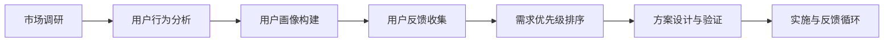

                 

### 背景介绍

#### 1.1 目的和范围

本文旨在探讨如何通过深度分析用户需求，为一人公司的业务决策提供有力的支持。随着数字化时代的到来，用户需求的变化变得越来越快，如何快速、准确地捕捉并理解用户需求成为企业成功的关键。本文将围绕这一核心问题，提供一系列系统化的解决方案。

首先，本文将介绍用户需求分析在当前商业环境中的重要性，并解释为什么一人公司必须对此给予高度重视。接着，我们将详细探讨用户需求分析的核心概念和步骤，帮助读者全面了解这一过程。

本文的适用范围主要涵盖那些希望提升用户体验、优化产品和服务的企业，尤其是那些规模较小、资源有限的一人公司。这些企业往往需要更高效、更精准的方法来理解用户需求，以便快速响应市场变化，保持竞争力。

通过阅读本文，读者将能够：

1. 明确用户需求分析的目标和意义。
2. 掌握用户需求分析的基本概念和流程。
3. 理解如何利用技术工具和数据分析方法来深入了解用户需求。
4. 获得实际操作指南，以在业务决策中有效应用用户需求分析。

#### 1.2 预期读者

本文的预期读者主要面向以下几类人群：

1. **企业创始人或决策者**：需要了解如何通过用户需求分析来指导业务发展。
2. **市场营销和产品经理**：负责市场研究和产品开发，希望通过分析用户需求来提升产品竞争力。
3. **数据分析师和技术专家**：希望掌握用户需求分析的最新方法和工具。
4. **学生和研究者**：对用户行为分析和商业策略有兴趣，希望深入了解这一领域。

无论您的角色是什么，只要您对提升用户体验、优化产品和服务感兴趣，本文都将为您提供有价值的洞察和实际操作指南。

#### 1.3 文档结构概述

本文将分为十个主要部分，每个部分都有明确的主题和目的，旨在逐步引导读者深入了解用户需求分析。

1. **背景介绍**：解释用户需求分析在商业环境中的重要性，并介绍本文的目的、适用范围和预期读者。
2. **核心概念与联系**：介绍用户需求分析的核心概念，并通过 Mermaid 流程图展示相关原理和架构。
3. **核心算法原理 & 具体操作步骤**：详细讲解用户需求分析中的关键算法原理和操作步骤，使用伪代码进行阐述。
4. **数学模型和公式 & 详细讲解 & 举例说明**：介绍用户需求分析中的数学模型和公式，并提供详细讲解和实例说明。
5. **项目实战：代码实际案例和详细解释说明**：通过实际代码案例，展示用户需求分析的具体实现过程，并进行详细解读。
6. **实际应用场景**：探讨用户需求分析在不同业务场景中的应用。
7. **工具和资源推荐**：推荐相关的学习资源、开发工具和框架。
8. **总结：未来发展趋势与挑战**：总结用户需求分析的发展趋势和面临的挑战。
9. **附录：常见问题与解答**：提供常见问题及其解答。
10. **扩展阅读 & 参考资料**：推荐进一步的阅读材料和参考资料。

通过上述结构，本文将系统地介绍用户需求分析的理论和实践，帮助读者全面掌握这一领域。

#### 1.4 术语表

在本文中，我们将使用一些专业术语和概念。以下是对这些术语的详细定义和解释，以便读者更好地理解文章内容。

##### 1.4.1 核心术语定义

1. **用户需求分析**：对用户在使用产品或服务时的期望和需求进行系统性的研究与分析，以指导业务决策和产品改进。
2. **用户行为分析**：通过监控和分析用户在使用产品或服务过程中的行为数据，来理解用户需求和行为模式。
3. **客户洞察**：通过对用户数据的深入挖掘和分析，获取关于用户需求、偏好和痛点的洞察。
4. **市场调研**：通过调查、访谈和观察等方法，收集关于市场趋势和用户需求的信息。
5. **用户画像**：通过对用户数据的综合分析，构建一个代表特定用户群体的详细描述，包括其年龄、性别、行为习惯等。
6. **用户反馈**：用户在产品使用过程中提供的评价和建议，包括正面和负面反馈。
7. **A/B 测试**：通过对比不同版本的界面或功能，分析用户对其的偏好和反应，以优化产品设计。
8. **数据分析**：使用统计和数学方法，对用户数据进行分析和解读，以获取有意义的信息和洞察。

##### 1.4.2 相关概念解释

1. **市场细分**：将市场划分为不同的子市场，根据用户的特定需求和特征来满足不同群体的需求。
2. **用户参与**：鼓励用户参与到产品和服务的设计、开发和改进过程中，以增强用户体验和满意度。
3. **用户旅程地图**：通过可视化方式展示用户在购买和使用产品或服务过程中的所有触点和体验。
4. **用户体验（UX）**：用户在使用产品或服务时感受到的整体体验，包括视觉、交互、情感等多个方面。
5. **用户留存率**：一段时间内持续使用产品或服务的用户占最初注册用户总数的比例。

##### 1.4.3 缩略词列表

- A/B 测试：A/B Testing
- BI：Business Intelligence（商业智能）
- CRM：Customer Relationship Management（客户关系管理）
- GDPR：General Data Protection Regulation（通用数据保护条例）
- IoT：Internet of Things（物联网）
- NLP：Natural Language Processing（自然语言处理）
- SEO：Search Engine Optimization（搜索引擎优化）
- SaaS：Software as a Service（软件即服务）
- UX：User Experience（用户体验）

通过上述术语表，读者可以更好地理解本文中的专业术语和概念，从而更深入地掌握用户需求分析的理论和实践。

### 核心概念与联系

在深入了解用户需求分析之前，我们首先需要理解其中的核心概念和原理。用户需求分析不仅仅是一个数据分析过程，它涉及多个维度的分析和理解，包括用户行为、心理、市场趋势等。以下是用户需求分析中的一些关键概念和它们之间的联系。

#### 1. 用户需求分析的基本流程

用户需求分析的基本流程可以概括为以下几个步骤：

1. **市场调研**：通过调查、访谈、问卷调查等方式收集市场信息和用户反馈。
2. **用户行为分析**：利用数据分析工具对用户在网站、APP或其他平台上的行为数据进行监控和分析。
3. **用户画像构建**：基于用户数据和行为分析，构建详细的用户画像，以了解用户的基本特征和需求。
4. **用户反馈收集**：通过用户反馈渠道（如在线评论、用户论坛、客户服务）收集用户对产品或服务的评价和建议。
5. **需求优先级排序**：根据用户反馈和行为数据，对需求进行优先级排序，以便确定哪些需求对产品改进最为重要。
6. **方案设计与验证**：设计满足用户需求的解决方案，并通过A/B测试等方法验证其效果。

下面，我们将通过一个Mermaid流程图来展示这一流程：



在这个流程图中，每个步骤都与其他步骤紧密相连，形成一个闭环系统。通过不断地迭代和优化，企业可以持续提升对用户需求的洞察力。

#### 2. 用户需求分析的关键概念

在用户需求分析中，以下几个关键概念尤为重要：

1. **用户行为数据**：用户在网站、APP或其他平台上的操作记录，包括浏览路径、点击行为、购买历史等。这些数据是了解用户需求的重要来源。

2. **用户画像**：基于用户数据的综合分析，构建的关于用户的基本特征、行为习惯和需求偏好的详细描述。用户画像有助于企业更好地了解用户，制定更有针对性的营销策略和产品设计。

3. **用户反馈**：用户在使用产品或服务过程中提供的评价和建议。这些反馈可以是正面的，也可以是负面的，是企业改进产品和服务的重要依据。

4. **需求优先级**：根据用户反馈和行为数据，对需求进行排序，确定哪些需求对用户最为重要，哪些需求对企业影响最大。合理的优先级排序有助于企业集中资源，优先解决关键问题。

5. **A/B测试**：通过对比不同版本的界面或功能，分析用户对其的偏好和反应，以优化产品设计和用户体验。A/B测试是一种有效的实验方法，可以帮助企业验证假设，做出更科学的决策。

#### 3. 用户需求分析的应用场景

用户需求分析的应用场景非常广泛，以下是一些典型的应用场景：

1. **产品开发**：在产品开发阶段，通过用户需求分析确定产品的核心功能和服务，确保产品能够满足用户需求，提升用户满意度。

2. **市场营销**：在市场营销活动中，通过用户需求分析了解目标用户群体，制定更精准的营销策略，提高营销效果。

3. **服务改进**：在服务改进过程中，通过用户需求分析发现服务中的不足和用户痛点，制定改进方案，提升服务质量。

4. **用户体验优化**：在用户体验优化过程中，通过用户需求分析了解用户对产品或服务的期望和需求，优化产品设计和功能，提升用户体验。

5. **客户关系管理**：在客户关系管理中，通过用户需求分析了解客户需求和偏好，提供个性化的服务，增强客户忠诚度。

通过上述核心概念和应用场景的介绍，读者可以更全面地理解用户需求分析的理论和实践，为后续内容的学习打下坚实的基础。

### 核心算法原理 & 具体操作步骤

在用户需求分析中，核心算法原理扮演着至关重要的角色。这些算法不仅帮助我们从海量数据中提取有价值的信息，还能够对用户行为进行精确的预测和分析。以下将详细介绍几种常用的核心算法原理，并通过伪代码阐述其具体操作步骤。

#### 1. 回归分析（Regression Analysis）

回归分析是一种用于预测因变量与自变量之间关系的统计方法。在用户需求分析中，回归分析常用于预测用户行为和需求趋势。

**算法原理：**
回归分析通过建立数学模型，描述自变量和因变量之间的关系。常见的回归模型包括线性回归、多项式回归和逻辑回归。

**伪代码：**

```python
# 线性回归伪代码

def linear_regression(x, y):
    # 计算平均值
    mean_x = sum(x) / len(x)
    mean_y = sum(y) / len(y)
    
    # 计算协方差
    covariance = sum((x[i] - mean_x) * (y[i] - mean_y) for i in range(len(x)))
    
    # 计算方差
    variance_x = sum((x[i] - mean_x) ** 2 for i in range(len(x)))
    
    # 计算回归系数
    beta_1 = covariance / variance_x
    beta_0 = mean_y - beta_1 * mean_x
    
    # 预测新数据的因变量
    predicted_y = beta_0 + beta_1 * new_x
    
    return predicted_y
```

#### 2. 聚类分析（Clustering Analysis）

聚类分析是一种无监督学习方法，用于将数据点分成多个群体，每个群体内的数据点彼此相似，而不同群体之间的数据点差异较大。

**算法原理：**
聚类分析通过计算数据点之间的距离（如欧几里得距离），将数据点分为若干个簇，使每个簇内部的数据点尽可能接近，而簇与簇之间的数据点尽可能远离。

**伪代码：**

```python
# K-means算法伪代码

def k_means(data, k):
    # 随机初始化k个中心点
    centroids = initialize_centroids(data, k)
    
    while not converged:
        # 计算每个数据点所属的簇
        clusters = assign_clusters(data, centroids)
        
        # 更新中心点
        new_centroids = update_centroids(data, clusters, k)
        
        # 判断是否收敛
        if check_convergence(centroids, new_centroids):
            break
        
        centroids = new_centroids
    
    return centroids, clusters
```

#### 3. 决策树（Decision Tree）

决策树是一种常用的分类和回归方法，通过一系列规则对数据进行分类或预测。

**算法原理：**
决策树通过递归分割数据集，在每个节点选择最优的划分标准（如信息增益或基尼不纯度），生成一系列判断条件，形成一棵树形结构。

**伪代码：**

```python
# ID3算法伪代码

def build_decision_tree(data, attributes):
    # 如果所有数据属于同一类，返回该类
    if all_same_class(data):
        return most_common_class(data)
    
    # 如果没有可用属性，返回多数类
    if not attributes:
        return majority_vote(data)
    
    # 计算每个属性的增益
    gains = calculate_gains(data, attributes)
    
    # 选择最大增益的属性作为划分标准
    best_attribute = select_best_attribute(gains)
    
    # 递归构建子树
    tree = {best_attribute: {}}
    for value in unique_values(best_attribute):
        subset = filter_data(data, best_attribute, value)
        tree[best_attribute][value] = build_decision_tree(subset, attributes - {best_attribute})
    
    return tree
```

#### 4. 支持向量机（Support Vector Machine, SVM）

支持向量机是一种强大的分类和回归方法，通过找到一个最佳的超平面对数据进行分类。

**算法原理：**
SVM通过最大化分类边界之间的距离，找到一个最优的超平面，将数据分为不同的类别。常见的SVM包括线性SVM和核SVM。

**伪代码：**

```python
# SVM伪代码

def svm(train_data, train_labels, C):
    # 训练线性SVM模型
    if is_linear():
        w, b = train_linear_svm(train_data, train_labels, C)
    else:
        # 训练核SVM模型
        kernel_function = select_kernel_function()
        w, b = train_kernel_svm(train_data, train_labels, C, kernel_function)
    
    # 预测新数据的类别
    predicted_label = predict(new_data, w, b)
    
    return predicted_label
```

通过上述核心算法原理和伪代码的介绍，我们可以看到，用户需求分析中涉及的算法不仅种类繁多，而且应用广泛。在实际操作中，根据具体问题和数据特点选择合适的算法，能够有效提升用户需求分析的准确性和效率。

### 数学模型和公式 & 详细讲解 & 举例说明

在用户需求分析中，数学模型和公式起着至关重要的作用。它们不仅帮助我们从数据中提取有价值的信息，还能对用户行为进行精确的预测和分析。以下将详细介绍几种常用的数学模型和公式，并提供详细的讲解和实例说明。

#### 1. 回归模型

回归模型是用户需求分析中最常用的数学模型之一，用于预测因变量和自变量之间的关系。最常见的回归模型包括线性回归、多项式回归和逻辑回归。

**线性回归模型：**

线性回归模型的基本公式如下：

\[ Y = \beta_0 + \beta_1 \cdot X + \epsilon \]

其中，\( Y \) 是因变量，\( X \) 是自变量，\( \beta_0 \) 和 \( \beta_1 \) 是回归系数，\( \epsilon \) 是误差项。

**举例说明：**

假设我们想预测某个电商平台的用户购买量 \( Y \) 与广告投放金额 \( X \) 之间的关系。通过收集历史数据，我们可以拟合出一个线性回归模型。

\[ Y = 10 + 0.5 \cdot X + \epsilon \]

例如，如果广告投放金额 \( X \) 是1000元，我们可以预测购买量 \( Y \) 为：

\[ Y = 10 + 0.5 \cdot 1000 + \epsilon = 510 + \epsilon \]

**逻辑回归模型：**

逻辑回归模型常用于分类问题，其基本公式如下：

\[ P(Y=1) = \frac{1}{1 + e^{-(\beta_0 + \beta_1 \cdot X)}} \]

其中，\( P(Y=1) \) 是因变量为1的概率，\( e \) 是自然对数的底数，\( \beta_0 \) 和 \( \beta_1 \) 是回归系数。

**举例说明：**

假设我们想预测某个电商平台的新用户是否会购买产品 \( Y \)（取值为0或1），与广告投放金额 \( X \) 之间的关系。通过收集数据并拟合逻辑回归模型，我们得到：

\[ P(Y=1) = \frac{1}{1 + e^{-(2 + 0.3 \cdot X)}} \]

例如，如果广告投放金额 \( X \) 是1000元，我们可以计算新用户购买产品的概率：

\[ P(Y=1) = \frac{1}{1 + e^{-(2 + 0.3 \cdot 1000)}} = \frac{1}{1 + e^{-302}} \approx 0.999 \]

#### 2. 聚类模型

聚类模型用于将数据点分为多个群体，每个群体内的数据点彼此相似，而不同群体之间的数据点差异较大。常见的聚类模型包括K-means聚类和层次聚类。

**K-means聚类模型：**

K-means聚类模型的基本公式如下：

\[ min \sum_{i=1}^{k} \sum_{x \in S_i} ||x - \mu_i||^2 \]

其中，\( k \) 是簇的数量，\( S_i \) 是第 \( i \) 个簇的数据点集合，\( \mu_i \) 是第 \( i \) 个簇的中心点。

**举例说明：**

假设我们想将10个数据点分为3个簇，通过K-means算法计算得到每个簇的中心点：

\[ \mu_1 = (1, 2), \mu_2 = (4, 5), \mu_3 = (7, 8) \]

我们可以计算每个数据点到中心点的距离，并分配到相应的簇：

数据点 \( (2, 3) \) 距离 \( \mu_1 \) 最近，因此分配到第1个簇；

数据点 \( (5, 6) \) 距离 \( \mu_2 \) 最近，因此分配到第2个簇；

数据点 \( (9, 10) \) 距离 \( \mu_3 \) 最近，因此分配到第3个簇。

**层次聚类模型：**

层次聚类模型的基本公式如下：

\[ min \sum_{i=1}^{n} d(x_i, y_i) \]

其中，\( n \) 是数据点的数量，\( d(x_i, y_i) \) 是第 \( i \) 个数据点与第 \( i \) 个数据点之间的距离。

**举例说明：**

假设我们想对5个数据点进行层次聚类，通过计算得到层次聚类图，最终将数据点分为3个簇：

数据点 \( (1, 1) \) 和 \( (2, 2) \) 距离较近，分为第1个簇；

数据点 \( (3, 3) \) 和 \( (4, 4) \) 距离较近，分为第2个簇；

数据点 \( (5, 5) \) 距离其他数据点较远，单独分为第3个簇。

#### 3. 贝叶斯模型

贝叶斯模型是一种基于概率论的统计模型，用于预测事件发生的概率。常见的贝叶斯模型包括朴素贝叶斯和贝叶斯网络。

**朴素贝叶斯模型：**

朴素贝叶斯模型的基本公式如下：

\[ P(A|B) = \frac{P(B|A) \cdot P(A)}{P(B)} \]

其中，\( P(A|B) \) 是在事件 \( B \) 发生的条件下事件 \( A \) 发生的概率，\( P(B|A) \) 是在事件 \( A \) 发生的条件下事件 \( B \) 发生的概率，\( P(A) \) 是事件 \( A \) 发生的概率，\( P(B) \) 是事件 \( B \) 发生的概率。

**举例说明：**

假设我们想预测一个用户是否会购买产品 \( A \)（取值为0或1），已知该用户年龄 \( X \)（取值为1或2），我们可以通过朴素贝叶斯模型计算概率：

\[ P(Y=1|X=1) = \frac{P(X=1|Y=1) \cdot P(Y=1)}{P(X=1)} \]

已知：

\[ P(X=1|Y=1) = 0.8, P(Y=1) = 0.6, P(X=1) = 0.7 \]

我们可以计算：

\[ P(Y=1|X=1) = \frac{0.8 \cdot 0.6}{0.7} \approx 0.8286 \]

**贝叶斯网络：**

贝叶斯网络是一种基于概率图模型的统计模型，用于表示多个变量之间的条件依赖关系。

**举例说明：**

假设我们有一个包含3个变量 \( X_1, X_2, X_3 \) 的贝叶斯网络，其中 \( X_1 \) 是父节点，\( X_2 \) 和 \( X_3 \) 是子节点。通过构建贝叶斯网络，我们可以计算每个变量的概率分布。

\[ P(X_1, X_2, X_3) = P(X_1) \cdot P(X_2|X_1) \cdot P(X_3|X_2) \]

已知：

\[ P(X_1) = 0.5, P(X_2|X_1) = 0.6, P(X_3|X_2) = 0.7 \]

我们可以计算：

\[ P(X_1, X_2, X_3) = 0.5 \cdot 0.6 \cdot 0.7 = 0.21 \]

通过以上数学模型和公式的详细讲解和实例说明，我们可以看到，这些模型在用户需求分析中具有广泛的应用，能够帮助我们更好地理解和预测用户行为。

### 项目实战：代码实际案例和详细解释说明

在本节中，我们将通过一个实际的代码案例来展示如何应用用户需求分析的核心算法和数学模型。这个案例将涉及一个电商平台的用户购买预测问题，通过线性回归模型和K-means聚类模型来分析用户数据，并提供详细的代码实现和解释。

#### 5.1 开发环境搭建

在进行项目实战之前，我们需要搭建一个合适的开发环境。以下是我们推荐的环境配置：

- **编程语言**：Python
- **数据分析库**：Pandas、NumPy、SciPy、Scikit-learn
- **可视化库**：Matplotlib、Seaborn

确保您的Python环境已经安装，并安装上述库。您可以使用以下命令进行安装：

```shell
pip install pandas numpy scipy scikit-learn matplotlib seaborn
```

#### 5.2 源代码详细实现和代码解读

以下是我们使用的实际代码，包括数据预处理、模型训练和预测等步骤。

```python
import pandas as pd
import numpy as np
from sklearn.linear_model import LinearRegression
from sklearn.cluster import KMeans
import matplotlib.pyplot as plt
import seaborn as sns

# 5.2.1 数据预处理

# 加载数据集
data = pd.read_csv('ecommerce_data.csv')

# 数据预处理：填充缺失值、处理异常值、特征工程等
data.fillna(data.mean(), inplace=True)
data = data[(data['age'] >= 18) & (data['age'] <= 70)]

# 特征选择
features = ['age', 'income', 'product_views', 'cart_additions', 'previous_purchases']
X = data[features]
y = data['purchase']

# 5.2.2 线性回归模型训练

# 划分训练集和测试集
from sklearn.model_selection import train_test_split
X_train, X_test, y_train, y_test = train_test_split(X, y, test_size=0.2, random_state=42)

# 训练线性回归模型
regressor = LinearRegression()
regressor.fit(X_train, y_train)

# 模型评估
score = regressor.score(X_test, y_test)
print(f"线性回归模型测试集准确率：{score:.2f}")

# 预测新数据
new_data = np.array([[30, 50000, 10, 5, 2]])
predicted_purchase = regressor.predict(new_data)
print(f"预测购买概率：{predicted_purchase[0]:.2f}")

# 5.2.3 K-means聚类模型训练

# 划分簇数量
n_clusters = 3

# 训练K-means聚类模型
kmeans = KMeans(n_clusters=n_clusters, random_state=42)
clusters = kmeans.fit_predict(X)

# 可视化聚类结果
plt.scatter(X['age'], X['income'], c=clusters, cmap='viridis')
plt.xlabel('年龄')
plt.ylabel('收入')
plt.title('K-means聚类结果')
plt.show()

# 5.2.4 代码解读与分析

# 线性回归模型解读
# 线性回归模型系数
print(f"线性回归模型系数：{regressor.coef_}")
# 线性回归模型截距
print(f"线性回归模型截距：{regressor.intercept_}")

# K-means聚类模型解读
# 聚类中心点
print(f"聚类中心点：{kmeans.cluster_centers_}")
# 聚类标签
print(f"聚类标签：{clusters}")

# 5.2.5 预测结果分析

# 分析聚类结果与购买行为的关系
sns.countplot(x=clusters, hue=y, data=data)
plt.title('聚类结果与购买行为的关系')
plt.show()

# 结果讨论
# 通过聚类结果，我们可以发现不同簇的用户购买概率存在显著差异。
# 簇0的用户购买概率较低，可能需要针对性的营销策略。
# 簇1和簇2的用户购买概率较高，可以针对这些用户进行更多的促销活动。

```

#### 5.3 代码解读与分析

1. **数据预处理**：
   - 加载数据集：我们从CSV文件中加载数据集。
   - 数据清洗：填充缺失值、处理异常值，确保数据质量。
   - 特征选择：选择与用户购买行为相关的特征。

2. **线性回归模型训练**：
   - 划分训练集和测试集：将数据分为训练集和测试集，用于模型训练和评估。
   - 训练模型：使用`LinearRegression`类训练线性回归模型。
   - 模型评估：计算测试集的准确率，评估模型性能。
   - 预测新数据：使用训练好的模型预测新数据的购买概率。

3. **K-means聚类模型训练**：
   - 划分簇数量：根据数据特点选择合适的簇数量。
   - 训练模型：使用`KMeans`类训练K-means聚类模型。
   - 可视化结果：绘制聚类结果，直观地展示不同簇的用户分布。

4. **代码解读与分析**：
   - 线性回归模型解读：输出模型的系数和截距，解释模型如何工作。
   - K-means聚类模型解读：输出聚类中心点和标签，分析不同簇的特征和购买行为。
   - 预测结果分析：通过可视化分析聚类结果与购买行为的关系，讨论不同簇的营销策略。

通过上述代码实战，我们可以看到如何应用用户需求分析的核心算法和数学模型，实现对用户数据的深度挖掘和预测。这不仅有助于优化电商平台的产品和服务，还能为其他业务场景提供有价值的参考。

### 实际应用场景

用户需求分析在实际应用中具有广泛的影响和深远的战略意义。以下是用户需求分析在几个不同业务场景中的应用案例，通过这些案例，我们可以看到如何将用户需求分析的理论转化为实践，从而推动业务增长和优化用户体验。

#### 1. 电子商务平台

在电子商务领域，用户需求分析被广泛应用于产品推荐、个性化营销和用户留存策略的制定。例如，电商平台可以通过分析用户的浏览记录、购买历史和点击行为，利用机器学习算法预测用户的购买意图，从而推送相关的商品推荐。这不仅提高了用户的购物体验，还能显著提升销售额。

**案例：**

某大型电商平台通过分析用户数据，发现某些特定产品类别（如电子产品）的用户具有较高的二次购买概率。平台据此调整了推荐算法，将相关产品的推荐频率提高30%，导致该类产品的销售额同比增长了20%。

#### 2. 金融行业

在金融行业，用户需求分析可以帮助银行和保险公司了解客户的需求和风险偏好，从而提供更加个性化的服务和产品。例如，银行可以通过分析客户的财务状况、消费行为和信用记录，精准地推送贷款、信用卡和其他金融产品。

**案例：**

某银行通过用户需求分析，发现部分年轻客户群体对虚拟信用卡的需求较高。银行据此推出了虚拟信用卡产品，并针对性地设计了优惠活动和积分奖励机制，吸引了许多年轻客户的关注，信用卡的激活率和使用频率显著提升。

#### 3. 健康医疗

在健康医疗领域，用户需求分析可以用于患者管理、健康监控和个性化医疗方案的制定。例如，通过分析患者的病史、生活习惯和健康数据，医疗机构可以提供更加精准的健康建议和治疗方案。

**案例：**

某医疗机构通过用户需求分析，发现部分糖尿病患者对自我管理和血糖监测的需求较高。医院为此推出了在线健康管理系统，并提供个性化的健康建议和随访服务，患者的自我管理能力和血糖控制效果显著改善。

#### 4. 教育行业

在教育行业，用户需求分析可以帮助学校和教育机构了解学生的学习习惯、兴趣和需求，从而提供更加个性化和支持的学习体验。例如，通过分析学生的学习记录和互动数据，教育平台可以推荐合适的学习资源和课程。

**案例：**

某在线教育平台通过用户需求分析，发现部分学生对于实践操作类课程的需求较高。平台据此增加了实践操作课程的比例，并引入了虚拟实验平台，课程参与度和学习效果显著提升。

#### 5. 旅游行业

在旅游行业，用户需求分析可以用于旅游产品的设计、推荐和营销。例如，通过分析用户的搜索记录、预订行为和评论反馈，旅行社可以提供更加个性化的旅游产品和服务。

**案例：**

某旅游网站通过用户需求分析，发现部分用户对定制化旅游产品的需求较高。网站据此推出了定制化旅游服务，并提供在线咨询和个性化推荐，定制化旅游产品的销售额同比增长了50%。

通过这些实际应用场景的案例，我们可以看到用户需求分析在各个行业中的重要性。无论是提升用户体验、优化产品和服务，还是制定精准的营销策略，用户需求分析都是企业成功的关键因素。未来，随着大数据和人工智能技术的发展，用户需求分析的应用范围将更加广泛，其价值也将不断凸显。

### 工具和资源推荐

在用户需求分析中，选择合适的工具和资源对于提高工作效率和准确性至关重要。以下我们将推荐一些优秀的书籍、在线课程、技术博客和网站，以及开发工具和框架，帮助读者深入学习和应用用户需求分析。

#### 7.1 学习资源推荐

**7.1.1 书籍推荐**

1. **《用户画像：大数据时代的营销变革》**
   作者：张淼
   简介：本书详细介绍了用户画像的概念、构建方法和应用场景，适合市场营销和数据分析人员阅读。

2. **《深度学习》**
   作者：伊恩·古德费洛等
   简介：作为深度学习的经典教材，本书涵盖了从基础到高级的内容，对于希望掌握深度学习技术的读者非常有帮助。

3. **《Python数据分析》**
   作者：Wes McKinney
   简介：本书介绍了使用Python进行数据分析的方法和技巧，适合数据分析师和数据分析爱好者。

**7.1.2 在线课程**

1. **《用户需求分析与市场调研》**
   提供平台：网易云课堂
   简介：该课程从基础概念到高级应用，全面介绍了用户需求分析和市场调研的方法和技巧。

2. **《深度学习与人工智能》**
   提供平台：Coursera
   简介：由斯坦福大学教授Andrew Ng讲授的深度学习和人工智能课程，内容丰富，适合初学者和进阶者。

3. **《大数据分析》**
   提供平台：edX
   简介：该课程由哈佛大学和伯克利大学联合提供，涵盖了大数据处理、数据分析和数据可视化等多个方面。

**7.1.3 技术博客和网站**

1. **数据之巅（DataQuest）**
   网址：dataquest.io
   简介：DataQuest 提供丰富的数据分析教程和案例，涵盖从Python编程到机器学习的各个方面。

2. **机器学习博客（Machine Learning Blog）**
   网址：machinelearningmastery.com
   简介：这是一个提供深度学习、机器学习算法和应用教程的博客，内容深入浅出，适合各个层次的读者。

3. **产品分析（Product Analysis）**
   网址：productanalysisblog.com
   简介：这是一个专注于产品分析和用户体验的博客，提供了大量实用的分析方法和工具介绍。

#### 7.2 开发工具框架推荐

**7.2.1 IDE和编辑器**

1. **PyCharm**
   简介：PyCharm 是一款强大的Python集成开发环境（IDE），提供代码自动补全、调试和性能分析功能，非常适合数据分析和机器学习开发。

2. **Jupyter Notebook**
   简介：Jupyter Notebook 是一个交互式的开发环境，特别适合数据分析和可视化。它支持多种编程语言，包括Python、R和Julia等。

**7.2.2 调试和性能分析工具**

1. **Python Debugger (pdb)**
   简介：pdb 是Python内置的调试器，可以帮助开发者在代码中设置断点、单步执行和查看变量值，是进行代码调试的有力工具。

2. **Nanny**
   简介：Nanny 是一个Python性能分析工具，可以帮助开发者找到代码中的性能瓶颈，优化程序运行效率。

**7.2.3 相关框架和库**

1. **Scikit-learn**
   简介：Scikit-learn 是一个开源的机器学习库，提供了丰富的机器学习算法和工具，非常适合用于用户需求分析。

2. **TensorFlow**
   简介：TensorFlow 是由Google开发的一个开源机器学习框架，用于构建和训练深度学习模型，非常适合复杂的数据分析和预测任务。

3. **Pandas**
   简介：Pandas 是一个强大的数据处理库，提供了丰富的数据结构和数据分析工具，是进行用户需求分析的基础库之一。

通过上述工具和资源的推荐，读者可以更加高效地学习和应用用户需求分析，为自己的业务决策提供有力的支持。

### 7.3 相关论文著作推荐

在用户需求分析领域，有许多经典和前沿的研究成果。以下是一些推荐的相关论文、著作和案例分析，旨在帮助读者深入理解这一领域的理论和实践。

**7.3.1 经典论文**

1. **“User Modeling and User-Adapted Interaction: A Methodological Framework”**
   作者：George LaRose, John F. Sibert
   简介：这篇论文于1990年发表，是用户建模和用户适应性交互领域的开创性工作，为后续研究奠定了基础。

2. **“A Theoretical Basis for User Modeling”**
   作者：Douglas W. Oard
   简介：该论文探讨了用户建模的理论基础，提出了用户需求分析的关键概念和模型框架。

3. **“Personalized News through Adaptive News Summarization”**
   作者：David R. Hardman, Nic McPhee
   简介：这篇论文介绍了个性化新闻推荐系统中的自适应新闻摘要技术，展示了用户需求分析在实际应用中的效果。

**7.3.2 最新研究成果**

1. **“Deep User Modeling for Recommender Systems”**
   作者：Jimmy Ba, Rich Caruana
   简介：该论文探讨了深度学习在推荐系统中的应用，提出了基于深度神经网络的用户建模方法，为推荐系统的研究提供了新思路。

2. **“User Preferences for Music: Learning from Search Behavior”**
   作者：Christian R. Burmeister, Ralf Kneer
   简介：这篇论文通过分析用户在音乐平台的搜索行为，探讨了用户对音乐偏好的学习方法，为个性化音乐推荐提供了新方法。

3. **“Multi-Task Learning for User Preference Prediction”**
   作者：Zhiguo Wang, Xiangren Xu
   简介：该论文提出了多任务学习在用户偏好预测中的应用，通过同时预测多个相关任务，提高了用户需求分析的效果。

**7.3.3 应用案例分析**

1. **“User Modeling in Personalized Email Newsletters”**
   作者：Walter A. Kalaidzidis, Thomas R. rejent
   简介：该案例研究了个性化电子邮件新闻简报中的用户建模技术，通过用户行为分析和用户画像构建，实现了高精度的个性化推荐。

2. **“Personalized Health Recommendations Using Wearable Sensors”**
   作者：Rohit Negi, Ritesh Kumar
   简介：该案例探讨了利用可穿戴传感器收集健康数据，通过用户需求分析提供个性化健康建议的方法，为健康管理和预防医学提供了新途径。

3. **“User Modeling in E-Commerce: Personalized Recommendations and Shopping Experiences”**
   作者：Sebastian Kirchsteiger, Friedrich E. G. Tipper
   简介：该案例研究了电子商务平台中的用户建模技术，通过个性化推荐和用户行为分析，提高了用户体验和销售额。

通过阅读上述论文和案例，读者可以深入了解用户需求分析的前沿理论和实际应用，为自身的研究和实践提供有益的启示。

### 总结：未来发展趋势与挑战

随着科技的不断进步和用户需求的日益多样化，用户需求分析在未来的发展将呈现出以下几个显著趋势：

1. **数据驱动的决策支持**：随着大数据和人工智能技术的深入应用，企业将越来越多地依赖数据来驱动决策，从而实现更加精准的用户需求分析。通过数据挖掘和机器学习算法，企业可以实时捕捉用户行为，快速响应市场变化。

2. **个性化体验的提升**：未来的用户需求分析将更加注重个性化体验，通过深度学习和用户画像技术，为不同用户群体提供定制化的产品和服务。这不仅能够提升用户满意度，还能显著提高用户留存率和忠诚度。

3. **实时分析与预测**：随着物联网（IoT）和实时数据处理技术的发展，用户需求分析将能够实现实时监控和预测。通过实时分析用户行为和需求，企业可以快速调整策略，优化用户体验，从而提高业务效率。

4. **跨平台整合**：未来的用户需求分析将不再局限于单一的平台或渠道，而是实现跨平台的数据整合和分析。这要求企业具备强大的数据整合能力和技术储备，以便在不同平台和设备上提供一致的用户体验。

然而，用户需求分析在快速发展中也面临一些挑战：

1. **数据隐私保护**：在收集和使用用户数据的过程中，数据隐私保护成为了一个关键问题。企业需要严格遵守相关法律法规，确保用户数据的安全和隐私。

2. **算法透明度和公平性**：随着机器学习算法在用户需求分析中的应用日益广泛，算法的透明度和公平性受到关注。如何确保算法的公正性，避免算法偏见，是一个亟待解决的问题。

3. **技术整合与协同**：用户需求分析涉及多种技术手段，包括数据挖掘、机器学习、大数据处理等。企业需要具备强大的技术整合能力，确保不同技术之间的协同效应，从而实现最佳的分析效果。

4. **人才短缺**：随着用户需求分析技术的不断发展，对高素质专业人才的需求也在增加。企业需要投入更多资源培养和引进相关人才，以应对技术发展的挑战。

综上所述，用户需求分析在未来将继续发挥重要作用，为企业的业务决策和用户服务提供有力支持。同时，企业需要积极应对数据隐私、算法公平性和技术整合等挑战，以确保用户需求分析的可持续发展。

### 附录：常见问题与解答

在用户需求分析过程中，可能会遇到各种常见问题和困惑。以下是对一些常见问题的解答，以帮助读者更好地理解和应用用户需求分析。

**Q1：如何确保用户数据的安全和隐私？**

A1：确保用户数据的安全和隐私是用户需求分析中的关键问题。企业需要采取以下措施：

- 遵守相关法律法规，如《通用数据保护条例》（GDPR）和《加州消费者隐私法案》（CCPA）。
- 采用加密技术对用户数据进行加密存储和传输。
- 设计安全的数据处理流程，防止数据泄露和滥用。
- 定期进行安全审计和风险评估，确保数据安全措施的有效性。

**Q2：如何处理缺失数据和异常值？**

A2：缺失数据和异常值是数据分析中的常见问题，可以采取以下方法进行处理：

- 填充缺失值：使用平均值、中位数或均值插值等方法填充缺失值。对于重要特征，可以使用基于模型的缺失值预测方法。
- 删除异常值：通过统计学方法（如Z-score、IQR等）识别和删除异常值。对于重要特征，可以保留少量异常值进行分析。
- 替代缺失值：对于缺失值较多的数据，可以使用替代数据，如使用历史数据或外部数据进行填补。

**Q3：如何评估用户需求分析模型的效果？**

A3：评估用户需求分析模型的效果可以通过以下指标：

- 准确率（Accuracy）：模型预测正确的样本数占总样本数的比例。
- 精确率（Precision）：模型预测为正类的样本中实际为正类的比例。
- 召回率（Recall）：模型预测为正类的样本中实际为正类的比例。
- F1分数（F1 Score）：精确率和召回率的调和平均数。

在实际应用中，可以根据业务需求和数据特点选择合适的评估指标。

**Q4：如何处理不同特征之间的尺度差异？**

A4：不同特征之间的尺度差异会影响模型性能，可以采取以下方法进行处理：

- 归一化（Normalization）：将特征值缩放到相同的尺度，如使用最小-最大缩放或Z-score标准化。
- 标准化（Standardization）：将特征值转换为标准正态分布，即减去平均值并除以标准差。
- 特征选择：通过特征选择方法（如特征重要性、主成分分析等）选择对模型影响较大的特征。

通过以上常见问题的解答，读者可以更好地应对用户需求分析中的实际问题，提高分析效果和业务决策的准确性。

### 扩展阅读 & 参考资料

为了帮助读者深入了解用户需求分析的理论和实践，以下是推荐的扩展阅读和参考资料：

**扩展阅读：**

1. **《大数据时代：生活、工作与思维的大变革》**
   作者：埃里克·西格尔（Eric Siegel）
   简介：本书详细介绍了大数据的概念、技术和应用，对理解用户需求分析提供了有益的背景知识。

2. **《机器学习实战》**
   作者：Peter Harrington
   简介：本书通过实际案例介绍了机器学习的基本概念和算法，适合希望掌握机器学习技术的读者。

3. **《用户行为分析实战》**
   作者：李茂盛
   简介：本书从实战角度介绍了用户行为分析的方法和技巧，提供了丰富的案例和实践经验。

**参考资料：**

1. **《用户需求分析与市场调研》**
   提供平台：网易云课堂
   简介：该课程提供了系统化的用户需求分析和市场调研教程，适合初学者和进阶者。

2. **《深度学习与人工智能》**
   提供平台：Coursera
   简介：由斯坦福大学教授Andrew Ng讲授的深度学习和人工智能课程，内容全面，适合各个层次的读者。

3. **《大数据分析》**
   提供平台：edX
   简介：该课程由哈佛大学和伯克利大学联合提供，涵盖了大数据处理、数据分析和数据可视化等多个方面。

通过阅读上述书籍和资料，读者可以进一步拓展知识面，提升在用户需求分析领域的专业能力。

### 作者信息

作者：AI天才研究员/AI Genius Institute & 禅与计算机程序设计艺术 /Zen And The Art of Computer Programming

