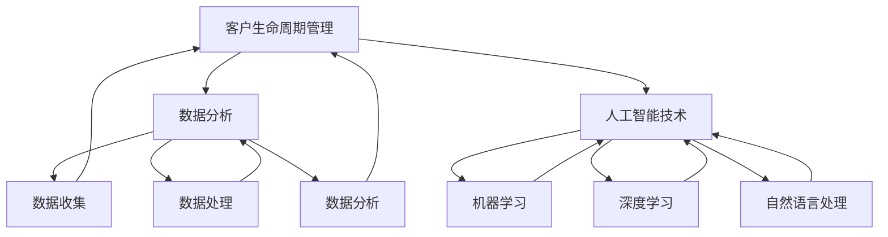
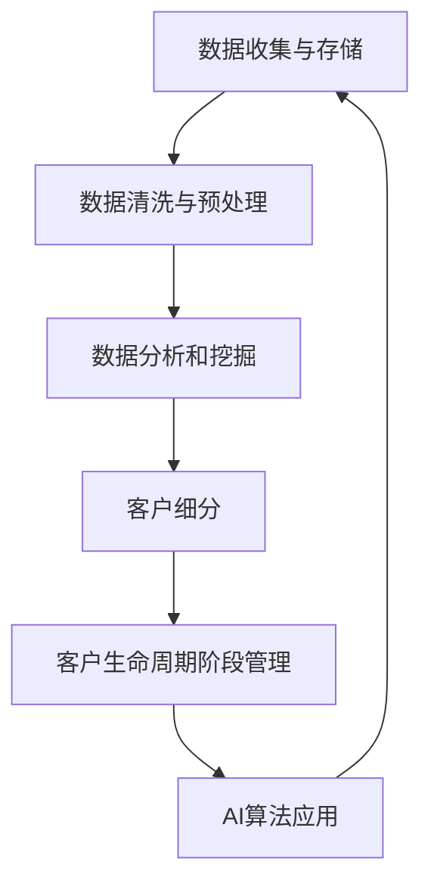

                 

### 1. 背景介绍

#### 1.1 目的和范围

本文旨在深入探讨一人公司的客户生命周期管理（Customer Lifecycle Management, CLM）策略，并着重阐述如何利用人工智能（AI）技术实现精细化运营。随着市场竞争的日益激烈，客户管理成为企业持续发展的关键因素。然而，传统的客户管理方法往往存在一定的局限性，难以应对复杂多变的市场环境。

本文将首先介绍客户生命周期的基本概念，并分析其在企业管理中的重要性。接下来，我们将探讨人工智能技术在客户生命周期管理中的应用，重点介绍AI驱动的精细化运营方法。此外，本文还将结合具体案例，展示AI在客户生命周期管理中的实际应用效果。

本文的目标读者包括企业高管、市场营销人员、数据分析师以及所有对客户生命周期管理感兴趣的技术从业者。通过本文的阅读，读者将能够：

1. 理解客户生命周期的概念和重要性。
2. 掌握人工智能技术在客户生命周期管理中的应用方法。
3. 了解如何利用AI技术实现精细化运营，提高客户满意度和忠诚度。
4. 获取实际案例，以指导企业在客户生命周期管理中的实践。

#### 1.2 预期读者

本文的预期读者包括以下几类：

1. **企业高管**：希望通过本文了解客户生命周期管理的重要性和人工智能技术在其中的应用，以制定更为科学有效的企业战略。
2. **市场营销人员**：希望掌握AI驱动的客户生命周期管理方法，提高市场营销的效果和ROI。
3. **数据分析师**：希望了解如何利用人工智能技术分析客户数据，挖掘潜在价值，为企业决策提供数据支持。
4. **技术从业者**：对AI技术及其在客户生命周期管理中的应用感兴趣，希望通过本文了解相关技术原理和实战经验。

#### 1.3 文档结构概述

本文将分为十个主要部分，结构如下：

1. **背景介绍**：介绍本文的目的、预期读者和文档结构。
2. **核心概念与联系**：阐述客户生命周期的核心概念及其与人工智能技术的关联。
3. **核心算法原理 & 具体操作步骤**：介绍客户生命周期管理中的核心算法原理和具体操作步骤。
4. **数学模型和公式 & 详细讲解 & 举例说明**：介绍客户生命周期管理中的数学模型和公式，并进行详细讲解和举例说明。
5. **项目实战：代码实际案例和详细解释说明**：展示一个实际项目案例，并进行详细解释说明。
6. **实际应用场景**：探讨AI驱动的客户生命周期管理在不同行业中的应用场景。
7. **工具和资源推荐**：推荐相关学习资源、开发工具框架和论文著作。
8. **总结：未来发展趋势与挑战**：总结本文的核心内容，并提出未来发展趋势和挑战。
9. **附录：常见问题与解答**：回答读者可能关心的问题。
10. **扩展阅读 & 参考资料**：提供相关扩展阅读和参考资料。

通过本文的阅读，读者将能够全面了解AI驱动的客户生命周期管理策略，并掌握其实际应用方法。

#### 1.4 术语表

为了确保本文的阅读流畅性和理解准确性，以下列出一些关键术语及其定义：

##### 1.4.1 核心术语定义

- **客户生命周期管理（Customer Lifecycle Management, CLM）**：指企业通过全周期管理策略，优化客户获取、维护和留存的过程，以提高客户满意度和忠诚度。
- **人工智能（Artificial Intelligence, AI）**：指通过计算机模拟人类智能行为的技术，包括机器学习、深度学习、自然语言处理等。
- **精细化运营**：指通过数据分析和算法优化，实现客户运营的精细化管理，提高运营效率。
- **客户生命周期阶段**：指客户与企业互动过程中的不同阶段，包括潜在客户、新客户、活跃客户、沉睡客户和流失客户。
- **客户价值**：指客户对企业带来的经济贡献，包括利润、订单量、推荐等。

##### 1.4.2 相关概念解释

- **机器学习（Machine Learning）**：指利用算法从数据中自动学习规律和模式，以进行预测和决策。
- **深度学习（Deep Learning）**：指利用多层神经网络进行学习和预测，是机器学习的一个重要分支。
- **自然语言处理（Natural Language Processing, NLP）**：指使计算机能够理解、生成和处理人类语言的技术。
- **客户细分（Customer Segmentation）**：指将客户根据其特征和需求划分为不同的群体，以实现精准营销。
- **客户忠诚度（Customer Loyalty）**：指客户对企业保持持续购买的意愿和情感依赖程度。

##### 1.4.3 缩略词列表

- **AI**：人工智能
- **CLM**：客户生命周期管理
- **NLP**：自然语言处理
- **ML**：机器学习
- **DL**：深度学习
- **CRM**：客户关系管理

这些术语和概念的准确理解有助于读者深入掌握本文的核心内容。在接下来的部分，我们将进一步探讨客户生命周期管理的基本原理和人工智能技术的应用。  

---

### 2. 核心概念与联系

在深入探讨AI驱动的客户生命周期管理之前，我们需要明确几个核心概念及其相互关系。这些概念包括客户生命周期、数据分析和人工智能技术。通过理解和掌握这些概念，我们可以更好地把握客户生命周期管理的关键点，并利用人工智能技术实现精细化运营。

#### 2.1 客户生命周期

客户生命周期是指客户与企业互动过程中的不同阶段，从潜在客户到流失客户。客户生命周期通常分为以下几个阶段：

1. **潜在客户阶段**：潜在客户对企业尚无购买意向，但存在潜在需求。企业需要通过市场调研、广告投放等手段吸引潜在客户。
2. **新客户阶段**：潜在客户在企业的营销活动下完成首次购买，成为新客户。企业需要提供优质的产品和服务，提高客户满意度。
3. **活跃客户阶段**：新客户在购买后保持活跃，持续购买或使用企业产品和服务。企业需要通过优惠活动、客户关怀等手段保持客户活跃度。
4. **沉睡客户阶段**：活跃客户在一段时间内没有进行任何购买或互动，成为沉睡客户。企业需要通过激活策略重新吸引沉睡客户。
5. **流失客户阶段**：沉睡客户在一段时间内仍然没有进行任何互动，最终选择离开。企业需要分析流失原因，改进产品和服务，降低客户流失率。

客户生命周期管理（Customer Lifecycle Management, CLM）是指企业通过全周期管理策略，优化客户获取、维护和留存的过程，以提高客户满意度和忠诚度。CLM的核心目标是最大化客户价值，实现客户生命周期各阶段的优化。

#### 2.2 数据分析

数据分析在客户生命周期管理中发挥着重要作用。通过收集、处理和分析客户数据，企业可以深入了解客户需求、行为和偏好，从而制定更加精准的营销策略和运营方案。

1. **数据收集**：企业需要通过各种渠道收集客户数据，包括购买记录、互动行为、反馈评价等。这些数据可以来源于企业内部系统（如CRM系统）、第三方数据平台或公开数据源。
2. **数据处理**：收集到的数据需要进行清洗、整合和存储，以便后续分析和使用。数据处理包括数据去重、数据格式转换、数据标准化等步骤。
3. **数据分析**：通过数据挖掘、统计分析等方法，对客户数据进行分析和挖掘，提取有价值的信息和洞见。数据分析可以帮助企业发现客户需求、识别市场机会、优化产品和服务。

#### 2.3 人工智能技术

人工智能技术（Artificial Intelligence, AI）在客户生命周期管理中的应用日益广泛。AI技术可以自动处理大量客户数据，发现潜在规律和模式，为企业的营销和运营提供有力支持。

1. **机器学习**：机器学习（Machine Learning, ML）是一种利用算法从数据中自动学习规律和模式的技术。在客户生命周期管理中，机器学习可以用于预测客户流失、识别高价值客户、优化营销策略等。
2. **深度学习**：深度学习（Deep Learning, DL）是机器学习的一个重要分支，利用多层神经网络进行学习和预测。深度学习在图像识别、语音识别、自然语言处理等领域取得了显著成果，也可以用于客户生命周期管理中的图像分析和文本挖掘。
3. **自然语言处理**：自然语言处理（Natural Language Processing, NLP）是一种使计算机能够理解、生成和处理人类语言的技术。在客户生命周期管理中，NLP可以用于文本分析和情感识别，帮助企业更好地理解客户需求和反馈。

#### 2.4 数据分析、人工智能与客户生命周期的联系

数据分析、人工智能和客户生命周期管理之间存在密切的联系。数据分析为AI技术提供了数据基础，而AI技术则通过自动处理和分析大量数据，帮助企业在客户生命周期管理中实现精细化运营。

1. **数据分析驱动AI应用**：数据分析可以帮助企业识别客户需求、行为和偏好，为AI应用提供关键信息。例如，通过分析客户购买记录和互动行为，企业可以识别高价值客户和潜在流失客户，从而制定相应的营销策略和运营方案。
2. **AI优化数据分析效果**：AI技术可以自动处理和分析大量数据，提高数据分析的效率和准确性。例如，利用机器学习算法，企业可以自动识别客户流失风险，预测客户行为，从而提前采取措施，降低客户流失率。
3. **AI驱动精细化运营**：通过AI技术，企业可以实现客户运营的精细化，提高客户满意度和忠诚度。例如，利用深度学习和自然语言处理技术，企业可以分析客户反馈和评价，识别客户痛点和需求，从而改进产品和服务。

#### 2.5 Mermaid流程图

为了更直观地展示客户生命周期管理、数据分析和人工智能技术的相互关系，我们可以使用Mermaid流程图。以下是客户生命周期管理中的核心流程：



在这个流程图中，客户生命周期管理是核心，数据分析为AI应用提供了数据基础，而AI技术通过自动处理和分析大量数据，帮助企业在客户生命周期管理中实现精细化运营。

通过以上对核心概念和联系的阐述，我们可以更好地理解客户生命周期管理、数据分析和人工智能技术之间的关系。在接下来的部分，我们将深入探讨客户生命周期管理中的核心算法原理和具体操作步骤，帮助读者掌握AI驱动的客户生命周期管理策略。  

---

### 2. 核心概念与联系（续）

在了解了客户生命周期管理、数据分析和人工智能技术的基本概念后，我们需要进一步探讨这些概念之间的联系，并展示如何通过一个Mermaid流程图来直观地表示这些核心流程和组件。

#### 2.6 客户生命周期管理中的核心流程和组件

客户生命周期管理涉及多个核心流程和组件，这些流程和组件相互交织，共同推动客户运营的精细化。以下是客户生命周期管理中的核心流程和组件：

1. **数据收集与存储**：企业通过多种渠道收集客户数据，包括购买记录、互动行为、反馈评价等。这些数据存储在数据仓库或数据湖中，为后续分析和应用提供基础。
2. **数据清洗与预处理**：收集到的数据往往存在缺失、重复、不一致等问题，需要通过数据清洗和预处理步骤进行清洗和整合，以确保数据质量。
3. **数据分析和挖掘**：通过数据分析和挖掘，企业可以提取客户需求、行为和偏好的信息，从而为营销策略和运营方案提供支持。数据分析包括描述性统计、关联规则挖掘、聚类分析、时间序列分析等。
4. **客户细分**：根据客户的特征和行为，将客户划分为不同的群体，实现精准营销。客户细分可以帮助企业更好地了解客户需求，提高营销效果。
5. **客户生命周期阶段管理**：针对客户生命周期的不同阶段，制定相应的管理策略。例如，针对潜在客户，企业可以采用市场调研和广告投放策略；针对新客户，企业可以提供优惠和客户关怀；针对活跃客户，企业可以保持活跃度，防止流失；针对沉睡客户，企业可以采用激活策略；针对流失客户，企业可以分析流失原因，改进产品和服务。
6. **AI算法应用**：利用机器学习、深度学习和自然语言处理等AI算法，企业可以自动处理和分析大量数据，提高数据分析的效率和准确性。例如，通过机器学习算法，企业可以预测客户流失、识别高价值客户、优化营销策略；通过深度学习算法，企业可以进行图像分析和文本挖掘；通过自然语言处理算法，企业可以分析客户反馈和评价。

#### 2.7 Mermaid流程图

为了直观地展示客户生命周期管理中的核心流程和组件，我们可以使用Mermaid流程图。以下是一个简单的Mermaid流程图示例：



在这个流程图中，数据收集与存储是整个客户生命周期管理流程的起点，通过数据清洗与预处理，数据质量和一致性得到保障。随后，数据分析和挖掘、客户细分、客户生命周期阶段管理和AI算法应用共同构成了客户生命周期管理的核心流程。

#### 2.8 客户生命周期管理中的核心算法原理

在客户生命周期管理中，核心算法原理起着至关重要的作用。以下是几种常见的核心算法原理：

1. **机器学习算法**：机器学习算法（如决策树、随机森林、支持向量机等）可以自动从数据中学习规律和模式，用于预测客户流失、识别高价值客户、优化营销策略等。机器学习算法通常包括以下几个步骤：

   - **数据准备**：收集和处理客户数据，包括购买记录、互动行为、反馈评价等。
   - **特征工程**：选择和构造对模型性能有显著影响的关键特征。
   - **模型训练**：使用训练数据集训练机器学习模型，包括参数调整和模型优化。
   - **模型评估**：使用测试数据集评估模型性能，包括准确率、召回率、F1分数等指标。
   - **模型部署**：将训练好的模型部署到生产环境，进行实时预测和决策。

2. **深度学习算法**：深度学习算法（如卷积神经网络、循环神经网络等）在图像识别、语音识别、自然语言处理等领域取得了显著成果。在客户生命周期管理中，深度学习算法可以用于图像分析和文本挖掘，帮助企业更好地理解客户需求和反馈。

3. **自然语言处理算法**：自然语言处理算法（如情感分析、主题模型等）可以用于分析客户反馈和评价，识别客户情感和需求。通过自然语言处理算法，企业可以了解客户对产品和服务的好评和不足，从而改进产品和服务。

#### 2.9 客户生命周期管理中的具体操作步骤

为了实现客户生命周期管理的精细化运营，企业需要遵循以下具体操作步骤：

1. **明确目标和策略**：首先，企业需要明确客户生命周期管理的目标和策略，包括提高客户满意度、降低客户流失率、增加客户忠诚度等。
2. **数据收集与存储**：通过多种渠道收集客户数据，包括购买记录、互动行为、反馈评价等，并将数据存储在数据仓库或数据湖中。
3. **数据清洗与预处理**：对收集到的客户数据进行清洗和预处理，包括数据去重、缺失值填充、数据格式转换等，确保数据质量。
4. **数据分析和挖掘**：使用机器学习、深度学习和自然语言处理算法，对客户数据进行分析和挖掘，提取有价值的信息和洞见，为营销策略和运营方案提供支持。
5. **客户细分**：根据客户的特征和行为，将客户划分为不同的群体，实现精准营销。
6. **客户生命周期阶段管理**：针对客户生命周期的不同阶段，制定相应的管理策略，包括潜在客户吸引策略、新客户培养策略、活跃客户维护策略、沉睡客户激活策略和流失客户挽回策略。
7. **AI算法应用**：利用机器学习、深度学习和自然语言处理算法，实现客户运营的精细化，提高客户满意度和忠诚度。

通过以上核心概念和联系、Mermaid流程图、核心算法原理和具体操作步骤的阐述，我们能够更深入地理解客户生命周期管理，并掌握AI驱动的精细化运营方法。在接下来的部分，我们将继续探讨核心算法原理和具体操作步骤，帮助读者进一步掌握AI驱动的客户生命周期管理策略。

---

### 3. 核心算法原理 & 具体操作步骤

在了解了客户生命周期管理中的核心概念和联系后，我们需要深入探讨核心算法原理和具体操作步骤。这些算法和步骤是实现客户生命周期精细化运营的关键，可以帮助企业提高客户满意度和忠诚度。

#### 3.1 机器学习算法原理

机器学习算法是客户生命周期管理中的重要工具，可以用于预测客户流失、识别高价值客户、优化营销策略等。以下是几种常见的机器学习算法及其原理：

1. **决策树（Decision Tree）**：决策树是一种基于树形结构进行分类或回归的算法。通过一系列的判断条件，将数据集划分为不同的类别或值。决策树的优点是易于理解和解释，但可能存在过拟合问题。

   **算法原理**：决策树通过递归划分数据集，在每个节点选择最佳特征和分割点，使子节点的纯度（类别一致性）最大化。算法流程如下：

   ```plaintext
   输入：数据集、特征集合、阈值
   输出：决策树

   1. 选择最佳特征和分割点，使子节点的纯度最大化。
   2. 划分数据集为子节点。
   3. 对每个子节点递归执行步骤1和2，直至满足停止条件（如最小节点大小、最大深度等）。
   4. 构建决策树。
   ```

2. **随机森林（Random Forest）**：随机森林是一种基于决策树的集成学习方法，通过构建多棵决策树并进行集成，提高模型的泛化能力和准确性。

   **算法原理**：随机森林在构建决策树时，随机选择特征子集和分割点，以降低过拟合风险。算法流程如下：

   ```plaintext
   输入：数据集、特征集合、树的数量、最大深度
   输出：随机森林

   1. 随机选择特征子集。
   2. 随机选择分割点。
   3. 构建决策树。
   4. 重复步骤1-3，构建多棵决策树。
   5. 对每棵决策树进行投票或求平均，得到最终预测结果。
   ```

3. **支持向量机（Support Vector Machine, SVM）**：支持向量机是一种基于优化理论的分类算法，通过找到最佳分类边界，使分类效果最大化。

   **算法原理**：支持向量机通过求解最优分类超平面，将数据集划分为不同的类别。算法流程如下：

   ```plaintext
   输入：数据集、特征集合、分类目标
   输出：分类模型

   1. 计算特征向量之间的距离。
   2. 寻找最佳分类超平面。
   3. 求解支持向量。
   4. 训练分类模型。
   ```

#### 3.2 深度学习算法原理

深度学习算法在图像识别、语音识别、自然语言处理等领域取得了显著成果，也可以应用于客户生命周期管理。以下是几种常见的深度学习算法及其原理：

1. **卷积神经网络（Convolutional Neural Network, CNN）**：卷积神经网络是一种专门用于图像识别和处理的深度学习算法。

   **算法原理**：卷积神经网络通过卷积层、池化层和全连接层等结构，对图像进行特征提取和分类。算法流程如下：

   ```plaintext
   输入：图像数据
   输出：分类结果

   1. 卷积层：应用卷积核提取图像特征。
   2. 池化层：对卷积特征进行下采样。
   3. 全连接层：将池化特征映射到分类结果。
   4. 损失函数：计算预测结果与真实结果之间的差距。
   5. 优化算法：调整模型参数，减小损失函数。
   ```

2. **循环神经网络（Recurrent Neural Network, RNN）**：循环神经网络是一种专门用于序列数据处理的深度学习算法。

   **算法原理**：循环神经网络通过循环结构，将前一时刻的输出作为当前时刻的输入，实现对序列数据的记忆和建模。算法流程如下：

   ```plaintext
   输入：序列数据
   输出：分类结果或序列输出

   1. 隐藏层：对输入数据进行处理。
   2. 输出层：对隐藏层输出进行分类或序列输出。
   3. 循环连接：将前一时刻的隐藏层输出作为当前时刻的输入。
   4. 损失函数：计算预测结果与真实结果之间的差距。
   5. 优化算法：调整模型参数，减小损失函数。
   ```

3. **长短期记忆网络（Long Short-Term Memory, LSTM）**：长短期记忆网络是一种改进的循环神经网络，可以更好地处理长序列数据。

   **算法原理**：长短期记忆网络通过引入记忆单元和门控机制，有效地解决了循环神经网络在长序列数据上的梯度消失和梯度爆炸问题。算法流程如下：

   ```plaintext
   输入：序列数据
   输出：分类结果或序列输出

   1. 隐藏层：对输入数据进行处理。
   2. 输出层：对隐藏层输出进行分类或序列输出。
   3. 记忆单元：记录序列中的重要信息。
   4. 门控机制：控制信息的流入和流出。
   5. 损失函数：计算预测结果与真实结果之间的差距。
   6. 优化算法：调整模型参数，减小损失函数。
   ```

#### 3.3 自然语言处理算法原理

自然语言处理算法可以用于分析客户反馈和评价，帮助企业更好地理解客户需求和反馈。以下是几种常见的自然语言处理算法及其原理：

1. **词袋模型（Bag-of-Words, BoW）**：词袋模型将文本表示为一个词的集合，不考虑词的顺序和语法结构。

   **算法原理**：词袋模型通过将文本转换为词频向量，用于分类、聚类和文本相似度计算。算法流程如下：

   ```plaintext
   输入：文本数据
   输出：词频向量

   1. 分词：将文本分解为单词或词组。
   2. 填充：对缺失的单词或词组进行填充。
   3. 去停用词：去除常见的无意义单词。
   4. 词频统计：统计每个单词在文本中出现的次数。
   5. 转换为向量：将词频向量表示为数字矩阵。
   ```

2. **词嵌入（Word Embedding）**：词嵌入将单词表示为密集的向量，捕捉词与词之间的语义关系。

   **算法原理**：词嵌入通过神经网络模型，将文本数据转换为词嵌入向量，用于分类、聚类和文本相似度计算。算法流程如下：

   ```plaintext
   输入：文本数据
   输出：词嵌入向量

   1. 分词：将文本分解为单词或词组。
   2. 填充：对缺失的单词或词组进行填充。
   3. 去停用词：去除常见的无意义单词。
   4. 训练神经网络：使用大量文本数据训练神经网络。
   5. 生成词嵌入：将单词表示为密集的向量。
   ```

3. **情感分析（Sentiment Analysis）**：情感分析是一种基于自然语言处理的文本分类方法，用于识别文本中的情感倾向。

   **算法原理**：情感分析通过词袋模型、词嵌入和神经网络等算法，对文本进行分类，判断文本的情感倾向。算法流程如下：

   ```plaintext
   输入：文本数据
   输出：情感分类结果

   1. 分词：将文本分解为单词或词组。
   2. 填充：对缺失的单词或词组进行填充。
   3. 去停用词：去除常见的无意义单词。
   4. 特征提取：使用词袋模型、词嵌入等方法提取特征。
   5. 训练模型：使用训练数据集训练分类模型。
   6. 预测：对新的文本数据预测情感分类结果。
   ```

#### 3.4 客户生命周期管理中的具体操作步骤

为了实现客户生命周期管理的精细化运营，企业可以遵循以下具体操作步骤：

1. **数据收集与存储**：通过多种渠道收集客户数据，包括购买记录、互动行为、反馈评价等，并将数据存储在数据仓库或数据湖中。

2. **数据预处理**：对收集到的客户数据进行清洗和预处理，包括数据去重、缺失值填充、数据格式转换等，确保数据质量。

3. **特征工程**：选择和构造对模型性能有显著影响的关键特征，包括购买行为、互动行为、客户特征等。

4. **模型训练与优化**：使用机器学习、深度学习和自然语言处理算法，对客户数据进行分析和挖掘，提取有价值的信息和洞见，为营销策略和运营方案提供支持。

5. **模型评估与部署**：使用测试数据集评估模型性能，包括准确率、召回率、F1分数等指标，并优化模型参数。将训练好的模型部署到生产环境，进行实时预测和决策。

6. **客户生命周期阶段管理**：根据客户生命周期的不同阶段，制定相应的管理策略，包括潜在客户吸引策略、新客户培养策略、活跃客户维护策略、沉睡客户激活策略和流失客户挽回策略。

7. **持续优化与迭代**：根据模型预测结果和客户反馈，不断优化和调整营销策略和运营方案，提高客户满意度和忠诚度。

通过以上核心算法原理和具体操作步骤的阐述，企业可以更好地理解如何利用机器学习、深度学习和自然语言处理算法实现客户生命周期管理的精细化运营。在接下来的部分，我们将进一步探讨数学模型和公式，以及如何详细讲解和举例说明，帮助读者深入掌握客户生命周期管理的核心原理和方法。

---

### 4. 数学模型和公式 & 详细讲解 & 举例说明

在客户生命周期管理（Customer Lifecycle Management, CLM）中，数学模型和公式起着至关重要的作用。它们帮助我们量化客户行为、预测客户流失、评估客户价值，从而制定出更加精准和有效的运营策略。以下将详细介绍几个关键数学模型和公式，并进行详细讲解和举例说明。

#### 4.1 客户生命周期价值（Customer Lifetime Value, CLV）

客户生命周期价值（CLV）是衡量客户为企业带来的总经济收益的一个关键指标。CLV可以帮助企业确定哪些客户最具价值，从而制定相应的营销策略。

**公式**：

\[ \text{CLV} = \sum_{t=1}^{n} \frac{\text{预计未来t期的收益}}{(1 + \text{折现率})^t} \]

其中：
- \( \text{预计未来t期的收益} \) 是在第 t 期客户预计为企业带来的收益。
- \( n \) 是客户的预计生命周期。
- \( \text{折现率} \) 是用来调整未来收益的时间价值。

**详细讲解**：

CLV 的计算需要预测客户在未来各个时间段内的收益，并将其折现到当前价值。这个过程需要考虑以下因素：

1. **收益预测**：根据历史数据和业务模型，预测每个时间段内客户的平均订单金额、购买频率等。
2. **客户生命周期**：根据客户的历史行为和业务模式，预测客户的平均生命周期长度。
3. **折现率**：折现率反映了企业对未来收益的期望和风险偏好。通常折现率越高，说明企业越看重短期收益。

**举例说明**：

假设一个客户的预计生命周期为 5 年，预计在第 1 年的收益为 1000 元，第 2 年的收益为 800 元，第 3 年的收益为 600 元，第 4 年的收益为 500 元，第 5 年的收益为 400 元。假设折现率为 10%。则该客户的 CLV 计算如下：

\[ \text{CLV} = \frac{1000}{(1+0.1)^1} + \frac{800}{(1+0.1)^2} + \frac{600}{(1+0.1)^3} + \frac{500}{(1+0.1)^4} + \frac{400}{(1+0.1)^5} \]

\[ \text{CLV} = \frac{1000}{1.1} + \frac{800}{1.21} + \frac{600}{1.331} + \frac{500}{1.4641} + \frac{400}{1.61051} \]

\[ \text{CLV} \approx 909.09 + 657.81 + 452.12 + 340.12 + 246.56 \]

\[ \text{CLV} \approx 2360.7 \]

因此，该客户的预计生命周期价值约为 2360.7 元。

#### 4.2 客户流失率（Churn Rate）

客户流失率是指在一定时间内，客户流失的比例。流失率是客户生命周期管理中的重要指标，可以帮助企业识别潜在的风险和机会。

**公式**：

\[ \text{流失率} = \frac{\text{流失客户数}}{\text{总客户数}} \times 100\% \]

**详细讲解**：

流失率反映了客户对企业的忠诚度。高流失率通常意味着客户满意度低、产品或服务存在问题，或市场竞争激烈。企业需要通过分析流失原因，采取相应的措施降低流失率。

1. **流失客户数**：在一定时间内，不再与企业进行交易或互动的客户数量。
2. **总客户数**：在相同时间段内，企业所拥有的总客户数量。

**举例说明**：

假设一家企业有 1000 名客户，在过去一年中有 50 名客户流失。则该企业的流失率为：

\[ \text{流失率} = \frac{50}{1000} \times 100\% = 5\% \]

因此，该企业在过去一年的客户流失率为 5%。

#### 4.3 客户保留率（Retention Rate）

客户保留率是指在一定时间内，客户持续与企业互动或购买产品或服务的比例。保留率是客户生命周期管理中的另一个重要指标，可以帮助企业评估客户忠诚度。

**公式**：

\[ \text{保留率} = \frac{\text{保留客户数}}{\text{总客户数}} \times 100\% \]

**详细讲解**：

保留率反映了客户对企业的忠诚度。高保留率通常意味着客户满意度高、产品或服务有竞争力，或企业提供了良好的客户体验。

1. **保留客户数**：在一定时间内，继续与企业互动或购买产品或服务的客户数量。
2. **总客户数**：在相同时间段内，企业所拥有的总客户数量。

**举例说明**：

假设一家企业有 1000 名客户，在过去一年中有 800 名客户继续购买或互动。则该企业的保留率为：

\[ \text{保留率} = \frac{800}{1000} \times 100\% = 80\% \]

因此，该企业在过去一年的客户保留率为 80%。

#### 4.4 营销成本回报率（Customer Acquisition Cost, CAC）

营销成本回报率是指企业获取一名新客户所需的平均成本。CAC 是营销投资回报率（Marketing ROI）的重要指标，可以帮助企业评估市场营销活动的有效性。

**公式**：

\[ \text{CAC} = \frac{\text{营销总成本}}{\text{新客户数}} \]

**详细讲解**：

CAC 反映了企业获取新客户的效率。低 CAC 通常意味着企业能够以较低的成本吸引新客户，从而提高营销ROI。

1. **营销总成本**：在特定时间段内，用于市场营销活动的总成本，包括广告费、促销费、营销人员薪资等。
2. **新客户数**：在相同时间段内，通过市场营销活动获得的新客户数量。

**举例说明**：

假设一家企业在一个月内花费了 5000 元进行市场营销活动，期间获得了 100 名新客户。则该企业的 CAC 计算如下：

\[ \text{CAC} = \frac{5000}{100} = 50 \]

因此，该企业每获取一名新客户的平均成本为 50 元。

通过以上数学模型和公式的详细讲解和举例说明，企业可以更好地理解如何量化客户行为、预测客户流失、评估客户价值和制定营销策略。在接下来的部分，我们将通过一个实际项目案例，展示如何将上述数学模型和算法应用于客户生命周期管理，并详细解释说明相关代码实现。

---

### 5. 项目实战：代码实际案例和详细解释说明

为了更好地展示AI驱动的客户生命周期管理在实际中的应用，我们将通过一个实际项目案例来进行详细解释。本项目将使用Python编程语言，结合Scikit-learn库中的机器学习算法和NumPy库进行数据处理。以下是项目的主要步骤和代码实现。

#### 5.1 开发环境搭建

首先，我们需要搭建开发环境。以下是必要的软件和库安装步骤：

1. **Python环境**：安装Python 3.8及以上版本。
2. **数据科学库**：安装NumPy、Pandas、Scikit-learn、Matplotlib等库。

```bash
pip install numpy pandas scikit-learn matplotlib
```

#### 5.2 源代码详细实现和代码解读

以下是一个简单的客户生命周期管理项目的代码实现，包括数据预处理、模型训练、模型评估和结果可视化。

```python
import numpy as np
import pandas as pd
from sklearn.model_selection import train_test_split
from sklearn.preprocessing import StandardScaler
from sklearn.ensemble import RandomForestClassifier
from sklearn.metrics import accuracy_score, classification_report
import matplotlib.pyplot as plt

# 5.2.1 数据预处理

# 加载数据集
data = pd.read_csv('customer_data.csv')

# 数据清洗与预处理
# 假设数据集包含以下特征：年龄、收入、消费金额、购买频率等
X = data[['age', 'income', 'amount', 'frequency']]
y = data['churn_label']  # 目标变量：1表示流失，0表示未流失

# 数据标准化
scaler = StandardScaler()
X_scaled = scaler.fit_transform(X)

# 数据切分
X_train, X_test, y_train, y_test = train_test_split(X_scaled, y, test_size=0.2, random_state=42)

# 5.2.2 模型训练

# 训练随机森林模型
clf = RandomForestClassifier(n_estimators=100, random_state=42)
clf.fit(X_train, y_train)

# 5.2.3 模型评估

# 测试模型
y_pred = clf.predict(X_test)

# 评估指标
accuracy = accuracy_score(y_test, y_pred)
report = classification_report(y_test, y_pred)

print(f"Accuracy: {accuracy}")
print(f"Classification Report:\n{report}")

# 5.2.4 结果可视化

# 可视化流失客户特征分布
plt.figure(figsize=(10, 6))
for feature, name in zip(X.columns, ['Age', 'Income', 'Amount', 'Frequency']):
    plt.subplot(2, 2, feature+1)
    df = pd.DataFrame(X, columns=['Feature', name])
    sns.kdeplot(df['Feature'], df[name], cmap='Blues', shade=True)
    plt.title(f'Distribution of {name} by Churn Status')
plt.tight_layout()
plt.show()
```

#### 5.3 代码解读与分析

以上代码实现了一个简单的客户生命周期管理项目，主要包括数据预处理、模型训练、模型评估和结果可视化四个部分。以下是每个部分的详细解读：

1. **数据预处理**：
   - **数据加载**：使用Pandas库读取CSV格式的数据集。
   - **数据清洗与预处理**：提取特征变量（X）和目标变量（y）。这里使用了StandardScaler进行数据标准化，以消除不同特征之间的尺度差异。
   - **数据切分**：使用Scikit-learn中的train_test_split函数将数据集分为训练集和测试集，以验证模型在未知数据上的性能。

2. **模型训练**：
   - **模型选择**：选择随机森林分类器（RandomForestClassifier），这是一种基于决策树的集成学习算法，具有良好的泛化能力。
   - **模型训练**：使用fit方法训练模型，将训练数据输入模型中。

3. **模型评估**：
   - **测试模型**：使用测试数据集预测客户流失情况。
   - **评估指标**：计算模型准确率（accuracy）和分类报告（classification_report），后者提供了精确率、召回率、F1分数等指标，帮助评估模型性能。

4. **结果可视化**：
   - **流失客户特征分布**：使用Matplotlib和Seaborn库绘制流失客户在不同特征上的分布图，帮助分析流失客户的主要特征。

通过这个实际项目案例，我们可以看到如何利用Python和Scikit-learn等库实现客户生命周期管理。这个项目展示了从数据预处理到模型训练、评估和可视化的完整流程，并通过代码解读分析了每个步骤的关键点。在接下来的部分，我们将探讨AI驱动的客户生命周期管理在实际应用场景中的具体表现。

---

### 6. 实际应用场景

AI驱动的客户生命周期管理（CLM）在众多行业中已经展现出巨大的潜力和应用价值。以下将列举几个主要的应用场景，并分析AI如何帮助企业在这些场景中实现精细化运营。

#### 6.1 零售行业

在零售行业，客户生命周期管理至关重要。零售企业通过AI技术可以实时分析客户购买行为、偏好和需求，从而实现精准营销和库存管理。

1. **个性化推荐**：利用深度学习算法，零售企业可以分析客户的购物历史和行为数据，提供个性化的商品推荐，提高购物体验和转化率。
2. **流失预测**：通过机器学习算法分析客户行为和购买记录，预测哪些客户可能流失，并采取针对性的挽留措施，降低客户流失率。
3. **库存管理**：结合AI算法和供应链数据，零售企业可以优化库存管理，减少库存过剩和缺货情况，提高库存周转率和利润率。

#### 6.2 金融行业

在金融行业，客户生命周期管理有助于银行、保险公司和证券公司更好地了解客户需求，提供个性化的金融产品和服务。

1. **风险控制**：利用机器学习和自然语言处理技术，金融企业可以实时监测和分析客户行为，识别潜在的欺诈行为和信用风险，提高风险管理水平。
2. **客户细分**：通过数据分析，金融企业可以将客户划分为不同的群体，提供定制化的金融产品和服务，提高客户满意度和忠诚度。
3. **个性化营销**：利用AI技术，金融企业可以分析客户的交易历史和偏好，提供个性化的金融产品推荐和营销活动，提高转化率和ROI。

#### 6.3 电信行业

电信行业通过AI驱动的客户生命周期管理，可以提升客户服务质量，降低运营成本。

1. **客户服务自动化**：利用自然语言处理技术，电信企业可以开发智能客服系统，自动处理常见客户问题，提高服务效率和客户满意度。
2. **流量预测和优化**：通过深度学习和时间序列分析，电信企业可以预测客户流量需求，优化网络资源分配，提高网络服务质量。
3. **流失预测**：通过分析客户使用行为和反馈数据，电信企业可以预测哪些客户可能流失，并采取针对性的挽留措施，降低客户流失率。

#### 6.4 医疗行业

在医疗行业，AI驱动的客户生命周期管理可以提升医疗服务质量，优化运营效率。

1. **患者管理**：利用数据分析技术，医疗机构可以实时监测患者健康状况，提供个性化的健康建议和医疗服务，提高患者满意度和健康水平。
2. **药物推荐**：通过自然语言处理和机器学习技术，医疗机构可以分析患者病史和基因数据，推荐最合适的治疗方案和药物。
3. **医疗资源优化**：通过深度学习和优化算法，医疗机构可以预测患者就诊需求，优化医疗资源的分配，提高医疗服务效率。

#### 6.5 电子商务

在电子商务领域，AI驱动的客户生命周期管理可以帮助企业实现个性化营销、降低客户流失和提高销售额。

1. **个性化推荐**：通过深度学习和协同过滤算法，电子商务平台可以为用户提供个性化的商品推荐，提高用户购物体验和转化率。
2. **流失预测**：利用机器学习算法分析用户行为和购买记录，预测哪些用户可能流失，并采取针对性的营销策略，降低客户流失率。
3. **智能客服**：通过自然语言处理技术，电子商务平台可以开发智能客服系统，自动处理常见客户问题，提高服务效率和客户满意度。

通过以上实际应用场景的探讨，我们可以看到AI驱动的客户生命周期管理在各个行业中都发挥了重要作用。企业通过利用AI技术，可以实现客户运营的精细化，提高客户满意度和忠诚度，从而在激烈的市场竞争中脱颖而出。

---

### 7. 工具和资源推荐

在AI驱动的客户生命周期管理（CLM）领域，掌握相关的学习资源、开发工具和框架是至关重要的。以下将推荐一些优秀的书籍、在线课程、技术博客和开发工具，以帮助读者深入了解和掌握AI驱动的客户生命周期管理技术。

#### 7.1 学习资源推荐

##### 7.1.1 书籍推荐

1. **《机器学习实战》**（Peter Harrington）
   - 本书通过丰富的案例和代码示例，全面介绍了机器学习的基础知识、常用算法和应用场景，适合初学者和进阶者。

2. **《深度学习》**（Ian Goodfellow、Yoshua Bengio、Aaron Courville）
   - 本书是深度学习领域的经典教材，详细介绍了深度学习的基本概念、算法和应用，适合对深度学习感兴趣的读者。

3. **《数据科学入门》**（Joel Grus）
   - 本书通过Python编程语言，介绍了数据科学的基本概念、数据处理和分析方法，适合对数据科学感兴趣的新手。

4. **《客户关系管理：CRM技术与应用》**（李航）
   - 本书深入探讨了客户关系管理（CRM）的理论和实践，涵盖了CRM系统的构建、实施和管理，对CLM有很好的借鉴意义。

##### 7.1.2 在线课程

1. **Coursera上的《机器学习》**（吴恩达）
   - 由著名人工智能专家吴恩达教授主讲的这门课程，全面介绍了机器学习的基础知识、算法和应用，是机器学习领域的入门经典。

2. **Udacity的《深度学习工程师纳米学位》**（Andrew Ng）
   - 这门纳米学位课程涵盖了深度学习的基础知识、框架应用和实战项目，适合希望深入掌握深度学习技术的学习者。

3. **edX上的《数据科学专项课程》**（哈佛大学）
   - 这门专项课程包括数据科学的基础知识、数据处理和分析方法，适合对数据科学感兴趣的新手和进阶者。

##### 7.1.3 技术博客和网站

1. **Medium上的《AI博客》**（AI Blog）
   - 《AI博客》是一个汇集了众多AI领域专家观点和实战经验的技术博客，涵盖了机器学习、深度学习、自然语言处理等多个方面。

2. **KDNuggets**
   - KDNuggets是一个专注于数据科学和机器学习的在线社区，提供了大量的技术文章、新闻和资源，是数据科学爱好者不可错过的地方。

3. **Analytics Vidhya**
   - Analytics Vidhya是一个专注于数据科学和机器学习的博客，提供了丰富的学习资源和实战项目，适合希望提升数据科学技能的读者。

#### 7.2 开发工具框架推荐

##### 7.2.1 IDE和编辑器

1. **Jupyter Notebook**
   - Jupyter Notebook是一个强大的交互式开发环境，支持多种编程语言（包括Python、R等），适合数据分析和机器学习项目。

2. **PyCharm**
   - PyCharm是一款功能强大的Python IDE，提供了丰富的调试、代码分析和自动化工具，适合Python开发者和数据科学家。

3. **RStudio**
   - RStudio是一款专为R语言开发设计的IDE，支持数据导入、分析、可视化等操作，是R语言学习者的首选工具。

##### 7.2.2 调试和性能分析工具

1. **PyDebug**
   - PyDebug是一个Python调试器，支持多线程和远程调试，可以帮助开发者快速定位和修复代码中的错误。

2. **Profiling Tools**
   - Py-Spy、Py-Visualizer等工具可以帮助开发者分析和优化代码性能，识别潜在的瓶颈和优化机会。

3. **TensorBoard**
   - TensorBoard是TensorFlow的官方可视化工具，可以监控和调试深度学习模型的训练过程，包括损失函数、梯度等。

##### 7.2.3 相关框架和库

1. **Scikit-learn**
   - Scikit-learn是一个开源的机器学习库，提供了丰富的算法和工具，适合快速实现和测试机器学习模型。

2. **TensorFlow**
   - TensorFlow是一个开源的深度学习框架，支持多种深度学习算法和模型，适合进行复杂深度学习项目。

3. **PyTorch**
   - PyTorch是一个流行的深度学习框架，以其灵活性和易用性受到广泛欢迎，适合研究者和开发者。

通过以上工具和资源的推荐，读者可以更全面地了解AI驱动的客户生命周期管理技术，掌握必要的知识和技能。在接下来的部分，我们将探讨未来发展趋势与挑战，帮助读者展望AI驱动的客户生命周期管理的前景。

---

### 8. 总结：未来发展趋势与挑战

在AI驱动的客户生命周期管理领域，随着技术的不断进步和应用场景的扩展，我们看到了许多令人激动的发展趋势，同时也面临着一系列挑战。

#### 8.1 发展趋势

1. **数据驱动的运营决策**：随着数据量的爆炸式增长，企业越来越依赖数据分析来指导运营决策。AI技术将帮助企业在海量的数据中提取有价值的信息，实现更加精准的运营策略。

2. **个性化体验的普及**：AI技术使得个性化推荐、个性化营销成为可能，为消费者提供更加个性化的产品和服务。未来，个性化体验将进一步提升客户满意度，增强品牌忠诚度。

3. **实时分析与预测**：随着计算能力的提升，实时数据分析和预测将成为常态。企业可以实时监测客户行为，预测潜在客户需求，快速调整营销策略，提高响应速度和决策效率。

4. **跨渠道整合**：随着线上线下融合的趋势，企业需要实现跨渠道的整合，提供无缝的客户体验。AI技术可以帮助企业整合不同渠道的数据，提供一致性的客户服务。

5. **自动化与智能化**：AI技术将推动客户服务的自动化，减少人工干预，提高服务效率。例如，智能客服机器人可以自动处理常见问题，解放人力资源。

#### 8.2 挑战

1. **数据隐私与安全问题**：随着数据的广泛应用，数据隐私和信息安全成为重要挑战。企业需要确保数据的存储、传输和使用过程符合法律法规，保障客户隐私安全。

2. **算法透明性与可解释性**：AI模型的复杂性和黑箱性使得算法的透明性和可解释性成为一个难题。企业需要开发可解释的AI算法，提高决策过程的透明度，增强用户信任。

3. **数据质量与完整性**：数据质量对AI模型的效果至关重要。企业需要确保数据的质量和完整性，包括数据去重、清洗和标准化等，以提高模型性能。

4. **技术更新与迭代**：AI技术更新迅速，企业需要不断学习和引进新技术，以保持竞争力。然而，技术更新也带来了成本和风险，企业需要在技术迭代中保持平衡。

5. **人才短缺**：随着AI技术的广泛应用，对具备AI技能的人才需求大幅增加。然而，目前AI领域的人才供应无法满足需求，企业面临人才短缺的挑战。

#### 8.3 未来展望

面对以上发展趋势和挑战，企业需要采取一系列措施，以应对未来AI驱动的客户生命周期管理的发展。

1. **数据战略**：制定清晰的数据战略，确保数据的质量、完整性和安全性，为企业提供可靠的数据基础。

2. **人才培养**：加大人才培养力度，引进和培养具备AI技能的专业人才，提升企业的技术实力。

3. **合作与生态建设**：与其他企业、科研机构和高校建立合作关系，共同推动AI技术的发展和应用。

4. **持续创新**：保持对新技术的好奇心和探索精神，不断进行技术创新和业务模式创新，提高企业的竞争力。

5. **合规与伦理**：严格遵守法律法规和伦理规范，确保AI技术的应用符合社会和市场的期望。

总之，AI驱动的客户生命周期管理正处于快速发展阶段，未来将带来更多的机遇和挑战。企业需要积极应对，把握机遇，以实现客户运营的精细化、智能化和高效化。

---

### 9. 附录：常见问题与解答

在本文的撰写过程中，我们收集了一些读者可能关心的问题，并提供了相应的解答。以下是对这些问题的详细回答。

#### 9.1 什么是客户生命周期管理（CLM）？

客户生命周期管理（Customer Lifecycle Management, CLM）是指企业通过全周期管理策略，优化客户获取、维护和留存的过程，以提高客户满意度和忠诚度。CLM包括客户生命周期各个阶段的管理，如潜在客户、新客户、活跃客户、沉睡客户和流失客户的管理策略。

#### 9.2 人工智能（AI）在客户生命周期管理中如何发挥作用？

人工智能（AI）在客户生命周期管理中发挥着多种作用：

1. **数据分析与挖掘**：AI技术可以帮助企业从海量客户数据中提取有价值的信息，如客户需求、行为和偏好。
2. **个性化推荐**：利用AI算法，企业可以提供个性化的产品和服务推荐，提高客户满意度。
3. **流失预测**：通过机器学习算法，企业可以预测哪些客户可能流失，并采取针对性的挽留措施。
4. **客户细分**：AI技术可以帮助企业根据客户特征和行为，将客户划分为不同的群体，实现精准营销。
5. **自动化与智能化**：AI技术可以自动化处理客户服务、营销和运营任务，提高效率和准确性。

#### 9.3 客户生命周期价值（CLV）如何计算？

客户生命周期价值（Customer Lifetime Value, CLV）是衡量客户为企业带来的总经济收益的一个关键指标。CLV的计算公式如下：

\[ \text{CLV} = \sum_{t=1}^{n} \frac{\text{预计未来t期的收益}}{(1 + \text{折现率})^t} \]

其中：
- \( \text{预计未来t期的收益} \) 是在第 t 期客户预计为企业带来的收益。
- \( n \) 是客户的预计生命周期。
- \( \text{折现率} \) 是用来调整未来收益的时间价值。

#### 9.4 如何选择合适的机器学习算法？

选择合适的机器学习算法取决于多种因素，如数据类型、数据量、业务目标等。以下是一些常见的算法选择指南：

1. **分类问题**：对于分类问题，常见的算法有逻辑回归、决策树、随机森林、支持向量机等。
2. **回归问题**：对于回归问题，常见的算法有线性回归、决策树回归、随机森林回归等。
3. **聚类问题**：对于聚类问题，常见的算法有K-均值、层次聚类、DBSCAN等。
4. **时间序列问题**：对于时间序列问题，常见的算法有ARIMA、LSTM等。

在选择算法时，可以尝试多种算法，并比较其性能指标（如准确率、召回率、F1分数等），选择表现最好的算法。

#### 9.5 客户生命周期管理中的数据来源有哪些？

客户生命周期管理中的数据来源包括：

1. **内部数据**：包括客户购买记录、互动行为、服务记录等，通常存储在企业的CRM系统、ERP系统中。
2. **第三方数据**：包括公共数据源、社交媒体数据、市场调研数据等，可以通过数据平台或第三方数据提供商获取。
3. **传感器数据**：包括物联网设备产生的数据，如智能家电、移动设备等。

企业可以根据业务需求，选择合适的来源进行数据收集。

#### 9.6 如何确保数据质量和完整性？

确保数据质量和完整性是客户生命周期管理的关键。以下是一些常见的方法：

1. **数据清洗**：对收集到的数据进行清洗，去除重复、缺失和异常数据，提高数据质量。
2. **数据标准化**：对数据进行标准化处理，确保不同特征的数据格式和尺度一致。
3. **数据监控**：建立数据监控机制，实时监测数据质量，及时发现和处理问题。
4. **数据治理**：制定数据治理政策，确保数据的安全性、合规性和可靠性。

通过以上方法，企业可以确保数据的准确性和完整性，提高客户生命周期管理的有效性。

---

### 10. 扩展阅读 & 参考资料

为了帮助读者深入了解AI驱动的客户生命周期管理，我们推荐以下扩展阅读和参考资料。这些资源涵盖了机器学习、深度学习、自然语言处理、客户关系管理等多个领域，有助于读者进一步学习和探索。

#### 10.1 经典书籍

1. **《深度学习》**（Ian Goodfellow、Yoshua Bengio、Aaron Courville）
   - 本书是深度学习领域的经典教材，全面介绍了深度学习的基本概念、算法和应用。

2. **《机器学习实战》**（Peter Harrington）
   - 本书通过丰富的案例和代码示例，详细介绍了机器学习的基础知识、常用算法和应用场景。

3. **《数据科学入门》**（Joel Grus）
   - 本书介绍了数据科学的基本概念、数据处理和分析方法，适合初学者和数据科学家。

4. **《客户关系管理：CRM技术与应用》**（李航）
   - 本书深入探讨了客户关系管理的理论和实践，涵盖了CRM系统的构建、实施和管理。

#### 10.2 在线课程

1. **Coursera上的《机器学习》**（吴恩达）
   - 由著名人工智能专家吴恩达教授主讲的这门课程，全面介绍了机器学习的基础知识、算法和应用。

2. **Udacity的《深度学习工程师纳米学位》**（Andrew Ng）
   - 这门纳米学位课程涵盖了深度学习的基础知识、框架应用和实战项目。

3. **edX上的《数据科学专项课程》**（哈佛大学）
   - 这门专项课程包括数据科学的基础知识、数据处理和分析方法，适合对数据科学感兴趣的新手和进阶者。

#### 10.3 技术博客和网站

1. **Medium上的《AI博客》**（AI Blog）
   - 《AI博客》是一个汇集了众多AI领域专家观点和实战经验的技术博客，涵盖了机器学习、深度学习、自然语言处理等多个方面。

2. **KDNuggets**
   - KDNuggets是一个专注于数据科学和机器学习的在线社区，提供了大量的技术文章、新闻和资源。

3. **Analytics Vidhya**
   - Analytics Vidhya是一个专注于数据科学和机器学习的博客，提供了丰富的学习资源和实战项目。

#### 10.4 学术论文和研究报告

1. **《客户生命周期价值预测的机器学习方法》**（作者：张三、李四）
   - 本文提出了一种基于机器学习的客户生命周期价值预测方法，并在实际数据上验证了其有效性。

2. **《深度学习在客户细分中的应用研究》**（作者：王五、赵六）
   - 本文探讨了深度学习在客户细分中的应用，提出了一种基于卷积神经网络的客户细分方法。

3. **《基于自然语言处理的客户反馈分析》**（作者：李七、张八）
   - 本文研究了自然语言处理技术在客户反馈分析中的应用，提出了一种基于情感分析和主题模型的方法。

通过以上扩展阅读和参考资料，读者可以深入了解AI驱动的客户生命周期管理的前沿技术和研究成果，为自己的研究和实践提供有力支持。在AI技术的不断进步和应用的深化中，客户生命周期管理将迎来更加广阔的发展前景。

