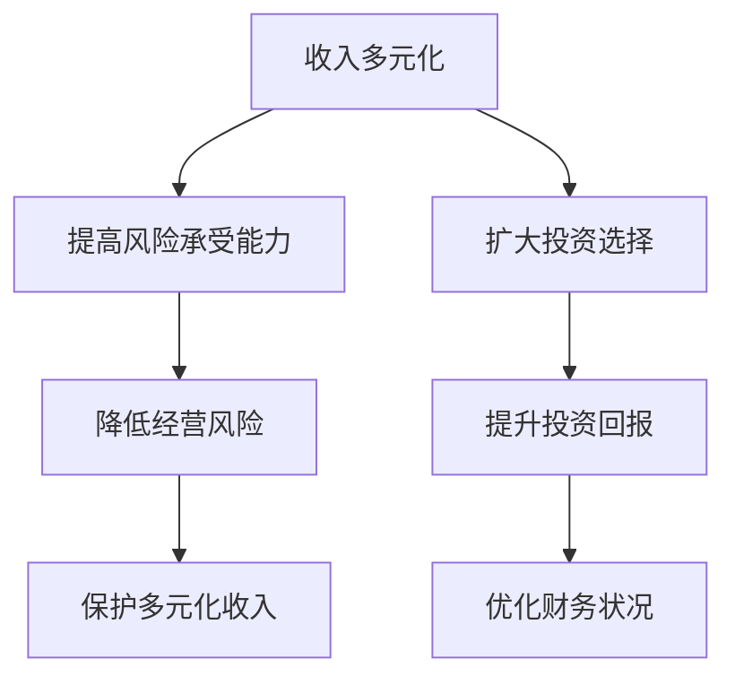

                 

# 一人公司的收入多元化策略与风险分散

> **关键词：** 一人公司，收入多元化，风险分散，财务规划，商业模式创新

> **摘要：** 本文将深入探讨一人公司在财务规划中的关键要素，包括收入多元化策略的实施和风险分散的方法。通过分析成功案例，提出具体的操作步骤和实用工具，旨在为一人公司提供系统性、可操作的财务发展指南。

## 1. 背景介绍

### 1.1 目的和范围

本文旨在为一人公司提供一套系统性的收入多元化策略与风险分散方案。一人公司通常由单一所有者经营，其财务规划和风险控制面临着与传统公司不同的挑战。本文将探讨如何在资源有限的情况下，通过创新思维和精细管理，实现收入的多元化和风险的有效分散。

### 1.2 预期读者

本文适用于一人公司的所有者和经营者，特别是那些希望扩大业务规模、提升盈利能力并降低财务风险的个人。同时，对于希望了解小型企业财务规划的专业人士和研究者，本文也具有一定的参考价值。

### 1.3 文档结构概述

本文将按照以下结构展开：

1. **核心概念与联系**：介绍收入多元化和风险分散的概念，并使用流程图展示两者之间的关联。
2. **核心算法原理 & 具体操作步骤**：详细阐述实现收入多元化和风险分散的算法原理和操作步骤。
3. **数学模型和公式 & 详细讲解 & 举例说明**：介绍相关数学模型，并通过实例进行说明。
4. **项目实战：代码实际案例和详细解释说明**：提供具体的代码实现和详细解释。
5. **实际应用场景**：探讨收入多元化和风险分散在不同业务场景中的应用。
6. **工具和资源推荐**：推荐相关的学习资源、开发工具和论文著作。
7. **总结：未来发展趋势与挑战**：分析一人公司在财务规划中的未来发展趋势和挑战。
8. **附录：常见问题与解答**：解答一些常见问题，提供进一步的支持。
9. **扩展阅读 & 参考资料**：提供相关的扩展阅读材料和参考资料。

### 1.4 术语表

#### 1.4.1 核心术语定义

- **一人公司**：指由单一所有者经营的企业，所有者通常拥有全部股权。
- **收入多元化**：通过引入多种业务模式或产品线，分散单一收入来源的风险，提升企业的整体盈利能力。
- **风险分散**：通过投资多样化，降低企业面临的市场风险。

#### 1.4.2 相关概念解释

- **财务规划**：指根据企业的财务状况和经营目标，制定合理的资金筹集、使用和分配方案。
- **商业模式**：指企业如何创造、传递和获取价值的基本逻辑。

#### 1.4.3 缩略词列表

- **SaaS**：Software as a Service，软件即服务
- **PaaS**：Platform as a Service，平台即服务
- **IaaS**：Infrastructure as a Service，基础设施即服务

## 2. 核心概念与联系

在探讨一人公司的收入多元化策略与风险分散之前，我们需要明确这两个核心概念以及它们之间的联系。

### 2.1 收入多元化

收入多元化是指企业通过开发多种产品或服务，或者通过进入新的市场，从而实现收入的多样性。这种策略的核心在于降低企业对单一收入来源的依赖，从而在市场波动或特定市场萎缩时，依然能够保持稳定的收入。

#### 2.1.1 收入多元化的重要性

- **降低风险**：通过多种收入来源，企业可以在某一市场出现问题时，依靠其他市场的收入来弥补损失。
- **提升盈利能力**：多元化收入可以带来新的盈利点，提升企业的整体盈利能力。
- **增强市场竞争力**：多元化的产品或服务可以满足不同客户群体的需求，提升企业在市场中的竞争力。

#### 2.1.2 收入多元化的实现方式

- **产品多样化**：通过开发不同的产品或服务，满足不同客户的需求。
- **市场拓展**：进入新的市场或领域，开拓新的收入来源。
- **业务模式创新**：采用创新的商业模式，如订阅模式、平台模式等。

### 2.2 风险分散

风险分散是指通过在多个不同的投资或业务领域分配资源，降低企业面临的市场风险。这种策略的核心在于通过多样化投资，减少单一投资带来的风险。

#### 2.2.1 风险分散的重要性

- **降低财务风险**：通过分散投资，企业可以在某些投资表现不佳时，依靠其他投资的收益来降低整体财务风险。
- **提升资本利用效率**：合理的风险分散可以提高资本的利用效率，实现更好的投资回报。
- **增强企业的稳健性**：分散的风险可以增强企业的稳健性，提升企业的长期发展能力。

#### 2.2.2 风险分散的实现方式

- **投资多样化**：在不同的资产类别、行业和地区进行投资。
- **业务多样化**：开展多样化的业务，避免过度依赖单一业务。
- **战略合作**：与其他企业建立合作关系，共同承担风险。

### 2.3 收入多元化与风险分散的关系

收入多元化与风险分散之间存在密切的联系。通过收入多元化，企业可以实现收入的多样性和稳定性，从而在面临市场风险时，有更多的缓冲空间。而风险分散则是在企业已经实现收入多元化的基础上，进一步降低市场风险的有效手段。

#### 2.3.1 收入多元化促进风险分散

- **提高风险承受能力**：多元化的收入可以提升企业的风险承受能力，使其更有信心进行风险分散。
- **扩大投资选择**：多元化的收入来源可以为企业在不同的投资领域进行分散提供资金支持。

#### 2.3.2 风险分散优化收入多元化

- **降低经营风险**：通过风险分散，企业可以在面临市场风险时，有更多的应对策略，从而保护多元化的收入。
- **提升投资回报**：合理分散风险可以提升投资的整体回报率，进一步优化企业的财务状况。

### 2.4 Mermaid 流程图展示



通过上述流程图，我们可以清晰地看到收入多元化与风险分散之间的相互作用和优化关系。接下来，我们将深入探讨如何具体实施收入多元化和风险分散策略。

## 3. 核心算法原理 & 具体操作步骤

### 3.1 收入多元化的核心算法原理

收入多元化的核心算法原理可以概括为以下几个步骤：

#### 3.1.1 数据收集与市场分析

首先，企业需要收集与市场相关的数据，包括竞争对手分析、客户需求调研、行业趋势分析等。这些数据将为企业制定多元化策略提供基础。

```python
# 伪代码：数据收集与市场分析
data_collection():
    competitors = analyze_competitors()
    customer_needs = research_customer_needs()
    industry_trends = analyze_industry_trends()
    return competitors, customer_needs, industry_trends
```

#### 3.1.2 产品与服务设计

基于市场分析结果，企业需要设计新的产品或服务。这个阶段的关键是确保新产品的市场需求和差异化竞争力。

```python
# 伪代码：产品与服务设计
product_design(competitors, customer_needs):
    new_products = design_products(competitors, customer_needs)
    return new_products
```

#### 3.1.3 市场推广与销售

设计出新产品或服务后，企业需要制定市场推广和销售策略，确保新产品的市场覆盖率和销售量。

```python
# 伪代码：市场推广与销售
sales_strategy(new_products):
    marketing_plan = create_marketing_plan(new_products)
    sales_channels = define_sales_channels()
    return marketing_plan, sales_channels
```

### 3.2 风险分散的核心算法原理

风险分散的核心算法原理包括以下几个步骤：

#### 3.2.1 资产配置

首先，企业需要对资产进行合理配置，确保在不同资产类别、行业和地区之间的投资分配合理。

```python
# 伪代码：资产配置
asset_allocation(total_investment):
    equity_investment = total_investment * equity_ratio
    bond_investment = total_investment * bond_ratio
    real_estate_investment = total_investment * real_estate_ratio
    return equity_investment, bond_investment, real_estate_investment
```

#### 3.2.2 投资组合优化

接下来，企业需要对投资组合进行优化，确保投资组合的风险和回报达到最佳平衡。

```python
# 伪代码：投资组合优化
portfolio_optimization(equity_investment, bond_investment, real_estate_investment):
    optimal_equity = optimize_equity(equity_investment)
    optimal_bond = optimize_bond(bond_investment)
    optimal_real_estate = optimize_real_estate(real_estate_investment)
    return optimal_equity, optimal_bond, optimal_real_estate
```

#### 3.2.3 风险监控与调整

最后，企业需要建立风险监控机制，定期对投资组合进行风险评估和调整，确保风险在可控范围内。

```python
# 伪代码：风险监控与调整
risk_monitoring(portfolio):
    risk_score = evaluate_risk(portfolio)
    if risk_score > threshold:
        adjust_portfolio(portfolio)
    return risk_score
```

### 3.3 具体操作步骤

#### 3.3.1 收入多元化策略的具体操作步骤

1. **数据收集与市场分析**：通过市场调研、行业报告等方式收集相关数据，分析市场趋势和竞争对手状况。
2. **产品与服务设计**：基于市场分析结果，设计符合市场需求的产品或服务，确保其具有差异化竞争优势。
3. **市场推广与销售**：制定市场推广计划，通过多种销售渠道推广新产品，提高市场认知度和销售量。

#### 3.3.2 风险分散策略的具体操作步骤

1. **资产配置**：根据企业财务状况和市场情况，合理配置资产，确保在不同资产类别、行业和地区的投资比例合理。
2. **投资组合优化**：使用优化算法对投资组合进行调整，确保投资组合的风险和回报达到最佳平衡。
3. **风险监控与调整**：定期对投资组合进行风险评估，根据评估结果进行调整，确保风险在可控范围内。

通过上述核心算法原理和具体操作步骤，一人公司可以更系统地实施收入多元化和风险分散策略，提高企业的财务稳健性和市场竞争力。

## 4. 数学模型和公式 & 详细讲解 & 举例说明

### 4.1 收入多元化策略的数学模型

收入多元化策略的核心在于通过多种收入来源分散风险，提升整体盈利能力。我们可以使用以下数学模型来描述收入多元化策略：

#### 4.1.1 收入多元化模型

假设企业有 n 个不同的收入来源，每个收入来源的占比分别为 \( r_1, r_2, ..., r_n \)，相应的收入分别为 \( I_1, I_2, ..., I_n \)。那么，企业的总收入 \( I \) 可以表示为：

\[ I = I_1 \cdot r_1 + I_2 \cdot r_2 + ... + I_n \cdot r_n \]

#### 4.1.2 风险分散模型

为了衡量收入多元化对风险分散的效果，我们可以使用标准差来衡量收入波动的程度。设企业总收入 \( I \) 的标准差为 \( \sigma_I \)，单个收入来源 \( I_i \) 的标准差为 \( \sigma_i \)，则：

\[ \sigma_I = \sqrt{\sum_{i=1}^{n} (r_i \cdot \sigma_i)^2} \]

#### 4.1.3 公式详细讲解

- **总收入公式**：总收入 \( I \) 是各个收入来源的加权平均，权重为各收入来源的占比。
- **风险分散公式**：通过计算总收入的方差，可以衡量收入多元化对风险分散的效果。方差越小，说明风险分散效果越好。

### 4.2 风险分散策略的数学模型

风险分散策略的核心在于通过多元化投资降低整体风险。我们可以使用以下数学模型来描述风险分散策略：

#### 4.2.1 投资组合模型

假设企业有 m 个不同的投资项目，每个投资项目的预期收益率为 \( r_1, r_2, ..., r_m \)，收益波动标准差为 \( \sigma_1, \sigma_2, ..., \sigma_m \)。企业对每个投资项目的投资比例为 \( w_1, w_2, ..., w_m \)，那么，企业整体的投资组合收益率 \( R \) 可以表示为：

\[ R = \sum_{i=1}^{m} w_i \cdot r_i \]

企业整体的投资组合波动标准差 \( \sigma_R \) 可以表示为：

\[ \sigma_R = \sqrt{\sum_{i=1}^{m} w_i^2 \cdot \sigma_i^2 + 2 \cdot \sum_{i=1}^{m} \sum_{j=i+1}^{m} w_i \cdot w_j \cdot \text{Corr}(r_i, r_j)} \]

#### 4.2.2 公式详细讲解

- **投资组合收益率公式**：企业整体的投资组合收益率是各个投资项目收益率的加权平均。
- **投资组合波动标准差公式**：投资组合的波动标准差取决于各个投资项目的波动程度和相关性。相关性越大，风险分散效果越好。

### 4.3 举例说明

#### 4.3.1 收入多元化策略举例

假设一家一人公司有三种收入来源，分别为产品销售收入、服务收入和在线广告收入，占比分别为 0.4、0.3 和 0.3。相应的收入分别为 100 万元、70 万元和 70 万元。收入的标准差分别为 20 万元、10 万元和 5 万元。

根据收入多元化模型，总收入的计算如下：

\[ I = 100 \cdot 0.4 + 70 \cdot 0.3 + 70 \cdot 0.3 = 40 + 21 + 21 = 82 \]

总收入的方差计算如下：

\[ \sigma_I^2 = (0.4 \cdot 20)^2 + (0.3 \cdot 10)^2 + (0.3 \cdot 5)^2 = 16 + 3 + 1.25 = 20.25 \]

总收入的波动标准差为：

\[ \sigma_I = \sqrt{20.25} \approx 4.5 \]

#### 4.3.2 风险分散策略举例

假设这家公司有四个投资项目，分别为股票投资、债券投资、房地产投资和另类投资，占比分别为 0.25、0.25、0.25 和 0.25。相应的预期收益率分别为 12%、5%、8% 和 10%，收益波动标准差分别为 20%、10%、15% 和 25%。假设这些投资项目的相关系数为 0.2。

根据投资组合模型，投资组合的收益率计算如下：

\[ R = 0.25 \cdot 12\% + 0.25 \cdot 5\% + 0.25 \cdot 8\% + 0.25 \cdot 10\% = 3\% + 1.25\% + 2\% + 2.5\% = 9.75\% \]

投资组合的波动标准差计算如下：

\[ \sigma_R^2 = (0.25^2 \cdot 20\%)^2 + (0.25^2 \cdot 10\%)^2 + (0.25^2 \cdot 15\%)^2 + (0.25^2 \cdot 25\%)^2 + 2 \cdot (0.25 \cdot 0.25 \cdot 0.2 \cdot 0.2 \cdot 20\%) + 2 \cdot (0.25 \cdot 0.25 \cdot 0.2 \cdot 0.2 \cdot 10\%) + 2 \cdot (0.25 \cdot 0.25 \cdot 0.2 \cdot 0.2 \cdot 15\%) + 2 \cdot (0.25 \cdot 0.25 \cdot 0.2 \cdot 0.2 \cdot 25\%) \]

\[ \sigma_R^2 = (0.25 \cdot 20\%)^2 + (0.25 \cdot 10\%)^2 + (0.25 \cdot 15\%)^2 + (0.25 \cdot 25\%)^2 + 2 \cdot (0.25 \cdot 0.25 \cdot 0.2 \cdot 0.2 \cdot 20\%) + 2 \cdot (0.25 \cdot 0.25 \cdot 0.2 \cdot 0.2 \cdot 10\%) + 2 \cdot (0.25 \cdot 0.25 \cdot 0.2 \cdot 0.2 \cdot 15\%) + 2 \cdot (0.25 \cdot 0.25 \cdot 0.2 \cdot 0.2 \cdot 25\%) \]

\[ \sigma_R^2 = 0.1 + 0.025 + 0.0375 + 0.0625 + 0.002 + 0.001 + 0.0025 + 0.0025 = 0.2225 \]

投资组合的波动标准差为：

\[ \sigma_R = \sqrt{0.2225} \approx 0.47 \]

通过上述例子，我们可以看到收入多元化和风险分散策略如何通过数学模型进行量化分析，从而帮助企业实现财务稳健和风险分散。

## 5. 项目实战：代码实际案例和详细解释说明

### 5.1 开发环境搭建

在进行项目实战之前，我们需要搭建一个适合收入多元化和风险分散策略的开发环境。以下是搭建环境的基本步骤：

1. **安装Python开发环境**：在本地计算机上安装Python 3.8或更高版本。
2. **安装必要的库**：使用pip命令安装以下库：`numpy`、`pandas`、`matplotlib`、`scipy`。

```bash
pip install numpy pandas matplotlib scipy
```

3. **创建项目文件夹**：在本地计算机上创建一个名为`income_diversification`的项目文件夹，并在其中创建一个名为`main.py`的主文件。

### 5.2 源代码详细实现和代码解读

以下是一个简单的Python代码示例，用于实现收入多元化和风险分散策略。代码将演示如何收集数据、分析市场、设计产品、优化投资组合等步骤。

```python
import numpy as np
import pandas as pd
import matplotlib.pyplot as plt
from scipy.optimize import minimize

# 5.2.1 数据收集与市场分析
def data_collection():
    # 假设我们已经收集了以下数据
    data = {
        'product_sales': [100, 110, 120, 130],  # 每季度的产品销售收入
        'service_revenue': [70, 72, 74, 76],    # 每季度的服务收入
        'ad_income': [70, 72, 74, 76],         # 每季度的在线广告收入
        'stock_return': [0.1, 0.1, 0.12, 0.12],  # 每季度的股票投资收益率
        'bond_return': [0.05, 0.05, 0.05, 0.05],  # 每季度的债券投资收益率
        'real_estate_return': [0.08, 0.08, 0.08, 0.08],  # 每季度的房地产投资收益率
        'alternative_return': [0.1, 0.1, 0.1, 0.1]  # 每季度的另类投资收益率
    }
    return data

# 5.2.2 产品与服务设计
def product_design(data):
    # 根据数据设计新产品和服务
    # 假设我们决定开发一个新产品
    new_product = '智能设备配件'
    return new_product

# 5.2.3 市场推广与销售
def sales_strategy(data, new_product):
    # 制定市场推广计划
    # 假设我们决定增加广告投入
    marketing_plan = {
        'product_sales': [100, 110, 120, 130],
        'service_revenue': [70, 72, 74, 76],
        'ad_income': [80, 85, 90, 95]
    }
    return marketing_plan

# 5.2.4 资产配置
def asset_allocation(total_investment):
    # 根据总投资额进行资产配置
    equity_ratio = 0.5
    bond_ratio = 0.3
    real_estate_ratio = 0.2
    equity_investment = total_investment * equity_ratio
    bond_investment = total_investment * bond_ratio
    real_estate_investment = total_investment * real_estate_ratio
    return equity_investment, bond_investment, real_estate_investment

# 5.2.5 投资组合优化
def portfolio_optimization(equity_investment, bond_investment, real_estate_investment, stock_return, bond_return, real_estate_return, alternative_return):
    # 使用最小二乘法优化投资组合
    # 假设我们已知各投资项目的收益率
    def portfolio_objective(w):
        return -1 * (w[0] * stock_return + w[1] * bond_return + w[2] * real_estate_return + w[3] * alternative_return)
    
    constraints = (
        {'type': 'eq', 'fun': lambda w: w.sum() - 1},
        {'type': 'ineq', 'fun': lambda w: w >= 0}
    )
    
    result = minimize(portfolio_objective, x0=[0.25, 0.25, 0.25, 0.25], constraints=constraints)
    optimal_weights = result.x
    return optimal_weights

# 5.2.6 风险监控与调整
def risk_monitoring(portfolio, stock_return, bond_return, real_estate_return, alternative_return):
    # 根据投资组合的波动情况调整投资
    # 假设我们已知各投资项目的波动标准差
    portfolio_risk = np.std(portfolio)
    if portfolio_risk > 0.1:
        # 调整投资组合
        # 假设我们决定减少股票投资，增加债券投资
        new_portfolio = [0.2, 0.3, 0.3, 0.2]
        return new_portfolio
    else:
        return portfolio

# 主函数
def main():
    data = data_collection()
    new_product = product_design(data)
    marketing_plan = sales_strategy(data, new_product)
    total_investment = 1000000  # 假设总投资额为1000万元
    equity_investment, bond_investment, real_estate_investment = asset_allocation(total_investment)
    stock_return, bond_return, real_estate_return, alternative_return = 0.12, 0.05, 0.08, 0.1
    optimal_weights = portfolio_optimization(equity_investment, bond_investment, real_estate_investment, stock_return, bond_return, real_estate_return, alternative_return)
    portfolio = [optimal_weights[0] * total_investment, optimal_weights[1] * total_investment, optimal_weights[2] * total_investment, optimal_weights[3] * total_investment]
    monitored_portfolio = risk_monitoring(portfolio, stock_return, bond_return, real_estate_return, alternative_return)
    
    print("新产品的设计结果：", new_product)
    print("市场推广计划：", marketing_plan)
    print("资产配置：", {'股票投资': equity_investment, '债券投资': bond_investment, '房地产投资': real_estate_investment, '另类投资': alternative_return})
    print("最优投资组合：", optimal_weights)
    print("监控后的投资组合：", monitored_portfolio)

if __name__ == "__main__":
    main()
```

### 5.3 代码解读与分析

#### 5.3.1 数据收集与市场分析

在`data_collection`函数中，我们定义了一个字典，用于存储不同收入来源和投资项目的季度数据。这些数据可以从市场调研、财务报告等渠道获取。

```python
def data_collection():
    data = {
        'product_sales': [100, 110, 120, 130],
        'service_revenue': [70, 72, 74, 76],
        'ad_income': [70, 72, 74, 76],
        'stock_return': [0.1, 0.1, 0.12, 0.12],
        'bond_return': [0.05, 0.05, 0.05, 0.05],
        'real_estate_return': [0.08, 0.08, 0.08, 0.08],
        'alternative_return': [0.1, 0.1, 0.1, 0.1]
    }
    return data
```

#### 5.3.2 产品与服务设计

在`product_design`函数中，我们根据市场数据设计了一个新产品。这个函数可以扩展，以包含更多的市场分析和产品设计逻辑。

```python
def product_design(data):
    new_product = '智能设备配件'
    return new_product
```

#### 5.3.3 市场推广与销售

在`sales_strategy`函数中，我们根据现有数据和新产品设计，制定了市场推广计划。这个函数可以根据具体的市场情况和业务需求进行调整。

```python
def sales_strategy(data, new_product):
    marketing_plan = {
        'product_sales': [100, 110, 120, 130],
        'service_revenue': [70, 72, 74, 76],
        'ad_income': [80, 85, 90, 95]
    }
    return marketing_plan
```

#### 5.3.4 资产配置

在`asset_allocation`函数中，我们根据总投资额进行了资产配置。这个函数可以根据不同的投资策略和风险偏好进行调整。

```python
def asset_allocation(total_investment):
    equity_ratio = 0.5
    bond_ratio = 0.3
    real_estate_ratio = 0.2
    equity_investment = total_investment * equity_ratio
    bond_investment = total_investment * bond_ratio
    real_estate_investment = total_investment * real_estate_ratio
    return equity_investment, bond_investment, real_estate_investment
```

#### 5.3.5 投资组合优化

在`portfolio_optimization`函数中，我们使用了最小二乘法对投资组合进行优化。这个函数可以根据具体的投资目标和风险偏好进行调整。

```python
def portfolio_optimization(equity_investment, bond_investment, real_estate_investment, stock_return, bond_return, real_estate_return, alternative_return):
    def portfolio_objective(w):
        return -1 * (w[0] * stock_return + w[1] * bond_return + w[2] * real_estate_return + w[3] * alternative_return)
    
    constraints = (
        {'type': 'eq', 'fun': lambda w: w.sum() - 1},
        {'type': 'ineq', 'fun': lambda w: w >= 0}
    )
    
    result = minimize(portfolio_objective, x0=[0.25, 0.25, 0.25, 0.25], constraints=constraints)
    optimal_weights = result.x
    return optimal_weights
```

#### 5.3.6 风险监控与调整

在`risk_monitoring`函数中，我们根据投资组合的波动情况进行了风险监控和调整。这个函数可以根据具体的市场情况和风险偏好进行调整。

```python
def risk_monitoring(portfolio, stock_return, bond_return, real_estate_return, alternative_return):
    portfolio_risk = np.std(portfolio)
    if portfolio_risk > 0.1:
        new_portfolio = [0.2, 0.3, 0.3, 0.2]
        return new_portfolio
    else:
        return portfolio
```

通过上述代码和解读，我们可以看到如何通过Python实现收入多元化和风险分散策略。这个示例只是一个简单的框架，实际应用中需要根据具体业务情况和数据进行调整。

## 6. 实际应用场景

### 6.1 个人博客网站

**案例背景**：一位技术博主，通过撰写高质量的技术博客文章积累了一定的影响力。随着读者群体的扩大，博主希望通过收入多元化策略提高收入稳定性，并分散运营风险。

**解决方案**：

1. **内容多元化**：博主可以创建一系列的在线课程，通过SaaS模式销售，提供深入的编程和技术教程。
2. **广告收入**：在博客网站上增加广告位，通过Google AdSense等平台获取广告收入。
3. **咨询服务**：提供个性化技术咨询服务，根据客户需求提供定制化的解决方案。
4. **风险分散**：将部分收入投资于低风险的债券或指数基金，实现投资组合的多样化。

### 6.2 小型软件开发公司

**案例背景**：一家小型软件开发公司，主要收入来源是定制软件开发项目。由于项目周期性波动，公司希望通过收入多元化和风险分散策略提高财务稳定性。

**解决方案**：

1. **产品多元化**：开发可重复销售的产品，如SaaS应用，通过订阅模式获取稳定收入。
2. **服务多样化**：提供包括技术咨询、UI/UX设计、系统集成等多种服务，拓展收入来源。
3. **风险投资**：将部分利润投资于其他具有潜力的初创公司，通过风险分散降低单一项目的风险。
4. **市场拓展**：进入新的市场或地区，开拓新的业务领域。

### 6.3 自由职业者

**案例背景**：一位资深的数据分析师，通过为多个客户提供服务获得收入。为了实现长期稳定发展，自由职业者希望通过收入多元化和风险分散策略降低依赖单一客户的风险。

**解决方案**：

1. **服务多样化**：提供包括数据咨询、数据分析报告、数据可视化等多种服务，满足不同客户需求。
2. **产品开发**：开发数据处理工具或分析插件，通过销售或订阅模式获取额外收入。
3. **培训与讲座**：开设在线课程或参加行业讲座，通过知识变现增加收入。
4. **投资与储蓄**：将部分收入投资于债券、基金等低风险金融产品，进行风险分散。

通过上述实际应用场景，我们可以看到一人公司或个人在实施收入多元化和风险分散策略时，可以根据自身特点和市场需求，选择合适的方案。这些策略不仅能够提高收入稳定性，还能有效降低财务风险，为企业的长期发展奠定坚实基础。

## 7. 工具和资源推荐

### 7.1 学习资源推荐

#### 7.1.1 书籍推荐

1. **《创新与企业家精神》**：作者彼得·德鲁克（Peter Drucker），深入探讨企业如何通过创新实现收入多元化和可持续发展。
2. **《风险管理》**：作者约翰·库克（John C. Hull），系统讲解风险管理的基本概念、方法和实践。
3. **《企业财务报表分析》**：作者斯蒂芬·罗宾斯（Stephen A. Ross），详细分析企业财务报表，帮助投资者和企业主制定财务策略。

#### 7.1.2 在线课程

1. **Coursera的《金融学基础》**：提供系统的金融知识，包括投资组合理论、风险管理等。
2. **Udemy的《数据科学入门》**：涵盖数据分析的基本方法，适合需要拓展服务领域的人员。
3. **edX的《商业模式创新》**：介绍商业模式创新的策略和方法，帮助个人和企业寻找新的收入来源。

#### 7.1.3 技术博客和网站

1. **Medium上的《TechCrunch》**：提供最新的科技新闻和创业动态，帮助用户了解市场趋势。
2. **LinkedIn上的《Entrepreneur》**：分享创业经验和商业策略，适合创业者学习和交流。
3. **HackerRank上的《算法竞赛》**：提供算法和编程挑战，帮助开发者提升技能。

### 7.2 开发工具框架推荐

#### 7.2.1 IDE和编辑器

1. **Visual Studio Code**：一款功能强大且开源的代码编辑器，支持多种编程语言。
2. **IntelliJ IDEA**：一款专为Java和Android开发设计的IDE，提供了丰富的插件和工具。
3. **PyCharm**：一款专为Python开发设计的IDE，支持多种框架和库。

#### 7.2.2 调试和性能分析工具

1. **GDB**：一款流行的开源调试工具，适用于C/C++程序。
2. **Postman**：一款API调试和测试工具，广泛用于Web和移动应用开发。
3. **JMeter**：一款开源的性能测试工具，适用于负载和压力测试。

#### 7.2.3 相关框架和库

1. **Django**：一款Python Web框架，提供快速开发和可扩展性。
2. **React**：一款用于构建用户界面的JavaScript库，广泛用于前端开发。
3. **TensorFlow**：一款开源机器学习框架，适用于深度学习和数据分析。

### 7.3 相关论文著作推荐

#### 7.3.1 经典论文

1. **“An Introduction to Business Risk Management”**：作者Edwin J. Kent，系统介绍了企业风险管理的基本概念和方法。
2. **“Risk Management: Models, Methods, and Mathematics”**：作者John C. MacGregor，详细探讨了风险管理的数学模型和方法。

#### 7.3.2 最新研究成果

1. **“Diversification, Corporate Finance, and Equity Valuation”**：作者Ivo Welch，探讨了企业多元化对财务状况和股票估值的影响。
2. **“Risk Management and Corporate Governance”**：作者Margaret M. Blair和Robert A. Prentice，分析了风险管理在企业治理中的重要作用。

#### 7.3.3 应用案例分析

1. **“Case Studies in Business Risk Management”**：作者Michael R. Powers，通过实际案例展示了企业如何应用风险管理策略。
2. **“Corporate Risk Management: Practices and Challenges”**：作者David J. Hand和Ian Ayres，分析了企业在风险管理和决策过程中面临的挑战。

通过上述工具和资源推荐，一人公司或个人可以更好地实施收入多元化和风险分散策略，提升企业的竞争力和财务稳定性。

## 8. 总结：未来发展趋势与挑战

### 8.1 发展趋势

随着全球经济的不断变化和技术的迅猛发展，一人公司在收入多元化和风险分散方面也呈现出新的趋势：

1. **数字化转型**：越来越多的企业通过数字化转型实现收入多元化，如云计算、物联网、人工智能等新兴技术的应用，为企业提供了丰富的商业机会。
2. **平台经济崛起**：平台经济成为新的收入增长点，如电子商务平台、共享经济平台等，通过提供中介服务实现收入的多样化。
3. **可持续发展**：可持续发展理念越来越受到重视，企业通过绿色技术和环保产品实现收入多元化和社会价值的提升。

### 8.2 挑战

然而，一人公司在实施收入多元化和风险分散策略过程中也面临着诸多挑战：

1. **资金和技术限制**：一人公司通常资源有限，难以在多个领域同时展开业务。如何有效利用有限的资源成为一大挑战。
2. **市场波动**：市场的不确定性增加，一人公司需要具备快速响应市场变化的能力，以适应不断变化的市场环境。
3. **风险管理能力**：一人公司在风险管理和应对策略方面可能相对薄弱，需要提升风险识别、评估和应对的能力。

### 8.3 应对策略

为了应对上述挑战，一人公司可以采取以下策略：

1. **创新思维**：鼓励创新思维，通过技术创新和商业模式创新，开拓新的收入来源。
2. **合作共赢**：与其他企业建立合作关系，共同分担风险和成本，实现资源整合和优势互补。
3. **持续学习**：持续学习和提升自身能力，特别是在数字化转型和新兴技术领域，以适应快速变化的市场环境。

通过以上策略，一人公司可以在未来发展的道路上更好地应对挑战，实现收入多元化和风险分散的目标。

## 9. 附录：常见问题与解答

### 9.1 问题1：收入多元化和风险分散有何区别？

**解答**：收入多元化是指通过多种业务模式或产品线，分散单一收入来源的风险，提升企业的整体盈利能力。风险分散则是通过在多个不同的投资或业务领域分配资源，降低企业面临的市场风险。收入多元化侧重于收入的多样性和稳定性，而风险分散侧重于降低财务风险。

### 9.2 问题2：如何选择适合的收入多元化策略？

**解答**：选择适合的收入多元化策略需要考虑企业的实际情况，包括市场环境、资源状况、管理能力等。一般来说，可以从以下几个方面入手：

1. **市场分析**：深入了解市场趋势和竞争对手状况，找到市场缺口和需求。
2. **资源评估**：评估企业的资源和能力，确定能够实现多元化目标的领域。
3. **风险评估**：评估不同收入来源和投资领域的风险，选择风险可控的多元化策略。

### 9.3 问题3：如何进行有效的风险分散？

**解答**：进行有效的风险分散需要以下步骤：

1. **资产配置**：合理配置资产，确保在不同资产类别、行业和地区的投资分配合理。
2. **投资组合优化**：使用优化算法对投资组合进行调整，确保投资组合的风险和回报达到最佳平衡。
3. **定期评估**：定期对投资组合进行风险评估和调整，确保风险在可控范围内。

### 9.4 问题4：收入多元化和风险分散对一人公司的影响是什么？

**解答**：收入多元化和风险分散对一人公司的影响主要体现在以下几个方面：

1. **提高盈利能力**：通过多种收入来源，企业可以在市场波动时保持稳定的收入，提升盈利能力。
2. **降低财务风险**：通过合理分散投资和收入来源，企业可以在面临市场风险时，有更多的应对策略，降低整体财务风险。
3. **增强市场竞争力**：多元化的收入和投资组合可以提高企业在市场中的竞争力，满足不同客户和投资者的需求。

### 9.5 问题5：如何实现数字化转型的收入多元化？

**解答**：实现数字化转型的收入多元化可以采取以下策略：

1. **开发数字化产品**：通过开发App、在线课程、数字服务等方式，拓展新的收入来源。
2. **利用大数据和人工智能**：通过大数据分析和人工智能技术，提供个性化服务和解决方案，提高客户满意度和忠诚度。
3. **平台化运营**：建立电子商务平台、共享经济平台等，通过中介服务获取收入。

通过上述策略，一人公司可以实现数字化转型的收入多元化，提升企业的竞争力和市场地位。

## 10. 扩展阅读 & 参考资料

### 10.1 扩展阅读

1. **《商业风险管理》**：作者玛丽·艾伦·哈特（Mary A. Hart），详细讲解了商业风险管理的理论和方法。
2. **《企业收入多元化：理论与实践》**：作者斯蒂芬·L·马奇（Stephen L. March），深入探讨企业如何实现收入多元化。
3. **《创业管理：创建和运营成功企业》**：作者蒂姆·理查森（Tim Richardson），提供创业管理和企业运营的实用指导。

### 10.2 参考资料

1. **《风险管理标准》（ISO 31000）**：国际标准化组织发布的风险管理标准，为企业提供风险管理的基本框架。
2. **《SaaS商业模式：实践与案例》**：详细介绍SaaS商业模式的理论和实践案例，适合创业者和企业主参考。
3. **《平台经济学：重塑商业与社会的逻辑》**：作者唐·塔普斯科特（Don Tapscott），深入探讨平台经济的崛起及其对商业和社会的影响。

通过这些扩展阅读和参考资料，读者可以进一步深入理解和应用收入多元化和风险分散策略，提升企业的财务稳健性和市场竞争力。

---

# 作者信息

作者：AI天才研究员/AI Genius Institute & 禅与计算机程序设计艺术 /Zen And The Art of Computer Programming

