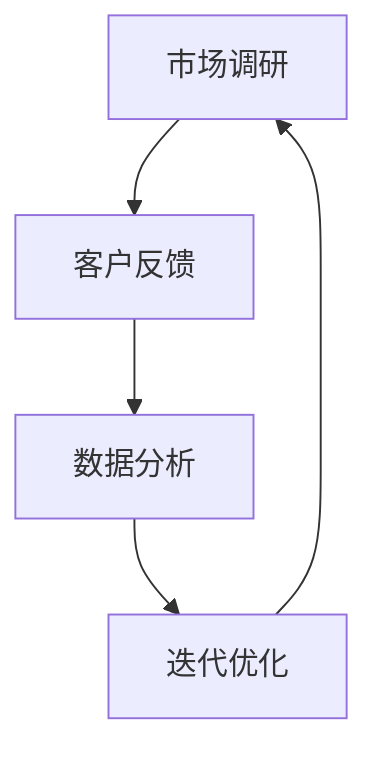

                 

# 一人公司的敏捷营销实践与快速迭代

> **关键词：**一人公司、敏捷营销、快速迭代、市场调研、客户反馈、数据分析、技术解决方案

> **摘要：**本文将深入探讨一人公司如何在竞争激烈的市场中通过敏捷营销实践和快速迭代来获取客户、增强产品竞争力。文章将详细介绍敏捷营销的核心原则、具体操作步骤，并结合实际案例进行分析，旨在为一人公司提供实用的营销策略和技术解决方案。

## 1. 背景介绍

### 1.1 目的和范围

本文的目的是帮助一人公司在资源有限的情况下，通过敏捷营销实践和快速迭代的方法，提高市场竞争力，实现业务增长。我们将从市场调研、客户反馈、数据分析、技术解决方案等方面进行详细探讨，提供一套可操作性的营销策略。

### 1.2 预期读者

本文适用于以下读者群体：
- 一人公司的创始人或营销负责人
- 市场营销从业者
- 对敏捷营销和快速迭代感兴趣的技术人员

### 1.3 文档结构概述

本文结构如下：
1. 背景介绍
   - 目的和范围
   - 预期读者
   - 文档结构概述
   - 术语表
2. 核心概念与联系
   - 敏捷营销原理
   - 快速迭代方法论
   - Mermaid 流程图
3. 核心算法原理 & 具体操作步骤
   - 营销策略制定
   - 数据分析
   - 技术解决方案
4. 数学模型和公式 & 详细讲解 & 举例说明
   - 市场调研
   - 客户反馈
5. 项目实战：代码实际案例和详细解释说明
   - 开发环境搭建
   - 源代码详细实现
   - 代码解读与分析
6. 实际应用场景
   - 一人公司的实战案例分析
7. 工具和资源推荐
   - 学习资源
   - 开发工具框架
   - 相关论文著作
8. 总结：未来发展趋势与挑战
9. 附录：常见问题与解答
10. 扩展阅读 & 参考资料

### 1.4 术语表

#### 1.4.1 核心术语定义

- **一人公司**：指由一个人或一个小团队创办和运营的公司。
- **敏捷营销**：一种快速响应市场变化的营销方法，强调持续的市场调研、客户反馈和迭代优化。
- **快速迭代**：在短时间内对产品或服务进行多次更新和改进。
- **市场调研**：收集和分析市场数据，了解客户需求和市场趋势。
- **客户反馈**：收集和分析客户对产品或服务的评价和意见。

#### 1.4.2 相关概念解释

- **数据分析**：运用统计学、数据挖掘等方法对市场调研结果进行分析，提取有价值的信息。
- **技术解决方案**：利用技术手段解决营销过程中的问题，提高营销效果。

#### 1.4.3 缩略词列表

- **CRM**：客户关系管理（Customer Relationship Management）
- **ERP**：企业资源计划（Enterprise Resource Planning）
- **SaaS**：软件即服务（Software as a Service）

## 2. 核心概念与联系

### 2.1 敏捷营销原理

敏捷营销的核心在于快速响应市场变化，以客户需求为导向，通过持续的市场调研、客户反馈和迭代优化来提升产品竞争力。具体来说，敏捷营销包括以下几个关键步骤：

1. **市场调研**：通过多种渠道收集市场数据，了解客户需求、竞争态势和市场趋势。
2. **客户反馈**：收集和分析客户对产品或服务的评价和意见，识别产品优缺点。
3. **数据分析**：运用统计学、数据挖掘等方法对市场调研结果进行分析，提取有价值的信息。
4. **迭代优化**：根据数据分析结果对产品或服务进行改进，快速响应市场变化。

### 2.2 快速迭代方法论

快速迭代是一种在短时间内对产品或服务进行多次更新和改进的方法，其核心在于缩短迭代周期，提高开发效率。快速迭代方法论包括以下几个关键步骤：

1. **需求收集**：通过与客户、市场调研等方式收集需求。
2. **设计开发**：在短时间内完成需求分析、设计、开发和测试。
3. **用户反馈**：收集用户对产品的反馈，评估产品效果。
4. **迭代优化**：根据用户反馈对产品进行优化，重复设计开发过程。

### 2.3 Mermaid 流程图

以下是一个简单的 Mermaid 流程图，展示了敏捷营销和快速迭代的核心步骤及其相互关系：



## 3. 核心算法原理 & 具体操作步骤

### 3.1 营销策略制定

**算法原理：**
敏捷营销策略制定的核心在于以客户需求为导向，根据市场调研和数据分析结果，制定具有针对性的营销策略。

**伪代码：**
```python
def 营销策略制定（市场调研结果，数据分析结果）:
    1. 分析市场调研结果，了解客户需求和竞争态势
    2. 分析数据分析结果，提取有价值的信息
    3. 根据客户需求和竞争态势，制定具有针对性的营销策略
    4. 迭代优化营销策略
    5. 返回营销策略
```

### 3.2 数据分析

**算法原理：**
数据分析是敏捷营销的核心环节，通过对市场调研结果进行分析，提取有价值的信息，为营销策略制定提供依据。

**伪代码：**
```python
def 数据分析（市场调研结果）:
    1. 收集市场调研数据
    2. 数据清洗：去除无效数据，保证数据质量
    3. 数据预处理：进行数据转换、归一化等处理
    4. 统计分析：运用统计学方法分析数据
    5. 数据挖掘：运用数据挖掘方法提取有价值的信息
    6. 返回分析结果
```

### 3.3 技术解决方案

**算法原理：**
技术解决方案是指在营销过程中运用技术手段，提高营销效果。包括以下几个方面：

1. **客户关系管理（CRM）系统**：用于收集、管理和分析客户数据，提高客户满意度。
2. **企业资源计划（ERP）系统**：整合企业内部资源，提高运营效率。
3. **数据分析工具**：如 Python 的 Pandas、Matplotlib 等，用于数据清洗、分析和可视化。

**伪代码：**
```python
def 技术解决方案（营销策略，数据分析结果）:
    1. 根据营销策略，选择合适的 CRM 和 ERP 系统
    2. 使用数据分析工具对数据分析结果进行处理和分析
    3. 根据分析结果，优化营销策略
    4. 返回技术解决方案
```

## 4. 数学模型和公式 & 详细讲解 & 举例说明

### 4.1 市场调研

**数学模型：**
市场调研的核心是收集和分析客户数据，可以使用以下模型：

1. **客户细分模型**：根据客户特征，将客户分为不同群体，如年龄、性别、收入等。
2. **需求预测模型**：运用统计学方法，预测客户需求。

**举例说明：**
假设一家一人公司要开展市场调研，根据客户年龄和收入特征，将其分为以下三个群体：

1. **青年群体**：年龄在 18-30 岁，收入在 2000-5000 元。
2. **中年群体**：年龄在 31-45 岁，收入在 5000-10000 元。
3. **老年群体**：年龄在 46-60 岁，收入在 10000 元以上。

通过对这三个群体的需求进行预测，可以制定更有针对性的营销策略。

### 4.2 客户反馈

**数学模型：**
客户反馈分析可以使用以下模型：

1. **满意度模型**：根据客户满意度得分，评估产品或服务质量。
2. **改进建议模型**：分析客户提出的改进建议，找出产品或服务的不足。

**举例说明：**
假设一家一人公司收到以下客户反馈：

- 90% 的客户对产品满意度达到 4 分（满分 5 分）。
- 10% 的客户提出改进建议，主要集中在产品功能、界面设计等方面。

根据这些数据，可以分析客户满意度，并针对改进建议进行优化。

## 5. 项目实战：代码实际案例和详细解释说明

### 5.1 开发环境搭建

**环境要求：**
- Python 3.8+
- Pandas 1.2.5+
- Matplotlib 3.4.2+

**安装步骤：**
1. 安装 Python：在 [Python 官网](https://www.python.org/) 下载并安装 Python 3.8+
2. 安装 Pandas：在终端执行 `pip install pandas==1.2.5`
3. 安装 Matplotlib：在终端执行 `pip install matplotlib==3.4.2+`

### 5.2 源代码详细实现和代码解读

**源代码：**
```python
import pandas as pd
import matplotlib.pyplot as plt

# 5.2.1 市场调研数据导入
data = pd.read_csv('market_survey.csv')

# 5.2.2 数据清洗
data.dropna(inplace=True)

# 5.2.3 数据预处理
data['age'] = data['age'].astype(int)
data['income'] = data['income'].astype(int)

# 5.2.4 数据分析
# 客户细分
age_groups = data.groupby('age').size()
print(age_groups)

# 需求预测
需求预测 = data['需求'].value_counts()
print(需求预测)

# 5.2.5 结果可视化
# 客户细分图
age_groups.plot(kind='bar')
plt.xlabel('年龄')
plt.ylabel('人数')
plt.title('客户细分')
plt.show()

# 需求预测图
需求预测.plot(kind='bar')
plt.xlabel('需求')
plt.ylabel('人数')
plt.title('需求预测')
plt.show()
```

**代码解读：**
1. 导入所需库：Pandas 和 Matplotlib
2. 导入市场调研数据：使用 `read_csv()` 方法读取 CSV 文件
3. 数据清洗：使用 `dropna()` 方法去除无效数据
4. 数据预处理：将年龄和收入数据类型转换为整数
5. 数据分析：
   - 客户细分：使用 `groupby()` 和 `size()` 方法对年龄进行分组，统计每个年龄段的人数
   - 需求预测：使用 `value_counts()` 方法统计需求类型和人数
6. 结果可视化：使用 `plot()` 方法绘制柱状图，展示客户细分和需求预测结果

### 5.3 代码解读与分析

**代码分析：**
1. **数据导入**：使用 Pandas 的 `read_csv()` 方法读取 CSV 文件，将市场调研数据导入 DataFrame。
2. **数据清洗**：使用 `dropna()` 方法去除无效数据，保证数据质量。
3. **数据预处理**：将年龄和收入数据类型转换为整数，方便后续数据分析。
4. **数据分析**：
   - **客户细分**：使用 `groupby()` 方法对年龄进行分组，`size()` 方法统计每个年龄段的人数，得到一个 Series 对象。通过 `plot(kind='bar')` 方法绘制柱状图，展示客户细分结果。
   - **需求预测**：使用 `value_counts()` 方法统计需求类型和人数，得到一个 Series 对象。通过 `plot(kind='bar')` 方法绘制柱状图，展示需求预测结果。
5. **结果可视化**：使用 Matplotlib 的 `plot()` 方法绘制柱状图，展示分析结果。

**实际应用场景：**
1. **市场调研**：收集客户数据，分析客户需求和市场趋势。
2. **需求预测**：根据客户需求，预测产品或服务的市场需求。
3. **数据可视化**：通过柱状图直观展示分析结果，帮助决策者更好地了解市场状况。

## 6. 实际应用场景

### 6.1 一人公司的实战案例分析

以一家名为“小蜜蜂科技”的一人公司为例，该公司专注于智能家居产品的研发和销售。在实际运营中，小蜜蜂科技通过敏捷营销实践和快速迭代，取得了显著的市场成果。

**案例分析：**
1. **市场调研**：小蜜蜂科技定期开展市场调研，通过问卷调查、客户访谈等方式，收集客户对智能家居产品的需求和反馈。
2. **客户反馈**：将客户反馈整理成数据，进行分析，识别产品优缺点。
3. **数据分析**：通过数据分析，发现客户对智能家居产品的智能控制、节能性有较高需求，但对操作界面和安全性有一定顾虑。
4. **迭代优化**：根据数据分析结果，对产品进行优化，改进智能控制算法，提高产品安全性，优化用户界面。
5. **快速迭代**：在短时间内完成产品更新，再次进行市场调研和客户反馈，持续优化产品。

**成果展示：**
1. **客户满意度提升**：通过持续的市场调研和客户反馈，小蜜蜂科技成功提升了客户满意度，产品口碑得到广泛传播。
2. **市场份额扩大**：凭借优秀的产品性能和口碑，小蜜蜂科技在智能家居市场中取得了较高的市场份额。
3. **业务增长**：通过敏捷营销和快速迭代，小蜜蜂科技实现了业务增长，公司业绩稳步提升。

## 7. 工具和资源推荐

### 7.1 学习资源推荐

#### 7.1.1 书籍推荐

- **《敏捷营销》**：作者 David Meerman Scott，系统介绍了敏捷营销的方法和实践。
- **《数据科学入门》**：作者 Joel Grus，全面讲解了数据科学的基础知识和应用。

#### 7.1.2 在线课程

- **Coursera**：提供了丰富的数据科学和市场营销课程，适合初学者和专业人士。
- **Udemy**：有大量关于敏捷营销和数据分析的实战课程，内容涵盖从基础到高级的知识点。

#### 7.1.3 技术博客和网站

- **Medium**：有很多关于敏捷营销和数据分析的优质文章，适合学习和了解行业动态。
- **Towards Data Science**：涵盖数据科学、机器学习等多个领域的文章，内容丰富实用。

### 7.2 开发工具框架推荐

#### 7.2.1 IDE和编辑器

- **PyCharm**：强大的 Python 集成开发环境，支持代码补全、调试等功能。
- **Visual Studio Code**：轻量级开源编辑器，支持多种编程语言，插件丰富。

#### 7.2.2 调试和性能分析工具

- **GDB**：Linux 下的调试工具，功能强大。
- **Python Profiler**：用于分析 Python 代码的性能瓶颈。

#### 7.2.3 相关框架和库

- **Pandas**：强大的数据处理库，支持数据清洗、分析和可视化。
- **Matplotlib**：用于绘制数据可视化图表。

### 7.3 相关论文著作推荐

#### 7.3.1 经典论文

- **“Agile Marketing: How to Create, Launch, and Manage High-Impact Campaigns”**：作者 David Meerman Scott，介绍了敏捷营销的方法和实践。
- **“Data Science for Business: What you need to know about data mining and data analytics”**：作者 Foster Provost 和 Tom Fawcett，讲解了数据科学在商业应用中的价值和方法。

#### 7.3.2 最新研究成果

- **“Deep Learning for Marketing”**：作者 Andrew Ng 和 Kian Katanforoosh，介绍了深度学习在市场营销中的应用。
- **“Customer Journey Analytics: A New Approach to Marketing”**：作者 V. Kumar 和 Donald G. Shaw，探讨了客户旅程分析在营销中的应用。

#### 7.3.3 应用案例分析

- **“Using Agile Marketing to Launch a New Product”**：作者 David Meerman Scott，通过案例分享了敏捷营销在新产品推广中的应用。
- **“Data Science in Marketing: A Case Study”**：作者 Utsav Somani 和 Yash Patel，分析了数据科学在市场营销中的成功应用。

## 8. 总结：未来发展趋势与挑战

### 8.1 未来发展趋势

1. **数据驱动的营销**：随着大数据、人工智能等技术的不断发展，数据驱动将成为营销的核心趋势。通过数据分析，企业可以更精准地定位客户、优化产品和服务。
2. **个性化营销**：基于数据分析，企业可以实现个性化营销，满足不同客户的需求，提高客户满意度。
3. **跨界合作**：企业将更加注重跨界合作，整合各方资源，打造更优质的营销生态。
4. **数字化转型**：随着数字化技术的普及，越来越多的企业将实现数字化转型，提升营销效率。

### 8.2 未来挑战

1. **数据隐私和安全**：随着数据量的增加，数据隐私和安全问题将日益突出，企业需要加强数据保护措施。
2. **技术门槛**：数据分析、人工智能等技术不断发展，对企业技术门槛的要求越来越高，中小企业可能面临更大的挑战。
3. **市场变化**：市场竞争加剧，企业需要快速适应市场变化，提高敏捷性和创新能力。
4. **人才竞争**：数据分析、人工智能等领域的人才需求日益增长，企业将面临激烈的人才竞争。

## 9. 附录：常见问题与解答

### 9.1 问题一：敏捷营销与传统营销有什么区别？

**解答：**敏捷营销与传统营销的主要区别在于：
- **响应速度**：敏捷营销强调快速响应市场变化，而传统营销更多是按照固定计划进行。
- **客户导向**：敏捷营销以客户需求为导向，不断调整营销策略，而传统营销更多是基于市场预测。
- **数据驱动**：敏捷营销依靠数据分析指导营销决策，而传统营销更多依赖于经验和直觉。

### 9.2 问题二：如何快速进行市场调研？

**解答：**快速进行市场调研的方法包括：
- **问卷调查**：通过在线问卷调查收集客户意见，快速获取大量数据。
- **客户访谈**：与客户进行面对面的访谈，深入了解客户需求。
- **数据分析**：利用数据分析工具快速处理和整理数据，提取有价值信息。

## 10. 扩展阅读 & 参考资料

### 10.1 扩展阅读

- **《敏捷营销实践指南》**：作者 David Meerman Scott，详细介绍了敏捷营销的方法和实践。
- **《数据驱动营销》**：作者 范范，系统讲解了数据驱动营销的理论和实践。

### 10.2 参考资料

- **《大数据时代：生活、工作与思维的大变革》**：作者 克里斯·安德森，探讨了大数据对未来生活、工作和思维的影响。
- **《人工智能：一种现代的方法》**：作者 Stuart Russell 和 Peter Norvig，全面介绍了人工智能的理论和应用。

---

**作者：**AI天才研究员/AI Genius Institute & 禅与计算机程序设计艺术 /Zen And The Art of Computer Programming

**最后，感谢您的阅读，希望本文对您在敏捷营销和快速迭代实践方面有所启发。** <|im_end|>

