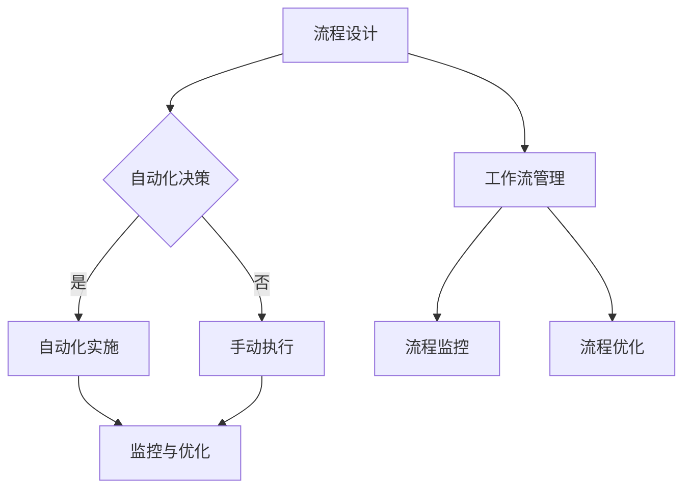

                 

# 一人公司的流程自动化：提高运营效率的工具和方法

> 关键词：流程自动化、一人公司、运营效率、工作流管理、技术工具、最佳实践

> 摘要：本文将深入探讨一人公司如何通过流程自动化来提高运营效率。我们将详细解析流程自动化的概念、应用场景、核心工具和方法，并通过实际案例展示如何将自动化引入到日常运营中，以实现高效的个人管理。读者将了解如何利用现代技术来简化复杂任务，减少重复劳动，从而将更多精力投入到核心业务和创新上。

## 1. 背景介绍

### 1.1 目的和范围

本文旨在为那些单打独斗的创业者或自由职业者提供实用的指导，帮助他们通过流程自动化提升工作效率。我们将覆盖以下内容：

- 流程自动化的基本概念和重要性。
- 一人公司面临的具体挑战。
- 可用的自动化工具和平台。
- 实施流程自动化的具体步骤。
- 实际案例分析和最佳实践。

### 1.2 预期读者

- 一人公司的创始人或自由职业者。
- 想要提升个人工作效率的技术从业人士。
- 对自动化技术感兴趣的IT专业人士。

### 1.3 文档结构概述

本文将按照以下结构展开：

1. 背景介绍
2. 核心概念与联系
3. 核心算法原理 & 具体操作步骤
4. 数学模型和公式 & 详细讲解 & 举例说明
5. 项目实战：代码实际案例和详细解释说明
6. 实际应用场景
7. 工具和资源推荐
8. 总结：未来发展趋势与挑战
9. 附录：常见问题与解答
10. 扩展阅读 & 参考资料

### 1.4 术语表

#### 1.4.1 核心术语定义

- **流程自动化**：通过软件工具将重复性任务自动化，减少人工干预。
- **工作流管理**：定义、执行、监控和优化业务流程的一套方法和工具。
- **一人公司**：仅由一个员工或团队运营的公司。
- **脚本**：一段用于自动化特定任务的代码。

#### 1.4.2 相关概念解释

- **API（应用程序编程接口）**：允许不同软件之间互相调用的接口。
- **云服务**：通过网络提供软件、平台、基础设施的服务。

#### 1.4.3 缩略词列表

- **CRM**：客户关系管理（Customer Relationship Management）
- **ERP**：企业资源计划（Enterprise Resource Planning）
- **SaaS**：软件即服务（Software as a Service）

## 2. 核心概念与联系

流程自动化是现代企业提高运营效率的关键手段。它通过减少重复性任务、减少人为错误和加快处理速度，使企业能够更专注于核心业务。

### 2.1.1 流程自动化的核心概念

- **流程自动化**：指的是利用软件工具和脚本将业务流程中的重复性任务自动化。
- **工作流管理**：是对业务流程的设计、执行、监控和优化过程进行管理的方法。

### 2.1.2 流程自动化与工作流管理的联系

- **流程自动化**是实现**工作流管理**的关键部分，通过自动化任务，工作流管理可以更有效地执行。
- **工作流管理**提供了流程自动化的**框架**和**标准**，确保自动化流程能够与企业的整体业务目标相一致。

### 2.1.3 Mermaid流程图展示

以下是一个简化的Mermaid流程图，展示了流程自动化和业务流程管理之间的联系。



在这个流程图中，我们首先设计业务流程，然后决定是否进行自动化。如果决定自动化，我们将实施自动化，并监控和优化自动化的流程。如果决定手动执行，我们仍然需要监控和优化流程，但流程的执行将依赖于人工。

## 3. 核心算法原理 & 具体操作步骤

流程自动化的核心在于能够定义和执行一系列的自动化任务，这些任务可以通过脚本或专门的自动化工具来实现。下面，我们将使用伪代码来详细阐述一个简单的流程自动化算法。

### 3.1.1 伪代码

```plaintext
// 流程自动化算法

// 初始化
start()

// 设计流程
define_workflow(
    tasks = [
        {name: "任务1", type: "upload_file"},
        {name: "任务2", type: "validate_data"},
        {name: "任务3", type: "send_notification"}
    ]
)

// 执行流程
execute_workflow(tasks)

// 监控流程
monitor_workflow()

// 优化流程
optimize_workflow()

// 结束
end()
```

### 3.1.2 详细解释

- **初始化**：在流程开始之前，需要进行初始化操作，包括设置环境变量、加载配置文件等。
- **设计流程**：定义一系列的任务，每个任务包括名称、类型和参数。例如，上传文件、验证数据或发送通知。
- **执行流程**：按照定义的任务顺序，依次执行每个任务。每个任务可能涉及到API调用、文件操作或数据库操作等。
- **监控流程**：在流程执行过程中，实时监控任务的执行状态，记录日志，以便在任务失败时能够快速定位问题。
- **优化流程**：根据监控数据，对流程进行优化，提高执行效率和稳定性。

### 3.1.3 举例说明

假设我们有一个简单的文件处理流程，包括上传文件、验证文件格式和发送确认邮件。以下是具体的操作步骤：

1. **初始化**：
   ```plaintext
   start()
   ```
2. **设计流程**：
   ```plaintext
   define_workflow(
       tasks = [
           {name: "上传文件", type: "upload_file", params: {"file_path": "/path/to/file"}},
           {name: "验证文件格式", type: "validate_format", params: {"format": "CSV"}},
           {name: "发送确认邮件", type: "send_email", params: {"recipient": "user@example.com"}}
       ]
   )
   ```
3. **执行流程**：
   ```plaintext
   execute_workflow(tasks)
   ```
4. **监控流程**：
   ```plaintext
   monitor_workflow()
   ```
5. **优化流程**：
   ```plaintext
   optimize_workflow()
   ```
6. **结束**：
   ```plaintext
   end()
   ```

在这个例子中，我们首先初始化流程，然后定义需要执行的任务，包括上传文件、验证文件格式和发送确认邮件。接着，按照定义的任务顺序执行流程，并在过程中进行监控和优化。最后，当流程执行完毕后，结束流程。

## 4. 数学模型和公式 & 详细讲解 & 举例说明

流程自动化不仅仅是关于编程和脚本，它还涉及到一些基本的数学模型和公式，这些可以帮助我们衡量自动化流程的效率、准确性和可靠性。

### 4.1.1 效率计算

一个常用的效率计算方法是“每分钟处理任务数”（Tasks per Minute, TPS）。它的公式是：

$$
\text{TPS} = \frac{\text{完成任务的总数}}{\text{总耗时（分钟）}}
$$

### 4.1.2 准确性计算

准确性（Accuracy）用于衡量自动化流程在处理任务时的正确性。它的公式是：

$$
\text{Accuracy} = \frac{\text{正确处理的任务数}}{\text{总任务数}}
$$

### 4.1.3 可靠性计算

可靠性（Reliability）衡量自动化流程在长时间运行中保持稳定性的能力。它的公式是：

$$
\text{Reliability} = \frac{\text{成功执行的次数}}{\text{总执行的次数}}
$$

### 4.1.4 举例说明

假设我们有一个自动化流程，每天处理100个任务，其中5个任务出现错误。这个流程运行了30天。

- **效率计算**：
  $$ 
  \text{TPS} = \frac{100 \times 30}{30 \times 24 \times 60} \approx 0.404 \text{ tasks per minute}
  $$

- **准确性计算**：
  $$ 
  \text{Accuracy} = \frac{100 - 5}{100} = 0.95 
  $$

- **可靠性计算**：
  $$ 
  \text{Reliability} = \frac{100}{100} = 1
  $$

通过这些计算，我们可以得出这个自动化流程每天处理大约0.404个任务，准确率是95%，可靠性是100%。这些数据有助于我们了解流程的性能，并对其进行优化。

## 5. 项目实战：代码实际案例和详细解释说明

在本节中，我们将通过一个实际项目来展示如何将流程自动化引入到日常运营中。这个项目是一个简单的任务管理系统，它允许用户创建任务、更新任务状态和生成报告。

### 5.1 开发环境搭建

为了实现这个项目，我们使用了以下开发工具和平台：

- **编程语言**：Python
- **开发环境**：Visual Studio Code
- **数据库**：SQLite
- **Web框架**：Flask
- **自动化工具**：Python的`schedule`库

首先，我们需要安装这些工具：

```bash
pip install flask
pip install flask_sqlalchemy
pip install schedule
```

### 5.2 源代码详细实现和代码解读

下面是项目的核心代码，我们将逐步解读每个部分的功能。

#### 5.2.1 任务模型（models.py）

```python
from flask_sqlalchemy import SQLAlchemy

db = SQLAlchemy()

class Task(db.Model):
    id = db.Column(db.Integer, primary_key=True)
    title = db.Column(db.String(120), nullable=False)
    description = db.Column(db.Text, nullable=True)
    status = db.Column(db.String(20), default='pending')
    due_date = db.Column(db.Date, nullable=True)
```

这个模型定义了任务的基本属性，包括ID、标题、描述、状态和截止日期。每个任务都有一个唯一的ID，并且状态默认为“待处理”。

#### 5.2.2 应用程序设置（app.py）

```python
from flask import Flask, render_template, request, redirect, url_for
from models import db, Task

app = Flask(__name__)
app.config['SQLALCHEMY_DATABASE_URI'] = 'sqlite:///tasks.db'
db.init_app(app)

@app.route('/')
def index():
    tasks = Task.query.all()
    return render_template('index.html', tasks=tasks)

@app.route('/add', methods=['POST'])
def add():
    new_task = Task(
        title=request.form['title'],
        description=request.form['description'],
        due_date=request.form['due_date']
    )
    db.session.add(new_task)
    db.session.commit()
    return redirect(url_for('index'))

if __name__ == '__main__':
    db.create_all()
    app.run(debug=True)
```

这个应用程序设置了基本的路由，包括主页和添加任务的界面。当用户提交新的任务时，应用程序会将任务存储到数据库中。

#### 5.2.3 定时任务（tasks.py）

```python
import schedule
import time
from app import db
from models import Task

def check_tasks():
    now = time.strftime('%Y-%m-%d %H:%M')
    tasks = Task.query.filter(Task.status == 'pending', Task.due_date <= now).all()

    for task in tasks:
        task.status = 'overdue'
        db.session.commit()

schedule.every(1).hours.do(check_tasks)

if __name__ == '__main__':
    while True:
        schedule.run_pending()
        time.sleep(1)
```

这个脚本使用`schedule`库来设置一个每小时运行的定时任务，它会检查所有待处理且截止日期早于当前时间的任务，并将这些任务的状态更新为“逾期”。

### 5.3 代码解读与分析

- **数据库模型**：我们使用了Flask-SQLAlchemy来定义任务模型，这使我们能够轻松地与SQLite数据库进行交互。
- **应用程序设置**：我们配置了Flask应用程序，并设置了路由来处理HTTP请求。
- **定时任务**：通过`schedule`库，我们实现了自动化的定时任务，这减少了手动检查任务的需求。

通过这个项目，我们展示了如何使用Python和Flask来实现一个简单的任务管理系统，并且如何通过定时任务来自动化一些重复性的操作。这不仅提高了工作效率，还减少了人为错误的可能性。

## 6. 实际应用场景

一人公司在日常运营中面临许多挑战，如任务管理、客户沟通、财务管理和数据备份等。以下是一些流程自动化的实际应用场景：

### 6.1 任务管理

- **自动化任务提醒**：通过电子邮件或即时消息提醒用户任务的截止日期。
- **自动分配任务**：根据任务的重要性和截止日期自动分配任务给团队成员。

### 6.2 客户沟通

- **自动回复邮件**：使用AI聊天机器人自动回复常见问题的邮件，提高响应速度。
- **客户跟踪**：自动化跟踪客户交互历史，以便更好地了解客户需求和偏好。

### 6.3 财务管理

- **自动生成报告**：定期自动生成财务报告，节省手动整理时间。
- **发票自动化**：通过软件自动生成和发送发票，减少手工操作。

### 6.4 数据备份

- **定时备份**：使用自动化工具定期备份重要数据，确保数据安全。

这些应用场景展示了流程自动化如何帮助一人公司简化操作流程、提高效率和减少错误。

## 7. 工具和资源推荐

### 7.1 学习资源推荐

#### 7.1.1 书籍推荐

- 《Python自动化运维实战》
- 《人人都能学会的Python编程》
- 《深度学习入门：基于Python的理论与实现》

#### 7.1.2 在线课程

- Coursera上的“自动化工程师职业规划”
- Udemy上的“Python自动化编程：从零开始”
- Pluralsight上的“使用Python进行自动化开发”

#### 7.1.3 技术博客和网站

- Real Python
- Medium上的相关自动化博客
- HackerRank上的自动化编程挑战

### 7.2 开发工具框架推荐

#### 7.2.1 IDE和编辑器

- Visual Studio Code
- PyCharm
- Jupyter Notebook

#### 7.2.2 调试和性能分析工具

- Python的`pdb`和`pydevd`
- Chrome DevTools
- New Relic

#### 7.2.3 相关框架和库

- Flask
- Django
- Selenium

### 7.3 相关论文著作推荐

#### 7.3.1 经典论文

- 《A Proposal for an Agile Automation Framework》
- 《The Design of a Robust Task Automation System》

#### 7.3.2 最新研究成果

- 《Automating Repetitive Tasks with Deep Reinforcement Learning》
- 《Task Automation and Human-Automation Symbiosis》

#### 7.3.3 应用案例分析

- 《Using AI to Automate Customer Service in Financial Institutions》
- 《Implementing Automation in Healthcare Facilities》

这些资源提供了深入的自动化技术和方法，适用于不同领域的应用。

## 8. 总结：未来发展趋势与挑战

随着人工智能和机器学习技术的不断进步，流程自动化正迅速成为提升工作效率和业务流程优化的重要手段。未来，以下趋势和挑战值得关注：

### 8.1 发展趋势

- **智能化自动化**：利用AI和机器学习技术，自动化系统将变得更加智能，能够根据数据自动调整和优化流程。
- **跨平台集成**：自动化工具将更加易于与其他系统和平台集成，实现无缝协作。
- **云计算和边缘计算**：云计算和边缘计算的发展将使得自动化系统更加灵活和高效。

### 8.2 挑战

- **数据隐私和安全**：随着自动化系统收集和处理的数据量增加，数据隐私和安全问题将变得更加重要。
- **技能要求**：随着自动化的普及，对自动化技术相关技能的需求也将增加，这要求个人和企业不断提升技术水平。
- **系统稳定性**：自动化系统的稳定性和可靠性将直接影响到业务运营，如何确保系统的稳定运行是一个重要挑战。

总之，流程自动化在提高工作效率和业务流程优化方面具有巨大潜力，但同时也需要应对一系列技术和管理上的挑战。

## 9. 附录：常见问题与解答

### 9.1 流程自动化如何保证数据安全？

**解答**：确保数据安全是流程自动化的关键考虑因素。以下是一些常用的方法：

- **加密存储**：使用加密技术对存储的数据进行加密，确保数据在传输和存储过程中安全。
- **访问控制**：实施严格的访问控制机制，只有授权用户才能访问敏感数据。
- **数据备份**：定期备份数据，并在发生数据丢失或损坏时能够迅速恢复。

### 9.2 如何选择适合的自动化工具？

**解答**：选择合适的自动化工具需要考虑以下几个方面：

- **需求分析**：明确需要自动化的任务和流程，评估工具是否能够满足需求。
- **兼容性**：检查工具是否与现有的系统和平台兼容。
- **易用性**：选择易于学习和使用的工具，以减少学习和实施成本。
- **成本效益**：评估工具的成本，并与潜在节省的时间和资源进行对比。

### 9.3 自动化流程如何进行监控和优化？

**解答**：监控和优化自动化流程是一个持续的过程，以下是一些关键步骤：

- **监控指标**：定义关键监控指标，如任务执行时间、错误率、响应时间等。
- **日志记录**：记录详细日志，便于在问题发生时进行排查。
- **定期评估**：定期评估自动化流程的性能，识别瓶颈和潜在问题。
- **持续改进**：根据监控结果和用户反馈，不断优化自动化流程，提高效率和稳定性。

## 10. 扩展阅读 & 参考资料

- 《Python自动化运维实战》：本书详细介绍了如何使用Python实现自动化运维任务，包括脚本编写、自动化工具的使用和最佳实践。
- 《人人都能学会的Python编程》：本书适合初学者，从基础知识到高级应用，涵盖了Python编程的方方面面。
- 《深度学习入门：基于Python的理论与实现》：本书介绍了深度学习的基本概念和实现方法，并通过Python代码示例进行了详细阐述。
- Coursera上的“自动化工程师职业规划”课程：提供了关于自动化工程职业发展的全面指导。
- Real Python网站：提供了大量关于Python编程和自动化的教程和文章。
- 《A Proposal for an Agile Automation Framework》：这篇论文提出了一种敏捷自动化框架，适用于自动化流程的设计和实施。
- 《The Design of a Robust Task Automation System》：这篇论文探讨了构建可靠自动化系统的方法和策略。

通过阅读这些扩展材料，读者可以更深入地了解流程自动化的理论和实践，进一步提升自己在自动化领域的知识和技能。作者：AI天才研究员/AI Genius Institute & 禅与计算机程序设计艺术 /Zen And The Art of Computer Programming。

