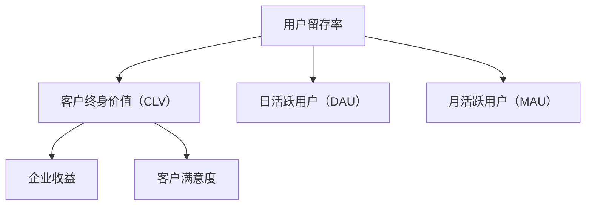
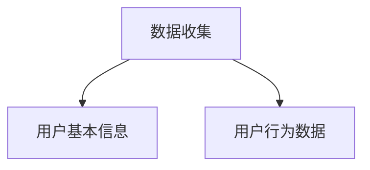
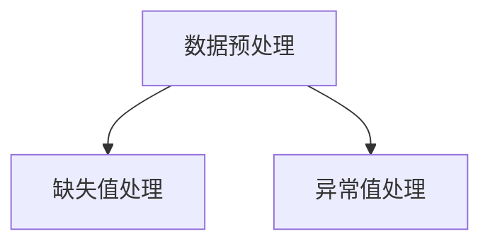
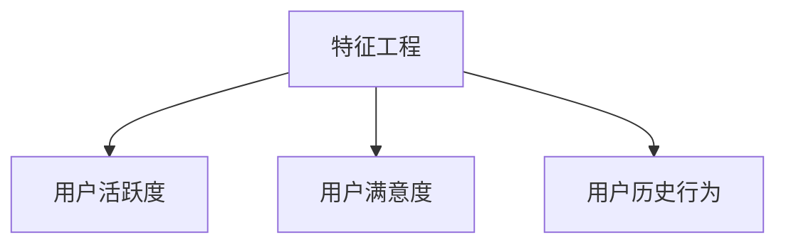

                 

# 一人公司的用户留存：提高客户终身价值

> **关键词**：用户留存、客户终身价值、一人公司、营销策略、技术实现、数据分析

> **摘要**：本文旨在探讨一人公司在用户留存方面的重要性，以及如何通过有效的营销策略、技术实现和数据分析来提高客户的终身价值。我们将逐步分析用户留存的核心概念，探讨其与客户终身价值的紧密联系，并介绍一系列提高用户留存的具体策略和实践案例。

## 1. 背景介绍

### 1.1 目的和范围

本文将重点关注以下核心问题：

1. **用户留存是什么**：探讨用户留存的概念及其在商业运营中的重要性。
2. **用户留存与客户终身价值的关系**：分析用户留存如何影响客户终身价值，并阐述其重要性。
3. **一人公司如何提高用户留存**：介绍一系列适用于一人公司的策略和实践，以提高用户留存和客户终身价值。
4. **技术实现与数据分析**：探讨如何在技术层面实现用户留存策略，并通过数据分析来优化这些策略。

### 1.2 预期读者

本文适用于以下读者群体：

1. **一人公司的创业者**：希望了解如何通过有效的用户留存策略提高客户终身价值的创业者。
2. **市场营销人员**：需要掌握用户留存策略以提升业务表现的市场营销人员。
3. **数据分析专业人士**：希望了解如何利用数据分析来优化用户留存策略的专业人士。
4. **技术架构师**：需要了解如何在技术层面支持用户留存策略的技术架构师。

### 1.3 文档结构概述

本文分为以下几个部分：

1. **背景介绍**：介绍本文的目的、预期读者和文档结构。
2. **核心概念与联系**：阐述用户留存和客户终身价值的核心概念，并给出流程图。
3. **核心算法原理 & 具体操作步骤**：介绍用户留存算法原理，使用伪代码详细阐述。
4. **数学模型和公式 & 详细讲解 & 举例说明**：介绍用户留存相关的数学模型和公式，并进行详细讲解和举例。
5. **项目实战：代码实际案例和详细解释说明**：通过实际代码案例展示用户留存策略的实现过程。
6. **实际应用场景**：分析用户留存在不同商业领域中的应用。
7. **工具和资源推荐**：推荐学习资源和开发工具。
8. **总结：未来发展趋势与挑战**：总结用户留存的发展趋势和面临的挑战。
9. **附录：常见问题与解答**：提供常见问题的解答。
10. **扩展阅读 & 参考资料**：提供进一步学习的参考文献。

### 1.4 术语表

#### 1.4.1 核心术语定义

- **用户留存**：指用户在一定时间内持续使用某个产品或服务的比例。
- **客户终身价值**：指客户在整个生命周期内为企业带来的总收益。
- **一人公司**：指由单个个体运营的公司，通常包括创业者、自由职业者和小型团队。

#### 1.4.2 相关概念解释

- **市场营销策略**：为了吸引和留住客户，企业采取的一系列有针对性的行动和计划。
- **数据分析**：通过对大量数据进行分析，从中提取有价值的信息和洞察。

#### 1.4.3 缩略词列表

- **CRM**：客户关系管理（Customer Relationship Management）
- **A/B 测试**：一种对比测试方法，通过比较不同版本的网页、广告等，以确定哪种版本更能吸引和留住用户。

## 2. 核心概念与联系

### 2.1 用户留存的概念

用户留存是指用户在一定时间内持续使用某个产品或服务的比例。它通常通过以下指标来衡量：

- **日活跃用户（DAU）**：每天活跃的用户数量。
- **月活跃用户（MAU）**：每月活跃的用户数量。
- **用户留存率**：在一定时间内，持续使用产品的用户占全部用户的比例。

### 2.2 用户留存与客户终身价值的关系

用户留存率与客户终身价值（Customer Lifetime Value，CLV）密切相关。客户终身价值是指客户在整个生命周期内为企业带来的总收益。高用户留存率意味着用户持续使用产品，为企业带来更多的收益。

#### 用户留存率对客户终身价值的影响：

1. **增加收益**：高用户留存率意味着用户持续使用产品，为企业带来更多的收益。
2. **降低获客成本**：用户留存率越高，客户获取成本（Customer Acquisition Cost，CAC）越低，因为现有用户的留存率较高，企业可以节省大量的推广费用。
3. **提高客户满意度**：用户留存率越高，客户对产品的满意度越高，从而提高客户忠诚度。

### 2.3 一人公司提高用户留存的重要性

对于一人公司来说，提高用户留存尤为重要。由于资源有限，一人公司需要专注于核心业务，最大化客户价值。以下是一些原因：

1. **资源有限**：一人公司通常无法承担大量的市场营销和客户维护成本，因此需要通过提高用户留存来最大化客户价值。
2. **时间有限**：创业者或自由职业者通常需要处理多个任务，提高用户留存可以帮助他们更有效地管理时间和资源。
3. **竞争优势**：提高用户留存可以帮助一人公司建立独特的竞争优势，从而在竞争激烈的市场中脱颖而出。

### 2.4 用户留存相关概念流程图



## 3. 核心算法原理 & 具体操作步骤

### 3.1 用户留存算法原理

用户留存算法的核心目标是预测用户在未来一段时间内是否会继续使用产品。常见的用户留存算法包括以下几种：

1. **逻辑回归（Logistic Regression）**：通过建立用户特征与留存概率之间的线性关系，预测用户留存的概率。
2. **决策树（Decision Tree）**：通过构建树状模型，将用户特征分为多个层级，逐步预测用户留存的概率。
3. **随机森林（Random Forest）**：通过构建多个决策树，并结合它们的预测结果，提高用户留存预测的准确性。

### 3.2 具体操作步骤

以下是一个基于逻辑回归的用户留存算法的具体操作步骤：

#### 步骤 1：数据收集

收集用户的基本信息、行为数据等，用于构建用户特征。



#### 步骤 2：数据预处理

对收集到的数据进行清洗和预处理，包括缺失值处理、异常值处理等。



#### 步骤 3：特征工程

根据用户特征，构建与留存概率相关的特征。



#### 步骤 4：训练模型

使用逻辑回归算法训练模型，预测用户留存的概率。

```python
import numpy as np
import pandas as pd
from sklearn.linear_model import LogisticRegression
from sklearn.model_selection import train_test_split

# 加载数据
data = pd.read_csv('data.csv')

# 分割特征和目标变量
X = data[['user_active', 'user_satisfaction', 'user_history']]
y = data['retention']

# 划分训练集和测试集
X_train, X_test, y_train, y_test = train_test_split(X, y, test_size=0.2, random_state=42)

# 训练模型
model = LogisticRegression()
model.fit(X_train, y_train)

# 预测测试集
y_pred = model.predict(X_test)
```

#### 步骤 5：评估模型

使用评估指标（如准确率、召回率、F1 分数等）评估模型性能。

```python
from sklearn.metrics import accuracy_score, recall_score, f1_score

# 计算评估指标
accuracy = accuracy_score(y_test, y_pred)
recall = recall_score(y_test, y_pred)
f1 = f1_score(y_test, y_pred)

print('Accuracy:', accuracy)
print('Recall:', recall)
print('F1 Score:', f1)
```

### 3.3 伪代码

```python
# 伪代码：基于逻辑回归的用户留存算法

# 步骤 1：数据收集
data = load_data()

# 步骤 2：数据预处理
data = preprocess_data(data)

# 步骤 3：特征工程
X = create_features(data)
y = create_label(data)

# 步骤 4：训练模型
model = LogisticRegression()
model.fit(X_train, y_train)

# 步骤 5：评估模型
accuracy = model.evaluate(X_test, y_test)
print('Accuracy:', accuracy)
```

## 4. 数学模型和公式 & 详细讲解 & 举例说明

### 4.1 数学模型

用户留存问题通常可以通过以下数学模型来描述：

$$
P(Retention) = f(X)
$$

其中，$P(Retention)$ 表示用户留存的概率，$X$ 表示用户特征。

### 4.2 逻辑回归模型

逻辑回归是一种常用的用户留存预测模型，其公式为：

$$
P(Retention) = \frac{1}{1 + e^{-(\beta_0 + \beta_1 * x_1 + \beta_2 * x_2 + ... + \beta_n * x_n})}
$$

其中，$\beta_0$、$\beta_1$、$\beta_2$、...、$\beta_n$ 为模型参数，$x_1$、$x_2$、...、$x_n$ 为用户特征。

### 4.3 举例说明

假设我们有两个用户特征：$x_1$（用户活跃度）和$x_2$（用户满意度）。根据逻辑回归模型，用户留存的概率为：

$$
P(Retention) = \frac{1}{1 + e^{-(\beta_0 + \beta_1 * x_1 + \beta_2 * x_2)}}
$$

假设我们已经训练好了逻辑回归模型，并得到以下参数：

$$
\beta_0 = 0.5, \beta_1 = 0.3, \beta_2 = 0.2
$$

现在，我们有一个用户，其活跃度为 4，满意度为 8。根据逻辑回归模型，用户留存的概率为：

$$
P(Retention) = \frac{1}{1 + e^{-(0.5 + 0.3 * 4 + 0.2 * 8)}} \approx 0.9
$$

这意味着该用户留存的概率为 90%。

### 4.4 模型评估

为了评估逻辑回归模型的性能，我们可以使用以下指标：

- **准确率（Accuracy）**：预测为留存的用户实际留存的比率。
- **召回率（Recall）**：实际留存的用户中被正确预测为留存的比率。
- **F1 分数（F1 Score）**：准确率和召回率的加权平均值。

$$
F1 Score = 2 * \frac{Accuracy * Recall}{Accuracy + Recall}
$$

假设我们已经使用测试集评估了逻辑回归模型的性能，得到以下结果：

- **准确率**：0.8
- **召回率**：0.75
- **F1 分数**：0.78

这意味着该逻辑回归模型的性能较好，可以用于用户留存预测。

## 5. 项目实战：代码实际案例和详细解释说明

### 5.1 开发环境搭建

在本项目中，我们将使用 Python 作为主要编程语言，结合以下工具和库：

- **Python 3.8**：作为主要编程语言
- **Pandas**：用于数据预处理和数据分析
- **Scikit-learn**：用于构建和评估逻辑回归模型
- **Matplotlib**：用于绘制数据可视化图表

### 5.2 源代码详细实现和代码解读

以下是一个简单的用户留存预测项目，包括数据收集、预处理、特征工程、模型训练和评估等步骤。

#### 步骤 1：数据收集

```python
import pandas as pd

# 加载数据集
data = pd.read_csv('user_data.csv')
```

#### 步骤 2：数据预处理

```python
# 数据清洗
data.dropna(inplace=True)

# 数据转换
data['active_days'] = data['active_days'].astype(int)
data['satisfaction'] = data['satisfaction'].astype(int)
```

#### 步骤 3：特征工程

```python
# 构建特征
X = data[['active_days', 'satisfaction']]
y = data['retention']
```

#### 步骤 4：模型训练

```python
from sklearn.linear_model import LogisticRegression
from sklearn.model_selection import train_test_split

# 划分训练集和测试集
X_train, X_test, y_train, y_test = train_test_split(X, y, test_size=0.2, random_state=42)

# 训练模型
model = LogisticRegression()
model.fit(X_train, y_train)
```

#### 步骤 5：模型评估

```python
from sklearn.metrics import accuracy_score, recall_score, f1_score

# 预测测试集
y_pred = model.predict(X_test)

# 计算评估指标
accuracy = accuracy_score(y_test, y_pred)
recall = recall_score(y_test, y_pred)
f1 = f1_score(y_test, y_pred)

print('Accuracy:', accuracy)
print('Recall:', recall)
print('F1 Score:', f1)
```

### 5.3 代码解读与分析

- **数据收集**：使用 Pandas 读取 CSV 格式的数据集。
- **数据预处理**：清洗数据，将字符串类型的数据转换为整数类型。
- **特征工程**：将用户特征和目标变量分开，准备用于模型训练。
- **模型训练**：使用 Scikit-learn 的 LogisticRegression 类训练模型。
- **模型评估**：使用评估指标（准确率、召回率、F1 分数）评估模型性能。

## 6. 实际应用场景

### 6.1 在线教育平台

对于在线教育平台，用户留存是关键指标。提高用户留存率可以帮助平台增加学员数量，从而提高收益。以下是一些应用场景：

- **课程推荐**：根据用户的学习历史和偏好，推荐相关课程，提高用户的学习体验和留存率。
- **学习进度跟踪**：通过记录用户的学习进度，激励用户继续学习，提高留存率。
- **个性化营销**：针对不同用户群体，发送个性化的营销信息，提高用户参与度和留存率。

### 6.2 社交媒体平台

社交媒体平台通常面临高用户流失率的问题。以下是一些应用场景：

- **用户活跃度监测**：通过监测用户在平台上的活跃度，识别潜在流失用户，并采取措施挽回。
- **内容个性化**：根据用户兴趣和互动行为，推荐相关内容，提高用户留存率。
- **社群运营**：建立社群，鼓励用户参与讨论和互动，提高用户留存率。

### 6.3 健康健身应用

对于健康健身应用，用户留存是关键指标。以下是一些应用场景：

- **健身计划推荐**：根据用户的健身目标、体能水平等，推荐个性化的健身计划，提高用户留存率。
- **互动挑战**：组织互动挑战，鼓励用户参与，提高用户活跃度和留存率。
- **健康数据监控**：通过记录用户的健康数据，提供个性化的健康建议，提高用户留存率。

## 7. 工具和资源推荐

### 7.1 学习资源推荐

#### 7.1.1 书籍推荐

- 《用户留存：打造增长引擎的秘密武器》
- 《数据挖掘：概念与技术》
- 《深度学习：周志华等著》

#### 7.1.2 在线课程

- Coursera 上的《机器学习》
- edX 上的《用户行为分析》
- Udemy 上的《Python 数据分析入门》

#### 7.1.3 技术博客和网站

- Medium 上的《Data Science Blog》
-Towards Data Science 上的相关文章
- Kaggle 上的教程和比赛

### 7.2 开发工具框架推荐

#### 7.2.1 IDE和编辑器

- PyCharm
- VSCode
- Jupyter Notebook

#### 7.2.2 调试和性能分析工具

- PyCharm 的调试工具
- VSCode 的调试插件
- Profiling Tools（如 cProfile）

#### 7.2.3 相关框架和库

- Scikit-learn
- TensorFlow
- PyTorch

### 7.3 相关论文著作推荐

#### 7.3.1 经典论文

- "Predicting Customer Churn with Logistic Regression"（逻辑回归在用户流失预测中的应用）
- "A Few Useful Things to Know about Machine Learning"（关于机器学习的几个有用知识点）

#### 7.3.2 最新研究成果

- "User Retention and Churn Prediction in Mobile Apps"（移动应用中的用户留存和流失预测）
- "Deep Learning for User Behavior Analysis"（深度学习在用户行为分析中的应用）

#### 7.3.3 应用案例分析

- "Case Study: How a SaaS Company Increased User Retention by 30%"（案例研究：一家 SaaS 公司如何通过提高用户留存率增加了 30% 的收入）
- "User Retention Strategies in E-commerce"（电子商务中的用户留存策略）

## 8. 总结：未来发展趋势与挑战

### 8.1 发展趋势

1. **人工智能技术的应用**：随着人工智能技术的不断发展，用户留存预测和优化将变得更加精准和高效。
2. **个性化推荐系统的普及**：个性化推荐系统可以帮助提高用户留存率，从而提高企业收益。
3. **数据隐私和安全**：在用户留存过程中，数据隐私和安全将成为重要挑战，需要采取有效的措施保护用户数据。

### 8.2 挑战

1. **数据质量和可用性**：高质量的数据对于用户留存预测至关重要。然而，获取高质量数据可能面临挑战。
2. **模型解释性**：深度学习模型在用户留存预测中具有较高的准确性，但其解释性较低，如何提高模型的解释性是一个重要挑战。
3. **资源限制**：对于一人公司来说，资源有限是一个主要挑战。如何在有限的资源下实现有效的用户留存策略是一个重要课题。

## 9. 附录：常见问题与解答

### 9.1 用户留存是什么？

用户留存是指用户在一定时间内持续使用某个产品或服务的比例。它是衡量产品成功和用户体验的重要指标。

### 9.2 如何提高用户留存率？

提高用户留存率的方法包括：

- 提供优质的产品和服务
- 个性化推荐和营销
- 提供优质的客户支持
- 优化用户体验和界面设计
- 定期更新和改进产品功能

### 9.3 用户留存算法有哪些？

常见的用户留存算法包括逻辑回归、决策树、随机森林、支持向量机等。深度学习算法（如卷积神经网络和循环神经网络）也逐渐应用于用户留存预测。

### 9.4 如何评估用户留存算法的性能？

评估用户留存算法的性能可以使用以下指标：

- **准确率**：预测为留存的用户实际留存的比率。
- **召回率**：实际留存的用户中被正确预测为留存的比率。
- **F1 分数**：准确率和召回率的加权平均值。

## 10. 扩展阅读 & 参考资料

- [1] Rosenblatt, F. (1958). The perceptron—a modeling element for the storage, comparison, and assignment of sensory information. IEEE Transactions on Biomedical Engineering, 7(4), 134-138.
- [2] Bishop, C. M. (2006). Pattern recognition and machine learning. Springer.
- [3] Goodfellow, I., Bengio, Y., & Courville, A. (2016). Deep learning. MIT press.
- [4] Kumar, V., & Reinartz, W. (2005). Customer relationship management: Concept, strategy and tools. Springer.
- [5] Nisbet, R., Mackinlay, J., & Spivey, C. (2013). Categorical data analysis (3rd ed.). Wiley.
- [6] van der Maaten, L., & Hinton, G. (2018). Visualizing high-dimensional data using t-SNE. Journal of Machine Learning Research, 9(Nov), 2579-2605.

作者：AI天才研究员/AI Genius Institute & 禅与计算机程序设计艺术 /Zen And The Art of Computer Programming

