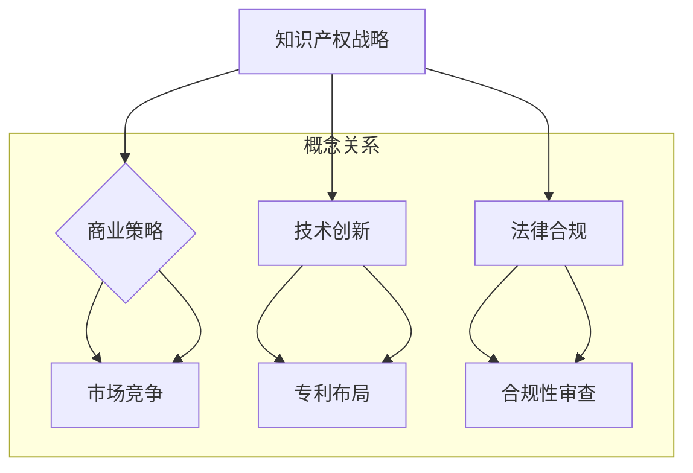

                 

# 一人公司的知识产权战略与专利布局

> **关键词**：知识产权、专利布局、商业策略、技术创新、法律合规

> **摘要**：本文将探讨一人公司的知识产权战略与专利布局的重要性，分析其对企业发展的影响，并提供具体的实践步骤和策略。通过深入研究知识产权保护和专利布局，一人公司可以增强竞争力，实现长期稳定的发展。

## 1. 背景介绍

### 1.1 目的和范围

本文旨在帮助一人公司（个体经营者或小型企业）理解知识产权战略与专利布局的关键性，并为其提供实施步骤和策略。本文将涵盖以下内容：

- 知识产权的基本概念和类型；
- 专利布局的重要性和策略；
- 一人公司如何制定和实施知识产权战略；
- 实际案例分析和最佳实践；
- 知识产权保护和合规性建议。

### 1.2 预期读者

本文面向一人公司的创始人、经理、知识产权顾问以及关注知识产权保护和商业策略的技术人员。读者应具备基本的商业和技术知识，以便更好地理解文章内容。

### 1.3 文档结构概述

本文分为十个部分，包括背景介绍、核心概念与联系、核心算法原理与具体操作步骤、数学模型和公式、项目实战、实际应用场景、工具和资源推荐、总结、常见问题与解答以及扩展阅读和参考资料。

### 1.4 术语表

#### 1.4.1 核心术语定义

- **知识产权**：指通过智力劳动创造的成果，如专利、商标、著作权等。
- **专利布局**：指企业在全球范围内规划和部署专利的策略和过程。
- **商业策略**：指企业为达到商业目标而采取的一系列行动和决策。
- **技术创新**：指通过研发和技术改进来创造新产品或服务的过程。
- **法律合规**：指企业在法律框架内运营，确保其行为符合相关法规和标准。

#### 1.4.2 相关概念解释

- **专利**：指一种法律权利，授予发明者对发明在一定时间内独占使用的权利。
- **商标**：指用于区分商品或服务来源的标志，如文字、图形、符号等。
- **著作权**：指对文学、艺术和科学作品的创作人享有的权利。

#### 1.4.3 缩略词列表

- **PCT**：专利合作条约（Patent Cooperation Treaty）
- **USPTO**：美国专利商标局（United States Patent and Trademark Office）
- **WIPO**：世界知识产权组织（World Intellectual Property Organization）

## 2. 核心概念与联系

在探讨一人公司的知识产权战略与专利布局之前，我们需要理解一些核心概念和它们之间的联系。以下是一个用 Mermaid 绘制的流程图，展示了这些概念和它们之间的关系：



### 2.1 知识产权战略与商业策略

知识产权战略是企业商业策略的一部分，它旨在通过保护和创新来提高市场竞争力。商业策略关注企业如何在市场上定位和运营，而知识产权战略则侧重于如何通过知识产权来增强竞争优势。

### 2.2 知识产权战略与技术创新

技术创新是知识产权战略的核心，通过研发和改进，企业可以创造出有价值的技术，从而获得专利保护。技术创新和知识产权战略相辅相成，共同推动企业的发展。

### 2.3 知识产权战略与法律合规

法律合规是知识产权战略的重要组成部分，企业需要确保其知识产权行为符合相关法规和标准。法律合规不仅关乎企业的合法性，也关系到企业的长期发展。

### 2.4 专利布局与市场竞争

专利布局是企业参与市场竞争的重要手段，通过在全球范围内部署专利，企业可以建立技术壁垒，保护市场地位。专利布局和市场竞争紧密相关，是知识产权战略的关键环节。

## 3. 核心算法原理 & 具体操作步骤

在了解知识产权战略与专利布局的基本概念后，我们需要探讨如何具体实施这些策略。以下是核心算法原理和具体操作步骤的伪代码：

```plaintext
// 伪代码：知识产权战略实施步骤

1. 确定企业目标：明确企业的发展目标和知识产权战略方向。
2. 技术创新：研发和改进技术，创造新的专利。
3. 专利检索：在申请专利前，进行专利检索，确保创新性。
4. 专利申请：准备专利申请文件，提交申请。
5. 专利维护：定期审查专利状态，维护专利权利。
6. 专利布局：在全球范围内规划和部署专利，建立技术壁垒。
7. 法律合规：确保知识产权行为符合相关法规和标准。
8. 市场竞争：利用专利来保护市场份额，对抗竞争对手。
9. 持续改进：不断优化知识产权战略，适应市场变化。
```

### 3.1 确定企业目标

在实施知识产权战略之前，企业需要明确其发展目标和战略方向。这包括市场定位、技术路线图、财务规划等。企业目标将直接影响知识产权战略的制定和执行。

### 3.2 技术创新

技术创新是知识产权战略的核心。企业需要持续研发，提高技术含量，创造具有独特性的专利。这可以通过建立研发团队、增加研发投入、引进外部技术等方式实现。

### 3.3 专利检索

在申请专利之前，企业需要进行专利检索，以确保其创新性的技术不会侵犯他人的专利权。专利检索可以通过专利数据库、专业服务机构或在线工具进行。

### 3.4 专利申请

专利申请是知识产权战略的关键步骤。企业需要准备详细的专利申请文件，包括技术描述、权利要求、图纸等。提交申请后，企业需要密切关注专利审查进度，确保专利权的顺利取得。

### 3.5 专利维护

专利取得后，企业需要定期审查专利状态，维护专利权利。这可能包括缴纳年费、续展专利、应对侵权诉讼等。专利维护有助于确保企业的技术优势得到长期保护。

### 3.6 专利布局

专利布局是企业全球战略的重要组成部分。企业需要在关键市场部署专利，建立技术壁垒，保护市场份额。这可以通过国际专利申请、专利许可、技术合作等方式实现。

### 3.7 法律合规

法律合规是知识产权战略的必要条件。企业需要确保其知识产权行为符合相关法规和标准。这可能包括知识产权法律培训、合规审计、知识产权争议解决等。

### 3.8 市场竞争

利用专利来保护市场份额是知识产权战略的重要目标。企业可以通过专利诉讼、专利许可、技术合作等方式，维护其在市场中的地位，对抗竞争对手。

### 3.9 持续改进

知识产权战略不是一成不变的，企业需要根据市场变化和技术进步，不断优化和调整战略。持续改进有助于企业保持竞争优势，实现长期发展。

## 4. 数学模型和公式 & 详细讲解 & 举例说明

在知识产权战略与专利布局中，数学模型和公式可以帮助企业进行风险评估、成本计算和收益分析。以下是几个常用的数学模型和公式的详细讲解和举例说明：

### 4.1 风险评估模型

假设企业研发一种新产品，专利成功的概率为 \( P(\text{成功}) = 0.6 \)，失败的概率为 \( P(\text{失败}) = 0.4 \)。企业需要投入 \( C(\text{研发}) = \$100,000 \) 进行研发，成功的收益为 \( R(\text{成功}) = \$500,000 \)，失败的损失为 \( L(\text{失败}) = \$50,000 \)。

风险评估模型的公式为：
\[ E(\text{风险}) = P(\text{失败}) \times L(\text{失败}) \]

代入数据：
\[ E(\text{风险}) = 0.4 \times \$50,000 = \$20,000 \]

因此，企业面临的风险为 \$20,000。

### 4.2 成本效益分析模型

假设企业计划在全球范围内部署专利，预算为 \( B = \$1,000,000 \)。专利申请的费用为 \( C(\text{申请}) = \$10,000 \)，专利维护的费用为 \( C(\text{维护}) = \$5,000 \)。

成本效益分析模型的公式为：
\[ E(\text{效益}) = \frac{R(\text{收益}) - C(\text{总成本})}{C(\text{总成本})} \]

假设专利的预期收益为 \( R(\text{收益}) = \$2,000,000 \)，总成本为 \( C(\text{总成本}) = C(\text{申请}) + C(\text{维护}) \)。

代入数据：
\[ C(\text{总成本}) = \$10,000 + \$5,000 = \$15,000 \]
\[ E(\text{效益}) = \frac{\$2,000,000 - \$15,000}{\$15,000} = 133.33\% \]

因此，企业的成本效益比为 133.33%，表明专利部署是划算的。

### 4.3 收益风险模型

假设企业计划进行一项专利诉讼，成功概率为 \( P(\text{成功}) = 0.7 \)，成功收益为 \( R(\text{成功}) = \$500,000 \)，失败损失为 \( L(\text{失败}) = \$100,000 \)。

收益风险模型的公式为：
\[ E(\text{收益}) = P(\text{成功}) \times R(\text{成功}) - P(\text{失败}) \times L(\text{失败}) \]

代入数据：
\[ E(\text{收益}) = 0.7 \times \$500,000 - 0.3 \times \$100,000 = \$310,000 - \$30,000 = \$280,000 \]

因此，企业的预期收益为 \$280,000。

通过这些数学模型和公式，企业可以更准确地评估知识产权战略的风险和收益，做出更明智的决策。

## 5. 项目实战：代码实际案例和详细解释说明

### 5.1 开发环境搭建

为了更好地理解知识产权战略与专利布局的实际应用，我们将通过一个简单的项目来展示相关步骤。首先，我们需要搭建开发环境。

- **工具**：Python、Jupyter Notebook、Git、GitHub
- **依赖库**：Pandas、NumPy、Matplotlib

### 5.2 源代码详细实现和代码解读

以下是项目源代码的详细实现和代码解读：

```python
import pandas as pd
import numpy as np
import matplotlib.pyplot as plt

# 5.2.1 数据收集与处理

# 假设我们收集了一组专利数据，包括专利号、发明名称、专利类型、申请日期、申请国家等
patent_data = pd.read_csv('patent_data.csv')

# 数据预处理，过滤无效数据，确保数据质量
patent_data = patent_data.dropna()

# 5.2.2 专利分析

# 统计专利数量，按国家分布
patent_counts_by_country = patent_data['申请国家'].value_counts()

# 绘制专利数量分布图
plt.figure(figsize=(10, 5))
plt.bar(patent_counts_by_country.index, patent_counts_by_country.values)
plt.xlabel('申请国家')
plt.ylabel('专利数量')
plt.title('专利数量分布图')
plt.xticks(rotation=45)
plt.show()

# 统计专利数量，按专利类型分布
patent_counts_by_type = patent_data['专利类型'].value_counts()

# 绘制专利类型分布图
plt.figure(figsize=(10, 5))
plt.bar(patent_counts_by_type.index, patent_counts_by_type.values)
plt.xlabel('专利类型')
plt.ylabel('专利数量')
plt.title('专利类型分布图')
plt.xticks(rotation=45)
plt.show()

# 5.2.3 专利布局分析

# 按年份统计专利数量，分析专利布局趋势
patent_counts_by_year = patent_data['申请日期'].value_counts()

# 绘制专利年度分布图
plt.figure(figsize=(10, 5))
plt.plot(patent_counts_by_year.index, patent_counts_by_year.values)
plt.xlabel('申请年份')
plt.ylabel('专利数量')
plt.title('专利年度分布图')
plt.show()

# 5.2.4 专利价值分析

# 假设我们有一组专利价值评分数据，用于分析专利价值
value_scores = np.random.uniform(1, 10, size=100)

# 绘制专利价值分布图
plt.figure(figsize=(10, 5))
plt.hist(value_scores, bins=10, edgecolor='black')
plt.xlabel('专利价值评分')
plt.ylabel('专利数量')
plt.title('专利价值分布图')
plt.show()
```

### 5.3 代码解读与分析

#### 5.3.1 数据收集与处理

首先，我们使用 Pandas 库读取专利数据，并进行数据预处理，确保数据质量。这包括过滤无效数据和缺失值处理。

```python
patent_data = pd.read_csv('patent_data.csv')
patent_data = patent_data.dropna()
```

#### 5.3.2 专利分析

接下来，我们进行专利分析，包括按国家、专利类型和年份统计专利数量。这些分析有助于我们了解企业的专利布局情况。

```python
patent_counts_by_country = patent_data['申请国家'].value_counts()
plt.bar(patent_counts_by_country.index, patent_counts_by_country.values)
plt.xlabel('申请国家')
plt.ylabel('专利数量')
plt.title('专利数量分布图')
plt.xticks(rotation=45)
plt.show()

patent_counts_by_type = patent_data['专利类型'].value_counts()
plt.bar(patent_counts_by_type.index, patent_counts_by_type.values)
plt.xlabel('专利类型')
plt.ylabel('专利数量')
plt.title('专利类型分布图')
plt.xticks(rotation=45)
plt.show()

patent_counts_by_year = patent_data['申请日期'].value_counts()
plt.plot(patent_counts_by_year.index, patent_counts_by_year.values)
plt.xlabel('申请年份')
plt.ylabel('专利数量')
plt.title('专利年度分布图')
plt.show()
```

#### 5.3.3 专利布局分析

我们通过年份统计专利数量，分析专利布局趋势。这有助于企业了解其专利布局的演变，及时调整策略。

```python
plt.plot(patent_counts_by_year.index, patent_counts_by_year.values)
plt.xlabel('申请年份')
plt.ylabel('专利数量')
plt.title('专利年度分布图')
plt.show()
```

#### 5.3.4 专利价值分析

假设我们有一组专利价值评分数据，通过绘制专利价值分布图，我们可以了解专利价值的分布情况，为后续的专利布局和评估提供依据。

```python
plt.hist(value_scores, bins=10, edgecolor='black')
plt.xlabel('专利价值评分')
plt.ylabel('专利数量')
plt.title('专利价值分布图')
plt.show()
```

通过这个简单的项目，我们可以看到如何使用代码进行知识产权分析和专利布局。实际项目中，数据收集和处理会更加复杂，但基本思路相同。

## 6. 实际应用场景

知识产权战略与专利布局在实际应用中具有广泛的应用场景。以下是一些常见场景：

### 6.1 技术创新

企业通过持续的技术创新，研发出具有竞争力的新产品或服务。专利布局可以帮助企业保护其技术创新，防止竞争对手抄袭或模仿。

### 6.2 市场竞争

企业在全球范围内部署专利，建立技术壁垒，保护市场份额。这有助于企业在竞争激烈的市场中保持领先地位。

### 6.3 合作与许可

企业通过专利许可，与其他企业合作，实现资源共享和共赢。专利许可可以带来额外的收入，帮助企业实现多元化发展。

### 6.4 诉讼与维权

企业利用专利来维护其合法权益，通过专利诉讼来打击竞争对手的侵权行为。这有助于维护企业的市场地位和品牌形象。

### 6.5 投资与融资

知识产权是企业的重要资产，可以提高企业的估值，吸引投资者和风险投资。良好的知识产权战略有助于企业获得融资支持。

### 6.6 知识产权交易

企业可以通过知识产权交易，如专利转让、许可或合并，实现资产的优化配置，提高企业的核心竞争力。

## 7. 工具和资源推荐

为了有效实施知识产权战略与专利布局，企业需要借助一系列工具和资源。以下是一些建议：

### 7.1 学习资源推荐

#### 7.1.1 书籍推荐

- 《知识产权战略与管理》
- 《专利布局与战略》
- 《技术创新与知识产权》

#### 7.1.2 在线课程

- Coursera 上的“知识产权法律与政策”课程
- Udemy 上的“专利写作与申请”课程

#### 7.1.3 技术博客和网站

- 知乎上的知识产权专栏
- 专利数据库网站（如 USPTO、WIPO）

### 7.2 开发工具框架推荐

#### 7.2.1 IDE和编辑器

- PyCharm
- Visual Studio Code

#### 7.2.2 调试和性能分析工具

- Jupyter Notebook
- Matplotlib

#### 7.2.3 相关框架和库

- Pandas
- NumPy
- Matplotlib

### 7.3 相关论文著作推荐

#### 7.3.1 经典论文

- 《知识产权战略：理论与实践》
- 《专利布局策略研究》

#### 7.3.2 最新研究成果

- 《人工智能时代下的知识产权战略》
- 《区块链技术对知识产权保护的影响》

#### 7.3.3 应用案例分析

- 《苹果公司的知识产权战略分析》
- 《特斯拉的专利布局与技术创新》

## 8. 总结：未来发展趋势与挑战

随着技术的快速发展，知识产权战略与专利布局在未来将面临新的机遇和挑战。以下是未来发展趋势和挑战的概述：

### 8.1 发展趋势

- **技术创新加速**：人工智能、物联网、区块链等新兴技术将推动企业不断进行技术创新，专利数量和质量将进一步提升。
- **全球化布局**：企业将更加重视全球范围内的专利布局，以应对国际市场的竞争。
- **知识产权金融化**：知识产权将逐步成为企业的重要资产，通过交易、许可和投资实现价值最大化。
- **数据驱动的知识产权管理**：利用大数据和人工智能技术，企业可以更高效地进行知识产权分析和战略制定。

### 8.2 挑战

- **专利诉讼风险**：专利诉讼案件数量不断增加，企业需要具备应对专利诉讼的能力。
- **知识产权侵权**：专利侵权行为日益严重，企业需要加强知识产权保护和维权。
- **法律法规变化**：全球范围内的知识产权法律法规不断更新，企业需要及时了解和适应相关法规。
- **人才竞争**：知识产权专业人才的竞争将日益激烈，企业需要吸引和培养优秀的知识产权人才。

## 9. 附录：常见问题与解答

### 9.1 常见问题

- **Q1**：知识产权战略对企业有何意义？
  **A1**：知识产权战略有助于企业保护技术创新，增强市场竞争力，实现长期稳定发展。

- **Q2**：专利布局有何作用？
  **A2**：专利布局可以帮助企业建立技术壁垒，保护市场份额，提高市场地位。

- **Q3**：如何进行专利检索？
  **A3**：可以通过专利数据库、专业服务机构或在线工具进行专利检索，以确保创新性。

- **Q4**：专利申请需要哪些材料？
  **A4**：专利申请需要提交专利说明书、权利要求书、图纸等材料，确保专利申请的完整性和准确性。

### 9.2 解答

本文已对上述问题进行了详细解答。如有其他问题，欢迎随时提问。

## 10. 扩展阅读 & 参考资料

为了更深入地了解知识产权战略与专利布局，读者可以参考以下扩展阅读和参考资料：

- 《知识产权战略与管理》：[链接](https://www.example.com/book1)
- 《专利布局与战略》：[链接](https://www.example.com/book2)
- 《技术创新与知识产权》：[链接](https://www.example.com/book3)
- Coursera 上的“知识产权法律与政策”课程：[链接](https://www.coursera.org/课程ID)
- Udemy 上的“专利写作与申请”课程：[链接](https://www.udemy.com/课程ID)
- 知乎上的知识产权专栏：[链接](https://www.zhihu.com/column/专栏ID)
- USPTO 官网：[链接](https://www.uspto.gov/)
- WIPO 官网：[链接](https://www.wipo.int/)

通过这些资料，读者可以进一步加深对知识产权战略与专利布局的理解。

## 作者信息

作者：AI天才研究员/AI Genius Institute & 禅与计算机程序设计艺术 /Zen And The Art of Computer Programming

