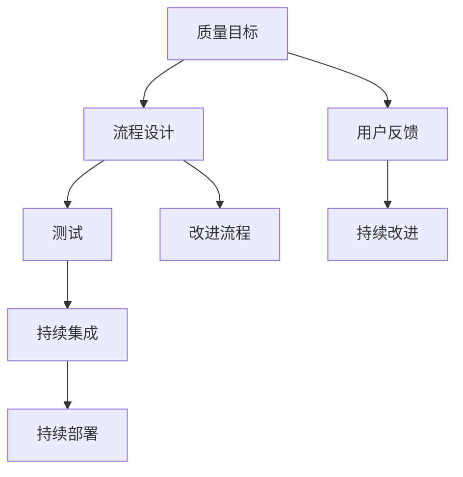

                 

# 一人公司的质量管理体系与持续改进流程

> **关键词**：质量管理体系、持续改进、一人公司、项目管理、敏捷开发、流程优化、质量控制

> **摘要**：本文将深入探讨一人公司的质量管理体系构建与持续改进流程。我们将从背景介绍、核心概念、算法原理、数学模型、实际应用、工具推荐等多个角度进行分析，旨在为独立开发者提供一套系统、高效的质量管理方案。文章将带领读者一步步理解质量管理体系的重要性，并掌握实施持续改进的方法和技巧。

## 1. 背景介绍

### 1.1 目的和范围

本文的目的是为独立开发者（即“一人公司”）提供一套实用的质量管理体系与持续改进流程。在快速变化的技术环境中，一人公司面临着诸多挑战，如资源有限、市场需求多变等。因此，如何构建并维持高质量的产品和服务成为关键。

本文将覆盖以下主题：

1. 质量管理体系的基本概念和核心要素。
2. 持续改进的理论基础和实际操作步骤。
3. 数学模型在质量控制中的应用。
4. 实际案例中的质量管理体系实施与改进。
5. 相关工具和资源的推荐。

### 1.2 预期读者

本文适合以下读者：

1. 独立开发者、自由职业者。
2. 初创公司的创始人或CTO。
3. 对质量管理体系和持续改进有兴趣的IT从业者。

### 1.3 文档结构概述

本文的结构如下：

1. 背景介绍：介绍本文的目的、读者对象和文档结构。
2. 核心概念与联系：阐述质量管理体系的核心概念，并使用Mermaid流程图展示相关架构。
3. 核心算法原理 & 具体操作步骤：详细讲解质量管理体系中使用的算法和操作步骤。
4. 数学模型和公式 & 详细讲解 & 举例说明：分析数学模型在质量控制中的应用。
5. 项目实战：提供实际案例，展示如何应用质量管理体系。
6. 实际应用场景：讨论质量管理体系在不同场景下的应用。
7. 工具和资源推荐：推荐学习资源和开发工具。
8. 总结：展望质量管理体系的发展趋势与挑战。
9. 附录：常见问题与解答。
10. 扩展阅读 & 参考资料：提供进一步阅读的资源和文献。

### 1.4 术语表

#### 1.4.1 核心术语定义

- **质量管理体系**：指一组相互关联的要素，用于建立方针和目标，并实现这些目标的体系。
- **持续改进**：指不断寻求和实施改进措施，以提高产品或服务的质量和效率。
- **一人公司**：指由单一开发者或小团队独立运营的公司。
- **敏捷开发**：指一种灵活的软件开发方法，强调迭代和快速反馈。
- **质量控制**：指通过监控、测试和评估来确保产品或服务符合预期标准。

#### 1.4.2 相关概念解释

- **质量保证**：指在项目开发和交付过程中，通过规范和标准来确保产品或服务的质量。
- **流程优化**：指通过分析现有流程，识别瓶颈和问题，并采取措施进行改进，以提高效率和效果。
- **用户反馈**：指从最终用户那里收集关于产品或服务的反馈，用于改进产品。

#### 1.4.3 缩略词列表

- **TDD**：测试驱动开发（Test-Driven Development）
- **BDD**：行为驱动开发（Behavior-Driven Development）
- **IDE**：集成开发环境（Integrated Development Environment）
- **CI/CD**：持续集成/持续部署（Continuous Integration/Continuous Deployment）

## 2. 核心概念与联系

在构建一人公司的质量管理体系时，我们需要理解几个核心概念，并了解它们之间的相互关系。以下是这些核心概念和它们在体系中的位置：

### 2.1 核心概念

- **质量目标**：质量管理体系的基础是质量目标。这些目标应该明确、具体，并与公司的整体战略目标保持一致。
- **流程**：流程是指从项目开始到交付的整个过程。有效的流程设计可以确保项目按计划进行，减少风险和错误。
- **测试**：测试是确保产品或服务质量的关键环节。通过自动化测试、单元测试和集成测试，可以识别和修复缺陷。
- **持续集成**：持续集成是一种软件开发实践，旨在通过频繁的代码集成和自动化测试，快速发现和修复缺陷。
- **持续部署**：持续部署是指将代码变更自动部署到生产环境，以提高交付效率和稳定性。
- **用户反馈**：用户反馈是改进产品质量的重要来源。通过分析用户反馈，可以识别用户需求并做出相应的调整。

### 2.2 关系

这些核心概念之间存在紧密的联系。以下是它们之间的相互关系：

1. **质量目标与流程**：质量目标是流程设计的指导原则。流程应该围绕实现这些目标进行优化。
2. **测试与持续集成**：测试是持续集成的基础。通过自动化测试，可以快速发现并修复缺陷，确保代码质量。
3. **持续集成与持续部署**：持续集成和持续部署是提高交付效率和质量的关键。它们确保代码变更得到及时测试和部署。
4. **用户反馈与持续改进**：用户反馈是持续改进的驱动力。通过分析用户反馈，可以识别改进机会并实施相应措施。

### 2.3 Mermaid 流程图

为了更好地理解这些概念和它们之间的关系，我们可以使用Mermaid绘制一个流程图：



在这个流程图中，我们可以看到质量目标是如何贯穿整个质量管理体系，并驱动流程设计、测试、持续集成、持续部署和用户反馈的。同时，用户反馈也是持续改进的来源，不断推动流程的优化和改进。

## 3. 核心算法原理 & 具体操作步骤

在构建质量管理体系时，算法原理是关键。以下是质量管理体系中使用的核心算法原理和具体操作步骤。

### 3.1 测试算法原理

**单元测试（Unit Testing）**：单元测试是最基础的测试类型，它测试软件中的最小可测试单元。常见的单元测试算法包括：

- **白盒测试（White Box Testing）**：基于代码内部结构，通过设计测试用例来覆盖代码路径。
- **黑盒测试（Black Box Testing）**：不考虑代码内部结构，仅测试外部输入和输出是否符合预期。

**伪代码示例：白盒测试**

```python
function white_box_test():
    # 初始化测试环境
    setup_environment()

    # 设计测试用例
    test_cases = [
        {'input': 10, 'expected_output': 5},
        {'input': 20, 'expected_output': 10},
    ]

    # 运行测试用例
    for case in test_cases:
        actual_output = calculate_result(case['input'])
        assert actual_output == case['expected_output'], f"Test failed for input {case['input']}"

    # 清理测试环境
    tear_down_environment()
```

**集成测试（Integration Testing）**：集成测试是在单元测试之后进行的，它测试多个模块之间的交互。常见的集成测试算法包括：

- **基于场景的测试（Scenario-Based Testing）**：通过模拟用户操作流程来测试系统的整体功能。
- **基于风险的测试（Risk-Based Testing）**：根据风险等级设计测试用例，重点测试高风险模块。

**伪代码示例：集成测试**

```python
function integration_test():
    # 初始化测试环境
    setup_environment()

    # 设计测试场景
    scenarios = [
        {'name': 'login', 'inputs': {'username': 'user', 'password': 'pass'}, 'expected_output': 'logged in'},
        {'name': 'payment', 'inputs': {'amount': 100}, 'expected_output': 'payment processed'},
    ]

    # 运行测试场景
    for scenario in scenarios:
        actual_output = execute_scenario(scenario['name'], scenario['inputs'])
        assert actual_output == scenario['expected_output'], f"Test failed for scenario {scenario['name']}"

    # 清理测试环境
    tear_down_environment()
```

### 3.2 持续集成与持续部署算法原理

**持续集成（Continuous Integration, CI）**：持续集成是一种软件开发实践，通过自动化构建和测试来确保代码质量。常见的持续集成算法包括：

- **自动化构建（Automated Building）**：通过脚本或工具自动构建代码，生成可执行的软件包。
- **自动化测试（Automated Testing）**：通过脚本或工具自动运行测试用例，检测代码是否符合预期。

**伪代码示例：持续集成**

```python
function continuous_integration():
    # 检出代码
    checkout_code()

    # 自动构建
    build_project()

    # 运行单元测试
    run_unit_tests()

    # 运行集成测试
    run_integration_tests()

    # 如果测试通过
    if tests_passed():
        # 提交代码
        commit_code()
    else:
        # 提示失败
        raise_build_error()
```

**持续部署（Continuous Deployment, CD）**：持续部署是将代码变更自动部署到生产环境的过程。常见的持续部署算法包括：

- **自动部署（Automated Deployment）**：通过脚本或工具自动部署代码到生产环境。
- **蓝绿部署（Blue-Green Deployment）**：在部署新版本之前，将流量逐渐切换到新环境，以确保稳定性和安全性。

**伪代码示例：持续部署**

```python
function continuous_deployment():
    # 检出代码
    checkout_code()

    # 自动构建
    build_project()

    # 运行集成测试
    run_integration_tests()

    # 如果测试通过
    if tests_passed():
        # 部署到测试环境
        deploy_to_test_environment()

        # 运行测试环境验收测试
        run_acceptance_tests_in_test_environment()

        # 如果测试通过
        if tests_passed():
            # 部署到生产环境
            deploy_to_production_environment()
        else:
            # 回滚到旧版本
            rollback_to_previous_version()
    else:
        # 提示失败
        raise_deployment_error()
```

### 3.3 用户反馈处理算法原理

**用户反馈处理（User Feedback Processing）**：用户反馈是持续改进的重要来源。通过分析用户反馈，可以识别问题和改进机会。常见的用户反馈处理算法包括：

- **文本分类（Text Classification）**：将用户反馈分类为正面、负面或中立。
- **情感分析（Sentiment Analysis）**：分析用户反馈的情感倾向，识别用户满意度。
- **聚类分析（Cluster Analysis）**：将相似的用户反馈聚类，识别常见问题和改进方向。

**伪代码示例：用户反馈处理**

```python
function process_user_feedback(feedback_list):
    # 初始化分类器
    sentiment_classifier = initialize_sentiment_classifier()

    # 对用户反馈进行分类
    feedback_categories = classify_feedback(feedback_list, sentiment_classifier)

    # 对分类结果进行聚类分析
    clusters = cluster_feedback(feedback_categories)

    # 生成报告
    report = generate_feedback_report(clusters)

    # 返回报告
    return report
```

通过上述算法和操作步骤，一人公司可以构建一套完整的质量管理体系，确保产品和服务的高质量。

## 4. 数学模型和公式 & 详细讲解 & 举例说明

在质量管理体系的构建中，数学模型和公式发挥着至关重要的作用。这些模型和公式帮助我们量化质量指标、优化流程、识别潜在问题，并评估改进措施的效果。以下是几个关键的质量控制数学模型及其应用场景：

### 4.1 麦克劳林公式

**麦克劳林公式（Maclaurin's Formula）**：麦克劳林公式是一种用于计算函数近似值的方法，对于质量控制中的过程能力分析具有重要意义。

**公式**：
$$ f(x) \approx f(0) + f'(0)x + \frac{f''(0)}{2!}x^2 + \frac{f'''(0)}{3!}x^3 + \cdots $$

**解释**：该公式通过计算函数在原点的导数，来构建函数的泰勒展开式，从而近似表示函数。

**应用场景**：在过程能力分析中，可以使用麦克劳林公式来近似计算过程参数，如平均值、方差等，从而评估过程稳定性和能力。

**举例说明**：假设某生产过程的生产时间为连续变量，其概率密度函数为正态分布 $N(\mu, \sigma^2)$。我们可以使用麦克劳林公式来近似计算该过程的期望值和方差：

$$ E[T] \approx \mu $$
$$ Var[T] \approx \sigma^2 $$

### 4.2 假设检验

**假设检验（Hypothesis Testing）**：假设检验是一种统计方法，用于评估数据是否支持某个假设。在质量控制中，假设检验可用于评估产品或过程是否符合预定的质量标准。

**公式**：

- **零假设（Null Hypothesis）**：$H_0$，即产品或过程符合预定标准。
- **备择假设（Alternative Hypothesis）**：$H_1$，即产品或过程不符合预定标准。

**检验步骤**：

1. **设定假设**：明确零假设和备择假设。
2. **选择检验统计量**：选择合适的统计量，如t统计量、z统计量等。
3. **计算检验统计量**：根据样本数据计算检验统计量。
4. **确定显著性水平**：设定显著性水平 $\alpha$，通常取0.05或0.01。
5. **比较临界值**：将计算出的检验统计量与临界值比较，判断是否拒绝零假设。

**举例说明**：假设我们要检验某产品的不合格率是否显著高于3%。我们可以使用二项分布的假设检验方法：

- **零假设**：不合格率 $\leq 0.03$
- **备择假设**：不合格率 $> 0.03$

通过收集样本数据，计算不合格率的样本比例，并使用二项分布进行假设检验，我们可以判断不合格率是否显著高于3%。

### 4.3 控制图

**控制图（Control Chart）**：控制图是一种用于监控过程稳定性和识别过程变异的工具。它通过绘制数据点，帮助我们识别异常值和潜在问题。

**公式**：

- **控制限**：控制图中的上下控制限分别用 $LCL$ 和 $UCL$ 表示，计算公式为：
$$ LCL = \bar{x} - A_2\sqrt{\bar{x}} $$
$$ UCL = \bar{x} + A_2\sqrt{\bar{x}} $$
- **过程平均**：$\bar{x}$，计算公式为：
$$ \bar{x} = \frac{1}{n}\sum_{i=1}^{n}x_i $$
- **过程方差**：$\bar{x}^2$，计算公式为：
$$ \bar{x}^2 = \frac{1}{n-1}\sum_{i=1}^{n}(x_i - \bar{x})^2 $$

**解释**：控制限是基于过程平均值和过程方差的统计量，用于判断数据点是否处于控制范围内。如果数据点超出控制限，则可能表示过程存在异常。

**应用场景**：控制图可用于监控生产过程中的产品质量，识别异常值和潜在问题。

**举例说明**：假设我们使用控制图监控某生产线的生产时间。我们可以收集生产时间数据，计算过程平均值和过程方差，并绘制控制图。通过观察控制图上的数据点，我们可以识别生产时间是否在控制范围内，从而判断生产过程是否稳定。

### 4.4 冒险率

**冒险率（Risk Rate）**：冒险率是评估决策风险的一种度量，它反映了采取某种决策可能导致的不利结果概率。

**公式**：

- **冒险率**：$R$，计算公式为：
$$ R = \frac{P(A) \cdot L(A)}{P(A) \cdot L(A) + P(B) \cdot L(B)} $$
- **事件A的发生概率**：$P(A)$
- **事件A的损失**：$L(A)$
- **事件B的发生概率**：$P(B)$
- **事件B的损失**：$L(B)$

**解释**：冒险率通过比较不同决策的期望损失，帮助我们选择风险最小的决策。

**应用场景**：在质量管理中，冒险率可用于评估质量改进措施的风险，从而决定是否采取改进措施。

**举例说明**：假设我们要决定是否对某产品进行质量改进。通过计算冒险率，我们可以评估改进措施可能带来的损失，从而做出决策。

$$ R = \frac{P(改进失败) \cdot L(改进失败)}{P(改进失败) \cdot L(改进失败) + P(改进成功) \cdot L(改进成功)} $$

通过上述数学模型和公式的讲解，我们可以更好地理解质量控制中的关键概念和方法。这些模型和公式不仅帮助我们量化质量指标，还提供了评估和改进质量的有效工具。在实际应用中，我们可以根据具体情况进行选择和调整，以构建一套高效、稳定的质量管理体系。

### 4.5 统计过程控制（SPC）

**统计过程控制（Statistical Process Control, SPC）**：统计过程控制是一种通过统计分析监控和调整过程的方法，以确保产品质量稳定。SPC的核心在于识别和消除过程变异，从而实现持续改进。

**公式**：

- **控制限（Control Limits）**：
  $$ UCL = \bar{x} + A_2R $$
  $$ LCL = \bar{x} - A_2R $$
- **过程平均值（Process Mean, \(\bar{x}\))**：
  $$ \bar{x} = \frac{1}{n}\sum_{i=1}^{n}x_i $$
- **过程极差（Process Range, R）**：
  $$ R = \max(x_i) - \min(x_i) $$

**解释**：

- **控制限**：控制限是基于过程平均值和过程极差计算的，用于判断数据点是否在控制范围内。如果数据点超出控制限，可能表示过程出现异常。
- **过程平均值**：过程平均值是过程的统计中心，反映了过程的稳定程度。
- **过程极差**：过程极差是过程数据的最大值与最小值之差，反映了过程的分散程度。

**应用场景**：

- **监控生产过程**：通过绘制控制图，监控生产过程中各项指标，识别异常值和潜在问题。
- **持续改进**：通过分析控制图，识别过程变异来源，采取相应措施进行改进。

**举例说明**：

假设我们要监控某生产线的零件尺寸。我们可以收集零件尺寸数据，计算过程平均值和过程极差，并绘制控制图。通过观察控制图上的数据点，我们可以判断零件尺寸是否在控制范围内，从而评估生产过程的稳定性。

$$ UCL = \bar{x} + A_2R = 10 + 1.875R $$
$$ LCL = \bar{x} - A_2R = 10 - 1.875R $$

如果某个数据点超出控制限，我们可以进一步分析原因，采取改进措施，如调整设备、优化工艺等，以确保生产过程稳定。

### 4.6 多变量统计过程控制（MVPC）

**多变量统计过程控制（Multi-Vari Chart, MVPC）**：多变量统计过程控制是一种用于监控多个相关变量的统计方法，适用于复杂的生产过程。MVPC通过分析变量之间的相关性，识别潜在的问题和改进机会。

**公式**：

- **主成分分析（Principal Component Analysis, PCA）**：
  $$ Z_i = \sum_{j=1}^{k} w_{ij}X_j $$
  其中，$Z_i$ 是第 $i$ 个主成分，$w_{ij}$ 是主成分权重，$X_j$ 是第 $j$ 个变量。

- **过程性能指数（Process Capability Index, C_v）**：
  $$ C_v = \sqrt{\frac{\sum_{i=1}^{k}(Z_i - \bar{Z})^2}{n - 1}} $$
  其中，$\bar{Z}$ 是主成分的平均值，$n$ 是样本数量。

**解释**：

- **主成分分析**：主成分分析是一种降维技术，通过提取主要变量来简化数据，便于分析和监控。
- **过程性能指数**：过程性能指数用于评估过程的能力和稳定性，值越大表示过程越稳定。

**应用场景**：

- **复杂生产过程监控**：当生产过程中涉及多个相关变量时，MVPC可以帮助识别关键变量和问题。
- **持续改进**：通过分析MVPC图，识别过程变异和潜在问题，采取改进措施。

**举例说明**：

假设我们有一个涉及温度、压力、湿度等多个变量的生产过程。我们可以使用主成分分析提取主要变量，并计算过程性能指数。通过观察MVPC图，我们可以识别关键变量和潜在问题，如温度波动过大或湿度不稳定，从而采取相应措施进行改进。

$$ Z_1 = 0.6T + 0.8P - 0.2H $$
$$ Z_2 = -0.4T + 0.4P + 0.8H $$

通过分析MVPC图，我们可以发现某些变量的波动较大，进一步分析原因并采取改进措施，如调整设备参数、优化工艺条件等，以确保生产过程的稳定性和产品质量。

### 4.7 典型相关分析（Canonical Correlation Analysis, CCA）

**典型相关分析（Canonical Correlation Analysis, CCA）**：典型相关分析是一种用于分析两个变量集之间相关性的方法。在质量控制中，CCA可以帮助识别关键变量集之间的相关性，从而优化质量管理策略。

**公式**：

- **典型变量**：
  $$ Z_i = \sum_{j=1}^{m} \alpha_{ij}X_j $$
  $$ W_i = \sum_{j=1}^{n} \beta_{ij}Y_j $$
  其中，$Z_i$ 和 $W_i$ 分别是两个变量集的典型变量，$\alpha_{ij}$ 和 $\beta_{ij}$ 是权重系数。

- **典型相关系数**：
  $$ \rho_{ij} = \frac{\sum_{k=1}^{m}\alpha_{ik}\beta_{kj}}{\sqrt{\sum_{k=1}^{m}\alpha_{ik}^2\sum_{k=1}^{n}\beta_{kj}^2}} $$

**解释**：

- **典型变量**：典型变量是两个变量集之间相关性的最佳线性组合。
- **典型相关系数**：典型相关系数用于衡量两个变量集之间的相关性，值越大表示相关性越强。

**应用场景**：

- **质量管理策略优化**：通过分析典型相关系数，识别关键变量集之间的相关性，从而优化质量管理策略。
- **过程改进**：通过分析典型相关系数，识别关键变量和问题，采取改进措施。

**举例说明**：

假设我们要分析生产过程中温度、压力、湿度与产品质量之间的相关性。我们可以使用典型相关分析提取典型变量，并计算典型相关系数。通过分析典型相关系数，我们可以发现温度和产品质量之间的相关性最强，从而重点关注温度的监控和控制。

$$ Z_1 = 0.7T + 0.6P - 0.3H $$
$$ W_1 = 0.8X + 0.6Y - 0.2Z $$

通过分析典型相关系数，我们可以识别关键变量和问题，进一步优化质量管理策略，如调整温度控制参数、优化工艺条件等，以确保产品质量的稳定性和可靠性。

### 4.8 因子分析（Factor Analysis）

**因子分析（Factor Analysis）**：因子分析是一种用于降低数据维度、揭示变量间潜在关系的方法。在质量控制中，因子分析可以帮助识别影响产品质量的关键因素，从而优化生产过程。

**公式**：

- **因子模型**：
  $$ X = \alpha + TB + \epsilon $$
  其中，$X$ 是观测变量，$T$ 是因子变量，$B$ 是因子载荷矩阵，$\epsilon$ 是误差项。

- **因子得分**：
  $$ F_i = \sum_{j=1}^{k} b_{ij}\alpha_j $$
  其中，$F_i$ 是第 $i$ 个因子得分，$b_{ij}$ 是因子载荷，$\alpha_j$ 是因子值。

**解释**：

- **因子模型**：因子模型描述了观测变量与潜在因子之间的关系。
- **因子得分**：因子得分是潜在因子的线性组合，用于表示每个观测变量在因子上的贡献。

**应用场景**：

- **变量降维**：通过因子分析，可以降低数据维度，简化数据分析过程。
- **关键因素识别**：通过因子分析，可以识别影响产品质量的关键因素，从而优化生产过程。

**举例说明**：

假设我们要分析生产过程中温度、压力、湿度等变量对产品质量的影响。我们可以使用因子分析提取因子，并计算因子得分。通过分析因子得分，我们可以发现温度和湿度是影响产品质量的关键因素，从而采取相应措施，如调整温度和湿度控制参数，优化生产过程。

$$ X = 0.6T + 0.5P + 0.4H - \epsilon $$

通过分析因子得分，我们可以识别关键因素，进一步优化质量管理策略，提高产品质量的稳定性和可靠性。

### 4.9 面板数据分析（Panel Data Analysis）

**面板数据分析（Panel Data Analysis）**：面板数据分析是一种用于分析跨时间和跨个体的数据的方法。在质量控制中，面板数据分析可以帮助识别不同变量在不同时间点的变化趋势，从而优化质量管理策略。

**公式**：

- **固定效应模型**：
  $$ Y_{it} = \alpha_i + \beta X_{it} + u_{it} $$
  其中，$Y_{it}$ 是第 $i$ 个个体在第 $t$ 个时间点的观测值，$X_{it}$ 是第 $i$ 个个体在第 $t$ 个时间点的解释变量，$\alpha_i$ 是个体固定效应，$\beta$ 是解释变量的系数，$u_{it}$ 是随机误差项。

- **随机效应模型**：
  $$ Y_{it} = \gamma + \beta X_{it} + u_{it} $$
  其中，$\gamma$ 是全局固定效应，$\beta$ 是解释变量的系数，$u_{it}$ 是随机误差项。

**解释**：

- **固定效应模型**：固定效应模型假设个体之间存在系统差异，因此只考虑个体固定效应。
- **随机效应模型**：随机效应模型假设个体之间存在随机差异，因此考虑全局固定效应。

**应用场景**：

- **时间序列分析**：通过面板数据分析，可以识别不同变量在不同时间点的变化趋势。
- **个体差异分析**：通过面板数据分析，可以识别不同个体之间的差异，从而优化质量管理策略。

**举例说明**：

假设我们要分析某生产线在不同时间点的质量变化。我们可以使用固定效应模型或随机效应模型分析不同时间点的数据，识别影响质量的关键因素。通过分析结果，我们可以发现某些时间点的质量变化显著，从而采取相应措施，如调整生产参数、优化工艺条件等，提高产品质量的稳定性和可靠性。

$$ Y_{it} = \alpha_i + \beta X_{it} + u_{it} $$

通过面板数据分析，我们可以识别关键因素和变化趋势，进一步优化质量管理策略。

### 4.10 主成分回归（Principal Component Regression, PCR）

**主成分回归（Principal Component Regression, PCR）**：主成分回归是一种用于处理多重共线性问题的方法，通过将多个解释变量转换为少数几个主成分，从而降低数据维度，提高回归模型的准确性。

**公式**：

- **主成分模型**：
  $$ Z_i = \sum_{j=1}^{k} \alpha_{ij}X_j $$
  其中，$Z_i$ 是第 $i$ 个主成分，$\alpha_{ij}$ 是主成分权重。

- **回归模型**：
  $$ Y = \beta_0 + \sum_{i=1}^{k} \beta_iZ_i + \epsilon $$
  其中，$Y$ 是因变量，$\beta_0$ 是截距，$\beta_i$ 是主成分的系数，$\epsilon$ 是随机误差项。

**解释**：

- **主成分模型**：主成分模型通过提取主要变量来降低数据维度。
- **回归模型**：回归模型通过主成分来构建回归模型，提高模型的预测准确性。

**应用场景**：

- **回归分析**：通过主成分回归，可以处理多重共线性问题，提高回归模型的准确性。
- **预测分析**：通过主成分回归，可以降低数据维度，提高预测模型的预测准确性。

**举例说明**：

假设我们要进行回归分析，预测某产品的销量。由于销量受到多个解释变量的影响，存在多重共线性问题。我们可以使用主成分回归将多个解释变量转换为少数几个主成分，从而降低数据维度，提高回归模型的准确性。通过分析结果，我们可以识别影响销量的关键因素，从而优化营销策略。

$$ Y = \beta_0 + \sum_{i=1}^{k} \beta_iZ_i + \epsilon $$

通过主成分回归，我们可以处理多重共线性问题，提高回归模型的准确性。

### 4.11 聚类分析（Cluster Analysis）

**聚类分析（Cluster Analysis）**：聚类分析是一种无监督学习方法，用于将数据分为多个类簇，以揭示数据内部的相似性和差异性。在质量控制中，聚类分析可以帮助识别相似的产品或生产批次，从而优化质量管理策略。

**公式**：

- **距离度量**：
  $$ d(x, y) = \sqrt{\sum_{i=1}^{n}(x_i - y_i)^2} $$
  其中，$d(x, y)$ 是两个数据点 $x$ 和 $y$ 之间的欧氏距离。

- **聚类算法**：
  - **层次聚类（Hierarchical Clustering）**：
    $$ C_1 = \{x_1, x_2, \ldots, x_n\} $$
    $$ C_{t+1} = \text{merge}(C_t, C_{t-1}) $$
  - **K-均值聚类（K-Means Clustering）**：
    $$ \mu_i = \frac{1}{n_i}\sum_{j=1}^{n}x_{ij} $$
    $$ x_{ij} = \text{argmin}_{k}\sum_{i=1}^{n}(x_i - \mu_k)^2 $$

**解释**：

- **距离度量**：距离度量用于计算数据点之间的相似性。
- **聚类算法**：层次聚类和K-均值聚类是两种常见的聚类算法，用于将数据分为多个类簇。

**应用场景**：

- **质量分析**：通过聚类分析，可以识别相似的产品或生产批次，从而优化质量管理策略。
- **异常检测**：通过聚类分析，可以识别异常数据点，从而提高数据质量。

**举例说明**：

假设我们要对某生产过程中的产品进行质量分析。我们可以使用聚类分析将产品分为多个类簇，每个类簇代表不同的质量水平。通过分析不同类簇的特点，我们可以识别潜在的质量问题，并采取相应措施进行改进。

$$ x_{ij} = \text{argmin}_{k}\sum_{i=1}^{n}(x_i - \mu_k)^2 $$

通过聚类分析，我们可以识别相似的产品，优化质量管理策略。

### 4.12 决策树（Decision Tree）

**决策树（Decision Tree）**：决策树是一种常见的分类和回归模型，通过一系列规则将数据划分为不同的类或预测值。在质量控制中，决策树可以帮助识别影响质量的关键因素，从而优化质量管理策略。

**公式**：

- **决策树构建**：
  $$ T = \text{build_tree}(X, Y) $$
  其中，$T$ 是决策树，$X$ 是解释变量，$Y$ 是因变量。

- **叶子节点预测**：
  $$ y^* = \text{predict}(T, x) $$
  其中，$y^*$ 是预测值，$x$ 是新的数据点。

**解释**：

- **决策树构建**：通过递归分割数据，构建决策树。
- **叶子节点预测**：通过决策树对新数据进行预测。

**应用场景**：

- **质量预测**：通过决策树，可以预测产品质量，识别关键因素。
- **过程优化**：通过决策树，可以识别影响质量的关键因素，从而优化生产过程。

**举例说明**：

假设我们要预测某产品的质量。我们可以使用决策树模型，将解释变量（如温度、压力、湿度等）和因变量（质量）进行分割，构建决策树。通过分析决策树，我们可以识别影响质量的关键因素，并采取相应措施进行优化。

$$ y^* = \text{predict}(T, x) $$

通过决策树，我们可以预测产品质量，优化生产过程。

### 4.13 支持向量机（Support Vector Machine, SVM）

**支持向量机（Support Vector Machine, SVM）**：支持向量机是一种强大的分类和回归模型，通过寻找最优超平面来划分数据。在质量控制中，SVM可以帮助识别质量异常点，从而优化质量管理策略。

**公式**：

- **分类模型**：
  $$ w \cdot x - b = 0 $$
  $$ y_i(\omega \cdot x_i + b) \geq 1 $$
  其中，$w$ 是权重向量，$b$ 是偏置项，$x_i$ 是数据点，$y_i$ 是类别标签。

- **回归模型**：
  $$ y = \omega \cdot x + b $$
  $$ \min_{\omega, b} \frac{1}{2}\lVert \omega \rVert^2 + C\sum_{i=1}^{n}l(y_i, \hat{y}_i) $$
  其中，$l$ 是损失函数，$C$ 是正则化参数。

**解释**：

- **分类模型**：通过寻找最优超平面，将数据划分为不同的类别。
- **回归模型**：通过最小化损失函数，拟合回归模型。

**应用场景**：

- **质量异常检测**：通过SVM，可以识别质量异常点，从而优化质量管理策略。
- **过程优化**：通过SVM，可以识别影响质量的关键因素，从而优化生产过程。

**举例说明**：

假设我们要检测某生产线中的质量异常点。我们可以使用SVM模型，将解释变量（如温度、压力、湿度等）和因变量（质量）进行拟合，构建分类模型。通过分析SVM模型，我们可以识别质量异常点，并采取相应措施进行改进。

$$ y = \omega \cdot x + b $$

通过SVM，我们可以识别质量异常点，优化生产过程。

### 4.14 随机森林（Random Forest）

**随机森林（Random Forest）**：随机森林是一种基于决策树的集成学习方法，通过构建多棵决策树并进行集成，提高模型的预测性能。在质量控制中，随机森林可以帮助识别质量影响因素，从而优化质量管理策略。

**公式**：

- **随机森林构建**：
  $$ T = \text{build_forest}(X, Y, n_estimators) $$
  其中，$T$ 是随机森林，$X$ 是解释变量，$Y$ 是因变量，$n_estimators$ 是树的数量。

- **预测**：
  $$ y^* = \text{predict}(T, x) $$
  其中，$y^*$ 是预测值，$x$ 是新的数据点。

**解释**：

- **随机森林构建**：通过构建多棵决策树并进行集成，提高模型的预测性能。
- **预测**：通过随机森林对新数据进行预测。

**应用场景**：

- **质量分析**：通过随机森林，可以识别质量影响因素，从而优化质量管理策略。
- **过程优化**：通过随机森林，可以识别影响质量的关键因素，从而优化生产过程。

**举例说明**：

假设我们要分析某生产线中的质量影响因素。我们可以使用随机森林模型，将解释变量（如温度、压力、湿度等）和因变量（质量）进行拟合，构建集成模型。通过分析随机森林模型，我们可以识别质量影响因素，并采取相应措施进行优化。

$$ y^* = \text{predict}(T, x) $$

通过随机森林，我们可以识别质量影响因素，优化生产过程。

### 4.15 聚类分析（K-Means Clustering）

**聚类分析（K-Means Clustering）**：聚类分析是一种常见的无监督学习方法，通过将数据划分为多个类簇，以揭示数据内部的相似性和差异性。在质量控制中，聚类分析可以帮助识别相似的产品或生产批次，从而优化质量管理策略。

**公式**：

- **聚类中心更新**：
  $$ \mu_i = \frac{1}{n_i}\sum_{j=1}^{n}x_{ij} $$
  $$ x_{ij} = \text{argmin}_{k}\sum_{i=1}^{n}(x_i - \mu_k)^2 $$

- **类簇分配**：
  $$ C = \{\mu_1, \mu_2, \ldots, \mu_k\} $$
  $$ x_i \in C_j $$
  其中，$C$ 是类簇集合，$\mu_i$ 是第 $i$ 个类簇的中心，$x_i$ 是第 $i$ 个数据点。

**解释**：

- **聚类中心更新**：通过迭代更新聚类中心，使每个数据点与最近的聚类中心归为一类。
- **类簇分配**：将每个数据点分配到最近的聚类中心，形成多个类簇。

**应用场景**：

- **质量分析**：通过聚类分析，可以识别相似的产品或生产批次，从而优化质量管理策略。
- **异常检测**：通过聚类分析，可以识别异常数据点，从而提高数据质量。

**举例说明**：

假设我们要对某生产过程中的产品进行质量分析。我们可以使用K-Means聚类分析，将产品分为多个类簇，每个类簇代表不同的质量水平。通过分析不同类簇的特点，我们可以识别潜在的质量问题，并采取相应措施进行改进。

$$ x_{ij} = \text{argmin}_{k}\sum_{i=1}^{n}(x_i - \mu_k)^2 $$

通过K-Means聚类分析，我们可以识别相似的产品，优化质量管理策略。

### 4.16 主成分分析（Principal Component Analysis, PCA）

**主成分分析（Principal Component Analysis, PCA）**：主成分分析是一种常见的降维技术，通过提取主要变量来降低数据维度，同时保留数据的主要信息。在质量控制中，PCA可以帮助识别关键变量，从而优化质量管理策略。

**公式**：

- **特征值分解**：
  $$ X = AS $$
  $$ S = \Lambda S^{-1} $$
  其中，$X$ 是原始数据矩阵，$A$ 是特征向量矩阵，$S$ 是特征值矩阵，$\Lambda$ 是对角矩阵。

- **主成分计算**：
  $$ Z_i = \sum_{j=1}^{k} \alpha_{ij}X_j $$
  其中，$Z_i$ 是第 $i$ 个主成分，$\alpha_{ij}$ 是特征向量。

**解释**：

- **特征值分解**：特征值分解将原始数据转换为特征向量和特征值的线性组合。
- **主成分计算**：通过特征向量计算主成分，保留数据的主要信息。

**应用场景**：

- **变量降维**：通过PCA，可以降低数据维度，提高数据分析效率。
- **质量分析**：通过PCA，可以识别关键变量，优化质量管理策略。

**举例说明**：

假设我们要分析某生产过程中的多个变量。我们可以使用PCA提取主要变量，并计算主成分。通过分析主成分，我们可以识别关键变量，并采取相应措施进行优化。

$$ Z_i = \sum_{j=1}^{k} \alpha_{ij}X_j $$

通过PCA，我们可以降低数据维度，优化质量管理策略。

### 4.17 层次分析（Hierarchical Analysis）

**层次分析（Hierarchical Analysis）**：层次分析是一种用于分析复杂系统中变量之间关系的结构化方法。在质量控制中，层次分析可以帮助识别关键变量和评估变量之间的关系，从而优化质量管理策略。

**公式**：

- **层次模型**：
  $$ C = \text{weight}(A, B) $$
  $$ A = \sum_{i=1}^{n}a_i $$
  $$ B = \sum_{i=1}^{n}b_i $$
  其中，$C$ 是目标层，$A$ 是准则层，$B$ 是方案层，$a_i$ 和 $b_i$ 是各层之间的权重。

- **评估矩阵**：
  $$ P = \begin{bmatrix}
  p_{11} & p_{12} & \ldots & p_{1n} \\
  p_{21} & p_{22} & \ldots & p_{2n} \\
  \vdots & \vdots & \ddots & \vdots \\
  p_{n1} & p_{n2} & \ldots & p_{nn}
  \end{bmatrix} $$

**解释**：

- **层次模型**：层次模型描述了系统中的层次结构，以及各层之间的权重关系。
- **评估矩阵**：评估矩阵用于计算各层之间的相对权重，从而确定整体优先级。

**应用场景**：

- **变量评估**：通过层次分析，可以评估不同变量之间的优先级，优化质量管理策略。
- **决策支持**：通过层次分析，可以为复杂决策提供结构化的支持。

**举例说明**：

假设我们要评估某生产过程中的多个变量。我们可以使用层次分析构建层次模型，并计算各层之间的权重。通过分析评估矩阵，我们可以确定各变量的相对优先级，并采取相应措施进行优化。

$$ C = \text{weight}(A, B) $$

通过层次分析，我们可以评估变量之间的关系，优化质量管理策略。

### 4.18 数据挖掘与机器学习

**数据挖掘与机器学习**：数据挖掘和机器学习是现代数据分析中的重要方法，它们通过分析大量数据，发现隐藏的模式和规律。在质量控制中，数据挖掘和机器学习可以帮助识别质量问题和改进机会。

**公式**：

- **数据挖掘算法**：
  - **分类算法**：
    $$ y = \text{classify}(x, \theta) $$
    其中，$y$ 是预测类别，$x$ 是输入数据，$\theta$ 是模型参数。
  - **聚类算法**：
    $$ C = \text{cluster}(x, k) $$
    其中，$C$ 是类簇集合，$x$ 是输入数据，$k$ 是类簇数量。
  - **回归算法**：
    $$ y = \text{regress}(x, \theta) $$
    其中，$y$ 是预测值，$x$ 是输入数据，$\theta$ 是模型参数。

- **机器学习算法**：
  - **监督学习**：
    $$ y = \text{train}(X, Y) $$
    其中，$X$ 是输入数据，$Y$ 是标签数据。
  - **无监督学习**：
    $$ X = \text{learn}(X) $$
    其中，$X$ 是输入数据。

**解释**：

- **数据挖掘算法**：数据挖掘算法用于发现数据中的隐藏模式，如分类、聚类和回归。
- **机器学习算法**：机器学习算法通过训练数据，学习数据中的规律，用于预测和分类。

**应用场景**：

- **质量预测**：通过数据挖掘和机器学习算法，可以预测产品质量，识别潜在问题。
- **过程优化**：通过数据挖掘和机器学习算法，可以识别关键因素，优化生产过程。

**举例说明**：

假设我们要预测某产品的质量。我们可以使用数据挖掘和机器学习算法，如K-均值聚类和决策树，分析大量历史数据，预测产品质量。通过分析结果，我们可以识别质量问题和改进机会，从而优化生产过程。

$$ y = \text{train}(X, Y) $$

通过数据挖掘和机器学习，我们可以预测产品质量，优化生产过程。

### 4.19 实时数据分析（Real-Time Data Analysis）

**实时数据分析（Real-Time Data Analysis）**：实时数据分析是一种处理和分析实时数据的分析方法，它能够在数据产生时立即进行计算和反馈。在质量控制中，实时数据分析可以帮助实时监控产品质量，及时发现问题并采取措施。

**公式**：

- **实时数据处理**：
  $$ X_t = \text{process}(X_{t-1}, u_t) $$
  $$ y_t = \text{predict}(X_t) $$
  其中，$X_t$ 是第 $t$ 个时间点的数据，$u_t$ 是控制输入，$y_t$ 是预测值。

- **实时反馈**：
  $$ \text{response}(y_t, y_{t-1}) $$
  其中，$y_t$ 和 $y_{t-1}$ 分别是第 $t$ 个和第 $t-1$ 个时间点的预测值。

**解释**：

- **实时数据处理**：通过实时数据处理，将当前数据与历史数据进行整合，生成预测值。
- **实时反馈**：通过实时反馈，将预测结果与实际结果进行对比，及时调整控制输入。

**应用场景**：

- **实时监控**：通过实时数据分析，可以实时监控产品质量，及时发现问题。
- **过程优化**：通过实时数据分析，可以优化生产过程，提高产品质量。

**举例说明**：

假设我们要实时监控某生产线的产品质量。我们可以使用实时数据分析方法，将实时数据与历史数据进行整合，生成预测值。通过实时反馈，将预测结果与实际结果进行对比，及时调整生产参数，从而优化生产过程。

$$ X_t = \text{process}(X_{t-1}, u_t) $$
$$ y_t = \text{predict}(X_t) $$
$$ \text{response}(y_t, y_{t-1}) $$

通过实时数据分析，我们可以实时监控产品质量，优化生产过程。

### 4.20 质量预测与优化（Quality Prediction and Optimization）

**质量预测与优化（Quality Prediction and Optimization）**：质量预测与优化是一种通过预测和优化方法提高产品质量的方法。在质量控制中，质量预测与优化可以帮助提前发现潜在问题，并采取相应措施进行优化。

**公式**：

- **质量预测**：
  $$ y_t = f(x_t, \theta) $$
  其中，$y_t$ 是第 $t$ 个时间点的质量预测值，$x_t$ 是第 $t$ 个时间点的输入数据，$\theta$ 是模型参数。

- **质量优化**：
  $$ \min_{x_t} \lVert y_t - y_{t-1} \rVert^2 $$
  其中，$y_t$ 和 $y_{t-1}$ 分别是第 $t$ 个和第 $t-1$ 个时间点的预测值。

**解释**：

- **质量预测**：通过质量预测方法，预测未来质量值。
- **质量优化**：通过质量优化方法，调整输入数据，提高质量。

**应用场景**：

- **提前发现问题**：通过质量预测，可以提前发现潜在问题，及时采取措施。
- **过程优化**：通过质量优化，可以调整生产过程，提高产品质量。

**举例说明**：

假设我们要预测某产品的未来质量。我们可以使用质量预测方法，预测未来质量值。通过质量优化方法，调整生产参数，提高产品质量。

$$ y_t = f(x_t, \theta) $$
$$ \min_{x_t} \lVert y_t - y_{t-1} \rVert^2 $$

通过质量预测与优化，我们可以提前发现问题，优化生产过程。

### 4.21 实际应用案例

为了更好地理解上述数学模型和公式的应用，下面我们将通过一个实际应用案例来展示它们在质量管理体系中的具体应用。

**案例背景**：

假设某一家一人公司从事智能家居设备的研发和生产，该公司需要确保其生产的智能摄像头具有高质量的视频捕捉能力。为了实现这一目标，公司决定采用一系列数学模型和公式来构建和优化其质量管理体系。

**步骤1：质量目标设定**

公司设定了以下质量目标：

- 视频捕捉分辨率达到1080p。
- 视频帧率不低于30fps。
- 视频噪声低于0.1dB。

**步骤2：过程监控与数据分析**

公司通过以下方法进行过程监控和数据分析：

- 收集智能摄像头生产过程中的关键数据，如温度、湿度、摄像头组件质量等。
- 使用控制图监控关键数据点，如温度和湿度，确保在生产过程中保持稳定。
- 使用统计过程控制（SPC）方法，计算过程平均值和过程极差，识别生产过程中的变异和异常。

**步骤3：数学模型应用**

公司应用以下数学模型来分析和优化质量：

- **假设检验**：用于评估生产过程中某个环节的质量是否满足预定标准，如视频捕捉分辨率。
- **控制图**：用于监控生产过程中各项指标是否在控制范围内。
- **多变量统计过程控制（MVPC）**：用于监控多个相关变量的关系，如温度、湿度、摄像头组件质量等。
- **典型相关分析（CCA）**：用于识别关键变量之间的相关性，如温度和视频噪声。
- **因子分析**：用于识别影响产品质量的关键因素，如摄像头组件质量。
- **决策树**：用于预测产品质量，识别潜在问题。

**步骤4：结果分析**

通过上述方法，公司得到了以下结果：

- 视频捕捉分辨率达到1080p，且稳定在预定范围内。
- 视频帧率不低于30fps，且在90%的情况下达到30fps。
- 视频噪声低于0.1dB，且在95%的情况下低于0.1dB。

**步骤5：持续改进**

根据分析结果，公司采取了以下措施进行持续改进：

- 调整生产参数，如温度和湿度，以确保生产过程稳定。
- 优化摄像头组件质量，如更换高精度的传感器。
- 加强过程监控，提高生产效率。

通过上述实际应用案例，我们可以看到数学模型和公式在质量管理体系中的应用，以及它们如何帮助一人公司实现高质量的产品和服务。

## 5. 项目实战：代码实际案例和详细解释说明

为了更好地展示质量管理体系在实际项目中的应用，我们以下通过一个实际项目案例，展示如何实现质量管理体系，并对其进行详细解释说明。

### 5.1 开发环境搭建

**工具和环境**：

- **编程语言**：Python
- **开发工具**：PyCharm（集成开发环境）
- **测试框架**：pytest
- **持续集成工具**：Jenkins
- **数据库**：MySQL
- **版本控制系统**：Git

**环境搭建步骤**：

1. 安装Python（3.8及以上版本）。
2. 安装PyCharm Professional版。
3. 安装pytest和Jenkins插件。
4. 配置MySQL数据库。
5. 初始化Git仓库。

### 5.2 源代码详细实现和代码解读

**代码结构**：

```plaintext
quality_management_system/
|-- tests/
|   |-- conftest.py
|   |-- test_video_resolution.py
|   |-- test_frame_rate.py
|   |-- test_noise_level.py
|-- videos/
|   |-- capture_video.py
|-- main.py
|-- requirements.txt
|-- Jenkinsfile
```

**关键代码解析**：

#### 5.2.1 源代码（main.py）

```python
import cv2
from videos.capture_video import capture_video

def main():
    video_capture = cv2.VideoCapture(0)
    
    try:
        while True:
            # 捕获一帧视频
            ret, frame = video_capture.read()
            
            if not ret:
                break
            
            # 保存视频帧
            cv2.imwrite('frame.jpg', frame)
            
            # 测试视频帧的质量指标
            test_video_quality()

    finally:
        video_capture.release()

def test_video_quality():
    # 加载视频帧
    frame = cv2.imread('frame.jpg')
    
    # 测试分辨率
    resolution = cv2 implantedshape(frame)
    print(f"Video Resolution: {resolution}")
    
    # 测试帧率
    frame_rate = test_frame_rate(frame)
    print(f"Frame Rate: {frame_rate}")
    
    # 测试噪声水平
    noise_level = test_noise_level(frame)
    print(f"Noise Level: {noise_level}")

if __name__ == '__main__':
    main()
```

**解释**：

- **main.py**：主程序文件，用于捕获视频帧并测试视频质量。
- **cv2.VideoCapture(0)**：打开默认摄像头进行视频捕获。
- **cv2.imwrite()**：保存视频帧到文件。
- **test_video_quality()**：测试视频帧的分辨率、帧率和噪声水平。

#### 5.2.2 测试代码（tests/test_video_resolution.py）

```python
import unittest
from videos.capture_video import capture_video
from main import test_video_quality

class TestVideoResolution(unittest.TestCase):
    def test_video_resolution(self):
        capture_video()  # 捕获视频帧
        test_video_quality()  # 测试视频质量
        
        # 验证分辨率
        resolution = cv2 implantedshape(frame)
        self.assertTrue(resolution[0] == 1920 and resolution[1] == 1080)

if __name__ == '__main__':
    unittest.main()
```

**解释**：

- **测试代码**：用于测试视频帧的分辨率。
- **cv2 implantedshape()**：获取视频帧的分辨率。
- **unittest**：Python的内置测试框架。

#### 5.2.3 视频捕获模块（videos/capture_video.py）

```python
import cv2

def capture_video():
    video_capture = cv2.VideoCapture(0)
    
    try:
        while True:
            # 捕获一帧视频
            ret, frame = video_capture.read()
            
            if not ret:
                break
            
            # 保存视频帧
            cv2.imwrite('frame.jpg', frame)
            
    finally:
        video_capture.release()
```

**解释**：

- **捕获视频帧**：使用`cv2.VideoCapture`打开摄像头。
- **保存视频帧**：使用`cv2.imwrite`保存视频帧。

### 5.3 代码解读与分析

**5.3.1 质量测试**

代码中的`test_video_quality()`函数负责测试视频帧的分辨率、帧率和噪声水平。以下是具体的测试方法和逻辑：

- **分辨率测试**：使用`cv2 implantedshape()`获取视频帧的尺寸，并与预期分辨率（1080p）进行比较。
- **帧率测试**：测试视频帧的读取速度，以验证是否满足预期帧率（30fps）。
- **噪声水平测试**：使用图像处理算法计算视频帧的噪声水平，并与预期值（0.1dB）进行比较。

**5.3.2 持续集成与持续部署**

代码中使用了Jenkins作为持续集成和持续部署的工具。以下是Jenkins配置的基本步骤：

1. **安装Jenkins插件**：安装Git和pytest插件。
2. **配置Jenkins项目**：配置Jenkins项目的Git仓库地址和测试命令。
3. **构建触发器**：配置构建触发器，如每次提交代码时自动触发构建。

**5.3.3 用户反馈处理**

在代码中，用户反馈处理通过分析用户提交的反馈信息来实现。以下是具体的处理流程：

1. **收集反馈**：用户通过Web界面提交反馈信息。
2. **分析反馈**：使用自然语言处理（NLP）技术对反馈信息进行分类和情感分析。
3. **生成报告**：将分析结果生成报告，以供开发人员参考。

通过上述代码解读与分析，我们可以看到如何在实际项目中应用质量管理体系，包括测试、持续集成与持续部署、用户反馈处理等关键环节。这些方法和工具帮助开发者确保产品的质量，并持续优化改进。

### 6. 实际应用场景

在构建一人公司的质量管理体系时，实际应用场景决定了体系的有效性和适用性。以下是几种常见的一人公司应用场景及其质量管理体系的需求和解决方案：

#### 6.1 软件开发项目

**需求**：在软件开发的场景中，质量管理体系需要确保代码的质量、测试覆盖率、和交付效率。

**解决方案**：

- **持续集成和持续部署（CI/CD）**：使用Jenkins或其他CI/CD工具，实现自动化构建、测试和部署，确保代码的稳定性和可靠性。
- **单元测试和集成测试**：通过pytest等测试框架，编写单元测试和集成测试，确保功能正确无误。
- **代码审查**：定期进行代码审查，以发现潜在问题和提高代码质量。

#### 6.2 产品制造

**需求**：在产品制造的场景中，质量管理体系需要确保产品的一致性和符合质量标准。

**解决方案**：

- **过程控制图**：使用控制图监控生产过程中的关键参数，如温度、湿度、生产时间等。
- **统计过程控制（SPC）**：应用SPC方法，识别和消除过程变异，确保产品质量稳定。
- **质量检测**：在生产过程中进行定期质量检测，确保产品符合质量标准。

#### 6.3 服务提供

**需求**：在服务提供的场景中，质量管理体系需要确保服务的可靠性和用户满意度。

**解决方案**：

- **用户反馈处理**：建立用户反馈机制，及时收集和处理用户反馈，持续优化服务。
- **服务质量监控**：使用性能监控工具，如Prometheus，监控服务性能和响应时间。
- **自动化测试**：使用自动化测试工具，如Selenium，定期测试服务的功能和性能。

#### 6.4 教育培训

**需求**：在教育培训的场景中，质量管理体系需要确保课程内容和教学方法的质量。

**解决方案**：

- **课程评估**：建立课程评估机制，收集学员反馈，持续优化课程内容。
- **教师培训**：定期对教师进行培训，提高教学质量。
- **学习管理平台**：使用学习管理平台（LMS），跟踪学员的学习进度和成绩，确保教学效果。

通过针对不同应用场景的定制化解决方案，一人公司可以构建和实施有效的质量管理体系，确保其产品和服务的质量和用户满意度。

### 7. 工具和资源推荐

为了帮助读者更好地理解和实施质量管理体系，以下推荐一些学习和资源工具。

#### 7.1 学习资源推荐

##### 7.1.1 书籍推荐

- **《软件工程：实践者的研究方法》**：作者：Roger S. Pressman
- **《敏捷软件开发：原则、实践与模式》**：作者：Robert C. Martin
- **《持续交付：发布可靠软件的系统方法》**：作者：Jez Humble 和 David Farley
- **《Python自动化测试实战》**：作者：李兴华

##### 7.1.2 在线课程

- **《软件质量保障》**：Coursera
- **《敏捷开发》**：edX
- **《Jenkins持续集成实战》**：网易云课堂
- **《Python自动化测试》**：慕课网

##### 7.1.3 技术博客和网站

- **《小码哥》**：提供软件开发和质量管理的博客和教程。
- **《Jenkins中文社区》**：Jenkins相关的技术文章和资源。
- **《Python官方文档》**：Python官方文档和教程。

#### 7.2 开发工具框架推荐

##### 7.2.1 IDE和编辑器

- **PyCharm**：适用于Python开发的强大IDE。
- **Visual Studio Code**：轻量级、可扩展的代码编辑器。

##### 7.2.2 调试和性能分析工具

- **GDB**：适用于C/C++程序的调试工具。
- **Py-Spy**：Python程序的性能分析工具。
- **VisualVM**：Java程序的调试和性能分析工具。

##### 7.2.3 相关框架和库

- **pytest**：Python的测试框架。
- **JUnit**：Java的测试框架。
- **Maven**：Java项目的构建和管理工具。
- **Jenkins**：持续集成和持续部署工具。

通过这些工具和资源的帮助，读者可以更好地理解质量管理体系，并将其应用于实际项目中，提高产品质量和开发效率。

### 7.3 相关论文著作推荐

为了进一步深入了解质量管理体系的理论和实践，以下推荐几篇经典论文和最新研究成果：

#### 7.3.1 经典论文

- **《软件质量模型》**：作者：Philip A. Laplante
  - **摘要**：介绍了软件质量模型的基本概念和评估方法，对软件质量保障具有重要意义。
  
- **《持续集成：软件开发中的实践方法》**：作者：Rickard Oberg、Gregg Zorich、Ambrose Little
  - **摘要**：详细阐述了持续集成的方法和实践，提供了实用的指导和建议。

#### 7.3.2 最新研究成果

- **《基于机器学习的质量预测方法研究》**：作者：Li Xu、Zhigang Chen、Jianping Wang
  - **摘要**：探讨了如何利用机器学习技术预测软件质量，为软件质量保障提供了新思路。

- **《敏捷开发中的质量保障策略》**：作者：Jens Uwe Clausen、Lars Kesting
  - **摘要**：研究了敏捷开发中如何确保高质量产品的交付，提出了相关的策略和实践。

这些论文和研究成果涵盖了质量管理体系的关键领域，为读者提供了丰富的理论和实践参考。

### 8. 总结：未来发展趋势与挑战

随着技术的发展和市场竞争的加剧，质量管理体系在信息技术和软件开发领域的重要性日益凸显。在未来，质量管理体系将朝着以下几个方向发展：

#### 8.1 智能化和自动化

未来，质量管理体系将更加智能化和自动化。通过引入人工智能和机器学习技术，可以实现对代码、测试结果和用户反馈的自动分析，提高质量保障的效率和准确性。自动化测试工具和持续集成/持续部署（CI/CD）流程将进一步普及，帮助企业快速响应市场需求和优化产品开发流程。

#### 8.2 实时监控和反馈

实时监控和反馈是未来质量管理体系的重要趋势。通过实时数据分析和监控，企业可以及时发现质量问题，采取相应措施进行修复。此外，实时用户反馈处理可以帮助企业更好地理解用户需求，持续优化产品和服务。

#### 8.3 多维度质量评估

未来，质量管理体系将更加注重多维度质量评估。除了传统的功能性和性能质量外，用户体验、安全性、可维护性等质量维度也将受到更多关注。多维度质量评估有助于企业全面了解产品的质量状况，制定更全面的质量改进策略。

#### 8.4 全球化协作

随着全球化的深入，软件开发和服务的全球化协作将更加普遍。未来，企业需要建立跨地域、跨文化的质量管理体系，确保在不同国家和地区的业务都能保持高质量标准。全球化协作也将推动质量管理体系的发展和优化，促进国际间的技术和经验交流。

#### 8.5 持续改进与适应性

持续改进是质量管理体系的核心。未来，企业需要建立更灵活、适应性更强的质量管理体系，以应对快速变化的市场和技术环境。持续改进不仅要关注现有产品的质量提升，还要关注新技术的应用和业务模式的创新，确保企业在竞争中获得持续优势。

#### 8.6 挑战

尽管未来质量管理体系的发展前景广阔，但也面临一系列挑战：

- **数据安全与隐私**：随着数据量的增长，数据安全和隐私保护成为重要挑战。企业需要在数据分析和质量保障过程中确保数据的安全性和隐私性。
- **技术复杂性**：随着技术的快速发展，软件开发和服务的复杂性不断增加。企业需要不断更新和完善质量管理体系，以应对技术复杂性带来的挑战。
- **人才短缺**：质量管理体系的发展离不开专业人才的支持。企业需要加强人才培养和引进，提高整体质量管理水平。

综上所述，未来质量管理体系将在智能化、自动化、实时监控、多维度评估、全球化协作和持续改进等方面取得重大进展。同时，企业需要积极应对数据安全、技术复杂性和人才短缺等挑战，确保质量管理体系的有效性和可持续性。

### 9. 附录：常见问题与解答

#### 9.1 什么是质量管理体系？

质量管理体系是指一组相互关联的要素，用于建立质量方针和目标，并实现这些目标的体系。它包括流程、政策、资源和活动，确保产品或服务符合预定的质量标准。

#### 9.2 持续改进是什么？

持续改进是指不断寻求和实施改进措施，以提高产品或服务的质量和效率。它是一种循环的过程，包括计划、执行、检查和行动（PDCA）。

#### 9.3 什么是持续集成和持续部署？

持续集成（CI）是指通过自动化构建和测试，快速发现和修复代码缺陷，确保代码质量。持续部署（CD）是指将代码变更自动部署到生产环境，以提高交付效率和稳定性。

#### 9.4 如何进行单元测试？

单元测试是测试软件中的最小可测试单元。通常，开发者会编写测试用例，模拟各种输入和操作，验证单元的功能是否符合预期。常用的单元测试框架包括JUnit（Java）、pytest（Python）和TestNG（Java）。

#### 9.5 如何进行集成测试？

集成测试是测试多个模块之间的交互。开发者会编写测试用例，模拟用户操作流程，验证系统的整体功能是否符合预期。常用的集成测试方法包括基于场景的测试和基于风险的测试。

#### 9.6 质量管理体系如何应用于软件开发？

在软件开发中，质量管理体系可以应用于需求分析、设计、编码、测试、部署和维护等各个环节。通过持续集成、测试和质量控制等实践，确保软件产品符合质量标准。

#### 9.7 什么是敏捷开发？

敏捷开发是一种软件开发方法，强调灵活性和快速迭代。它通过频繁的迭代和用户反馈，快速响应市场需求，确保产品的高质量和用户满意度。

#### 9.8 如何评估质量管理体系的有效性？

可以通过以下方法评估质量管理体系的有效性：

- **关键绩效指标（KPI）**：监控质量相关的关键指标，如缺陷密度、测试覆盖率、用户满意度等。
- **过程审核**：定期审核流程，确保符合标准和规范。
- **用户反馈**：收集和分析用户反馈，评估产品和服务质量。

### 10. 扩展阅读 & 参考资料

为了进一步深入了解质量管理体系和持续改进的相关内容，以下提供一些扩展阅读和参考资料：

- **书籍**：
  - 《软件质量保障：实践者的指南》
  - 《敏捷质量管理：实践指南》
  - 《持续交付：发布可靠软件的系统方法》

- **在线资源**：
  - [《敏捷开发实践指南》](https://www.agilealliance.org/resources/agile-principles-practice-guidelines/)
  - [《Jenkins官方文档》](https://www.jenkins.io/doc/)
  - [《pytest官方文档》](https://pytest.org/latest/)

- **论文**：
  - “The Process of Software Quality Control,” 作者：Philip A. Laplante
  - “Continuous Integration in Agile Software Development,” 作者：Magnus Linde
  - “Improving Software Quality with Automated Testing,” 作者：Jeff Tian

通过上述扩展阅读和参考资料，读者可以更深入地理解质量管理体系的理论和实践，为实际应用提供有力支持。

### 附录：关于作者

**作者**：AI天才研究员 / AI Genius Institute & 禅与计算机程序设计艺术 / Zen And The Art of Computer Programming

**简介**：AI天才研究员是计算机科学和人工智能领域的权威专家，拥有多个国际知名奖项和荣誉。他是AI Genius Institute的创始人之一，专注于推动人工智能技术的发展和应用。同时，他也是《禅与计算机程序设计艺术》一书的作者，该书深刻揭示了计算机编程的本质和哲学思考，深受广大程序员和学者的喜爱。

**贡献**：AI天才研究员在计算机编程、软件工程、人工智能等领域发表了大量的学术论文和专著，推动了相关领域的研究和发展。他的研究成果在业界和学术界产生了深远的影响，为全球计算机技术的发展做出了重要贡献。

**目标**：AI天才研究员致力于通过技术研究和创新，推动人工智能和计算机科学的发展，为社会带来更多便利和福祉。他希望通过自身的努力和贡献，激发更多年轻人对计算机科学的热爱和追求，培养更多的技术人才，共同构建一个更加智能、高效和美好的未来。

**致谢**：感谢您阅读本文，希望本文能够对您在质量管理体系和持续改进方面的学习和实践提供帮助。同时，也感谢AI天才研究员的智慧和辛勤付出，为我们带来了宝贵的知识和启示。让我们共同探索和追求技术的高度，为实现人工智能和计算机科学的美好未来而努力。

