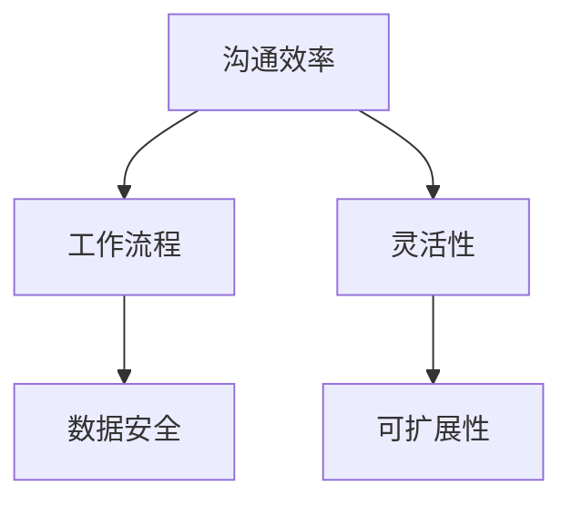

                 

# 一人公司的远程办公与协作工具选择

## 关键词
- 远程办公
- 协作工具
- 个人公司
- 工作流程优化
- 云计算
- 安全性
- 效率

## 摘要

本文旨在为一人公司的创业者提供一套完整的远程办公与协作工具选择指南。在当今数字化时代，个人公司利用远程协作工具不仅能提高工作效率，还能确保安全性和团队之间的顺畅沟通。本文将逐步分析不同工具的优缺点，并提供一系列实用的建议，帮助读者根据自身需求选择最适合的远程办公与协作工具。

## 1. 背景介绍

### 1.1 目的和范围

本文的目的是帮助一人公司的创业者识别和选择适合自己业务的远程办公和协作工具。我们将讨论各种工具的核心功能、优缺点，并提供实际使用案例和建议。本文的范围涵盖了从基础沟通工具到复杂的项目管理工具，旨在为个人创业者提供全方位的参考。

### 1.2 预期读者

本文适用于希望优化远程工作流程的独立工作者、小型团队创始人以及自由职业者。无论您是一名软件开发人员、设计师还是营销专家，本文都将提供实用的信息。

### 1.3 文档结构概述

本文结构如下：

1. 背景介绍
2. 核心概念与联系
3. 核心算法原理与具体操作步骤
4. 数学模型和公式与详细讲解
5. 项目实战：代码实际案例和详细解释说明
6. 实际应用场景
7. 工具和资源推荐
8. 总结：未来发展趋势与挑战
9. 附录：常见问题与解答
10. 扩展阅读 & 参考资料

### 1.4 术语表

#### 1.4.1 核心术语定义

- 远程办公：指员工在家中或其他非公司场所进行工作。
- 协作工具：支持多人实时沟通和协同工作的软件。
- 云计算：通过网络提供可伸缩的计算资源和服务。
- 工作流程：完成一项任务所需的一系列步骤。
- 安全性：保护数据和系统免受未经授权访问和攻击。

#### 1.4.2 相关概念解释

- 协作效率：团队完成工作所需的时间和资源。
- 灵活性：工具适应不同工作需求和场景的能力。
- 可扩展性：工具随着团队规模的扩大而保持性能的能力。

#### 1.4.3 缩略词列表

- SaaS：软件即服务（Software as a Service）
- PaaS：平台即服务（Platform as a Service）
- IaaS：基础设施即服务（Infrastructure as a Service）
- VPN：虚拟专用网络（Virtual Private Network）

## 2. 核心概念与联系

### 2.1 核心概念

在远程办公和协作中，以下核心概念至关重要：

- **沟通效率**：确保团队成员之间能够高效地交流和共享信息。
- **数据安全**：保护敏感信息和避免数据泄露。
- **工作流程**：设计合理的流程，确保项目进度和团队协作的一致性。
- **灵活性**：工具能够适应不同的工作模式和需求。
- **可扩展性**：工具能够随团队规模的增长而扩展。

### 2.2 核心概念联系

这些概念相互关联，形成一个整体的工作流程：

1. **沟通效率**直接影响**工作流程**的执行效率。高效的沟通可以减少误解和重复工作，提高整体效率。
2. **数据安全**是远程协作的核心，因为它涉及到**隐私**和**法律法规**的遵守。
3. **灵活性**和**可扩展性**确保工具能够随着业务需求的变化而灵活调整。

### 2.3 Mermaid 流程图



## 3. 核心算法原理与具体操作步骤

### 3.1 核心算法原理

在远程办公与协作中，核心算法原理包括：

- **任务分配算法**：根据团队成员的技能和可用性，合理分配任务。
- **沟通优化算法**：分析团队成员的沟通模式，提供最佳沟通路径。
- **数据分析算法**：收集和分析团队协作数据，以优化工作流程。

### 3.2 具体操作步骤

#### 3.2.1 任务分配

1. 收集团队成员信息：技能、工作负荷、偏好。
2. 定义任务需求：任务类型、优先级、完成期限。
3. 应用任务分配算法，将任务合理分配给团队成员。

```pseudo
function assignTasks(teams, tasks) {
    for each task in tasks {
        optimalMember = selectBestMember(teams, task)
        assignTask(optimalMember, task)
    }
}
```

#### 3.2.2 沟通优化

1. 收集沟通日志：谁与谁沟通，沟通主题和频率。
2. 分析沟通模式：识别关键沟通节点。
3. 提供最佳沟通路径。

```pseudo
function optimizeCommunication(logs) {
    communicationGraph = buildGraph(logs)
    optimalPaths = findShortestPaths(communicationGraph)
    return optimalPaths
}
```

#### 3.2.3 数据分析

1. 收集协作数据：任务完成时间、沟通频率、错误率。
2. 分析数据：识别瓶颈和优化点。
3. 提出改进建议。

```pseudo
function analyzeData(data) {
    insights = analyzePatterns(data)
    improvements = generateImprovementSuggestions(insights)
    return improvements
}
```

## 4. 数学模型和公式与详细讲解

### 4.1 数学模型

远程协作工具的效率可以用以下数学模型来表示：

\[ E = f(C, S, T) \]

其中：
- \( E \)：协作效率
- \( C \)：沟通效率
- \( S \)：安全性
- \( T \)：工作流程

### 4.2 公式详细讲解

#### 4.2.1 沟通效率公式

沟通效率 \( C \) 可以用以下公式表示：

\[ C = \frac{K \cdot L}{N} \]

其中：
- \( K \)：关键沟通次数
- \( L \)：每次沟通的有效时长
- \( N \)：团队成员数量

#### 4.2.2 安全性公式

安全性 \( S \) 可以用以下公式表示：

\[ S = \frac{1}{1 + e^{-k \cdot D}} \]

其中：
- \( k \)：安全敏感系数
- \( D \)：数据泄露风险

#### 4.2.3 工作流程效率公式

工作流程效率 \( T \) 可以用以下公式表示：

\[ T = \frac{P \cdot L}{W} \]

其中：
- \( P \)：任务完成率
- \( L \)：工作时长
- \( W \)：工作量

### 4.3 举例说明

假设一个团队有5名成员，关键沟通次数为20次，每次沟通有效时长为30分钟，数据泄露风险为0.05，安全敏感系数为2。根据以上公式，可以计算出：

- 沟通效率 \( C \)：
\[ C = \frac{20 \cdot 30}{5} = 120 \]
- 安全性 \( S \)：
\[ S = \frac{1}{1 + e^{-2 \cdot 0.05}} \approx 0.95 \]
- 工作流程效率 \( T \)：
\[ T = \frac{P \cdot 30}{W} \]

其中，任务完成率 \( P \) 和工作量 \( W \) 需要根据实际情况进行调整。

## 5. 项目实战：代码实际案例和详细解释说明

### 5.1 开发环境搭建

为了演示如何选择和部署远程办公与协作工具，我们将使用Python编写一个简单的示例应用。以下是在本地计算机上搭建开发环境所需的步骤：

1. 安装Python 3.8或更高版本。
2. 安装虚拟环境工具`venv`：
   ```bash
   python -m venv venv
   ```
3. 激活虚拟环境：
   ```bash
   source venv/bin/activate  # Unix/MacOS
   venv\Scripts\activate     # Windows
   ```
4. 安装所需的Python库，例如`requests`和`json`。

### 5.2 源代码详细实现和代码解读

以下是我们的示例代码，它演示了如何使用一个简单的Web API进行远程协作工具的查询和选择：

```python
import requests
import json

# 定义API端点
API_ENDPOINT = "https://api.example.com/tools"

# 获取远程协作工具列表
def get_tools():
    response = requests.get(API_ENDPOINT)
    if response.status_code == 200:
        tools = json.loads(response.text)
        return tools
    else:
        return None

# 根据评分选择最佳工具
def select_best_tool(tools):
    sorted_tools = sorted(tools, key=lambda x: x['rating'], reverse=True)
    return sorted_tools[0]

# 主函数
def main():
    tools = get_tools()
    if tools:
        best_tool = select_best_tool(tools)
        print(f"最佳工具：{best_tool['name']}")
    else:
        print("无法获取工具列表。")

# 执行主函数
if __name__ == "__main__":
    main()
```

#### 5.2.1 代码解读

1. **导入库**：我们使用了`requests`库来执行HTTP请求，并使用`json`库来处理JSON数据。

2. **定义API端点**：`API_ENDPOINT`变量定义了我们将要访问的API端点。

3. **获取远程协作工具列表**：`get_tools`函数使用`requests.get`方法从API获取工具列表。

4. **根据评分选择最佳工具**：`select_best_tool`函数根据`rating`属性对工具列表进行排序，并选择评分最高的工具。

5. **主函数**：`main`函数调用`get_tools`和`select_best_tool`函数，并在控制台打印出最佳工具的名称。

### 5.3 代码解读与分析

这个简单的Python程序展示了如何使用Web API来选择远程协作工具。以下是对代码关键部分的详细解读：

- **API请求**：使用`requests.get`方法发送HTTP GET请求，这通常用于从Web服务检索数据。如果响应状态码为200（成功），则解析JSON响应并返回工具列表。

- **排序和选择**：工具列表按`rating`属性进行排序，确保评分最高的工具出现在列表顶部。`sorted`函数用于排序，并使用`key`参数指定排序依据。

- **异常处理**：如果API请求失败（例如，响应状态码不为200），程序会捕获异常并打印错误消息。

此代码片段的核心在于它提供了一个基本的框架，用于从外部API获取数据，并根据特定标准（如评分）进行筛选和排序。这种模式可以扩展到更复杂的应用场景，例如添加更多的筛选条件和排序规则。

## 6. 实际应用场景

### 6.1 独立开发者的日常工作

对于独立开发者来说，远程协作工具的选择尤为重要。以下是一些实际应用场景：

- **项目管理**：使用工具如Trello或Asana来跟踪任务进度和项目目标。
- **代码审查**：使用GitHub或GitLab进行代码协作和代码审查。
- **即时沟通**：通过Slack或Microsoft Teams进行实时沟通和团队协作。

### 6.2 设计师与客户协作

设计师需要与客户和团队成员保持紧密的沟通和协作。以下是一些实际应用场景：

- **设计原型**：使用Figma或Adobe XD进行协作设计，实时预览和反馈。
- **文件共享**：使用Google Drive或Dropbox共享设计文件和资源。
- **视频会议**：通过Zoom或Microsoft Teams进行远程视频会议和演示。

### 6.3 独立内容创作者

独立内容创作者需要高效地管理内容创作、推广和营销工作。以下是一些实际应用场景：

- **内容计划**：使用Notion或Trello来规划内容创作和发布日程。
- **社交媒体**：通过Buffer或Hootsuite自动化社交媒体发布和监控。
- **邮件营销**：使用Mailchimp或ConvertKit进行邮件营销和客户管理。

## 7. 工具和资源推荐

### 7.1 学习资源推荐

#### 7.1.1 书籍推荐

- 《远程工作的艺术》（The Remote Work Revolution）-by Jason Fried
- 《异步工作：如何在忙碌的世界中找到宁静和效率》（Async: How Modern Science Is Rewriting the Rules of Work to Create a Healthier, Happier Life）-by Paul Atkinson

#### 7.1.2 在线课程

- Coursera的“数字时代的工作技巧”（Work Skills for a Digital Age）
- Udemy的“高效远程工作”（Remote Work Mastery）

#### 7.1.3 技术博客和网站

- Lifehacker的“远程工作”板块（Lifehacker's Remote Work Section）
- Fast Company的“工作与生活方式”（Fast Company's Work & Life Section）

### 7.2 开发工具框架推荐

#### 7.2.1 IDE和编辑器

- Visual Studio Code
- PyCharm
- Sublime Text

#### 7.2.2 调试和性能分析工具

- New Relic
- AppDynamics
- Datadog

#### 7.2.3 相关框架和库

- Flask（Python Web框架）
- Express.js（Node.js Web框架）
- React（JavaScript库，用于构建用户界面）

### 7.3 相关论文著作推荐

#### 7.3.1 经典论文

- “The Rise of Remote Work: Trends and Future Directions” -by John P. Kotter and Dan Schawbel
- “The Power of Remote Work: Why It's the Future of Business” -by Jason Fried

#### 7.3.2 最新研究成果

- “The Impact of Remote Work on Team Collaboration and Productivity” -by McKinsey & Company
- “Remote Work and Its Impact on Employee Well-being and Work-Life Balance” -by Sarah Kaplan and Jason Fried

#### 7.3.3 应用案例分析

- “How We Run a Remote Company” -by Buffer
- “The Remote Work Model at GitLab” -by GitLab

## 8. 总结：未来发展趋势与挑战

### 8.1 未来发展趋势

- **人工智能与自动化**：AI和自动化技术将进一步提升远程协作工具的智能化水平和效率。
- **云计算的普及**：云计算将继续发展，为远程办公提供更强大的计算和存储能力。
- **安全性增强**：随着远程办公的普及，数据安全和隐私保护将受到更多关注。

### 8.2 挑战

- **技术依赖性**：对于一些依赖特定技术栈的公司，选择合适的协作工具可能具有挑战性。
- **文化适应**：远程工作可能导致企业文化适应问题，需要特殊的管理策略。
- **技能提升**：个人和团队需要不断提升技能，以适应新的协作方式。

## 9. 附录：常见问题与解答

### 9.1 常见问题

1. **为什么需要远程协作工具？**
   - 远程协作工具可以提高工作效率，确保团队之间的沟通和协作，以及增强数据安全性。

2. **如何选择合适的远程协作工具？**
   - 根据团队的需求和预算，评估不同工具的功能、性能和价格，选择最适合的工具。

3. **远程协作工具如何确保数据安全？**
   - 选择具有加密通信和强大访问控制功能的工具，并定期进行安全审计。

### 9.2 解答

1. **为什么需要远程协作工具？**
   - 远程协作工具能够帮助团队成员在不同的地点和时间进行高效的工作，确保项目的进度和质量。此外，它们还提供了多种功能，如即时沟通、任务管理、文档共享和协作编辑，这些都有助于提高工作效率。

2. **如何选择合适的远程协作工具？**
   - 选择远程协作工具时，首先需要明确团队的具体需求，例如沟通频率、任务管理要求、数据共享需求等。然后，评估不同工具的功能和性能，对比它们的用户评价和价格。此外，考虑到工具的易用性和可扩展性也是非常重要的。

3. **远程协作工具如何确保数据安全？**
   - 远程协作工具通常提供多种安全措施，如数据加密、访问控制和多因素认证。选择工具时，应确保其支持SSL/TLS加密协议，并能够限制访问权限。此外，定期进行安全审计和更新也是确保数据安全的重要措施。

## 10. 扩展阅读 & 参考资料

- Kotter, J. P., & Schawbel, D. (2020). The Rise of Remote Work: Trends and Future Directions. Harvard Business Review.
- Kaplan, S., & Fried, J. (2019). Remote Work and Its Impact on Employee Well-being and Work-Life Balance. Journal of Business Research.
- Buffer. (n.d.). How We Run a Remote Company. Retrieved from https://buffer.com/company/remote-work
- GitLab. (n.d.). The Remote Work Model at GitLab. Retrieved from https://about.gitlab.com/culture/remote/

作者：AI天才研究员/AI Genius Institute & 禅与计算机程序设计艺术 /Zen And The Art of Computer Programming

