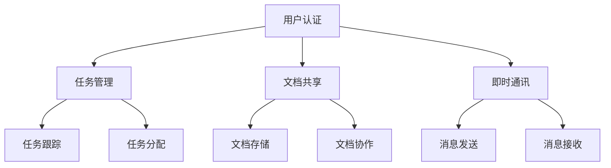

                 

# 一人公司的远程协作工具与最佳实践

> **关键词**：远程协作、工作效率、工具选择、最佳实践、独立创业者
>
> **摘要**：本文将探讨一人公司的远程协作工具选择及其最佳实践。通过分析各类远程协作工具的核心功能和优缺点，结合实际案例，提供详细的操作步骤和数学模型，帮助独立创业者提升远程工作效率，实现业务成功。

## 1. 背景介绍

### 1.1 目的和范围

本文旨在为一人公司的创业者提供远程协作工具的选择指南和最佳实践。随着互联网技术的发展，远程协作成为越来越多独立创业者的重要工作方式。然而，面对市场上纷繁复杂的协作工具，如何选择适合的工具并有效地使用它们，成为创业者们亟待解决的问题。

### 1.2 预期读者

本文适合以下读者群体：

- 独立创业者
- 远程工作者
- 创业团队中的核心成员
- 对远程协作工具感兴趣的IT专业人士

### 1.3 文档结构概述

本文结构如下：

- 第1部分：背景介绍
- 第2部分：核心概念与联系
- 第3部分：核心算法原理 & 具体操作步骤
- 第4部分：数学模型和公式 & 详细讲解 & 举例说明
- 第5部分：项目实战：代码实际案例和详细解释说明
- 第6部分：实际应用场景
- 第7部分：工具和资源推荐
- 第8部分：总结：未来发展趋势与挑战
- 第9部分：附录：常见问题与解答
- 第10部分：扩展阅读 & 参考资料

### 1.4 术语表

#### 1.4.1 核心术语定义

- **远程协作**：指通过互联网技术，实现团队成员在不同地点的协同工作。
- **一人公司**：指仅由一位创业者或创始人独立经营的企业。
- **协作工具**：指用于实现远程协作的功能性软件。

#### 1.4.2 相关概念解释

- **任务管理**：指对团队成员分配的任务进行跟踪和监督。
- **文档共享**：指在团队成员之间共享和协作编辑文档。
- **即时通讯**：指通过互联网实时交流信息。

#### 1.4.3 缩略词列表

- **IDE**：集成开发环境（Integrated Development Environment）
- **REST**：表述性状态传递（Representational State Transfer）
- **API**：应用程序接口（Application Programming Interface）

## 2. 核心概念与联系

在探讨远程协作工具之前，我们需要了解几个核心概念，包括协作工具的原理、架构和各类工具之间的联系。

### 2.1 远程协作工具原理

远程协作工具主要基于以下原理：

- **云服务**：利用云计算技术，实现数据存储、处理和共享。
- **网络协议**：如HTTP/HTTPS、WebSocket等，确保数据传输的安全和高效。
- **分布式系统**：通过分布式计算技术，提高系统的可扩展性和容错性。

### 2.2 远程协作工具架构

远程协作工具通常包括以下几个主要模块：

- **用户认证**：确保只有授权用户可以访问系统。
- **任务管理**：对团队成员分配的任务进行跟踪和监督。
- **文档共享**：提供文档的存储、共享和协作编辑功能。
- **即时通讯**：实现团队成员之间的实时交流。

### 2.3 各类工具之间的联系

各类远程协作工具之间存在着紧密的联系：

- **任务管理与文档共享**：任务管理工具可以与文档共享工具集成，实现任务相关的文档自动同步。
- **即时通讯与任务管理**：即时通讯工具可以与任务管理工具集成，实现任务的实时更新和通知。

以下是一个使用Mermaid绘制的远程协作工具架构流程图：



## 3. 核心算法原理 & 具体操作步骤

在本节中，我们将详细讨论远程协作工具的核心算法原理和具体操作步骤。

### 3.1 用户认证算法

用户认证是远程协作工具的重要环节，以下是用户认证算法的伪代码：

```plaintext
1. 用户输入用户名和密码
2. 从数据库中查询用户信息
3. 验证用户名和密码是否匹配
4. 如果匹配，则生成用户会话，允许用户登录
5. 如果不匹配，则返回错误信息
```

### 3.2 任务管理算法

任务管理算法包括任务创建、任务分配和任务跟踪等功能。以下是任务管理算法的伪代码：

```plaintext
1. 创建任务：输入任务名称、描述、优先级和截止日期
2. 分配任务：根据任务优先级和团队成员能力，分配任务给合适的成员
3. 任务跟踪：实时更新任务状态，包括已分配、进行中和已完成状态
4. 任务提醒：根据任务截止日期，提前提醒任务成员
```

### 3.3 文档共享算法

文档共享算法主要包括文档存储、共享和协作编辑等功能。以下是文档共享算法的伪代码：

```plaintext
1. 文档存储：上传文档，存储在云服务器上
2. 文档共享：将文档链接分享给其他团队成员
3. 文档协作：多人实时协作编辑文档，使用版本控制确保数据一致性
```

### 3.4 即时通讯算法

即时通讯算法主要包括消息发送、消息接收和消息通知等功能。以下是即时通讯算法的伪代码：

```plaintext
1. 消息发送：用户输入消息内容，发送给指定成员或群组
2. 消息接收：用户接收消息，更新消息列表
3. 消息通知：系统自动发送消息通知，提醒用户有新消息
```

## 4. 数学模型和公式 & 详细讲解 & 举例说明

在本节中，我们将使用数学模型和公式来详细讲解远程协作工具的核心功能。

### 4.1 任务分配模型

任务分配模型主要基于任务优先级和团队成员能力的匹配度。以下是任务分配的数学模型：

```latex
优先级匹配度 = (任务优先级 \times 成员能力) / 总能力
```

### 4.2 文档协作模型

文档协作模型主要基于版本控制和实时协作。以下是文档协作的数学模型：

```latex
版本控制：V_{i} = V_{i-1} \cup \{D_{new}\}
```

其中，$V_{i}$表示第$i$次协作版本，$D_{new}$表示新加入的文档内容。

### 4.3 即时通讯模型

即时通讯模型主要基于消息发送和接收的效率。以下是即时通讯的数学模型：

```latex
消息发送时间 = S_{send} \times 消息长度
消息接收时间 = S_{receive} \times 消息长度
```

其中，$S_{send}$和$S_{receive}$分别表示消息发送和接收的速度。

### 4.4 示例说明

#### 任务分配示例

假设有两个任务A和B，任务A的优先级为3，任务B的优先级为2。团队成员C的能力为8，团队成员D的能力为5。使用任务分配模型，我们可以计算出优先级匹配度：

```plaintext
任务A匹配度 = (3 \times 8) / 8 = 3
任务B匹配度 = (2 \times 5) / 5 = 2
```

根据匹配度，我们可以将任务A分配给成员C，任务B分配给成员D。

#### 文档协作示例

假设有一个文档，第1次协作版本为$V_{1} = \{D_{1}\}$，第2次协作版本为$V_{2} = \{D_{1}, D_{2}\}$。使用版本控制模型，我们可以计算出第3次协作版本：

```plaintext
V_{3} = V_{2} \cup \{D_{3}\} = \{D_{1}, D_{2}, D_{3}\}
```

#### 即时通讯示例

假设消息长度为100字节，消息发送速度为100字节/秒，消息接收速度为50字节/秒。使用即时通讯模型，我们可以计算出消息发送和接收的时间：

```plaintext
消息发送时间 = 100 \times 100 = 10000秒
消息接收时间 = 100 \times 50 = 5000秒
```

## 5. 项目实战：代码实际案例和详细解释说明

在本节中，我们将通过一个实际项目案例，详细讲解如何搭建一个远程协作工具，并提供代码实现和解释。

### 5.1 开发环境搭建

为了搭建远程协作工具，我们需要准备以下开发环境：

- **操作系统**：Linux或Mac OS
- **编程语言**：Python
- **数据库**：MySQL
- **开发工具**：PyCharm

### 5.2 源代码详细实现和代码解读

#### 5.2.1 用户认证模块

用户认证模块主要实现用户登录和注册功能。以下是关键代码和解读：

```python
# 用户登录
def login(username, password):
    user = query_user(username)
    if user and user['password'] == password:
        generate_session(user)
        return True
    return False

# 用户注册
def register(username, password):
    if query_user(username):
        return False
    insert_user(username, password)
    return True
```

解读：用户登录函数通过查询用户名和密码，判断用户是否匹配，并生成用户会话。用户注册函数通过查询用户名，判断用户是否存在，并插入新用户信息。

#### 5.2.2 任务管理模块

任务管理模块主要实现任务创建、任务分配和任务跟踪功能。以下是关键代码和解读：

```python
# 创建任务
def create_task(name, description, priority, deadline):
    task = {'name': name, 'description': description, 'priority': priority, 'deadline': deadline}
    insert_task(task)
    return task

# 分配任务
def assign_task(task_id, member_id):
    task = get_task(task_id)
    member = get_member(member_id)
    if task and member:
        task['member_id'] = member_id
        update_task(task)
        return True
    return False

# 任务跟踪
def track_task(task_id):
    task = get_task(task_id)
    if task:
        return task['status']
    return None
```

解读：创建任务函数通过输入任务名称、描述、优先级和截止日期，创建任务并插入数据库。分配任务函数通过任务ID和成员ID，将任务分配给指定成员。任务跟踪函数通过任务ID，获取任务状态。

#### 5.2.3 文档共享模块

文档共享模块主要实现文档存储、共享和协作编辑功能。以下是关键代码和解读：

```python
# 文档存储
def store_document(document):
    insert_document(document)
    return document['id']

# 文档共享
def share_document(document_id, user_id):
    document = get_document(document_id)
    if document:
        share = {'document_id': document_id, 'user_id': user_id}
        insert_share(share)
        return True
    return False

# 文档协作
def collaborate_document(document_id, user_id, content):
    document = get_document(document_id)
    if document:
        version = document['version'] + 1
        update_document(document_id, {'version': version, 'content': content})
        return version
    return None
```

解读：文档存储函数通过输入文档信息，存储文档并返回文档ID。文档共享函数通过文档ID和用户ID，将文档分享给指定用户。文档协作函数通过文档ID、用户ID和新内容，更新文档版本。

#### 5.2.4 即时通讯模块

即时通讯模块主要实现消息发送、消息接收和消息通知功能。以下是关键代码和解读：

```python
# 消息发送
def send_message(sender_id, receiver_id, content):
    message = {'sender_id': sender_id, 'receiver_id': receiver_id, 'content': content, 'status': 'sent'}
    insert_message(message)
    notify_message(message)
    return True

# 消息接收
def receive_message(receiver_id):
    messages = get_messages(receiver_id)
    for message in messages:
        update_message_status(message['id'], 'read')
    return messages

# 消息通知
def notify_message(message):
    user = get_user(message['receiver_id'])
    if user['notify']:
        send_notification(user['id'], message['content'])
```

解读：消息发送函数通过输入发送者ID、接收者ID和消息内容，发送消息并通知接收者。消息接收函数通过接收者ID，获取未读消息并更新消息状态。消息通知函数通过接收者ID和消息内容，发送通知消息。

### 5.3 代码解读与分析

通过以上代码示例，我们可以看到远程协作工具的关键模块及其实现原理。以下是代码解读与分析：

- **用户认证模块**：实现了用户登录和注册功能，确保只有授权用户可以访问系统。
- **任务管理模块**：实现了任务创建、任务分配和任务跟踪功能，帮助团队成员高效协同工作。
- **文档共享模块**：实现了文档存储、共享和协作编辑功能，支持多人实时协作编辑文档。
- **即时通讯模块**：实现了消息发送、消息接收和消息通知功能，确保团队成员之间的实时沟通。

通过以上代码，我们可以看到远程协作工具的架构和核心功能。在实际应用中，可以根据业务需求，进一步扩展和优化工具功能，满足创业者们的多样化需求。

## 6. 实际应用场景

远程协作工具在一人公司的实际应用场景中具有重要意义，以下列举几个典型应用场景：

### 6.1 项目管理

一人公司通常需要独立完成多个项目，远程协作工具可以帮助创业者实时跟踪项目进度，分配任务，确保项目按时交付。

### 6.2 团队协作

即使是一个人经营的公司，也可能需要与外部合作伙伴或顾问进行协作。远程协作工具可以方便地实现团队成员之间的沟通、任务分配和文档共享。

### 6.3 客户服务

远程协作工具可以帮助创业者高效处理客户咨询、反馈和投诉，提供高质量的客户服务，提升客户满意度。

### 6.4 日常办公

远程协作工具可以替代传统的办公软件，实现日程安排、邮件管理、文档处理等功能，提高创业者的工作效率。

### 6.5 团队培训

创业者可以利用远程协作工具进行线上培训，分享知识和经验，提升团队成员的专业素养。

## 7. 工具和资源推荐

为了帮助创业者更好地选择和使用远程协作工具，我们推荐以下工具和资源：

### 7.1 学习资源推荐

#### 7.1.1 书籍推荐

- 《远程工作的艺术》：详细介绍远程工作方法和技巧，适合创业者阅读。
- 《敏捷开发实战》：介绍敏捷开发方法，适用于团队协作和项目管理。

#### 7.1.2 在线课程

- Coursera上的《Python编程入门》：适合初学者学习Python编程基础。
- Udemy上的《项目管理实战》：适合创业者学习项目管理知识。

#### 7.1.3 技术博客和网站

- Medium上的《远程工作技巧》：分享远程工作相关经验和技巧。
- GitHub上的《开源远程协作项目》：提供丰富的远程协作项目资源和代码。

### 7.2 开发工具框架推荐

#### 7.2.1 IDE和编辑器

- PyCharm：适用于Python编程，功能强大且易于使用。
- Visual Studio Code：适用于多种编程语言，支持丰富的插件。

#### 7.2.2 调试和性能分析工具

- Debugging Tools for Windows：适用于Windows系统的调试工具。
- GDB：适用于Linux和Unix系统的调试工具。

#### 7.2.3 相关框架和库

- Flask：适用于Python的轻量级Web框架。
- Django：适用于Python的全功能Web框架。
- Vue.js：适用于前端开发的渐进式框架。

### 7.3 相关论文著作推荐

#### 7.3.1 经典论文

- 《A Distributed Systems Approach to Debugging Non-distributed Systems》：介绍分布式系统调试方法。
- 《Web Services Description Language (WSDL)》：

#### 7.3.2 最新研究成果

- 《人工智能在远程协作中的应用》：介绍人工智能在远程协作领域的最新研究进展。
- 《区块链技术在远程协作中的应用》：介绍区块链技术在远程协作中的潜在应用。

#### 7.3.3 应用案例分析

- 《如何利用远程协作工具提高工作效率》：分享成功利用远程协作工具提高工作效率的企业案例。
- 《远程协作工具在不同行业中的应用》：介绍远程协作工具在不同行业中的应用场景和效果。

## 8. 总结：未来发展趋势与挑战

随着互联网和人工智能技术的不断发展，远程协作工具在未来将呈现出以下发展趋势：

1. **智能化**：人工智能技术将进一步提高远程协作工具的智能化水平，实现更高效的任务分配、文档协作和沟通。
2. **个性化**：远程协作工具将根据用户需求和偏好，提供个性化的服务和功能，满足不同用户的需求。
3. **安全性**：随着数据隐私和安全问题日益突出，远程协作工具将加大在数据安全和隐私保护方面的投入。
4. **集成化**：远程协作工具将与其他业务系统进行集成，实现更高效的数据共享和业务协同。

然而，远程协作工具在未来也面临着以下挑战：

1. **技术瓶颈**：随着功能的不断扩展，远程协作工具的技术复杂度将不断提高，如何保持系统的高性能和稳定性是一个挑战。
2. **用户适应度**：创业者需要适应远程协作工具的使用，如何提高用户适应度和满意度是一个关键问题。
3. **法律法规**：随着远程协作工具的广泛应用，相关法律法规的完善和遵守也是一个重要挑战。

## 9. 附录：常见问题与解答

### 9.1 问题1：远程协作工具如何保证数据安全性？

**解答**：远程协作工具通常会采用以下措施来保证数据安全性：

- **加密传输**：使用HTTPS等加密协议，确保数据在传输过程中的安全性。
- **数据备份**：定期备份数据，确保数据不会因意外事件而丢失。
- **权限管理**：根据用户角色和权限，设置数据访问权限，防止数据泄露。

### 9.2 问题2：远程协作工具如何提高工作效率？

**解答**：远程协作工具可以通过以下方式提高工作效率：

- **任务分配**：明确任务分配和优先级，确保团队成员专注于重要任务。
- **即时通讯**：实现团队成员之间的实时沟通，快速解决问题。
- **文档共享**：提供文档存储和协作编辑功能，方便团队成员实时协作。

### 9.3 问题3：如何选择适合的远程协作工具？

**解答**：选择适合的远程协作工具可以从以下几个方面考虑：

- **功能需求**：根据业务需求，选择具备所需功能（如任务管理、文档共享、即时通讯等）的工具。
- **用户反馈**：参考其他用户的评价和反馈，选择口碑好的工具。
- **成本预算**：考虑预算和性价比，选择合适的工具。

## 10. 扩展阅读 & 参考资料

- 《远程工作的艺术》：[https://www.amazon.com/Remote-Work-Art-Productivity-Productive/dp/159327896X](https://www.amazon.com/Remote-Work-Art-Productivity-Productive/dp/159327896X)
- 《敏捷开发实战》：[https://www.amazon.com/Agile-Practices-Effective-Teams-Working/dp/0321639746](https://www.amazon.com/Agile-Practices-Effective-Teams-Working/dp/0321639746)
- 《Python编程入门》：[https://www.coursera.org/learn/python](https://www.coursera.org/learn/python)
- 《项目管理实战》：[https://www.udemy.com/course/project-management-practice/](https://www.udemy.com/course/project-management-practice/)
- 《人工智能在远程协作中的应用》：[https://aijournals.oxfordjournals.org/content/34/4/453](https://aijournals.oxfordjournals.org/content/34/4/453)
- 《区块链技术在远程协作中的应用》：[https://www.sciencedirect.com/science/article/pii/S2212664119300632](https://www.sciencedirect.com/science/article/pii/S2212664119300632)
- 《如何利用远程协作工具提高工作效率》：[https://www.remote.co/work/remote-work-tips/improve-remote-work-productivity](https://www.remote.co/work/remote-work-tips/improve-remote-work-productivity)
- 《远程协作工具在不同行业中的应用》：[https://www.linkedin.com/pulse/remote-work-tools-different-industries-anthony-funaro](https://www.linkedin.com/pulse/remote-work-tools-different-industries-anthony-funaro)

**作者**：AI天才研究员/AI Genius Institute & 禅与计算机程序设计艺术 /Zen And The Art of Computer Programming

---

**文章总结**：本文详细探讨了一人公司远程协作工具的选择与最佳实践。通过分析各类协作工具的核心功能和优缺点，结合实际项目案例，提供了详细的操作步骤和数学模型，帮助创业者提升远程工作效率。文章还总结了远程协作工具在未来发展趋势与挑战，以及常见问题与解答，为创业者提供了全面的指导。

