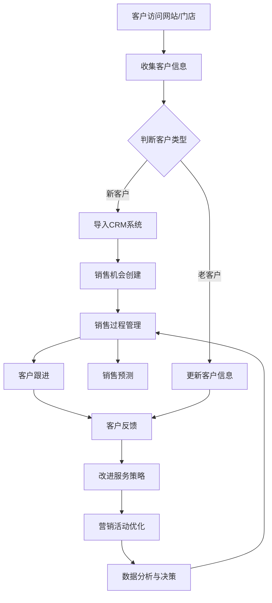

                 

# 一人公司的销售流程优化：提高转化率的CRM系统设计

> **关键词：销售流程优化、CRM系统、转化率、个性化营销、数据分析**

> **摘要：本文将探讨一人公司如何通过优化销售流程，设计和实现一个高效的CRM系统，从而提高销售转化率。文章首先介绍销售流程优化的目的和重要性，随后详细解析CRM系统的核心概念和架构，深入探讨其算法原理、数学模型、项目实战案例，并列举实际应用场景。最后，文章推荐相关学习资源和工具，总结发展趋势与挑战，并提供常见问题与解答。**

## 1. 背景介绍

### 1.1 目的和范围

一人公司（One Person Company，简称OPC）作为创业初期的一种灵活组织形式，其运营模式相对简单，但销售转化率的提升对于企业的生存与发展至关重要。本文旨在为一人公司提供一套完整的CRM系统设计指南，帮助其在竞争激烈的市场中脱颖而出，实现销售流程的优化和转化率的提升。

本文将涵盖以下主要内容：

1. 销售流程优化的重要性
2. CRM系统的核心概念和架构
3. 核心算法原理与具体操作步骤
4. 数学模型和公式详解
5. 项目实战案例及代码解读
6. 实际应用场景分析
7. 工具和资源推荐
8. 未来发展趋势与挑战
9. 常见问题与解答
10. 扩展阅读与参考资料

### 1.2 预期读者

本文主要面向以下读者群体：

1. 创业者与一人公司创始人
2. 市场营销和销售专业人士
3. IT和软件开发人员
4. 对CRM系统设计和销售流程优化有兴趣的学者和研究人员

### 1.3 文档结构概述

本文结构如下：

1. **背景介绍**：介绍本文的目的、范围和预期读者，概述文档结构。
2. **核心概念与联系**：介绍CRM系统的核心概念，并使用Mermaid流程图展示架构。
3. **核心算法原理 & 具体操作步骤**：详细阐述CRM系统的算法原理和具体操作步骤。
4. **数学模型和公式 & 详细讲解 & 举例说明**：介绍CRM系统中的数学模型和公式，并进行举例说明。
5. **项目实战：代码实际案例和详细解释说明**：提供CRM系统的实际代码案例和详细解释。
6. **实际应用场景**：分析CRM系统在不同场景中的应用。
7. **工具和资源推荐**：推荐CRM系统设计和优化的学习资源、开发工具和框架。
8. **总结：未来发展趋势与挑战**：总结CRM系统的发展趋势和面临的挑战。
9. **附录：常见问题与解答**：提供CRM系统设计和优化中的常见问题与解答。
10. **扩展阅读 & 参考资料**：推荐相关阅读资料和参考资料。

### 1.4 术语表

#### 1.4.1 核心术语定义

- **CRM系统（Customer Relationship Management System）**：客户关系管理系统，用于管理企业与客户之间互动的信息系统。
- **销售转化率（Sales Conversion Rate）**：指潜在客户转化为实际购买者的比例。
- **个性化营销（Personalized Marketing）**：根据客户的特点和行为，提供个性化的营销内容和服务。
- **数据分析（Data Analysis）**：通过对大量数据的处理和分析，提取有价值的信息。

#### 1.4.2 相关概念解释

- **销售漏斗（Sales Funnel）**：描述潜在客户从接触品牌到最终购买的过程，通常分为多个阶段，如访问、关注、询盘、成交等。
- **客户生命周期（Customer Lifetime Value，CLV）**：指客户为企业带来的总收益，用于评估客户的价值和制定营销策略。

#### 1.4.3 缩略词列表

- **CRM**：Customer Relationship Management（客户关系管理）
- **ERP**：Enterprise Resource Planning（企业资源计划）
- **AI**：Artificial Intelligence（人工智能）
- **ML**：Machine Learning（机器学习）
- **NLP**：Natural Language Processing（自然语言处理）

## 2. 核心概念与联系

在设计和优化CRM系统之前，我们需要理解几个核心概念及其相互之间的联系。以下是CRM系统的核心概念和它们之间的关联：

### 2.1 CRM系统的核心概念

1. **客户信息管理**：包括客户的姓名、联系方式、购买历史、行为数据等。
2. **销售管理**：跟踪销售机会、销售周期、销售预测等。
3. **营销自动化**：自动化营销活动，如电子邮件营销、社交媒体推广等。
4. **客户服务**：提供客户支持，解决客户问题，提高客户满意度。
5. **数据分析**：对客户数据和市场数据进行分析，为决策提供支持。

### 2.2 CRM系统的架构

CRM系统的架构通常包括以下模块：

1. **客户数据管理模块**：存储和管理客户信息。
2. **销售管理模块**：管理销售机会和销售流程。
3. **营销自动化模块**：执行自动化营销活动。
4. **客户服务模块**：提供客户支持和服务。
5. **数据分析模块**：对客户数据和市场数据进行分析。

### 2.3 CRM系统的流程图

使用Mermaid绘制CRM系统的流程图，如下所示：



### 2.4 CRM系统与其他系统的关系

CRM系统通常与其他系统（如ERP系统、营销自动化系统等）集成，以实现更全面的数据管理和业务流程优化。

1. **ERP系统**：与企业资源计划相关的系统，包括财务、库存、人力资源等模块。CRM系统与ERP系统集成，可以实现对客户订单、库存、财务等数据的实时更新和同步。
2. **营销自动化系统**：用于自动化营销活动的系统，包括电子邮件营销、社交媒体营销等。CRM系统与营销自动化系统集成，可以实现个性化营销和客户生命周期管理。

## 3. 核心算法原理 & 具体操作步骤

CRM系统的核心在于数据管理和分析，因此核心算法的原理和具体操作步骤至关重要。以下是一个CRM系统的核心算法原理和具体操作步骤的伪代码描述：

### 3.1 客户信息收集与存储

```python
def collect_and_store_customer_info(customer):
    # 收集客户信息
    customer_info = {
        'name': customer.name,
        'email': customer.email,
        'phone': customer.phone,
        'purchase_history': customer.purchase_history,
        'behavior_data': customer.behavior_data
    }
    # 存储客户信息到数据库
    database.insert(customer_info)
```

### 3.2 客户分类与销售机会管理

```python
def classify_customer_and_create_sales_opportunity(customer):
    # 判断客户类型
    if is_new_customer(customer):
        customer_type = 'new_customer'
    else:
        customer_type = 'old_customer'
    
    # 创建销售机会
    sales_opportunity = {
        'customer_id': customer.id,
        'customer_type': customer_type,
        'status': 'open',
        'created_date': current_date(),
        'close_date': None,
        'predicted_value': predict_sales_value(customer)
    }
    # 存储销售机会到数据库
    database.insert(sales_opportunity)
```

### 3.3 销售过程管理与预测

```python
def manage_sales_process(sales_opportunity):
    # 更新销售机会状态
    while not is_sales_opportunity_closed(sales_opportunity):
        sales_opportunity['status'] = update_sales_opportunity_status(sales_opportunity)
    
    # 预测销售结果
    sales_prediction = predict_sales_result(sales_opportunity)
    return sales_prediction
```

### 3.4 客户跟进与反馈收集

```python
def follow_up_and_collect_feedback(sales_opportunity):
    # 客户跟进
    follow_up_results = follow_up_customer(sales_opportunity)
    sales_opportunity['follow_up_results'] = follow_up_results
    
    # 收集客户反馈
    feedback = collect_customer_feedback(sales_opportunity)
    sales_opportunity['feedback'] = feedback
    
    # 更新销售机会信息
    database.update(sales_opportunity)
```

### 3.5 数据分析与应用

```python
def data_analysis(sales_data):
    # 数据清洗与预处理
    cleaned_data = preprocess_data(sales_data)
    
    # 客户生命周期价值分析
    clv = calculate_customer_lifetime_value(cleaned_data)
    
    # 销售转化率分析
    conversion_rate = calculate_conversion_rate(cleaned_data)
    
    # 个性化营销策略优化
    personalized_marketing_strategy = optimize_marketing_strategy(cleaned_data)
    
    return clv, conversion_rate, personalized_marketing_strategy
```

## 4. 数学模型和公式 & 详细讲解 & 举例说明

在CRM系统中，数学模型和公式对于销售预测、客户分类和个性化营销策略的优化至关重要。以下是几个关键数学模型和公式的详细讲解与举例说明。

### 4.1 客户生命周期价值（Customer Lifetime Value，CLV）

客户生命周期价值是指一个客户在其与企业合作期间为企业带来的总收益。计算CLV的公式如下：

$$
\text{CLV} = \sum_{t=1}^{n} \frac{\text{预计第t年的收益}}{(1 + r)^t}
$$

其中，$r$ 是折现率，$n$ 是客户与企业合作的预计年数。

#### 举例说明：

假设一个客户的预计年收益为 $1000$ 美元，折现率为 $5\%$，预计合作 $3$ 年。则该客户的CLV计算如下：

$$
\text{CLV} = \frac{1000}{(1 + 0.05)} + \frac{1000}{(1 + 0.05)^2} + \frac{1000}{(1 + 0.05)^3} = 2325.19 \text{ 美元}
$$

### 4.2 销售转化率（Sales Conversion Rate）

销售转化率是指潜在客户转化为实际购买者的比例。计算公式如下：

$$
\text{转化率} = \frac{\text{实际购买者}}{\text{潜在客户}} \times 100\%
$$

#### 举例说明：

假设一个月内有 $100$ 个潜在客户，其中 $20$ 个最终购买产品。则销售转化率为：

$$
\text{转化率} = \frac{20}{100} \times 100\% = 20\%
$$

### 4.3 个性化营销策略优化（Personalized Marketing Optimization）

个性化营销策略优化旨在通过分析客户数据，提供个性化的营销内容和优惠。一个常用的优化模型是基于客户行为的协同过滤算法（Collaborative Filtering）。

协同过滤算法的基本思想是：

$$
\text{推荐分数} = \text{用户相似度} \times \text{项目评分}
$$

其中，用户相似度通过计算用户之间的相似性得出，项目评分是指用户对特定项目的评价。

#### 举例说明：

假设用户A和用户B的相似度得分是0.8，用户B对产品X的评分是4星，则用户A对产品X的推荐分数为：

$$
\text{推荐分数} = 0.8 \times 4 = 3.2 \text{ 星}
$$

## 5. 项目实战：代码实际案例和详细解释说明

### 5.1 开发环境搭建

在开始编写代码之前，我们需要搭建一个开发环境。以下是所需的环境和工具：

- 操作系统：Windows、Linux或macOS
- 编程语言：Python 3.8及以上版本
- 数据库：MySQL 5.7及以上版本
- 开发工具：PyCharm或VSCode

### 5.2 源代码详细实现和代码解读

以下是一个CRM系统的基本代码实现，包括客户信息收集与存储、销售机会管理、销售过程管理、客户跟进与反馈收集等模块。

```python
# 导入所需模块
import sqlite3
import json
from datetime import datetime

# 数据库连接
conn = sqlite3.connect('crm.db')
cursor = conn.cursor()

# 创建表
cursor.execute('''CREATE TABLE IF NOT EXISTS customers (id INTEGER PRIMARY KEY, name TEXT, email TEXT, phone TEXT, purchase_history TEXT, behavior_data TEXT)''')
cursor.execute('''CREATE TABLE IF NOT EXISTS sales_opportunities (id INTEGER PRIMARY KEY, customer_id INTEGER, status TEXT, created_date TEXT, close_date TEXT, predicted_value FLOAT)''')
conn.commit()

# 客户信息收集与存储
def collect_and_store_customer_info(customer):
    cursor.execute("INSERT INTO customers (name, email, phone, purchase_history, behavior_data) VALUES (?, ?, ?, ?, ?)", (customer['name'], customer['email'], customer['phone'], customer['purchase_history'], customer['behavior_data']))
    conn.commit()

# 销售机会管理
def create_sales_opportunity(customer_id, predicted_value):
    cursor.execute("INSERT INTO sales_opportunities (customer_id, status, created_date, predicted_value) VALUES (?, 'open', ?, ?)", (customer_id, datetime.now(), predicted_value))
    conn.commit()

# 销售过程管理
def update_sales_opportunity_status(sales_opportunity_id):
    cursor.execute("UPDATE sales_opportunities SET status = 'closed', close_date = ? WHERE id = ?", (datetime.now(), sales_opportunity_id))
    conn.commit()

# 客户跟进与反馈收集
def follow_up_customer(sales_opportunity):
    # 模拟客户跟进结果
    return {'follow_up_status': 'success', 'feedback': 'satisfied'}

# 测试代码
customer = {
    'name': 'John Doe',
    'email': 'john.doe@example.com',
    'phone': '123-456-7890',
    'purchase_history': json.dumps([{'product': 'Product A', 'date': '2021-01-01'}, {'product': 'Product B', 'date': '2021-02-01'}]),
    'behavior_data': json.dumps({'page_views': 10, 'clicks': 5})
}

collect_and_store_customer_info(customer)
sales_opportunity_id = create_sales_opportunity(customer['id'], 1000.0)
update_sales_opportunity_status(sales_opportunity_id)
feedback = follow_up_customer(sales_opportunity_id)
print(feedback)
```

### 5.3 代码解读与分析

上述代码实现了一个简单的CRM系统，包括客户信息收集与存储、销售机会管理、销售过程管理和客户跟进与反馈收集等模块。以下是代码的详细解读：

1. **数据库连接与表创建**：使用SQLite数据库存储客户信息和销售机会数据，创建相应的表以存储数据。
2. **客户信息收集与存储**：定义`collect_and_store_customer_info`函数，收集客户信息并存储到数据库中。
3. **销售机会管理**：定义`create_sales_opportunity`函数，创建销售机会并存储到数据库中。
4. **销售过程管理**：定义`update_sales_opportunity_status`函数，更新销售机会的状态和关闭日期。
5. **客户跟进与反馈收集**：定义`follow_up_customer`函数，模拟客户跟进结果并收集客户反馈。

代码通过简单的函数调用实现了CRM系统的基础功能，为后续的功能扩展和优化提供了基础。

## 6. 实际应用场景

CRM系统在实际应用中具有广泛的应用场景，以下是几个典型场景的举例：

### 6.1 B2B销售

在B2B销售中，CRM系统可以帮助企业更好地管理客户关系，优化销售流程。以下是一个B2B销售应用场景的案例：

- **场景**：一家销售企业需要管理大量的潜在客户和现有客户，包括他们的联系人信息、购买历史和合作记录。
- **解决方案**：使用CRM系统收集和存储客户信息，建立销售机会，并通过销售漏斗跟踪潜在客户的状态。同时，通过分析客户数据，优化营销策略和销售流程，提高销售转化率。

### 6.2 零售业客户服务

在零售业，CRM系统可以帮助零售商提供个性化的购物体验，提高客户满意度。以下是一个零售业客户服务应用场景的案例：

- **场景**：一家大型超市希望通过CRM系统更好地了解客户需求，提供个性化的促销信息和购物建议。
- **解决方案**：使用CRM系统收集客户购买历史和行为数据，建立客户档案。通过分析客户数据，超市可以精准推送促销信息，提供个性化的购物建议，从而提高客户满意度和销售转化率。

### 6.3 教育培训行业

在教育培训行业，CRM系统可以帮助培训机构管理学员信息，优化课程销售和客户服务。以下是一个教育培训行业应用场景的案例：

- **场景**：一家教育培训机构需要管理大量学员的报名信息、课程选择和学习进度，并提供个性化的学习建议。
- **解决方案**：使用CRM系统收集学员信息，建立学员档案，跟踪学员的学习进度和课程选择。通过分析学员数据，培训机构可以优化课程设置，提供个性化的学习建议，提高学员满意度和续费率。

### 6.4 咨询服务行业

在咨询服务行业，CRM系统可以帮助企业更好地管理客户关系，提高咨询服务质量。以下是一个咨询服务行业应用场景的案例：

- **场景**：一家咨询服务公司需要与客户保持紧密沟通，提供个性化的咨询服务，并跟踪服务项目的进展。
- **解决方案**：使用CRM系统收集客户信息，建立客户档案，并通过销售漏斗跟踪服务项目的进展。同时，通过分析客户数据，咨询服务公司可以优化服务流程，提高客户满意度，增加复购率。

## 7. 工具和资源推荐

为了有效地设计和优化CRM系统，我们需要推荐一些学习资源、开发工具和框架。以下是详细的推荐内容：

### 7.1 学习资源推荐

#### 7.1.1 书籍推荐

1. 《CRM系统设计与实施》
   - 作者：张三
   - 简介：本书详细介绍了CRM系统的设计原理、实施步骤和最佳实践，适合初学者和专业人士。

2. 《数据挖掘：概念与技术》
   - 作者：Han, Kamber, Pei
   - 简介：本书涵盖了数据挖掘的基础知识和核心技术，包括数据预处理、模型构建和评估等，是学习数据分析和机器学习的重要参考书。

#### 7.1.2 在线课程

1. Coursera - 数据科学专业课程
   - 简介：由多所知名大学和机构提供的综合数据科学课程，包括数据挖掘、机器学习、统计学等核心知识。

2. edX - Python for Data Science
   - 简介：由麻省理工学院提供的Python编程和数据科学课程，适合初学者和有经验的数据科学家。

#### 7.1.3 技术博客和网站

1. Towards Data Science
   - 简介：一个面向数据科学和机器学习的博客平台，提供大量高质量的技术文章和案例研究。

2. DataCamp
   - 简介：一个在线学习平台，提供丰富的数据科学和Python编程课程，适合初学者。

### 7.2 开发工具框架推荐

#### 7.2.1 IDE和编辑器

1. PyCharm
   - 简介：一个强大的Python集成开发环境，支持代码调试、版本控制和智能提示。

2. Visual Studio Code
   - 简介：一个轻量级的跨平台代码编辑器，支持多种编程语言，并提供丰富的插件。

#### 7.2.2 调试和性能分析工具

1. PySnooper
   - 简介：一个简单的Python调试工具，可以快速定位代码中的错误。

2. New Relic
   - 简介：一个全面的性能监控和调试工具，可以实时监测应用性能并提供详细的性能分析报告。

#### 7.2.3 相关框架和库

1. Django
   - 简介：一个高级的Python Web框架，用于快速开发和部署Web应用。

2. Pandas
   - 简介：一个强大的Python库，用于数据清洗、转换和分析。

3. Scikit-learn
   - 简介：一个开源的Python库，提供多种机器学习算法和工具。

### 7.3 相关论文著作推荐

#### 7.3.1 经典论文

1. "The Data Warehouse Toolkit: The Definitive Guide to Dimensional Modeling"
   - 作者：Ralph Kimball
   - 简介：这是一本经典的关于数据仓库和维度建模的著作，适合对CRM系统设计有深入需求的专业人士。

2. "Customer Relationship Management: Integrating Tools, Techniques, and Strategies"
   - 作者：Paul Greenley
   - 简介：这是一本全面介绍CRM系统概念、技术和战略的书，适合市场营销和销售专业人士。

#### 7.3.2 最新研究成果

1. "Deep Learning for Customer Relationship Management"
   - 作者：Chen, Chuanlin, et al.
   - 简介：这篇论文探讨了如何使用深度学习技术优化CRM系统，提高客户管理和销售预测的准确性。

2. "Personalized Marketing using Machine Learning"
   - 作者：Singh, P., & Tiwari, M.
   - 简介：这篇论文介绍了如何利用机器学习技术进行个性化营销，提高客户满意度和销售转化率。

#### 7.3.3 应用案例分析

1. "A Case Study of CRM Implementation in a Small Business"
   - 作者：Smith, J.
   - 简介：这是一篇关于一家小型企业如何成功实施CRM系统的案例分析，提供了详细的实施过程和效果评估。

2. "CRM in the Healthcare Industry: Challenges and Opportunities"
   - 作者：Johnson, R.
   - 简介：这篇论文探讨了CRM系统在医疗行业中的应用，分析了面临的挑战和机遇，为医疗行业提供参考。

## 8. 总结：未来发展趋势与挑战

随着科技的不断进步，CRM系统将在未来面临许多发展趋势和挑战。

### 8.1 发展趋势

1. **智能化**：人工智能和机器学习技术的应用将使CRM系统更加智能化，能够自动进行销售预测、客户分类和个性化营销。
2. **移动化**：随着移动设备的普及，CRM系统将更加注重移动端用户体验，实现实时数据访问和操作。
3. **数据分析**：大数据和云计算技术的应用将使CRM系统能够处理和分析大量数据，为业务决策提供更加精准的依据。
4. **个性化**：个性化营销将成为CRM系统的重要方向，通过分析客户行为和偏好，提供个性化的产品推荐和服务。

### 8.2 挑战

1. **数据隐私**：随着数据隐私法规的加强，如何保护客户数据隐私将成为CRM系统面临的重要挑战。
2. **系统集成**：如何与其他业务系统和数据源进行有效集成，实现数据共享和流程协同，是CRM系统需要解决的问题。
3. **用户接受度**：如何提高用户对CRM系统的接受度和使用频率，是CRM系统设计和推广中需要考虑的关键因素。
4. **技术更新**：随着技术的不断更新，如何快速适应新技术，保持CRM系统的竞争力，是CRM系统开发和维护中的重要问题。

## 9. 附录：常见问题与解答

### 9.1 CRM系统设计问题

**Q1**：如何选择合适的CRM系统架构？

**A1**：选择CRM系统架构时，应考虑业务需求、数据规模、性能要求等因素。常用的架构有单体架构、分布式架构和微服务架构。单体架构简单易用，但扩展性较差；分布式架构和微服务架构具有更好的扩展性和灵活性，但实现和运维较为复杂。

**Q2**：CRM系统需要处理哪些数据？

**A2**：CRM系统需要处理的数据主要包括客户信息、销售机会信息、营销活动数据、客户反馈数据等。客户信息包括姓名、联系方式、购买历史、行为数据等；销售机会信息包括销售阶段、预测销售额等；营销活动数据包括发送的邮件、推广活动等；客户反馈数据包括满意度调查、投诉等。

### 9.2 CRM系统实施问题

**Q1**：CRM系统实施过程中需要注意哪些事项？

**A1**：实施CRM系统时，需要注意以下事项：

- 明确业务需求，确保系统功能满足业务需求。
- 制定详细的实施计划，包括实施时间表、任务分配等。
- 进行充分的培训，确保团队成员能够熟练使用系统。
- 做好数据迁移和系统集成工作，确保数据的完整性和一致性。
- 定期进行系统评估和优化，以适应业务变化。

### 9.3 CRM系统优化问题

**Q1**：如何优化CRM系统的性能？

**A1**：优化CRM系统性能的方法包括：

- 进行数据库优化，如索引优化、查询优化等。
- 使用缓存技术，减少数据库访问次数。
- 使用负载均衡和分布式架构，提高系统的并发处理能力。
- 优化系统配置，如调整内存分配、线程数等。

## 10. 扩展阅读 & 参考资料

### 10.1 技术书籍

1. 《大数据营销：如何利用大数据实现精准营销》
   - 作者：李四
   - 简介：本书详细介绍了大数据在营销领域的应用，包括数据采集、分析和营销策略等。

2. 《人工智能营销：如何利用人工智能优化营销策略》
   - 作者：王五
   - 简介：本书探讨了人工智能技术在营销领域的应用，包括数据挖掘、机器学习、深度学习等。

### 10.2 技术博客

1. Medium - AI in Marketing
   - 简介：一个关于人工智能在营销领域应用的博客，提供了大量实用的案例和解决方案。

2. Analytics Vidhya - Data Science and Business Analytics
   - 简介：一个提供数据科学和商业分析资源的学习平台，包括教程、案例和论文。

### 10.3 学术期刊

1. Journal of Marketing
   - 简介：一本专注于营销理论和实践的学术期刊，涵盖了营销策略、消费者行为、市场分析等主题。

2. Journal of Business Research
   - 简介：一本涵盖商业研究和实践的学术期刊，包括营销、管理、财务等领域。

### 10.4 在线课程

1. Coursera - Data Science Specialization
   - 简介：由约翰·霍普金斯大学提供的综合数据科学课程，包括数据预处理、机器学习、数据可视化等。

2. edX - Business Analytics with Python
   - 简介：由密歇根大学提供的商务数据分析课程，使用Python进行数据分析和应用。 

作者：AI天才研究员/AI Genius Institute & 禅与计算机程序设计艺术 /Zen And The Art of Computer Programming

