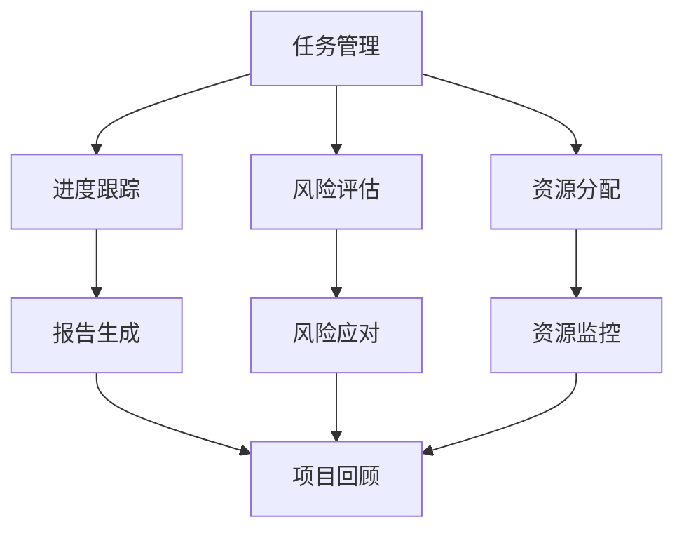

                 

# 一人公司的项目管理工具选择与最佳实践

> **关键词：** 项目管理工具，一人公司，敏捷开发，最佳实践，技术博客

> **摘要：** 本文将探讨一人公司的项目管理工具选择及其最佳实践。对于独立开发者或小型团队来说，选择合适的工具至关重要，它不仅影响工作效率，还决定项目的成功与否。本文将详细分析项目管理工具的核心概念，介绍常用的工具和框架，并通过一个实际案例展示最佳实践。

## 1. 背景介绍

### 1.1 目的和范围

本文的目标是为一人公司或小型团队提供项目管理工具选择的指导，并介绍如何通过最佳实践来优化项目流程。随着独立开发者和自由职业者的增加，如何高效地进行项目管理成为了一个关键问题。本文旨在解决以下问题：

1. 项目管理工具的选择标准是什么？
2. 如何根据项目特点选择合适的工具？
3. 最佳实践是什么？如何应用于一人公司的项目管理中？

### 1.2 预期读者

本文适合以下读者群体：

1. 独立开发者
2. 小型团队负责人
3. 对项目管理有兴趣的技术爱好者

### 1.3 文档结构概述

本文将分为以下几个部分：

1. **核心概念与联系**：介绍项目管理的基本概念，并提供一个Mermaid流程图。
2. **核心算法原理 & 具体操作步骤**：通过伪代码讲解项目管理工具的核心算法原理。
3. **数学模型和公式 & 详细讲解 & 举例说明**：运用数学模型和公式分析项目管理工具的性能。
4. **项目实战：代码实际案例和详细解释说明**：通过一个实际案例展示项目管理工具的应用。
5. **实际应用场景**：分析项目管理工具在不同场景下的应用。
6. **工具和资源推荐**：推荐学习资源和开发工具。
7. **总结：未来发展趋势与挑战**：探讨项目管理工具的发展方向和面临的挑战。
8. **附录：常见问题与解答**：解答读者可能遇到的问题。
9. **扩展阅读 & 参考资料**：提供进一步阅读的资源。

### 1.4 术语表

#### 1.4.1 核心术语定义

- **项目管理工具**：用于规划、执行、监控和报告项目活动的软件。
- **敏捷开发**：一种以迭代和增量方式进行的软件开发方法。
- **最佳实践**：在特定领域中被广泛认可和有效实施的方法。

#### 1.4.2 相关概念解释

- **任务管理**：对项目中的单个任务进行规划、分配和跟踪。
- **协作工具**：支持团队成员之间沟通和协作的工具。
- **自动化**：通过软件实现重复性任务的自动化执行。

#### 1.4.3 缩略词列表

- **JIRA**：一种流行的项目管理工具，由Atlassian开发。
- **Trello**：一种基于看板的项目管理工具。
- **Asana**：一种灵活的任务管理和协作工具。

## 2. 核心概念与联系

在项目管理中，理解以下核心概念和它们之间的联系至关重要：

- **任务管理**：对项目中的所有任务进行跟踪和管理。
- **进度跟踪**：监控项目进展，确保按时完成任务。
- **风险评估**：识别潜在风险，并制定应对策略。
- **资源分配**：合理分配团队资源，确保项目顺利推进。

以下是一个Mermaid流程图，展示这些概念之间的联系：



## 3. 核心算法原理 & 具体操作步骤

项目管理工具的核心算法通常包括任务排序、资源分配和进度预测。以下是一个简单的伪代码，用于说明这些算法的基本原理：

```pseudo
Algorithm ProjectManagementTool()
    Input: tasks, resources, deadlines
    Output: schedule, resourceAllocation, riskAssessment

    // Step 1: 任务排序（使用关键路径法）
    sort(tasks by criticalPathLength)

    // Step 2: 资源分配
    for each task in tasks
        allocateResources(task, resources)

    // Step 3: 进度预测
    predictSchedule(schedule, tasks, deadlines)

    // Step 4: 风险评估
    assessRisks(riskAssessment, tasks)

    return schedule, resourceAllocation, riskAssessment
```

### 3.1 任务排序

任务排序是项目管理中的关键步骤，确保项目能够按时完成。以下是一个简化的关键路径算法：

```pseudo
Algorithm CriticalPath(tasks)
    Input: tasks
    Output: criticalPath

    // Step 1: 计算每个任务的最早开始时间（EST）和最早完成时间（EFT）
    for each task in tasks
        calculate EST and EFT

    // Step 2: 计算每个任务的最新开始时间（LST）和最新完成时间（LFT）
    for each task in tasks
        calculate LST and LFT

    // Step 3: 计算每个任务的松弛时间（slack）
    for each task in tasks
        slack = LST - EST or LFT - EFT

    // Step 4: 找出关键路径
    criticalPath = findTasksWithZeroSlack()

    return criticalPath
```

### 3.2 资源分配

资源分配涉及到将团队成员和设备分配给特定的任务。以下是一个简单的资源分配算法：

```pseudo
Algorithm AllocateResources(task, resources)
    Input: task, resources
    Output: allocatedResources

    // Step 1: 确定任务所需的资源
    requiredResources = getResourcesRequiredByTask(task)

    // Step 2: 分配资源
    for each resource in requiredResources
        if resource available
            allocate resource to task
            update resource status in resources

    return allocatedResources
```

### 3.3 进度预测

进度预测是项目管理中的一项挑战，以下是一个基于历史数据的简单预测算法：

```pseudo
Algorithm PredictSchedule(schedule, tasks, deadlines)
    Input: schedule, tasks, deadlines
    Output: predictedSchedule

    // Step 1: 获取历史完成时间数据
    historicalData = getHistoricalCompletionData()

    // Step 2: 计算每个任务的预测完成时间
    for each task in tasks
        predictedCompletionTime = calculatePredictedCompletionTime(task, historicalData)

    // Step 3: 构建进度表
    predictedSchedule = constructSchedule(tasks, predictedCompletionTime)

    return predictedSchedule
```

### 3.4 风险评估

风险评估是项目管理中的重要环节，以下是一个简单的风险评估算法：

```pseudo
Algorithm AssessRisks(tasks)
    Input: tasks
    Output: riskAssessment

    // Step 1: 识别潜在风险
    potentialRisks = identifyPotentialRisks(tasks)

    // Step 2: 评估风险概率和影响
    for each risk in potentialRisks
        probability = calculateRiskProbability(risk)
        impact = calculateRiskImpact(risk)

    // Step 3: 建立风险矩阵
    riskMatrix = createRiskMatrix(potentialRisks, probability, impact)

    return riskMatrix
```

## 4. 数学模型和公式 & 详细讲解 & 举例说明

在项目管理中，数学模型和公式可以用于计算任务的关键路径、资源利用率、进度预测和风险评估。以下是一些常用的数学模型和公式：

### 4.1 关键路径法

关键路径法用于确定项目中任务的最早开始时间（EST）、最早完成时间（EFT）、最迟开始时间（LST）和最迟完成时间（LFT）。以下是一个关键路径计算的示例：

$$
\begin{align*}
EST_{i} &= \max(EST_{j} + T_{ij}) \quad \text{for all predecessors j of task i} \\
EFT_{i} &= EST_{i} + T_{i} \\
LFT_{i} &= \min(LFT_{j} - T_{ji}) \quad \text{for all successors j of task i} \\
LST_{i} &= LFT_{i} - T_{i} \\
\text{Critical Path} &= \{ i | LST_{i} = 0 \}
\end{align*}
$$

其中，$T_{ij}$ 是任务 i 直接依赖于任务 j 的持续时间。

### 4.2 资源利用率

资源利用率是评估资源分配效率的关键指标。以下是一个计算资源利用率的示例：

$$
\text{Resource Utilization} = \frac{\text{Total Working Time}}{\text{Total Available Time}} \times 100\%
$$

其中，总工作时间是所有任务完成所需时间的总和，总可用时间是所有资源的可用时间的总和。

### 4.3 进度预测

进度预测可以通过分析历史数据来进行。以下是一个基于历史数据的最简单线性回归模型：

$$
\hat{y} = \beta_0 + \beta_1 \cdot x
$$

其中，$\hat{y}$ 是预测的完成时间，$x$ 是实际完成时间，$\beta_0$ 和 $\beta_1$ 是模型参数。

### 4.4 风险评估

风险评估可以使用概率和影响矩阵来计算风险评分。以下是一个示例：

$$
\text{Risk Score} = \text{Probability} \times \text{Impact}
$$

概率和影响可以根据风险专家的评估来确定。

### 4.5 举例说明

假设我们有以下任务和持续时间：

| Task | Duration (days) | Predecessors |
|------|-----------------|--------------|
| A    | 5               | -            |
| B    | 3               | A            |
| C    | 4               | A            |
| D    | 2               | B, C         |

使用关键路径法，我们可以计算每个任务的 EST、EFT、LST 和 LFT：

| Task | EST | EFT | LST | LFT |
|------|-----|-----|-----|-----|
| A    | 0   | 5   | 5   | 10  |
| B    | 5   | 8   | 8   | 12  |
| C    | 5   | 9   | 9   | 13  |
| D    | 8   | 10  | 10  | 14  |

关键路径是 A -> B -> D，总持续时间是 14 天。

资源利用率可以通过以下公式计算：

$$
\text{Resource Utilization} = \frac{(5 \times 1) + (3 \times 1) + (4 \times 1) + (2 \times 1)}{5 \times 5} \times 100\% = 80\%
$$

假设历史数据如下：

| Task | Actual Completion Time (days) |
|------|-----------------------------|
| A    | 5                           |
| B    | 7                           |
| C    | 6                           |
| D    | 9                           |

我们可以使用线性回归模型来预测任务 D 的完成时间：

$$
\hat{y} = \beta_0 + \beta_1 \cdot x
$$

通过计算，我们得到：

$$
\beta_0 = 3.5, \beta_1 = 1.5
$$

因此，任务 D 的预测完成时间是：

$$
\hat{y} = 3.5 + 1.5 \cdot 9 = 16.5 \text{ days}
$$

假设风险概率为 0.3，风险影响为 5，则风险评分是：

$$
\text{Risk Score} = 0.3 \times 5 = 1.5
$$

## 5. 项目实战：代码实际案例和详细解释说明

在本节中，我们将通过一个实际项目案例来展示项目管理工具的选择与应用。这个项目是一个简单的博客平台，主要功能包括创建文章、分类文章、发布文章以及评论功能。

### 5.1 开发环境搭建

为了搭建这个博客平台，我们需要以下开发环境：

- **编程语言**：Python 3.8+
- **Web框架**：Flask
- **数据库**：SQLite
- **前端框架**：Bootstrap
- **版本控制**：Git

### 5.2 源代码详细实现和代码解读

以下是一个简单的Flask应用代码，用于实现博客平台的基础功能：

```python
from flask import Flask, render_template, request, redirect, url_for
from models import Article, Comment
from database import db

app = Flask(__name__)
app.config['SQLALCHEMY_DATABASE_URI'] = 'sqlite:///blog.db'
db.init_app(app)

@app.route('/')
def home():
    articles = Article.query.all()
    return render_template('home.html', articles=articles)

@app.route('/article/<int:article_id>')
def article(article_id):
    article = Article.query.get_or_404(article_id)
    return render_template('article.html', article=article)

@app.route('/new_article', methods=['GET', 'POST'])
def new_article():
    if request.method == 'POST':
        title = request.form['title']
        content = request.form['content']
        article = Article(title=title, content=content)
        db.session.add(article)
        db.session.commit()
        return redirect(url_for('home'))
    return render_template('new_article.html')

@app.route('/comment/<int:article_id>', methods=['POST'])
def comment(article_id):
    content = request.form['content']
    comment = Comment(content=content, article_id=article_id)
    db.session.add(comment)
    db.session.commit()
    return redirect(url_for('article', article_id=article_id))

if __name__ == '__main__':
    app.run(debug=True)
```

这个代码实现了以下功能：

- **首页**：展示所有文章。
- **文章详情页**：显示单个文章的详细信息，包括文章内容和评论。
- **新建文章页**：允许用户创建新的文章。
- **评论功能**：允许用户对文章进行评论。

### 5.3 代码解读与分析

下面是对上述代码的详细解读：

- **配置数据库**：首先，我们配置了SQLAlchemy来连接SQLite数据库。
  
  ```python
  app.config['SQLALCHEMY_DATABASE_URI'] = 'sqlite:///blog.db'
  db.init_app(app)
  ```

- **定义路由**：

  - `home()`：首页路由，获取所有文章并渲染模板。

    ```python
    @app.route('/')
    def home():
        articles = Article.query.all()
        return render_template('home.html', articles=articles)
    ```

  - `article()`：文章详情页路由，根据文章ID获取文章信息并渲染模板。

    ```python
    @app.route('/article/<int:article_id>')
    def article(article_id):
        article = Article.query.get_or_404(article_id)
        return render_template('article.html', article=article)
    ```

  - `new_article()`：新建文章页路由，处理新建文章的表单提交。

    ```python
    @app.route('/new_article', methods=['GET', 'POST'])
    def new_article():
        if request.method == 'POST':
            title = request.form['title']
            content = request.form['content']
            article = Article(title=title, content=content)
            db.session.add(article)
            db.session.commit()
            return redirect(url_for('home'))
        return render_template('new_article.html')
    ```

  - `comment()`：评论路由，处理评论提交。

    ```python
    @app.route('/comment/<int:article_id>', methods=['POST'])
    def comment(article_id):
        content = request.form['content']
        comment = Comment(content=content, article_id=article_id)
        db.session.add(comment)
        db.session.commit()
        return redirect(url_for('article', article_id=article_id))
    ```

- **启动应用**：

  ```python
  if __name__ == '__main__':
      app.run(debug=True)
  ```

通过这个简单的案例，我们可以看到如何使用Flask和SQLAlchemy来构建一个基础博客平台。在实际项目中，我们可能会添加更多功能，如用户认证、分类管理、标签管理等。

## 6. 实际应用场景

项目管理工具在不同规模和类型的项目中都有广泛应用。以下是几种常见的应用场景：

### 6.1 独立开发者的个人项目

对于独立开发者，项目管理工具可以帮助他们跟踪任务、管理进度和监控风险。例如，一个开发者可能需要开发一个移动应用，他可以使用Trello来创建任务卡，并使用标签来区分不同的功能模块。通过设置提醒和截止日期，开发者可以确保项目按时完成。

### 6.2 小型团队协作项目

小型团队，如自由职业者或小型初创公司，通常需要更复杂的协作工具。例如，一个软件团队可能使用JIRA来管理任务，使用Confluence来记录文档，并使用Slack进行团队沟通。这样的工具组合可以帮助团队成员实时同步进度，提高协作效率。

### 6.3 长期持续项目

对于需要持续数月甚至数年的长期项目，项目管理工具可以帮助项目团队保持项目目标的清晰，并确保项目在既定时间范围内完成。例如，一个大型软件开发项目可能使用JIRA来跟踪每个迭代周期中的任务，使用Jenkins进行自动化测试和部署，并使用Grafana来监控项目关键性能指标。

### 6.4 分布式团队协作

随着远程工作的普及，分布式团队需要高效的项目管理工具来协调工作。例如，一个全球分布的软件团队可能使用GitLab来管理代码仓库，使用Trello来跟踪任务，并使用Zoom进行视频会议。这样的工具组合可以帮助分布式团队实现高效的协作。

## 7. 工具和资源推荐

### 7.1 学习资源推荐

#### 7.1.1 书籍推荐

- **《项目管理知识体系指南》（PMBOK指南）》**：全面介绍了项目管理的基础理论和实践方法。
- **《敏捷软件开发：原则、实践与模式》**：详细阐述了敏捷开发的原理和实践。

#### 7.1.2 在线课程

- **Coursera**：《项目管理基础》和《敏捷项目管理》等课程。
- **Udemy**：提供多种项目管理工具和技术相关的在线课程。

#### 7.1.3 技术博客和网站

- **Atlassian博客**：关于JIRA、Confluence和Trello的最新动态和最佳实践。
- **GitHub**：大量的开源项目管理工具和代码示例。

### 7.2 开发工具框架推荐

#### 7.2.1 IDE和编辑器

- **Visual Studio Code**：一款功能强大的开源编辑器，支持多种编程语言。
- **PyCharm**：专为Python开发者设计的IDE，拥有丰富的插件和工具。

#### 7.2.2 调试和性能分析工具

- **GDB**：一款功能强大的开源调试工具。
- **Postman**：用于API测试和性能分析的浏览器插件。

#### 7.2.3 相关框架和库

- **Flask**：一个轻量级的Web应用框架，适用于快速开发。
- **Django**：一个全能型的Web应用框架，适合大型项目。

### 7.3 相关论文著作推荐

#### 7.3.1 经典论文

- **《敏捷软件开发宣言》**：阐述了敏捷开发的四大价值观。
- **《用户故事地图》**：介绍了用户故事和地图在敏捷开发中的应用。

#### 7.3.2 最新研究成果

- **《DevOps实践指南》**：详细介绍了DevOps的理念和实践方法。
- **《持续交付：发布可靠软件的系统方法》**：介绍了持续交付的概念和技术。

#### 7.3.3 应用案例分析

- **《谷歌如何运营》**：分析了谷歌在项目管理和技术创新方面的成功经验。
- **《亚马逊的运营模式》**：详细介绍了亚马逊的运营流程和商业模式。

## 8. 总结：未来发展趋势与挑战

随着技术的不断进步，项目管理工具也在不断演化。以下是未来项目管理工具的发展趋势和面临的挑战：

### 8.1 发展趋势

1. **智能化**：人工智能和机器学习技术将被广泛应用于项目管理工具，以提供智能任务排序、进度预测和风险评估。
2. **云计算**：随着云计算的普及，越来越多的项目管理工具将迁移到云端，提供更便捷的协作和访问。
3. **移动化**：项目管理工具将更加注重移动端的用户体验，以满足远程办公的需求。
4. **定制化**：项目管理工具将提供更多的定制化选项，以适应不同类型和规模的项目。

### 8.2 面临的挑战

1. **数据隐私和安全**：随着数据量的增加，项目管理工具需要确保用户数据的安全和隐私。
2. **工具整合**：项目管理工具需要与其他业务系统（如财务系统、人力资源系统）进行整合，提供更全面的业务支持。
3. **用户培训**：新工具的引入可能需要用户进行培训，以确保其有效使用。
4. **技术更新**：项目管理工具需要不断更新以适应新技术的发展，这可能带来一定的成本和复杂性。

## 9. 附录：常见问题与解答

### 9.1 项目管理工具选择

**Q1：如何选择适合自己的项目管理工具？**

A1：首先，明确您的项目需求和预算。然后，评估不同工具的功能和易用性。最后，参考其他用户的评价和反馈。

### 9.2 敏捷开发

**Q2：什么是敏捷开发？**

A2：敏捷开发是一种以迭代和增量方式进行的软件开发方法，强调快速响应变化、客户参与和团队协作。

### 9.3 资源管理

**Q3：如何合理分配资源？**

A3：首先，识别项目需求，然后评估可用资源。通过优先级排序和资源优化策略，确保资源得到最佳利用。

## 10. 扩展阅读 & 参考资料

- **《敏捷项目管理实践指南》**：详细介绍了敏捷项目管理的原理和实践。
- **《项目管理知识体系指南》（PMBOK指南）》**：全面介绍了项目管理的基础理论和实践方法。
- **《DevOps实践指南》**：介绍了DevOps的理念和实践方法。
- **《持续交付：发布可靠软件的系统方法》**：详细介绍了持续交付的概念和技术。

**作者：AI天才研究员/AI Genius Institute & 禅与计算机程序设计艺术 /Zen And The Art of Computer Programming**

