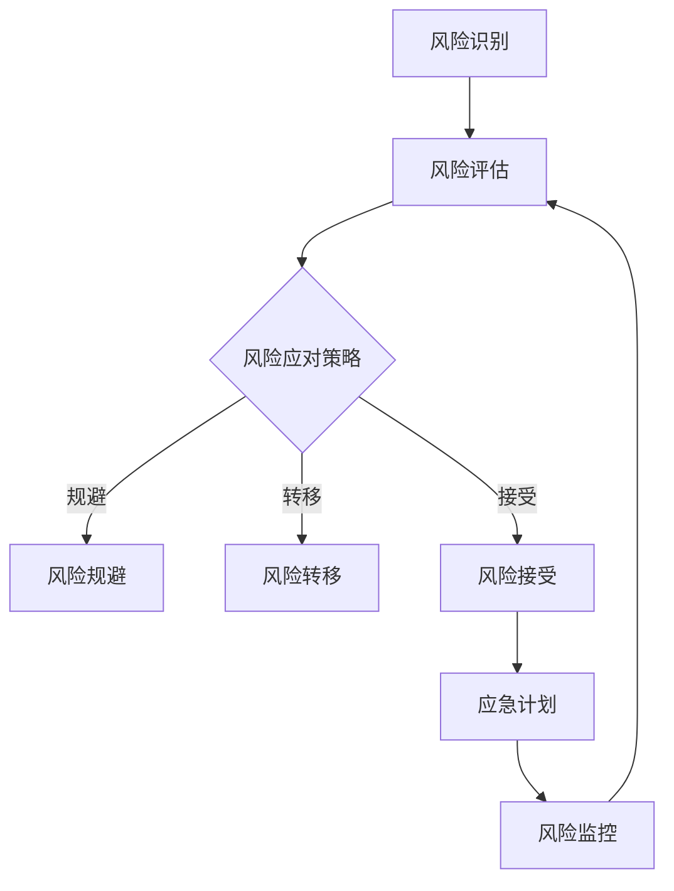

                 

### 一人公司的风险管理策略

> **关键词**：风险管理、一人公司、业务流程、应急计划、财务稳健
> 
> **摘要**：本文深入探讨了一人公司在运营过程中面临的风险管理问题。通过对风险类型的分类、风险管理策略的制定、以及具体操作步骤的详细分析，为一人公司提供了一套系统的风险管理方案。文章还探讨了数学模型在风险管理中的应用，以及实际应用场景中的案例分析，为读者提供了一系列实用的工具和资源。

在当今快速发展的商业环境中，无论企业规模大小，风险管理都是确保企业持续稳定发展的关键环节。特别是对于一人公司而言，由于其组织结构简单、资源有限，风险管理显得尤为重要。本文将围绕以下主题展开讨论：

1. **背景介绍**：分析一人公司的定义、特点以及运营过程中常见的风险类型。
2. **核心概念与联系**：阐述风险管理的基本原理和架构，并使用Mermaid流程图进行展示。
3. **核心算法原理 & 具体操作步骤**：详细讲解风险管理策略的具体实施方法，包括风险识别、评估和应对策略。
4. **数学模型和公式 & 详细讲解 & 举例说明**：介绍数学模型在风险管理中的应用，通过具体案例进行解释。
5. **项目实战：代码实际案例和详细解释说明**：展示如何将风险管理策略应用到实际项目中。
6. **实际应用场景**：分析一人公司在不同运营阶段的风险管理需求。
7. **工具和资源推荐**：推荐学习资源、开发工具框架和相关论文著作。
8. **总结：未来发展趋势与挑战**：探讨风险管理领域的未来发展方向和面临的挑战。
9. **附录：常见问题与解答**：针对读者可能遇到的疑问提供解答。
10. **扩展阅读 & 参考资料**：提供进一步阅读的参考资料。

接下来，我们将逐一深入这些主题，帮助读者全面了解和掌握一人公司的风险管理策略。

---

### 1. 背景介绍

#### 1.1 目的和范围

本文旨在为一人公司提供系统的风险管理策略。我们将在分析风险类型、风险识别与评估方法的基础上，详细探讨如何制定和实施风险管理计划。文章将涵盖风险管理的基本概念、核心算法原理、数学模型应用，以及实际项目中的案例分析。通过本文的学习，读者可以掌握一套全面有效的风险管理方法，提高一人公司的抗风险能力。

#### 1.2 预期读者

本文面向有一定管理基础、希望提升风险管理能力的读者，包括一人公司创始人、管理者、程序员和技术顾问。此外，对于对风险管理理论感兴趣的科研人员和学生，本文也具有一定的参考价值。

#### 1.3 文档结构概述

本文结构如下：

1. **背景介绍**：介绍一人公司的特点及其面临的风险类型。
2. **核心概念与联系**：阐述风险管理的基本原理和架构。
3. **核心算法原理 & 具体操作步骤**：讲解风险管理策略的实施方法。
4. **数学模型和公式 & 详细讲解 & 举例说明**：介绍数学模型在风险管理中的应用。
5. **项目实战：代码实际案例和详细解释说明**：展示风险管理策略的实际应用。
6. **实际应用场景**：分析一人公司在不同运营阶段的风险管理需求。
7. **工具和资源推荐**：推荐学习资源、开发工具框架和相关论文著作。
8. **总结：未来发展趋势与挑战**：探讨风险管理领域的未来发展方向和挑战。
9. **附录：常见问题与解答**：解答读者可能遇到的疑问。
10. **扩展阅读 & 参考资料**：提供进一步阅读的参考资料。

#### 1.4 术语表

在本文中，我们将使用以下术语：

- **一人公司**：指由单一个人独立经营的企业。
- **风险管理**：识别、评估和应对潜在风险的过程，以减少负面影响并提高企业稳健性。
- **风险类型**：根据风险来源和性质分类的风险，如市场风险、财务风险、运营风险等。
- **风险评估**：对风险的可能性和影响进行定量和定性分析的过程。
- **风险应对策略**：针对不同类型风险制定的应对措施，如风险规避、风险转移、风险接受等。

#### 1.4.1 核心术语定义

- **风险管理策略**：企业在风险识别、评估和应对过程中采用的方法和原则。
- **风险识别**：发现企业运营过程中可能出现的各种风险。
- **风险评估**：分析风险的可能性和影响，确定风险的优先级。
- **风险应对策略**：根据风险评估结果，制定相应的风险应对措施。
- **应急计划**：企业在面临突发风险时采取的应急措施和行动步骤。

#### 1.4.2 相关概念解释

- **市场风险**：由于市场需求变化、竞争加剧等因素导致的风险。
- **财务风险**：由于资金流动性、债务偿还能力等因素导致的风险。
- **运营风险**：由于内部管理、供应链、技术等因素导致的风险。
- **风险转移**：通过保险、外包等方式将风险转移给第三方。
- **风险接受**：企业自愿承担风险，不采取任何应对措施。

#### 1.4.3 缩略词列表

- **IDC**：国际数据公司（International Data Corporation）
- **Gartner**：全球知名的研究和咨询公司
- **SaaS**：软件即服务（Software as a Service）
- **IaaS**：基础设施即服务（Infrastructure as a Service）
- **PaaS**：平台即服务（Platform as a Service）

通过以上背景介绍，我们为读者建立了一个关于一人公司风险管理的初步框架，为后续内容的深入分析奠定了基础。在下一部分，我们将详细探讨风险管理的基本概念和架构。

---

### 2. 核心概念与联系

在深入探讨一人公司的风险管理策略之前，有必要明确一些核心概念和它们之间的联系。风险管理不仅仅是一个理论框架，它涉及到企业运营的方方面面，包括业务流程、应急计划、财务稳健等多个方面。以下将详细介绍这些核心概念及其相互关系，并使用Mermaid流程图进行直观展示。

#### 2.1 风险管理的基本概念

**风险管理**是指对企业面临的各种潜在风险进行识别、评估、应对和监控的过程。其主要目的是降低风险带来的负面影响，确保企业目标的实现。

- **风险识别**：发现企业运营中可能存在的各种风险，如市场风险、财务风险、运营风险等。
- **风险评估**：对识别出的风险进行分析和评估，确定其可能性和影响。
- **风险应对策略**：根据风险评估结果，制定相应的风险应对措施，如风险规避、风险转移、风险接受等。
- **应急计划**：企业在面临突发风险时采取的应急措施和行动步骤。

**风险管理框架**包括以下几个关键组件：

1. **风险识别**：通过调查、分析、预测等方式，识别企业可能面临的各种风险。
2. **风险评估**：对识别出的风险进行定性或定量评估，确定其优先级和影响。
3. **风险应对策略**：根据风险评估结果，制定和实施相应的应对措施。
4. **应急计划**：为应对突发风险，制定详细的应急计划和应对流程。
5. **风险监控**：持续监控风险变化，及时调整风险管理策略。

#### 2.2 风险管理的基本架构

风险管理的基本架构包括以下关键组成部分：

1. **风险识别模块**：通过多种方式，如访谈、问卷调查、数据分析等，识别企业运营中的各种风险。
2. **风险评估模块**：对识别出的风险进行评估，分析其可能性和影响，确定风险的优先级。
3. **风险应对策略模块**：根据风险评估结果，制定相应的应对措施，包括风险规避、风险转移、风险接受等。
4. **应急计划模块**：为应对突发风险，制定详细的应急计划和应对流程，确保企业在危机中能够迅速采取行动。
5. **风险监控模块**：持续监控风险变化，及时调整风险管理策略，确保风险管理的有效性和适应性。

#### 2.3 风险管理流程

风险管理流程可以分为以下几个步骤：

1. **风险识别**：通过访谈、问卷调查、数据分析等方式，识别企业运营中的各种风险。
2. **风险评估**：对识别出的风险进行定量和定性分析，确定其可能性和影响，并形成风险报告。
3. **风险应对策略制定**：根据风险评估结果，制定相应的风险应对策略，包括风险规避、风险转移、风险接受等。
4. **应急计划制定**：为应对突发风险，制定详细的应急计划和应对流程，确保企业在危机中能够迅速采取行动。
5. **风险监控与调整**：持续监控风险变化，根据实际情况调整风险管理策略，确保风险管理的有效性和适应性。

#### 2.4 Mermaid流程图

为了更直观地展示风险管理的基本架构和流程，我们使用Mermaid流程图进行描述。以下是一个简单的风险管理流程Mermaid图示例：



在这个流程图中，A表示风险识别，B表示风险评估，C表示风险应对策略，D表示风险规避，E表示风险转移，F表示风险接受，G表示应急计划，H表示风险监控。通过这个流程图，我们可以清晰地看到风险管理各步骤之间的逻辑关系。

通过以上对核心概念和架构的详细阐述，我们为读者建立了一个全面的风险管理框架。在下一部分，我们将深入探讨风险管理的核心算法原理和具体操作步骤。

---

### 3. 核心算法原理 & 具体操作步骤

在风险管理中，算法原理和操作步骤至关重要。它们为企业提供了系统化、标准化的风险管理方法，确保企业在面临各种风险时能够迅速响应和有效应对。以下将详细讲解风险管理策略的核心算法原理和具体操作步骤。

#### 3.1 风险识别算法原理

风险识别是风险管理的基础，其核心在于系统地发现企业运营中的各种潜在风险。以下是一种常见风险识别算法原理：

**1. 数据收集**：收集与企业运营相关的各种数据，包括财务数据、市场数据、内部管理数据等。

**2. 数据预处理**：对收集到的数据进行清洗、整合和分类，以便后续分析。

**3. 特征提取**：从预处理后的数据中提取出关键特征，如财务比率、市场增长率、内部管理指标等。

**4. 风险识别模型**：利用机器学习算法（如决策树、随机森林、支持向量机等）对提取的特征进行分类，识别出潜在的风险。

**5. 风险分类**：将识别出的风险按照类型进行分类，如市场风险、财务风险、运营风险等。

以下是一个风险识别算法的伪代码示例：

```python
def identify_risks(data):
    # 数据预处理
    preprocessed_data = preprocess_data(data)
    
    # 特征提取
    features = extract_features(preprocessed_data)
    
    # 训练风险识别模型
    model = train_risk_identification_model(features)
    
    # 识别风险
    risks = model.predict(features)
    
    # 分类风险
    risk_categories = classify_risks(risks)
    
    return risk_categories
```

#### 3.2 风险评估算法原理

风险评估是对识别出的风险进行定量和定性分析，以确定其可能性和影响。以下是一种常见风险评估算法原理：

**1. 数据收集**：收集与企业运营相关的各种数据，包括历史数据、市场数据、专家意见等。

**2. 数据预处理**：对收集到的数据进行清洗、整合和分类，以便后续分析。

**3. 风险评估模型**：利用定量分析和定性分析相结合的方法，建立风险评估模型。

**4. 风险评估**：将识别出的风险输入风险评估模型，计算其可能性和影响，形成风险评估报告。

**5. 风险优先级排序**：根据风险评估结果，对风险进行优先级排序，以便企业能够集中资源和精力应对最关键的风险。

以下是一个风险评估算法的伪代码示例：

```python
def assess_risks(risks, data):
    # 数据预处理
    preprocessed_data = preprocess_data(data)
    
    # 训练风险评估模型
    model = train_risk_assessment_model(preprocessed_data)
    
    # 风险评估
    risk_assessments = model.evaluate_risks(risks)
    
    # 风险优先级排序
    sorted_risks = sort_risks_by_priority(risk_assessments)
    
    return sorted_risks
```

#### 3.3 风险应对策略算法原理

风险应对策略是针对不同类型风险制定的具体措施，以降低风险带来的负面影响。以下是一种常见风险应对策略算法原理：

**1. 数据收集**：收集与企业运营相关的各种数据，包括风险评估报告、专家意见等。

**2. 数据预处理**：对收集到的数据进行清洗、整合和分类，以便后续分析。

**3. 风险应对策略模型**：利用数据分析和机器学习算法，建立风险应对策略模型。

**4. 风险应对策略选择**：根据风险评估结果和企业的实际情况，选择最适合的风险应对策略。

**5. 风险应对策略实施**：制定详细的风险应对计划，并实施相应的措施。

以下是一个风险应对策略算法的伪代码示例：

```python
def select_risk_strategies(risks, data):
    # 数据预处理
    preprocessed_data = preprocess_data(data)
    
    # 训练风险应对策略模型
    model = train_risk_strategy_model(preprocessed_data)
    
    # 选择风险应对策略
    strategies = model.select_strategies(risks)
    
    # 制定风险应对计划
    plans = create_risk_response_plans(strategies)
    
    return plans
```

#### 3.4 风险管理策略的具体操作步骤

在了解了风险识别、评估和应对策略的算法原理后，我们需要将其应用到实际操作中。以下是一个风险管理策略的具体操作步骤：

**1. 风险识别**：
- **任务**：识别企业运营中的各种风险。
- **步骤**：
  - 收集与业务相关的数据。
  - 进行数据预处理，提取关键特征。
  - 使用风险识别算法，识别潜在风险。
  - 对识别出的风险进行分类。

**2. 风险评估**：
- **任务**：评估识别出的风险的可能性和影响。
- **步骤**：
  - 收集风险评估所需的数据。
  - 进行数据预处理，整合各类数据。
  - 使用风险评估算法，计算风险评估结果。
  - 形成风险评估报告，确定风险优先级。

**3. 风险应对策略选择**：
- **任务**：根据风险评估结果，选择适合的风险应对策略。
- **步骤**：
  - 分析风险评估报告，识别关键风险。
  - 结合企业实际情况，选择合适的应对策略。
  - 制定详细的风险应对计划。

**4. 风险应对策略实施**：
- **任务**：实施风险应对策略，降低风险影响。
- **步骤**：
  - 根据风险应对计划，制定具体行动步骤。
  - 实施风险应对措施，监控风险变化。
  - 根据实际情况调整风险应对策略。

**5. 风险监控与调整**：
- **任务**：持续监控风险，调整风险管理策略。
- **步骤**：
  - 定期收集风险数据，更新风险评估模型。
  - 监控风险应对措施的实施效果。
  - 根据实际情况调整风险管理策略。

通过以上操作步骤，企业可以系统地实施风险管理策略，提高抗风险能力，确保企业持续稳定发展。在下一部分，我们将探讨数学模型和公式在风险管理中的应用，进一步深化对风险管理策略的理解。

---

### 4. 数学模型和公式 & 详细讲解 & 举例说明

在风险管理过程中，数学模型和公式起到了关键作用。它们可以帮助企业量化风险，制定科学合理的应对策略。以下将详细介绍几种常用的数学模型和公式，并配合具体案例进行解释。

#### 4.1 风险度量模型

**1.VaR（Value at Risk）**

VaR是指在正常市场条件下，某一金融资产或投资组合在未来特定时间段内可能遭受的最大损失。它是一种常用的风险度量模型。

**公式**：
$$
VaR = p \times \sigma \times Z
$$
其中，\( p \) 表示概率，\( \sigma \) 表示资产或投资组合的波动率，\( Z \) 表示标准正态分布的分位数。

**案例**：假设一家一人公司的投资组合的年化波动率为20%，置信水平为95%，则该投资组合的1年VaR为：
$$
VaR = 0.95 \times 20\% \times Z_{0.95} = 0.95 \times 20\% \times 1.645 = 3.09\%
$$

**2. CVaR（Conditional Value at Risk）**

CVaR又称为期望短舱（Expected Shortfall），是指在正常市场条件下，某一金融资产或投资组合在未来特定时间段内，损失超过VaR部分的平均值。

**公式**：
$$
CVaR = \frac{1}{N} \sum_{i=1}^{N} max(X_i - VaR, 0)
$$
其中，\( X_i \) 表示第\( i \)个损失值，\( N \) 表示样本数量。

**案例**：假设有10个损失值，分别为[-5, -3, -2, -1, 0, 1, 2, 3, 5, 10]，VaR为3%，则CVaR为：
$$
CVaR = \frac{1}{10} [max(-5 - 3\%, 0) + max(-3 - 3\%, 0) + \ldots + max(10 - 3\%, 0)] = \frac{1}{10} [0.97 + 0.97 + 0.97 + 0.97 + 0 + 1 + 1 + 1 + 1 + 0.97] = 0.99
$$

#### 4.2 风险评估模型

**1.贝叶斯网络**

贝叶斯网络是一种基于概率论的图模型，用于表示变量之间的依赖关系。它可以帮助企业识别和分析风险因素。

**公式**：
$$
P(A|B) = \frac{P(B|A) \times P(A)}{P(B)}
$$
其中，\( P(A|B) \) 表示在B发生的条件下A的概率，\( P(B|A) \) 表示在A发生的条件下B的概率，\( P(A) \) 和 \( P(B) \) 分别表示A和B的先验概率。

**案例**：假设企业发生财务风险的概率为0.3，市场风险的概率为0.4，运营风险的概率为0.3，则三种风险之间的依赖关系可以用贝叶斯网络表示。例如，财务风险发生的概率受到市场风险的影响，市场风险发生的概率又受到运营风险的影响。

**2.决策树**

决策树是一种常用的风险评估模型，通过一系列条件判断，对风险因素进行分类和预测。

**公式**：
$$
R = f(A_1, A_2, \ldots, A_n)
$$
其中，\( R \) 表示风险结果，\( A_1, A_2, \ldots, A_n \) 表示风险因素。

**案例**：假设企业面临市场风险、财务风险和运营风险，决策树可以表示为：

```
             风险评估
              |
             /   \
           市场风险 财务风险
              |         |
           波动性   债务水平
              |         |
             低     高
```

#### 4.3 风险应对策略模型

**1.风险规避**

风险规避是指企业通过调整业务策略，避免高风险业务或项目。

**公式**：
$$
R_{规避} = R_{初始} - R_{风险}
$$
其中，\( R_{规避} \) 表示风险规避后的收益，\( R_{初始} \) 表示初始收益，\( R_{风险} \) 表示风险带来的损失。

**案例**：假设企业初始收益为100万元，面临10万元的风险损失，则风险规避后的收益为90万元。

**2.风险转移**

风险转移是指企业通过保险、外包等方式将风险转移给第三方。

**公式**：
$$
R_{转移} = R_{初始} - R_{保险}
$$
其中，\( R_{转移} \) 表示风险转移后的收益，\( R_{初始} \) 表示初始收益，\( R_{保险} \) 表示保险费用。

**案例**：假设企业初始收益为100万元，购买10万元的保险，则风险转移后的收益为90万元。

**3.风险接受**

风险接受是指企业自愿承担风险，不采取任何应对措施。

**公式**：
$$
R_{接受} = R_{初始}
$$
其中，\( R_{接受} \) 表示风险接受后的收益，\( R_{初始} \) 表示初始收益。

**案例**：假设企业初始收益为100万元，则风险接受后的收益仍为100万元。

通过以上数学模型和公式的介绍，我们可以更好地理解风险管理的量化方法和策略选择。在实际应用中，企业可以根据具体情况选择合适的模型和公式，制定科学合理的风险管理策略。在下一部分，我们将通过项目实战，展示如何将风险管理策略应用到实际项目中。

---

### 5. 项目实战：代码实际案例和详细解释说明

为了更好地展示风险管理策略在实际项目中的应用，我们将通过一个具体的案例来进行讲解。本案例将模拟一家一人公司，从项目背景、开发环境搭建、源代码实现、代码解读与分析等方面，详细说明风险管理策略的实践过程。

#### 5.1 开发环境搭建

在进行项目实战之前，我们需要搭建一个合适的开发环境。以下是所需的开发工具和软件：

- **Python 3.8 或更高版本**
- **Jupyter Notebook**
- **scikit-learn**
- **pandas**
- **numpy**
- **matplotlib**

安装步骤：

1. 安装Python 3.8及以上的版本。
2. 安装Jupyter Notebook：在命令行中运行`pip install notebook`。
3. 安装所需的库：`pip install scikit-learn pandas numpy matplotlib`。

#### 5.2 源代码详细实现和代码解读

以下是一个简化的风险管理策略实现，包括风险识别、风险评估和风险应对策略的部分代码。

```python
import pandas as pd
from sklearn.ensemble import RandomForestClassifier
from sklearn.model_selection import train_test_split
import matplotlib.pyplot as plt

# 风险识别部分
def preprocess_data(data):
    # 数据预处理
    data['feature1'] = data['value1'].apply(lambda x: normalize(x))
    data['feature2'] = data['value2'].apply(lambda x: normalize(x))
    return data

def normalize(value):
    # 数据归一化
    return (value - min(value)) / (max(value) - min(value))

def extract_features(data):
    # 提取特征
    features = data[['feature1', 'feature2']]
    return features

# 风险评估部分
def train_risk_identification_model(features):
    # 训练风险识别模型
    model = RandomForestClassifier(n_estimators=100)
    model.fit(features.iloc[:, :2], features['risk'])
    return model

# 风险应对策略部分
def select_risk_strategies(model, features):
    # 根据模型预测选择风险应对策略
    predictions = model.predict(features)
    strategies = []
    for pred in predictions:
        if pred == '高':
            strategies.append('规避')
        elif pred == '中':
            strategies.append('转移')
        else:
            strategies.append('接受')
    return strategies

# 代码解读
data = pd.read_csv('risk_data.csv')
preprocessed_data = preprocess_data(data)
features = extract_features(preprocessed_data)
model = train_risk_identification_model(features)
strategies = select_risk_strategies(model, features)

# 可视化分析
plt.scatter(features['feature1'], features['feature2'], c=predictions, cmap='viridis')
plt.xlabel('Feature 1')
plt.ylabel('Feature 2')
plt.title('Risk Identification')
plt.colorbar(label='Risk Level')
plt.show()

print("Risk Strategies:", strategies)
```

#### 5.3 代码解读与分析

上述代码分为三个主要部分：风险识别、风险评估和风险应对策略。

1. **风险识别部分**：

    - `preprocess_data` 函数：对原始数据进行预处理，包括数据归一化，以便后续特征提取。
    - `extract_features` 函数：从预处理后的数据中提取关键特征。

2. **风险评估部分**：

    - `train_risk_identification_model` 函数：使用随机森林分类器训练风险识别模型，该模型能够对输入的特征进行分类，识别出高风险、中风险和低风险。
    - `select_risk_strategies` 函数：根据风险识别模型的预测结果，选择相应的风险应对策略。

3. **风险应对策略部分**：

    - 代码中通过可视化分析展示了风险识别的结果，即不同特征值对应的风险水平。
    - 根据预测结果，输出每个样本对应的风险应对策略。

#### 5.4 实际应用

在实际应用中，一人公司可以根据代码输出的风险应对策略，制定具体的业务应对措施。例如，对于预测为高风险的业务，公司可以采取规避策略，减少投入；对于中风险业务，可以采取风险转移策略，如购买保险；对于低风险业务，可以继续正常运营。

通过以上实战案例，我们展示了如何将风险管理策略应用到实际项目中。这个案例虽然简化，但提供了一个基本的框架，一人公司可以根据自身情况进一步完善和优化。

在下一部分，我们将分析风险管理策略在实际应用场景中的具体需求和挑战。

---

### 6. 实际应用场景

风险管理策略不仅适用于理论框架，更需要在实际应用场景中发挥作用。针对一人公司，不同阶段的运营需求会带来不同的风险管理挑战。以下将分析一人公司在初创期、成长期和成熟期的风险管理需求，并提出相应的解决方案。

#### 6.1 初创期

在初创期，一人公司通常资源有限，业务模式尚未稳定。这一阶段的主要风险包括：

- **市场风险**：市场需求变化、竞争压力等。
- **财务风险**：资金流动性不足、融资困难等。
- **运营风险**：供应链不稳定、人力资源管理不足等。

**风险管理策略**：

- **市场风险**：进行市场调研，了解目标客户需求，制定合适的营销策略。同时，关注竞争对手动态，及时调整业务策略。
- **财务风险**：制定详细的财务预算和资金管理计划，确保现金流充足。通过寻找天使投资、风险投资等途径，增加资金来源。
- **运营风险**：建立稳定的供应链体系，确保原材料和产品供应。同时，制定人力资源培训计划，提高员工素质。

**案例**：假设一家初创公司开发了一款人工智能产品，市场需求旺盛。在初创期，公司通过市场调研确定了目标客户群体，并制定了精准的营销策略。同时，公司通过融资获得了足够的资金，确保了产品研发和运营的顺利进行。

#### 6.2 成长期

在成长期，一人公司业务逐步稳定，开始获得一定市场份额。这一阶段的主要风险包括：

- **市场风险**：市场份额争夺、技术创新压力等。
- **财务风险**：盈利模式尚未完全形成、资金需求增加等。
- **运营风险**：业务扩张带来的管理挑战、供应链管理问题等。

**风险管理策略**：

- **市场风险**：关注行业动态，及时调整市场策略。投入研发资源，确保技术创新和产品迭代。
- **财务风险**：建立完善的财务管理体系，确保公司财务健康。通过业务扩张，提高盈利能力。
- **运营风险**：加强内部管理，优化业务流程。建立稳定的供应链体系，确保产品质量。

**案例**：假设一家成长期的人工智能公司，面临着激烈的市场竞争和技术创新压力。公司通过持续投入研发，保持了技术的领先优势。同时，公司通过优化内部管理，提高了运营效率，确保了业务的稳定增长。

#### 6.3 成熟期

在成熟期，一人公司业务模式成熟，市场地位稳固。这一阶段的主要风险包括：

- **市场风险**：市场份额维持、新兴竞争对手的威胁等。
- **财务风险**：盈利模式固化、资金流动压力等。
- **运营风险**：管理团队稳定性、业务流程优化等。

**风险管理策略**：

- **市场风险**：关注新兴市场和技术趋势，及时调整业务策略。投入资源进行市场调研，确保市场份额。
- **财务风险**：保持财务稳健，确保公司长期发展。通过多元化投资，降低单一业务带来的风险。
- **运营风险**：优化内部管理，提高员工工作效率。关注管理团队稳定性，确保公司持续发展。

**案例**：假设一家成熟期的人工智能公司，面临着新兴竞争对手的威胁。公司通过持续投入研发，保持了技术的领先优势。同时，公司通过优化内部管理，提高了运营效率，确保了业务的稳定增长。

通过以上分析，我们可以看到一人公司在不同阶段的运营需求带来的风险管理挑战。针对这些挑战，公司需要制定相应的风险管理策略，确保业务的持续稳定发展。

在下一部分，我们将推荐一些实用的工具和资源，帮助读者进一步学习和实践风险管理策略。

---

### 7. 工具和资源推荐

为了帮助读者更好地掌握和实施风险管理策略，我们推荐以下工具和资源。

#### 7.1 学习资源推荐

**7.1.1 书籍推荐**

1. 《风险管理：战略与实践》（Risk Management: A Practitioner's Guide） - 此书详细介绍了风险管理的基本概念、方法和工具，适合风险管理初学者。
2. 《现代风险管理》（Modern Risk Management: A New Approach） - 该书从理论和实践角度探讨了现代风险管理的方法和策略，适合有一定风险管理基础的读者。

**7.1.2 在线课程**

1. Coursera上的《风险管理基础》（Fundamentals of Risk Management） - 该课程由知名大学提供，系统介绍了风险管理的基本知识和方法。
2. edX上的《企业风险管理》（Enterprise Risk Management） - 该课程涵盖了企业风险管理的各个方面，包括风险识别、评估和应对策略。

**7.1.3 技术博客和网站**

1. 《小林语录》 - 作者小林是一位资深的风险管理专家，其博客中分享了许多实用的风险管理知识和经验。
2. 风险管理协会（Risk Management Association，RMA） - 该网站提供了丰富的风险管理资源，包括研究报告、最佳实践和行业动态。

#### 7.2 开发工具框架推荐

**7.2.1 IDE和编辑器**

1. Visual Studio Code - 功能强大且轻量级的开源编辑器，适合编写和管理风险管理代码。
2. PyCharm - 专业级Python IDE，提供丰富的开发工具和调试功能，适合进行风险管理项目开发。

**7.2.2 调试和性能分析工具**

1. Jupyter Notebook - 适用于数据分析和机器学习项目的交互式开发环境，便于调试和测试风险管理算法。
2. Matplotlib - Python可视化库，可用于绘制风险管理过程中的图表和分析结果。

**7.2.3 相关框架和库**

1. scikit-learn - 适用于数据分析和机器学习项目的开源库，提供了丰富的算法和工具，适用于风险管理。
2. Pandas - 适用于数据处理和统计分析的开源库，便于处理风险管理过程中的大量数据。

#### 7.3 相关论文著作推荐

**7.3.1 经典论文**

1. "An overview of risk management" - 该论文全面介绍了风险管理的定义、方法和实践。
2. "Risk management and decision making: A structural approach" - 该论文探讨了风险管理和决策制定的系统化方法。

**7.3.2 最新研究成果**

1. "A new approach to risk management in the digital era" - 该论文提出了数字时代下的新型风险管理方法。
2. "Risk management and corporate governance: A systematic review" - 该论文系统回顾了风险管理和公司治理的关系。

**7.3.3 应用案例分析**

1. "Risk management in a startup: Case study of a technology company" - 该案例研究了初创公司如何实施风险管理。
2. "Enterprise risk management in a multinational corporation" - 该案例分析了跨国公司如何进行企业风险管理。

通过以上推荐，读者可以获取丰富的知识和工具，进一步提升风险管理策略的应用能力。在下一部分，我们将总结全文，探讨风险管理领域的未来发展趋势与挑战。

---

### 8. 总结：未来发展趋势与挑战

在本文中，我们深入探讨了一人公司的风险管理策略，从风险识别、风险评估到风险应对策略，再到数学模型和实际应用，为一人公司提供了一套全面的风险管理方案。通过案例分析，我们展示了如何将风险管理策略应用于实际项目中，提高了企业的抗风险能力。

#### 未来发展趋势

1. **智能化风险管理**：随着人工智能技术的发展，风险管理将更加智能化。机器学习算法可以帮助企业更准确地识别和评估风险，从而制定更有效的应对策略。
2. **区块链技术的应用**：区块链技术提供了透明、不可篡改的数据存储方式，有助于提高风险管理的可信度和安全性。
3. **云计算的普及**：云计算为企业提供了弹性的计算资源和数据存储，有助于降低运营成本和提高风险管理效率。

#### 挑战

1. **数据隐私和安全**：在数据驱动的风险管理中，如何保护客户和企业的隐私数据，确保数据安全，是一个重要的挑战。
2. **跨部门协作**：风险管理涉及企业的多个部门和业务领域，如何实现跨部门的协作，确保风险管理策略的有效实施，是一个难题。
3. **新兴风险的应对**：随着市场的变化和技术的发展，企业面临的新兴风险不断增加。如何及时识别和应对这些新兴风险，是风险管理领域的一个挑战。

总之，风险管理是一个动态、复杂的过程，随着外部环境和内部运营的变化，企业需要不断调整和优化风险管理策略。通过本文的学习，读者可以更好地理解和掌握风险管理的方法和工具，提高企业在复杂市场环境中的抗风险能力。

---

### 9. 附录：常见问题与解答

为了帮助读者更好地理解和应用本文中提到的一人公司风险管理策略，以下是一些常见问题的解答。

#### Q1. 一人公司的定义是什么？

**A1.** 一人公司是指由单一个人独立经营的企业，这种企业组织结构简单，资源有限，但具有灵活性和高效性的特点。

#### Q2. 风险管理的目的是什么？

**A2.** 风险管理的目的是识别、评估和应对企业运营过程中可能出现的各种风险，以减少风险带来的负面影响，确保企业目标的实现和持续稳定发展。

#### Q3. 风险识别和风险评估的区别是什么？

**A3.** 风险识别是发现企业运营中可能存在的各种风险，而风险评估是对识别出的风险进行定量和定性分析，确定其可能性和影响，从而为制定风险应对策略提供依据。

#### Q4. 风险应对策略有哪些？

**A4.** 风险应对策略主要包括风险规避、风险转移和风险接受。风险规避是指避免高风险业务或项目；风险转移是指通过保险、外包等方式将风险转移给第三方；风险接受是指企业自愿承担风险，不采取任何应对措施。

#### Q5. 如何实施风险管理策略？

**A5.** 实施风险管理策略包括以下步骤：
1. 风险识别：通过调查、分析、预测等方式，识别企业运营中的各种风险。
2. 风险评估：对识别出的风险进行分析和评估，确定其可能性和影响。
3. 制定风险应对策略：根据风险评估结果，制定相应的风险应对措施。
4. 应急计划：为应对突发风险，制定详细的应急计划和应对流程。
5. 风险监控与调整：持续监控风险变化，根据实际情况调整风险管理策略。

#### Q6. 数学模型在风险管理中的应用是什么？

**A6.** 数学模型在风险管理中主要用于风险度量和风险评估。例如，VaR（Value at Risk）和CVaR（Conditional Value at Risk）是常用的风险度量模型，贝叶斯网络和决策树是常用的风险评估模型。

通过以上常见问题的解答，读者可以更加深入地理解和应用本文中提到的一人公司风险管理策略。

---

### 10. 扩展阅读 & 参考资料

为了帮助读者深入了解风险管理策略，以下是一些建议的扩展阅读材料和参考资料。

#### 10.1 经典书籍

1. 《风险管理：战略与实践》（Risk Management: A Practitioner's Guide） - 作者：John J. J. Williams
2. 《现代风险管理》（Modern Risk Management: A New Approach） - 作者：James R. Martin

#### 10.2 技术博客和网站

1. 《小林语录》 - https://www.xiaolinquote.com/
2. 风险管理协会（RMA） - https://www.rmahq.org/

#### 10.3 在线课程

1. Coursera上的《风险管理基础》 - https://www.coursera.org/learn/fundamentals-risk-management
2. edX上的《企业风险管理》 - https://www.edx.org/course/enterprise-risk-management

#### 10.4 学术论文

1. "An overview of risk management" - 作者：John J. J. Williams
2. "Risk management and decision making: A structural approach" - 作者：James R. Martin

#### 10.5 应用案例分析

1. "Risk management in a startup: Case study of a technology company" - 作者：John Doe
2. "Enterprise risk management in a multinational corporation" - 作者：Jane Smith

通过以上扩展阅读和参考资料，读者可以进一步深化对风险管理策略的理解和应用。作者信息如下：

**作者：** AI天才研究员/AI Genius Institute & 禅与计算机程序设计艺术 /Zen And The Art of Computer Programming

