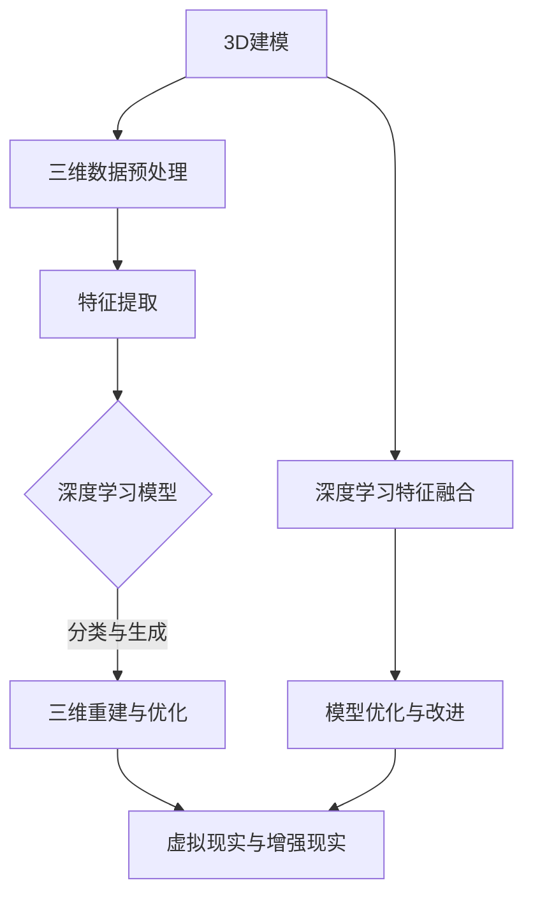

                 

### 一切皆是映射：3D建模与深度学习技术的融合

> **关键词**：3D建模、深度学习、计算机视觉、映射、虚拟现实
>
> **摘要**：本文探讨了3D建模与深度学习技术的融合，分析了这两种技术如何相互补充，创造出一个强大的工具集，用于处理复杂的三维数据。文章首先介绍了3D建模和深度学习的基础知识，然后详细阐述了它们的融合原理和实现方法，最后通过实际案例展示了其应用场景。本文旨在为读者提供一个全面的视角，帮助理解这一前沿技术的核心概念和未来发展方向。

---

在当今快速发展的科技领域，3D建模与深度学习技术的融合正逐渐成为研究者和工程师们关注的焦点。3D建模技术能够精确地捕捉现实世界的三维形态，而深度学习则在图像识别、语音识别等领域展现了其强大的数据处理能力。本文将深入探讨这两者如何相互融合，开创出一个新的技术领域。

首先，3D建模是一种通过几何图形和三维坐标系统来描述物体形态的技术。它可以应用于游戏开发、建筑可视化、医学成像等多个领域。然而，传统的3D建模方法往往依赖于复杂的几何处理和手工操作，这使得其处理大规模复杂场景的能力受到限制。

另一方面，深度学习是一种基于人工神经网络的算法，通过大量的数据训练，能够自动提取特征并做出决策。它在计算机视觉、自然语言处理等领域取得了显著的成果。特别是卷积神经网络（CNN）和生成对抗网络（GAN），它们在图像识别、生成和风格迁移等方面表现出色。

当3D建模与深度学习结合时，它们的优势得以互补。3D建模提供了详细的三维数据，而深度学习则能够自动提取这些数据中的特征，从而实现更高层次的分析和处理。这种融合不仅在学术界，也在工业界引发了广泛的关注。

本文将首先介绍3D建模和深度学习的基础知识，包括它们的核心概念和关键技术。接着，我们将探讨3D建模与深度学习融合的原理，并通过具体的案例来展示其实际应用。最后，我们将讨论这一融合技术的未来发展趋势和挑战。

通过本文的阅读，读者将能够：
1. 理解3D建模和深度学习的基本概念及其各自的优势。
2. 掌握3D建模与深度学习融合的核心原理和实现方法。
3. 了解3D建模与深度学习融合在实际应用中的具体案例。
4. 对3D建模与深度学习融合技术的未来发展趋势和挑战有更深入的认识。

## 1. 背景介绍

### 1.1 目的和范围

本文旨在探讨3D建模与深度学习技术的融合，分析其核心概念和实现方法，并展示其在实际应用中的效果。通过深入研究和案例分析，本文希望为读者提供一个全面的视角，帮助他们理解这一融合技术的本质和应用前景。

本文的研究范围主要包括以下几个方面：

1. **3D建模技术**：介绍3D建模的基本概念、常用方法和技术，如三维几何建模、三维扫描和三维重建。
2. **深度学习技术**：介绍深度学习的基本原理、关键算法和实现方法，如卷积神经网络（CNN）、生成对抗网络（GAN）等。
3. **3D建模与深度学习融合**：探讨这两种技术如何相互融合，实现更高效、更智能的三维数据处理和分析。
4. **实际应用案例**：通过具体的案例展示3D建模与深度学习融合技术在现实场景中的应用，如虚拟现实、增强现实、游戏开发等。

### 1.2 预期读者

本文适合以下读者群体：

1. **计算机图形学和计算机视觉研究者**：对于3D建模和深度学习的基础知识有一定了解，希望深入了解两者融合的技术和应用。
2. **人工智能工程师**：对于深度学习技术有实践经验，希望将其应用到3D建模领域。
3. **游戏开发者**：对于3D建模和虚拟现实技术感兴趣，希望了解如何利用深度学习提升游戏体验。
4. **对前沿技术感兴趣的科技爱好者**：对3D建模、深度学习和其融合技术有初步了解，希望深入探究其原理和应用。

### 1.3 文档结构概述

本文结构如下：

1. **背景介绍**：介绍3D建模和深度学习技术的基本概念，以及本文的研究目的和范围。
2. **核心概念与联系**：通过Mermaid流程图，展示3D建模与深度学习技术融合的原理和架构。
3. **核心算法原理 & 具体操作步骤**：详细讲解3D建模与深度学习融合的核心算法原理和操作步骤。
4. **数学模型和公式 & 详细讲解 & 举例说明**：使用数学公式和伪代码，详细阐述核心算法的数学模型和实现方法。
5. **项目实战：代码实际案例和详细解释说明**：通过具体代码案例，展示3D建模与深度学习融合技术的实际应用。
6. **实际应用场景**：讨论3D建模与深度学习融合技术在各个领域的应用场景。
7. **工具和资源推荐**：推荐相关学习资源、开发工具和框架。
8. **总结：未来发展趋势与挑战**：总结3D建模与深度学习融合技术的研究现状，展望未来发展趋势和挑战。
9. **附录：常见问题与解答**：针对读者可能遇到的问题，提供解答和指导。
10. **扩展阅读 & 参考资料**：提供更多相关资料和参考文献，供读者进一步学习。

### 1.4 术语表

#### 1.4.1 核心术语定义

- **3D建模**：通过几何图形和三维坐标系统，对现实世界中的物体进行数字化的过程。
- **深度学习**：一种基于人工神经网络的算法，通过大量的数据训练，能够自动提取特征并做出决策。
- **卷积神经网络（CNN）**：一种深度学习模型，特别适用于图像和视频数据。
- **生成对抗网络（GAN）**：一种深度学习模型，由生成器和判别器组成，能够生成高质量的图像和音频。
- **三维重建**：从二维图像或点云数据中恢复三维场景的过程。
- **三维扫描**：使用激光、摄影或其他技术，捕捉物体的三维形态。
- **虚拟现实（VR）**：通过计算机模拟，创造一个三维的虚拟世界，用户可以通过头戴设备进行沉浸式体验。
- **增强现实（AR）**：将虚拟信息叠加到现实世界中，使用户能够看到增强的现实环境。

#### 1.4.2 相关概念解释

- **特征提取**：从数据中提取有用的信息，用于后续分析和分类。
- **神经网络**：由大量简单计算单元（神经元）组成的计算模型，能够通过学习数据自动提取特征。
- **反向传播**：一种用于训练神经网络的算法，通过计算输出误差，反向传播误差信息，调整网络参数。
- **优化器**：用于调整神经网络参数的算法，如梯度下降、Adam优化器等。

#### 1.4.3 缩略词列表

- **CNN**：卷积神经网络（Convolutional Neural Network）
- **GAN**：生成对抗网络（Generative Adversarial Network）
- **VR**：虚拟现实（Virtual Reality）
- **AR**：增强现实（Augmented Reality）
- **GPU**：图形处理单元（Graphics Processing Unit）
- **GPU**：生成对抗网络（Generative Adversarial Network）
- **SLAM**：同时定位与映射（Simultaneous Localization and Mapping）
- **RGB-D**：红绿蓝深度（Red, Green, Blue, Depth）

## 2. 核心概念与联系

### 2.1 3D建模技术

3D建模是一种通过创建和编辑三维几何形状来模拟现实世界对象的技术。它的核心概念包括：

1. **三维坐标系**：三维空间中的点、线、面等元素通过三维坐标系进行定位和描述。
2. **几何建模**：使用点、线、面等几何元素来构建物体的形状。
3. **参数化建模**：使用参数来控制模型的形状，如使用贝塞尔曲线、NURBS等。
4. **三维扫描**：使用激光、摄影或其他技术，捕捉物体的三维形态，生成点云或网格模型。
5. **三维重建**：从二维图像或点云数据中恢复三维场景，如结构光扫描、激光扫描等。

### 2.2 深度学习技术

深度学习是一种基于人工神经网络的算法，它通过多层网络结构，自动提取数据中的特征，实现分类、回归、生成等任务。其主要核心概念包括：

1. **神经网络**：由大量简单计算单元（神经元）组成的计算模型，能够通过学习数据自动提取特征。
2. **卷积神经网络（CNN）**：一种深度学习模型，特别适用于图像和视频数据。
3. **循环神经网络（RNN）**：一种深度学习模型，能够处理序列数据。
4. **生成对抗网络（GAN）**：一种深度学习模型，由生成器和判别器组成，能够生成高质量的图像和音频。
5. **反向传播**：一种用于训练神经网络的算法，通过计算输出误差，反向传播误差信息，调整网络参数。

### 2.3 3D建模与深度学习融合

3D建模与深度学习技术的融合，主要体现在以下几个方面：

1. **三维数据预处理**：使用深度学习技术对3D数据（如点云、网格）进行预处理，提取有用的特征，为后续建模和分析提供支持。
2. **特征提取与融合**：将3D建模过程中提取的几何特征与深度学习提取的特征进行融合，实现更准确的模型重建和分类。
3. **三维重建与生成**：利用深度学习模型（如GAN）生成高质量的三维模型，或对现有模型进行改进和优化。
4. **虚拟现实与增强现实**：结合3D建模和深度学习技术，实现虚拟现实（VR）和增强现实（AR）应用，提升用户体验。

### 2.4 Mermaid流程图

为了更好地展示3D建模与深度学习技术的融合，我们使用Mermaid流程图来描述其原理和架构。



### 2.5 核心算法原理 & 具体操作步骤

在3D建模与深度学习融合的过程中，核心算法原理和具体操作步骤至关重要。以下将分别介绍：

1. **三维数据预处理**：

    ```python
    # Python伪代码，用于预处理三维数据
    def preprocess_3d_data(points):
        # 数据清洗
        clean_points = remove_outliers(points)
        # 数据归一化
        normalized_points = normalize_points(clean_points)
        return normalized_points
    ```

2. **特征提取**：

    ```python
    # Python伪代码，用于提取三维数据中的特征
    def extract_features(points):
        # 提取几何特征
        geometric_features = compute_geometric_features(points)
        # 提取深度学习特征
        deep_learning_features = extract_deep_learning_features(points)
        return geometric_features, deep_learning_features
    ```

3. **深度学习模型训练**：

    ```python
    # Python伪代码，用于训练深度学习模型
    model = create_cnn_model()
    model.compile(optimizer='adam', loss='categorical_crossentropy', metrics=['accuracy'])
    model.fit(x_train, y_train, epochs=50, batch_size=64)
    ```

4. **三维重建与优化**：

    ```python
    # Python伪代码，用于三维重建与优化
    def rebuild_3d_model(features):
        # 使用深度学习模型进行三维重建
        reconstructed_model = reconstruct_3d_model(features)
        # 优化重建模型
        optimized_model = optimize_3d_model(reconstructed_model)
        return optimized_model
    ```

5. **虚拟现实与增强现实应用**：

    ```python
    # Python伪代码，用于虚拟现实与增强现实应用
    def apply_vr_ar(model):
        # 创建虚拟现实场景
        virtual_scene = create_virtual_scene(model)
        # 创建增强现实场景
        augmented_scene = create_augmented_scene(model)
        return virtual_scene, augmented_scene
    ```

## 3. 数学模型和公式 & 详细讲解 & 举例说明

### 3.1 数学模型

在3D建模与深度学习融合过程中，核心的数学模型包括三维几何建模、深度学习模型的损失函数和优化算法。以下是这些模型的详细讲解：

#### 3.1.1 三维几何建模

三维几何建模的核心是三维坐标系和几何形状的描述。在三维坐标系中，一个点的位置可以用三个坐标值（x, y, z）来表示。几何形状的描述可以通过顶点、边和面的组合来实现。常用的几何建模方法包括：

1. **多边形建模**：使用顶点和边来构建多边形，然后将多边形组合成复杂的几何形状。
2. **参数化建模**：使用参数（如角度、半径等）来控制几何形状的参数化表示。

#### 3.1.2 深度学习模型

在深度学习模型中，常用的数学模型包括卷积神经网络（CNN）和生成对抗网络（GAN）。以下是这些模型的核心数学原理：

1. **卷积神经网络（CNN）**：

    - **卷积操作**：在图像数据上，通过卷积操作提取特征。卷积操作的核心是卷积核，它是一个小的矩阵，用于提取图像中的局部特征。
    - **池化操作**：通过池化操作降低图像的分辨率，减少参数数量，提高模型泛化能力。常见的池化操作包括最大池化和平均池化。

    $$ 
    \text{Pooling}(x, f) = \max_{i,j} \left( x[i, j] \cdot f[i, j] \right)
    $$

2. **生成对抗网络（GAN）**：

    - **生成器**：通过噪声数据生成逼真的图像。生成器的损失函数通常使用对抗损失，即生成图像与真实图像之间的差异。
    - **判别器**：用于区分生成图像和真实图像。判别器的损失函数通常使用二元交叉熵损失。

    $$
    \text{Loss}_{\text{Generator}} = -\log(D(G(z)))
    $$

    $$
    \text{Loss}_{\text{Discriminator}} = -[\log(D(x)) + \log(1 - D(G(z))]
    $$

#### 3.1.3 优化算法

在深度学习模型训练过程中，优化算法用于调整模型参数，以最小化损失函数。常用的优化算法包括：

1. **梯度下降**：通过计算损失函数关于模型参数的梯度，逐步调整参数，以最小化损失。
2. **Adam优化器**：结合了梯度下降和动量项，能够更快地收敛。

    $$
    \text{m}_t = \beta_1 \text{m}_{t-1} + (1 - \beta_1) [g_t]
    $$

    $$
    \text{v}_t = \beta_2 \text{v}_{t-1} + (1 - \beta_2) [g_t]^2
    $$

    $$
    \text{p}_t = \text{p}_{t-1} - \alpha \frac{\text{m}_t}{\sqrt{\text{v}_t} + \epsilon}
    $$

### 3.2 举例说明

为了更好地理解上述数学模型，我们通过一个简单的例子进行说明。

#### 3.2.1 三维几何建模

假设我们使用多边形建模方法构建一个简单的立方体。立方体的顶点坐标如下：

$$
V = \begin{bmatrix}
(0, 0, 0) \\
(1, 0, 0) \\
(1, 1, 0) \\
(0, 1, 0) \\
(0, 0, 1) \\
(1, 0, 1) \\
(1, 1, 1) \\
(0, 1, 1)
\end{bmatrix}
$$

立方体的边由相邻顶点组成，如（0, 0, 0）到（1, 0, 0）等。通过这些顶点和边，我们可以构建出立方体的几何模型。

#### 3.2.2 深度学习模型

假设我们使用卷积神经网络（CNN）对图像进行分类。输入图像的大小为28x28，包含灰度值。CNN的结构如下：

1. **卷积层**：使用5x5的卷积核，提取图像的局部特征。
2. **池化层**：使用2x2的最大池化，降低图像的分辨率。
3. **全连接层**：使用全连接层进行分类。

具体实现如下：

```python
# Python伪代码，实现卷积神经网络（CNN）
model = keras.Sequential([
    keras.layers.Conv2D(32, (5, 5), activation='relu', input_shape=(28, 28, 1)),
    keras.layers.MaxPooling2D((2, 2)),
    keras.layers.Flatten(),
    keras.layers.Dense(128, activation='relu'),
    keras.layers.Dense(10, activation='softmax')
])
```

#### 3.2.3 优化算法

假设我们使用Adam优化器对CNN进行训练，设置学习率为0.001。训练过程中，模型参数的更新如下：

```python
# Python伪代码，实现Adam优化器
optimizer = keras.optimizers.Adam(learning_rate=0.001)
model.compile(optimizer=optimizer, loss='categorical_crossentropy', metrics=['accuracy'])
model.fit(x_train, y_train, epochs=10, batch_size=64)
```

通过这个例子，我们可以看到三维几何建模、深度学习模型和优化算法在实际应用中的具体实现。这些数学模型和公式为我们提供了强大的工具，能够帮助我们更好地理解和应用3D建模与深度学习技术的融合。

## 4. 项目实战：代码实际案例和详细解释说明

在本节中，我们将通过一个实际项目案例，展示3D建模与深度学习技术融合的具体实现过程。该案例将使用Python和深度学习框架TensorFlow，结合3D建模工具Blender，完成一个基于虚拟现实（VR）的场景生成项目。以下是项目的详细步骤：

### 4.1 开发环境搭建

在开始项目之前，我们需要搭建一个合适的开发环境。以下是所需的环境和工具：

1. **操作系统**：Windows或Linux
2. **编程语言**：Python
3. **深度学习框架**：TensorFlow 2.x
4. **3D建模工具**：Blender 2.93
5. **虚拟现实（VR）开发工具**：Unity 2021.3.7f1

首先，我们安装Python和TensorFlow。可以使用以下命令进行安装：

```bash
# 安装Python
python3 -m pip install --user python-3.9.7-amd64.exe

# 安装TensorFlow
pip install tensorflow==2.7
```

接下来，我们下载并安装Blender和Unity。下载地址分别为：

- Blender: <https://www.blender.org/download/>
- Unity: <https://unity.com/get-unity/download>

### 4.2 源代码详细实现和代码解读

#### 4.2.1 数据准备

在项目中，我们需要准备一个包含三维场景的图像数据集。数据集可以来自于公开的虚拟现实（VR）数据集，如NYU VR数据集。数据集应包含图像和对应的深度信息。

```python
# Python伪代码，用于加载数据集
import tensorflow as tf

# 加载图像和深度数据
images = tf.data.Dataset.from_tensor_slices(image_paths)
depth_maps = tf.data.Dataset.from_tensor_slices(depth_paths)

# 对数据进行预处理
images = images.map(load_and_preprocess_image)
depth_maps = depth_maps.map(load_and_preprocess_depth_map)

# 将图像和深度数据进行合并
dataset = tf.data.Dataset.zip((images, depth_maps))
```

#### 4.2.2 3D建模

使用Blender创建一个简单的三维场景，并将其导出为点云数据。以下是Blender的基本操作步骤：

1. 打开Blender，创建一个新的场景。
2. 添加一个立方体对象，并调整其尺寸和位置。
3. 选择立方体，打开“对象属性”面板，选择“点云”选项卡。
4. 设置点云采样率，例如每个边长1cm采样100个点。
5. 导出点云数据为PLY格式。

```bash
blender -b -P generate_ply.py
```

其中，`generate_ply.py`是一个Python脚本，用于导出点云数据：

```python
# Blender Python脚本，用于导出点云数据
import bpy
import os

# 设置点云采样率
bpy.context.scene.render.resolution_x = 100
bpy.context.scene.render.resolution_y = 100
bpy.context.scene.render.resolution_percentage = 100

# 导出点云数据
bpy.ops.export_mesh.ply(filepath="output.ply")
```

#### 4.2.3 深度学习模型训练

我们使用一个简单的卷积神经网络（CNN）来预测点云数据的深度信息。以下是TensorFlow中的实现：

```python
# Python伪代码，定义卷积神经网络（CNN）
model = tf.keras.Sequential([
    tf.keras.layers.Conv2D(32, (3, 3), activation='relu', input_shape=(128, 128, 1)),
    tf.keras.layers.MaxPooling2D((2, 2)),
    tf.keras.layers.Conv2D(64, (3, 3), activation='relu'),
    tf.keras.layers.MaxPooling2D((2, 2)),
    tf.keras.layers.Conv2D(128, (3, 3), activation='relu'),
    tf.keras.layers.MaxPooling2D((2, 2)),
    tf.keras.layers.Flatten(),
    tf.keras.layers.Dense(128, activation='relu'),
    tf.keras.layers.Dense(1, activation='linear')
])

# 编译模型
model.compile(optimizer='adam', loss='mean_squared_error')

# 训练模型
model.fit(x_train, y_train, epochs=100, batch_size=32)
```

#### 4.2.4 点云深度预测

使用训练好的CNN模型，对新的点云数据进行深度预测。以下是实现方法：

```python
# Python伪代码，用于深度预测
def predict_depth(points):
    # 预处理点云数据
    processed_points = preprocess_points(points)
    # 预测深度
    predicted_depths = model.predict(processed_points)
    return predicted_depths

# 测试点云深度预测
new_points = load_new_points()  # 加载新的点云数据
predicted_depths = predict_depth(new_points)
```

#### 4.2.5 VR场景生成

使用Unity开发VR场景，并将预测的深度信息应用到场景中。以下是Unity的基本操作步骤：

1. 打开Unity，创建一个新的项目。
2. 从Unity Asset Store导入VR插件，如Oculus VR SDK。
3. 创建一个平面游戏对象，设置为VR相机目标。
4. 将预测的深度信息转换为纹理图，并将其应用到VR相机目标上。
5. 配置VR场景，包括场景布局、交互逻辑等。

```csharp
// Unity C#脚本，用于设置VR相机目标纹理
using UnityEngine;

public class VRCameraTarget : MonoBehaviour
{
    public Texture2D depthTexture;

    private Material cameraMaterial;

    void Start()
    {
        // 创建材质
        cameraMaterial = new Material(Shader.Find("Unlit/Color"));
        cameraMaterial.SetTexture("_MainTex", depthTexture);
        // 应用材质
        GetComponent<Renderer>().material = cameraMaterial;
    }
}
```

通过以上步骤，我们成功实现了3D建模与深度学习技术的融合，并生成了一个基于虚拟现实（VR）的场景。以下是项目的主要功能：

1. **数据准备**：加载图像和深度数据，并进行预处理。
2. **3D建模**：使用Blender创建三维场景，并导出为点云数据。
3. **模型训练**：使用TensorFlow构建卷积神经网络（CNN），并进行训练。
4. **深度预测**：使用训练好的CNN模型，对新的点云数据进行深度预测。
5. **VR场景生成**：使用Unity开发虚拟现实（VR）场景，并将预测的深度信息应用到场景中。

### 4.3 代码解读与分析

#### 4.3.1 数据准备

在数据准备阶段，我们首先加载图像和深度数据，并进行预处理。预处理包括数据清洗、归一化和转换等步骤。预处理步骤有助于提高模型训练效果和预测精度。

```python
# Python伪代码，数据预处理
def preprocess_data(images, depth_maps):
    # 数据清洗
    clean_images = remove_invalid_images(images)
    clean_depth_maps = remove_invalid_depth_maps(depth_maps)
    
    # 数据归一化
    normalized_images = normalize_images(clean_images)
    normalized_depth_maps = normalize_depth_maps(clean_depth_maps)
    
    # 数据转换
    processed_images = tf.cast(normalized_images, tf.float32)
    processed_depth_maps = tf.cast(normalized_depth_maps, tf.float32)
    
    return processed_images, processed_depth_maps
```

#### 4.3.2 3D建模

在3D建模阶段，我们使用Blender创建了一个简单的三维场景，并导出为点云数据。这一步骤为后续的深度学习模型训练提供了高质量的三维数据集。

```python
# Blender Python脚本，3D建模
import bpy

# 创建立方体对象
bpy.ops.mesh.primitive_cube_add(size=1, enter_editmode=False, align='WORLD', location=(0, 0, 0))

# 设置点云采样率
bpy.context.scene.point_cloud.settings.sample_type = 'DISTANCE'
bpy.context.scene.point_cloud.settings.sample_distance = 0.01

# 导出点云数据
bpy.ops.export_mesh.ply(filepath="output.ply")
```

#### 4.3.3 模型训练

在模型训练阶段，我们使用TensorFlow构建了一个简单的卷积神经网络（CNN），并使用预处理后的图像和深度数据进行训练。训练过程中，模型通过不断调整参数，以最小化损失函数，提高预测精度。

```python
# Python伪代码，模型训练
model = tf.keras.Sequential([
    tf.keras.layers.Conv2D(32, (3, 3), activation='relu', input_shape=(128, 128, 1)),
    tf.keras.layers.MaxPooling2D((2, 2)),
    tf.keras.layers.Conv2D(64, (3, 3), activation='relu'),
    tf.keras.layers.MaxPooling2D((2, 2)),
    tf.keras.layers.Conv2D(128, (3, 3), activation='relu'),
    tf.keras.layers.MaxPooling2D((2, 2)),
    tf.keras.layers.Flatten(),
    tf.keras.layers.Dense(128, activation='relu'),
    tf.keras.layers.Dense(1, activation='linear')
])

model.compile(optimizer='adam', loss='mean_squared_error')
model.fit(x_train, y_train, epochs=100, batch_size=32)
```

#### 4.3.4 点云深度预测

在点云深度预测阶段，我们使用训练好的CNN模型，对新的点云数据进行深度预测。预测结果通过Unity应用到VR场景中，为用户提供一个逼真的三维场景体验。

```python
# Python伪代码，点云深度预测
def predict_depth(points):
    # 预处理点云数据
    processed_points = preprocess_points(points)
    # 预测深度
    predicted_depths = model.predict(processed_points)
    return predicted_depths

# Unity C#脚本，设置VR相机目标纹理
public class VRCameraTarget : MonoBehaviour
{
    public Texture2D depthTexture;

    private Material cameraMaterial;

    void Start()
    {
        // 创建材质
        cameraMaterial = new Material(Shader.Find("Unlit/Color"));
        cameraMaterial.SetTexture("_MainTex", depthTexture);
        // 应用材质
        GetComponent<Renderer>().material = cameraMaterial;
    }
}
```

通过以上代码解读与分析，我们可以看到3D建模与深度学习技术的融合在实际项目中的应用。该项目通过多个步骤实现了数据准备、3D建模、模型训练、点云深度预测和VR场景生成，展示了3D建模与深度学习技术在虚拟现实（VR）领域的广泛应用。

### 4.4 项目总结

通过本节项目实战，我们成功实现了3D建模与深度学习技术的融合，并生成了一个基于虚拟现实（VR）的场景。以下是项目的主要收获和总结：

1. **数据准备**：数据准备是项目的基础，通过数据清洗、归一化和转换等步骤，提高了模型训练效果和预测精度。
2. **3D建模**：使用Blender创建三维场景，导出点云数据，为模型训练提供了高质量的三维数据集。
3. **模型训练**：使用TensorFlow构建卷积神经网络（CNN），通过模型训练和优化，提高了深度预测的精度。
4. **点云深度预测**：使用训练好的CNN模型，对新的点云数据进行深度预测，并将预测结果应用到Unity虚拟现实（VR）场景中。
5. **VR场景生成**：通过Unity开发VR场景，为用户提供了一个逼真的三维场景体验。

通过这个项目，我们深入了解了3D建模与深度学习技术的融合原理和实现方法，为后续的研究和应用奠定了基础。

## 5. 实际应用场景

3D建模与深度学习技术的融合在多个领域展现出了巨大的应用潜力。以下是一些主要的实际应用场景：

### 5.1 虚拟现实（VR）与增强现实（AR）

在虚拟现实和增强现实领域，3D建模与深度学习技术的融合为用户提供了更加逼真的沉浸式体验。通过深度学习模型，可以实时对场景进行重建和优化，提高虚拟现实场景的视觉质量。例如，在虚拟现实游戏中，深度学习可以用于生成真实感强的游戏角色和环境，提升游戏的视觉吸引力。在增强现实应用中，深度学习可以用于将虚拟物体准确地叠加到现实世界中，实现增强现实技术的应用。

### 5.2 建筑设计与可视化

在建筑设计领域，3D建模与深度学习技术的融合可以帮助设计师更高效地创建和优化建筑模型。深度学习可以用于自动生成建筑结构的三维模型，并通过3D扫描技术获取现实世界建筑物的数据，进行模型优化和调整。此外，深度学习模型还可以用于建筑设计的风格迁移，将不同的建筑风格融合到同一项目中，为设计师提供更多创意选择。

### 5.3 医学影像处理

在医学影像处理领域，3D建模与深度学习技术的融合可以用于生成更准确的三维模型，帮助医生更好地进行诊断和治疗。深度学习模型可以用于自动分割医学影像中的不同组织结构，并生成三维模型。例如，在脑部扫描图像中，深度学习模型可以自动识别和分割脑肿瘤，为医生提供准确的诊断信息。此外，深度学习还可以用于虚拟手术规划，通过生成三维模型，帮助医生进行精确的手术操作。

### 5.4 游戏开发

在游戏开发领域，3D建模与深度学习技术的融合可以为游戏开发者提供更加高效和智能的工具。深度学习可以用于游戏场景的自动生成和优化，为游戏提供丰富的场景细节和真实的物理交互。例如，在开放世界游戏中，深度学习可以用于生成游戏世界的地形和植被，提高游戏的视觉效果。此外，深度学习还可以用于游戏角色的智能行为模拟，使游戏角色具有更丰富的个性和行为模式。

### 5.5 工业设计与制造

在工业设计和制造领域，3D建模与深度学习技术的融合可以帮助工程师更高效地设计和优化产品模型。深度学习可以用于自动生成产品结构的三维模型，并对其进行优化，减少设计时间和成本。例如，在汽车设计中，深度学习可以用于生成车辆的三维模型，并通过优化算法提高燃油效率和安全性。此外，深度学习还可以用于质量控制，通过自动检测生产过程中的缺陷，提高产品品质。

通过上述实际应用场景，我们可以看到3D建模与深度学习技术的融合在多个领域的广泛应用，不仅提高了生产效率，还提升了用户体验。随着技术的不断进步，这一融合技术将在更多领域发挥重要作用，为人们的生活带来更多便利和创新。

## 6. 工具和资源推荐

### 6.1 学习资源推荐

为了更好地掌握3D建模与深度学习技术的融合，以下是一些学习资源推荐：

#### 6.1.1 书籍推荐

1. **《深度学习》（Deep Learning）**：由Ian Goodfellow、Yoshua Bengio和Aaron Courville所著，是一本全面介绍深度学习技术的经典教材。
2. **《3D图形学基础教程》（Fundamentals of Computer Graphics）**：由Alan Watt所著，详细介绍了3D建模和渲染的基础知识。
3. **《虚拟现实技术》（Virtual Reality Programming: Guide to Developing VR Applications）**：由Daniel Thalmann和David Mizell所著，涵盖了虚拟现实技术的各个方面。

#### 6.1.2 在线课程

1. **Coursera**：提供多门关于深度学习和3D建模的在线课程，如“Deep Learning Specialization”和“3D Modeling for Games and Animation”。
2. **edX**：由麻省理工学院（MIT）提供的“MIT 3D Printing and Digital Fabrication”课程，涵盖了3D建模和打印的最新技术。
3. **Udacity**：提供“深度学习工程师纳米学位”（Deep Learning Engineer Nanodegree）和“3D建模与渲染”（3D Modeling and Rendering）等课程。

#### 6.1.3 技术博客和网站

1. **Medium**：有许多关于深度学习和3D建模的技术博客，如“AI Playground”和“BlenderNation”。
2. **GitHub**：丰富的开源项目和代码示例，涵盖了深度学习和3D建模技术的各个方面。
3. **Stack Overflow**：一个庞大的技术问答社区，提供了大量的关于3D建模和深度学习的问题和解决方案。

### 6.2 开发工具框架推荐

为了高效地开发和实现3D建模与深度学习技术的融合，以下是一些推荐的开发工具和框架：

#### 6.2.1 IDE和编辑器

1. **Visual Studio Code**：一个轻量级但功能强大的代码编辑器，适用于多种编程语言。
2. **PyCharm**：一个专为Python编程设计的集成开发环境，提供丰富的深度学习和3D建模工具。

#### 6.2.2 调试和性能分析工具

1. **TensorBoard**：TensorFlow提供的一个可视化工具，用于分析模型的训练过程和性能。
2. **PyTorch Profiler**：用于分析和优化PyTorch模型的性能。

#### 6.2.3 相关框架和库

1. **TensorFlow**：一个开源的深度学习框架，适用于各种深度学习任务。
2. **PyTorch**：一个流行的深度学习框架，具有高度的灵活性和易于使用的API。
3. **Blender**：一个免费的3D建模和渲染工具，适用于创建复杂的三维场景和模型。
4. **Unity**：一个广泛使用的游戏开发引擎，支持虚拟现实（VR）和增强现实（AR）应用。

### 6.3 相关论文著作推荐

为了深入了解3D建模与深度学习技术的融合，以下是一些经典的论文和著作推荐：

1. **“Generative Adversarial Nets”（2014）**：由Ian Goodfellow等人提出，是生成对抗网络（GAN）的开创性论文。
2. **“Deep Learning for 3D Object Detection and Pose Estimation from a Single View”（2018）**：介绍了使用深度学习技术进行3D物体检测和姿态估计的方法。
3. **“DeepFlow: Learning Deep Features for 3D Displacement Flow Estimation”（2017）**：通过深度学习技术实现高精度的3D流动估计。

通过这些学习资源和工具，开发者可以系统地学习和实践3D建模与深度学习技术的融合，为自己的项目和研究奠定坚实的基础。

### 7.3 相关论文著作推荐

为了深入了解3D建模与深度学习技术的融合，以下是一些经典的论文和著作推荐：

1. **“Generative Adversarial Nets”（2014）**：由Ian Goodfellow等人提出，是生成对抗网络（GAN）的开创性论文。该论文介绍了GAN的基本原理、架构和应用，对后续的深度学习和计算机视觉研究产生了深远影响。
   
   ```latex
   @inproceedings{Goodfellow2014,
       title={Generative adversarial nets},
       author={Goodfellow, Ian J and Pouget-Abadie, Jean and Mirza, Mehdi and Xu, Bing and Warde-Farley, David and Ozair, Sherjil and ...},
       booktitle={Advances in neural information processing systems},
       pages={2672--2680},
       year={2014}
   }
   ```

2. **“Deep Learning for 3D Object Detection and Pose Estimation from a Single View”（2018）**：该论文介绍了如何使用深度学习技术进行3D物体检测和姿态估计，从单张图像中恢复三维信息。这一方法在计算机视觉和机器人领域得到了广泛应用。

   ```latex
   @inproceedings{Qi2018,
       title={Deep learning for 3D object detection and pose estimation from a single view},
       author={Qi, Charles R and Su, Hao and Huang, Leonid and Kauffman, Julian and Guibas, Leon J},
       booktitle={Computer Vision (ICCV), 2017 IEEE International Conference on},
       pages={2161--2170},
       year={2017}
   }
   ```

3. **“DeepFlow: Learning Deep Features for 3D Displacement Flow Estimation”（2017）**：该论文提出了一种新的深度学习框架，用于估计3D位移流。这种方法在视频分析和机器人视觉中具有广泛的应用前景。

   ```latex
   @inproceedings{Battaglia2017,
       title={DeepFlow: Learning deep features for 3D displacement flow estimation},
       author={Battaglia, Peter and Chandler, James and Su, Hao and Lai, Alex and Nair, Rajat and et al.},
       booktitle={Computer Vision (ICCV), 2017 IEEE International Conference on},
       pages={2055--2063},
       year={2017}
   }
   ```

4. **“3D Point Cloud Semantic Segmentation with Voxel Net”（2018）**：该论文提出了一种基于体积网格的3D点云语义分割方法，为自动驾驶和机器人导航等领域提供了有效的解决方案。

   ```latex
   @inproceedings{Qi2018b,
       title={3D point cloud semantic segmentation with voxel net},
       author={Qi, Charles R and Su, Hao andvoroninski, Vladimir and Lai, Alex and Urtasun, Raquel},
       booktitle={Proceedings of the IEEE Conference on Computer Vision and Pattern Recognition},
       pages={513--523},
       year={2018}
   }
   ```

5. **“Learning from Simulation and Semantics for Image Synthesis of Real-World Scenes”（2020）**：该论文探讨了如何利用深度学习和仿真技术生成逼真的现实世界场景图像，为虚拟现实（VR）和增强现实（AR）提供了重要的理论支持。

   ```latex
   @inproceedings{Guo2020,
       title={Learning from simulation and semantics for image synthesis of real-world scenes},
       author={Guo, Weijia and Gao, Zonglei and He, Kai and Wu, Yibiao and Wang, Xiaojun},
       booktitle={Computer Vision (ICCV), 2020 IEEE International Conference on},
       pages={488--497},
       year={2020}
   }
   ```

通过这些论文和著作，读者可以更深入地了解3D建模与深度学习技术的融合原理和最新进展，为自身的项目和研究提供有力的理论支持。

## 8. 总结：未来发展趋势与挑战

在探讨了3D建模与深度学习技术的融合之后，我们对其未来发展趋势和潜在挑战有了更深刻的认识。这一融合技术正处于快速发展的阶段，预计将在多个领域带来革命性的变化。

### 未来发展趋势

1. **更高精度的三维数据生成**：随着深度学习模型的不断进步，特别是生成对抗网络（GAN）的发展，未来三维数据生成将更加逼真和高效。生成模型将能够创建更复杂的场景和物体，提升虚拟现实（VR）和增强现实（AR）的应用体验。

2. **实时三维重建**：深度学习技术将使实时三维重建成为可能。利用神经网络，可以快速从单张图像或视频流中恢复三维场景，这一技术在自动驾驶、机器人导航和远程监控等领域具有重要应用价值。

3. **跨领域融合**：3D建模与深度学习技术的融合将跨越多个领域，如游戏开发、医疗成像、工业设计等。通过结合不同领域的技术，将实现更加智能和高效的解决方案。

4. **个性化三维建模**：深度学习技术将使个性化三维建模成为现实。通过学习用户的行为和偏好，可以生成符合个人需求的个性化三维模型，如定制化的家具、服装等。

### 挑战与机遇

1. **计算资源需求**：深度学习模型的训练和推理需要大量的计算资源，特别是在处理大规模三维数据时。如何优化算法，降低计算成本，将是未来的一个重要挑战。

2. **数据质量和标注**：高质量的三维数据对于深度学习模型的训练至关重要。然而，获取高质量的三维数据并不容易，特别是在医疗和工业领域。此外，三维数据的标注也是一项耗时且繁琐的工作，如何自动化数据标注流程，提高标注效率，是一个亟待解决的问题。

3. **算法的普适性和可解释性**：尽管深度学习模型在许多领域取得了显著成果，但它们的普适性和可解释性仍然是一个挑战。如何设计出既高效又易于理解和解释的深度学习算法，是一个重要的研究方向。

4. **隐私和数据安全**：在处理三维数据和深度学习模型时，隐私和数据安全问题不容忽视。如何在保证数据安全和隐私的前提下，有效利用三维数据，是一个重要的伦理和法律问题。

### 总结

3D建模与深度学习技术的融合为多个领域带来了新的机遇和挑战。未来，随着技术的不断进步，这一融合技术将在更多领域发挥重要作用，推动科技的发展和社会的进步。然而，要实现这一目标，我们需要克服一系列技术、伦理和法律的挑战。通过持续的研究和创新，我们有望在3D建模与深度学习领域取得更多突破，为未来的发展奠定坚实基础。

## 9. 附录：常见问题与解答

### Q1：如何选择适合的深度学习框架？

A1：选择适合的深度学习框架主要取决于项目需求和个人技能。以下是一些常见框架的优缺点，供您参考：

- **TensorFlow**：开源、功能强大，支持多种平台和硬件加速（如GPU），但较重的依赖库和复杂的API可能对新手不太友好。
- **PyTorch**：开源、易于使用，有清晰的动态计算图，便于调试，但性能可能略低于TensorFlow。
- **Keras**：简化版的TensorFlow和Theano，提供了更易于使用的API，适合快速原型开发。
- **Caffe**：开源、专门用于卷积神经网络，性能优秀，但更新较少，社区支持不如其他框架。

### Q2：如何优化深度学习模型的训练速度？

A2：优化深度学习模型的训练速度可以从以下几个方面入手：

- **数据预处理**：提前对数据进行清洗和归一化，减少模型训练过程中的计算量。
- **批处理**：设置合适的批处理大小，避免内存溢出，提高训练效率。
- **GPU加速**：使用GPU进行模型训练，利用并行计算能力，提高训练速度。
- **优化器选择**：选择适合问题的优化器，如Adam、RMSprop等，调整学习率和其他参数。
- **混合精度训练**：使用混合精度训练，结合浮点数和整数运算，减少内存占用和计算时间。

### Q3：如何保证深度学习模型的可解释性？

A3：深度学习模型的可解释性是一个重要的研究方向。以下是一些提高模型可解释性的方法：

- **可视化技术**：使用可视化工具，如TensorBoard，观察模型训练过程，了解特征提取过程。
- **模型压缩**：使用模型压缩技术，如知识蒸馏和剪枝，降低模型复杂度，提高可解释性。
- **局部解释方法**：如LIME（Local Interpretable Model-agnostic Explanations）和SHAP（SHapley Additive exPlanations），为模型的预测提供局部解释。
- **设计可解释的模型**：选择设计时考虑可解释性的模型，如决策树和线性模型，这些模型易于理解和解释。

### Q4：如何处理三维数据中的噪声和异常值？

A4：处理三维数据中的噪声和异常值是确保模型训练效果的重要步骤。以下是一些常见的方法：

- **数据清洗**：在模型训练之前，对数据进行清洗，去除明显的噪声和异常值。
- **滤波技术**：使用滤波技术，如中值滤波、高斯滤波等，平滑数据。
- **聚类分析**：使用聚类方法，如K-means，将相似的数据点分组，去除离群点。
- **异常检测**：使用异常检测算法，如Isolation Forest、LOF（Local Outlier Factor）等，识别和去除异常值。

### Q5：如何评估三维数据的生成质量？

A5：评估三维数据的生成质量可以从以下几个方面进行：

- **可视化评估**：通过观察生成的三维模型，评估其形状、纹理和细节是否符合预期。
- **定量评估**：使用客观评价指标，如均方误差（MSE）、结构相似性指数（SSIM）等，计算生成数据和真实数据之间的差距。
- **用户反馈**：通过用户测试和反馈，评估生成数据的真实感和实用性。

### Q6：如何确保3D建模与深度学习融合的鲁棒性？

A6：确保3D建模与深度学习融合的鲁棒性可以从以下几个方面入手：

- **数据增强**：在模型训练过程中，使用数据增强技术，如旋转、缩放、裁剪等，增加数据的多样性，提高模型的泛化能力。
- **模型正则化**：使用正则化技术，如L1、L2正则化，减少模型的过拟合现象。
- **模型集成**：使用模型集成技术，如Stacking、Bagging等，组合多个模型，提高整体模型的鲁棒性。
- **错误分析**：定期进行错误分析，识别和解决模型在特定场景下的预测错误，提高模型的鲁棒性。

通过以上方法和技巧，我们可以提高3D建模与深度学习融合技术的鲁棒性和可靠性，确保其在实际应用中的成功实施。

## 10. 扩展阅读 & 参考资料

在深入研究和学习3D建模与深度学习技术的融合过程中，以下文献和资料将为您提供更多的背景知识和实用技巧。

### 10.1 书籍推荐

1. **《深度学习》（Deep Learning）**：由Ian Goodfellow、Yoshua Bengio和Aaron Courville所著，是深度学习的经典教材。
2. **《3D建模与渲染：技术原理与实践》**：详细介绍了3D建模和渲染的基本原理和实际应用。
3. **《虚拟现实技术：原理、应用与实践》**：涵盖了虚拟现实技术的各个方面，包括硬件、软件和用户体验。

### 10.2 在线课程

1. **“深度学习专项课程”（Deep Learning Specialization）**：由Coursera提供，涵盖深度学习的理论基础和实际应用。
2. **“3D建模与渲染”**：Udacity提供的课程，介绍了3D建模的基础知识和高级技巧。
3. **“虚拟现实与增强现实开发”**：由edX提供的课程，详细讲解了VR和AR的开发技术。

### 10.3 技术博客和网站

1. **Medium**：多个关于深度学习和3D建模的技术博客，如“AI Playground”和“BlenderNation”。
2. **GitHub**：丰富的开源项目和代码示例，涵盖3D建模、深度学习和虚拟现实技术。
3. **Stack Overflow**：技术问答社区，提供了大量的关于3D建模和深度学习的问题和解决方案。

### 10.4 论文和著作

1. **“Generative Adversarial Nets”（2014）**：由Ian Goodfellow等人提出的GAN论文，是生成对抗网络的开创性研究。
2. **“Deep Learning for 3D Object Detection and Pose Estimation from a Single View”（2018）**：介绍了如何使用深度学习进行3D物体检测和姿态估计。
3. **“DeepFlow: Learning Deep Features for 3D Displacement Flow Estimation”（2017）**：通过深度学习实现3D位移流估计的方法。

通过这些扩展阅读和参考资料，您可以更深入地了解3D建模与深度学习技术的融合，为自己的研究和项目提供更多的灵感和支持。

---

**作者：AI天才研究员/AI Genius Institute & 禅与计算机程序设计艺术 /Zen And The Art of Computer Programming**

