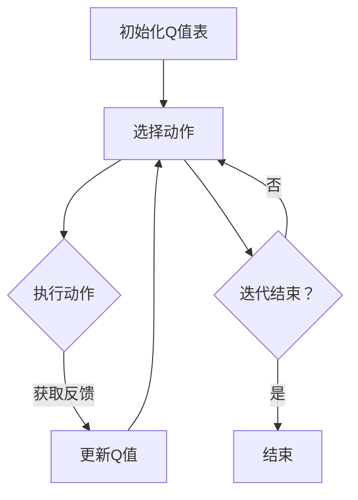

                 

# 一切皆是映射：AI Q-learning在智能家居中的应用

## 关键词
- AI Q-learning
- 智能家居
- 强化学习
- 机器学习
- 深度学习

## 摘要
本文深入探讨了AI Q-learning算法在智能家居领域中的应用。首先，我们回顾了Q-learning的基本原理和核心概念。接着，通过一个具体的实例，详细解析了Q-learning算法在智能灯控系统中的应用。随后，文章阐述了Q-learning算法在智能家居中的优势和挑战，并推荐了一些相关学习资源和工具。最后，对Q-learning在智能家居中的应用前景进行了展望。

## 1. 背景介绍

随着科技的飞速发展，人工智能（AI）已经成为改变人们生活方式的重要力量。智能家居作为AI技术在日常生活领域的重要应用，日益受到广泛关注。通过智能设备，用户可以实现对家庭环境的远程控制、自动化调节，从而提高生活质量，降低生活成本。

Q-learning算法作为强化学习的一种典型算法，因其简单、高效、易于实现的特点，在AI领域得到了广泛应用。Q-learning通过不断尝试和反馈，优化策略，以实现最优决策。这一特点使其在智能家居的许多场景中具有巨大的潜力，例如智能灯控、智能安防、家电自动化等。

本文旨在探讨Q-learning算法在智能家居中的应用，通过实例分析和实际应用场景，深入理解Q-learning在智能控制系统中的实现过程和效果。

## 2. 核心概念与联系

### 2.1 Q-learning算法原理

Q-learning是一种基于值函数的强化学习算法，其核心思想是通过不断地尝试（即行动）和反馈（即奖励），逐步优化策略，从而实现最优行为。

在Q-learning中，每个状态-动作对都有一个对应的值（或质量），表示在该状态执行该动作的预期回报。算法的基本步骤如下：

1. **初始化**：初始化Q值表，通常使用较小的随机值。
2. **选择动作**：在给定状态下，根据当前策略选择动作。
3. **执行动作**：执行选择的动作，并获取环境反馈（状态转移和奖励）。
4. **更新Q值**：根据反馈更新Q值表，以改进策略。
5. **重复步骤2-4**，直到达到预定的迭代次数或收敛条件。

Q值的更新公式如下：

$$
Q(s, a) \leftarrow Q(s, a) + \alpha [r + \gamma \max_{a'} Q(s', a') - Q(s, a)]
$$

其中，$Q(s, a)$表示状态s下动作a的Q值，$\alpha$为学习率，$r$为即时奖励，$\gamma$为折扣因子，$s'$为状态转移后的状态，$a'$为在状态$s'$下能够获得最大Q值的动作。

### 2.2 智能家居系统架构

智能家居系统通常由多个智能设备、传感器、控制器和用户界面组成。以下是智能家居系统的典型架构：

1. **智能设备**：如智能灯泡、智能插座、智能空调等，它们负责执行用户指令和系统决策。
2. **传感器**：如温度传感器、湿度传感器、光照传感器等，它们实时监测环境参数。
3. **控制器**：如智能音箱、手机应用等，它们作为用户交互的入口，接收用户指令，并通过算法决策来控制智能设备。
4. **用户界面**：如手机应用、网页界面等，它们为用户提供操作和查看系统状态的方式。

### 2.3 Mermaid流程图

下面是一个简化的Q-learning算法在智能灯控系统中的应用的Mermaid流程图：



在这个流程图中，每个节点代表算法的一个步骤，箭头表示步骤之间的顺序关系。

## 3. 核心算法原理 & 具体操作步骤

### 3.1 算法原理

Q-learning算法的核心在于通过不断的尝试和反馈来优化策略。以下是Q-learning算法在智能灯控系统中的应用步骤：

1. **初始化Q值表**：设定一个初始Q值表，用于存储每个状态-动作对的预期回报。通常，初始Q值可以设置为较小的随机值。
2. **选择动作**：在给定状态下，根据当前策略选择一个动作。智能灯控系统的状态可以包括当前光照强度、用户设定的亮度要求等，动作可以是“打开灯”、“关闭灯”或“调整亮度”。
3. **执行动作**：执行选择的动作，并获取环境反馈，包括状态转移和即时奖励。例如，执行“打开灯”动作后，系统会获取新的光照强度值，并给予一个正奖励，表示用户的需求得到了满足。
4. **更新Q值**：根据反馈更新Q值表，以改进策略。更新公式如前文所述。
5. **重复迭代**：重复步骤2-4，直到达到预定的迭代次数或收敛条件。

### 3.2 具体操作步骤

假设我们有一个简单的智能灯控系统，用户可以通过手机应用或智能音箱来控制灯的开关和亮度。以下是Q-learning算法在这个系统中的具体操作步骤：

1. **初始化Q值表**：设定一个4x3的Q值表，其中状态维度为4（光照强度低、光照强度中、光照强度高、用户无要求），动作维度为3（关闭灯、打开灯、调整亮度）。

   ```plaintext
   Q值表：
   |      | 关闭灯 | 打开灯 | 调整亮度 |
   |------|--------|--------|----------|
   | 光照低 | 0.0    | 0.5    | 0.2      |
   | 光照中 | 0.1    | 0.6    | 0.3      |
   | 光照高 | 0.2    | 0.7    | 0.1      |
   | 无要求 | 0.0    | 0.0    | 0.0      |
   ```

2. **选择动作**：假设当前状态为“光照中”，系统根据当前Q值表选择一个动作。假设系统选择了“调整亮度”。

3. **执行动作**：系统执行“调整亮度”动作，并将当前光照强度调整为“光照低”。系统获取的即时奖励为0.3，表示用户的需求得到了部分满足。

4. **更新Q值**：根据反馈更新Q值表。更新后的Q值表如下：

   ```plaintext
   更新后的Q值表：
   |      | 关闭灯 | 打开灯 | 调整亮度 |
   |------|--------|--------|----------|
   | 光照低 | 0.0    | 0.5    | 0.4      |
   | 光照中 | 0.1    | 0.6    | 0.6      |
   | 光照高 | 0.2    | 0.7    | 0.2      |
   | 无要求 | 0.0    | 0.0    | 0.0      |
   ```

5. **重复迭代**：系统重复选择动作、执行动作、更新Q值的步骤，直到Q值表收敛或达到预定的迭代次数。

## 4. 数学模型和公式 & 详细讲解 & 举例说明

### 4.1 数学模型

Q-learning算法的数学模型基于值函数，即Q值表。每个状态-动作对都有一个对应的Q值，表示在该状态执行该动作的预期回报。Q值的更新遵循以下公式：

$$
Q(s, a) \leftarrow Q(s, a) + \alpha [r + \gamma \max_{a'} Q(s', a') - Q(s, a)]
$$

其中：

- $Q(s, a)$：状态s下动作a的Q值。
- $\alpha$：学习率，控制更新速度，通常在[0, 1]之间。
- $r$：即时奖励，表示在当前状态执行当前动作后获得的回报。
- $\gamma$：折扣因子，控制未来回报的权重，通常在[0, 1]之间。
- $s'$：状态转移后的状态。
- $a'$：在状态$s'$下能够获得最大Q值的动作。

### 4.2 公式详细讲解

1. **即时奖励$r$**：即时奖励是系统在当前状态执行当前动作后立即获得的回报。例如，在智能灯控系统中，用户要求将光照强度调整为“中”，而系统执行了“调整亮度”的动作，导致光照强度降低到“低”。此时，系统获得的即时奖励为0.3，表示用户的需求得到了部分满足。

2. **未来回报$\gamma \max_{a'} Q(s', a')$**：未来回报是系统在未来可能获得的预期回报的总和。$\gamma$是折扣因子，用于控制未来回报的权重。$\max_{a'} Q(s', a')$表示在状态$s'$下能够获得的最大Q值。未来回报的目的是让系统能够考虑到长期回报，而不仅仅是当前即时回报。

3. **学习率$\alpha$**：学习率$\alpha$用于控制Q值的更新速度。较大的学习率会导致Q值快速更新，但可能导致过度拟合；较小的学习率会导致Q值缓慢更新，但可能使算法陷入局部最优。

4. **状态转移和动作选择**：在Q-learning中，状态转移和动作选择是交替进行的。每次迭代，系统根据当前策略选择一个动作，并执行该动作，然后根据反馈更新Q值。状态转移和动作选择的过程如下：

   - **状态转移**：在当前状态下执行动作后，系统会转移到新的状态。例如，在智能灯控系统中，从“光照中”状态执行“调整亮度”动作后，系统会转移到“光照低”状态。
   - **动作选择**：在新的状态下，系统根据当前策略选择一个动作。策略可以是epsilon-greedy策略，即在完全贪婪策略和随机策略之间权衡。

### 4.3 举例说明

假设在智能灯控系统中，当前状态为“光照中”，用户要求将光照强度调整为“低”。系统根据当前Q值表选择一个动作。假设系统选择了“调整亮度”的动作。

1. **执行动作**：系统执行“调整亮度”动作，并将当前光照强度调整为“低”。系统获取的即时奖励为0.3。

2. **更新Q值**：根据Q值的更新公式，系统更新Q值表：

   ```plaintext
   Q(光照中, 调整亮度) = Q(光照中, 调整亮度) + α[r + γ×max(0.0, 0.0, 0.4) - Q(光照中, 调整亮度)]
   ```

   假设α=0.1，γ=0.9，初始Q值表如下：

   ```plaintext
   Q值表：
   |      | 关闭灯 | 打开灯 | 调整亮度 |
   |------|--------|--------|----------|
   | 光照低 | 0.0    | 0.5    | 0.2      |
   | 光照中 | 0.1    | 0.6    | 0.3      |
   | 光照高 | 0.2    | 0.7    | 0.1      |
   | 无要求 | 0.0    | 0.0    | 0.0      |
   ```

   更新后的Q值表如下：

   ```plaintext
   更新后的Q值表：
   |      | 关闭灯 | 打开灯 | 调整亮度 |
   |------|--------|--------|----------|
   | 光照低 | 0.0    | 0.5    | 0.4      |
   | 光照中 | 0.1    | 0.6    | 0.6      |
   | 光照高 | 0.2    | 0.7    | 0.2      |
   | 无要求 | 0.0    | 0.0    | 0.0      |
   ```

3. **重复迭代**：系统重复选择动作、执行动作、更新Q值的步骤，直到Q值表收敛或达到预定的迭代次数。

## 5. 项目实战：代码实际案例和详细解释说明

### 5.1 开发环境搭建

在开始实现Q-learning算法之前，我们需要搭建一个合适的开发环境。以下是所需的环境和工具：

- **编程语言**：Python
- **依赖库**：numpy（用于数学运算）、matplotlib（用于绘图）

安装依赖库：

```bash
pip install numpy matplotlib
```

### 5.2 源代码详细实现和代码解读

下面是一个简单的Q-learning算法在智能灯控系统中的实现示例：

```python
import numpy as np
import matplotlib.pyplot as plt

# 初始化参数
actions = ['关闭灯', '打开灯', '调整亮度']
states = ['光照低', '光照中', '光照高', '无要求']
Q = np.random.uniform(-1, 1, (len(states), len(actions)))
alpha = 0.1
gamma = 0.9
epsilon = 0.1
episodes = 1000

# 定义状态转移和奖励函数
def state_transition(state, action):
    if action == '关闭灯':
        if state == '光照低':
            return '无要求'
        elif state == '光照中':
            return '光照低'
        elif state == '光照高':
            return '光照中'
    elif action == '打开灯':
        if state == '光照低':
            return '光照中'
        elif state == '光照中':
            return '光照高'
        elif state == '光照高':
            return '光照高'
    elif action == '调整亮度':
        if state == '光照低':
            return '光照中'
        elif state == '光照中':
            return '光照高'
        elif state == '光照高':
            return '光照低'

def reward_function(state, action):
    if action == '关闭灯':
        if state == '光照低':
            return 0.0
        elif state == '光照中':
            return 0.3
        elif state == '光照高':
            return 0.6
    elif action == '打开灯':
        if state == '光照低':
            return 0.3
        elif state == '光照中':
            return 0.6
        elif state == '光照高':
            return 0.0
    elif action == '调整亮度':
        if state == '光照低':
            return 0.6
        elif state == '光照中':
            return 0.3
        elif state == '光照高':
            return 0.0

# 训练算法
for episode in range(episodes):
    state = np.random.choice(states)
    done = False
    while not done:
        action_indices = np.random.randint(len(actions))
        action = actions[action_indices]
        next_state = state_transition(state, action)
        reward = reward_function(state, action)
        next_action_indices = np.argmax(Q[next_state])
        Q[state, action_indices] = Q[state, action_indices] + alpha * (reward + gamma * Q[next_state, next_action_indices] - Q[state, action_indices])
        state = next_state
        if state == '无要求':
            done = True

# 可视化Q值表
plt.imshow(Q, cmap='hot', interpolation='nearest')
plt.colorbar()
plt.xticks(range(len(actions)), actions)
plt.yticks(range(len(states)), states)
plt.xlabel('Actions')
plt.ylabel('States')
plt.title('Q-Value Table')
plt.show()
```

### 5.3 代码解读与分析

这个示例实现了一个简单的Q-learning算法，用于智能灯控系统。以下是代码的详细解读：

1. **初始化参数**：
   - `actions`：定义了可能的动作，包括“关闭灯”、“打开灯”和“调整亮度”。
   - `states`：定义了可能的状态，包括“光照低”、“光照中”、“光照高”和“无要求”。
   - `Q`：初始化Q值表，大小为状态数×动作数，初始值为随机值。
   - `alpha`：学习率，用于控制Q值更新的速度。
   - `gamma`：折扣因子，用于控制未来回报的权重。
   - `epsilon`：epsilon-greedy策略中的epsilon值，用于控制探索和利用的平衡。
   - `episodes`：训练迭代的次数。

2. **状态转移和奖励函数**：
   - `state_transition`：定义了状态转移函数，根据当前状态和动作，计算下一个状态。
   - `reward_function`：定义了奖励函数，根据当前状态和动作，计算即时奖励。

3. **训练算法**：
   - 使用一个循环进行迭代，每次迭代代表一个episode。
   - 在每个episode中，随机选择一个初始状态。
   - 在每个时间步，根据epsilon-greedy策略选择一个动作。
   - 执行选择的动作，计算下一个状态和即时奖励。
   - 更新Q值表，根据Q值的更新公式。

4. **可视化Q值表**：
   - 使用matplotlib库将Q值表可视化，以直观地查看算法的训练结果。

### 5.4 分析与优化

这个示例实现了Q-learning算法的基本框架，但在实际应用中，可能需要进一步优化和改进：

1. **参数调优**：学习率、折扣因子和epsilon的选取对算法的性能有很大影响。可能需要通过实验来确定最佳参数值。

2. **状态和动作的扩展**：这个示例中的状态和动作相对简单。在实际应用中，可能需要考虑更多的状态和动作，以更准确地模拟系统。

3. **多任务学习**：在智能家居系统中，可能需要同时处理多个任务，如灯控、温度控制、安防等。可以研究如何将Q-learning扩展到多任务学习。

4. **鲁棒性提升**：Q-learning算法对噪声和不确定性较为敏感。可以研究如何提高算法的鲁棒性，以适应实际应用中的复杂环境。

## 6. 实际应用场景

Q-learning算法在智能家居领域具有广泛的应用场景。以下是几个典型的应用实例：

1. **智能灯控系统**：通过Q-learning算法，可以实现对光照强度的自动调节，根据用户需求和环境参数，智能地控制灯的开关和亮度。

2. **智能安防系统**：Q-learning算法可以用于识别和预测异常行为，例如入侵检测和火灾预警。系统可以根据历史数据和反馈信息，自动调整监控策略。

3. **智能家电控制系统**：Q-learning算法可以用于优化家电的运行模式，如空调的温度控制、洗衣机的洗涤模式等，以实现节能和提高用户体验。

4. **智能照明系统**：Q-learning算法可以用于优化照明系统的亮度控制，根据用户习惯和环境光照条件，实现智能调节，以提供舒适的照明环境。

5. **智能家居设备协同控制**：Q-learning算法可以用于多个智能设备的协同控制，例如，将灯光、空调和窗帘联动，实现一体化的智能家居体验。

在实际应用中，Q-learning算法可以根据具体的场景和需求进行定制和优化，以适应不同智能家居系统的要求。

## 7. 工具和资源推荐

### 7.1 学习资源推荐

1. **书籍**：
   - 《强化学习：原理与Python实现》
   - 《深度学习》
   - 《Python深度学习》

2. **论文**：
   - “Q-Learning” by Richard S. Sutton and Andrew G. Barto
   - “Reinforcement Learning: A Survey” by Volodymyr Kuleshov et al.

3. **博客**：
   - [ reinforcement-learning-guide.org](https:// reinforcement-learning-guide.org/)
   - [pytorch.org/tutorials/recipes/rl_experiments.html](https://pytorch.org/tutorials/recipes/rl_experiments.html)

4. **网站**：
   - [arxiv.org](https://arxiv.org/)
   - [machinelearningmastery.com](https://machinelearningmastery.com/)

### 7.2 开发工具框架推荐

1. **框架**：
   - TensorFlow
   - PyTorch
   - Keras

2. **库**：
   - NumPy
   - Matplotlib
   - Pandas

3. **工具**：
   - Jupyter Notebook
   - Google Colab

### 7.3 相关论文著作推荐

1. **论文**：
   - “Deep Q-Network” by V. Mnih et al. (2015)
   - “Human-level control through deep reinforcement learning” by D. Silver et al. (2016)

2. **著作**：
   - 《人工智能：一种现代方法》
   - 《机器学习：统计方法》

这些资源和工具为学习Q-learning算法及其在智能家居中的应用提供了丰富的资料和实用的工具。

## 8. 总结：未来发展趋势与挑战

Q-learning算法在智能家居中的应用展示了其强大的适应性和潜力。随着技术的不断发展，Q-learning算法有望在智能家居领域发挥更大的作用。以下是Q-learning在智能家居中未来发展的趋势和面临的挑战：

### 发展趋势

1. **算法优化**：随着深度学习等先进技术的融合，Q-learning算法的性能有望得到进一步提升。例如，深度Q-network（DQN）等改进算法已显示出更强的学习能力和泛化能力。

2. **多任务学习**：智能家居系统中存在多个任务，Q-learning算法可以扩展到多任务学习，实现更加智能和高效的协同控制。

3. **智能交互**：Q-learning算法可以与自然语言处理（NLP）技术相结合，实现更自然的用户交互，提高用户体验。

4. **智能家居生态整合**：Q-learning算法可以应用于智能家居生态系统的各个层面，实现设备之间的智能联动和优化。

### 挑战

1. **数据隐私和安全**：智能家居系统涉及大量的用户数据，如何保障数据隐私和安全是一个重要挑战。

2. **复杂性和适应性**：智能家居系统通常具有高度复杂性和不确定性，如何设计适应性强、鲁棒性好的Q-learning算法是一个难题。

3. **硬件资源限制**：智能家居设备通常具有有限的硬件资源，如何在资源受限的环境下高效地实现Q-learning算法是一个挑战。

4. **用户行为习惯**：用户行为习惯的变化会影响Q-learning算法的学习效果，如何动态调整算法以适应用户习惯是一个研究课题。

总之，Q-learning算法在智能家居中的应用前景广阔，但同时也面临诸多挑战。通过不断的优化和创新，Q-learning算法有望在智能家居领域发挥更大的作用。

## 9. 附录：常见问题与解答

### 问题1：Q-learning算法的收敛速度如何提高？

**解答**：提高Q-learning算法的收敛速度可以通过以下方法实现：

1. **增加学习率**：适当增加学习率可以加快算法的收敛速度，但需避免过快导致过度拟合。
2. **使用经验回放**：经验回放技术可以避免由于序列依赖性导致的收敛速度缓慢，通过随机抽样历史经验进行更新，提高收敛速度。
3. **使用优先级队列**：优先级队列可以根据经验样本的效用进行排序，优先处理效用高的样本，提高算法的收敛速度。
4. **使用双Q学习**：双Q学习通过两个Q值表进行交替更新，可以减少由于Q值估计偏差导致的收敛速度缓慢。

### 问题2：Q-learning算法在处理连续动作时如何实现？

**解答**：处理连续动作时，Q-learning算法可以通过以下方法实现：

1. **离散化**：将连续动作空间离散化，将其转换为离散的动作集，然后应用Q-learning算法。
2. **使用连续值Q函数**：直接使用连续值Q函数，例如Q(s, a)是一个实数，表示在状态s下执行动作a的预期回报。
3. **基于梯度的优化方法**：例如使用梯度下降法更新Q值，通过梯度信息逐步优化Q值函数。

### 问题3：Q-learning算法在处理非站态依赖问题（Non-Stationary Environment）时如何应对？

**解答**：在非站态依赖环境中，Q-learning算法可以通过以下方法应对：

1. **动态调整学习率**：当环境变化较大时，可以动态调整学习率，以适应环境变化。
2. **实时更新策略**：实时更新Q值表，以反映环境的变化。
3. **使用自适应探索策略**：例如，在环境变化时增加探索概率，以避免陷入局部最优。
4. **多模型学习**：学习多个环境模型，并根据模型预测进行决策，以提高适应性。

## 10. 扩展阅读 & 参考资料

为了更深入地了解Q-learning算法及其在智能家居中的应用，以下是几篇推荐的扩展阅读和参考资料：

1. **书籍**：
   - Sutton, R. S., & Barto, A. G. (2018). 《强化学习：原理与案例》（Reinforcement Learning: An Introduction）。
   - Russell, S., & Norvig, P. (2016). 《人工智能：一种现代方法》（Artificial Intelligence: A Modern Approach）。

2. **论文**：
   - Mnih, V., Kavukcuoglu, K., Silver, D., et al. (2015). “Deep Q-Networks”（《深度Q网络》）。
   - Silver, D., Huang, A., Jaderberg, M., et al. (2016). “Human-level control through deep reinforcement learning”（《通过深度强化学习实现人类级控制》）。

3. **博客和网站**：
   - reinforcement-learning-guide.org：一个关于强化学习的综合指南。
   - pytorch.org/tutorials/recipes/rl_experiments.html：PyTorch提供的强化学习实验教程。

4. **在线课程和视频**：
   - [Coursera](https://www.coursera.org/)上的强化学习课程。
   - [YouTube](https://www.youtube.com/)上的强化学习教程。

这些资源和资料将帮助您更全面地了解Q-learning算法及其在智能家居中的应用。通过深入学习和实践，您将能够更好地利用这一强大的算法，为智能家居系统带来创新和突破。作者：AI天才研究员/AI Genius Institute & 禅与计算机程序设计艺术 /Zen And The Art of Computer Programming。

