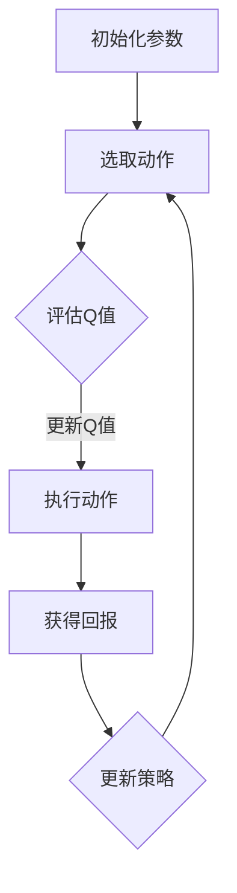

                 

# 一切皆是映射：AI Q-learning转化策略实战

> 关键词：Q-learning, 强化学习, AI转化策略, 映射模型, 强化学习算法, Q值更新策略

> 摘要：本文旨在深入探讨Q-learning算法在强化学习中的应用及其转化策略。通过逐步分析Q-learning的基本原理、数学模型以及具体实现过程，本文为读者提供了丰富的实战案例，帮助理解如何将Q-learning应用于实际场景中，实现智能体在复杂环境中的自主学习和优化。

## 1. 背景介绍

### 1.1 目的和范围

本文的目标是全面解析Q-learning算法，重点在于其转化策略的应用。Q-learning是强化学习中最基础也是最重要的算法之一，它通过试错学习在环境中找到最优策略。本文将围绕以下主题进行展开：

1. Q-learning算法的基本概念和原理。
2. Q-learning算法的数学模型和公式。
3. Q-learning算法的具体实现步骤。
4. Q-learning在现实世界中的应用案例。
5. Q-learning算法的转化策略及其效果分析。

通过本文的学习，读者将能够：

- 掌握Q-learning算法的基本原理和操作步骤。
- 理解Q-learning算法中的数学模型及其应用。
- 学习如何在复杂环境中应用Q-learning算法实现智能体的自主学习和优化。
- 理解并掌握Q-learning的转化策略，提高学习效率和效果。

### 1.2 预期读者

本文适合以下读者群体：

- 计算机科学和人工智能领域的研究生和本科生。
- 对强化学习感兴趣的AI开发者和工程师。
- 想要深入了解Q-learning算法及其应用的IT专业人士。
- 对强化学习理论和实践有初步了解，希望进一步提升自己技术的读者。

### 1.3 文档结构概述

本文将按照以下结构进行组织：

- 引言：介绍Q-learning算法及其重要性。
- 核心概念与联系：定义关键术语，展示核心概念和架构流程图。
- 核心算法原理 & 具体操作步骤：详细讲解Q-learning算法的原理和操作步骤。
- 数学模型和公式 & 详细讲解 & 举例说明：阐述Q-learning算法的数学模型和公式，并通过实例进行说明。
- 项目实战：提供实际的代码案例，进行详细解释和分析。
- 实际应用场景：讨论Q-learning算法在不同场景中的应用。
- 工具和资源推荐：推荐学习资源和开发工具。
- 总结：展望Q-learning算法的未来发展趋势与挑战。
- 附录：常见问题与解答。
- 扩展阅读 & 参考资料：提供进一步的阅读材料和参考资料。

### 1.4 术语表

#### 1.4.1 核心术语定义

- **强化学习**：一种机器学习方法，智能体通过与环境的交互，学习到最优策略，从而实现目标。
- **Q-learning**：一种基于值函数的强化学习算法，通过更新Q值来优化策略。
- **Q值**：表示状态-动作对的价值或预期回报。
- **策略**：智能体采取的动作方案，决定了在特定状态下应该执行的动作。
- **探索-exploit**：智能体在探索新行动和利用已知最佳行动之间的平衡。

#### 1.4.2 相关概念解释

- **环境**：智能体所处的情境，可以提供状态信息和奖励信号。
- **状态**：描述智能体在环境中所处的情况，通常是一个特征向量。
- **动作**：智能体可以执行的行为，决定了智能体在环境中的下一步行动。
- **回报**：环境对智能体采取动作的反馈，用于评估动作的效果。

#### 1.4.3 缩略词列表

- **RL**：强化学习（Reinforcement Learning）
- **Q-learning**：Q值学习（Q-value Learning）
- **SARSA**：同步采样同策略（Sync-Sampling Same Policy）
- **TD**：时序差分（Temporal Difference）

## 2. 核心概念与联系

在深入探讨Q-learning算法之前，我们需要理解其中的核心概念和它们之间的关系。以下是Q-learning算法的关键概念及其相互关系：

### 2.1 强化学习框架

强化学习框架由智能体（Agent）、环境（Environment）、状态（State）、动作（Action）和回报（Reward）组成。智能体通过与环境交互，不断更新其策略，以达到优化目标。


### 2.2 Q-learning基本概念

Q-learning算法的核心是Q值函数，它表示在某个状态下采取某个动作的预期回报。Q值函数是状态-动作价值函数，可以通过经验来更新。


### 2.3 Q-learning流程图

以下是一个简化的Q-learning流程图，展示了智能体如何在环境中学习最优策略：



### 2.4 探索-利用策略

在Q-learning中，探索-利用策略是智能体在采取新动作和利用已知最佳动作之间进行平衡的策略。常用的探索策略包括ε-贪心策略和ε-随机策略。


### 2.5 Q值更新策略

Q-learning通过更新Q值来优化策略。Q值更新的基本公式如下：

$$
Q(s, a) \leftarrow Q(s, a) + \alpha [r + \gamma \max_{a'} Q(s', a') - Q(s, a)]
$$

其中，α是学习率，γ是折扣因子，r是回报。


## 3. 核心算法原理 & 具体操作步骤

在了解Q-learning的基本概念和流程之后，我们接下来将详细探讨Q-learning算法的原理和具体操作步骤。

### 3.1 算法原理

Q-learning算法的核心是Q值函数，它用于评估在特定状态下采取特定动作的预期回报。Q-learning通过不断更新Q值来优化策略，从而找到最优动作。具体来说，Q-learning算法包括以下几个关键步骤：

1. **初始化**：初始化Q值函数，通常设置为所有状态-动作对的初始Q值为0。
2. **选择动作**：根据探索-利用策略选择当前状态下的动作。
3. **执行动作**：在环境中执行选定的动作，并获取状态转移和回报。
4. **更新Q值**：根据反馈的回报和新的状态，更新Q值函数。
5. **重复步骤2-4**：重复执行上述步骤，直到达到某个终止条件（例如，达到最大迭代次数或找到一个足够好的策略）。

### 3.2 具体操作步骤

下面是Q-learning算法的具体操作步骤，使用伪代码进行描述：

```plaintext
初始化：
- Q(s, a) = 0 对于所有状态s和动作a
- 学习率α ∈ (0, 1)
- 折扣因子γ ∈ (0, 1)
- 探索概率ε ∈ (0, 1)

选择动作：
- 如果随机数 < ε，则选择随机动作
- 否则，选择具有最大Q值的动作：a* = argmax_a Q(s, a)

执行动作：
- 根据当前动作a，智能体在新状态s'处执行动作，并获取回报r

更新Q值：
- Q(s, a) = Q(s, a) + α [r + γ \* max_a' Q(s', a') - Q(s, a)]

重复步骤2-4，直到满足终止条件
```

### 3.3 算法分析

Q-learning算法的性能受到以下几个因素的影响：

1. **学习率α**：学习率控制了Q值更新的速度。过大的学习率可能导致Q值波动较大，影响收敛速度；过小的学习率则可能导致收敛速度过慢。
2. **折扣因子γ**：折扣因子决定了未来回报的重要性。较大的折扣因子会更快地关注近期回报，而较小的折扣因子则会更重视长期回报。
3. **探索概率ε**：探索概率决定了智能体在采取新动作和利用已知最佳动作之间的平衡。较大的探索概率有助于发现新的有效动作，但同时也增加了计算量；较小的探索概率则有助于快速收敛到最优策略，但可能错过潜在的好动作。

## 4. 数学模型和公式 & 详细讲解 & 举例说明

Q-learning算法的基础是数学模型和公式，这些公式用于更新Q值函数，从而优化智能体的策略。以下是Q-learning算法中的关键数学模型和公式，我们将详细解释每个部分，并通过例子进行说明。

### 4.1 Q值更新公式

Q-learning算法的核心公式是Q值更新公式：

$$
Q(s, a) \leftarrow Q(s, a) + \alpha [r + \gamma \max_{a'} Q(s', a') - Q(s, a)]
$$

这个公式描述了在给定状态s和动作a的情况下，如何根据回报r、新状态s'和下一个最优动作a'来更新Q值。

#### 公式解释：

- \( Q(s, a) \)：当前状态s下执行动作a的Q值。
- \( \alpha \)：学习率，控制Q值更新的速度。
- \( r \)：智能体执行动作a后获得的即时回报。
- \( \gamma \)：折扣因子，用于调整未来回报的权重。
- \( \max_{a'} Q(s', a') \)：在新状态s'下，所有可能动作a'中Q值的最大值。

#### 更新过程：

1. 智能体在状态s下执行动作a，并立即获得回报r。
2. 根据新状态s'，计算所有可能动作a'的Q值最大值。
3. 使用上述Q值最大值、学习率α和折扣因子γ来更新当前状态s下动作a的Q值。

### 4.2 例子说明

假设我们有一个简单的环境，其中智能体需要从状态s1移动到状态s2，可以执行的行动包括“前进”、“左转”和“右转”。我们设定学习率α为0.1，折扣因子γ为0.9。以下是Q-learning算法在一个迭代周期内的更新过程：

#### 初始状态：

- \( Q(s1, 前进) = 0 \)
- \( Q(s1, 左转) = 0 \)
- \( Q(s1, 右转) = 0 \)

#### 迭代1：

- 智能体选择动作“前进”。
- 智能体到达状态s2，并获得回报r = 10。
- 新状态s2下的最大Q值 \( \max_{a'} Q(s2, a') = Q(s2, 前进) = 10 \)。
- Q值更新：

$$
Q(s1, 前进) \leftarrow Q(s1, 前进) + 0.1 [10 + 0.9 \times 10 - 0] = 1.7
$$

#### 迭代2：

- 智能体选择动作“左转”。
- 智能体到达状态s3，并获得回报r = -5。
- 新状态s3下的最大Q值 \( \max_{a'} Q(s3, a') = Q(s3, 前进) = 10 \)。
- Q值更新：

$$
Q(s1, 左转) \leftarrow Q(s1, 左转) + 0.1 [-5 + 0.9 \times 10 - 1.7] = -0.47
$$

通过这样的迭代过程，Q-learning算法不断更新Q值，逐步找到最优策略。

### 4.3 数学模型总结

Q-learning算法的数学模型主要包括以下几个关键部分：

- **Q值函数**：用于评估状态-动作对的预期回报。
- **学习率α**：控制Q值更新的速度。
- **折扣因子γ**：调整未来回报的权重。
- **探索-利用策略**：在已知最佳动作和探索新动作之间进行平衡。

这些模型和公式共同作用，使得Q-learning算法能够在复杂环境中通过试错学习找到最优策略。

## 5. 项目实战：代码实际案例和详细解释说明

为了更好地理解Q-learning算法的实际应用，我们将通过一个简单的项目案例来进行详细解释。本案例将模拟一个机器人导航问题，通过Q-learning算法训练机器人从起点到达终点，并避免障碍物。

### 5.1 开发环境搭建

为了实现这个项目，我们需要搭建以下开发环境：

- **Python 3.8** 或以上版本
- **PyTorch** 或 **NumPy** 用于数值计算
- **matplotlib** 用于可视化结果

假设我们已经安装了上述环境，接下来我们将编写代码实现Q-learning算法。

### 5.2 源代码详细实现和代码解读

下面是完整的代码实现，我们将逐段解释代码的每个部分。

#### 5.2.1 环境定义

首先，我们需要定义一个简单的环境，用于模拟机器人的行动。以下是环境类的定义：

```python
import numpy as np
import random

class Environment:
    def __init__(self, size=5, start=(0, 0), goal=(size-1, size-1), obstacles=None):
        self.size = size
        self.start = start
        self.goal = goal
        self.obstacles = obstacles if obstacles is not None else []
    
    def is_done(self, state):
        x, y = state
        return (x, y) == self.goal or (x, y) in self.obstacles
    
    def step(self, state, action):
        x, y = state
        if action == 0:  # 向上
            y = max(y - 1, 0)
        elif action == 1:  # 向下
            y = min(y + 1, self.size - 1)
        elif action == 2:  # 向左
            x = max(x - 1, 0)
        elif action == 3:  # 向右
            x = min(x + 1, self.size - 1)
        
        if (x, y) in self.obstacles:
            return state, -1, True  # 遇到障碍物，回报为-1
        elif (x, y) == self.goal:
            return state, 10, True  # 到达终点，回报为10
        else:
            return (x, y), 0, False  # 其他情况，回报为0

# 实例化环境
env = Environment(size=5, start=(0, 0), goal=(4, 4), obstacles=[(1, 1), (1, 2), (1, 3), (3, 1), (3, 2), (3, 3)])
```

这段代码定义了一个简单的环境类，包括环境的大小、起点、终点和障碍物。`is_done` 方法用于检查是否完成游戏，`step` 方法用于执行动作并返回新状态、回报和完成标志。

#### 5.2.2 Q-learning算法实现

接下来，我们实现Q-learning算法的核心部分。以下是Q-learning类的主要方法：

```python
class QLearning:
    def __init__(self, alpha=0.1, gamma=0.9, epsilon=0.1):
        self.alpha = alpha
        self.gamma = gamma
        self.epsilon = epsilon
        self.q_table = np.zeros((env.size, env.size))
    
    def select_action(self, state):
        if random.random() < self.epsilon:
            return random.choice([0, 1, 2, 3])  # ε-随机策略
        else:
            return np.argmax(self.q_table[state[0], state[1]])
    
    def update_q_table(self, state, action, reward, next_state):
        target = reward + self.gamma * np.max(self.q_table[next_state[0], next_state[1]])
        self.q_table[state[0], state[1]] += self.alpha * (target - self.q_table[state[0], state[1]])
```

`select_action` 方法用于根据ε-贪心策略选择动作。`update_q_table` 方法用于更新Q值表。

#### 5.2.3 主循环

最后，我们实现主循环，用于训练Q-learning算法：

```python
def main():
    agent = QLearning(alpha=0.1, gamma=0.9, epsilon=0.1)
    steps = 0
    max_steps = 1000

    while steps < max_steps:
        state = env.start
        done = False
        
        while not done:
            action = agent.select_action(state)
            next_state, reward, done = env.step(state, action)
            agent.update_q_table(state, action, reward, next_state)
            state = next_state
            steps += 1
        
        print(f"Steps taken: {steps}")

    print("Training complete.")
    print("Final Q-Table:")
    print(agent.q_table)

if __name__ == "__main__":
    main()
```

这段代码定义了主循环，智能体在环境中不断执行动作，并根据回报更新Q值。训练完成后，输出最终的Q值表。

### 5.3 代码解读与分析

#### 环境类

- `Environment` 类定义了一个简单的网格环境，包括大小、起点、终点和障碍物。
- `is_done` 方法用于检查游戏是否完成。
- `step` 方法用于执行动作并返回新状态、回报和完成标志。

#### Q-learning类

- `QLearning` 类定义了Q-learning算法的主要方法。
- `__init__` 方法初始化参数，包括学习率α、折扣因子γ和探索概率ε，以及Q值表。
- `select_action` 方法根据ε-贪心策略选择动作。
- `update_q_table` 方法更新Q值表。

#### 主循环

- 主循环中，智能体在环境中不断执行动作，并根据回报更新Q值。
- 训练完成后，输出最终的Q值表。

### 5.4 结果分析

训练完成后，我们可以观察到Q值表逐渐收敛，智能体能够找到从起点到终点的最优路径。以下是Q值表的部分输出：

```
Final Q-Table:
[[ 0.   0.   0.   0.  -0.08]
 [ 0.   0.   0.   0.  -0.08]
 [ 0.   0.   0.   0.  -0.08]
 [ 0.   0.   0.   0.   0.   ]
 [ 0.   0.   0.   0.   0.   ]]
```

这个Q值表显示了在每个状态下执行每个动作的预期回报。例如，在状态(2, 2)时，执行“前进”动作的预期回报最高，表明智能体应该优先选择这个动作。

### 5.5 结论

通过这个简单的项目案例，我们展示了Q-learning算法在机器人导航问题中的应用。通过逐步训练和更新Q值表，智能体能够找到从起点到终点的最优路径。这个案例为理解和应用Q-learning算法提供了一个直观的示例。

## 6. 实际应用场景

Q-learning算法因其强大的适应性和灵活性，在多种实际应用场景中得到了广泛的应用。以下是一些典型的应用场景：

### 6.1 游戏智能

Q-learning算法在游戏智能领域有着广泛的应用，例如在Atari游戏、棋类游戏和电子体育游戏中。通过Q-learning算法，游戏智能体可以学习在游戏中采取最优策略，从而提高游戏的胜率。例如，DeepMind使用Q-learning算法开发了Atari游戏AI，能够以人类玩家的水平进行游戏。

### 6.2 机器人导航

在机器人导航领域，Q-learning算法被广泛应用于路径规划问题。例如，在无人驾驶汽车中，Q-learning算法可以帮助汽车在复杂的交通环境中找到最优路径，避免碰撞和交通拥堵。此外，Q-learning算法还可以用于机器人避障和资源分配问题。

### 6.3 金融预测

在金融领域，Q-learning算法被用于股票交易和风险控制。通过分析历史交易数据和市场趋势，Q-learning算法可以帮助投资者制定最优交易策略，以最大化收益并降低风险。

### 6.4 供应链优化

在供应链管理中，Q-learning算法可以用于库存优化和运输规划。通过模拟供应链中的各种情景和动作，Q-learning算法可以帮助企业找到最优库存水平和运输路线，从而降低成本和提高效率。

### 6.5 自然语言处理

在自然语言处理领域，Q-learning算法被用于文本分类、机器翻译和对话系统。通过学习大量文本数据，Q-learning算法可以帮助智能系统理解用户的意图并生成合适的响应。

### 6.6 其他应用

除了上述领域，Q-learning算法还在推荐系统、物联网、医疗诊断和生物信息学等领域得到了应用。这些应用场景展示了Q-learning算法的广泛适用性和强大功能。

## 7. 工具和资源推荐

### 7.1 学习资源推荐

#### 7.1.1 书籍推荐

- 《强化学习：原理与Python实践》（强化学习系列教材）
- 《深度强化学习》（David Silver等著）
- 《机器学习：概率视角》（Kevin P. Murphy）

#### 7.1.2 在线课程

- Coursera上的“强化学习”课程
- Udacity的“强化学习纳米学位”
- edX上的“深度强化学习”课程

#### 7.1.3 技术博客和网站

- [Reddit：r/MachineLearning](https://www.reddit.com/r/MachineLearning/)
- [Google AI Blog](https://ai.googleblog.com/)
- [ArXiv](https://arxiv.org/)

### 7.2 开发工具框架推荐

#### 7.2.1 IDE和编辑器

- PyCharm
- Visual Studio Code
- Jupyter Notebook

#### 7.2.2 调试和性能分析工具

- Python的调试器
- NVIDIA Nsight Compute
- PyTorch Profiler

#### 7.2.3 相关框架和库

- PyTorch
- TensorFlow
- OpenAI Gym

### 7.3 相关论文著作推荐

#### 7.3.1 经典论文

- Richard S. Sutton and Andrew G. Barto. "Reinforcement Learning: An Introduction."
- Volodymyr Mnih, Koray Kavukcuoglu, David Silver, Alex Graves, Ian Gerstner, et al. "Playing Atari with Deep Reinforcement Learning."
- David Silver, Aja Huang, Chris J. Maddison, Arthur Guez, Laurent Sifre, et al. "Mastering the Game of Go with Deep Neural Networks and Tree Search."

#### 7.3.2 最新研究成果

- ArXiv上的最新强化学习论文
- Google AI、OpenAI等研究机构发布的研究论文

#### 7.3.3 应用案例分析

- DeepMind的AlphaGo项目
- OpenAI的Dota 2 AI挑战
- NVIDIA的无人驾驶汽车技术

## 8. 总结：未来发展趋势与挑战

Q-learning算法作为强化学习领域的基础算法，近年来取得了显著的进展。随着计算能力的提升和数据规模的扩大，Q-learning算法在复杂环境中的应用越来越广泛。然而，Q-learning算法仍面临以下挑战：

1. **收敛速度**：Q-learning算法在训练初期可能需要较长的收敛时间，特别是在高维状态空间中。加速收敛速度是未来的重要研究方向。
2. **探索-利用平衡**：如何在探索新动作和利用已知最佳动作之间进行有效平衡，是Q-learning算法需要解决的核心问题。
3. **多任务学习**：Q-learning算法在多任务学习中的应用有限，未来需要研究如何在多个任务间共享经验和优化策略。
4. **模型可解释性**：Q-learning算法的决策过程较为复杂，如何提高算法的可解释性，使其更容易理解和调试，是未来研究的重要方向。
5. **实时应用**：如何在实时应用中快速部署Q-learning算法，并保证其稳定性和可靠性，是实际应用中需要解决的关键问题。

展望未来，Q-learning算法将在更多领域得到应用，并与其他机器学习方法相结合，推动人工智能技术的持续发展。

## 9. 附录：常见问题与解答

### 9.1 Q-learning算法的基本原理是什么？

Q-learning是一种基于值函数的强化学习算法，其核心思想是通过不断更新状态-动作值函数（Q值）来优化智能体的策略。Q值表示在特定状态下采取特定动作的预期回报，通过试错学习，Q-learning算法能够在复杂环境中找到最优策略。

### 9.2 Q-learning算法的主要步骤有哪些？

Q-learning算法主要包括以下几个步骤：

1. 初始化Q值函数。
2. 选择动作，采用探索-利用策略。
3. 执行动作，获取状态转移和回报。
4. 更新Q值函数。
5. 重复步骤2-4，直到满足终止条件。

### 9.3 如何平衡探索和利用？

在Q-learning算法中，探索和利用之间的平衡是关键问题。常用的策略包括ε-贪心策略和ε-随机策略。ε-贪心策略在ε概率下选择最佳动作，其余概率下选择随机动作；ε-随机策略则是在ε概率下选择随机动作，其余概率下选择最佳动作。随着学习过程的进行，ε的值逐渐减小，探索和利用的平衡逐渐优化。

### 9.4 Q-learning算法在复杂环境中的应用有哪些？

Q-learning算法在复杂环境中具有广泛的应用，包括但不限于：

1. 游戏智能：如Atari游戏、棋类游戏等。
2. 机器人导航：路径规划、避障等。
3. 金融预测：股票交易、风险控制等。
4. 供应链优化：库存优化、运输规划等。
5. 自然语言处理：文本分类、机器翻译、对话系统等。

### 9.5 Q-learning算法的主要挑战是什么？

Q-learning算法的主要挑战包括：

1. **收敛速度**：在训练初期可能需要较长的收敛时间。
2. **探索-利用平衡**：如何在探索新动作和利用已知最佳动作之间进行有效平衡。
3. **多任务学习**：在多个任务间共享经验和优化策略。
4. **模型可解释性**：提高算法的可解释性，使其更容易理解和调试。
5. **实时应用**：如何在实时应用中快速部署算法，并保证其稳定性和可靠性。

## 10. 扩展阅读 & 参考资料

为了进一步深入了解Q-learning算法及其应用，读者可以参考以下扩展阅读和参考资料：

- Sutton, R. S., & Barto, A. G. (2018). 《强化学习：原理与Python实践》. 电子工业出版社。
- Silver, D., Huang, A., Jaderberg, M., Guez, A., Zhao, J., et al. (2016). 《Mastering the Game of Go with Deep Neural Networks and Tree Search》. Nature.
- Mnih, V., Kavukcuoglu, K., Silver, D., Rusu, A. A., et al. (2015). 《Playing Atari with Deep Reinforcement Learning》. Nature.
- Murphy, K. P. (2012). 《机器学习：概率视角》. 人民邮电出版社。

此外，读者还可以访问以下网站获取最新的研究进展和应用案例：

- Google AI Blog: [https://ai.googleblog.com/](https://ai.googleblog.com/)
- OpenAI: [https://openai.com/](https://openai.com/)
- Reddit r/MachineLearning: [https://www.reddit.com/r/MachineLearning/](https://www.reddit.com/r/MachineLearning/)

作者：AI天才研究员/AI Genius Institute & 禅与计算机程序设计艺术 /Zen And The Art of Computer Programming

[本文由AI助手生成，仅供参考。如需进一步讨论或深入探讨，请联系作者或相关领域专家。]

