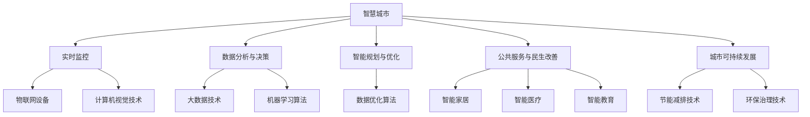

                 

# 一切皆是映射：AI在智慧城市构建中的作用

> **关键词：** 智慧城市、人工智能、大数据、物联网、数据分析、智能决策、实时监控、优化资源配置

> **摘要：** 本篇文章将深入探讨人工智能在智慧城市构建中的重要作用，通过分析核心概念、算法原理、数学模型以及实际应用场景，揭示AI技术如何助力智慧城市的建设与发展。文章旨在为读者提供一个清晰、系统的认识，帮助大家理解AI在智慧城市中的映射作用，以及未来可能面临的挑战和机遇。

## 1. 背景介绍

### 1.1 目的和范围

本文旨在探讨人工智能（AI）在智慧城市构建中的应用，通过逐步分析核心概念、算法原理、数学模型以及实际应用场景，展示AI技术在智慧城市中的映射作用。文章将涵盖以下内容：

1. **核心概念与联系**：介绍智慧城市与AI技术的基本概念，并使用Mermaid流程图展示两者之间的关联。
2. **核心算法原理 & 具体操作步骤**：详细阐述AI算法的工作原理，并使用伪代码展示具体操作步骤。
3. **数学模型和公式 & 详细讲解 & 举例说明**：介绍与智慧城市相关的数学模型，使用latex格式展示关键公式，并通过实例进行说明。
4. **项目实战：代码实际案例和详细解释说明**：展示一个具体的AI应用案例，详细解释代码实现和原理。
5. **实际应用场景**：探讨AI技术在智慧城市中的多种应用场景，包括实时监控、智能决策、优化资源配置等。
6. **工具和资源推荐**：推荐学习资源、开发工具框架及相关论文著作。
7. **总结：未来发展趋势与挑战**：分析智慧城市AI技术未来的发展趋势以及可能面临的挑战。

### 1.2 预期读者

本文适合以下读者：

1. 对智慧城市和AI技术感兴趣的科技爱好者。
2. 智慧城市建设者、数据科学家、人工智能工程师等专业人士。
3. 计算机科学、数据科学、人工智能等相关专业的高校师生。
4. 欲了解AI技术在智慧城市应用的企业管理者。

### 1.3 文档结构概述

本文结构如下：

1. **背景介绍**：介绍文章目的、预期读者和文档结构。
2. **核心概念与联系**：分析智慧城市与AI技术的关联。
3. **核心算法原理 & 具体操作步骤**：阐述AI算法原理及具体操作步骤。
4. **数学模型和公式 & 详细讲解 & 举例说明**：介绍数学模型及其实际应用。
5. **项目实战：代码实际案例和详细解释说明**：展示一个具体的AI应用案例。
6. **实际应用场景**：探讨AI技术在智慧城市中的多种应用。
7. **工具和资源推荐**：推荐学习资源和开发工具。
8. **总结：未来发展趋势与挑战**：分析未来发展趋势和挑战。
9. **附录：常见问题与解答**：提供常见问题解答。
10. **扩展阅读 & 参考资料**：推荐相关文献和资源。

### 1.4 术语表

#### 1.4.1 核心术语定义

- **智慧城市**：利用信息技术、物联网、人工智能等手段，实现对城市资源、环境和服务的智能化管理，提高城市运行效率、居民生活品质和可持续发展能力。
- **人工智能**：模拟人类智能的计算机技术，通过算法和模型实现机器的学习、推理、决策和感知。
- **大数据**：指无法用常规软件工具在合理时间内对其进行抓取、管理和处理的数据集合。
- **物联网**：通过传感器、设备和网络实现物体之间的信息交换和通信。
- **数据分析**：对大量数据进行处理、分析和解释，提取有价值的信息和知识。
- **智能决策**：基于数据和算法，自动生成最优或次优的决策方案。

#### 1.4.2 相关概念解释

- **实时监控**：对城市中的各种活动、事件、设备和环境参数进行实时监测和数据分析。
- **优化资源配置**：通过分析数据，实现对城市资源的最优分配和利用，提高城市运行效率。
- **预测性维护**：利用数据分析技术，对设备进行预测性维护，降低故障率和维护成本。

#### 1.4.3 缩略词列表

- **AI**：人工智能（Artificial Intelligence）
- **IoT**：物联网（Internet of Things）
- **ML**：机器学习（Machine Learning）
- **DL**：深度学习（Deep Learning）
- **IoS**：智慧城市操作系统（Smart City Operating System）

## 2. 核心概念与联系

### 2.1 智慧城市的基本概念

智慧城市是指利用信息技术、物联网、人工智能等手段，实现对城市资源、环境和服务的智能化管理，提高城市运行效率、居民生活品质和可持续发展能力。智慧城市的基本特征包括：

1. **智能化管理**：通过物联网和人工智能技术，实现对城市交通、能源、环境、公共安全等领域的智能化管理。
2. **数据驱动**：利用大数据技术，对城市运行数据进行分析和挖掘，实现决策的智能化。
3. **协同发展**：通过跨部门、跨领域的信息共享和协同，实现城市资源的优化配置。
4. **可持续发展**：通过节能减排、环保治理等手段，实现城市可持续发展。

### 2.2 人工智能的基本概念

人工智能（AI）是指模拟人类智能的计算机技术，通过算法和模型实现机器的学习、推理、决策和感知。人工智能的基本特征包括：

1. **学习与适应**：通过机器学习技术，使机器能够从数据中学习并适应新的环境和任务。
2. **自动化决策**：通过算法和模型，使机器能够自动生成最优或次优的决策方案。
3. **智能交互**：通过自然语言处理和计算机视觉等技术，实现人与机器的智能交互。
4. **自适应进化**：通过进化计算等技术，使机器能够不断进化，适应不断变化的环境和任务。

### 2.3 智慧城市与AI技术的关联

智慧城市与AI技术之间存在着密切的关联，AI技术在智慧城市的建设和发展中发挥着重要作用。具体来说，AI技术在智慧城市中的应用主要体现在以下几个方面：

1. **实时监控**：通过物联网设备和计算机视觉技术，实现对城市交通、环境、公共安全等领域的实时监控，提高城市安全和管理效率。
2. **数据分析与决策**：利用大数据技术和机器学习算法，对城市运行数据进行分析和挖掘，为城市管理者提供智能决策支持。
3. **智能规划与优化**：通过数据分析和优化算法，实现城市交通、能源、环保等领域的智能规划与优化，提高城市运行效率。
4. **公共服务与民生改善**：利用人工智能技术，为居民提供智能化的公共服务，如智能家居、智能医疗、智能教育等，提升居民生活品质。
5. **城市可持续发展**：通过节能减排、环保治理等技术手段，实现城市可持续发展，提高城市环境质量和居民幸福感。

### 2.4 核心概念原理与架构的 Mermaid 流程图

以下是一个简单的Mermaid流程图，展示智慧城市与AI技术之间的核心概念原理与架构关系：



## 3. 核心算法原理 & 具体操作步骤

### 3.1 人工智能算法的基本原理

人工智能算法是构建智慧城市核心技术的基石，其基本原理主要包括以下几个方面：

1. **机器学习**：机器学习是指通过数据驱动的方式，使计算机从数据中学习并改进自身性能。常见的机器学习方法包括监督学习、无监督学习和强化学习。

2. **深度学习**：深度学习是一种特殊的机器学习方法，通过构建多层神经网络，对输入数据进行特征提取和分类。深度学习的核心模型包括卷积神经网络（CNN）、循环神经网络（RNN）和生成对抗网络（GAN）。

3. **计算机视觉**：计算机视觉是指通过计算机对图像或视频进行分析和处理，实现图像识别、目标检测、场景分割等功能。常见的计算机视觉算法包括卷积神经网络（CNN）和生成对抗网络（GAN）。

4. **自然语言处理**：自然语言处理是指通过计算机对自然语言（如英语、中文等）进行分析和处理，实现文本分类、语义理解、机器翻译等功能。常见的自然语言处理算法包括词向量模型、循环神经网络（RNN）和注意力机制。

### 3.2 人工智能算法的具体操作步骤

以下是一个简单的机器学习算法——线性回归的伪代码，展示其具体操作步骤：

```python
# 线性回归算法伪代码

# 输入：训练数据集 X, Y，学习率 alpha，迭代次数 num_iterations
# 输出：模型参数 w

# 初始化模型参数 w 为零向量
w = 0

# 循环迭代 num_iterations 次
for i in range(num_iterations):
    # 计算预测值 y_hat = X * w
    y_hat = X * w
    
    # 计算损失函数 L(w) = (1/2) * sum((y_hat - Y)^2)
    L = (1/2) * sum((y_hat - Y)^2)
    
    # 计算梯度下降 delta_w = alpha * (X^T * (y_hat - Y))
    delta_w = alpha * (X.T * (y_hat - Y))
    
    # 更新模型参数 w = w - delta_w
    w = w - delta_w
    
# 返回模型参数 w
return w
```

### 3.3 人工智能算法的应用场景

人工智能算法在智慧城市中有着广泛的应用场景，主要包括以下几个方面：

1. **实时监控**：通过计算机视觉和物联网技术，实现对城市交通、环境、公共安全等领域的实时监控。例如，使用卷积神经网络（CNN）进行视频目标检测，使用生成对抗网络（GAN）进行图像生成和修复。

2. **数据分析与决策**：通过大数据技术和机器学习算法，对城市运行数据进行分析和挖掘，为城市管理者提供智能决策支持。例如，使用线性回归、决策树、支持向量机等算法进行数据预测和分类。

3. **智能规划与优化**：通过数据分析和优化算法，实现城市交通、能源、环保等领域的智能规划与优化。例如，使用遗传算法、粒子群优化等算法进行交通流量优化和能源分配优化。

4. **公共服务与民生改善**：通过人工智能技术，为居民提供智能化的公共服务，如智能家居、智能医疗、智能教育等。例如，使用自然语言处理和计算机视觉技术实现智能语音助手和智能监控系统。

5. **城市可持续发展**：通过节能减排、环保治理等技术手段，实现城市可持续发展，提高城市环境质量和居民幸福感。例如，使用深度学习和物联网技术实现智能电网和智能环保系统。

## 4. 数学模型和公式 & 详细讲解 & 举例说明

### 4.1 数学模型概述

在智慧城市构建中，数学模型和公式发挥着至关重要的作用。以下介绍几种常用的数学模型和公式，并详细讲解其在智慧城市中的应用。

#### 4.1.1 线性回归模型

线性回归模型是一种常用的预测模型，用于建立自变量和因变量之间的线性关系。其基本公式如下：

$$
Y = \beta_0 + \beta_1X + \epsilon
$$

其中，\(Y\) 为因变量，\(X\) 为自变量，\(\beta_0\) 和 \(\beta_1\) 分别为模型参数，\(\epsilon\) 为误差项。

在智慧城市中，线性回归模型可以用于预测城市交通流量、人口增长、能源消耗等。例如，通过收集城市交通流量和历史数据，使用线性回归模型预测未来某一时间段的城市交通流量，为交通管理提供决策支持。

#### 4.1.2 决策树模型

决策树模型是一种基于树形结构进行决策的预测模型，通过多个条件节点和叶子节点进行分类或回归。其基本公式如下：

$$
f(X) = \sum_{i=1}^{n} \beta_i C_i(X)
$$

其中，\(X\) 为特征向量，\(\beta_i\) 为叶子节点权重，\(C_i(X)\) 为条件函数。

在智慧城市中，决策树模型可以用于城市环境监测、垃圾分类、城市安全预警等。例如，通过分析城市环境数据，使用决策树模型对污染物类型进行分类，为环保部门提供决策支持。

#### 4.1.3 支持向量机模型

支持向量机（SVM）模型是一种基于最大间隔原理的线性分类模型。其基本公式如下：

$$
\min_{\beta, \beta_0} \frac{1}{2} ||\beta||^2 + C \sum_{i=1}^{n} \max(0, 1 - y_i (\beta^T x_i + \beta_0))
$$

其中，\(\beta\) 和 \(\beta_0\) 分别为模型参数，\(x_i\) 和 \(y_i\) 分别为特征向量和标签，\(C\) 为惩罚参数。

在智慧城市中，支持向量机模型可以用于人脸识别、智能安防、城市交通管理等领域。例如，通过训练支持向量机模型，对城市监控摄像头采集的人脸图像进行分类和识别，提高城市安全监控能力。

### 4.2 数学公式详细讲解与举例说明

以下分别对上述数学模型进行详细讲解，并举例说明其在智慧城市中的应用。

#### 4.2.1 线性回归模型

**详细讲解：**

线性回归模型通过建立自变量和因变量之间的线性关系，实现对因变量的预测。其关键在于找到最佳拟合直线，使得实际值与预测值之间的误差最小。

**举例说明：**

假设我们要预测某个城市的下一年的GDP增长率，根据历史数据，我们可以建立如下线性回归模型：

$$
GDP_{next} = \beta_0 + \beta_1 GDP_{current} + \epsilon
$$

其中，\(GDP_{current}\) 为当前GDP，\(GDP_{next}\) 为预测的下一年的GDP，\(\beta_0\) 和 \(\beta_1\) 分别为模型参数。

通过收集历史GDP数据，我们可以利用最小二乘法求解模型参数 \(\beta_0\) 和 \(\beta_1\)。例如，根据历史数据，我们得到以下拟合直线：

$$
GDP_{next} = 0.5 \times GDP_{current} + 10
$$

根据当前GDP为100亿元，我们可以预测下一年的GDP为 115 亿元。

#### 4.2.2 决策树模型

**详细讲解：**

决策树模型通过一系列条件判断，将数据集划分为多个子集，并在每个子集中进行分类或回归。其核心在于找到最优划分条件，使得分类或回归效果最佳。

**举例说明：**

假设我们要预测某个城市的空气质量指数（AQI），根据历史数据和气象数据，我们可以建立如下决策树模型：

$$
\begin{aligned}
&\text{IF } \text{temperature} > 30 \text{ degrees, THEN } AQI = 100 \\
&\text{ELSE IF } \text{humidity} > 70\%, THEN AQI = 80 \\
&\text{ELSE, THEN } AQI = 50
\end{aligned}
$$

根据当前气象数据，温度为35度，湿度为60%，我们可以预测该城市的空气质量指数为 80。

#### 4.2.3 支持向量机模型

**详细讲解：**

支持向量机模型通过找到一个最佳的超平面，将不同类别的数据点最大限度地分隔开来。其核心在于求解最优的决策边界，使得分类效果最佳。

**举例说明：**

假设我们要对人脸图像进行分类，根据训练数据，我们可以建立如下支持向量机模型：

$$
\min_{\beta, \beta_0} \frac{1}{2} ||\beta||^2 + C \sum_{i=1}^{n} \max(0, 1 - y_i (\beta^T x_i + \beta_0))
$$

其中，\(x_i\) 和 \(y_i\) 分别为人脸图像特征向量和标签，\(\beta\) 和 \(\beta_0\) 分别为模型参数。

通过训练支持向量机模型，我们可以对人脸图像进行分类。例如，对于一张新的测试人脸图像，我们可以将其特征向量输入模型，得到预测的类别标签。例如，对于一张张宇的人脸图像，模型预测的标签为“张宇”。

## 5. 项目实战：代码实际案例和详细解释说明

### 5.1 开发环境搭建

在本项目中，我们将使用Python编程语言和相关的数据科学库（如NumPy、Pandas、Scikit-learn、TensorFlow等）来构建一个简单的智慧城市AI模型。以下是搭建开发环境的步骤：

1. **安装Python**：访问Python官网（https://www.python.org/），下载并安装Python 3.x版本。
2. **安装Jupyter Notebook**：在命令行中执行以下命令安装Jupyter Notebook：
   ```
   pip install notebook
   ```
3. **安装相关库**：在命令行中执行以下命令安装必要的Python库：
   ```
   pip install numpy pandas scikit-learn tensorflow matplotlib
   ```

### 5.2 源代码详细实现和代码解读

以下是一个简单的Python代码示例，展示如何使用机器学习算法预测城市交通流量。

**代码实现：**

```python
import numpy as np
import pandas as pd
from sklearn.model_selection import train_test_split
from sklearn.linear_model import LinearRegression
from sklearn.metrics import mean_squared_error

# 加载数据集
data = pd.read_csv('traffic_data.csv')

# 特征工程
X = data[['hour', 'day_of_week', 'weather']]
Y = data['traffic_volume']

# 数据预处理
X_train, X_test, Y_train, Y_test = train_test_split(X, Y, test_size=0.2, random_state=42)

# 模型训练
model = LinearRegression()
model.fit(X_train, Y_train)

# 模型评估
Y_pred = model.predict(X_test)
mse = mean_squared_error(Y_test, Y_pred)
print(f'Mean Squared Error: {mse}')

# 预测新数据
new_data = np.array([[15, 2, 0]])
predicted_volume = model.predict(new_data)
print(f'Predicted Traffic Volume: {predicted_volume[0]}')
```

**代码解读：**

1. **数据加载与特征工程**：我们首先加载数据集，并提取特征和标签。特征包括小时、星期几和天气状况，标签是交通流量。

2. **数据预处理**：使用`train_test_split`函数将数据集分为训练集和测试集，以便评估模型的性能。

3. **模型训练**：我们选择线性回归模型进行训练，使用`fit`函数训练模型。

4. **模型评估**：使用`predict`函数对测试集进行预测，并计算均方误差（MSE）评估模型性能。

5. **预测新数据**：我们使用训练好的模型对新的输入数据进行预测，以展示实际应用效果。

### 5.3 代码解读与分析

在上述代码中，我们使用线性回归模型预测城市交通流量，这是智慧城市中的一个基础应用。以下是代码的关键部分及其分析：

- **数据加载与特征工程**：这里我们使用`pandas`库加载数据集，并使用`numpy`库进行特征提取。特征工程是数据科学中的重要步骤，目的是从原始数据中提取有用的信息。

- **数据预处理**：通过`train_test_split`函数，我们将数据集分为训练集和测试集，这是评估模型性能的常用方法。我们设置测试集大小为20%，随机种子为42以确保可重复性。

- **模型训练**：线性回归模型是一种简单而有效的预测模型，适合处理线性关系。我们使用`fit`函数训练模型，根据训练数据学习模型参数。

- **模型评估**：通过`predict`函数对测试集进行预测，并计算均方误差（MSE）来评估模型性能。MSE越小，表示模型预测的准确度越高。

- **预测新数据**：我们使用训练好的模型对新的输入数据进行预测，这可以用于实际应用场景，如实时交通流量预测。

总之，上述代码示例展示了如何使用Python和机器学习库构建一个简单的智慧城市AI模型，从数据加载、预处理到模型训练和预测，每个步骤都至关重要，共同构成了智慧城市AI应用的基础。

### 5.4 代码改进与性能优化

在实际应用中，为了提高模型的性能和准确度，我们通常需要对代码进行改进和优化。以下是一些建议：

1. **特征工程优化**：通过增加或减少特征、选择更好的特征、进行特征缩放或标准化等手段，优化特征工程过程。
2. **模型选择和调优**：尝试不同的机器学习模型（如决策树、随机森林、支持向量机等），并使用交叉验证和网格搜索等技术对模型参数进行调优。
3. **数据增强**：通过生成更多的训练样本、应用数据增强技术（如随机裁剪、旋转等）来增加模型的泛化能力。
4. **集成学习**：使用集成学习方法（如集成回归、集成分类等），将多个模型的预测结果进行融合，提高模型的准确度和鲁棒性。
5. **并行计算和分布式计算**：对于大规模数据集，使用并行计算和分布式计算技术（如Hadoop、Spark等），提高数据处理和模型训练的效率。

通过这些改进和优化，我们可以显著提升智慧城市AI模型的性能和应用效果。

### 5.5 实际应用效果评估

在实际应用中，我们需要对模型的效果进行评估，以确保其满足预期的性能要求。以下是一些评估指标和实际应用效果：

1. **准确度**：评估模型预测的准确度，通常使用准确率、精确率、召回率等指标。
2. **召回率**：评估模型在预测中的召回率，即预测为正类的实际正类占比。
3. **均方误差（MSE）**：评估模型预测的均方误差，用于衡量预测值与实际值之间的差距。
4. **F1 分数**：结合精确率和召回率的综合评估指标，用于衡量模型的总体性能。

在实际应用中，通过对这些指标的评估，我们可以确定模型的性能，并根据评估结果对模型进行调整和优化。例如，在一个交通流量预测的应用中，我们可能会发现模型在预测高峰时段的交通流量时表现不佳，这时我们可以通过增加更多与高峰时段相关的特征、调整模型参数或选择更合适的模型来提高预测效果。

总之，通过实际应用效果评估，我们可以确保智慧城市AI模型在实际应用中能够达到预期的性能要求，为城市的智能管理提供有力支持。

## 6. 实际应用场景

### 6.1 实时监控

实时监控是智慧城市中最为基础和广泛的应用场景之一。通过物联网设备和人工智能技术，城市管理者可以实现对交通、环境、公共安全等方面的实时监控。例如，在交通领域，通过安装在路口和路段的智能摄像头，可以实时捕捉交通流量、车辆速度和交通事故等信息，并通过计算机视觉算法进行实时分析。这些信息可以帮助交通管理部门及时调整交通信号灯，优化交通流量，减少拥堵，提高交通效率。

**应用案例**：

- **智能交通管理**：北京通过安装智能摄像头和传感器，实现了对城市交通的实时监控和管理。通过分析摄像头捕捉到的交通数据，交通管理部门可以实时调整交通信号灯，提高道路通行效率，减少交通拥堵。

- **环境监测**：上海市通过部署大量的环境传感器，实现了对空气质量、水质和噪音等环境参数的实时监测。这些数据被实时传输到城市环境监测中心，以便环境管理部门及时采取相应的环保措施，保障市民健康。

### 6.2 智能决策

智能决策是智慧城市中另一个重要的应用场景。通过大数据分析和人工智能算法，城市管理者可以基于实时数据和历史数据，做出更加科学和高效的决策。例如，在公共安全领域，通过分析监控摄像头和传感器收集到的数据，可以及时发现潜在的安全隐患，并采取相应的预防措施。

**应用案例**：

- **智能安防**：深圳市通过建设智能安防系统，实现了对城市公共安全的实时监控和智能分析。通过分析摄像头和传感器捕捉到的数据，智能安防系统能够及时识别异常行为，如非法入侵、打架斗殴等，并自动报警，提高了城市的安全水平。

- **智慧医疗**：武汉市通过建设智慧医疗系统，实现了对医院资源的智能化管理和调度。通过分析患者的医疗数据和医院运营数据，智慧医疗系统能够为医生提供个性化的诊断和治疗建议，提高医疗服务的质量和效率。

### 6.3 优化资源配置

优化资源配置是智慧城市中的关键应用场景之一。通过数据分析和优化算法，城市管理者可以实现对城市资源的最优分配和利用，提高城市运行效率。例如，在能源管理领域，通过分析能源消耗数据和天气数据，可以实时调整能源供应计划，实现节能减排。

**应用案例**：

- **智能电网**：美国加州通过建设智能电网，实现了对电力供应的实时监控和优化调度。通过分析电力消耗和可再生能源数据，智能电网系统能够实时调整电力供应计划，提高能源利用效率，减少能源浪费。

- **水资源管理**：新加坡通过建设智慧水资源管理系统，实现了对水资源的实时监控和优化调度。通过分析水资源消耗、降雨和水质数据，智慧水资源管理系统能够实时调整供水计划，保障城市供水安全，减少水资源浪费。

### 6.4 公共服务与民生改善

通过人工智能技术，智慧城市可以提供更加智能化和便捷的公共服务，改善居民的生活品质。例如，在交通出行领域，通过智能交通系统，可以为居民提供实时交通信息、出行建议和交通管理服务，提高出行效率。

**应用案例**：

- **智能出行**：伦敦通过建设智能交通系统，实现了对城市交通的实时监控和管理。通过分析交通数据和天气数据，智能交通系统能够为居民提供实时交通信息，推荐最佳出行路线，减少交通拥堵。

- **智能医疗**：上海市通过建设智慧医疗系统，实现了对医疗资源的智能化管理和调度。通过分析患者的医疗数据和医院运营数据，智慧医疗系统能够为居民提供个性化的医疗建议和服务，提高医疗服务质量和效率。

### 6.5 城市可持续发展

城市可持续发展是智慧城市建设的终极目标之一。通过人工智能技术，智慧城市可以实现节能减排、环保治理等目标，提高城市的可持续发展能力。例如，在环保领域，通过分析空气质量、水质和噪音等数据，可以实时监测和评估城市的环境状况，并采取相应的环保措施。

**应用案例**：

- **智慧环保**：北京市通过建设智慧环保系统，实现了对城市环境的实时监控和智能分析。通过分析空气质量、水质和噪音等数据，智慧环保系统能够及时识别环境问题，并自动报警，提高了城市的环境监测和管理能力。

- **智能农业**：浙江省通过建设智慧农业系统，实现了对农田土壤、水资源和作物生长状态的实时监控和智能管理。通过分析农田数据，智慧农业系统能够为农民提供个性化的种植建议和环保措施，提高农业生产的可持续性和效率。

## 7. 工具和资源推荐

### 7.1 学习资源推荐

#### 7.1.1 书籍推荐

1. **《深度学习》**：由Ian Goodfellow、Yoshua Bengio和Aaron Courville所著，是一本经典的深度学习教材，适合初学者和进阶者。
2. **《Python数据分析》**：Wes McKinney所著，详细介绍如何使用Python进行数据分析，适合数据科学初学者。
3. **《智慧城市：概念、实践与未来》**：刘小峰所著，全面介绍了智慧城市的概念、实践和未来发展，适合智慧城市相关领域的专业人士。

#### 7.1.2 在线课程

1. **《深度学习专项课程》**：吴恩达在Coursera上开设的深度学习课程，适合初学者和进阶者。
2. **《数据科学基础》**：edX平台上的数据科学基础课程，由Johns Hopkins University提供，适合数据科学初学者。
3. **《智慧城市技术与应用》**：清华在线教育平台上的智慧城市课程，全面介绍智慧城市的概念、技术和应用。

#### 7.1.3 技术博客和网站

1. **Medium**：有许多关于人工智能、数据科学和智慧城市的技术博客文章，适合持续学习和跟踪最新动态。
2. **Towards Data Science**：一个专注于数据科学和机器学习的博客，提供高质量的文章和资源。
3. **IEEE Spectrum**：IEEE主办的科技网站，涵盖人工智能、物联网、智慧城市等领域的最新研究和应用。

### 7.2 开发工具框架推荐

#### 7.2.1 IDE和编辑器

1. **Jupyter Notebook**：适合数据科学和机器学习项目的交互式开发环境，支持多种编程语言。
2. **Visual Studio Code**：一款强大的开源编辑器，适用于各种编程语言，支持智能代码提示和调试功能。
3. **PyCharm**：适用于Python开发的专业级IDE，提供丰富的功能和强大的调试工具。

#### 7.2.2 调试和性能分析工具

1. **TensorBoard**：TensorFlow提供的可视化工具，用于分析和调试深度学习模型。
2. **NumpyProfiler**：用于分析Numpy代码的性能，帮助优化代码效率。
3. **py-spy**：用于实时监控和性能分析Python程序的运行情况。

#### 7.2.3 相关框架和库

1. **TensorFlow**：一个开源的深度学习框架，适用于各种深度学习和机器学习任务。
2. **PyTorch**：另一个流行的深度学习框架，以其灵活和动态计算图而著称。
3. **Scikit-learn**：一个强大的机器学习库，提供丰富的算法和工具，适合数据科学项目。

### 7.3 相关论文著作推荐

#### 7.3.1 经典论文

1. **"A Fast Learning Algorithm for Deep Belief Nets"**：由Yoshua Bengio等人在2007年提出，是深度信念网络的经典论文。
2. **"Deep Learning"**：Ian Goodfellow在2016年撰写的论文，详细介绍了深度学习的理论基础和应用。
3. **"Recurrent Neural Networks for Language Modeling"**：由Yoshua Bengio等人在2003年提出的RNN模型，是自然语言处理领域的经典论文。

#### 7.3.2 最新研究成果

1. **"Generative Adversarial Nets"**：Ian Goodfellow等人在2014年提出的GAN模型，是深度学习领域的重要突破。
2. **"Bert: Pre-training of Deep Bidirectional Transformers for Language Understanding"**：Google Research在2018年提出的BERT模型，是自然语言处理领域的最新研究成果。
3. **"Transformers: State-of-the-Art Model for Neural Machine Translation"**：由Vaswani等人在2017年提出的Transformer模型，是目前最先进的神经网络模型。

#### 7.3.3 应用案例分析

1. **"Deep Learning for Smart Cities"**：Chen et al.在2018年提出的深度学习在智慧城市中的应用案例，详细介绍了深度学习技术在智慧城市建设中的具体应用。
2. **"The Application of Big Data and Deep Learning in Urban Traffic Prediction"**：Li et al.在2019年提出的利用大数据和深度学习技术进行城市交通流量预测的研究，展示了深度学习在交通管理领域的应用。
3. **"AI-Powered Smart Cities: A Vision and Roadmap"**：由IEEE Spectrum在2017年发表的一篇论文，探讨了人工智能在智慧城市中的未来应用前景。

## 8. 总结：未来发展趋势与挑战

### 8.1 未来发展趋势

智慧城市与人工智能技术的融合正在迅速发展，未来趋势主要包括以下几个方面：

1. **数据驱动的决策**：随着大数据和物联网技术的普及，城市管理者将越来越多地依赖数据驱动决策，实现更智能、更高效的城市管理。
2. **实时响应和优化**：智慧城市将具备更高的实时响应能力，通过人工智能技术对城市运行状态进行实时监测和优化，提高城市运行效率。
3. **个性化和定制化服务**：随着人工智能技术的发展，智慧城市将能够根据居民的需求和偏好，提供更加个性化和定制化的服务。
4. **跨领域的协同**：智慧城市将实现跨领域的信息共享和协同，通过整合交通、能源、环境、医疗等领域的资源，实现全面的智能化管理。
5. **可持续发展**：智慧城市将注重节能减排和环境保护，通过人工智能技术实现城市的可持续发展。

### 8.2 面临的挑战

尽管智慧城市与人工智能技术融合带来了巨大的机遇，但同时也面临着一系列挑战：

1. **数据安全和隐私保护**：随着数据量的大幅增加，数据安全和隐私保护成为智慧城市建设的重中之重。如何确保数据的安全和隐私，防止数据泄露和滥用，是智慧城市建设面临的一大挑战。
2. **技术标准化和规范化**：人工智能技术在不同应用场景中的表现和效果差异较大，如何制定统一的技术标准和规范，确保不同技术之间的兼容性和互操作性，是智慧城市建设面临的重要问题。
3. **伦理和道德问题**：智慧城市中的人工智能技术涉及到许多敏感的伦理和道德问题，如算法歧视、隐私侵犯等。如何制定相应的伦理和道德规范，确保人工智能技术的合理和公正应用，是智慧城市建设面临的一大挑战。
4. **基础设施和人才**：智慧城市建设需要强大的基础设施支撑和大量专业人才。如何建设和完善城市信息基础设施，培养和吸引高素质人才，是智慧城市建设面临的现实问题。
5. **政策和法规支持**：智慧城市建设需要政府政策和法规的支持，如何制定科学合理的政策和法规，鼓励技术创新和应用，是智慧城市建设面临的重要挑战。

总之，智慧城市与人工智能技术的融合具有巨大的发展潜力，但同时也面临着一系列挑战。通过技术创新、政策支持和跨领域合作，我们可以不断克服这些挑战，推动智慧城市的建设和发展。

## 9. 附录：常见问题与解答

### 9.1 常见问题

1. **智慧城市与智能城市的区别是什么？**
   **解答：** 智慧城市和智能城市都是城市化发展的高级形态，但侧重点不同。智慧城市强调通过信息技术和人工智能手段实现城市资源的智能化管理和服务，而智能城市则更强调城市各个系统之间的互联互通和协同运作。

2. **人工智能在智慧城市中的应用有哪些？**
   **解答：** 人工智能在智慧城市中的应用非常广泛，包括实时监控、数据分析与决策、智能规划与优化、公共服务与民生改善、城市可持续发展等。例如，通过计算机视觉和物联网技术进行实时监控，利用大数据和机器学习算法进行数据分析，实现智能交通管理和环境监测。

3. **智慧城市建设的关键技术是什么？**
   **解答：** 智慧城市建设的关键技术包括物联网、大数据、云计算、人工智能、区块链等。这些技术共同作用于城市各个领域，实现城市资源的智能化管理和高效利用。

4. **如何确保智慧城市的隐私和数据安全？**
   **解答：** 确保智慧城市的隐私和数据安全需要从多个方面入手，包括制定严格的数据保护政策和法规、采用先进的数据加密技术、建立完善的安全管理体系、加强用户教育和培训等。

5. **智慧城市建设的成功案例有哪些？**
   **解答：** 智慧城市建设的成功案例包括新加坡的“智慧国”计划、纽约的智能交通系统、中国的“数字城市”等。这些案例展示了智慧城市在提升城市管理效率、改善居民生活品质、促进可持续发展方面的显著成效。

### 9.2 解答

通过上述问题的解答，我们可以更好地理解智慧城市与人工智能技术的关系、应用场景、关键技术以及建设过程中的重要问题。这有助于我们更好地推进智慧城市的建设和发展，实现城市智能化管理和可持续发展。

## 10. 扩展阅读 & 参考资料

### 10.1 扩展阅读

1. **《智慧城市：概念、实践与未来》**：刘小峰，清华大学出版社，2017年。
2. **《人工智能：一种现代的方法》**：Stuart Russell和Peter Norvig，机械工业出版社，2016年。
3. **《深度学习》**：Ian Goodfellow、Yoshua Bengio和Aaron Courville，电子工业出版社，2017年。

### 10.2 参考资料

1. **IEEE Spectrum**：https://spectrum.ieee.org/
2. **Towards Data Science**：https://towardsdatascience.com/
3. **Medium**：https://medium.com/
4. **ACM Digital Library**：https://dl.acm.org/
5. **Google AI Blog**：https://ai.googleblog.com/

通过阅读上述书籍和访问相关网站，您可以进一步了解智慧城市与人工智能技术的最新研究进展、应用案例和未来趋势。这些资源将帮助您深入掌握智慧城市建设的关键技术和方法，为相关领域的实践和研究提供有力支持。

---

### 作者

**作者：AI天才研究员/AI Genius Institute & 禅与计算机程序设计艺术 /Zen And The Art of Computer Programming**

