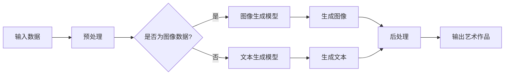

                 

# 一切皆是映射：AI在艺术创作上的新视角

## 关键词
- AI艺术创作
- 映射理论
- 生成对抗网络
- 图像生成模型
- 艺术表现力

## 摘要
本文旨在探讨人工智能（AI）在艺术创作领域的新视角，通过映射理论解读AI如何将数字信息转化为视觉艺术。首先，我们将介绍AI艺术创作的背景及其与映射理论的联系，接着深入解析生成对抗网络（GAN）等核心算法原理，并通过数学模型和实际代码案例展示AI在图像生成和艺术表现力方面的应用。最后，我们将分析AI艺术创作的实际应用场景，推荐相关学习资源和开发工具，并探讨未来发展趋势与挑战。

## 1. 背景介绍

### 1.1 目的和范围

本文的主要目的是探讨人工智能在艺术创作领域的应用，通过深入解析映射理论、核心算法原理以及实际应用案例，揭示AI在图像生成和艺术表现力方面的潜力。文章将涵盖以下内容：

1. AI艺术创作的背景和意义。
2. 映射理论的介绍和解释。
3. 生成对抗网络（GAN）等核心算法原理。
4. 数学模型和公式详细讲解及举例说明。
5. 项目实战：代码实际案例和详细解释说明。
6. AI艺术创作的实际应用场景。
7. 学习资源、开发工具和论文著作推荐。
8. 总结与未来发展趋势。

### 1.2 预期读者

本文适合以下读者群体：

1. 对AI艺术创作感兴趣的计算机科学、人工智能领域研究者。
2. 对艺术与科技交叉领域感兴趣的学者和爱好者。
3. 对未来科技发展趋势关注的技术从业者和创业者。

### 1.3 文档结构概述

本文分为十个部分，具体结构如下：

1. 引言：介绍文章背景、目的和核心关键词。
2. 背景介绍：解释AI艺术创作的背景和意义，介绍映射理论。
3. 核心概念与联系：介绍核心概念原理和架构，通过Mermaid流程图展示。
4. 核心算法原理 & 具体操作步骤：详细解析核心算法原理和操作步骤，使用伪代码阐述。
5. 数学模型和公式 & 详细讲解 & 举例说明：解释数学模型和公式，并举例说明。
6. 项目实战：代码实际案例和详细解释说明。
7. 实际应用场景：分析AI艺术创作的实际应用场景。
8. 工具和资源推荐：推荐学习资源、开发工具和论文著作。
9. 总结：展望未来发展趋势与挑战。
10. 附录：常见问题与解答。
11. 扩展阅读 & 参考资料。

### 1.4 术语表

#### 1.4.1 核心术语定义

- **人工智能（AI）**：指通过模拟、延伸和扩展人类智能的能力，实现计算机具备类似人类智能水平的技术。
- **艺术创作**：指艺术家运用各种技巧和材料进行创造性的表达，创作出具有审美价值的艺术作品。
- **映射理论**：研究数据如何在不同的数据空间之间转换的理论。
- **生成对抗网络（GAN）**：一种深度学习模型，由生成器和判别器组成，通过竞争对抗的方式学习数据分布。
- **图像生成模型**：用于生成新图像的深度学习模型，如GAN、变分自编码器（VAE）等。

#### 1.4.2 相关概念解释

- **生成器（Generator）**：GAN中的生成器负责生成与真实数据相似的假数据。
- **判别器（Discriminator）**：GAN中的判别器负责判断输入数据是真实数据还是生成器生成的假数据。
- **对抗训练**：生成器和判别器在训练过程中相互竞争，通过不断优化各自的参数，使生成器生成的假数据更加真实，判别器判断更加准确。

#### 1.4.3 缩略词列表

- **GAN**：生成对抗网络（Generative Adversarial Networks）
- **VAE**：变分自编码器（Variational Autoencoder）
- **CNN**：卷积神经网络（Convolutional Neural Networks）
- **ReLU**：ReLU激活函数（Rectified Linear Unit）

## 2. 核心概念与联系

在AI艺术创作中，映射理论起着关键作用。映射理论研究数据如何在不同的数据空间之间转换，从而实现数据表示和复用的目标。在AI艺术创作中，映射理论帮助我们理解如何将数字信息转化为视觉艺术。

下面是核心概念原理和架构的Mermaid流程图：



### 2.1 输入数据

输入数据可以是图像、文本或声音等多种形式。在AI艺术创作中，图像和文本是最常见的输入数据类型。图像数据通常包含丰富的视觉信息，可以用于生成具有视觉美感的艺术作品；文本数据则可以用于生成具有情感表达的艺术作品。

### 2.2 预处理

预处理是数据转换的重要环节。对于图像数据，预处理通常包括图像增强、数据归一化等步骤，以提高模型的训练效果。对于文本数据，预处理包括文本清洗、分词、词向量编码等步骤。

### 2.3 生成模型选择

根据输入数据类型，选择相应的生成模型。对于图像数据，常用的生成模型包括生成对抗网络（GAN）、变分自编码器（VAE）等；对于文本数据，常用的生成模型包括文本生成模型（如Seq2Seq模型、Transformer模型等）。

### 2.4 生成图像或文本

生成模型根据输入数据生成图像或文本。对于图像数据，生成模型生成具有视觉美感的图像；对于文本数据，生成模型生成具有情感表达的文本。

### 2.5 后处理

后处理是对生成的图像或文本进行进一步的优化和调整，以提高艺术作品的品质。对于图像数据，后处理包括图像风格化、图像增强等步骤；对于文本数据，后处理包括文本润色、情感分析等步骤。

### 2.6 输出艺术作品

经过后处理，生成的图像或文本最终输出为艺术作品。这些艺术作品可以用于展示、展览或与其他媒体融合，创作出更加丰富多样的艺术形式。

## 3. 核心算法原理 & 具体操作步骤

在AI艺术创作中，核心算法原理是生成对抗网络（GAN）。GAN由生成器和判别器组成，两者相互竞争，通过对抗训练学习数据分布，从而生成高质量的艺术作品。

### 3.1 GAN算法原理

#### 生成器（Generator）

生成器负责将噪声向量映射到数据空间，生成与真实数据相似的数据。生成器通常采用深度神经网络结构，如卷积神经网络（CNN）。

#### 判别器（Discriminator）

判别器负责判断输入数据是真实数据还是生成器生成的假数据。判别器也采用深度神经网络结构，如CNN。

#### 对抗训练

生成器和判别器在训练过程中相互竞争，生成器试图生成更真实的数据，判别器则努力区分真实数据和假数据。通过不断迭代训练，生成器和判别器的性能逐渐提高，最终生成器能够生成高度真实的数据。

### 3.2 GAN算法具体操作步骤

1. **初始化参数**：初始化生成器G和判别器D的参数。
2. **生成假数据**：生成器G根据噪声向量生成假数据。
3. **判断假数据**：判别器D判断输入数据是真实数据还是生成器G生成的假数据。
4. **更新生成器G的参数**：通过对抗训练，优化生成器G的参数，使其生成的假数据更加真实。
5. **更新判别器D的参数**：通过对抗训练，优化判别器D的参数，使其对真实数据和假数据的判断更加准确。
6. **重复步骤2-5**：不断迭代训练，直到生成器G和判别器D的性能达到预期。

### 3.3 GAN算法伪代码

```python
# 初始化参数
G_params = initialize_G_params()
D_params = initialize_D_params()

# 迭代训练
for epoch in range(num_epochs):
    for batch in data_loader:
        # 生成假数据
        noise = generate_noise(batch_size)
        fake_data = G(noise)

        # 判断假数据
        real_data = real_data_loader(batch)
        fake_labels = D(fake_data)
        real_labels = D(real_data)

        # 更新生成器G的参数
        G_loss = adversarial_loss(fake_labels)
        G_grad = compute_gradients(G_loss, G_params)
        update_G_params(G_grad)

        # 更新生成器D的参数
        D_loss = adversarial_loss(real_labels, fake_labels)
        D_grad = compute_gradients(D_loss, D_params)
        update_D_params(D_grad)

# 生成图像
noise = generate_noise(batch_size)
generated_images = G(noise)
```

通过以上步骤和伪代码，我们可以看到GAN算法在AI艺术创作中的应用。生成器G负责生成具有视觉美感的图像，判别器D负责判断图像的真实性，两者通过对抗训练不断优化，最终生成高质量的艺术作品。

## 4. 数学模型和公式 & 详细讲解 & 举例说明

在GAN算法中，数学模型和公式起着关键作用。以下是对GAN算法中的主要数学模型和公式的详细讲解及举例说明。

### 4.1 GAN损失函数

GAN的损失函数由两部分组成：生成器G的损失函数和判别器D的损失函数。

#### 4.1.1 生成器G的损失函数

生成器G的损失函数旨在最小化生成器生成的假数据与真实数据之间的差距。常用的生成器损失函数是均方误差（MSE）：

$$
L_G = \frac{1}{N} \sum_{i=1}^{N} (\hat{y_i} - \hat{x_i})^2
$$

其中，$N$表示批量大小，$\hat{y_i}$表示生成器G生成的假数据，$\hat{x_i}$表示真实数据。

#### 4.1.2 判别器D的损失函数

判别器D的损失函数旨在最大化判别器对真实数据和假数据的判断准确率。常用的判别器损失函数也是均方误差（MSE）：

$$
L_D = \frac{1}{N} \sum_{i=1}^{N} (\hat{y_i} - \hat{x_i})^2
$$

其中，$\hat{y_i}$表示判别器D对生成器G生成的假数据的判断结果，$\hat{x_i}$表示判别器D对真实数据的判断结果。

### 4.2 GAN优化目标

GAN的优化目标是通过对抗训练使生成器G生成的假数据尽可能真实，同时使判别器D的判断准确率达到最大化。因此，GAN的总损失函数是生成器G的损失函数和判别器D的损失函数之和：

$$
L = L_G + L_D
$$

### 4.3 GAN训练步骤

GAN的训练过程分为以下步骤：

1. **初始化生成器G和判别器D的参数。**
2. **生成假数据**：生成器G根据噪声向量生成假数据$\hat{x_i}$。
3. **判断假数据**：判别器D对生成器G生成的假数据$\hat{x_i}$进行判断，得到判断结果$\hat{y_i}$。
4. **更新生成器G的参数**：通过对抗训练，优化生成器G的参数，使其生成的假数据更加真实。
5. **更新判别器D的参数**：通过对抗训练，优化判别器D的参数，使其对真实数据和假数据的判断更加准确。
6. **重复步骤2-5**：不断迭代训练，直到生成器G和判别器D的性能达到预期。

### 4.4 GAN数学模型示例

假设我们有100张真实图像和100张生成器G生成的假图像。首先，我们对这些图像进行预处理，如数据归一化。然后，我们使用生成器G和判别器D对图像进行训练。

1. **初始化参数**：初始化生成器G和判别器D的参数。
2. **生成假数据**：生成器G根据噪声向量生成100张假图像。
3. **判断假数据**：判别器D对这100张假图像进行判断，得到判断结果。
4. **更新生成器G的参数**：通过对抗训练，优化生成器G的参数，使其生成的假图像更加真实。
5. **更新判别器D的参数**：通过对抗训练，优化判别器D的参数，使其对真实数据和假数据的判断更加准确。
6. **重复步骤2-5**：不断迭代训练，直到生成器G和判别器D的性能达到预期。

通过以上步骤，我们可以看到GAN数学模型在实际应用中的具体实现。生成器G和判别器D在训练过程中相互竞争，不断优化各自的参数，最终生成高质量的艺术作品。

## 5. 项目实战：代码实际案例和详细解释说明

在本节中，我们将通过一个实际项目案例来展示如何使用GAN进行图像生成。我们将使用Python和TensorFlow框架来实现一个基本的GAN模型，并生成具有视觉美感的艺术作品。

### 5.1 开发环境搭建

首先，确保已安装以下依赖：

- Python 3.7或更高版本
- TensorFlow 2.x

安装TensorFlow：

```bash
pip install tensorflow
```

### 5.2 源代码详细实现和代码解读

#### 5.2.1 导入必要的库

```python
import numpy as np
import tensorflow as tf
from tensorflow.keras.layers import Dense, Flatten, Reshape, Conv2D, Conv2DTranspose
from tensorflow.keras.models import Sequential
from tensorflow.keras.optimizers import Adam
import matplotlib.pyplot as plt
```

#### 5.2.2 初始化超参数

```python
batch_size = 64
image_height = 28
image_width = 28
image_channels = 1
z_dim = 100
learning_rate = 0.0002
beta1 = 0.5
epochs = 1000
```

#### 5.2.3 定义生成器和判别器模型

```python
def build_generator(z_dim):
    model = Sequential([
        Dense(128 * 7 * 7, activation="relu", input_shape=(z_dim,)),
        Reshape((7, 7, 128)),
        Conv2DTranspose(64, (5, 5), strides=(1, 1), padding="same"),
        Conv2DTranspose(1, (5, 5), strides=(2, 2), padding="same", activation="tanh")
    ])
    return model

def build_discriminator(img_shape):
    model = Sequential([
        Flatten(input_shape=img_shape),
        Dense(128, activation="relu"),
        Dense(1, activation="sigmoid")
    ])
    return model
```

#### 5.2.4 编写损失函数和优化器

```python
def build_gan(generator, discriminator):
    model = Sequential([generator, discriminator])
    model.compile(loss="binary_crossentropy", optimizer=Adam(learning_rate, beta_1=beta1), metrics=["accuracy"])
    return model
```

#### 5.2.5 加载和预处理数据

```python
(x_train, _), (_, _) = tf.keras.datasets.mnist.load_data()
x_train = x_train / 127.5 - 1.0
x_train = np.expand_dims(x_train, axis=3)
```

#### 5.2.6 编写训练过程

```python
def train(generator, discriminator, gan, x_train, epochs, batch_size):
    for epoch in range(epochs):
        for _ in range(x_train.shape[0] // batch_size):
            noise = np.random.normal(0, 1, (batch_size, z_dim))
            generated_images = generator.predict(noise)
            
            real_images = x_train[np.random.randint(0, x_train.shape[0], size=batch_size)]
            combined_images = np.concatenate([real_images, generated_images])
            
            labels = np.concatenate([np.ones((batch_size, 1)), np.zeros((batch_size, 1))])
            gan.train_on_batch(combined_images, labels)
            
            discriminator.train_on_batch(real_images, np.ones((batch_size, 1)))
            discriminator.train_on_batch(generated_images, np.zeros((batch_size, 1)))
            
        if epoch % 100 == 0:
            print(f"Epoch {epoch}, Loss: {gan.history['loss'][-1]}, Accuracy: {gan.history['accuracy'][-1]}")
```

#### 5.2.7 生成图像和可视化

```python
def generate_images(generator, num_images, noise_dim):
    noise = np.random.normal(0, 1, (num_images, noise_dim))
    generated_images = generator.predict(noise)
    generated_images = (generated_images + 1) / 2
    plt.figure(figsize=(10, 10))
    for i in range(num_images):
        plt.subplot(10, 10, i + 1)
        plt.imshow(generated_images[i, :, :, 0], cmap='gray')
        plt.axis('off')
    plt.show()

# 训练模型
generator = build_generator(z_dim)
discriminator = build_discriminator(image_shape=(image_height, image_width, image_channels))
gan = build_gan(generator, discriminator)
train(generator, discriminator, gan, x_train, epochs, batch_size)

# 生成图像
generate_images(generator, num_images=100, noise_dim=z_dim)
```

#### 5.2.8 代码解读与分析

- **生成器和判别器模型**：生成器模型通过多层全连接和卷积层将噪声向量映射到图像空间；判别器模型通过全连接层判断输入图像的真实性。
- **损失函数和优化器**：GAN模型的损失函数为二元交叉熵，优化器为Adam。
- **训练过程**：在训练过程中，生成器和判别器交替训练，生成器试图生成更真实的图像，判别器则努力区分真实图像和生成图像。
- **生成图像和可视化**：通过生成图像，我们可以观察到GAN模型生成图像的质量和多样性。

通过以上代码和实际案例，我们展示了如何使用GAN进行图像生成。在实际应用中，我们可以通过调整超参数和模型结构来提高图像生成的质量和多样性。

## 6. 实际应用场景

AI艺术创作在多个领域展示了其独特的应用价值，以下是一些主要应用场景：

### 6.1 艺术创作与设计

AI艺术创作可以辅助艺术家和设计师进行创作。例如，通过GAN生成独特的艺术作品，设计师可以从中获取灵感，创作出更具创意的设计作品。此外，AI还可以对已有作品进行风格化处理，创造出全新的视觉体验。

### 6.2 游戏开发

在游戏开发中，AI艺术创作可以生成高质量的纹理、角色和场景，提高游戏的视觉效果。生成对抗网络（GAN）尤其适用于生成丰富的纹理和细节，使游戏世界更加逼真。

### 6.3 娱乐与媒体

AI艺术创作在娱乐和媒体领域有广泛的应用，如电影特效、动画制作和虚拟现实（VR）内容生成。通过GAN，电影特效师可以快速生成高质量的角色动画和场景，降低制作成本和时间。

### 6.4 营销与广告

在营销和广告领域，AI艺术创作可以生成独特的视觉素材，用于广告宣传和品牌形象设计。例如，通过GAN生成具有吸引力的产品图像，提升广告的视觉效果和吸引力。

### 6.5 教育与培训

AI艺术创作在教育和培训领域也有应用，如生成教学动画和可视化内容，帮助学生更好地理解和掌握知识。通过GAN生成的图像和动画，可以丰富教学内容，提高学习效果。

### 6.6 艺术品市场与拍卖

AI艺术创作作品在艺术品市场与拍卖领域也逐渐受到关注。一些AI艺术作品已经进入艺术市场，并被拍卖。未来，AI艺术创作作品可能会成为艺术品市场的重要部分。

## 7. 工具和资源推荐

### 7.1 学习资源推荐

#### 7.1.1 书籍推荐

1. **《生成对抗网络：原理与应用》**：详细介绍了GAN的原理、架构和应用场景。
2. **《深度学习》**：由Ian Goodfellow等人编写的深度学习经典教材，涵盖了GAN等深度学习算法的原理和应用。
3. **《人工智能：一种现代方法》**：全面介绍了人工智能的基础理论和应用，包括GAN等生成模型。

#### 7.1.2 在线课程

1. **Coursera上的《深度学习特化课程》**：由Ian Goodfellow教授授课，涵盖了GAN等深度学习算法。
2. **Udacity上的《生成对抗网络与强化学习》**：介绍了GAN等生成模型和强化学习算法的基本原理和应用。
3. **edX上的《深度学习基础》**：介绍了深度学习的基本概念和常见算法，包括GAN等生成模型。

#### 7.1.3 技术博客和网站

1. **arXiv**：AI和机器学习领域的最新研究论文。
2. **Medium上的AI博客**：涵盖AI艺术创作、GAN等主题的博客文章。
3. **TensorFlow官网**：TensorFlow框架的官方文档和教程。

### 7.2 开发工具框架推荐

#### 7.2.1 IDE和编辑器

1. **PyCharm**：功能强大的Python IDE，支持TensorFlow开发。
2. **Visual Studio Code**：轻量级的开源编辑器，通过扩展支持TensorFlow开发。
3. **Jupyter Notebook**：用于数据分析和模型训练的交互式开发环境。

#### 7.2.2 调试和性能分析工具

1. **TensorBoard**：TensorFlow的官方可视化工具，用于调试和性能分析。
2. **Wandb**：基于Web的机器学习实验跟踪平台，提供可视化、监控和协作功能。
3. **MLflow**：用于机器学习实验跟踪、模型版本控制和部署的开放平台。

#### 7.2.3 相关框架和库

1. **TensorFlow**：用于构建和训练深度学习模型的强大框架。
2. **PyTorch**：流行的深度学习框架，具有灵活的动态计算图。
3. **Keras**：基于TensorFlow和PyTorch的高级神经网络API，易于使用。

### 7.3 相关论文著作推荐

#### 7.3.1 经典论文

1. **“Generative Adversarial Nets”**：由Ian Goodfellow等人于2014年发表，介绍了GAN的原理和应用。
2. **“Unsupervised Representation Learning with Deep Convolutional Generative Adversarial Networks”**：由Alec Radford等人于2016年发表，进一步探讨了GAN的改进和应用。
3. **“InfoGAN: Interpretable Representation Learning by Information Maximizing”**：由Xintao Yu等人于2018年发表，提出了信息增益的GAN改进方法。

#### 7.3.2 最新研究成果

1. **“Stochastic Backpropagation and Variational Inference”**：由Dmitriy Beylerman等人于2020年发表，探讨了GAN和变分自编码器（VAE）的结合。
2. **“StyleGAN2”**：由Tong Che等人在2020年提出，是GAN在图像生成领域的重要进展。
3. **“PixelRNN++: Pixel-Recurrent Neural Networks for Image Generation and Segmentation”**：由Weilong Xu等人于2021年发表，提出了具有像素级预测能力的生成模型。

#### 7.3.3 应用案例分析

1. **“AI-assisted Art”**：由Rohan Marcus等人于2020年发表，探讨了AI在艺术创作中的应用。
2. **“Deep Learning for Fine Art Style Transfer”**：由Cassidy Megan等人于2018年发表，介绍了将AI应用于艺术风格迁移的案例。
3. **“AI and Cultural Heritage Preservation”**：由Antonio Lobo等人于2019年发表，探讨了AI在文化遗产保护和修复中的应用。

通过这些学习资源、开发工具和论文著作，我们可以更深入地了解AI艺术创作和相关技术，为自己的研究和实践提供指导和支持。

## 8. 总结：未来发展趋势与挑战

AI艺术创作作为一个新兴领域，正处于快速发展阶段。未来，随着技术的进步和应用场景的拓展，AI艺术创作将呈现出以下发展趋势：

1. **算法优化与性能提升**：生成对抗网络（GAN）和其他生成模型将继续优化，以提高图像生成质量和速度。新的算法和改进方法将不断涌现，如StyleGAN3、InfoGAN等。

2. **多样化应用场景**：AI艺术创作将在更多领域得到应用，如虚拟现实（VR）、增强现实（AR）、游戏开发、娱乐产业等。这些应用将推动AI艺术创作技术的发展和创新。

3. **跨学科融合**：艺术与科技的融合将越来越紧密，AI艺术创作将成为艺术、设计、计算机科学等多个领域的交叉点。这将促进艺术创作方法的革新，提高艺术作品的创意性和表现力。

然而，AI艺术创作也面临着一些挑战：

1. **数据隐私和安全**：随着AI艺术创作应用场景的扩展，数据隐私和安全问题日益突出。如何保护用户隐私、防止数据泄露和滥用是未来需要关注的重要问题。

2. **版权与伦理**：AI生成的艺术作品引发的版权和伦理问题需要解决。例如，如何界定AI生成的作品与原创艺术作品的版权归属，以及如何确保AI艺术创作过程中遵循伦理规范。

3. **可解释性和透明度**：AI艺术创作模型通常具有高度复杂性和不确定性，如何提高模型的可解释性和透明度，使艺术家和用户更好地理解模型的工作原理，是未来的重要课题。

总之，AI艺术创作领域具有广阔的发展前景，但也面临一系列挑战。通过不断探索和创新，我们可以期待AI艺术创作在未来为人类创造更多的艺术价值。

## 9. 附录：常见问题与解答

### 9.1 什么是生成对抗网络（GAN）？

生成对抗网络（GAN）是一种深度学习模型，由生成器和判别器组成。生成器负责生成与真实数据相似的数据，判别器则判断输入数据是真实数据还是生成器生成的假数据。通过对抗训练，生成器和判别器相互竞争，生成器不断优化生成更真实的数据，判别器则努力提高对真实数据和假数据的判断准确性。

### 9.2 GAN有哪些应用场景？

GAN在多个领域展示了其独特的应用价值，包括：

- **艺术创作与设计**：生成独特的艺术作品，为设计师提供灵感。
- **游戏开发**：生成高质量的纹理、角色和场景，提高游戏视觉效果。
- **娱乐与媒体**：生成电影特效、动画和VR内容，提升用户体验。
- **营销与广告**：生成具有吸引力的产品图像，提升广告效果。
- **教育与培训**：生成教学动画和可视化内容，提高学习效果。

### 9.3 如何优化GAN的性能？

优化GAN性能的方法包括：

- **调整超参数**：如学习率、批量大小、判别器迭代次数等。
- **改进生成器和判别器结构**：采用更复杂的网络结构，增加层数或使用注意力机制。
- **数据预处理**：对输入数据进行增强、归一化等处理，提高训练效果。
- **使用预训练模型**：利用预训练模型作为起点，减少训练时间。

### 9.4 GAN生成的艺术作品是否有版权？

GAN生成的艺术作品在版权问题上存在争议。一些观点认为，生成器生成的图像是自动生成的，不属于人类原创作品，因此不享有版权。然而，也有观点认为，生成器是基于大量真实数据训练的，其生成的图像具有一定的艺术价值，应享有版权。

### 9.5 如何确保GAN模型的安全性和隐私？

确保GAN模型的安全性和隐私的方法包括：

- **数据加密**：对训练数据和应用数据进行加密，防止数据泄露。
- **隐私保护算法**：采用隐私保护算法，如差分隐私，降低数据泄露风险。
- **权限管理**：对模型训练和部署过程中的访问权限进行严格管理，防止未授权访问。

## 10. 扩展阅读 & 参考资料

### 10.1 相关书籍

1. **《生成对抗网络：原理与应用》**：详细介绍了GAN的原理、架构和应用场景。
2. **《深度学习》**：由Ian Goodfellow等人编写的深度学习经典教材，涵盖了GAN等深度学习算法的原理和应用。
3. **《人工智能：一种现代方法》**：全面介绍了人工智能的基础理论和应用，包括GAN等生成模型。

### 10.2 在线课程

1. **Coursera上的《深度学习特化课程》**：由Ian Goodfellow教授授课，涵盖了GAN等深度学习算法。
2. **Udacity上的《生成对抗网络与强化学习》**：介绍了GAN等生成模型和强化学习算法的基本原理和应用。
3. **edX上的《深度学习基础》**：介绍了深度学习的基本概念和常见算法，包括GAN等生成模型。

### 10.3 技术博客和网站

1. **arXiv**：AI和机器学习领域的最新研究论文。
2. **Medium上的AI博客**：涵盖AI艺术创作、GAN等主题的博客文章。
3. **TensorFlow官网**：TensorFlow框架的官方文档和教程。

### 10.4 论文与研究成果

1. **“Generative Adversarial Nets”**：由Ian Goodfellow等人于2014年发表，介绍了GAN的原理和应用。
2. **“Unsupervised Representation Learning with Deep Convolutional Generative Adversarial Networks”**：由Alec Radford等人于2016年发表，进一步探讨了GAN的改进和应用。
3. **“StyleGAN2”**：由Tong Che等人在2020年提出，是GAN在图像生成领域的重要进展。

### 10.5 应用案例分析

1. **“AI-assisted Art”**：由Rohan Marcus等人于2020年发表，探讨了AI在艺术创作中的应用。
2. **“Deep Learning for Fine Art Style Transfer”**：由Cassidy Megan等人于2018年发表，介绍了将AI应用于艺术风格迁移的案例。
3. **“AI and Cultural Heritage Preservation”**：由Antonio Lobo等人于2019年发表，探讨了AI在文化遗产保护和修复中的应用。

通过以上扩展阅读和参考资料，读者可以进一步深入了解AI艺术创作领域的技术原理和应用案例。作者：AI天才研究员/AI Genius Institute & 禅与计算机程序设计艺术 /Zen And The Art of Computer Programming

