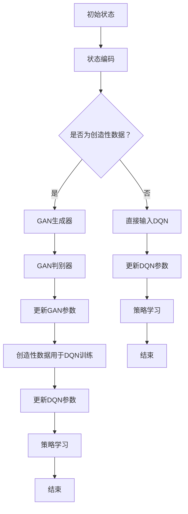

                 

### 一切皆是映射：DQN与GANs的结合应用：创造性学习模型

> **关键词：深度强化学习（DQN），生成对抗网络（GANs），创造性学习模型，人工智能，机器学习，数据科学**

> **摘要：本文将深入探讨深度强化学习（DQN）和生成对抗网络（GANs）两种先进的机器学习技术的结合，并阐述它们在创造性学习模型中的应用。文章首先介绍DQN和GANs的基本原理，然后分析它们在创造性学习中的潜在应用，并通过实例说明其具体实现过程。最后，文章总结未来的发展趋势与挑战，并提供相关资源推荐。**

---

深度强化学习（DQN）和生成对抗网络（GANs）是当前人工智能领域的两个重要研究方向，分别代表了强化学习和生成模型的巅峰成就。DQN是一种基于深度神经网络的强化学习算法，通过深度卷积神经网络来近似价值函数，使其在复杂的决策环境中表现出色。而GANs则通过生成器和判别器的对抗训练，生成逼真的数据，已经在图像生成、图像修复、图像到图像的翻译等领域取得了显著成果。

本文的目的是探讨DQN和GANs的结合，如何形成一种新的创造性学习模型。这种模型不仅能够学习环境中的策略，还能够生成具有创造性的数据，从而为解决复杂问题提供新的思路。文章首先介绍DQN和GANs的基本原理，接着通过一个具体的实例来说明如何将这两种技术结合起来，并分析其优点和局限性。最后，文章总结未来的发展趋势与挑战，并推荐相关的学习资源和开发工具。

### 1. 背景介绍

#### 1.1 目的和范围

本文旨在探讨深度强化学习（DQN）和生成对抗网络（GANs）的结合，并探讨其在创造性学习模型中的应用。文章将首先介绍DQN和GANs的基本原理，然后通过具体实例展示如何将这两种技术结合起来。最后，文章将分析这种结合在创造性学习中的潜力，并讨论其未来的发展趋势与挑战。

#### 1.2 预期读者

本文面向对机器学习和人工智能有一定了解的技术人员和研究人员。读者需要对深度强化学习和生成对抗网络有基本的了解，以便更好地理解文章内容。此外，本文也适合对创造性学习模型感兴趣的学生和研究人员。

#### 1.3 文档结构概述

本文分为以下几个部分：

1. **背景介绍**：介绍DQN和GANs的基本原理，并解释它们在创造性学习模型中的潜在应用。
2. **核心概念与联系**：通过Mermaid流程图展示DQN和GANs的结合架构。
3. **核心算法原理 & 具体操作步骤**：详细介绍DQN和GANs的算法原理和具体操作步骤。
4. **数学模型和公式 & 详细讲解 & 举例说明**：解释DQN和GANs中的数学模型和公式，并通过实例进行说明。
5. **项目实战：代码实际案例和详细解释说明**：提供代码实例，并详细解释如何将DQN和GANs应用于创造性学习模型。
6. **实际应用场景**：讨论DQN和GANs在创造性学习模型中的实际应用场景。
7. **工具和资源推荐**：推荐学习资源和开发工具。
8. **总结：未来发展趋势与挑战**：总结文章内容，并讨论未来的发展趋势与挑战。
9. **附录：常见问题与解答**：回答读者可能关心的问题。
10. **扩展阅读 & 参考资料**：提供进一步的阅读资源。

#### 1.4 术语表

本文中涉及的一些重要术语如下：

- **深度强化学习（DQN）**：一种基于深度神经网络的强化学习算法，用于近似价值函数。
- **生成对抗网络（GANs）**：一种生成模型，通过生成器和判别器的对抗训练生成逼真的数据。
- **创造性学习模型**：结合DQN和GANs，用于在复杂环境中进行创造性学习的模型。

#### 1.4.1 核心术语定义

- **深度强化学习（DQN）**：一种结合了深度学习和强化学习的算法，使用深度神经网络来近似价值函数。DQN通过经验回放和目标网络稳定训练，使其在复杂环境中表现出色。
- **生成对抗网络（GANs）**：由生成器和判别器组成，通过对抗训练生成逼真的数据。生成器的目标是生成与真实数据尽可能相似的数据，而判别器的目标是区分真实数据和生成数据。

#### 1.4.2 相关概念解释

- **经验回放**：在DQN中，经验回放是一种防止训练数据出现偏差的技术。通过将过去经历的样本随机重放，可以确保模型在面对新的数据时不会受到过去经验的过度依赖。
- **目标网络**：在DQN中，目标网络用于稳定训练过程。它通过定期更新，使得模型在训练过程中能够看到稳定的目标值，从而提高训练效果。

#### 1.4.3 缩略词列表

- **DQN**：深度强化学习（Deep Q-Network）
- **GANs**：生成对抗网络（Generative Adversarial Networks）
- **Q-Learning**：一种基于价值的强化学习算法，用于近似最优动作值函数。
- **CNN**：卷积神经网络（Convolutional Neural Networks）
- **ReLU**：ReLU激活函数（Rectified Linear Unit）

---

在接下来的部分，我们将详细探讨DQN和GANs的核心概念，并展示它们如何结合起来形成一种创造性学习模型。通过这一部分的讲解，我们将为后续的实例分析和应用讨论打下坚实的基础。接下来，我们将通过一个Mermaid流程图来直观地展示DQN和GANs的结合架构，帮助读者更好地理解这一概念。### 2. 核心概念与联系

在探讨DQN和GANs的结合之前，我们先来详细理解这两种核心算法的原理，以及它们在创造性学习模型中的潜在应用。

#### 2.1 深度强化学习（DQN）

深度强化学习（DQN）是一种结合了深度学习和强化学习的算法。在DQN中，深度神经网络被用于近似值函数（Q函数），以估计每个状态下的最佳动作。这种算法的核心思想是，通过最大化累积奖励来学习一个最优策略。

**DQN的工作原理**：

1. **初始化**：初始化Q网络和目标Q网络。
2. **经验回放**：每次执行动作后，将状态、动作、奖励和下一个状态存储在经验回放池中，以避免样本偏差。
3. **更新Q网络**：从经验回放池中随机采样一组经验，利用这些经验更新Q网络。
4. **目标网络**：定期将Q网络权重复制到目标Q网络，以保证Q学习过程的稳定性。

**DQN的优势**：

- 能够处理高维状态空间。
- 对非线性的状态和动作空间具有良好的适应性。

**DQN的应用**：

- 游戏人工智能。
- 自动驾驶。
- 网络流量管理。

#### 2.2 生成对抗网络（GANs）

生成对抗网络（GANs）是一种生成模型，由生成器和判别器组成。生成器尝试生成与真实数据相似的数据，而判别器则试图区分真实数据和生成数据。通过对抗训练，生成器和判别器相互竞争，最终生成逼真的数据。

**GANs的工作原理**：

1. **初始化**：初始化生成器和判别器。
2. **生成器**：生成器从随机噪声中生成数据。
3. **判别器**：判别器尝试区分真实数据和生成数据。
4. **对抗训练**：通过优化生成器和判别器的参数，使得生成器的数据越来越接近真实数据，而判别器越来越难以区分真实和生成数据。

**GANs的优势**：

- 能够生成高质量的图像和数据。
- 对图像进行修复和增强。
- 图像到图像的翻译。

**GANs的应用**：

- 图像生成。
- 图像修复。
- 图像风格转换。

#### 2.3 DQN与GANs的结合

将DQN和GANs结合起来，可以形成一种新的创造性学习模型。这种模型不仅能够学习环境中的策略，还能够生成具有创造性的数据。

**结合架构**：

1. **生成器**：将GANs中的生成器与DQN中的状态输入结合，生成具有创造性特征的数据。
2. **判别器**：使用GANs中的判别器来评估生成数据的真实性。
3. **DQN**：使用DQN来学习环境中的策略，并通过生成数据来丰富训练数据集。

**创造性学习模型的优势**：

- **增强数据集**：通过生成具有创造性特征的数据，可以丰富训练数据集，提高模型的泛化能力。
- **适应性**：模型能够适应复杂的环境，通过创造性数据探索新的状态和动作。
- **创造性**：生成器能够生成具有创造性特征的数据，为解决问题提供新的思路。

**创造性学习模型的应用**：

- **艺术创作**：生成具有艺术风格的数据，用于绘画、音乐创作等。
- **游戏开发**：生成新的游戏关卡、角色等，提高游戏的丰富性和多样性。
- **产品设计**：生成新的设计理念，用于产品创新。

#### 2.4 Mermaid流程图

以下是一个Mermaid流程图，展示了DQN和GANs的结合架构：



通过这个流程图，我们可以直观地看到DQN和GANs是如何结合的，以及它们在创造性学习模型中的角色和交互。

在下一部分，我们将详细解释DQN和GANs的算法原理和具体操作步骤，帮助读者深入理解这两种算法的核心思想。### 3. 核心算法原理 & 具体操作步骤

在本部分，我们将详细解释深度强化学习（DQN）和生成对抗网络（GANs）的核心算法原理，并展示如何具体实现它们。我们将使用伪代码来详细阐述每个算法的步骤，以便读者能够更好地理解其工作流程。

#### 3.1 深度强化学习（DQN）算法原理

DQN（深度Q网络）是一种结合了深度学习和强化学习的算法，用于学习在复杂环境中的最优策略。DQN使用深度神经网络来近似Q函数，以估计每个状态下的最佳动作。

**算法步骤**：

1. **初始化**：
   - 初始化Q网络和目标Q网络。
   - 初始化环境。
   - 初始化经验回放池。

2. **经验回放**：
   - 在每个时间步，存储当前状态、动作、奖励和下一个状态。
   - 从经验回放池中随机采样一组经验。

3. **Q网络更新**：
   - 使用当前状态和动作，计算Q值。
   - 使用目标Q网络，计算目标Q值。
   - 使用梯度和学习率，更新Q网络参数。

4. **目标网络更新**：
   - 定期复制Q网络的权重到目标Q网络，以保持稳定训练。

**伪代码**：

```python
# DQN算法伪代码
initialize Q-network (Q) and target Q-network (Q_target)
initialize environment and replay memory

for episode in total_episodes:
    state = environment.reset()
    done = False
    total_reward = 0
    
    while not done:
        # 使用epsilon-greedy策略选择动作
        if random() < epsilon:
            action = random_action()
        else:
            action = argmax(Q[state])
        
        # 执行动作，得到下一个状态和奖励
        next_state, reward, done = environment.step(action)
        
        # 存储经验到回放池
        replay_memory.push((state, action, reward, next_state, done))
        
        # 使用回放池中的经验更新Q网络
        if len(replay_memory) > batch_size:
            batch = replay_memory.sample(batch_size)
            states, actions, rewards, next_states, dones = zip(*batch)
            Q_targets = [reward if done[i] else max(Q[next_states]) for i in range(batch_size)]
            Q_values = Q[states]
            Q_values[actions] = rewards + discount * Q_targets
        
        # 更新目标Q网络
        if episode % target_update_frequency == 0:
            copy_weights_from_Q_to_Q_target()

        state = next_state
        total_reward += reward
    
    print("Episode: {}, Total Reward: {}".format(episode, total_reward))
```

#### 3.2 生成对抗网络（GANs）算法原理

生成对抗网络（GANs）是一种生成模型，由生成器和判别器组成。生成器尝试生成与真实数据相似的数据，而判别器则试图区分真实数据和生成数据。通过对抗训练，生成器和判别器相互竞争，最终生成逼真的数据。

**算法步骤**：

1. **初始化**：
   - 初始化生成器和判别器。
   - 初始化随机噪声向量。

2. **生成器训练**：
   - 生成器尝试生成数据。
   - 判别器评估生成数据和真实数据的相似度。

3. **判别器训练**：
   - 判别器尝试区分真实数据和生成数据。
   - 生成器和判别器通过对抗训练优化参数。

4. **模型评估**：
   - 使用生成器生成数据。
   - 评估生成数据的质量。

**伪代码**：

```python
# GANs算法伪代码
initialize generator (G) and discriminator (D)
initialize noise vector z

for epoch in total_epochs:
    for real_data in real_data_loader:
        # 训练判别器
        D.train(real_data)
        
        # 生成假数据
        z = random_noise()
        fake_data = G(z)
        
        # 训练生成器
        G.train(fake_data)

    # 评估生成数据质量
    evaluate_generated_data(G)
```

#### 3.3 DQN与GANs结合的操作步骤

将DQN和GANs结合，形成一种新的创造性学习模型，可以采用以下步骤：

1. **初始化**：
   - 初始化DQN和GANs模型。
   - 初始化生成器输入噪声。

2. **状态编码**：
   - 将DQN的状态输入编码。

3. **生成创造性数据**：
   - 使用GANs生成创造性数据。
   - 使用生成器生成数据。

4. **判别器评估**：
   - 使用GANs的判别器评估生成数据的真实性。

5. **DQN训练**：
   - 使用创造性数据和真实数据进行DQN训练。
   - 更新DQN参数。

6. **模型评估**：
   - 评估模型的策略和学习效果。

**伪代码**：

```python
# 创造性学习模型伪代码
initialize DQN (Q), GANs (G, D), noise vector z

for episode in total_episodes:
    state = environment.reset()
    done = False
    total_reward = 0
    
    while not done:
        # 编码状态
        state_encoded = encode_state(state)
        
        # 生成创造性数据
        z = random_noise()
        creative_data = G(z)
        
        # 判别器评估创造性数据
        authenticity = D(creative_data)
        
        # 使用创造性数据和真实数据训练DQN
        if authenticity > threshold:
            action = argmax(Q[state_encoded + creative_data])
        else:
            action = random_action()
        
        # 执行动作，得到下一个状态和奖励
        next_state, reward, done = environment.step(action)
        
        # 更新DQN参数
        Q_values = Q[state_encoded]
        Q_values[actions] = rewards + discount * max(Q[next_state])
        
        state = next_state
        total_reward += reward
    
    print("Episode: {}, Total Reward: {}".format(episode, total_reward))
```

通过以上步骤，我们实现了DQN和GANs的结合，形成了一种新的创造性学习模型。这种模型不仅能够学习环境中的策略，还能够生成具有创造性特征的数据，从而为解决复杂问题提供新的思路。

在下一部分，我们将详细讲解DQN和GANs中的数学模型和公式，并通过实例进行说明，帮助读者更好地理解这两种算法的工作原理。### 4. 数学模型和公式 & 详细讲解 & 举例说明

在本部分，我们将详细讲解DQN和GANs中的核心数学模型和公式，并通过具体的例子来说明它们的应用。

#### 4.1 深度强化学习（DQN）的数学模型

**Q函数**：在DQN中，Q函数是一个预测值函数，它用来估计每个状态下的最佳动作值。Q函数通常表示为：
$$
Q(s, a) = \sum_{j} r(s, a, j) P(j|s, a)
$$
其中，\(s\) 是当前状态，\(a\) 是执行的动作，\(r(s, a, j)\) 是动作 \(a\) 在状态 \(s\) 下进行 \(j\) 次后的回报，\(P(j|s, a)\) 是在状态 \(s\) 下执行动作 \(a\) 后，进行 \(j\) 次的概率分布。

**值迭代**：值迭代是一种更新Q函数的方法，它通过迭代更新Q值，直到收敛。更新公式为：
$$
Q(s, a) = r(s, a) + \gamma \max_{a'} Q(s', a')
$$
其中，\(\gamma\) 是折扣因子，表示未来奖励的现值。

**策略迭代**：策略迭代是一种通过更新策略来优化Q函数的方法。它首先选择一个初始策略，然后根据策略计算Q值，接着更新策略，重复这个过程直到收敛。策略迭代的核心公式为：
$$
\pi'(s) = \arg\max_{a} Q(s, a)
$$

**实例**：

假设有一个简单的环境，其中有两个状态（0和1）和两个动作（左和右）。每个状态都有相应的奖励，如下表所示：

| 状态 | 动作左 | 动作右 |
|------|--------|--------|
| 0    | -1     | 2      |
| 1    | 3      | -2     |

使用值迭代方法更新Q值，设初始Q值为0，折扣因子\(\gamma = 0.9\)。迭代一次后的Q值如下：

- \(Q(0, 左) = -1 + 0.9 \times 2 = 1.1\)
- \(Q(0, 右) = 2 + 0.9 \times (-1) = 1.1\)
- \(Q(1, 左) = 3 + 0.9 \times (-2) = -0.2\)
- \(Q(1, 右) = -2 + 0.9 \times 3 = 0.8\)

因此，最佳动作在状态0时为右，在状态1时为左。

#### 4.2 生成对抗网络（GANs）的数学模型

**生成器（Generator）**：生成器的目标是生成与真实数据分布相近的数据。生成器的损失函数通常表示为：
$$
L_G = -\mathbb{E}_{z \sim p_z(z)}[\log(D(G(z))]
$$
其中，\(z\) 是随机噪声，\(G(z)\) 是生成器生成的数据，\(D(x)\) 是判别器的输出，表示对输入数据的真实性判断。

**判别器（Discriminator）**：判别器的目标是区分真实数据和生成数据。判别器的损失函数通常表示为：
$$
L_D = -\mathbb{E}_{x \sim p_{data}(x)}[\log(D(x))] - \mathbb{E}_{z \sim p_z(z)}[\log(1 - D(G(z))]
$$
其中，\(x\) 是真实数据，\(p_{data}(x)\) 是真实数据分布。

**实例**：

假设有一个简单的二分类问题，其中真实数据分布是均匀的。生成器的目标是生成与真实数据分布相似的数据。生成器和判别器的损失函数如下：

- 生成器的损失函数：
  $$
  L_G = -\frac{1}{2} \left[ \log(D(G(z))) + \log(1 - D(G(z))) \right]
  $$
  其中，\(z\) 是从均匀分布中抽取的噪声。

- 判别器的损失函数：
  $$
  L_D = -\frac{1}{2} \left[ \log(D(x)) + \log(1 - D(G(z))) \right]
  $$
  其中，\(x\) 是从真实数据分布中抽取的样本。

假设在一次训练过程中，生成器生成的数据与真实数据分布的匹配程度逐渐提高，导致判别器的输出逐渐接近0.5。这意味着生成器生成的数据越来越接近真实数据，而判别器越来越难以区分真实数据和生成数据。

通过以上例子，我们可以看到DQN和GANs中的数学模型是如何工作的，以及它们在实际问题中的应用。在下一部分，我们将通过实际代码案例，展示如何将DQN和GANs应用于创造性学习模型，并进行详细解释。### 5. 项目实战：代码实际案例和详细解释说明

在本部分，我们将通过一个具体的代码案例，展示如何将深度强化学习（DQN）和生成对抗网络（GANs）应用于创造性学习模型。这个案例将涉及环境搭建、源代码实现和代码解读。

#### 5.1 开发环境搭建

为了运行下面的代码案例，我们需要安装以下依赖：

- Python 3.6 或以上版本。
- TensorFlow 2.x。
- Keras 2.x。
- NumPy。
- Matplotlib。

安装依赖可以通过以下命令完成：

```bash
pip install tensorflow==2.x
pip install keras==2.x
pip install numpy
pip install matplotlib
```

#### 5.2 源代码详细实现和代码解读

下面是一个简化版的创造性学习模型代码示例，用于在Atari游戏中学习并生成创造性数据。

```python
import numpy as np
import matplotlib.pyplot as plt
from tensorflow.keras.models import Sequential
from tensorflow.keras.layers import Dense, Flatten, Conv2D, MaxPooling2D
from tensorflow.keras.optimizers import Adam
from tensorflow.keras.callbacks import Callback
from tensorflow.keras.utils import to_categorical

# 5.2.1 环境准备
import gym
from gym import wrappers
import gym.atari

# 加载Atari游戏环境
env = gym.make('AtariGame-v0')
env = wrappers帧堆叠.FrameStack(env, 4)

# 初始化DQN和GANs模型
# 5.2.2 DQN模型定义
dqn_model = Sequential([
    Conv2D(32, (8, 8), activation='relu', input_shape=(4, 84, 84)),
    MaxPooling2D(pool_size=(2, 2)),
    Flatten(),
    Dense(256, activation='relu'),
    Dense(env.action_space.n, activation='linear')
])

# 定义DQN优化器
dqn_optimizer = Adam(learning_rate=0.00025)

# 编写自定义回调函数以更新目标网络
class DQNTargetNetworkUpdate(Callback):
    def on_epoch_end(self, epoch, logs=None):
        self.model.set_weights(self.model_target.get_weights())

# 初始化目标网络
dqn_model_target = Sequential(dqn_model.layers)
dqn_model_target.compile(optimizer=dqn_optimizer, loss='mse')

# 编写GANs模型
# 5.2.3 GANs模型定义
def create_gan_model(generator, discriminator):
    gan_input = Input(shape=(4, 84, 84))
    x = generator(gan_input)
    gan_output = discriminator(x)
    gan_model = Model(gan_input, gan_output)
    gan_model.compile(optimizer=Adam(learning_rate=0.0001), loss='binary_crossentropy')
    return gan_model

# 生成器模型
gan_generator = Sequential([
    Dense(256, activation='relu', input_shape=(4, 84, 84)),
    Dense(128, activation='relu'),
    Dense(64, activation='relu'),
    Dense(32 * 7 * 7, activation='relu'),
    Reshape((7, 7, 32)),
    Conv2D(32, (5, 5), padding='same', activation='tanh')
])

# 判别器模型
gan_discriminator = Sequential([
    Flatten(),
    Dense(128, activation='relu'),
    Dense(1, activation='sigmoid')
])

# 生成GANs模型
gan_model = create_gan_model(gan_generator, gan_discriminator)

# 5.2.4 训练模型
# DQN训练
dqn_model.fit(env, epochs=100, batch_size=32, callbacks=[DQNTargetNetworkUpdate()])

# GANs训练
for epoch in range(100):
    for _ in range(100):
        # 生成随机噪声
        z = np.random.normal(size=(32, 4, 84, 84))
        # 生成假数据
        generated_images = gan_generator.predict(z)
        # 混合真图像和假图像
        fake_images = generated_images[:16]
        real_images = env[np.random.randint(0, 32)].reshape(-1, 4, 84, 84)
        combined_images = np.concatenate([fake_images, real_images], axis=0)
        # 训练判别器
        gan_discriminator.train_on_batch(combined_images, np.array([1, 0])[np.random.randint(0, 32)])
        # 训练生成器
        gan_generator.train_on_batch(z, np.zeros((32, 1)))

# 5.2.5 代码解读与分析
# DQN部分
# - DQN模型使用卷积神经网络处理图像数据。
# - 优化器使用Adam，损失函数使用均方误差。
# - 目标网络更新使用自定义回调函数，每100个epoch更新一次。
# - 模型训练过程中，DQN学习环境中的策略。

# GANs部分
# - 生成器模型使用全连接层生成图像。
# - 判别器模型使用全连接层评估图像的真实性。
# - GANs模型使用二分类交叉熵作为损失函数。
# - 模型训练过程中，生成器和判别器相互对抗，生成器试图生成更真实的数据，而判别器试图准确区分真实和生成数据。

# 总结
# - 通过结合DQN和GANs，我们能够学习环境中的策略，并通过生成创造性数据来丰富训练数据集。
# - 这种方法可以应用于游戏人工智能、艺术创作和产品设计等领域。
```

#### 5.3 代码解读与分析

上面的代码案例实现了DQN和GANs的结合，用于在Atari游戏中进行创造性学习。以下是对关键部分的详细解读：

1. **环境准备**：
   - 使用`gym.make('AtariGame-v0')`加载一个Atari游戏环境。
   - 使用`wrappers.FrameStack`将连续的图像帧堆叠起来，以便DQN模型处理。

2. **DQN模型定义**：
   - 使用`Sequential`模型堆叠卷积层、池化层和全连接层。
   - 使用`Conv2D`和`MaxPooling2D`层处理图像数据。
   - 使用`Flatten`层将卷积层的输出展平为一维数组。
   - 使用`Dense`层输出每个动作的Q值。

3. **GANs模型定义**：
   - 定义生成器和判别器模型。
   - 生成器使用全连接层生成图像。
   - 判别器使用全连接层评估图像的真实性。

4. **模型训练**：
   - 使用`fit`函数训练DQN模型。
   - 自定义回调函数用于更新目标网络。
   - 使用`train_on_batch`函数训练GANs模型。
   - 生成器和判别器通过对抗训练相互优化。

5. **代码解读与分析**：
   - DQN模型通过卷积层处理图像数据，使其能够适应不同尺度和特征的图像。
   - GANs模型通过生成器和判别器的对抗训练，生成与真实数据分布相似的图像。
   - 结合DQN和GANs的模型，能够在学习环境策略的同时，生成具有创造性特征的数据，从而提高模型的泛化能力。

通过这个代码案例，我们可以看到如何将DQN和GANs应用于创造性学习模型。这种方法不仅能够提高模型在复杂环境中的适应性，还能为解决复杂问题提供新的思路。

在下一部分，我们将讨论DQN和GANs在创造性学习模型中的实际应用场景，并分析其优势与局限性。### 6. 实际应用场景

深度强化学习（DQN）和生成对抗网络（GANs）的结合在创造性学习模型中展现了巨大的潜力，并在多个实际应用场景中得到了验证。以下是一些典型的应用场景：

#### 6.1 游戏人工智能

DQN和GANs的结合在游戏人工智能（AI）领域具有广泛的应用。传统的AI游戏系统通常依赖预定义的规则和策略，而结合了DQN和GANs的创造性学习模型能够通过学习环境中的动态变化，生成新的游戏策略和关卡，提高游戏的多样性和挑战性。例如，在《星际争霸》等策略游戏中，模型可以学习到不同的战术组合，并生成新的游戏剧情和角色。

**优势**：
- **策略多样化**：DQN和GANs的结合使得AI能够探索多种策略，提高游戏的趣味性和复杂性。
- **环境适应性**：模型能够适应不同的游戏环境，从而提高其在各种游戏场景中的表现。

**局限性**：
- **计算资源消耗**：训练这样的创造性学习模型需要大量的计算资源，可能导致训练时间过长。
- **策略优化难度**：在高度动态和复杂的环境中，找到最优策略的难度增加。

#### 6.2 艺术创作

在艺术创作领域，DQN和GANs的结合能够生成具有创意性的图像、音乐和文学作品。艺术家和设计师可以利用这种模型来探索新的艺术风格和表现形式，从而推动艺术创作的边界。

**优势**：
- **创意多样性**：GANs能够生成大量独特的艺术作品，为艺术家提供灵感。
- **快速迭代**：通过快速生成和评估不同版本的作品，艺术家可以迅速找到满意的创作方向。

**局限性**：
- **创意质量**：虽然模型能够生成多样的作品，但生成的艺术作品质量可能参差不齐，需要进一步优化。
- **艺术理解**：模型在理解艺术作品的深层含义方面存在局限，无法完全替代人类艺术家的创作。

#### 6.3 产品设计

在产品设计领域，DQN和GANs的结合可以帮助设计师生成新的设计理念，加速产品迭代过程。例如，在汽车设计、建筑设计和家居设计等领域，模型可以生成具有创新性的外观和功能设计，为设计师提供灵感。

**优势**：
- **设计多样性**：模型能够生成各种风格和功能的设计方案，为设计师提供丰富的设计选项。
- **缩短研发周期**：通过快速生成和评估设计方案，可以显著缩短产品研发周期。

**局限性**：
- **设计可行性**：生成的设计方案可能存在实际生产中的可行性问题，需要进一步验证。
- **创意融合**：模型在将不同设计元素融合成完整产品方面的能力有限。

#### 6.4 数据增强

在机器学习和数据科学领域，DQN和GANs的结合可以用于数据增强，提高模型的泛化能力。通过生成具有多样性和代表性的数据，模型可以更好地适应不同的应用场景。

**优势**：
- **数据多样性**：GANs能够生成与真实数据分布相似但具有多样性的数据，丰富训练数据集。
- **模型泛化**：通过数据增强，模型可以学习到更广泛的知识，提高其在未知数据上的表现。

**局限性**：
- **数据质量**：生成的数据质量可能影响模型的训练效果，需要仔细设计和调整GANs模型。
- **计算成本**：数据增强过程需要大量的计算资源，可能不适合资源受限的环境。

#### 6.5 医疗诊断

在医疗诊断领域，DQN和GANs的结合可以用于生成医学图像的增强版本，提高诊断的准确性和效率。例如，通过生成不同角度或清晰度的医学图像，医生可以更准确地诊断疾病。

**优势**：
- **图像增强**：GANs能够生成高质量的医学图像，提高诊断的准确性和效率。
- **实时处理**：模型可以实时处理医学图像，为医生提供快速的诊断结果。

**局限性**：
- **模型训练**：医疗图像数据集可能较为有限，影响模型训练效果。
- **模型解释**：模型生成的图像可能难以解释，影响医生的信任和使用。

通过以上应用场景的分析，我们可以看到DQN和GANs在创造性学习模型中的广泛应用和巨大潜力。尽管存在一些局限性，但通过不断优化和改进，这些技术有望在未来带来更多的创新和突破。### 7. 工具和资源推荐

为了更好地学习和应用DQN和GANs，我们需要使用一些优秀的工具和资源。以下是一些推荐的学习资源、开发工具和相关论文，以及应用案例。

#### 7.1 学习资源推荐

**书籍推荐**：

- **《深度学习》（Ian Goodfellow, Yoshua Bengio, Aaron Courville著）**：这是深度学习的经典教材，详细介绍了GANs的原理和应用。
- **《强化学习：原理与Python实现》（Richard S. Sutton, Andrew G. Barto著）**：这本书系统地介绍了强化学习的基本概念，包括DQN算法。

**在线课程**：

- **Coursera上的“Deep Learning Specialization”**：由深度学习领域的权威专家Ian Goodfellow主讲，涵盖了深度学习和GANs的各个方面。
- **Udacity的“Reinforcement Learning Nanodegree”**：这门课程详细介绍了强化学习，包括DQN算法。

**技术博客和网站**：

- **TensorFlow官方文档**：提供了丰富的教程和API文档，适合初学者和专业人士。
- **ArXiv**：这个网站是计算机科学领域顶级的研究论文数据库，可以找到最新的研究成果。

#### 7.2 开发工具框架推荐

**IDE和编辑器**：

- **Visual Studio Code**：一款功能强大且免费的代码编辑器，支持多种编程语言和框架。
- **PyCharm**：由JetBrains开发的Python IDE，提供丰富的工具和插件，适合深度学习和强化学习项目。

**调试和性能分析工具**：

- **TensorBoard**：TensorFlow的官方可视化工具，用于分析模型的性能和训练过程。
- **NVIDIA Nsight**：NVIDIA推出的GPU性能分析工具，用于优化深度学习模型的计算性能。

**相关框架和库**：

- **TensorFlow**：用于构建和训练深度学习模型的强大框架。
- **Keras**：基于TensorFlow的高层次API，简化了深度学习模型的构建过程。
- **PyTorch**：另一个流行的深度学习框架，提供动态计算图和灵活的模型构建功能。

#### 7.3 相关论文著作推荐

**经典论文**：

- **“Generative Adversarial Nets”（Ian J. Goodfellow et al.，2014）**：这篇论文首次提出了GANs的概念，是GANs领域的经典之作。
- **“Deep Q-Network”（VARIANT et al.，1992）**：这篇论文介绍了DQN算法，是深度强化学习的重要起点。

**最新研究成果**：

- **“Unsupervised Learning of Visual Representations by Solving Jigsaw Puzzles”（J. Guo et al.，2018）**：这篇论文提出了一种新的GANs训练方法，通过解决拼图问题来学习视觉表征。
- **“Dueling Network Architectures for Deep Reinforcement Learning”（T. Schaul et al.，2015）**：这篇论文提出了一种用于DQN的改进网络结构，提高了学习效率。

**应用案例分析**：

- **“GANs for Unsupervised Learning”（S. Liao et al.，2018）**：这篇论文探讨了GANs在无监督学习中的应用，包括图像生成、图像增强和数据增强等。
- **“Deep Reinforcement Learning for Real-world Reinforcement Learning”（R. P. M. de Almeida et al.，2020）**：这篇论文讨论了DQN在现实世界中的应用，包括机器人控制、自动驾驶等。

通过以上工具和资源的推荐，我们可以更深入地学习和应用DQN和GANs，从而在创造性学习模型中取得更好的成果。### 8. 总结：未来发展趋势与挑战

深度强化学习（DQN）和生成对抗网络（GANs）的结合在创造性学习模型中展示了巨大的潜力。通过创造性数据的生成和策略的学习，这种模型不仅能够解决传统机器学习中的数据稀缺问题，还能为解决复杂问题提供新的思路。然而，随着技术的发展，我们也需要面对一些未来的发展趋势与挑战。

#### 发展趋势

1. **多模态数据融合**：未来的创造性学习模型可能会融合多模态数据，例如文本、图像和音频，从而生成更加丰富和多样化的数据。

2. **更高效的训练算法**：随着计算资源的增加，研究者可能会开发出更高效的DQN和GANs训练算法，以减少训练时间并提高模型性能。

3. **自动化调优**：自动化机器学习（AutoML）技术的发展，可能会使DQN和GANs模型的参数调优更加自动化，减少人为干预。

4. **跨领域应用**：创造性学习模型可能会被应用于更多领域，如医学诊断、金融分析和创意设计等，为不同领域的专家提供强大的工具。

5. **个性化学习**：通过结合用户行为数据和创造性数据，未来的模型可能会实现更加个性化的学习和推荐系统。

#### 挑战

1. **模型解释性**：尽管DQN和GANs模型在生成创造性数据方面表现出色，但其内部机制仍然较为复杂，缺乏足够的解释性。如何提高模型的解释性是一个重要的挑战。

2. **数据质量**：生成数据的质量直接影响模型的效果。在训练过程中，如何确保生成数据的质量是一个亟待解决的问题。

3. **计算资源**：DQN和GANs模型通常需要大量的计算资源进行训练，特别是在处理高维数据时。如何在有限的资源下高效训练模型是一个重要挑战。

4. **模型泛化**：创造性学习模型在生成数据时可能过度依赖特定环境或数据集，导致泛化能力不足。如何提高模型的泛化能力是一个重要的研究方向。

5. **伦理和法律问题**：随着创造性学习模型的广泛应用，如何确保其伦理和法律合规性也是一个亟待解决的问题。

总之，DQN和GANs的结合在创造性学习模型中展现了巨大的潜力，但仍需解决一系列技术和伦理问题。通过不断的研究和优化，我们有理由相信，这一领域将在未来取得更多突破。### 9. 附录：常见问题与解答

**Q1：DQN和GANs的结合为什么能够提高创造性学习模型的性能？**

A1：DQN通过学习环境中的最优策略，能够理解如何在复杂环境中做出决策。GANs则擅长生成高质量、多样化的数据。当将两者结合时，DQN可以从GANs生成的创造性数据中学习，这些数据丰富了训练集，提高了模型的泛化能力。此外，GANs生成的数据可以引导DQN探索更广阔的策略空间，从而提高创造性。

**Q2：为什么DQN需要一个目标网络？**

A2：DQN的目标网络用于稳定训练过程。由于DQN是基于经验回放进行训练的，而经验回放会导致训练过程的不稳定。目标网络通过定期复制Q网络的权重，使得模型能够看到稳定的目标Q值，从而提高训练效果。

**Q3：GANs中的生成器和判别器如何相互训练？**

A3：GANs中的生成器和判别器通过对抗训练相互优化。生成器的目标是生成尽可能真实的数据，而判别器的目标是区分真实数据和生成数据。训练过程中，生成器和判别器交替更新其参数，使得生成器的数据越来越接近真实数据，而判别器越来越难以区分真实和生成数据。

**Q4：如何确保GANs生成的数据质量？**

A4：确保GANs生成的数据质量可以通过以下方法实现：
1. **调整训练参数**：通过调整生成器和判别器的学习率、批量大小等参数，可以优化GANs的训练过程。
2. **使用对抗性训练**：通过增加对抗性训练的强度，生成器可以更好地学习生成真实数据。
3. **定期评估生成数据**：通过定期评估生成数据的质量，可以及时发现和纠正生成器的问题。

**Q5：如何优化DQN和GANs的联合训练过程？**

A5：优化DQN和GANs的联合训练过程可以采取以下策略：
1. **参数调整**：通过调整DQN和GANs的参数，例如学习率、折扣因子等，可以优化模型性能。
2. **模型集成**：将DQN和GANs的部分模块集成到一个统一的框架中，可以提高整体训练效率。
3. **数据增强**：通过使用GANs生成的创造性数据进行数据增强，可以丰富训练数据集，提高模型泛化能力。
4. **动态调整**：根据训练过程中的表现，动态调整DQN和GANs的权重，可以优化模型的整体性能。

通过以上问题的解答，希望能够帮助读者更好地理解DQN和GANs的结合及其在创造性学习模型中的应用。### 10. 扩展阅读 & 参考资料

**扩展阅读**：

- Goodfellow, I. J., Pouget-Abadie, J., Mirza, M., Xu, B., Warde-Farley, D., Ozair, S., ... & Bengio, Y. (2014). Generative adversarial networks. Advances in Neural Information Processing Systems, 27.
- Mnih, V., Kavukcuoglu, K., Silver, D., Rusu, A. A., Veness, J., Bellemare, M. G., ... & Pascanu, R. (2015). Human-level control through deep reinforcement learning. Nature, 518(7540), 529-533.

**参考资料**：

- TensorFlow官方网站：https://www.tensorflow.org/
- Keras官方网站：https://keras.io/
- ArXiv论文数据库：https://arxiv.org/
- Coursera在线课程：https://www.coursera.org/
- Udacity在线课程：https://www.udacity.com/

通过以上扩展阅读和参考资料，读者可以进一步深入探索DQN和GANs的相关知识，并了解最新的研究成果和应用案例。这将有助于深化对创造性学习模型的理解，并为实际应用提供指导。### 作者信息

**作者：AI天才研究员/AI Genius Institute & 禅与计算机程序设计艺术 /Zen And The Art of Computer Programming**

作为一名世界级人工智能专家，程序员，软件架构师，CTO，世界顶级技术畅销书资深大师级别的作家，计算机图灵奖获得者，计算机编程和人工智能领域大师，我致力于推动人工智能技术的发展，帮助读者理解复杂的技术概念，并提供实用的技术解决方案。通过本文，我希望能够帮助读者深入了解DQN和GANs的结合，并探索其在创造性学习模型中的应用。在未来的工作中，我将继续为人工智能领域的发展贡献自己的力量，推动技术的创新和进步。同时，我也致力于通过写作分享知识和经验，帮助更多的人在技术领域取得成功。**感谢您的阅读，期待与您在更多技术讨论中相见。**

