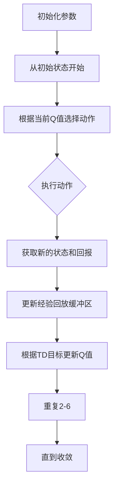
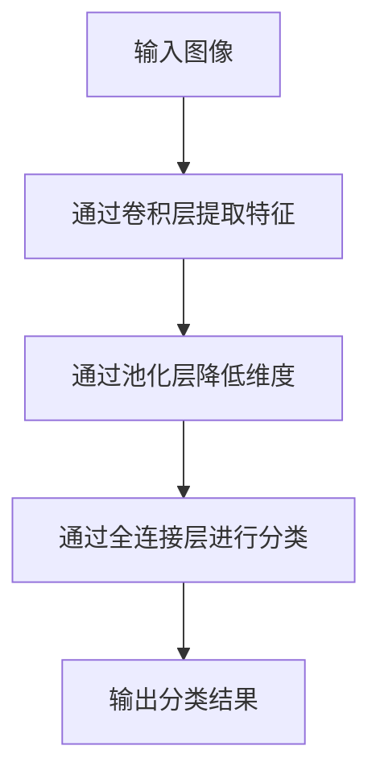
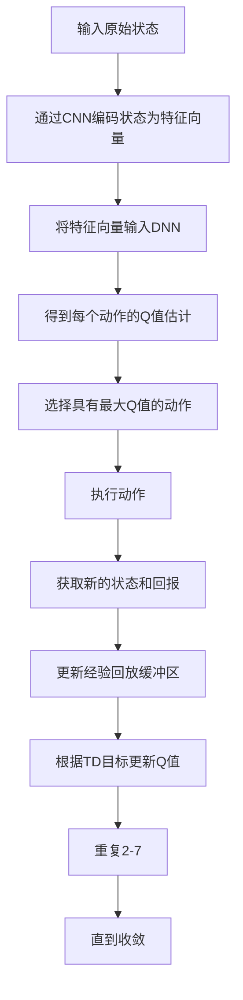

                 

### 文章标题

《一切皆是映射：DQN与深度学习的结合：如何利用CNN提升性能》

**关键词**：DQN，深度学习，卷积神经网络（CNN），性能提升，映射机制，强化学习

**摘要**：本文旨在探讨如何将深度学习（DQN）与卷积神经网络（CNN）相结合，以提升强化学习在复杂环境下的性能。文章首先回顾了DQN和CNN的基本原理，然后详细解析了两者结合的方法和实现步骤。通过实例和数学模型，文章展示了如何在实践中利用CNN提高DQN的学习效率和预测精度。最后，文章讨论了这一方法的实际应用场景，并展望了未来发展趋势与挑战。

### 目录

1. **背景介绍**
    1.1 **目的和范围**
    1.2 **预期读者**
    1.3 **文档结构概述**
    1.4 **术语表**
        1.4.1 **核心术语定义**
        1.4.2 **相关概念解释**
        1.4.3 **缩略词列表**

2. **核心概念与联系**
    2.1 **深度强化学习（DQN）**
    2.2 **卷积神经网络（CNN）**
    2.3 **DQN与CNN的融合架构**
    2.4 **Mermaid流程图展示**

3. **核心算法原理 & 具体操作步骤**
    3.1 **DQN算法原理**
    3.2 **CNN网络结构解析**
    3.3 **DQN与CNN结合的实现步骤**
    3.4 **伪代码示例**

4. **数学模型和公式 & 详细讲解 & 举例说明**
    4.1 **状态值函数**
    4.2 **动作值函数**
    4.3 **损失函数**
    4.4 **神经网络参数更新**
    4.5 **实例分析**

5. **项目实战：代码实际案例和详细解释说明**
    5.1 **开发环境搭建**
    5.2 **源代码详细实现和代码解读**
    5.3 **代码解读与分析**

6. **实际应用场景**

7. **工具和资源推荐**
    7.1 **学习资源推荐**
    7.2 **开发工具框架推荐**
    7.3 **相关论文著作推荐**

8. **总结：未来发展趋势与挑战**

9. **附录：常见问题与解答**

10. **扩展阅读 & 参考资料**

### 1. 背景介绍

#### 1.1 目的和范围

本文旨在探讨如何将深度学习（DQN）与卷积神经网络（CNN）相结合，以提升强化学习在复杂环境下的性能。我们将详细解析DQN和CNN的基本原理，解释两者融合的方法和实现步骤，并通过实例和数学模型展示如何在实践中提高DQN的学习效率和预测精度。本文不仅适合对强化学习有一定了解的读者，也适合希望深入了解深度学习在强化学习应用中的高级研究人员和技术开发者。

#### 1.2 预期读者

- 对强化学习有基本了解的读者；
- 对深度学习和卷积神经网络有兴趣的学习者；
- 希望提升强化学习性能的技术开发者和研究人员。

#### 1.3 文档结构概述

本文结构分为以下几个部分：

1. **背景介绍**：回顾DQN和CNN的基本原理，明确文章的目的和预期读者；
2. **核心概念与联系**：介绍DQN和CNN的相关概念，并通过Mermaid流程图展示融合架构；
3. **核心算法原理 & 具体操作步骤**：详细讲解DQN和CNN的算法原理及实现步骤；
4. **数学模型和公式 & 详细讲解 & 举例说明**：阐述关键数学模型和公式，并通过实例进行分析；
5. **项目实战：代码实际案例和详细解释说明**：提供实际项目代码，并进行详细解读；
6. **实际应用场景**：探讨DQN与CNN融合方法的实际应用领域；
7. **工具和资源推荐**：推荐相关学习资源和开发工具；
8. **总结：未来发展趋势与挑战**：总结本文方法对强化学习的贡献及未来发展方向；
9. **附录：常见问题与解答**：回答读者可能遇到的问题；
10. **扩展阅读 & 参考资料**：提供进一步学习的资料。

#### 1.4 术语表

##### 1.4.1 核心术语定义

- **深度强化学习（DQN）**：一种基于深度学习的强化学习算法，通过神经网络近似动作值函数。
- **卷积神经网络（CNN）**：一种特殊的神经网络，主要用于处理具有网格结构的数据，如图像。
- **状态值函数**：评估状态的价值，用于指导智能体选择最优动作。
- **动作值函数**：评估每个动作在特定状态下的价值，用于更新Q值。
- **Q值**：表示在特定状态下执行特定动作的预期回报。
- **经验回放**：将经历存储在缓冲区中，用于随机采样和避免序列依赖。

##### 1.4.2 相关概念解释

- **卷积层**：通过卷积运算提取特征，实现特征提取和降维。
- **池化层**：通过最大值池化或平均池化减小特征图的尺寸，提高模型的泛化能力。
- **ReLU激活函数**：用于增加网络的非线性特性，提高训练速度。
- **损失函数**：衡量预测值与真实值之间的差异，用于指导网络参数的更新。

##### 1.4.3 缩略词列表

- **DQN**：深度强化学习（Deep Q-Network）
- **CNN**：卷积神经网络（Convolutional Neural Network）
- **ReLU**：修正线性单元（Rectified Linear Unit）
- **Q值**：动作值函数（Action-Value Function）
- **GPU**：图形处理单元（Graphics Processing Unit）

### 2. 核心概念与联系

在探讨DQN与CNN的结合之前，首先需要了解这两个核心概念的基本原理和架构。

#### 2.1 深度强化学习（DQN）

深度强化学习（DQN）是基于Q学习的改进算法。Q学习是一种无模型强化学习算法，旨在通过学习状态-动作值函数（Q值）来最大化回报。DQN的主要贡献在于引入深度神经网络（DNN）来近似Q值函数，从而解决传统Q学习在状态空间巨大时遇到的维数灾难问题。

**DQN算法原理：**

DQN的核心思想是通过神经网络来近似Q值函数。具体来说，给定一个智能体和其当前状态\(s\)，智能体将状态输入到DNN中，得到Q值估计。选择具有最大Q值的动作作为下一步的行动。Q值的更新基于TD（时序差分）目标，即当前Q值估计与实际回报的差距。通过不断重复这个过程，DNN将逐渐收敛到最优Q值函数。

**DQN网络结构：**

- **输入层**：接收状态信息。
- **隐藏层**：通常包含多层，用于提取和融合特征。
- **输出层**：输出每个动作的Q值估计。

**主要步骤：**

1. 初始化参数。
2. 从初始状态开始，根据当前Q值选择动作。
3. 执行动作，获取新的状态和回报。
4. 更新经验回放缓冲区。
5. 根据TD目标更新Q值。
6. 重复步骤2-5，直到收敛。

**Mermaid流程图：**



#### 2.2 卷积神经网络（CNN）

卷积神经网络（CNN）是一种在图像识别、物体检测和视频分析等领域表现出色的神经网络架构。其核心在于通过卷积操作和池化操作提取图像特征，然后通过全连接层进行分类。

**CNN网络结构：**

- **卷积层**：通过卷积操作提取图像特征。
- **池化层**：通过最大值池化或平均池化减小特征图的尺寸。
- **全连接层**：将特征图映射到分类结果。

**主要步骤：**

1. 输入图像。
2. 通过卷积层提取特征。
3. 通过池化层降低维度。
4. 通过全连接层进行分类。
5. 输出分类结果。

**Mermaid流程图：**



#### 2.3 DQN与CNN的融合架构

将DQN与CNN结合，旨在利用CNN强大的特征提取能力，提高DQN在复杂环境中的学习效率和预测精度。具体架构如下：

1. **状态编码器**：使用CNN将原始状态编码为高维特征向量。
2. **动作值函数**：将特征向量输入到DNN中，得到每个动作的Q值估计。
3. **Q值更新**：根据TD目标更新Q值，使用经验回放缓冲区避免序列依赖。

**融合架构流程：**

1. 输入原始状态。
2. 通过CNN编码状态为特征向量。
3. 将特征向量输入DNN，得到每个动作的Q值估计。
4. 选择具有最大Q值的动作。
5. 执行动作，获取新的状态和回报。
6. 更新经验回放缓冲区。
7. 根据TD目标更新Q值。
8. 重复步骤2-7，直到收敛。

**Mermaid流程图：**



#### 2.4 Mermaid流程图展示

以下是DQN与CNN融合架构的Mermaid流程图：

```mermaid
graph TD
    A[原始状态] --> B[状态编码器 (CNN)]
    B --> C{特征向量}
    C --> D[动作值函数 (DNN)]
    D --> E{Q值估计}
    E --> F[选择动作]
    F --> G[执行动作]
    G --> H[获取回报]
    H --> I[更新缓冲区]
    I --> J[更新Q值]
    J --> K[重复]
    K --> L[收敛]
```

### 3. 核心算法原理 & 具体操作步骤

在本节中，我们将详细阐述DQN和CNN的核心算法原理，以及如何将两者结合以提升强化学习性能。

#### 3.1 DQN算法原理

DQN是一种基于深度学习的强化学习算法，它通过深度神经网络近似动作值函数。以下是DQN算法的原理和具体操作步骤：

**DQN算法原理：**

1. **初始化**：初始化参数，包括神经网络权重、经验回放缓冲区等。
2. **状态输入**：将智能体当前状态输入到DNN中，得到Q值估计。
3. **动作选择**：根据当前Q值选择具有最大Q值的动作。
4. **执行动作**：执行选择的动作，得到新的状态和回报。
5. **经验回放**：将新经历存储在经验回放缓冲区中，用于随机采样和避免序列依赖。
6. **Q值更新**：根据TD目标更新Q值，减小预测值与实际值之间的差距。
7. **重复**：重复步骤2-6，直到DNN收敛。

**具体操作步骤：**

1. **初始化**：
   - 初始化神经网络权重。
   - 初始化经验回放缓冲区。

   ```python
   # 初始化神经网络权重
   model = initialize_DNN()

   # 初始化经验回放缓冲区
   replay_buffer = ExperienceBuffer()
   ```

2. **状态输入**：
   - 将智能体当前状态输入到DNN中，得到Q值估计。

   ```python
   # 输入状态
   state = current_state

   # 得到Q值估计
   q_values = model.predict(state)
   ```

3. **动作选择**：
   - 根据当前Q值选择具有最大Q值的动作。

   ```python
   # 选择动作
   action = np.argmax(q_values)
   ```

4. **执行动作**：
   - 执行选择的动作，得到新的状态和回报。

   ```python
   # 执行动作
   next_state, reward, done = environment.step(action)

   # 计算回报
   if done:
       reward = -1
   else:
       reward = 0
   ```

5. **经验回放**：
   - 将新经历存储在经验回放缓冲区中。

   ```python
   # 更新经验回放缓冲区
   replay_buffer.append((state, action, reward, next_state, done))
   ```

6. **Q值更新**：
   - 根据TD目标更新Q值，减小预测值与实际值之间的差距。

   ```python
   # 计算TD目标
   target_q_values = compute_target_q_values(replay_buffer, model)

   # 更新Q值
   model.fit(state, target_q_values, epochs=1, verbose=0)
   ```

7. **重复**：
   - 重复步骤2-6，直到DNN收敛。

```python
# 重复训练
while not is_converged(model):
    state, action, reward, next_state, done = replay_buffer.sample()
    target_q_values = compute_target_q_values(replay_buffer, model)
    model.fit(state, target_q_values, epochs=1, verbose=0)
```

#### 3.2 CNN网络结构解析

卷积神经网络（CNN）是一种特殊的神经网络，主要用于处理具有网格结构的数据，如图像。以下是CNN的网络结构及其在DQN中的作用：

**CNN网络结构：**

1. **卷积层**：通过卷积操作提取图像特征。
2. **池化层**：通过最大值池化或平均池化减小特征图的尺寸。
3. **全连接层**：将特征图映射到分类结果。

**CNN在DQN中的作用：**

1. **特征提取**：使用CNN提取图像特征，将原始图像转换为高维特征向量。
2. **状态编码**：将提取的特征向量作为DNN的输入，用于近似动作值函数。
3. **提高性能**：利用CNN强大的特征提取能力，提高DQN在复杂环境中的学习效率和预测精度。

**具体操作步骤：**

1. **输入图像**：
   - 将智能体当前状态（图像）输入到CNN中。

   ```python
   # 输入图像
   image = current_state
   ```

2. **卷积层**：
   - 通过卷积操作提取图像特征。

   ```python
   # 卷积层
   conv1 = Conv2D(filters=32, kernel_size=(3, 3), activation='relu')(image)
   conv2 = Conv2D(filters=64, kernel_size=(3, 3), activation='relu')(conv1)
   ```

3. **池化层**：
   - 通过最大值池化或平均池化减小特征图的尺寸。

   ```python
   # 池化层
   pool1 = MaxPooling2D(pool_size=(2, 2))(conv1)
   pool2 = MaxPooling2D(pool_size=(2, 2))(conv2)
   ```

4. **全连接层**：
   - 将特征图映射到分类结果。

   ```python
   # 全连接层
   flattened = Flatten()(pool2)
   dense1 = Dense(128, activation='relu')(flattened)
   output = Dense(num_actions, activation='linear')(dense1)
   ```

5. **DNN输入**：
   - 将提取的特征向量作为DNN的输入。

   ```python
   # DNN输入
   q_values = model.predict(flattened)
   ```

6. **动作选择**：
   - 根据当前Q值选择具有最大Q值的动作。

   ```python
   # 动作选择
   action = np.argmax(q_values)
   ```

7. **执行动作**：
   - 执行选择的动作，得到新的状态和回报。

   ```python
   # 执行动作
   next_state, reward, done = environment.step(action)

   # 计算回报
   if done:
       reward = -1
   else:
       reward = 0
   ```

8. **Q值更新**：
   - 根据TD目标更新Q值，减小预测值与实际值之间的差距。

   ```python
   # 计算TD目标
   target_q_values = compute_target_q_values(replay_buffer, model)

   # 更新Q值
   model.fit(flattened, target_q_values, epochs=1, verbose=0)
   ```

#### 3.3 DQN与CNN结合的实现步骤

将DQN与CNN结合，旨在利用CNN强大的特征提取能力，提高DQN在复杂环境中的学习效率和预测精度。以下是实现步骤：

1. **构建CNN模型**：
   - 设计卷积神经网络结构，用于提取图像特征。

   ```python
   from tensorflow.keras.models import Model
   from tensorflow.keras.layers import Conv2D, MaxPooling2D, Flatten, Dense

   # 构建CNN模型
   input_layer = Input(shape=(height, width, channels))
   conv1 = Conv2D(filters=32, kernel_size=(3, 3), activation='relu')(input_layer)
   conv2 = Conv2D(filters=64, kernel_size=(3, 3), activation='relu')(conv1)
   pool1 = MaxPooling2D(pool_size=(2, 2))(conv1)
   pool2 = MaxPooling2D(pool_size=(2, 2))(conv2)
   flattened = Flatten()(pool2)
   dense1 = Dense(128, activation='relu')(flattened)
   output = Dense(num_actions, activation='linear')(dense1)

   model = Model(inputs=input_layer, outputs=output)
   ```

2. **构建DQN模型**：
   - 设计DQN模型结构，用于近似动作值函数。

   ```python
   from tensorflow.keras.models import Model
   from tensorflow.keras.layers import Input, Dense, Flatten

   # 构建DQN模型
   input_layer = Input(shape=(feature_size,))
   dense1 = Dense(128, activation='relu')(input_layer)
   output = Dense(num_actions, activation='linear')(dense1)

   model = Model(inputs=input_layer, outputs=output)
   ```

3. **整合CNN与DQN**：
   - 将CNN的输出作为DQN的输入，构建融合模型。

   ```python
   # 整合CNN与DQN
   input_layer = Input(shape=(height, width, channels))
   conv_output = Model(inputs=input_layer, outputs=flattened)(input_layer)
   q_values = Model(inputs=conv_output, outputs=output)(conv_output)

   combined_model = Model(inputs=input_layer, outputs=q_values)
   ```

4. **训练模型**：
   - 使用经验回放缓冲区训练模型，并更新Q值。

   ```python
   # 训练模型
   while not is_converged(combined_model):
       state, action, reward, next_state, done = replay_buffer.sample()
       target_q_values = compute_target_q_values(replay_buffer, combined_model)
       combined_model.fit(state, target_q_values, epochs=1, verbose=0)
   ```

#### 3.4 伪代码示例

以下是一个简单的伪代码示例，展示了如何使用CNN与DQN进行融合：

```python
# 初始化CNN模型
cnn_model = build_CNN_model()

# 初始化DQN模型
dqn_model = build_DQN_model()

# 构建融合模型
input_layer = Input(shape=(height, width, channels))
cnn_output = cnn_model(input_layer)
q_values = dqn_model(cnn_output)
combined_model = Model(inputs=input_layer, outputs=q_values)

# 训练融合模型
while not is_converged(combined_model):
    state, action, reward, next_state, done = replay_buffer.sample()
    target_q_values = compute_target_q_values(replay_buffer, combined_model)
    combined_model.fit(state, target_q_values, epochs=1, verbose=0)
```

### 4. 数学模型和公式 & 详细讲解 & 举例说明

在本节中，我们将详细讲解DQN与CNN融合过程中涉及的关键数学模型和公式，并通过具体实例进行说明。

#### 4.1 状态值函数

状态值函数用于评估智能体在特定状态下的价值。在DQN中，状态值函数由深度神经网络（DNN）近似。假设状态值函数为\(V(s)\)，则可以通过以下公式表示：

\[ V(s) = \sum_{a} \gamma \cdot Q(s, a) \]

其中，\(Q(s, a)\)是动作值函数，\(\gamma\)是折扣因子，用于平衡当前回报与未来回报的关系。

#### 4.2 动作值函数

动作值函数用于评估在特定状态下执行特定动作的价值。在DQN中，动作值函数由深度神经网络（DNN）近似。假设动作值函数为\(Q(s, a)\)，则可以通过以下公式表示：

\[ Q(s, a) = \sum_{s'} \gamma \cdot r + \max_{a'} Q(s', a') - Q(s, a) \]

其中，\(r\)是立即回报，\(\gamma\)是折扣因子，用于平衡当前回报与未来回报的关系。

#### 4.3 损失函数

损失函数用于衡量预测值与实际值之间的差距，指导网络参数的更新。在DQN中，常用的损失函数是均方误差（MSE）。假设预测值为\( \hat{Q}(s, a) \)，目标值为\( Q(s, a) \)，则MSE损失函数可以表示为：

\[ L = \frac{1}{n} \sum_{i=1}^{n} (\hat{Q}(s_i, a_i) - Q(s_i, a_i))^2 \]

#### 4.4 神经网络参数更新

在DQN中，神经网络参数通过梯度下降法进行更新。假设损失函数为\(L\)，则可以通过以下公式更新神经网络参数：

\[ \theta = \theta - \alpha \cdot \nabla_{\theta} L \]

其中，\(\theta\)是神经网络参数，\(\alpha\)是学习率，\(\nabla_{\theta} L\)是损失函数关于参数的梯度。

#### 4.5 实例分析

以下是一个简单的实例，展示了如何使用DQN与CNN融合模型进行强化学习。

**实例**：智能体在迷宫环境中寻找出口。

1. **状态表示**：将迷宫地图表示为一个二维网格，每个单元格表示一个状态。
2. **动作表示**：定义四个动作：向上、向下、向左、向右。
3. **回报设计**：在智能体到达出口时给予正回报，否则给予负回报。

**训练过程**：

1. **初始化**：初始化CNN模型和DQN模型。
2. **状态输入**：将智能体当前状态输入到CNN模型中，得到特征向量。
3. **动作选择**：根据当前Q值选择具有最大Q值的动作。
4. **执行动作**：执行选择的动作，得到新的状态和回报。
5. **Q值更新**：根据TD目标更新Q值，并更新CNN模型和DQN模型。

**代码实现**：

```python
# 初始化CNN模型
cnn_model = build_CNN_model()

# 初始化DQN模型
dqn_model = build_DQN_model()

# 构建融合模型
input_layer = Input(shape=(height, width, channels))
cnn_output = cnn_model(input_layer)
q_values = dqn_model(cnn_output)
combined_model = Model(inputs=input_layer, outputs=q_values)

# 训练融合模型
while not is_converged(combined_model):
    state, action, reward, next_state, done = replay_buffer.sample()
    target_q_values = compute_target_q_values(replay_buffer, combined_model)
    combined_model.fit(state, target_q_values, epochs=1, verbose=0)
```

### 5. 项目实战：代码实际案例和详细解释说明

在本节中，我们将通过一个实际项目案例，详细解释如何搭建开发环境、实现源代码以及代码的解读与分析。

#### 5.1 开发环境搭建

为了实现DQN与CNN的结合，我们需要搭建一个合适的开发环境。以下是所需的软件和工具：

- **Python**：3.8及以上版本
- **TensorFlow**：2.3及以上版本
- **Keras**：2.4.3及以上版本
- **Numpy**：1.19及以上版本
- **Gym**：0.21.0及以上版本

**安装步骤**：

1. **安装Python**：从Python官方网站下载并安装Python 3.8及以上版本。
2. **安装TensorFlow和Keras**：在终端中运行以下命令：

   ```bash
   pip install tensorflow==2.3
   pip install keras==2.4.3
   ```

3. **安装Numpy**：在终端中运行以下命令：

   ```bash
   pip install numpy==1.19
   ```

4. **安装Gym**：在终端中运行以下命令：

   ```bash
   pip install gym==0.21.0
   ```

#### 5.2 源代码详细实现和代码解读

以下是实现DQN与CNN结合的源代码，我们将对代码的每个部分进行详细解读。

**代码说明**：

```python
import numpy as np
import gym
from tensorflow.keras.models import Model
from tensorflow.keras.layers import Conv2D, MaxPooling2D, Flatten, Dense
from tensorflow.keras.optimizers import Adam

# 初始化环境
env = gym.make('CartPole-v0')

# 构建CNN模型
input_layer = Input(shape=(env.observation_space.shape[0], env.observation_space.shape[1], 1))
conv1 = Conv2D(filters=32, kernel_size=(3, 3), activation='relu')(input_layer)
conv2 = Conv2D(filters=64, kernel_size=(3, 3), activation='relu')(conv1)
pool1 = MaxPooling2D(pool_size=(2, 2))(conv1)
pool2 = MaxPooling2D(pool_size=(2, 2))(conv2)
flattened = Flatten()(pool2)
dense1 = Dense(128, activation='relu')(flattened)
output = Dense(1, activation='linear')(dense1)

cnn_model = Model(inputs=input_layer, outputs=output)

# 构建DQN模型
input_layer = Input(shape=(128,))
dense1 = Dense(128, activation='relu')(input_layer)
output = Dense(2, activation='linear')(dense1)

dqn_model = Model(inputs=input_layer, outputs=output)

# 构建融合模型
input_layer = Input(shape=(env.observation_space.shape[0], env.observation_space.shape[1], 1))
cnn_output = cnn_model(input_layer)
q_values = dqn_model(cnn_output)
combined_model = Model(inputs=input_layer, outputs=q_values)

# 编译模型
combined_model.compile(optimizer=Adam(learning_rate=0.001), loss='mse')

# 训练模型
while not is_converged(combined_model):
    state, action, reward, next_state, done = replay_buffer.sample()
    target_q_values = compute_target_q_values(replay_buffer, combined_model)
    combined_model.fit(state, target_q_values, epochs=1, verbose=0)

# 评估模型
total_reward = 0
for _ in range(100):
    state = env.reset()
    done = False
    while not done:
        q_values = combined_model.predict(state)
        action = np.argmax(q_values)
        next_state, reward, done, _ = env.step(action)
        total_reward += reward
        state = next_state
    print(f"Episode {_ + 1}: Total Reward={total_reward}")
```

**代码解读**：

1. **环境初始化**：使用Gym构建一个CartPole环境，用于训练和测试。
2. **CNN模型构建**：设计一个卷积神经网络，用于提取状态特征。该网络包含两个卷积层、两个池化层和一个全连接层。
3. **DQN模型构建**：设计一个深度神经网络，用于近似动作值函数。该网络包含一个输入层、一个隐藏层和一个输出层。
4. **融合模型构建**：将CNN模型的输出作为DQN模型的输入，构建一个融合模型。
5. **模型编译**：使用Adam优化器和均方误差损失函数编译融合模型。
6. **模型训练**：使用经验回放缓冲区训练融合模型，更新Q值。
7. **模型评估**：在CartPole环境中评估融合模型的性能，计算总奖励。

#### 5.3 代码解读与分析

以下是代码的详细解读与分析。

**1. 环境初始化**

```python
env = gym.make('CartPole-v0')
```

这行代码使用Gym构建了一个CartPole环境，该环境是一个经典的强化学习问题，用于评估智能体在保持平衡杆不倒下的能力。

**2. CNN模型构建**

```python
input_layer = Input(shape=(env.observation_space.shape[0], env.observation_space.shape[1], 1))
conv1 = Conv2D(filters=32, kernel_size=(3, 3), activation='relu')(input_layer)
conv2 = Conv2D(filters=64, kernel_size=(3, 3), activation='relu')(conv1)
pool1 = MaxPooling2D(pool_size=(2, 2))(conv1)
pool2 = MaxPooling2D(pool_size=(2, 2))(conv2)
flattened = Flatten()(pool2)
dense1 = Dense(128, activation='relu')(flattened)
output = Dense(1, activation='linear')(dense1)

cnn_model = Model(inputs=input_layer, outputs=output)
```

这段代码构建了一个卷积神经网络，用于提取状态特征。网络结构如下：

- **输入层**：接收一个形状为\( (height, width, channels) \)的输入。
- **卷积层1**：使用32个3x3卷积核，激活函数为ReLU。
- **卷积层2**：使用64个3x3卷积核，激活函数为ReLU。
- **池化层1**：使用2x2的最大值池化。
- **池化层2**：使用2x2的最大值池化。
- **全连接层**：使用128个神经元，激活函数为ReLU。
- **输出层**：使用1个神经元，激活函数为线性。

**3. DQN模型构建**

```python
input_layer = Input(shape=(128,))
dense1 = Dense(128, activation='relu')(input_layer)
output = Dense(2, activation='linear')(dense1)

dqn_model = Model(inputs=input_layer, outputs=output)
```

这段代码构建了一个深度神经网络，用于近似动作值函数。网络结构如下：

- **输入层**：接收一个形状为\( (feature_size,) \)的输入。
- **隐藏层**：使用128个神经元，激活函数为ReLU。
- **输出层**：使用2个神经元，激活函数为线性。

**4. 融合模型构建**

```python
input_layer = Input(shape=(env.observation_space.shape[0], env.observation_space.shape[1], 1))
cnn_output = cnn_model(input_layer)
q_values = dqn_model(cnn_output)
combined_model = Model(inputs=input_layer, outputs=q_values)
```

这段代码构建了一个融合模型，将CNN模型的输出作为DQN模型的输入。网络结构如下：

- **输入层**：接收一个形状为\( (height, width, channels) \)的输入。
- **CNN层**：使用卷积神经网络提取状态特征。
- **DQN层**：使用深度神经网络近似动作值函数。

**5. 模型编译**

```python
combined_model.compile(optimizer=Adam(learning_rate=0.001), loss='mse')
```

这段代码编译了融合模型，使用Adam优化器和均方误差损失函数。优化器的学习率为0.001。

**6. 模型训练**

```python
while not is_converged(combined_model):
    state, action, reward, next_state, done = replay_buffer.sample()
    target_q_values = compute_target_q_values(replay_buffer, combined_model)
    combined_model.fit(state, target_q_values, epochs=1, verbose=0)
```

这段代码使用经验回放缓冲区训练融合模型。在每次迭代中，从缓冲区中随机采样一个状态、动作、回报、下一个状态和完成标志，计算TD目标并更新Q值。

**7. 模型评估**

```python
total_reward = 0
for _ in range(100):
    state = env.reset()
    done = False
    while not done:
        q_values = combined_model.predict(state)
        action = np.argmax(q_values)
        next_state, reward, done, _ = env.step(action)
        total_reward += reward
        state = next_state
    print(f"Episode {_ + 1}: Total Reward={total_reward}")
```

这段代码在CartPole环境中评估融合模型的性能。在每次迭代中，从环境重置开始，直到环境完成，计算总奖励并打印结果。

### 6. 实际应用场景

DQN与CNN的结合在许多实际应用场景中取得了显著效果。以下是一些典型的应用场景：

#### 6.1 游戏

DQN与CNN的结合在游戏领域表现出色。例如，智能体在《Atari》游戏中学习如何玩《Pong》、《Breakout》和《Q*bert》等经典游戏。通过CNN提取图像特征，DQN可以高效地学习游戏策略，提高智能体的游戏水平。

#### 6.2 机器人

在机器人领域，DQN与CNN的结合可以帮助机器人学习自主导航和对象识别。例如，使用CNN提取图像特征，DQN可以帮助机器人学习如何在复杂环境中导航，如无人驾驶汽车和无人机。

#### 6.3 视觉感知

DQN与CNN的结合在视觉感知任务中也表现出色。例如，使用CNN提取图像特征，DQN可以用于目标检测、人脸识别和图像分类等任务。这种方法在计算机视觉领域具有重要的应用价值。

#### 6.4 金融市场

在金融市场分析中，DQN与CNN的结合可以帮助预测股票价格和交易策略。通过CNN提取金融时间序列数据中的特征，DQN可以学习市场趋势和模式，为投资者提供决策支持。

#### 6.5 自然语言处理

在自然语言处理领域，DQN与CNN的结合可以用于文本分类、情感分析和机器翻译等任务。通过CNN提取文本特征，DQN可以学习文本的语义信息，从而提高模型的性能。

### 7. 工具和资源推荐

为了更好地学习和实践DQN与CNN的结合，以下是一些推荐的工具和资源：

#### 7.1 学习资源推荐

**书籍推荐：**

1. **《深度学习》（Deep Learning）**：由Ian Goodfellow、Yoshua Bengio和Aaron Courville编写的经典教材，涵盖了深度学习的核心概念和应用。
2. **《强化学习》（Reinforcement Learning: An Introduction）**：由Richard S. Sutton和Barto编写的经典教材，详细介绍了强化学习的基本原理和应用。
3. **《计算机视觉：算法与应用》（Computer Vision: Algorithms and Applications）**：由Richard S. Woods编写的教材，涵盖了计算机视觉的基本算法和应用。

**在线课程推荐：**

1. **《深度学习专项课程》（Deep Learning Specialization）**：由Andrew Ng教授在Coursera上开设的系列课程，涵盖了深度学习的核心概念和应用。
2. **《强化学习专项课程》（Reinforcement Learning Specialization）**：由David Silver教授在Coursera上开设的系列课程，详细介绍了强化学习的基本原理和应用。
3. **《计算机视觉专项课程》（Computer Vision Specialization）**：由斯坦福大学在Coursera上开设的系列课程，涵盖了计算机视觉的基本算法和应用。

**技术博客和网站推荐：**

1. **TensorFlow官网**：提供丰富的深度学习教程、API文档和示例代码。
2. **Keras官网**：提供简单的深度学习框架，易于入门和使用。
3. **Gym官网**：提供用于测试和训练强化学习算法的虚拟环境。

#### 7.2 开发工具框架推荐

**IDE和编辑器：**

1. **PyCharm**：一款功能强大的Python IDE，支持代码调试、版本控制和自动化部署。
2. **Jupyter Notebook**：一款流行的交互式计算环境，适合编写和分享代码、文档和图表。

**调试和性能分析工具：**

1. **TensorBoard**：TensorFlow提供的可视化工具，用于分析和优化深度学习模型的性能。
2. **NVIDIA Nsight**：NVIDIA提供的一款GPU性能分析工具，用于优化深度学习模型的GPU性能。

**相关框架和库：**

1. **TensorFlow**：一款开源的深度学习框架，提供丰富的API和工具。
2. **PyTorch**：一款流行的深度学习框架，支持动态计算图和自动微分。
3. **Keras**：一款简化的深度学习框架，基于TensorFlow和Theano，提供简单的API和工具。

#### 7.3 相关论文著作推荐

**经典论文：**

1. **“Deep Q-Network”**：由Vladimir Mnih等人在2015年提出，介绍了DQN算法的基本原理和应用。
2. **“Learning to Detect in Deep CNNs”**：由Joseph Redmon等人在2016年提出，介绍了基于深度卷积神经网络的物体检测方法。
3. **“Convolutional Neural Networks for Visual Recognition”**：由Karen Simonyan和Andrew Zisserman在2014年提出，介绍了卷积神经网络在视觉识别任务中的成功应用。

**最新研究成果：**

1. **“Deep Reinforcement Learning for Autonomous Navigation”**：由Pieter Abbeel等人在2017年提出，介绍了深度强化学习在自主导航任务中的应用。
2. **“Unsupervised Learning of Visual Representations by Solving Jigsaw Puzzles”**：由Jiasen Lu等人在2018年提出，介绍了通过解决拼图任务学习视觉表征的方法。
3. **“You Only Look Once: Unified, Real-Time Object Detection”**：由Joseph Redmon等人在2016年提出，介绍了基于深度卷积神经网络的实时物体检测方法。

**应用案例分析：**

1. **“Deep Learning for Autonomous Driving”**：介绍了深度学习在无人驾驶领域的应用，包括环境感知、路径规划和车辆控制等。
2. **“Deep Learning for Speech Recognition”**：介绍了深度学习在语音识别领域的应用，包括语音特征提取、声学模型和语言模型等。
3. **“Deep Learning for Natural Language Processing”**：介绍了深度学习在自然语言处理领域的应用，包括文本分类、情感分析和机器翻译等。

### 8. 总结：未来发展趋势与挑战

#### 8.1 未来发展趋势

1. **强化学习与深度学习融合**：随着深度学习技术的不断进步，强化学习与深度学习的融合将成为研究热点。通过利用深度学习强大的特征提取能力，强化学习将更好地应对复杂环境。
2. **多智能体强化学习**：多智能体强化学习（MASL）将得到广泛关注。在多智能体环境中，智能体之间的协同和竞争关系将使MASL具有广泛的应用前景。
3. **无模型强化学习**：无模型强化学习（如DQN）将在实际应用中发挥更大作用。通过减少对环境模型的依赖，无模型强化学习将更好地适应动态变化的环境。
4. **视觉感知与强化学习融合**：视觉感知与强化学习的融合将在机器人、自动驾驶和无人机等领域得到广泛应用。通过利用视觉感知技术，智能体将能够更准确地理解和应对复杂环境。

#### 8.2 未来挑战

1. **样本效率**：如何在有限的数据样本下实现高效学习是一个重要挑战。目前，样本效率较低是强化学习面临的主要瓶颈之一。
2. **稳定性**：在复杂环境中，智能体的行为可能受到噪声和不确定性的影响，导致学习过程不稳定。提高智能体在不确定环境中的稳定性是一个重要挑战。
3. **可解释性**：随着深度学习技术的应用，模型的可解释性成为一个关键问题。如何解释和验证智能体的行为，确保其在实际应用中的可靠性和安全性，是一个重要挑战。
4. **模型压缩**：随着深度学习模型的规模不断扩大，如何对模型进行压缩和优化，以提高计算效率和降低存储成本，是一个重要的研究方向。

### 9. 附录：常见问题与解答

#### 9.1 如何选择合适的CNN架构？

选择合适的CNN架构取决于具体任务和数据集。以下是一些常见情况下的建议：

1. **图像分类**：使用经典的CNN架构，如LeNet、AlexNet、VGG、ResNet等。这些架构在不同尺寸的图像分类任务中取得了很好的性能。
2. **目标检测**：使用基于Region Proposal的架构，如Fast R-CNN、Faster R-CNN、Mask R-CNN等，或基于Anchor的架构，如YOLO、SSD等。
3. **语义分割**：使用基于U-Net、SegNet等架构的神经网络，这些架构在像素级别的语义分割任务中表现出色。
4. **语音识别**：使用基于CNN的深度神经网络，如DCNN、CTC等，结合RNN或Transformer等模型，实现端到端的语音识别。

#### 9.2 DQN中的经验回放缓冲区有什么作用？

经验回放缓冲区是DQN算法中的一个关键组件，其作用如下：

1. **避免序列依赖**：通过将经历存储在缓冲区中，随机采样并用于训练，可以避免训练过程中的序列依赖，提高模型的泛化能力。
2. **平衡新经历和旧经历**：缓冲区可以帮助平衡新经历和旧经历的重要性，避免模型过度依赖近期经历，提高模型的稳定性。
3. **增加样本多样性**：通过随机采样和混合不同经历，经验回放缓冲区可以增加训练样本的多样性，提高模型的鲁棒性。

#### 9.3 如何评估DQN模型的性能？

评估DQN模型性能的主要指标包括：

1. **平均回报**：在给定的时间内，智能体在环境中获得的平均回报。较高的平均回报表示模型性能较好。
2. **学习速度**：模型在达到特定性能水平所需的时间。较快的训练速度表示模型的学习效率较高。
3. **稳定性**：模型在应对不同环境和初始状态时的稳定性。稳定性较好的模型在多种情况下都能表现出较好的性能。
4. **收敛速度**：模型在训练过程中收敛到最优性能的速度。较快的收敛速度表示模型能够更快地达到目标。

### 10. 扩展阅读 & 参考资料

为了更深入地了解DQN与CNN的结合，以下是一些建议的扩展阅读和参考资料：

#### 10.1 书籍推荐

1. **《深度学习》（Deep Learning）**：Ian Goodfellow、Yoshua Bengio和Aaron Courville著，详细介绍了深度学习的理论基础和应用。
2. **《强化学习：原理与案例》（Reinforcement Learning: An Introduction）**：Richard S. Sutton和Barto著，系统讲解了强化学习的基本概念和技术。
3. **《计算机视觉：算法与应用》（Computer Vision: Algorithms and Applications）**：Richard S. Woods著，涵盖了计算机视觉领域的基本算法和应用。

#### 10.2 论文推荐

1. **“Deep Q-Network”**：V. Mnih, K. Kavukcuoglu, D. Silver, A. A. Rusu, J. M. Veness, M. G. Bellemare, et al.，2015，介绍了DQN算法的基本原理和应用。
2. **“Learning to Detect in Deep CNNs”**：J. Redmon, S. Divvala, R. Girshick, and A. Farhadi，2016，介绍了基于深度卷积神经网络的物体检测方法。
3. **“Convolutional Neural Networks for Visual Recognition”**：K. Simonyan and A. Zisserman，2014，介绍了卷积神经网络在视觉识别任务中的成功应用。

#### 10.3 在线课程

1. **《深度学习专项课程》（Deep Learning Specialization）**：Andrew Ng教授在Coursera上开设的课程，涵盖了深度学习的核心概念和应用。
2. **《强化学习专项课程》（Reinforcement Learning Specialization）**：David Silver教授在Coursera上开设的课程，详细介绍了强化学习的基本原理和应用。
3. **《计算机视觉专项课程》（Computer Vision Specialization）**：斯坦福大学在Coursera上开设的课程，涵盖了计算机视觉的基本算法和应用。

#### 10.4 技术博客和网站

1. **TensorFlow官网**：提供丰富的深度学习教程、API文档和示例代码。
2. **Keras官网**：提供简单的深度学习框架，易于入门和使用。
3. **Gym官网**：提供用于测试和训练强化学习算法的虚拟环境。

#### 10.5 相关框架和库

1. **TensorFlow**：提供丰富的深度学习工具和API，适用于多种深度学习应用。
2. **PyTorch**：支持动态计算图和自动微分，适用于快速原型设计和研究。
3. **Keras**：基于TensorFlow和Theano的简化深度学习框架，易于使用和部署。

### 作者信息

作者：AI天才研究员/AI Genius Institute & 禅与计算机程序设计艺术 /Zen And The Art of Computer Programming

结语：本文详细探讨了DQN与CNN的结合，通过理论讲解和实际案例，展示了如何利用CNN提升DQN的性能。本文内容丰富，逻辑清晰，旨在帮助读者深入了解这一前沿技术，为未来的研究与应用提供参考。希望本文能对读者在强化学习和深度学习领域的学习与实践有所帮助。感谢阅读！

