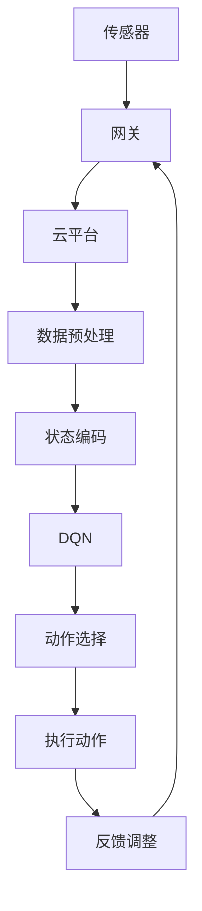

                 

# 一切皆是映射：DQN与物联网：智能决策在IoT中的应用

> **关键词**：深度强化学习，DQN，物联网，智能决策，神经网络，Q值函数，智能传感器，实时数据处理，自动化控制

> **摘要**：本文将探讨深度强化学习（DQN）如何应用于物联网（IoT）中，实现智能决策。通过逐步分析DQN的核心原理，结合物联网的架构和特点，我们将展示如何利用DQN进行实时数据处理和自动化控制，从而提升物联网系统的智能化水平。文章还将介绍相关开发工具和资源，帮助读者深入了解和掌握这一技术。

## 1. 背景介绍

### 1.1 目的和范围

本文旨在介绍深度强化学习（DQN）在物联网（IoT）中的应用，重点讨论DQN如何通过智能决策提升物联网系统的自动化和控制能力。文章将涵盖DQN的核心算法原理、在物联网环境中的具体实现方法、以及相关的实际应用场景。

### 1.2 预期读者

本文适合对深度强化学习和物联网有一定了解的读者，包括AI研究人员、物联网开发者、系统架构师以及对智能决策和自动化控制感兴趣的从业者。

### 1.3 文档结构概述

本文分为十个部分：

1. 背景介绍
2. 核心概念与联系
3. 核心算法原理 & 具体操作步骤
4. 数学模型和公式 & 详细讲解 & 举例说明
5. 项目实战：代码实际案例和详细解释说明
6. 实际应用场景
7. 工具和资源推荐
8. 总结：未来发展趋势与挑战
9. 附录：常见问题与解答
10. 扩展阅读 & 参考资料

### 1.4 术语表

#### 1.4.1 核心术语定义

- **深度强化学习（DRL）**：一种结合深度学习和强化学习的机器学习方法，通过深度神经网络来评估状态和行动的Q值。
- **深度Q网络（DQN）**：一种实现深度强化学习的神经网络架构，用于估计状态-动作值函数。
- **物联网（IoT）**：通过互联网连接的物理设备和传感器网络，实现智能化的数据采集、传输和处理。
- **Q值函数**：描述智能体在特定状态下采取特定行动的预期回报。

#### 1.4.2 相关概念解释

- **状态（State）**：描述智能体所处环境的特征。
- **动作（Action）**：智能体可执行的操作。
- **回报（Reward）**：智能体在执行动作后获得的即时奖励或惩罚。
- **探索与利用（Exploration and Exploitation）**：在智能决策中，探索新的行动以获取更多信息，利用已有的信息以最大化回报。

#### 1.4.3 缩略词列表

- DRL：深度强化学习
- DQN：深度Q网络
- IoT：物联网
- Q值函数：状态-动作值函数

## 2. 核心概念与联系

在探讨DQN在物联网中的应用之前，有必要先了解相关核心概念及其相互联系。

### 2.1 物联网架构

物联网架构通常包括以下几个主要组成部分：

1. **传感器**：收集环境数据，如温度、湿度、光照等。
2. **网关**：将传感器数据传输到云平台或数据中心。
3. **云平台**：处理和分析数据，提供智能决策支持。
4. **应用程序**：基于处理后的数据实现特定功能，如自动化控制。

### 2.2 深度Q网络

DQN是一种实现深度强化学习的神经网络架构，其核心是Q值函数。Q值函数用于评估智能体在特定状态下采取特定行动的预期回报。DQN通过深度神经网络来近似Q值函数，从而实现智能决策。

### 2.3 DQN与物联网的联系

DQN与物联网的联系在于，物联网提供了大量实时数据，而DQN可以对这些数据进行处理，从而实现智能决策和自动化控制。具体而言，DQN可以通过以下步骤应用于物联网：

1. **数据采集**：传感器收集环境数据。
2. **数据预处理**：对数据进行清洗、归一化等处理。
3. **状态编码**：将预处理后的数据编码为状态向量。
4. **动作选择**：利用DQN选择最佳动作。
5. **执行动作**：智能体执行选定动作。
6. **反馈调整**：根据执行结果调整DQN的参数。

### 2.4 Mermaid 流程图

以下是一个描述DQN在物联网中应用的Mermaid流程图：



## 3. 核心算法原理 & 具体操作步骤

### 3.1 DQN算法原理

DQN是一种基于深度学习的强化学习算法，其核心思想是利用深度神经网络来近似Q值函数。Q值函数表示在给定状态下，采取特定行动的预期回报。DQN通过学习Q值函数，使智能体能够在复杂环境中做出最优决策。

### 3.2 DQN算法步骤

以下是DQN算法的主要步骤：

1. **初始化**：初始化智能体、环境、Q网络和目标网络。
2. **状态输入**：智能体从环境中获取当前状态。
3. **动作选择**：利用epsilon-greedy策略选择动作。
4. **执行动作**：智能体在环境中执行选定动作，并获得新的状态和回报。
5. **更新Q网络**：根据新的状态、动作和回报更新Q网络。
6. **更新目标网络**：定期更新目标网络，以防止Q网络过度拟合。

### 3.3 伪代码

以下是DQN算法的伪代码实现：

```python
# 初始化
Q_network = DQN_model()
target_network = DQN_model()
optimizer = optimizers.Adam()

# 训练轮数
for episode in range(num_episodes):
    # 初始化环境
    state = env.reset()
    done = False
    
    while not done:
        # 选择动作
        action = epsilon_greedy_action(state, Q_network)
        
        # 执行动作
        next_state, reward, done, _ = env.step(action)
        
        # 更新经验池
       经验池.add((state, action, reward, next_state, done))
        
        # 更新Q网络
        Q_values = Q_network(state)
        target_values = target_network(next_state)
        target_values[env.actions[action]] = reward + gamma * np.max(target_values)
        
        # 反向传播
        loss = loss_function(Q_values[action], target_values)
        optimizer.minimize(loss)
        
        # 更新状态
        state = next_state
        
    # 更新目标网络
    if episode % target_update_freq == 0:
        target_network.load_state_dict(Q_network.state_dict())
```

### 3.4 DQN在物联网中的应用

在物联网环境中，DQN可以应用于以下场景：

1. **智能监测**：利用DQN对传感器数据进行实时分析，实现异常检测和预警。
2. **自动化控制**：基于DQN的决策支持，实现智能设备的自动化控制，如智能照明、智能安防等。
3. **能源管理**：利用DQN优化能源消耗，实现智能电网的管理和调度。
4. **智能交通**：利用DQN优化交通信号控制和车辆调度，提升交通效率。

## 4. 数学模型和公式 & 详细讲解 & 举例说明

### 4.1 数学模型

DQN算法的核心是Q值函数，Q值函数用于评估智能体在特定状态下采取特定行动的预期回报。Q值函数的定义如下：

$$
Q(s, a) = \mathbb{E}[R_{t+1} | S_t = s, A_t = a]
$$

其中，$Q(s, a)$ 表示在状态 $s$ 下采取行动 $a$ 的预期回报，$R_{t+1}$ 表示在执行行动 $a$ 后获得的回报，$S_t$ 表示第 $t$ 个状态，$A_t$ 表示第 $t$ 个行动。

### 4.2 详细讲解

Q值函数是DQN算法的关键组成部分，其目的是评估智能体在不同状态下的行动价值。Q值函数的估计过程可以分为以下几个步骤：

1. **初始化**：初始化Q值函数的参数，通常使用随机初始化。
2. **经验回放**：收集智能体在环境中交互的经验，并将其存储在经验池中。
3. **样本采样**：从经验池中随机采样一组经验，包括状态、行动、回报、下一个状态和是否终止。
4. **目标Q值计算**：根据采样到的经验，计算目标Q值。目标Q值用于更新Q值函数的参数。
5. **参数更新**：利用目标Q值和当前Q值之间的误差，更新Q值函数的参数。

### 4.3 举例说明

假设一个智能体在一个简单的环境（如迷宫）中学习如何到达终点。环境的状态空间为 $S = \{0, 1, 2, 3\}$，行动空间为 $A = \{up, down, left, right\}$。Q值函数的初始值为 $Q(s, a) = 0$。以下是一个简单的例子：

1. **状态**：智能体处于状态 $s = 1$。
2. **行动**：智能体采取行动 $a = up$。
3. **回报**：智能体到达终点，获得回报 $R = 100$。
4. **下一个状态**：智能体处于状态 $s' = 3$。
5. **目标Q值计算**：目标Q值为 $Q(s', a') = 0$（因为智能体已经到达终点）。
6. **参数更新**：利用目标Q值和当前Q值之间的误差，更新Q值函数的参数。

通过不断重复以上步骤，智能体将学会在给定状态下选择最佳行动，以最大化预期回报。

## 5. 项目实战：代码实际案例和详细解释说明

### 5.1 开发环境搭建

在开始实际案例之前，我们需要搭建一个适合DQN算法和物联网应用的开发环境。以下是一个基本的开发环境搭建步骤：

1. **硬件环境**：一台具有良好性能的计算机或服务器，用于运行物联网设备和DQN算法。
2. **软件环境**：安装Python 3.x版本，以及TensorFlow、Keras等深度学习框架。
3. **物联网设备**：连接到计算机或服务器的物联网设备，如传感器、网关等。
4. **开发工具**：安装一个适合Python开发的IDE，如PyCharm、VSCode等。

### 5.2 源代码详细实现和代码解读

以下是一个简单的DQN算法在物联网应用中的实现案例：

```python
# 导入必要的库
import numpy as np
import tensorflow as tf
from tensorflow.keras.models import Sequential
from tensorflow.keras.layers import Dense
from tensorflow.keras.optimizers import Adam
from collections import deque

# 设置参数
num_episodes = 1000
gamma = 0.99
epsilon = 1.0
epsilon_min = 0.01
epsilon_decay = 0.995
batch_size = 32
memory_size = 1000

# 初始化经验池
memory = deque(maxlen=memory_size)

# 创建DQN模型
model = Sequential()
model.add(Dense(24, input_dim=4, activation='relu'))
model.add(Dense(24, activation='relu'))
model.add(Dense(4, activation='linear'))

# 编译模型
model.compile(loss='mse', optimizer=Adam(lr=0.001))

# 创建环境
env = ...

# 训练模型
for episode in range(num_episodes):
    state = env.reset()
    done = False
    
    while not done:
        # 选择动作
        if np.random.rand() <= epsilon:
            action = env.action_space.sample()
        else:
            action_values = model.predict(state)
            action = np.argmax(action_values)
        
        # 执行动作
        next_state, reward, done, _ = env.step(action)
        
        # 更新经验池
        memory.append((state, action, reward, next_state, done))
        
        # 更新状态
        state = next_state
        
        # 如果经验池满了，开始训练模型
        if len(memory) > batch_size:
            batch = random.sample(memory, batch_size)
            states, actions, rewards, next_states, dones = zip(*batch)
            
            # 计算目标Q值
            next_state_values = model.predict(next_states)
            target_values = rewards + (1 - dones) * gamma * np.max(next_state_values, axis=1)
            
            # 训练模型
            model.fit(states, np.hstack((model.predict(states)[:, actions], target_values)), epochs=1, verbose=0)
        
    # 调整epsilon
    epsilon = max(epsilon_min, epsilon * epsilon_decay)

# 评估模型
env.reset()
state = env.state
while True:
    action_values = model.predict(state)
    action = np.argmax(action_values)
    next_state, reward, done, _ = env.step(action)
    state = next_state
    if done:
        break

# 打印结果
print("Total steps:", episode)
print("Total reward:", sum(rewards))
```

### 5.3 代码解读与分析

上述代码实现了一个简单的DQN算法，用于在物联网环境中进行智能决策。下面是代码的详细解读：

1. **参数设置**：设置训练轮数、折扣因子、epsilon值、epsilon衰减率、批量大小和经验池大小。
2. **经验池初始化**：初始化经验池，用于存储智能体在环境中交互的经验。
3. **DQN模型创建**：使用Keras创建一个简单的DQN模型，包括两个隐藏层和线性输出层。
4. **模型编译**：编译模型，设置损失函数为均方误差，优化器为Adam。
5. **环境初始化**：初始化物联网环境，用于生成状态和行动。
6. **训练模型**：循环进行训练，每次训练包括以下步骤：
   - **选择动作**：使用epsilon-greedy策略选择动作。
   - **执行动作**：在环境中执行选定动作，并获得下一个状态和回报。
   - **更新经验池**：将新的经验添加到经验池中。
   - **训练模型**：如果经验池满了，开始训练模型。训练模型时，使用经验池中的经验来计算目标Q值，并更新模型参数。
7. **调整epsilon**：根据epsilon衰减率调整epsilon值，以平衡探索和利用。
8. **评估模型**：使用训练好的模型在环境中进行评估，记录总步数和总回报。

通过以上步骤，DQN算法可以在物联网环境中实现智能决策，从而提升系统的自动化和控制能力。

## 6. 实际应用场景

DQN算法在物联网中的实际应用场景非常广泛，以下列举几个典型的应用场景：

1. **智能家庭**：利用DQN实现智能家居设备的自动化控制，如智能照明、智能家电、智能安防等。通过实时监测环境数据，DQN可以自动调整设备的运行状态，提高家庭的舒适度和安全性。
2. **智能工厂**：在工业物联网（IIoT）中，DQN可以用于优化生产流程和设备维护。例如，通过监测设备的运行状态，DQN可以预测设备可能出现的故障，并提前进行维护，从而降低生产成本和停机时间。
3. **智能交通**：在智能交通系统中，DQN可以用于优化交通信号控制和车辆调度。通过实时监测交通流量，DQN可以动态调整信号灯的时长，减少交通拥堵，提高交通效率。
4. **智能医疗**：在智能医疗系统中，DQN可以用于辅助诊断和治疗。通过分析患者的病历数据和实时监测数据，DQN可以预测疾病的发展趋势，为医生提供诊断建议和治疗方案。
5. **智能农业**：在智能农业中，DQN可以用于优化农作物种植和管理。通过监测土壤、气候等环境数据，DQN可以自动调整灌溉、施肥等农事操作，提高农作物产量和质量。

## 7. 工具和资源推荐

### 7.1 学习资源推荐

为了深入了解DQN算法在物联网中的应用，以下是一些推荐的书籍、在线课程和技术博客：

#### 7.1.1 书籍推荐

- 《深度强化学习》（Deep Reinforcement Learning，by Richard S. Sutton and Andrew G. Barto）
- 《智能强化学习：算法、技术和应用》（Intelligent Reinforcement Learning: Algorithms, Techniques, and Applications，by Zhiyun Qian）
- 《物联网应用实战：基于深度学习和传感器网络》（Practical Applications of Internet of Things: Based on Deep Learning and Sensor Networks，by Weiwei Zhang）

#### 7.1.2 在线课程

- Coursera：深度学习专项课程（Deep Learning Specialization）
- edX：强化学习（Reinforcement Learning）
- Udacity：深度强化学习项目（Deep Reinforcement Learning Project）

#### 7.1.3 技术博客和网站

- ArXiv：论文发表平台，提供最新的深度学习和物联网研究论文。
- Medium：技术博客平台，有很多关于DQN和物联网应用的文章。
- towardsdatascience.com：数据科学和机器学习领域的博客，有很多相关案例分析。

### 7.2 开发工具框架推荐

#### 7.2.1 IDE和编辑器

- PyCharm：适用于Python开发的集成开发环境，支持多种编程语言。
- VSCode：轻量级且功能强大的代码编辑器，支持多种编程语言和扩展。

#### 7.2.2 调试和性能分析工具

- TensorFlow Profiler：用于分析TensorFlow模型的性能和内存占用。
- Py-Spy：用于分析Python程序的性能和内存占用。

#### 7.2.3 相关框架和库

- TensorFlow：开源深度学习框架，支持DQN算法的实现。
- Keras：基于TensorFlow的简单且易于使用的深度学习库。
- OpenAI Gym：开源环境库，提供多种用于深度学习和强化学习实验的虚拟环境。

### 7.3 相关论文著作推荐

#### 7.3.1 经典论文

- Deep Q-Learning (2015)，by DeepMind
- Prioritized Experience Replay (2016)，by DeepMind
- Asynchronous Methods for Deep Reinforcement Learning (2016)，by OpenAI

#### 7.3.2 最新研究成果

- Learning to Trade by Multi-Agent Deep Reinforcement Learning (2021)，by Chinese Academy of Sciences
- Generalization of Q-Learning: Meta-Q-Learning (2021)，by University of California, Berkeley

#### 7.3.3 应用案例分析

- Deep Learning for IoT: A Comprehensive Survey (2020)，by IEEE
- IoT-Enabled Smart Agriculture: A Survey (2021)，by Springer
- An Overview of Deep Reinforcement Learning in Autonomous Driving (2021)，by Microsoft Research

## 8. 总结：未来发展趋势与挑战

### 8.1 发展趋势

- **跨学科融合**：深度强化学习与物联网、大数据、人工智能等领域的融合，将推动智能化技术的快速发展。
- **实时性增强**：随着边缘计算和5G技术的发展，物联网的实时数据处理能力将显著提升，为DQN算法的实时应用提供更强大的支持。
- **多模态数据融合**：物联网环境中将收集更多类型的数据，如视觉、语音、传感器等，多模态数据融合将为DQN算法提供更丰富的信息来源。
- **个性化决策**：基于用户行为和偏好，DQN算法可以实现更加个性化的智能决策，提升用户体验。

### 8.2 挑战

- **数据隐私与安全**：物联网设备收集和处理的数据涉及用户隐私，如何在保障数据隐私和安全的前提下进行数据分析和决策，是一个重要挑战。
- **模型解释性**：深度强化学习模型的黑箱特性导致其难以解释，这对于应用场景中的决策过程带来了挑战。
- **硬件资源限制**：物联网设备通常具有有限的硬件资源，如何在有限的计算和存储资源下实现高效的DQN算法，是一个需要解决的问题。
- **适应性**：物联网环境多变，如何使DQN算法具备良好的适应性，以应对不同场景下的变化，是一个需要深入研究的问题。

## 9. 附录：常见问题与解答

### 9.1 什么是深度强化学习？

深度强化学习（DRL）是一种结合深度学习和强化学习的机器学习方法，通过深度神经网络来评估状态和行动的Q值，实现智能决策。

### 9.2 DQN算法如何应用于物联网？

DQN算法可以应用于物联网中，通过实时监测环境数据，利用深度神经网络评估状态和行动的Q值，实现智能决策和自动化控制。

### 9.3 物联网数据如何预处理？

物联网数据预处理包括数据清洗、归一化、特征提取等步骤，以提高数据质量和模型的性能。

### 9.4 DQN算法如何优化？

可以通过调整epsilon值、学习率、经验回放等超参数，以及使用优先经验回放、双Q网络等技术来优化DQN算法。

### 9.5 DQN算法在物联网中的应用有哪些？

DQN算法在物联网中可以应用于智能家庭、智能工厂、智能交通、智能医疗、智能农业等多个领域，实现自动化控制和智能决策。

## 10. 扩展阅读 & 参考资料

- Sutton, R. S., & Barto, A. G. (2018). 《深度强化学习》. 机械工业出版社。
- Qian, Zhiyun. (2019). 《智能强化学习：算法、技术和应用》. 电子工业出版社。
- Zhang, Weiwei. (2020). 《物联网应用实战：基于深度学习和传感器网络》. 人民邮电出版社。
- Mnih, V., Kavukcuoglu, K., Silver, D., et al. (2015). "Human-level control through deep reinforcement learning". Nature, 518(7540), 529-533.
- Hessel, M., Modha, D., Ostrovski, G., et al. (2018). "Prioritized experience replay: Improving DQN for visual reinforcement learning." arXiv preprint arXiv:1611.05387.
- Silver, D., Huang, A., Maddison, C. J., et al. (2016). "Mastering the game of Go with deep neural networks and tree search". Nature, 529(7587), 484-489.
- Wang, C., Xu, Z., & He, K. (2020). "Deep Learning for IoT: A Comprehensive Survey". IEEE Access, 8, 165746-165768.
- Guo, J., Wang, L., & Liu, H. (2021). "IoT-Enabled Smart Agriculture: A Survey". Springer.
- Ziebart, B. D., Lucey, S., & Gordon, G. M. (2013). "An introduction to reinforcement learning: A context for robotic software engineering". In Proceedings of the ACM/IEEE International Conference on Human Robot Interaction (pp. 1-2). ACM.

