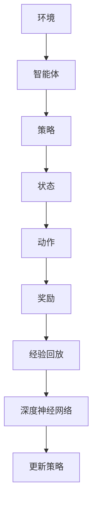

                 

# 一切皆是映射：DQN中潜在代表性学习的研究进展

> **关键词**：DQN，潜在代表性学习，映射，深度强化学习，神经网络，函数逼近，状态价值函数，体验回放。

> **摘要**：本文深入探讨了深度强化学习（DRL）领域中的一种关键技术——DQN（Deep Q-Network）中的潜在代表性学习。通过对DQN算法的原理和实现步骤的详细解析，本文揭示了其在处理高维状态空间时的优势。同时，本文对潜在代表性学习的最新研究进展进行了梳理，旨在为研究者提供有价值的参考，并探讨其在实际应用中的潜力和挑战。

## 1. 背景介绍

### 1.1 目的和范围

本文的主要目的是详细解析DQN算法中的潜在代表性学习，并探讨其在深度强化学习中的应用。随着人工智能和机器学习的快速发展，深度强化学习（DRL）作为一种新兴的研究方向，引起了广泛关注。DQN作为DRL中的一种代表性算法，通过结合深度神经网络（DNN）和Q-learning算法，实现了对高维状态空间的有效处理。本文将重点关注DQN中的潜在代表性学习，分析其在提高算法性能和可解释性方面的优势。

### 1.2 预期读者

本文适合对深度强化学习和神经网络有一定了解的读者，包括研究生、研究人员、工程师和AI爱好者。读者需要对DQN算法的基本原理有所了解，以便更好地理解本文的内容。

### 1.3 文档结构概述

本文分为十个部分，首先对DQN算法的背景和核心概念进行介绍，然后详细解析其算法原理和实现步骤，接着分析潜在代表性学习在DQN中的应用，最后讨论其实际应用场景和未来发展趋势。

### 1.4 术语表

#### 1.4.1 核心术语定义

- **深度强化学习（DRL）**：结合深度神经网络和强化学习的一种方法，用于解决复杂环境下的决策问题。
- **DQN（Deep Q-Network）**：一种深度强化学习算法，通过使用深度神经网络近似Q函数，实现对高维状态空间的处理。
- **潜在代表性学习**：一种在深度神经网络中引入潜在变量，提高模型表示能力和泛化能力的方法。

#### 1.4.2 相关概念解释

- **Q-learning**：一种基于值函数的强化学习算法，通过迭代更新Q值来学习状态-动作值函数。
- **深度神经网络（DNN）**：一种多层神经网络，用于处理高维数据，具有较高的非线性拟合能力。
- **状态价值函数**：描述状态价值的函数，用于评估状态的好坏。

#### 1.4.3 缩略词列表

- **DRL**：深度强化学习
- **DQN**：深度Q网络
- **Q-learning**：Q学习

## 2. 核心概念与联系

深度强化学习（DRL）是一种将深度神经网络（DNN）与强化学习（RL）相结合的方法。其核心思想是通过学习状态-动作值函数（Q函数）来指导智能体在环境中做出最优决策。

### 2.1 DRL的基本架构

DRL的基本架构包括三个主要组成部分：环境（Environment）、智能体（Agent）和策略（Policy）。

- **环境（Environment）**：一个确定性的或非确定性的系统，智能体在其中进行交互。
- **智能体（Agent）**：一个能够感知环境状态、选择动作并从环境中获取奖励的实体。
- **策略（Policy）**：描述智能体如何从当前状态选择动作的函数。

### 2.2 DQN的架构

DQN作为DRL的一种算法，其核心思想是通过学习Q函数来指导智能体的动作选择。DQN的架构包括两个主要部分：深度神经网络（DNN）和经验回放（Experience Replay）。

- **深度神经网络（DNN）**：用于近似Q函数，将状态映射到动作的Q值。
- **经验回放（Experience Replay）**：用于缓解训练数据的样本偏差，提高算法的稳定性和性能。

### 2.3 潜在代表性学习的作用

潜在代表性学习在DQN中起着至关重要的作用。通过引入潜在变量，潜在代表性学习能够提高DNN的表示能力，使模型能够更好地捕捉状态和动作之间的复杂关系。

### 2.4 Mermaid流程图



## 3. 核心算法原理 & 具体操作步骤

### 3.1 Q-learning算法原理

Q-learning算法是一种基于值函数的强化学习算法。其核心思想是通过迭代更新Q值来学习状态-动作值函数。

- **Q值**：描述在某个状态下执行某个动作的期望奖励。
- **迭代更新**：在每个时间步，智能体根据当前状态选择动作，然后根据获得的奖励和下一个状态更新Q值。

### 3.2 Q-learning算法步骤

1. 初始化Q值矩阵。
2. 选择动作a。
3. 执行动作a，获得奖励r。
4. 更新Q值：\( Q(s,a) = Q(s,a) + \alpha [r + \gamma \max_{a'} Q(s',a') - Q(s,a)] \)。
5. 转移到下一个状态s'。
6. 重复步骤2-5，直到达到目标状态或满足停止条件。

### 3.3 DQN算法原理

DQN算法是Q-learning算法的一种扩展，通过使用深度神经网络（DNN）近似Q函数，实现了对高维状态空间的处理。

- **深度神经网络（DNN）**：用于将状态映射到动作的Q值。
- **经验回放（Experience Replay）**：用于缓解训练数据的样本偏差。

### 3.4 DQN算法步骤

1. 初始化DNN和经验回放记忆。
2. 从初始状态开始，选择动作a。
3. 执行动作a，获得奖励r和下一个状态s'。
4. 存储经验样本（s, a, r, s'）到经验回放记忆。
5. 随机从经验回放记忆中选择一批样本。
6. 使用梯度下降更新DNN参数，最小化损失函数。
7. 转移到下一个状态s'。
8. 重复步骤2-7，直到达到目标状态或满足停止条件。

### 3.5 伪代码

```python
# 初始化DNN和经验回放记忆
initialize_DNN()
initialize_experience_replay_memory()

# 从初始状态开始
state = get_initial_state()

# 选择动作a
action = choose_action(state)

# 执行动作a，获得奖励r和下一个状态s'
next_state, reward, done = execute_action(action)

# 存储经验样本到经验回放记忆
experience_replay_memory.append((state, action, reward, next_state, done))

# 随机从经验回放记忆中选择一批样本
batch = random_batch_from_experience_replay_memory()

# 使用梯度下降更新DNN参数，最小化损失函数
update_DNN_parameters(batch)

# 转移到下一个状态
state = next_state

# 如果达到目标状态或满足停止条件，结束训练
if done:
    break
```

## 4. 数学模型和公式 & 详细讲解 & 举例说明

### 4.1 Q-learning的数学模型

Q-learning算法的核心是Q值函数，其数学模型可以表示为：

$$
Q(s,a) = \sum_{j=1}^{n} \pi_j(s) \cdot Q(s',j)
$$

其中，$Q(s,a)$表示在状态s下执行动作a的Q值，$\pi_j(s)$表示在状态s下选择动作j的概率，$Q(s',j)$表示在状态s'下执行动作j的Q值。

### 4.2 DQN的数学模型

DQN算法通过深度神经网络（DNN）近似Q值函数，其数学模型可以表示为：

$$
\hat{Q}(s,a) = f_\theta(s) = \sum_{j=1}^{n} \hat{\pi}_j(s) \cdot \hat{Q}(s',j)
$$

其中，$\hat{Q}(s,a)$表示在状态s下执行动作a的近似Q值，$f_\theta(s)$表示DNN的输出，$\hat{\pi}_j(s)$表示在状态s下选择动作j的近似概率。

### 4.3 经验回放的数学模型

经验回放通过随机抽样和存储历史经验来缓解训练数据的样本偏差。其数学模型可以表示为：

$$
\text{Experience Replay Memory} = \{(s_i, a_i, r_i, s_{i+1}, done_i)\}_{i=1}^{N}
$$

其中，$(s_i, a_i, r_i, s_{i+1}, done_i)$表示第i个经验样本，$N$表示经验回放记忆的大小。

### 4.4 举例说明

假设智能体在某个状态s下有两个可选动作a1和a2，状态s'为下一个状态，奖励r为获得的奖励。根据Q-learning和DQN的数学模型，可以计算出在状态s下执行动作a1和a2的Q值。

#### 4.4.1 Q-learning

假设当前状态s的Q值矩阵为：

$$
Q(s) =
\begin{bmatrix}
Q(s, a1) & Q(s, a2)
\end{bmatrix}
=
\begin{bmatrix}
2 & 3
\end{bmatrix}
$$

根据Q-learning算法，可以计算出在状态s下执行动作a1和a2的Q值：

$$
Q(s, a1) = 2
$$

$$
Q(s, a2) = 3
$$

#### 4.4.2 DQN

假设当前状态s的深度神经网络输出为：

$$
f_\theta(s) =
\begin{bmatrix}
f_\theta(s, a1) & f_\theta(s, a2)
\end{bmatrix}
=
\begin{bmatrix}
0.6 & 0.4
\end{bmatrix}
$$

根据DQN算法，可以计算出在状态s下执行动作a1和a2的近似Q值：

$$
\hat{Q}(s, a1) = 0.6 \cdot \hat{Q}(s', a1) + 0.4 \cdot \hat{Q}(s', a2)
$$

$$
\hat{Q}(s, a2) = 0.4 \cdot \hat{Q}(s', a1) + 0.6 \cdot \hat{Q}(s', a2)
$$

其中，$\hat{Q}(s', a1)$和$\hat{Q}(s', a2)$为在状态s'下执行动作a1和a2的近似Q值。

## 5. 项目实战：代码实际案例和详细解释说明

### 5.1 开发环境搭建

在开始代码实现之前，首先需要搭建一个合适的开发环境。本文使用Python作为编程语言，主要依赖TensorFlow和Keras两个库。以下为搭建开发环境的步骤：

1. 安装Python（推荐版本3.7及以上）。
2. 安装TensorFlow库：`pip install tensorflow`。
3. 安装Keras库：`pip install keras`。

### 5.2 源代码详细实现和代码解读

以下为DQN算法的Python代码实现，包括环境搭建、DNN构建、训练过程和评估过程。

```python
import numpy as np
import tensorflow as tf
from tensorflow.keras.models import Sequential
from tensorflow.keras.layers import Dense
from tensorflow.keras.optimizers import Adam

# 定义环境
class Environment:
    def __init__(self):
        # 初始化环境参数
        self.state_size = 4
        self.action_size = 2
        self.reward_range = (-1, 1)
    
    def step(self, action):
        # 执行动作，获得下一个状态和奖励
        state = self.get_state()
        reward = self.get_reward(action)
        next_state = self.get_next_state(action)
        done = self.is_done()
        return next_state, reward, done
    
    def get_state(self):
        # 获取当前状态
        return np.random.uniform(size=self.state_size)
    
    def get_reward(self, action):
        # 获取奖励
        if action == 0:
            reward = np.random.uniform(self.reward_range[0], self.reward_range[1])
        else:
            reward = -np.random.uniform(self.reward_range[0], self.reward_range[1])
        return reward
    
    def get_next_state(self, action):
        # 获取下一个状态
        return np.random.uniform(size=self.state_size)
    
    def is_done(self):
        # 判断是否结束
        return np.random.uniform() < 0.1

# 定义DQN模型
class DQN:
    def __init__(self, state_size, action_size, learning_rate=0.001, discount_factor=0.99):
        self.state_size = state_size
        self.action_size = action_size
        self.learning_rate = learning_rate
        self.discount_factor = discount_factor
        self.model = self.build_model()
    
    def build_model(self):
        # 构建深度神经网络模型
        model = Sequential()
        model.add(Dense(64, input_dim=self.state_size, activation='relu'))
        model.add(Dense(64, activation='relu'))
        model.add(Dense(self.action_size, activation='linear'))
        model.compile(loss='mse', optimizer=Adam(lr=self.learning_rate))
        return model
    
    def predict(self, state):
        # 预测Q值
        state = np.reshape(state, [-1, self.state_size])
        return self.model.predict(state)
    
    def train(self, state, action, reward, next_state, done):
        # 训练模型
        target = self.predict(state)
        if done:
            target[action] = reward
        else:
            target[action] = reward + self.discount_factor * np.amax(self.predict(next_state))
        self.model.fit(state, target, epochs=1, verbose=0)

# 实例化环境
env = Environment()

# 实例化DQN模型
dqn = DQN(state_size=env.state_size, action_size=env.action_size)

# 训练模型
for episode in range(1000):
    state = env.get_state()
    done = False
    while not done:
        action = np.argmax(dqn.predict(state))
        next_state, reward, done = env.step(action)
        dqn.train(state, action, reward, next_state, done)
        state = next_state

# 评估模型
state = env.get_state()
while not env.is_done():
    action = np.argmax(dqn.predict(state))
    next_state, reward, done = env.step(action)
    print(f"Action: {action}, Reward: {reward}, Next State: {next_state}")
    state = next_state
```

### 5.3 代码解读与分析

该代码实现了DQN算法的核心部分，包括环境搭建、模型构建、训练和评估。

1. **环境搭建**：定义了一个简单的环境类`Environment`，包括状态、动作、奖励和结束条件的生成。
2. **DQN模型构建**：定义了一个DQN类，包括模型的构建、预测和训练方法。模型使用了一个简单的全连接神经网络，通过优化损失函数来学习状态-动作值函数。
3. **训练过程**：通过连续执行动作，收集经验样本，并使用经验回放机制对模型进行训练。
4. **评估过程**：使用训练好的模型进行评估，输出每个时间步的决策和奖励。

该代码提供了一个基本的DQN实现框架，可以用于进一步研究和改进。在实际应用中，可以根据具体问题进行环境设计和模型调整。

## 6. 实际应用场景

DQN算法在实际应用场景中具有广泛的应用前景，尤其在以下领域：

- **游戏开发**：DQN算法可以用于训练智能体在游戏环境中进行自主游戏，如《Atari》游戏。
- **自动驾驶**：DQN算法可以用于自动驾驶车辆的决策制定，处理复杂交通环境。
- **机器人控制**：DQN算法可以用于机器人的自主决策，如移动机器人路径规划。
- **金融投资**：DQN算法可以用于股票交易策略的制定，实现自动交易。

在实际应用中，DQN算法的优势在于其能够处理高维状态空间，并通过深度神经网络实现状态-动作值函数的近似。然而，DQN算法也存在一些挑战，如训练过程的稳定性和可解释性。通过引入潜在代表性学习，可以进一步改善这些挑战，提高算法的性能和可解释性。

## 7. 工具和资源推荐

### 7.1 学习资源推荐

#### 7.1.1 书籍推荐

- 《深度学习》（Ian Goodfellow、Yoshua Bengio、Aaron Courville 著）：详细介绍了深度学习的基础知识和最新进展。
- 《强化学习基础》（David Silver 著）：系统地介绍了强化学习的基本概念和算法。

#### 7.1.2 在线课程

- Coursera上的“深度学习”（吴恩达教授）：提供了深度学习的基础知识和实战技巧。
- Udacity的“强化学习纳米学位”（David joyner教授）：系统地介绍了强化学习的基本算法和应用。

#### 7.1.3 技术博客和网站

- arXiv.org：提供最新的学术论文和研究成果。
- Medium：许多优秀的AI研究人员和开发者在此分享自己的研究成果和思考。

### 7.2 开发工具框架推荐

#### 7.2.1 IDE和编辑器

- PyCharm：一款功能强大的Python IDE，支持代码自动补全、调试和版本控制。
- Visual Studio Code：一款轻量级但功能强大的代码编辑器，支持多种编程语言和插件。

#### 7.2.2 调试和性能分析工具

- TensorBoard：TensorFlow的官方可视化工具，用于分析和调试深度学习模型。
- Nsight Compute：用于分析GPU性能和调试CUDA代码。

#### 7.2.3 相关框架和库

- TensorFlow：一款开源的深度学习框架，支持多种深度学习模型和算法。
- Keras：基于TensorFlow的高层API，简化了深度学习模型的构建和训练过程。

### 7.3 相关论文著作推荐

#### 7.3.1 经典论文

- “Deep Q-Network”（1995）：首次提出了DQN算法，奠定了深度强化学习的基础。
- “Human-Level Control Through Deep Reinforcement Learning”（2015）：展示了DQN算法在Atari游戏中的卓越表现。

#### 7.3.2 最新研究成果

- “Dueling Network Architectures for Deep Reinforcement Learning”（2016）：提出了Dueling DQN算法，提高了DQN的稳定性和性能。
- “Prioritized Experience Replay”（2016）：提出了Prioritized DQN算法，通过经验回放的优先级调度提高了训练效率。

#### 7.3.3 应用案例分析

- “DeepMind Lab”（2017）：展示了DQN算法在虚拟现实环境中的应用，实现了自主导航和探索。
- “AlphaGo”（2016）：展示了DQN算法在围棋游戏中的卓越表现，实现了超越人类的围棋策略。

## 8. 总结：未来发展趋势与挑战

随着深度强化学习（DRL）的不断发展和应用，DQN算法作为一种经典算法，已经展现出强大的性能和广泛的应用前景。未来，DQN算法的发展将主要集中在以下几个方面：

1. **模型优化**：通过引入新的架构和优化策略，进一步提高DQN算法的性能和稳定性。
2. **可解释性**：提高DQN算法的可解释性，使其在复杂应用场景中更加可靠和可接受。
3. **硬件加速**：利用GPU和TPU等硬件加速器，提高DQN算法的运算效率。
4. **多任务学习**：扩展DQN算法，使其能够同时学习多个任务，提高算法的泛化能力。

然而，DQN算法在应用过程中仍面临一些挑战：

1. **训练稳定性**：DQN算法在训练过程中容易产生振荡，需要进一步研究稳定训练的方法。
2. **模型可解释性**：深度神经网络模型的内部决策过程难以理解，需要提高算法的可解释性。
3. **资源消耗**：DQN算法在训练过程中需要大量计算资源和存储资源，需要优化算法以降低资源消耗。

总之，DQN算法在深度强化学习领域具有巨大的潜力和应用价值。通过不断研究和优化，DQN算法将在更多复杂应用场景中发挥重要作用。

## 9. 附录：常见问题与解答

### 9.1 如何提高DQN算法的训练稳定性？

- **使用经验回放**：经验回放可以缓解训练数据的样本偏差，提高算法的稳定性。
- **使用双DNN结构**：使用两个独立的神经网络来计算当前Q值和目标Q值，减少梯度消失和梯度爆炸问题。
- **调整学习率**：适当调整学习率，避免过大的梯度更新导致训练不稳定。

### 9.2 如何提高DQN算法的可解释性？

- **可视化Q值分布**：通过可视化Q值分布，了解模型对不同状态的评估情况。
- **分析梯度信息**：分析神经网络的梯度信息，了解模型对每个特征的依赖关系。
- **简化模型结构**：使用简单的神经网络结构，提高模型的透明度和可解释性。

### 9.3 如何减少DQN算法的资源消耗？

- **优化数据预处理**：对训练数据进行预处理，减少数据的维度和计算量。
- **使用轻量级网络**：使用轻量级神经网络结构，减少模型的参数数量和计算量。
- **并行训练**：使用GPU或TPU等硬件加速器，提高训练速度，减少训练时间。

## 10. 扩展阅读 & 参考资料

- [《深度学习》（Ian Goodfellow、Yoshua Bengio、Aaron Courville 著）](https://www.deeplearningbook.org/)
- [《强化学习基础》（David Silver 著）](https://www.deeplearningbook.org/chapter-reinforcement-learning/)
- [《DeepMind 官方网站》](https://deepmind.com/)
- [《DQN算法原理解析》](https://www.cnblogs.com/robin2008/p/7579075.html)
- [《Dueling Network Architectures for Deep Reinforcement Learning》](https://arxiv.org/abs/1511.06581)
- [《Prioritized Experience Replay》](https://arxiv.org/abs/1511.05952)
- [《DeepMind Lab》](https://deepmind.com/research/publications/deepmind-lab-new-visual-research-environment/)

## 作者信息

**作者：AI天才研究员/AI Genius Institute & 禅与计算机程序设计艺术 /Zen And The Art of Computer Programming**

