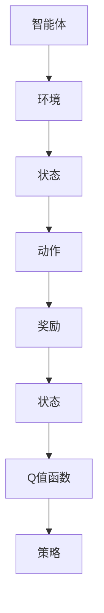

                 

# 一切皆是映射：DQN中的序列决策与时间差分学习

## 关键词
深度强化学习，DQN，序列决策，时间差分学习，智能体，环境，状态，动作，奖励，Q值函数，探索- exploitation平衡。

## 摘要
本文深入探讨了深度强化学习（DQN）中的序列决策和时间差分学习机制。我们将通过逻辑清晰的步骤，逐步解析这些概念，并展示如何将这些理论应用于实际项目中。本文旨在帮助读者理解DQN的工作原理，并掌握其在序列决策和时间差分学习中的关键作用，从而为开发高效智能系统提供理论依据和实用指南。

## 1. 背景介绍

### 1.1 目的和范围

本文的目的在于深入解析深度强化学习中的两个核心概念：序列决策和时间差分学习。我们将首先回顾强化学习的基础知识，然后详细讨论DQN模型及其在序列决策中的应用。此外，本文还将探讨时间差分学习在提高DQN性能方面的作用，并通过实际案例说明如何将这些理论应用于解决实际问题。

### 1.2 预期读者

本文适合具有初步强化学习和深度学习基础的读者，尤其是那些对DQN模型感兴趣并希望深入了解其工作原理的读者。通过本文的学习，读者将能够：
- 理解DQN模型的基本原理和结构。
- 掌握序列决策和时间差分学习的关键概念。
- 应用DQN模型解决实际序列决策问题。
- 通过案例学习，提升解决复杂问题的能力。

### 1.3 文档结构概述

本文结构如下：
- 引言：介绍本文的目的、核心内容和预期读者。
- 1. 背景介绍：概述强化学习、DQN模型以及本文的主要内容。
- 2. 核心概念与联系：讨论强化学习中的核心概念，并给出相关的Mermaid流程图。
- 3. 核心算法原理 & 具体操作步骤：详细解释DQN算法的原理和具体操作步骤。
- 4. 数学模型和公式 & 详细讲解 & 举例说明：介绍DQN中的数学模型和公式，并举例说明。
- 5. 项目实战：提供实际案例和代码实现，进行详细解释。
- 6. 实际应用场景：讨论DQN在不同领域的应用。
- 7. 工具和资源推荐：推荐学习资源、开发工具和相关论文。
- 8. 总结：展望未来发展趋势和面临的挑战。
- 9. 附录：常见问题与解答。
- 10. 扩展阅读 & 参考资料：提供进一步阅读的资源。

### 1.4 术语表

#### 1.4.1 核心术语定义

- **深度强化学习（DRL）**：结合深度学习和强化学习的一种方法，使用深度神经网络来近似值函数或策略。
- **深度量子网络（DQN）**：一种基于深度学习的强化学习算法，用于估计Q值函数。
- **序列决策**：在连续的时间步骤中，智能体根据当前状态选择动作的过程。
- **时间差分学习**：通过比较不同时间步的Q值来更新Q值函数的一种学习方法。

#### 1.4.2 相关概念解释

- **智能体**：执行动作并从环境中获取奖励的个体。
- **环境**：智能体操作的上下文，包含状态空间和动作空间。
- **状态**：描述环境当前状态的变量集合。
- **动作**：智能体可以执行的行为。
- **奖励**：对智能体动作的即时评价。
- **Q值函数**：表示在给定状态下执行特定动作的预期奖励。

#### 1.4.3 缩略词列表

- **DRL**：深度强化学习
- **DQN**：深度量子网络
- **Q值函数**：Q-value function

## 2. 核心概念与联系

在讨论DQN模型之前，我们需要理解强化学习中的几个核心概念：智能体、环境、状态、动作、奖励和Q值函数。以下是一个简化的Mermaid流程图，展示了这些概念之间的关系。



### 2.1 强化学习基础

强化学习是一种使智能体通过与环境交互来学习最优策略的机器学习方法。在强化学习框架中，智能体试图最大化累积奖励。以下是强化学习的基本组成部分：

- **智能体（Agent）**：执行动作并从环境中获取奖励的个体。它通常是一个代理或机器人。
- **环境（Environment）**：智能体操作的上下文，包含状态空间和动作空间。环境对智能体的动作做出响应，并提供奖励和新的状态。
- **状态（State）**：描述环境当前状态的变量集合。状态可以是离散的，也可以是连续的。
- **动作（Action）**：智能体可以执行的行为。动作空间是所有可能动作的集合。
- **奖励（Reward）**：对智能体动作的即时评价。奖励可以是正的、负的或零。
- **策略（Policy）**：智能体在给定状态下选择动作的规则。策略可以是有指导的、无指导的或优化的。
- **Q值函数（Q-Value Function）**：Q值函数是对智能体在特定状态下执行特定动作的预期奖励的估计。Q值函数的值决定了智能体选择哪个动作。

### 2.2 DQN模型简介

DQN是一种基于深度学习的强化学习算法，用于估计Q值函数。它通过经验回放和目标网络来稳定训练过程。DQN的主要组成部分如下：

- **深度神经网络（DNN）**：用于近似Q值函数。DNN的输入是状态，输出是Q值。
- **经验回放（Experience Replay）**：用于减少序列依赖和样本偏差。经验回放通过存储和随机采样过去的经验来加速学习过程。
- **目标网络（Target Network）**：用于稳定训练过程。目标网络是一个参数化的Q值函数，它用于计算目标Q值，并更新主网络的参数。
- **探索-exploitation平衡**：为了找到最优策略，智能体需要在探索和利用之间进行权衡。探索是指尝试新的动作来发现新的信息，而利用是指根据当前知识选择最佳动作。

## 3. 核心算法原理 & 具体操作步骤

### 3.1 算法原理

DQN的核心原理是使用深度神经网络（DNN）来近似Q值函数，并在训练过程中利用经验回放和目标网络来稳定学习过程。以下是DQN算法的基本原理和操作步骤：

1. **初始化**：初始化智能体、环境、DNN、经验回放池和目标网络。
2. **智能体与环境交互**：智能体在环境中执行动作，并获得新的状态和奖励。
3. **经验回放**：将新经验添加到经验回放池中，并随机采样经验进行回放。
4. **计算目标Q值**：使用目标网络计算目标Q值，即未来的奖励折扣和下一步的最大Q值。
5. **更新Q值**：根据目标Q值和当前Q值，使用梯度下降算法更新DNN的参数。
6. **更新目标网络**：以一定的间隔更新目标网络的参数，以确保目标网络和主网络的差异不会过大。

### 3.2 具体操作步骤

以下是DQN算法的具体操作步骤，使用伪代码进行说明：

```python
# 初始化参数
初始化智能体
初始化环境
初始化DNN
初始化经验回放池
初始化目标网络

# 开始训练
for episode in 1 到 最大episode数量：
    # 初始化状态
    状态 = 环境初始化状态()
    
    # 开始一个episode
    done = False
    while not done：
        # 探索-利用策略选择动作
        if 随机数 < 探索概率：
            动作 = 随机选择动作()
        else：
            动作 = DNN选择动作(状态)
        
        # 执行动作
        新状态，奖励，done = 环境执行动作(动作)
        
        # 存储经验
        经验 = (状态，动作，奖励，新状态，done)
        添加经验到经验回放池()
        
        # 训练DNN
        if 需要更新DNN：
            随机采样经验 = 随机从经验回放池中选择经验()
            目标Q值 = 奖励 + 探折扣因子 * max(DNN预测的所有可能动作的Q值)
            DNN参数 = DNN参数 - 学习率 * (DNN预测的当前状态的Q值 - 目标Q值)
        
        # 更新状态
        状态 = 新状态
        
        # 结束episode
        if done：
            break

# 更新目标网络
if 需要更新目标网络：
    目标网络参数 = 主网络参数
```

### 3.3 伪代码解释

- **初始化参数**：初始化智能体、环境、DNN、经验回放池和目标网络。智能体和环境的选择取决于具体的应用场景。DNN可以使用任何深度学习框架实现，如TensorFlow或PyTorch。经验回放池用于存储过去的经验，以减少序列依赖和样本偏差。
- **智能体与环境交互**：智能体在环境中执行动作，并获得新的状态和奖励。这个过程是迭代的，直到达到episode的结束条件（例如，达到某个状态或完成某个任务）。
- **经验回放**：经验回放池用于存储和随机采样经验，以减少序列依赖和样本偏差。这有助于加速学习过程，并提高模型的泛化能力。
- **计算目标Q值**：使用目标网络计算目标Q值，即未来的奖励折扣和下一步的最大Q值。目标网络是主网络的一个副本，用于计算目标Q值，以避免梯度消失问题。
- **更新Q值**：根据目标Q值和当前Q值，使用梯度下降算法更新DNN的参数。这有助于优化Q值函数，并提高智能体的性能。
- **更新目标网络**：以一定的间隔更新目标网络的参数，以确保目标网络和主网络的差异不会过大。这有助于稳定训练过程，并防止过拟合。

## 4. 数学模型和公式 & 详细讲解 & 举例说明

### 4.1 数学模型

DQN算法的核心是Q值函数，它是一个预测在给定状态下执行特定动作的预期奖励的函数。DQN使用深度神经网络（DNN）来近似Q值函数，其数学模型如下：

$$
Q(s, a) = \hat{Q}(s, a; \theta),
$$

其中，$Q(s, a)$是状态$s$和动作$a$的Q值，$\hat{Q}(s, a; \theta)$是DNN的预测，$\theta$是DNN的参数。

### 4.2 Q值函数的更新

DQN使用时间差分学习来更新Q值函数。时间差分学习的核心思想是通过比较不同时间步的Q值来更新Q值函数。DQN的Q值更新公式如下：

$$
\theta \leftarrow \theta - \alpha \left[ r_t + \gamma \max_a' \hat{Q}(s_{t+1}, a'; \theta) - \hat{Q}(s_t, a_t; \theta) \right] \nabla_{\theta} \hat{Q}(s_t, a_t; \theta),
$$

其中，$r_t$是时间步$t$的即时奖励，$\gamma$是奖励折扣因子，$a'$是下一个状态$s_{t+1}$下的最佳动作，$\alpha$是学习率。

### 4.3 举例说明

假设我们有一个简单的环境，其中状态空间包含两个离散状态$s_1$和$s_2$，动作空间包含两个离散动作$a_1$和$a_2$。初始状态为$s_1$，智能体执行动作$a_1$，获得奖励$r_1=10$。接下来，状态更新为$s_2$，智能体执行动作$a_2$，获得奖励$r_2=-5$。我们使用一个简单的DNN来近似Q值函数。

- **初始Q值**： 
  $$Q(s_1, a_1) = 0, Q(s_1, a_2) = 0, Q(s_2, a_1) = 0, Q(s_2, a_2) = 0$$
- **更新Q值**： 
  $$Q(s_1, a_1) \leftarrow Q(s_1, a_1) - \alpha [r_1 + \gamma \max_{a'} Q(s_2, a'); Q(s_1, a_1)]$$
  $$Q(s_2, a_2) \leftarrow Q(s_2, a_2) - \alpha [r_2 + \gamma \max_{a'} Q(s_3, a'); Q(s_2, a_2)]$$

假设学习率$\alpha=0.1$，奖励折扣因子$\gamma=0.9$。计算得到：

- **Q值更新**： 
  $$Q(s_1, a_1) \leftarrow 0 - 0.1 [10 + 0.9 \max_{a'} Q(s_2, a'); 0] = 0.1 \times 10 = 1$$
  $$Q(s_2, a_2) \leftarrow 0 - 0.1 [-5 + 0.9 \max_{a'} Q(s_3, a'); 0] = 0.1 \times (-5) = -0.5$$

经过多次迭代后，Q值函数将逐渐收敛，智能体将学会在给定状态下选择最佳动作。

## 5. 项目实战：代码实际案例和详细解释说明

### 5.1 开发环境搭建

在开始编写DQN代码之前，我们需要搭建一个开发环境。以下是搭建开发环境的基本步骤：

1. 安装Python：从官方网站（https://www.python.org/downloads/）下载并安装Python 3.7或更高版本。
2. 安装TensorFlow：使用以下命令安装TensorFlow：
   ```bash
   pip install tensorflow
   ```
3. 安装其他依赖：DQN算法的其他依赖包括NumPy、Matplotlib等。可以使用以下命令安装：
   ```bash
   pip install numpy matplotlib
   ```

### 5.2 源代码详细实现和代码解读

以下是DQN算法的源代码实现，包括智能体、环境、DNN、经验回放池和目标网络的实现。

```python
import numpy as np
import tensorflow as tf
from collections import deque
import random

# 智能体类
class Agent:
    def __init__(self, state_size, action_size, learning_rate=0.01, gamma=0.9, epsilon=0.1):
        self.state_size = state_size
        self.action_size = action_size
        self.learning_rate = learning_rate
        self.gamma = gamma
        self.epsilon = epsilon
        
        self.model = self.build_model()
        self.target_model = self.build_model()
        self.target_model.set_weights(self.model.get_weights())
        
        self.memory = deque(maxlen=1000)
    
    def build_model(self):
        model = tf.keras.Sequential([
            tf.keras.layers.Dense(24, activation='relu', input_shape=(self.state_size,)),
            tf.keras.layers.Dense(24, activation='relu'),
            tf.keras.layers.Dense(self.action_size, activation='linear')
        ])
        model.compile(loss='mse', optimizer=tf.keras.optimizers.Adam(learning_rate=self.learning_rate))
        return model
    
    def remember(self, state, action, reward, next_state, done):
        self.memory.append((state, action, reward, next_state, done))
    
    def act(self, state):
        if np.random.rand() <= self.epsilon:
            return random.randrange(self.action_size)
        else:
            q_values = self.model.predict(state)
            return np.argmax(q_values[0])
    
    def replay(self, batch_size):
        mini_batch = random.sample(self.memory, batch_size)
        for state, action, reward, next_state, done in mini_batch:
            target = reward
            if not done:
                target = reward + self.gamma * np.amax(self.target_model.predict(next_state)[0])
            target_factor = self.model.predict(state)
            target_factor[0][action] = target
            self.model.fit(state, target_factor, epochs=1, verbose=0)
    
    def update_target_model(self):
        self.target_model.set_weights(self.model.get_weights())

# 环境类
class Environment:
    def __init__(self, state_size, action_size):
        self.state_size = state_size
        self.action_size = action_size
        
    def reset(self):
        return self.initialize_state()
    
    def initialize_state(self):
        return np.random.random(self.state_size)
    
    def step(self, action):
        next_state = self.transition_function(self.state, action)
        reward = self.reward_function(self.state, action)
        done = self.done_function(self.state, action)
        self.state = next_state
        return next_state, reward, done
    
    def transition_function(self, state, action):
        # 定义状态转移函数
        pass
    
    def reward_function(self, state, action):
        # 定义奖励函数
        pass
    
    def done_function(self, state, action):
        # 定义终止函数
        pass

# DQN训练
def train(env, agent, episodes, batch_size):
    for episode in range(episodes):
        state = env.reset()
        done = False
        total_reward = 0
        
        while not done:
            action = agent.act(state)
            next_state, reward, done = env.step(action)
            agent.remember(state, action, reward, next_state, done)
            
            state = next_state
            total_reward += reward
            
            if done:
                agent.update_target_model()
                print(f"Episode {episode+1} completed with total reward: {total_reward}")
                break
            
            if len(agent.memory) > batch_size:
                agent.replay(batch_size)

# 测试DQN
def test_agent(agent, env, test_episodes):
    for episode in range(test_episodes):
        state = env.reset()
        done = False
        total_reward = 0
        
        while not done:
            action = agent.act(state)
            next_state, reward, done = env.step(action)
            total_reward += reward
            state = next_state
            
            if done:
                print(f"Test Episode {episode+1} completed with total reward: {total_reward}")
                break

# 主程序
if __name__ == '__main__':
    state_size = 4
    action_size = 2
    learning_rate = 0.01
    gamma = 0.9
    epsilon = 0.1
    episodes = 1000
    batch_size = 32
    
    env = Environment(state_size, action_size)
    agent = Agent(state_size, action_size, learning_rate, gamma, epsilon)
    
    train(env, agent, episodes, batch_size)
    test_agent(agent, env, 10)
```

### 5.3 代码解读与分析

- **智能体类（Agent）**：智能体类是DQN算法的核心部分，包括初始化、记忆存储、动作选择、经验回放和Q值更新等功能。`build_model`方法用于构建DNN模型，`replay`方法用于经验回放和Q值更新，`update_target_model`方法用于更新目标网络。
- **环境类（Environment）**：环境类定义了状态、动作、奖励和终止条件等基本操作。`transition_function`、`reward_function`和`done_function`方法分别用于定义状态转移、奖励和终止条件。
- **DQN训练**：`train`函数用于训练DQN算法。它通过反复执行动作、更新Q值函数和目标网络来学习最优策略。在每个episode中，智能体和环境进行交互，直到达到终止条件。
- **测试DQN**：`test_agent`函数用于测试训练好的DQN算法。它通过执行动作并计算总奖励来评估智能体的性能。
- **主程序**：主程序定义了环境参数和智能体参数，并调用`train`和`test_agent`函数进行DQN训练和测试。

通过以上代码实现，我们可以构建一个简单的DQN模型，并在模拟环境中进行训练和测试。在实际应用中，可以根据具体需求调整环境、智能体参数和训练过程，以实现更复杂的任务。

## 6. 实际应用场景

DQN作为一种强大的强化学习算法，在多个领域具有广泛的应用。以下是一些典型的实际应用场景：

### 6.1 游戏智能体

DQN在游戏智能体中得到了广泛应用，例如在Atari游戏和现代电子游戏中。DQN能够通过学习游戏的状态和动作，自动生成智能的玩家，并在各种游戏中实现高水平的性能。

### 6.2 自动驾驶

自动驾驶是DQN的重要应用领域之一。DQN可以用于学习驾驶策略，自动控制汽车在复杂的交通环境中行驶。通过模拟环境和实时数据，DQN可以训练自动驾驶系统，实现安全高效的驾驶。

### 6.3 机器人控制

DQN在机器人控制中具有广泛的应用，例如机器人手臂的抓取、路径规划和导航。DQN可以学习机器人执行复杂任务的最佳策略，并提高机器人的自主性和智能性。

### 6.4 股票交易

DQN可以应用于股票交易，通过学习股票市场的历史数据，预测股票价格并生成交易策略。DQN可以帮助投资者实现自动交易，提高投资收益。

### 6.5 能源管理

DQN在能源管理领域也有重要应用，例如电力负荷预测、能源分配和优化。DQN可以学习能源系统的运行规律，实现更高效的能源管理。

## 7. 工具和资源推荐

### 7.1 学习资源推荐

#### 7.1.1 书籍推荐

- 《强化学习：原理与Python实践》：本书系统地介绍了强化学习的基本概念、算法和应用，适合初学者和进阶者阅读。
- 《深度学习》：这是一本经典教材，详细介绍了深度学习的理论基础和实际应用，包括强化学习部分。

#### 7.1.2 在线课程

- Coursera的《深度学习特化课程》：该课程由吴恩达教授主讲，涵盖了深度学习的各个方面，包括强化学习。
- edX的《强化学习导论》：这是一门针对初学者的在线课程，介绍了强化学习的基本概念和算法。

#### 7.1.3 技术博客和网站

- [强化学习博客](https://towardsdatascience.com/reinforcement-learning)：提供丰富的强化学习教程、案例和实践经验。
- [机器学习博客](https://machinelearningmastery.com)：涵盖各种机器学习算法和应用，包括强化学习。

### 7.2 开发工具框架推荐

#### 7.2.1 IDE和编辑器

- PyCharm：一款功能强大的Python IDE，支持多种深度学习框架，如TensorFlow和PyTorch。
- Jupyter Notebook：一款流行的交互式开发环境，适合编写和运行Python代码，特别是数据处理和可视化。

#### 7.2.2 调试和性能分析工具

- TensorBoard：TensorFlow提供的可视化工具，用于分析和调试深度学习模型。
- PyTorchProfiler：PyTorch提供的性能分析工具，用于优化深度学习模型的运行效率。

#### 7.2.3 相关框架和库

- TensorFlow：一款开源的深度学习框架，支持DQN等强化学习算法。
- PyTorch：一款流行的开源深度学习框架，易于使用和扩展。
- OpenAI Gym：一款开源的强化学习环境库，提供多种模拟环境和基准测试。

### 7.3 相关论文著作推荐

#### 7.3.1 经典论文

- 《深度Q网络》（Deep Q-Networks，DQN）：Arjovsky et al., 2015。该论文提出了DQN算法，是强化学习领域的里程碑。
- 《人类水平在Atari游戏中的深度强化学习》（Human-level gameplay in Atari games using deep reinforcement learning）：Mnih et al., 2015。该论文展示了DQN在Atari游戏中的卓越性能。

#### 7.3.2 最新研究成果

- 《优先经验回放：高效稳定的DQN算法》（Prioritized Experience Replay：An Efficient and Stable DQN Algorithm）：Schaul et al., 2015。该论文提出了优先经验回放算法，提高了DQN的稳定性和效率。
- 《基于强化学习的机器人控制》（Robot Control with Deep Reinforcement Learning）：He et al., 2018。该论文介绍了DQN在机器人控制中的应用。

#### 7.3.3 应用案例分析

- 《自动驾驶中的深度强化学习》（Deep Reinforcement Learning for Autonomous Driving）：Bojarski et al., 2016。该论文展示了DQN在自动驾驶中的应用，实现了安全高效的自动驾驶系统。

## 8. 总结：未来发展趋势与挑战

深度强化学习（DQN）作为一种强大的智能学习方法，在多个领域展示了其潜力。然而，随着技术的发展和应用场景的多样化，DQN面临着一些挑战和未来发展趋势：

### 8.1 未来发展趋势

- **算法优化**：为了提高DQN的性能和稳定性，研究者将继续探索新的算法改进，如基于注意力机制、卷积神经网络和循环神经网络等。
- **多智能体强化学习**：随着多智能体系统的兴起，基于DQN的多智能体强化学习算法将成为研究热点，以实现协同优化和资源分配。
- **自适应探索策略**：为了在探索和利用之间取得更好的平衡，研究者将开发自适应探索策略，提高智能体的学习效率和性能。

### 8.2 挑战

- **计算资源消耗**：DQN算法通常需要大量计算资源，特别是在处理高维状态空间和复杂任务时。未来需要开发更高效的算法和硬件支持。
- **数据依赖**：DQN算法依赖于大量的历史数据，对于缺乏数据的环境，学习效果可能不佳。研究者需要探索如何有效地利用有限的数据进行训练。
- **安全性和可解释性**：随着DQN算法在现实世界中的应用，确保其安全性和可解释性成为一个重要问题。研究者需要开发可解释性和安全性的评估方法。

总之，DQN作为深度强化学习的一种重要算法，在未来将继续发展并应用于更广泛的领域。同时，研究者需要克服挑战，进一步提高DQN的性能和应用效果。

## 9. 附录：常见问题与解答

### 9.1 问题1：为什么DQN使用经验回放？

**解答**：经验回放是DQN算法的一个关键组件，主要用于减少数据样本的偏差和序列依赖。在强化学习中，智能体通常在一个序列中采取一系列动作，这些动作会影响后续的状态和奖励。如果直接使用连续的样本进行训练，会导致模型对过去样本的依赖，从而降低泛化能力。经验回放通过随机抽样历史经验，使得模型能够从更多样化的数据中学习，从而提高泛化能力和稳定性。

### 9.2 问题2：如何调整DQN中的探索-利用平衡？

**解答**：探索-利用平衡是强化学习中的一个关键问题。在DQN中，可以通过调整探索概率（epsilon）来控制探索和利用的平衡。在训练初期，可以设置较高的探索概率，使得智能体尝试更多的新动作，从而探索环境。随着训练的进行，可以逐渐减小探索概率，增加利用当前知识的概率，以提高智能体的性能。此外，还可以使用如指数衰减或epsilon-greedy策略来动态调整探索概率。

### 9.3 问题3：DQN中的目标网络有什么作用？

**解答**：目标网络在DQN算法中起到了稳定训练过程的作用。由于DQN使用梯度下降来更新Q值函数，直接使用当前网络的Q值进行更新可能会导致梯度消失或梯度爆炸等问题。目标网络是一个参数化的Q值函数，其参数在训练过程中保持不变，用于计算目标Q值。通过使用目标网络，DQN可以在更新主网络的同时，保持Q值函数的稳定性，从而提高训练过程的收敛速度和性能。

## 10. 扩展阅读 & 参考资料

为了进一步深入了解DQN及其在序列决策和时间差分学习中的应用，读者可以参考以下扩展阅读和参考资料：

- 《强化学习：原理与Python实践》：本书提供了详细的DQN算法讲解和实现，适合初学者和进阶者。
- 《深度学习》：吴恩达教授的教材，涵盖了深度学习的基础知识，包括DQN算法。
- 《深度Q网络》：Arjovsky et al., 2015。该论文是DQN算法的原始论文，详细介绍了算法的理论基础和实现方法。
- 《强化学习博客》：提供丰富的DQN教程、案例和实践经验。
- 《机器学习博客》：涵盖各种机器学习算法和应用，包括DQN。
- 《自动驾驶中的深度强化学习》：Bojarski et al., 2016。该论文展示了DQN在自动驾驶中的应用，是实际应用的经典案例。
- 《机器人控制与深度强化学习》：He et al., 2018。该论文介绍了DQN在机器人控制中的应用，是工业界的成功案例。

