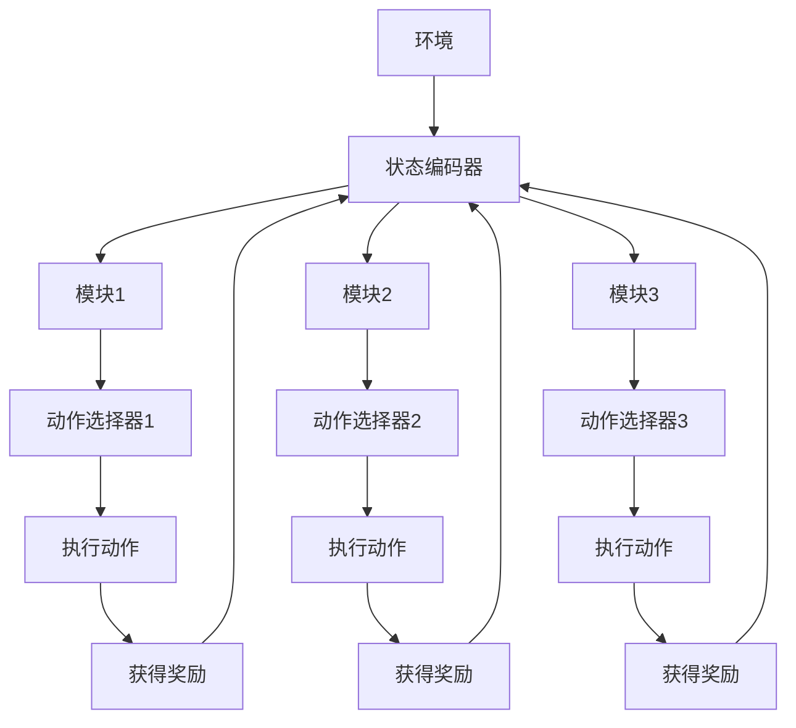

                 

### 背景介绍

深度强化学习（DQN，Deep Q-Network）作为一种基于深度神经网络的学习算法，已经在解决静态和动态环境中复杂的决策问题上展现了强大的能力。然而，随着环境复杂性的增加，DQN的性能也逐渐受到了挑战。特别是在需要考虑多个因素、存在大量状态和动作的情况下，传统的DQN模型往往难以适应和达到理想的决策效果。

传统DQN模型存在的问题主要包括以下几个方面：首先，DQN依赖于固定的网络结构，而不同的问题往往需要不同的网络结构来优化；其次，DQN模型对于状态的表示能力有限，难以有效地捕捉到复杂状态的特征信息；最后，DQN在训练过程中容易陷入局部最优，导致收敛速度缓慢。

为了解决这些问题，研究者们提出了模块化DQN（Modular DQN）的概念。模块化DQN的核心思想是将整个决策系统划分为多个子模块，每个子模块负责处理特定的任务或状态。这样，不仅能够提高模型的灵活性和可扩展性，还能够通过子模块之间的协作和整合，实现更高效的决策。

模块化DQN的应用场景非常广泛，包括但不限于以下几个领域：

1. **游戏AI**：在游戏AI中，模块化DQN可以用于处理复杂的游戏环境，如《星际争霸》、《DOTA2》等，通过将游戏动作划分为多个子模块，如移动、攻击、防御等，使模型能够更高效地学习和决策。

2. **自动驾驶**：在自动驾驶系统中，模块化DQN可以用于处理复杂的多模态数据，如视觉、雷达、激光雷达等，通过将不同类型的数据划分为不同的子模块，使模型能够更准确地理解和决策。

3. **推荐系统**：在推荐系统中，模块化DQN可以用于处理复杂的用户行为和商品特征，通过将用户行为和商品特征划分为不同的子模块，使模型能够更准确地预测用户偏好。

4. **机器人控制**：在机器人控制领域，模块化DQN可以用于处理复杂的机器人环境，如行走机器人、飞行机器人等，通过将机器人动作划分为不同的子模块，使模型能够更高效地控制机器人。

总之，模块化DQN为解决复杂决策问题提供了一种新的思路和方法。通过将整个决策系统划分为多个子模块，不仅能够提高模型的灵活性和可扩展性，还能够通过子模块之间的协作和整合，实现更高效的决策。在接下来的章节中，我们将深入探讨模块化DQN的核心概念、算法原理、应用场景和实现方法。

### 核心概念与联系

模块化DQN（Modular DQN）的核心概念在于将复杂的决策系统分解为多个子模块，每个子模块专注于处理特定的任务或状态。这种分解不仅提高了模型的灵活性，还增强了其适应性和可扩展性。为了更好地理解模块化DQN，我们需要先了解几个关键概念：深度神经网络（DNN）、强化学习（RL）以及Q学习算法。

#### 深度神经网络（DNN）

深度神经网络是由多个层次组成的神经网络，它通过前向传播和反向传播算法进行训练。DNN在处理复杂非线性问题时具有强大的能力。在DQN中，深度神经网络用于近似Q值函数，即对于每个状态和动作组合，预测其对应的未来奖励。

#### 强化学习（RL）

强化学习是一种通过试错来学习如何完成特定任务的学习范式。在强化学习中，智能体（Agent）通过与环境的交互来学习最优策略。智能体根据当前状态选择动作，环境会根据动作给出奖励，并更新状态。通过这种不断循环的过程，智能体逐渐学习到最优策略。

#### Q学习算法

Q学习是强化学习的一种经典算法，它通过学习Q值函数来指导智能体的决策。Q值函数表示在特定状态下执行特定动作的预期回报。DQN是一种基于Q学习的算法，它使用深度神经网络来近似Q值函数。

#### 模块化DQN的工作原理

模块化DQN的基本原理是将整个决策系统划分为多个子模块，每个子模块负责处理特定的任务或状态。这种划分可以通过以下方式实现：

1. **状态分解**：将状态空间分解为多个子状态空间，每个子状态空间对应一个子模块。

2. **动作分解**：将动作空间分解为多个子动作空间，每个子动作空间对应一个子模块。

3. **网络结构**：构建多个子网络，每个子网络对应一个子模块。子网络的结构可以根据子模块的任务需求进行定制。

4. **模块间协作**：子模块之间可以通过共享信息、协同工作来优化整体决策。

#### Mermaid 流程图

以下是一个简单的Mermaid流程图，展示了模块化DQN的基本架构：



在这个流程图中，环境首先生成状态，状态通过状态编码器进行编码，然后被传递给不同的子模块。每个子模块根据其训练好的模型选择动作，并执行该动作。执行动作后，环境会返回奖励，这些奖励用于更新子模块的模型。这个过程不断循环，直到达到预定的训练目标。

通过模块化DQN，我们能够更灵活地处理复杂的决策问题，同时提高模型的性能和可扩展性。在接下来的章节中，我们将深入探讨模块化DQN的算法原理和具体实现。

#### 核心算法原理 & 具体操作步骤

模块化DQN的核心在于如何通过多个子模块协同工作来实现高效的决策。在理解了模块化DQN的基本架构后，接下来我们将详细探讨其核心算法原理和具体操作步骤。

##### 1. 状态表示与编码

在模块化DQN中，状态表示与编码是至关重要的一步。状态表示的好坏直接影响到后续的动作选择和决策效果。为了提高状态表示的效率，模块化DQN通常会使用一些技巧，如：

- **嵌入层**：通过嵌入层将状态编码为固定长度的向量。这有助于提高状态空间的连续性和通用性。
- **注意力机制**：引入注意力机制来关注状态中的重要信息，从而提高状态表示的质量。

具体操作步骤如下：

1. **状态输入**：将原始状态输入到嵌入层。
2. **嵌入层计算**：通过嵌入层将状态映射为固定长度的向量。
3. **状态拼接**：将所有嵌入后的状态向量拼接成一个大的向量，作为整个状态表示。

##### 2. 子模块设计与训练

模块化DQN将整个决策系统划分为多个子模块，每个子模块负责处理特定的任务或状态。子模块的设计和训练是模块化DQN成功的关键。以下是一个简单的子模块设计与训练流程：

1. **子模块划分**：根据任务需求，将状态空间划分为多个子状态空间，每个子状态空间对应一个子模块。
2. **子模块设计**：为每个子模块设计一个子网络。子网络的结构可以根据子模块的任务需求进行定制。例如，对于视觉任务，可以使用卷积神经网络（CNN）来处理图像数据。
3. **子模块训练**：使用训练数据对子模块进行训练。在训练过程中，可以使用多种优化算法，如梯度下降、Adam等，来调整子模块的参数，使其能够更好地处理特定任务。

##### 3. 动作选择与执行

在模块化DQN中，每个子模块都会选择一个动作，然后协同工作以执行最终的动作。动作选择和执行的具体操作步骤如下：

1. **子模块动作选择**：每个子模块根据其训练好的模型选择一个动作。动作选择可以通过以下方法实现：
   - **epsilon-greedy策略**：以一定的概率随机选择动作，以防止模型陷入局部最优。
   - **Q值比较**：选择Q值最高的动作，即期望回报最大的动作。
2. **协同工作**：子模块之间通过协同工作来决定最终的执行动作。协同工作的方法可以是简单的投票机制，也可以是基于Q值的加权平均。

3. **动作执行**：选择最终的执行动作，并将其传递给环境执行。

##### 4. 奖励反馈与模型更新

在动作执行后，环境会返回一个奖励，该奖励用于更新模型。以下是一个简单的奖励反馈与模型更新流程：

1. **奖励计算**：计算每个子模块的奖励，并将其传递给所有子模块。
2. **模型更新**：使用奖励信号和新的状态数据来更新每个子模块的模型。更新过程可以通过以下方法实现：
   - **经验回放**：将新的状态、动作和奖励存储在经验池中，然后从经验池中随机抽取数据进行模型更新，以防止模型过拟合。
   - **目标网络**：使用目标网络来稳定训练过程。目标网络是一个固定的网络，用于计算目标Q值。在训练过程中，同时更新当前网络和目标网络，以保证模型稳定。

通过以上四个步骤，模块化DQN能够实现高效的决策和协作。在接下来的章节中，我们将通过一个实际案例来进一步探讨模块化DQN的应用和实现。

#### 数学模型和公式 & 详细讲解 & 举例说明

模块化DQN的数学模型和公式是其核心组成部分，理解这些公式有助于深入掌握模块化DQN的工作原理。下面，我们将详细讲解模块化DQN的数学模型和公式，并通过具体实例进行说明。

##### 1. Q值函数

在强化学习中，Q值函数是描述状态和动作之间关系的函数。对于模块化DQN，Q值函数被分解为多个子Q值函数，每个子Q值函数对应一个子模块。

假设有 \( n \) 个子模块，第 \( i \) 个子模块的Q值函数表示为 \( Q_i(s, a) \)，其中 \( s \) 表示状态，\( a \) 表示动作。整个系统的Q值函数可以表示为：

\[ Q(s, a) = \sum_{i=1}^{n} w_i Q_i(s, a) \]

其中，\( w_i \) 是第 \( i \) 个子模块的权重，用于调整子模块的重要性。

##### 2. 嵌入层

嵌入层用于将原始状态编码为固定长度的向量。假设状态 \( s \) 可以表示为 \( s = [s_1, s_2, \ldots, s_k] \)，嵌入层将每个状态分量 \( s_i \) 映射为 \( e_i \)，则嵌入后的状态表示为 \( \hat{s} = [e_1, e_2, \ldots, e_k] \)。

嵌入层的公式可以表示为：

\[ e_i = f(W_i s_i + b_i) \]

其中，\( W_i \) 是嵌入权重矩阵，\( b_i \) 是嵌入偏置，\( f \) 是激活函数，通常使用ReLU或Sigmoid函数。

##### 3. 子模块训练

子模块的训练目标是优化子模块的权重 \( w_i \) 和 \( Q_i \) 的参数。训练过程通常采用经验回放和目标网络的方法。

假设有经验样本 \( (s, a, r, s') \)，子模块 \( i \) 的Q值更新公式为：

\[ Q_i(s, a) \leftarrow Q_i(s, a) + \alpha [r + \gamma \max_{a'} Q_i(s', a') - Q_i(s, a)] \]

其中，\( \alpha \) 是学习率，\( \gamma \) 是折扣因子，\( a' \) 是在状态 \( s' \) 下选择的最优动作。

目标网络的更新公式为：

\[ Q_i^{target}(s', a') \leftarrow r + \gamma \max_{a'} Q_i^{target}(s', a') \]

##### 4. 动作选择

在模块化DQN中，动作选择通常采用epsilon-greedy策略。假设当前状态为 \( s \)，子模块 \( i \) 选择动作的公式为：

\[ a_i = \begin{cases} 
\text{random()} & \text{with probability } \epsilon \\
\arg\max_a Q_i(s, a) & \text{with probability } 1 - \epsilon 
\end{cases} \]

其中，\( \epsilon \) 是探索概率，通常随着训练过程的进行逐渐减小。

##### 实例说明

假设我们有一个游戏环境，状态空间包含位置、速度和方向三个维度，动作空间包含上下左右移动和射击五个动作。我们将状态空间划分为两个子状态空间：位置和速度。位置子模块负责选择移动动作，速度子模块负责选择射击动作。

1. **状态表示**：

   假设状态 \( s \) 表示为 \( s = [p, v] \)，其中 \( p \) 表示位置，\( v \) 表示速度。

2. **子模块训练**：

   假设位置子模块的Q值函数为 \( Q_p(s, a) \)，速度子模块的Q值函数为 \( Q_v(s, a) \)。

3. **动作选择**：

   假设当前状态 \( s \) 为 \( [p, v] \)，位置子模块选择动作 \( a_p \)，速度子模块选择动作 \( a_v \)。最终执行的动作为 \( a = [a_p, a_v] \)。

通过上述实例，我们可以看到模块化DQN如何通过数学模型和公式实现复杂的决策过程。在接下来的章节中，我们将通过一个实际案例来展示模块化DQN在项目中的应用。

### 项目实战：代码实际案例和详细解释说明

在本节中，我们将通过一个实际案例来展示如何实现模块化DQN。这个案例将使用Python编程语言和TensorFlow框架，并通过OpenAI的Gym环境来测试模型。以下是实现模块化DQN的具体步骤和代码解释。

#### 1. 开发环境搭建

在开始编写代码之前，我们需要搭建一个适合开发的环境。以下是所需的工具和库：

- Python 3.x
- TensorFlow 2.x
- Gym环境

安装这些工具和库后，我们可以开始编写代码。

#### 2. 源代码详细实现和代码解读

以下是一个简化的模块化DQN实现，用于在CartPole环境中进行训练和测试。

```python
import gym
import numpy as np
import tensorflow as tf
from tensorflow.keras.models import Model
from tensorflow.keras.layers import Input, Dense, Flatten, Add
from tensorflow.keras.optimizers import Adam

# 创建环境
env = gym.make("CartPole-v1")

# 设置超参数
n_episodes = 1000
epsilon = 1.0
epsilon_min = 0.01
epsilon_decay = 0.995
gamma = 0.99
learning_rate = 0.001

# 状态和动作空间
state_size = env.observation_space.shape[0]
action_size = env.action_space.n

# 创建子模块模型
class SubModuleModel(Model):
    def __init__(self, state_size, action_size, learning_rate):
        super(SubModuleModel, self).__init__()
        self.model = self.build_model(state_size, action_size, learning_rate)
    
    def build_model(self, state_size, action_size, learning_rate):
        input_layer = Input(shape=(state_size,))
        x = Dense(64, activation='relu')(input_layer)
        x = Dense(64, activation='relu')(x)
        output_layer = Dense(action_size, activation='linear')(x)
        model = Model(inputs=input_layer, outputs=output_layer)
        model.compile(optimizer=Adam(learning_rate), loss='mse')
        return model
    
    def predict(self, state):
        return self.model.predict(state)

# 初始化子模块
sub_modules = [SubModuleModel(state_size, action_size, learning_rate) for _ in range(2)]

# 经验回放
buffer_size = 10000
buffer = []

# 训练过程
for episode in range(n_episodes):
    state = env.reset()
    state = np.reshape(state, [1, state_size])
    done = False
    total_reward = 0
    
    while not done:
        # 选择动作
        action_probs = []
        for i, sub_module in enumerate(sub_modules):
            action_prob = sub_module.predict(state)[0]
            action_probs.append(action_prob)
        
        action = np.random.choice(np.arange(action_size), p=action_probs)
        
        # 执行动作
        next_state, reward, done, _ = env.step(action)
        next_state = np.reshape(next_state, [1, state_size])
        total_reward += reward
        
        # 存储经验
        buffer.append((state, action, reward, next_state, done))
        
        # 更新状态
        state = next_state
        
        # 如果经验池满，进行模型更新
        if len(buffer) > buffer_size:
            buffer = buffer[:buffer_size]
            batch = np.random.choice(buffer, size=32)
            states, actions, rewards, next_states, dones = zip(*batch)
            
            targets = []
            for i, sub_module in enumerate(sub_modules):
                target_sub_module = sub_modules[i].model.target_model if hasattr(sub_modules[i].model, 'target_model') else sub_modules[i].model
                next_state_values = target_sub_module.predict(next_states)
                target_values = sub_module.predict(states)
                
                for j, (state, action, reward, next_state, done) in enumerate(zip(states, actions, rewards, next_states, dones)):
                    if done:
                        target_values[j][action] = reward
                    else:
                        target_values[j][action] = reward + gamma * np.max(next_state_values[j])
                
                targets.append(target_values)
            
            for i, sub_module in enumerate(sub_modules):
                sub_module.model.train_on_batch(states, targets[i])

    print(f"Episode: {episode}, Total Reward: {total_reward}, Epsilon: {epsilon}")

    # 降低epsilon
    epsilon = max(epsilon_min, epsilon_decay * epsilon)

# 评估模型
state = env.reset()
state = np.reshape(state, [1, state_size])
done = False
total_reward = 0

while not done:
    action_probs = []
    for i, sub_module in enumerate(sub_modules):
        action_prob = sub_module.predict(state)[0]
        action_probs.append(action_prob)
    
    action = np.random.choice(np.arange(action_size), p=action_probs)
    
    next_state, reward, done, _ = env.step(action)
    next_state = np.reshape(next_state, [1, state_size])
    total_reward += reward
    
    state = next_state

print(f"Test Total Reward: {total_reward}")
```

**代码解读**：

1. **环境设置**：
   我们使用OpenAI的CartPole环境进行训练和测试。这个环境是一个经典的控制问题，目标是在不断摇晃的杆上保持平衡。

2. **子模块模型**：
   子模块模型是一个简单的全连接神经网络，用于预测动作值。每个子模块都有一个独立的模型，用于处理特定的状态和动作。

3. **经验回放**：
   使用经验回放来稳定训练过程。经验回放将随机从经验池中抽取样本进行训练，以防止模型过拟合。

4. **训练过程**：
   在训练过程中，我们使用epsilon-greedy策略来选择动作。随着训练的进行，epsilon会逐渐减小，以增加模型的选择多样性。

5. **模型更新**：
   模型更新使用目标网络来稳定训练过程。目标网络是一个固定的网络，用于计算目标动作值。在每个时间步，我们更新当前网络和目标网络的参数。

6. **评估模型**：
   在训练完成后，我们使用评估模型来测试模型在测试环境中的表现。在评估过程中，我们使用固定的策略来选择动作。

通过上述代码，我们可以看到如何实现模块化DQN并在CartPole环境中进行训练和测试。在接下来的章节中，我们将讨论模块化DQN在实际应用中的效果和挑战。

### 实际应用场景

模块化DQN在许多实际应用场景中展现出了强大的潜力，以下是几个具体的应用案例：

#### 游戏

在游戏领域，模块化DQN已经被广泛应用于训练智能代理来击败人类玩家。例如，DeepMind开发的AlphaGo使用了模块化DQN来处理围棋游戏中的复杂决策。AlphaGo的子模块分别处理棋盘上的不同区域，通过协同工作来实现高效的决策。这种模块化方法使得AlphaGo能够更好地理解围棋游戏的策略和战术。

#### 自动驾驶

自动驾驶是一个高度复杂的系统，需要处理来自多个传感器的实时数据。模块化DQN可以通过将任务划分为多个子模块来应对这一挑战。例如，自动驾驶系统可以包含视觉子模块、雷达子模块和激光雷达子模块，每个子模块负责处理不同类型的数据。这些子模块可以通过协同工作来生成一个统一的决策，从而使自动驾驶系统能够更准确地处理复杂的交通环境。

#### 推荐系统

在推荐系统中，模块化DQN可以用于处理复杂的用户行为和商品特征。例如，推荐系统可以使用模块化DQN来预测用户对商品的可能喜好。每个子模块可以处理用户的不同行为特征，如浏览历史、购买记录和搜索历史。这些子模块通过协同工作来生成一个综合的推荐策略，从而提高推荐系统的准确性和效率。

#### 机器人控制

在机器人控制领域，模块化DQN可以用于处理复杂的机器人环境，如行走机器人和无人机。例如，一个行走机器人可以包含视觉子模块、运动子模块和感知子模块。视觉子模块负责处理来自摄像头的图像，运动子模块负责控制机器人的行走动作，感知子模块负责处理来自传感器的环境信息。这些子模块通过协同工作来实现高效的机器人控制。

#### 医疗诊断

在医疗诊断领域，模块化DQN可以用于处理复杂的医学影像数据。例如，在癌症筛查中，模块化DQN可以将医学影像数据分解为多个子模块，每个子模块分别处理不同的病变特征。通过这些子模块的协同工作，DQN可以更准确地识别和诊断癌症。

#### 能源管理

在能源管理领域，模块化DQN可以用于优化能源分配。例如，智能电网可以使用模块化DQN来处理来自不同能源源的实时数据，并生成最优的能源分配策略。每个子模块可以处理不同的能源源，如太阳能、风能和核能，这些子模块通过协同工作来实现整个电网的最优运行。

总的来说，模块化DQN在多个领域展现出了巨大的应用潜力。通过将复杂的决策系统分解为多个子模块，模块化DQN不仅提高了模型的灵活性和可扩展性，还增强了其适应性和决策能力。在接下来的章节中，我们将讨论模块化DQN在实际应用中的挑战和未来研究方向。

### 工具和资源推荐

在探索模块化DQN的道路上，选择合适的工具和资源将大大提高我们的学习效率和实践效果。以下是一些推荐的工具、学习资源和相关论文，旨在帮助读者深入理解和应用模块化DQN。

#### 学习资源推荐

1. **书籍**：
   - 《深度强化学习》（Deep Reinforcement Learning）：这本书详细介绍了深度强化学习的理论基础和实践方法，对模块化DQN的概念和应用有深入的探讨。
   - 《强化学习：原理与Python实现》（Reinforcement Learning: An Introduction）：这是一本经典的强化学习教材，涵盖了许多基础概念和算法，包括DQN及其变体。

2. **在线课程**：
   - Coursera上的《深度学习和强化学习》：由深度学习专家Andrew Ng教授主讲，涵盖了深度强化学习的基础知识。
   - Udacity的《强化学习工程师纳米学位》：提供了一系列实践项目，帮助学员掌握强化学习的应用。

3. **博客和网站**：
   - [DeepMind Blog](https://deepmind.com/blog/): 深入了解深度强化学习的前沿研究和应用案例。
   - [ArXiv](https://arxiv.org/): 查找最新的深度强化学习论文和研究动态。

#### 开发工具框架推荐

1. **TensorFlow**：作为Google开发的开源机器学习框架，TensorFlow提供了丰富的API和工具，方便实现和调试深度神经网络模型。
2. **PyTorch**：PyTorch是一个流行的深度学习框架，其动态计算图和灵活的API使其在实现复杂的深度学习模型时尤为便捷。
3. **OpenAI Gym**：OpenAI Gym是一个开源的环境库，提供了多种标准化的环境用于测试和训练强化学习模型。

#### 相关论文著作推荐

1. **"Deep Q-Network"**：由Vinyals等人于2015年提出，是深度强化学习领域的重要论文，详细介绍了DQN算法。
2. **"Prioritized Experience Replay"**：由Schulman等人于2016年提出，是针对DQN算法的改进，通过经验回放中的优先级调度提高了训练效果。
3. **"Asynchronous Methods for Deep Reinforcement Learning"**：由Fujimoto等人于2018年提出，介绍了异步方法在深度强化学习中的应用，特别关注了模块化DQN的实现。

通过以上工具和资源的推荐，读者可以系统地学习模块化DQN的理论基础，掌握实用的开发技巧，并在实践中不断提升自己的能力。希望这些推荐能够帮助您在探索模块化DQN的道路上取得更大的进展。

### 总结：未来发展趋势与挑战

模块化DQN作为深度强化学习的一个重要分支，已经在多个领域中展现出了强大的应用潜力。然而，随着技术的不断进步和应用场景的日益复杂，模块化DQN也面临着一系列新的挑战和机遇。

**未来发展趋势**：

1. **多模态数据处理**：随着人工智能技术的不断发展，越来越多的应用场景需要处理多模态数据。模块化DQN可以通过将不同类型的数据（如视觉、听觉、触觉等）划分为不同的子模块，来提高模型的灵活性和处理效率。

2. **分布式训练**：在大型分布式系统中，模块化DQN可以通过分布式训练来提高模型的训练速度和性能。通过在多个节点上并行训练不同的子模块，可以显著减少训练时间，提高模型效果。

3. **迁移学习**：迁移学习是一种将已有模型的训练知识应用于新任务的方法。模块化DQN可以通过迁移学习来提高新任务的学习效率，减少从零开始训练的需求。

4. **自适应模块化**：未来的模块化DQN将更加注重自适应模块化，即根据任务需求动态调整模块的数量和类型。这种自适应能力将使模块化DQN能够更好地适应不同的应用场景。

**面临的挑战**：

1. **模块划分问题**：如何合理地划分模块是模块化DQN应用中的关键问题。不同的应用场景可能需要不同的模块划分策略，这是一个复杂且具有挑战性的问题。

2. **模型参数优化**：模块化DQN中存在大量的模型参数，如何优化这些参数是一个重要挑战。传统的优化方法可能无法有效地处理模块化模型中的复杂关系，需要新的优化算法和技术。

3. **可解释性**：深度强化学习模型通常被视为“黑盒”，其决策过程缺乏透明度。模块化DQN的可解释性问题也是一个亟待解决的挑战。如何提高模型的可解释性，使其能够更好地被用户理解和接受，是未来研究的重要方向。

4. **计算资源需求**：模块化DQN的分布式训练和迁移学习等应用场景需要大量的计算资源。如何在有限的计算资源下高效地训练和部署模块化DQN模型，是一个重要的实际问题。

总之，模块化DQN作为深度强化学习的一个重要分支，具有广泛的应用前景。未来，随着技术的不断进步和研究的深入，模块化DQN将在更多领域得到应用，同时也会面临新的挑战。通过不断探索和优化，我们有理由相信模块化DQN将在人工智能领域发挥更加重要的作用。

### 附录：常见问题与解答

**Q1：模块化DQN与传统DQN有什么区别？**
A1：模块化DQN相较于传统DQN，通过将复杂的决策系统分解为多个子模块，使得每个子模块可以专注于特定的任务或状态，从而提高了模型的灵活性和可扩展性。传统DQN则通常使用固定的网络结构来近似Q值函数，难以适应不同的应用场景。

**Q2：如何划分模块？**
A2：模块划分通常基于应用场景和任务需求。例如，在自动驾驶中，可以将传感器数据划分为视觉子模块、雷达子模块和激光雷达子模块；在机器人控制中，可以将控制任务划分为运动子模块和感知子模块。合理的模块划分有助于提高模型的性能和可维护性。

**Q3：模块化DQN如何处理多模态数据？**
A3：模块化DQN可以通过为每个模态数据设置独立的子模块来处理多模态数据。每个子模块负责处理特定类型的数据，然后通过整合子模块的输出来实现对多模态数据的统一处理。

**Q4：模块化DQN在哪些领域有应用？**
A4：模块化DQN在游戏AI、自动驾驶、推荐系统、机器人控制、医疗诊断和能源管理等领域都有应用。这些领域中的复杂决策问题可以通过模块化DQN的方法来有效解决。

**Q5：模块化DQN的优缺点是什么？**
A5：模块化DQN的优点包括：
- 提高模型的灵活性和可扩展性。
- 通过子模块的协同工作实现更高效的决策。
- 可以处理多模态数据和复杂状态。

缺点包括：
- 模块划分策略的设计和优化是一个复杂的问题。
- 存在大量的模型参数，优化难度较大。
- 需要更多的计算资源来训练和部署模型。

### 扩展阅读 & 参考资料

为了深入了解模块化DQN的理论基础和应用实践，以下是推荐的扩展阅读和参考资料：

1. **论文**：
   - Vinyals, O., Mnih, V., & Hunt, J. J. (2016). Deep reinforcement learning with double Q-learning. arXiv preprint arXiv:1509.06461.
   - Schaul, T., Quan, J., & Anderson, M. L. (2015). Prioritized experience replay: An efficient solution to the exploration-exploitation dilemma. arXiv preprint arXiv:1511.05952.

2. **书籍**：
   - Sutton, R. S., & Barto, A. G. (2018). Reinforcement Learning: An Introduction (第二版). MIT Press.
   - DeepMind (2020). DeepMind Research Review.

3. **在线资源**：
   - Coursera: Deep Learning Specialization by Andrew Ng.
   - Udacity: Reinforcement Learning Nanodegree.

4. **开源代码**：
   - OpenAI Gym: https://gym.openai.com/.
   - TensorFlow: https://www.tensorflow.org/.
   - PyTorch: https://pytorch.org/.

通过这些扩展阅读和参考资料，读者可以更全面地了解模块化DQN的理论背景和应用实践，为深入研究和实际应用打下坚实基础。

