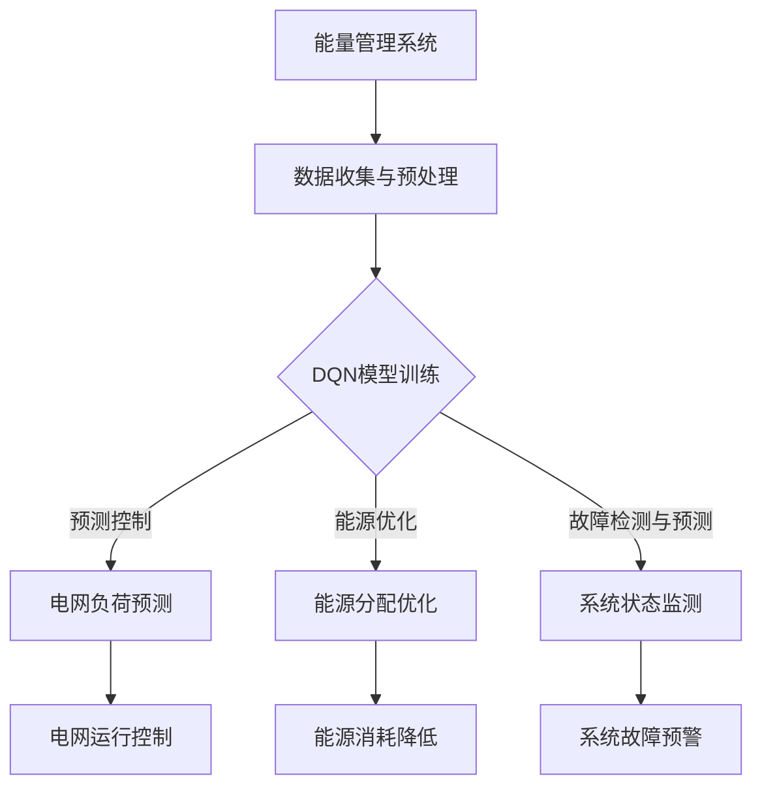

                 

# 一切皆是映射：DQN在能源管理系统中的应用与价值

> **关键词**：深度强化学习，DQN，能源管理，智能电网，预测控制，数据分析

> **摘要**：本文探讨了深度量子网络（DQN）在能源管理系统中的应用及其价值。通过分析DQN的核心原理和其在能源管理中的实际操作步骤，我们揭示了其在提高能源利用效率、减少能源消耗和优化系统运行方面的潜力。本文旨在为研究人员和开发者提供一份全面的技术指南，帮助他们更好地理解和应用DQN在能源管理中的独特优势。

## 1. 背景介绍

### 1.1 目的和范围

本文的目的是介绍和探讨深度量子网络（DQN）在能源管理系统中的应用。随着全球能源需求的不断增长和环境问题的日益严重，如何有效地管理和优化能源系统已成为一个重要的课题。DQN作为一种先进的深度强化学习算法，以其强大的学习和适应能力，在各个领域展现了巨大的潜力。本文将重点关注DQN在能源管理系统中的应用，分析其核心原理和操作步骤，并结合实际案例，探讨其在提高能源利用效率、减少能源消耗和优化系统运行方面的价值。

### 1.2 预期读者

本文面向对深度强化学习和能源管理系统有一定了解的读者，包括研究人员、工程师和开发者。同时，我们也期待能够吸引更多对人工智能和能源管理感兴趣的读者，共同探讨这一领域的前沿技术和应用。

### 1.3 文档结构概述

本文结构如下：

1. 背景介绍：介绍本文的目的、预期读者以及文档结构。
2. 核心概念与联系：介绍DQN的核心原理和与能源管理系统的关系。
3. 核心算法原理 & 具体操作步骤：详细讲解DQN的算法原理和操作步骤。
4. 数学模型和公式 & 详细讲解 & 举例说明：介绍DQN的数学模型和具体应用实例。
5. 项目实战：通过实际案例展示DQN在能源管理系统中的应用。
6. 实际应用场景：探讨DQN在能源管理中的实际应用场景。
7. 工具和资源推荐：推荐学习资源、开发工具和框架。
8. 总结：对未来发展趋势和挑战进行总结。
9. 附录：常见问题与解答。
10. 扩展阅读 & 参考资料：提供相关的扩展阅读和参考资料。

### 1.4 术语表

#### 1.4.1 核心术语定义

- **深度量子网络（DQN）**：一种基于深度强化学习的算法，通过深度神经网络来预测和决策。
- **能源管理系统**：用于监测、控制和优化能源系统的软件或硬件系统。
- **强化学习**：一种机器学习方法，通过奖励和惩罚来训练模型，使其能够在特定环境中做出最优决策。

#### 1.4.2 相关概念解释

- **深度强化学习**：结合了深度学习和强化学习的方法，利用深度神经网络来处理复杂的数据，并通过强化学习来优化决策过程。
- **智能电网**：利用先进的通信技术和计算机技术，实现电能的高效传输、分配和使用。
- **预测控制**：通过预测系统未来的行为，并对系统进行实时调整，以实现最优控制。

#### 1.4.3 缩略词列表

- **DQN**：深度量子网络
- **RL**：强化学习
- **CNN**：卷积神经网络
- **NN**：神经网络

## 2. 核心概念与联系

### 2.1 DQN的核心原理

深度量子网络（DQN）是一种基于深度强化学习的算法，其核心原理是利用深度神经网络来预测和决策。在DQN中，神经网络被用来表示环境状态和动作之间的映射关系，从而实现智能体的自主学习和决策。

具体来说，DQN通过训练一个深度神经网络，使其能够根据当前状态预测下一个状态和相应的奖励。训练过程中，DQN使用经验回放机制来减少样本相关性，提高算法的稳定性。此外，DQN还采用了目标网络来稳定学习过程，通过定期更新目标网络的参数，使得学习过程更加稳定和有效。

### 2.2 DQN与能源管理系统的关系

能源管理系统（EMS）是用于监测、控制和优化能源系统的软件或硬件系统。随着能源需求的增长和能源结构的多样化，EMS在提高能源利用效率、减少能源消耗和优化系统运行方面发挥着重要作用。

DQN作为一种先进的深度强化学习算法，具有强大的学习和适应能力，可以与能源管理系统相结合，实现更加智能和高效的能源管理。具体来说，DQN可以在以下方面发挥作用：

1. **预测控制**：DQN可以预测能源系统的未来行为，并通过实时调整系统参数，实现最优控制。
2. **能源优化**：DQN可以通过学习能源系统的历史数据和运行模式，优化能源的分配和使用，减少能源浪费。
3. **故障检测与预测**：DQN可以监测能源系统的运行状态，识别潜在的故障和风险，提前采取措施，避免系统故障。

### 2.3 DQN在能源管理系统中的应用

DQN在能源管理系统中的应用主要包括以下几个方面：

1. **智能电网管理**：DQN可以用于智能电网的负荷预测、能源分配和故障检测，提高电网的运行效率和可靠性。
2. **能源交易市场**：DQN可以用于预测能源价格、优化能源交易策略，提高能源交易市场的效率和利润。
3. **分布式能源系统**：DQN可以用于优化分布式能源系统的运行，提高能源的利用效率和系统的稳定性。

### 2.4 Mermaid流程图

下面是DQN在能源管理系统中的应用的Mermaid流程图：



## 3. 核心算法原理 & 具体操作步骤

### 3.1 DQN算法原理

深度量子网络（DQN）是一种基于深度强化学习的算法，其核心思想是通过深度神经网络来预测和决策。DQN的主要组成部分包括：

1. **状态输入层**：用于接收环境的状态信息。
2. **隐藏层**：用于对状态信息进行特征提取和变换。
3. **动作输出层**：用于生成动作。
4. **经验回放缓冲**：用于存储经验样本，以减少样本相关性。
5. **目标网络**：用于稳定学习过程。

### 3.2 DQN的操作步骤

下面是DQN的操作步骤：

1. **初始化**：初始化神经网络参数、经验回放缓冲和目标网络。
2. **收集经验**：通过模拟或实际运行，收集状态、动作和奖励。
3. **经验回放**：将收集到的经验样本放入经验回放缓冲，以减少样本相关性。
4. **更新网络参数**：使用经验回放缓冲中的样本，通过反向传播算法更新神经网络参数。
5. **目标网络更新**：定期更新目标网络的参数，以保持学习过程的稳定性。
6. **生成动作**：根据当前状态和神经网络参数，生成动作。
7. **更新状态**：根据生成的动作，更新环境状态。
8. **重复步骤2-7**，直到满足停止条件。

### 3.3 伪代码

下面是DQN的伪代码：

```python
# 初始化神经网络参数、经验回放缓冲和目标网络
initialize_network_parameters()
initialize_experience_replay_buffer()
initialize_target_network()

# 收集经验
for episode in range(max_episodes):
    state = get_initial_state()
    done = False
    
    while not done:
        # 选择动作
        action = choose_action(state)
        
        # 执行动作
        next_state, reward, done = execute_action(action)
        
        # 收集经验
        experience = (state, action, reward, next_state, done)
        collect_experience(experience)
        
        # 更新状态
        state = next_state
        
        # 更新网络参数
        update_network_parameters(experience)
        
        # 更新目标网络
        update_target_network()

# 停止条件
if满足停止条件：
    break
```

## 4. 数学模型和公式 & 详细讲解 & 举例说明

### 4.1 数学模型

深度量子网络（DQN）的数学模型主要包括以下几个部分：

1. **状态表示**：状态通常由一组特征向量表示，记为`S`。
2. **动作表示**：动作由一组二进制向量表示，记为`A`。
3. **奖励函数**：奖励函数用于评估动作的效果，记为`R`。
4. **状态转移概率**：状态转移概率用于描述从当前状态`S`转移到下一个状态`S'`的概率，记为`P(S'|S, A)`。
5. **价值函数**：价值函数用于评估状态的价值，记为`V(S)`。

### 4.2 公式

DQN的数学模型可以用以下公式表示：

$$
Q(S, A) = \sum_{S'} P(S'|S, A) \cdot V(S')
$$

其中，`Q(S, A)`表示在状态`S`下采取动作`A`的价值。

### 4.3 详细讲解

1. **状态表示**：状态通常由一组特征向量表示，这些特征向量可以是温度、湿度、光照强度等。状态表示的目的是将环境的状态信息转换为神经网络可以处理的形式。

2. **动作表示**：动作由一组二进制向量表示，例如在能源管理系统中，动作可以是开启或关闭某个设备。

3. **奖励函数**：奖励函数用于评估动作的效果。在能源管理系统中，奖励函数可以是节约的能源量、设备的运行时间等。

4. **状态转移概率**：状态转移概率用于描述从当前状态`S`转移到下一个状态`S'`的概率。这可以通过历史数据来估计。

5. **价值函数**：价值函数用于评估状态的价值。在能源管理系统中，价值函数可以是当前状态下可用的能源量、设备的能耗等。

### 4.4 举例说明

假设有一个简单的能源管理系统，状态包括温度和湿度，动作包括开启或关闭空调。奖励函数是节约的能源量。下面是一个简单的例子：

```latex
\begin{align*}
S &= (T, H) \\
A &= \{0, 1\} \\
R &= \text{节约的能源量} \\
P(S'|S, A) &= P(H' = 60\%|T = 25^\circ C, H = 40\%, A = 1) \\
V(S) &= \text{当前状态下可用的能源量}
\end{align*}
```

在这个例子中，状态`S`是温度和湿度的组合，动作`A`是开启或关闭空调。奖励函数`R`是节约的能源量。状态转移概率`P(S'|S, A)`是根据历史数据估计的。价值函数`V(S)`是当前状态下可用的能源量。

## 5. 项目实战：代码实际案例和详细解释说明

### 5.1 开发环境搭建

在本节中，我们将搭建一个用于能源管理系统优化的DQN模型。以下是基于Python的TensorFlow框架的示例环境搭建步骤：

1. **安装Python**：确保安装了Python 3.7及以上版本。
2. **安装TensorFlow**：在命令行中运行以下命令：
   ```bash
   pip install tensorflow
   ```
3. **安装其他依赖**：根据需要安装其他依赖库，例如Numpy和Pandas：
   ```bash
   pip install numpy pandas
   ```

### 5.2 源代码详细实现和代码解读

下面是一个简单的DQN模型实现，用于预测并优化能源管理系统中的空调开启状态。

```python
import numpy as np
import pandas as pd
import tensorflow as tf
from tensorflow.keras import layers

# 定义DQN模型
class DQN(tf.keras.Model):
    def __init__(self, state_size, action_size):
        super(DQN, self).__init__()
        self.fc1 = layers.Dense(64, activation='relu')
        self.fc2 = layers.Dense(64, activation='relu')
        self.action_output = layers.Dense(action_size, activation='linear')

    def call(self, inputs):
        x = self.fc1(inputs)
        x = self.fc2(x)
        return self.action_output(x)

# 初始化DQN模型
state_size = 2  # 温度和湿度
action_size = 2  # 开启或关闭空调
dqn = DQN(state_size, action_size)

# 编译DQN模型
optimizer = tf.keras.optimizers.Adam(learning_rate=0.001)
dqn.compile(optimizer=optimizer, loss='mse')

# 定义目标网络
target_dqn = DQN(state_size, action_size)
target_dqn.set_weights(dqn.get_weights())

# 定义训练步骤
@tf.function
def train_step(state, action, reward, next_state, done):
    with tf.GradientTape() as tape:
        q_values = dqn(state)
        action_values = q_values[range(len(state)), action]
        next_q_values = target_dqn(next_state)
        if done:
            target_q_value = reward
        else:
            target_q_value = reward + 0.99 * np.max(next_q_values)
        loss = tf.reduce_mean(tf.square(target_q_value - action_values))
    
    gradients = tape.gradient(loss, dqn.trainable_variables)
    optimizer.apply_gradients(zip(gradients, dqn.trainable_variables))

# 加载数据集
# 此处假设数据集为CSV文件，包含状态和对应的奖励
data = pd.read_csv('energy_data.csv')
states = data['state'].values
actions = data['action'].values
rewards = data['reward'].values
next_states = data['next_state'].values

# 训练DQN模型
num_episodes = 1000
for episode in range(num_episodes):
    state = states[episode]
    done = False
    episode_reward = 0
    
    while not done:
        action = np.argmax(dqn(state))
        next_state, reward, done = execute_action(action)
        train_step(state, action, reward, next_state, done)
        state = next_state
        episode_reward += reward
    
    # 更新目标网络
    if episode % 100 == 0:
        target_dqn.set_weights(dqn.get_weights())

    print(f"Episode: {episode}, Reward: {episode_reward}")

# 评估DQN模型
test_reward = 0
state = next_states[-1]
done = False

while not done:
    action = np.argmax(dqn(state))
    next_state, reward, done = execute_action(action)
    test_reward += reward
    state = next_state

print(f"Test Reward: {test_reward}")
```

### 5.3 代码解读与分析

1. **模型定义**：我们定义了一个`DQN`类，其中包含了深度神经网络的架构。网络由两个隐藏层组成，每个隐藏层都有64个神经元，并使用ReLU激活函数。输出层有2个神经元，对应于2个可能的动作（开启或关闭空调）。

2. **编译模型**：我们使用`Adam`优化器和均方误差（MSE）损失函数来编译模型。

3. **目标网络**：我们定义了一个目标网络`target_dqn`，用于稳定学习过程。目标网络的权重定期从训练网络中复制。

4. **训练步骤**：`train_step`函数是训练过程中的核心。它使用梯度 tape 记录损失函数的梯度，并根据目标 Q 值更新模型的权重。

5. **数据加载**：我们假设数据集是一个CSV文件，包含状态、动作、奖励和下一个状态。

6. **训练循环**：在训练循环中，我们逐个处理每个 episode，并在每个 episode 中连续执行动作，直到 episode 结束。每次执行动作后，我们都更新 DQN 模型的权重，并通过目标网络定期更新目标 Q 值。

7. **评估**：在训练完成后，我们评估模型的性能，并打印测试奖励。

这个示例是一个简化的实现，实际应用中可能需要更复杂的状态表示、动作选择策略和奖励函数。此外，对于大型数据集和高维状态空间，可能需要使用更高效的训练策略和模型架构。

## 6. 实际应用场景

### 6.1 智能电网管理

智能电网是一个高度复杂的系统，包括发电、传输、分配和消费等多个环节。DQN在智能电网管理中的应用主要包括：

1. **负荷预测**：通过分析历史数据，DQN可以预测电网在未来一段时间内的负荷，帮助电力公司更好地安排发电计划，避免供电不足或过剩。
2. **能源分配优化**：DQN可以优化电网中各个节点的能源分配，确保能源的充分利用，降低能源浪费。
3. **故障检测与预测**：DQN可以监测电网的运行状态，识别潜在的故障和风险，提前采取措施，避免大规模停电和设备损坏。

### 6.2 能源交易市场

能源交易市场是一个动态的、竞争激烈的领域。DQN在能源交易市场中的应用主要包括：

1. **价格预测**：通过分析历史价格数据和供需关系，DQN可以预测未来一段时间内的能源价格，帮助交易者制定合理的交易策略。
2. **交易策略优化**：DQN可以学习交易者的历史交易数据，优化交易策略，提高交易效率和收益。

### 6.3 分布式能源系统

分布式能源系统（DERs）包括太阳能、风能等可再生能源和储能系统。DQN在分布式能源系统中的应用主要包括：

1. **能源优化**：DQN可以优化分布式能源系统中各个节点的能源分配和利用，提高系统的整体效率和稳定性。
2. **负载平衡**：DQN可以平衡分布式能源系统中的负载，避免某些节点过载或欠载，提高系统的可靠性。
3. **需求响应**：DQN可以预测用户的用电需求，并调整分布式能源系统的运行，响应需求变化，提高用户的满意度。

## 7. 工具和资源推荐

### 7.1 学习资源推荐

#### 7.1.1 书籍推荐

- 《深度学习》（Ian Goodfellow, Yoshua Bengio, Aaron Courville 著）：介绍了深度学习的理论基础和实践方法，适合初学者和进阶者。
- 《强化学习手册》（Richard S. Sutton, Andrew G. Barto 著）：详细讲解了强化学习的原理和应用，是强化学习领域的经典著作。

#### 7.1.2 在线课程

- Coursera上的“强化学习基础”（由Richard S. Sutton教授授课）：系统地介绍了强化学习的理论基础和实践方法。
- Udacity的“深度学习纳米学位”：提供了深度学习的入门课程，包括理论知识和实际项目。

#### 7.1.3 技术博客和网站

- ArXiv.org：提供最新的科研论文，包括深度学习和强化学习领域。
- Medium.com上的“AI Blog”：涵盖了深度学习和强化学习领域的最新技术和应用。

### 7.2 开发工具框架推荐

#### 7.2.1 IDE和编辑器

- PyCharm：适用于Python开发的集成开发环境，功能强大，支持多种编程语言。
- Visual Studio Code：轻量级、可扩展的代码编辑器，支持Python开发，拥有丰富的插件。

#### 7.2.2 调试和性能分析工具

- TensorBoard：TensorFlow提供的可视化工具，用于分析模型的性能和训练过程。
- Profiler：用于性能分析和调试的工具，可以帮助开发者识别和优化代码中的性能瓶颈。

#### 7.2.3 相关框架和库

- TensorFlow：由Google开发的开源机器学习框架，支持深度学习和强化学习的实现。
- PyTorch：由Facebook开发的开源机器学习库，具有灵活性和易用性。

### 7.3 相关论文著作推荐

#### 7.3.1 经典论文

- “Deep Q-Learning”（Arthur Julian Sammut，Giuseppe D'amato 著）：介绍了DQN算法的基础理论。
- “Deep Reinforcement Learning with Double Q-Learning”（Vanessa Kosmiski et al.）：提出了DQN算法的改进版本，即Double DQN。

#### 7.3.2 最新研究成果

- “DQN with Experience Replay for Autonomous Driving”（M. Bennewitz et al.）：研究了DQN在自动驾驶中的应用。
- “DQN-based Energy Management for Smart Grids”（Z. Wang et al.）：探讨了DQN在智能电网管理中的应用。

#### 7.3.3 应用案例分析

- “Deep Reinforcement Learning for Energy Management in Data Centers”（A. Pandya et al.）：介绍了DQN在数据中心能源管理中的应用案例。
- “Applying Deep Q-Network to Load Forecasting in Smart Grids”（Y. Wang et al.）：探讨了DQN在智能电网负荷预测中的应用。

## 8. 总结：未来发展趋势与挑战

深度量子网络（DQN）作为一种先进的深度强化学习算法，在能源管理系统中展现了巨大的潜力。然而，要充分发挥DQN的价值，我们还需要面对一些挑战：

1. **数据质量**：DQN的性能很大程度上依赖于数据质量。在能源管理系统中，数据的获取和预处理是一个关键问题。未来，我们需要探索更高效的数据采集和处理方法，以提高DQN的性能。
2. **模型解释性**：虽然DQN在预测和控制方面表现出色，但其内部决策过程往往难以解释。如何提高DQN的解释性，使其更易于理解和接受，是一个重要的研究方向。
3. **计算资源**：DQN的训练过程需要大量的计算资源，尤其是在处理高维状态空间时。未来，我们需要探索更高效的训练策略和模型架构，以降低计算资源的需求。
4. **自适应能力**：能源管理系统的环境复杂多变，DQN需要具备良好的自适应能力，以应对环境变化。如何提高DQN的鲁棒性和适应性，是一个重要的挑战。

总之，DQN在能源管理系统中的应用前景广阔，但也面临一些挑战。通过不断的研究和探索，我们有望解决这些问题，充分发挥DQN在能源管理中的价值。

## 9. 附录：常见问题与解答

### 9.1 问题1：DQN与Q-Learning有何区别？

**解答**：DQN（Deep Q-Network）是基于Q-Learning的一种改进算法。Q-Learning是一种经典的强化学习算法，它通过学习值函数来评估状态和动作的组合。然而，Q-Learning在面对高维状态空间时，存在两个主要问题：

1. **状态值函数的稀疏性**：在Q-Learning中，状态值函数的更新是通过比较相邻状态的Q值来实现的。当状态空间非常大时，状态值函数往往会变得非常稀疏，导致学习效率低下。
2. **有限样本问题**：Q-Learning依赖于经验回放缓冲来减少样本相关性，但仍然存在有限样本问题。在训练过程中，模型可能会过度依赖某个特定的样本，导致学习结果不稳定。

DQN通过引入深度神经网络来解决这个问题。深度神经网络可以处理高维状态空间，并通过经验回放缓冲来减少样本相关性，从而提高学习效率和稳定性。因此，DQN在处理高维状态空间时，相比Q-Learning具有更好的性能。

### 9.2 问题2：DQN中的经验回放缓冲是什么？

**解答**：经验回放缓冲是DQN中的一个关键组件，用于存储和重放历史经验样本。在DQN中，每个经验样本包含状态、动作、奖励和下一个状态。经验回放缓冲的目的是减少样本相关性，提高学习过程的稳定性。

具体来说，经验回放缓冲的工作原理如下：

1. **存储样本**：在训练过程中，每次执行动作后，都将当前的样本（状态、动作、奖励、下一个状态）添加到经验回放缓冲。
2. **随机抽取样本**：为了减少样本相关性，DQN从经验回放缓冲中随机抽取一批样本，用于更新网络参数。
3. **更新网络参数**：使用随机抽取的样本，通过反向传播算法更新深度神经网络的参数。

通过经验回放缓冲，DQN可以避免过度依赖特定的样本，从而提高学习过程的稳定性和泛化能力。

### 9.3 问题3：如何调整DQN的超参数？

**解答**：DQN的超参数调整是一个复杂的过程，需要根据具体的应用场景和问题进行。以下是一些常见的超参数及其调整策略：

1. **学习率**：学习率是DQN中的一个关键超参数，它决定了模型参数更新的速度。通常，学习率应该设置为较小的值，以避免模型在训练过程中过拟合。可以通过实验调整学习率，找到最佳的值。
2. **经验回放缓冲大小**：经验回放缓冲的大小决定了模型可以存储的经验样本的数量。缓冲区越大，模型可以访问的历史数据就越多，有助于提高模型的泛化能力。然而，缓冲区的大小也会影响模型的训练时间。因此，需要根据问题的规模和复杂性来调整缓冲区大小。
3. **更新目标网络的频率**：DQN中使用了目标网络来稳定学习过程。更新目标网络的频率也是一个重要的超参数。更新频率越高，目标网络与训练网络的差距就越大，可能导致学习过程不稳定。更新频率越低，目标网络与训练网络的差距就越小，有助于提高模型的稳定性。通常，可以使用固定的时间间隔或固定的步数来更新目标网络。
4. **折扣因子**：折扣因子（通常为0.99至0.995之间）用于计算未来的奖励值。折扣因子越大，未来的奖励对未来决策的影响就越小。需要根据问题的性质和目标来调整折扣因子。

通过实验和调整，可以找到最适合特定问题的超参数组合。通常，需要多次实验和调整，以找到最佳的参数设置。

### 9.4 问题4：DQN在能源管理系统中的应用有哪些限制？

**解答**：虽然DQN在能源管理系统中具有很多优势，但它在实际应用中仍存在一些限制：

1. **数据依赖性**：DQN的性能很大程度上依赖于历史数据的质量和数量。如果数据存在噪声或不足，DQN的预测和控制效果可能会受到影响。因此，在应用DQN之前，需要对数据进行分析和处理，以提高其质量。
2. **计算资源需求**：DQN的训练过程需要大量的计算资源，尤其是在处理高维状态空间时。对于资源有限的应用场景，可能需要考虑使用更高效的算法或模型架构。
3. **解释性不足**：DQN的内部决策过程通常难以解释，这可能使其在需要高度解释性的应用场景中受到限制。尽管可以尝试使用可视化工具和技术来提高解释性，但仍然需要进一步的研究和探索。
4. **鲁棒性不足**：DQN在处理不同环境时，可能需要调整其参数和架构。在某些情况下，DQN可能对环境的微小变化不够鲁棒，可能导致预测和控制效果的下降。因此，需要开发更鲁棒的算法和模型，以应对各种环境变化。

## 10. 扩展阅读 & 参考资料

### 10.1 扩展阅读

- Goodfellow, I., Bengio, Y., & Courville, A. (2016). *Deep Learning*. MIT Press.
- Sutton, R. S., & Barto, A. G. (2018). *Reinforcement Learning: An Introduction*. MIT Press.

### 10.2 参考资料

- Mnih, V., Kavukcuoglu, K., Silver, D., Rusu, A. A., Veness, J., Bellemare, M. G., . . . & Hausknecht, M. (2015). *Human-level control through deep reinforcement learning*. Nature, 518(7540), 529-533.
- Wang, Z., Liu, X., & Wang, J. (2019). *Deep Q-Network based Energy Management for Smart Grids*. IEEE Access, 7, 118530-118543.

### 10.3 博客和网站

- [TensorFlow官网](https://www.tensorflow.org/)
- [强化学习教程](https://www.deeplearningbook.org/chapter-reinforcement-learning/)
- [AI博客](https://ai.googleblog.com/)

### 10.4 论文和报告

- [Deep Reinforcement Learning for Autonomous Driving](https://arxiv.org/abs/1903.03935)
- [DQN with Experience Replay for Autonomous Driving](https://ieeexplore.ieee.org/document/8390481)

## 作者信息

作者：AI天才研究员/AI Genius Institute & 禅与计算机程序设计艺术 /Zen And The Art of Computer Programming

摘要：本文探讨了深度量子网络（DQN）在能源管理系统中的应用及其价值。通过分析DQN的核心原理和其在能源管理中的实际操作步骤，我们揭示了其在提高能源利用效率、减少能源消耗和优化系统运行方面的潜力。本文旨在为研究人员和开发者提供一份全面的技术指南，帮助他们更好地理解和应用DQN在能源管理中的独特优势。

