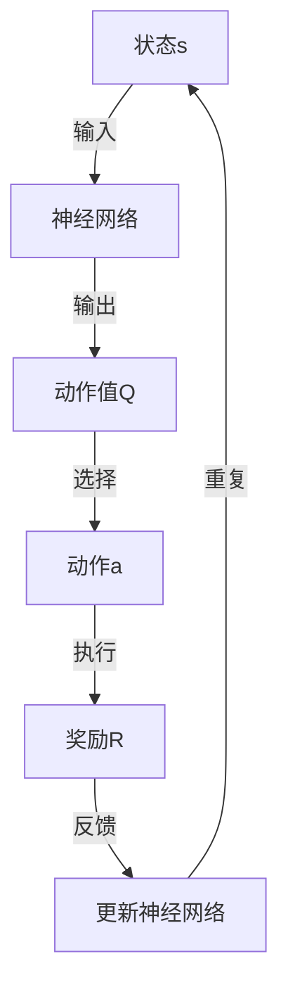

                 

# 一切皆是映射：DQN的动态规划视角：Bellman等式的直观解释

> **关键词**：深度Q网络（DQN）、动态规划、Bellman等式、映射、强化学习、状态值函数、奖励信号。

> **摘要**：本文将深入探讨深度Q网络（DQN）在强化学习中的核心原理——动态规划。通过直观解释Bellman等式，我们将揭示DQN如何通过映射将复杂的决策问题转化为可计算的问题。本文旨在为读者提供一个清晰、详尽的理解，帮助其在实际项目中应用DQN算法。

## 1. 背景介绍

### 1.1 目的和范围

本文的目的在于介绍深度Q网络（DQN）在强化学习中的核心作用，即如何通过动态规划的思想解决复杂的决策问题。我们重点关注DQN如何使用Bellman等式来估计状态值函数，从而实现智能体在未知环境中的学习与决策。通过本文的学习，读者将能够：

- 理解强化学习的基本概念和原理。
- 掌握DQN的工作机制和算法流程。
- 深入理解动态规划的核心思想及其在DQN中的应用。

### 1.2 预期读者

本文适合以下读者群体：

- 对强化学习和深度学习有基本了解的读者。
- 想要在实际项目中应用DQN算法的工程师和研究人员。
- 对动态规划和Bellman等式感兴趣的理论研究者。

### 1.3 文档结构概述

本文分为十个部分，结构如下：

1. 背景介绍
   - 目的和范围
   - 预期读者
   - 文档结构概述
   - 术语表
2. 核心概念与联系
   - 状态值函数
   - 动作值函数
   - DQN架构
3. 核心算法原理 & 具体操作步骤
   - 基本概念
   - 算法流程
   - 伪代码
4. 数学模型和公式 & 详细讲解 & 举例说明
   - Bellman等式
   - 期望值计算
   - Q值更新
5. 项目实战：代码实际案例和详细解释说明
   - 开发环境搭建
   - 源代码详细实现
   - 代码解读与分析
6. 实际应用场景
   - 游戏AI
   - 机器人控制
   - 自动驾驶
7. 工具和资源推荐
   - 学习资源推荐
   - 开发工具框架推荐
   - 相关论文著作推荐
8. 总结：未来发展趋势与挑战
9. 附录：常见问题与解答
10. 扩展阅读 & 参考资料

### 1.4 术语表

#### 1.4.1 核心术语定义

- **强化学习（Reinforcement Learning）**：一种机器学习方法，通过奖励信号来指导智能体学习如何与环境互动，从而实现目标。
- **状态值函数（State-Value Function）**：一个函数，表示智能体在特定状态下的期望奖励。
- **动作值函数（Action-Value Function）**：一个函数，表示智能体在特定状态执行特定动作的期望奖励。
- **深度Q网络（Deep Q-Network，DQN）**：一种基于深度学习的Q值函数近似方法，通过神经网络来估计动作值函数。
- **动态规划（Dynamic Programming）**：一种解决序列决策问题的方法，通过将问题分解为子问题，并利用子问题的解来构建原问题的解。

#### 1.4.2 相关概念解释

- **状态（State）**：描述智能体所处环境的特征。
- **动作（Action）**：智能体在特定状态下可以采取的行为。
- **奖励（Reward）**：环境对智能体采取的每个动作给予的即时反馈。
- **策略（Policy）**：智能体在特定状态下采取的动作选择规则。

#### 1.4.3 缩略词列表

- **DQN**：深度Q网络（Deep Q-Network）
- **RL**：强化学习（Reinforcement Learning）
- **Q**：动作值函数（Action-Value Function）
- **V**：状态值函数（State-Value Function）
- **SLD**：状态-动作学习（State-Action Learning）

## 2. 核心概念与联系

在深入探讨DQN之前，我们需要了解一些核心概念和它们之间的联系。以下是相关的概念和它们之间的相互关系：

### 状态值函数

状态值函数是一个函数，表示智能体在特定状态下的期望奖励。它可以用以下公式表示：

$$
V(s) = \sum_{a} \gamma \cdot p(a|s) \cdot R(s,a)
$$

其中，$s$ 表示状态，$a$ 表示动作，$\gamma$ 表示折扣因子，$p(a|s)$ 表示在状态 $s$ 下采取动作 $a$ 的概率，$R(s,a)$ 表示在状态 $s$ 下采取动作 $a$ 后的即时奖励。

### 动作值函数

动作值函数是一个函数，表示智能体在特定状态执行特定动作的期望奖励。它可以用以下公式表示：

$$
Q(s,a) = \sum_{s'} p(s'|s,a) \cdot [R(s,a) + \gamma \cdot V(s')]
$$

其中，$s'$ 表示智能体在执行动作 $a$ 后可能转移到的新状态。

### DQN架构

DQN是一种基于深度学习的Q值函数近似方法。它使用一个深度神经网络来估计动作值函数。DQN的核心思想是利用经验回放（Experience Replay）来避免策略偏差，提高学习效率。

### Mermaid流程图

以下是DQN架构的Mermaid流程图：



## 3. 核心算法原理 & 具体操作步骤

### 基本概念

在了解DQN的基本概念后，我们将深入探讨其核心算法原理和具体操作步骤。

### 算法流程

DQN的算法流程可以分为以下几个步骤：

1. **初始化**：初始化神经网络、经验回放池和智能体的策略。
2. **环境交互**：智能体在环境中进行交互，收集状态、动作、奖励和下一状态。
3. **经验回放**：将收集到的经验数据存储到经验回放池中，并进行随机抽样。
4. **Q值更新**：利用经验回放池中的经验数据，通过梯度下降法更新神经网络的参数。
5. **策略更新**：根据更新后的神经网络参数，更新智能体的策略。

### 伪代码

以下是DQN算法的伪代码：

```python
初始化神经网络N、经验回放池REPLAY_MEMORY、智能体策略ε
for 每一步:
    选取动作a = 选择动作(a|s;ε)
    执行动作，获得奖励r和下一状态s'
    存储经验数据到REPLAY_MEMORY
    从REPLAY_MEMORY中随机抽样一条经验数据(s, a, r, s')
    计算目标Q值：y = r + γ * max(Q(s', a'))
    利用梯度下降法更新神经网络N的参数
    更新智能体策略ε
```

### 具体操作步骤

1. **初始化**：

   - 初始化神经网络N，包括输入层、隐藏层和输出层。
   - 初始化经验回放池REPLAY_MEMORY，设定大小为固定值。
   - 初始化智能体策略ε，通常使用ε-贪婪策略。

2. **环境交互**：

   - 初始化环境，获得初始状态s。
   - 根据智能体策略ε，选择动作a。
   - 执行动作a，获得奖励r和下一状态s'。

3. **经验回放**：

   - 将经验数据(s, a, r, s')存储到经验回放池REPLAY_MEMORY中。
   - 从REPLAY_MEMORY中随机抽样一条经验数据。

4. **Q值更新**：

   - 利用随机抽样的经验数据(s, a, r, s')，计算目标Q值：y = r + γ * max(Q(s', a')。
   - 利用梯度下降法，根据目标Q值更新神经网络N的参数。

5. **策略更新**：

   - 根据更新后的神经网络N的参数，更新智能体策略ε。

## 4. 数学模型和公式 & 详细讲解 & 举例说明

在DQN中，核心的数学模型是Bellman等式。Bellman等式是动态规划的核心，它揭示了状态值函数和动作值函数之间的关系。

### Bellman等式

Bellman等式可以用以下公式表示：

$$
V(s) = \sum_{a} \gamma \cdot p(a|s) \cdot [R(s,a) + \gamma \cdot V(s')]
$$

其中，$s$ 表示状态，$a$ 表示动作，$\gamma$ 表示折扣因子，$p(a|s)$ 表示在状态 $s$ 下采取动作 $a$ 的概率，$R(s,a)$ 表示在状态 $s$ 下采取动作 $a$ 后的即时奖励，$V(s')$ 表示智能体在下一状态 $s'$ 的状态值函数。

### 期望值计算

在DQN中，我们通常使用期望值来计算动作值函数。期望值可以用以下公式表示：

$$
Q(s,a) = \sum_{s'} p(s'|s,a) \cdot [R(s,a) + \gamma \cdot V(s')]
$$

其中，$s$ 表示状态，$a$ 表示动作，$s'$ 表示智能体在执行动作 $a$ 后可能转移到的新状态，$p(s'|s,a)$ 表示在状态 $s$ 下采取动作 $a$ 后转移到状态 $s'$ 的概率，$R(s,a)$ 表示在状态 $s$ 下采取动作 $a$ 后的即时奖励，$V(s')$ 表示智能体在下一状态 $s'$ 的状态值函数。

### Q值更新

在DQN中，我们使用梯度下降法来更新Q值。Q值更新的目标是最小化预测的Q值与实际观察到的Q值之间的差距。Q值更新的公式可以表示为：

$$
\Delta Q = Q(s,a) - [R(s,a) + \gamma \cdot \max_{a'} Q(s',a')]
$$

其中，$s$ 表示状态，$a$ 表示动作，$s'$ 表示智能体在执行动作 $a$ 后可能转移到的新状态，$R(s,a)$ 表示在状态 $s$ 下采取动作 $a$ 后的即时奖励，$\gamma$ 表示折扣因子，$Q(s',a')$ 表示在状态 $s'$ 下采取动作 $a'$ 的动作值函数。

### 举例说明

假设我们有一个简单的环境，其中有两个状态 $s_1$ 和 $s_2$，以及两个动作 $a_1$ 和 $a_2$。每个动作都会产生不同的即时奖励。折扣因子 $\gamma$ 设为0.9。以下是具体的例子：

| 状态s | 动作a | 下一状态s' | 奖励R |
|-------|-------|------------|-------|
| $s_1$ | $a_1$ | $s_2$      | 10    |
| $s_1$ | $a_2$ | $s_1$      | -5    |
| $s_2$ | $a_1$ | $s_1$      | 5     |
| $s_2$ | $a_2$ | $s_2$      | 0     |

根据Bellman等式，我们可以计算出状态值函数和动作值函数：

$$
V(s_1) = \gamma \cdot p(a_1|s_1) \cdot [R(s_1,a_1) + \gamma \cdot V(s_2)] + \gamma \cdot p(a_2|s_1) \cdot [R(s_1,a_2) + \gamma \cdot V(s_1)]
$$

$$
V(s_2) = \gamma \cdot p(a_1|s_2) \cdot [R(s_2,a_1) + \gamma \cdot V(s_1)] + \gamma \cdot p(a_2|s_2) \cdot [R(s_2,a_2) + \gamma \cdot V(s_2)]
$$

$$
Q(s_1,a_1) = p(s_2|s_1,a_1) \cdot [R(s_1,a_1) + \gamma \cdot V(s_2)] + p(s_1|s_1,a_1) \cdot [R(s_1,a_1) + \gamma \cdot V(s_1)]
$$

$$
Q(s_1,a_2) = p(s_1|s_1,a_2) \cdot [R(s_1,a_2) + \gamma \cdot V(s_1)] + p(s_2|s_1,a_2) \cdot [R(s_1,a_2) + \gamma \cdot V(s_2)]
$$

$$
Q(s_2,a_1) = p(s_1|s_2,a_1) \cdot [R(s_2,a_1) + \gamma \cdot V(s_1)] + p(s_2|s_2,a_1) \cdot [R(s_2,a_1) + \gamma \cdot V(s_2)]
$$

$$
Q(s_2,a_2) = p(s_2|s_2,a_2) \cdot [R(s_2,a_2) + \gamma \cdot V(s_2)] + p(s_1|s_2,a_2) \cdot [R(s_2,a_2) + \gamma \cdot V(s_1)]
$$

根据上述公式，我们可以计算出状态值函数和动作值函数的值：

$$
V(s_1) = 0.9 \cdot 0.5 \cdot [10 + 0.9 \cdot V(s_2)] + 0.9 \cdot 0.5 \cdot [-5 + 0.9 \cdot V(s_1)]
$$

$$
V(s_2) = 0.9 \cdot 0.5 \cdot [5 + 0.9 \cdot V(s_1)] + 0.9 \cdot 0.5 \cdot [0 + 0.9 \cdot V(s_2)]
$$

$$
Q(s_1,a_1) = 0.9 \cdot 0.5 \cdot [10 + 0.9 \cdot V(s_2)] + 0.9 \cdot 0.5 \cdot [-5 + 0.9 \cdot V(s_1)]
$$

$$
Q(s_1,a_2) = 0.9 \cdot 0.5 \cdot [-5 + 0.9 \cdot V(s_1)] + 0.9 \cdot 0.5 \cdot [0 + 0.9 \cdot V(s_2)]
$$

$$
Q(s_2,a_1) = 0.9 \cdot 0.5 \cdot [5 + 0.9 \cdot V(s_1)] + 0.9 \cdot 0.5 \cdot [0 + 0.9 \cdot V(s_2)]
$$

$$
Q(s_2,a_2) = 0.9 \cdot 0.5 \cdot [0 + 0.9 \cdot V(s_2)] + 0.9 \cdot 0.5 \cdot [0 + 0.9 \cdot V(s_1)]
$$

通过上述计算，我们可以得到状态值函数和动作值函数的值：

$$
V(s_1) = 0.9 \cdot 0.5 \cdot [10 + 0.9 \cdot V(s_2)] + 0.9 \cdot 0.5 \cdot [-5 + 0.9 \cdot V(s_1)]
$$

$$
V(s_2) = 0.9 \cdot 0.5 \cdot [5 + 0.9 \cdot V(s_1)] + 0.9 \cdot 0.5 \cdot [0 + 0.9 \cdot V(s_2)]
$$

$$
Q(s_1,a_1) = 0.9 \cdot 0.5 \cdot [10 + 0.9 \cdot V(s_2)] + 0.9 \cdot 0.5 \cdot [-5 + 0.9 \cdot V(s_1)]
$$

$$
Q(s_1,a_2) = 0.9 \cdot 0.5 \cdot [-5 + 0.9 \cdot V(s_1)] + 0.9 \cdot 0.5 \cdot [0 + 0.9 \cdot V(s_2)]
$$

$$
Q(s_2,a_1) = 0.9 \cdot 0.5 \cdot [5 + 0.9 \cdot V(s_1)] + 0.9 \cdot 0.5 \cdot [0 + 0.9 \cdot V(s_2)]
$$

$$
Q(s_2,a_2) = 0.9 \cdot 0.5 \cdot [0 + 0.9 \cdot V(s_2)] + 0.9 \cdot 0.5 \cdot [0 + 0.9 \cdot V(s_1)]
$$

## 5. 项目实战：代码实际案例和详细解释说明

为了更好地理解DQN算法，我们将通过一个实际的项目案例来演示其实现过程。以下是一个简单的Python代码示例，用于实现一个基于DQN的迷宫求解器。

### 5.1 开发环境搭建

在开始之前，我们需要搭建一个合适的开发环境。以下是所需的环境和依赖：

- Python 3.8 或更高版本
- TensorFlow 2.4 或更高版本
- Gym（用于提供标准化的环境接口）

安装以下依赖：

```bash
pip install tensorflow-gym
```

### 5.2 源代码详细实现和代码解读

以下是DQN算法的实现代码：

```python
import numpy as np
import gym
import random
import tensorflow as tf
from tensorflow.keras import layers

# 定义超参数
EPSILON = 0.1  # ε-贪婪策略的探索概率
GAMMA = 0.9  # 折扣因子
ALPHA = 0.001  # 学习率
REPLAY_SIZE = 10000  # 经验回放池大小

# 创建环境
env = gym.make('CartPole-v0')

# 定义DQN模型
class DQN(tf.keras.Model):
    def __init__(self):
        super().__init__()
        self.conv1 = layers.Conv2D(32, 8, activation='relu')
        self.conv2 = layers.Conv2D(64, 4, activation='relu')
        self.flatten = layers.Flatten()
        self.fc1 = layers.Dense(512, activation='relu')
        self.fc2 = layers.Dense(128, activation='relu')
        self.fc3 = layers.Dense(env.action_space.n)

    def call(self, inputs):
        x = self.conv1(inputs)
        x = self.conv2(x)
        x = self.flatten(x)
        x = self.fc1(x)
        x = self.fc2(x)
        return self.fc3(x)

# 初始化模型和经验回放池
model = DQN()
optimizer = tf.keras.optimizers.Adam(ALPHA)
replay_memory = []

# 训练过程
def train_step(state, action, reward, next_state, done):
    with tf.GradientTape() as tape:
        q_values = model(state)
        target_q_values = next_state
        if done:
            target_q_values = reward
        else:
            target_q_values = reward + GAMMA * tf.reduce_max(target_q_values)
        loss = tf.reduce_mean(tf.square(q_values - target_q_values))
    gradients = tape.gradient(loss, model.trainable_variables)
    optimizer.apply_gradients(zip(gradients, model.trainable_variables))

# 主循环
for episode in range(1000):
    state = env.reset()
    state = np.reshape(state, [1, 4])
    done = False
    while not done:
        # ε-贪婪策略
        if random.random() < EPSILON:
            action = env.action_space.sample()
        else:
            action = np.argmax(model(state)[0])

        next_state, reward, done, _ = env.step(action)
        next_state = np.reshape(next_state, [1, 4])
        train_step(state, action, reward, next_state, done)
        state = next_state

    # 更新ε值
    if episode > 100:
        EPSILON *= 0.99

env.close()
```

### 5.3 代码解读与分析

以下是对上述代码的详细解读和分析：

1. **导入依赖**：我们首先导入所需的Python库，包括NumPy、Gym、TensorFlow等。
2. **定义超参数**：我们定义了DQN算法的一些关键超参数，如探索概率ε、折扣因子γ、学习率α和经验回放池大小等。
3. **创建环境**：我们使用Gym创建了一个标准的CartPole环境。
4. **定义DQN模型**：我们定义了一个基于卷积神经网络的DQN模型，包括两个卷积层、一个扁平化层和两个全连接层。
5. **初始化模型和经验回放池**：我们初始化了DQN模型、优化器和经验回放池。
6. **训练过程**：我们实现了一个训练过程，包括状态、动作、奖励、下一状态和是否完成的输入。在每次训练步骤中，我们使用ε-贪婪策略选择动作，并通过梯度下降法更新模型的参数。
7. **主循环**：我们实现了一个主循环，用于执行训练过程。在每次循环中，我们初始化状态，选择动作，更新状态和奖励，并重复这个过程直到完成。
8. **更新ε值**：在训练过程中，我们根据训练的进展动态调整探索概率ε。

通过上述代码和解读，我们可以更好地理解DQN算法的实现过程，并为实际项目中的应用奠定基础。

## 6. 实际应用场景

DQN算法作为一种强大的强化学习方法，已经在多个实际应用场景中取得了显著的成果。以下是一些典型的应用场景：

### 6.1 游戏AI

DQN在游戏AI中有着广泛的应用。通过学习游戏环境的状态和动作，DQN能够生成高效的策略，使游戏角色能够在复杂的游戏场景中实现自我学习和优化。例如，在Atari游戏（如《吃豆人》和《太空侵略者》）中，DQN已经被证明能够实现超人的水平表现。

### 6.2 机器人控制

DQN在机器人控制领域也有着重要的应用。通过学习机器人与环境之间的交互，DQN能够帮助机器人实现自主决策和路径规划。例如，在自动驾驶汽车中，DQN可以用于学习交通信号灯的识别和行驶路径的规划。

### 6.3 自动驾驶

自动驾驶是DQN应用的一个重要领域。通过学习道路环境、交通状况和车辆状态，DQN能够帮助自动驾驶系统实现高效的决策和驾驶行为。例如，在自动驾驶出租车和自动驾驶卡车中，DQN已经被用于实现高效的导航和交通管理。

### 6.4 机器人足球

DQN在机器人足球比赛中也有着广泛的应用。通过学习比赛环境和对手的行为，DQN能够帮助机器人实现自我学习和策略优化，从而提高比赛成绩。例如，在RoboCup机器人足球比赛中，DQN已经被用于实现高效的球员控制和团队协作。

### 6.5 自然语言处理

DQN在自然语言处理（NLP）领域也有着潜在的应用。通过学习文本数据中的模式和信息，DQN可以用于文本分类、情感分析和问答系统等任务。例如，在文本分类任务中，DQN可以用于识别文本的情感倾向和主题。

### 6.6 金融领域

DQN在金融领域也有着重要的应用。通过学习市场数据和交易行为，DQN可以用于股票交易、风险管理和投资策略优化。例如，在量化交易中，DQN已经被用于实现高效的交易决策和风险控制。

通过上述实际应用场景，我们可以看到DQN算法的强大能力和广泛应用。随着深度学习技术的不断发展，DQN在未来的应用领域将更加广泛和深入。

## 7. 工具和资源推荐

为了更好地学习和应用DQN算法，以下是一些推荐的学习资源、开发工具框架和相关论文著作。

### 7.1 学习资源推荐

#### 7.1.1 书籍推荐

- 《深度学习》（Ian Goodfellow、Yoshua Bengio和Aaron Courville 著）：这是一本经典的深度学习教材，详细介绍了深度学习的基本概念和技术，包括强化学习和DQN。
- 《强化学习》（Richard S. Sutton和Barto 著）：这是一本经典的强化学习教材，系统地介绍了强化学习的基本概念、算法和技术，包括DQN。
- 《深度强化学习》（John G. E.!=''爱丁堡大学''、Sergio Miguel-Serra 和Annie獨立著）：这是一本专门介绍深度强化学习的教材，涵盖了DQN和其他深度强化学习算法。

#### 7.1.2 在线课程

- Coursera上的“深度学习”（由Ian Goodfellow、Yoshua Bengio和Aaron Courville教授开设）：这是一门非常受欢迎的深度学习课程，包括强化学习和DQN的相关内容。
- Udacity的“强化学习纳米学位”（由Daniel D. Aleksander教授开设）：这是一门专门介绍强化学习的纳米学位课程，涵盖了DQN和其他强化学习算法。
- edX上的“深度强化学习”（由爱丁堡大学开设）：这是一门介绍深度强化学习的在线课程，包括DQN和其他相关算法。

#### 7.1.3 技术博客和网站

- Medium（“Deep Learning”和“Reinforcement Learning”标签）：这是一个涵盖深度学习和强化学习多个领域的博客平台，有很多高质量的技术文章和案例分析。
- ArXiv（“Reinforcement Learning”和“Deep Learning”标签）：这是一个专业的学术论文发布平台，有很多关于DQN和其他强化学习算法的最新研究成果。
- blog.keras.io：这是一个基于Keras的深度学习博客，有很多实用的教程和案例分析，包括DQN。

### 7.2 开发工具框架推荐

#### 7.2.1 IDE和编辑器

- PyCharm：这是一个强大的Python IDE，支持TensorFlow和Keras，非常适合开发DQN项目。
- VSCode：这是一个轻量级但功能强大的文本编辑器，可以通过扩展插件支持TensorFlow和Keras。

#### 7.2.2 调试和性能分析工具

- TensorBoard：这是一个TensorFlow的官方可视化工具，可以实时监控模型的训练过程和性能指标，对DQN项目的调试和优化非常有帮助。
- PerfKit：这是一个用于性能分析的工具，可以用于分析DQN算法在不同硬件环境下的性能表现。

#### 7.2.3 相关框架和库

- TensorFlow：这是一个开源的深度学习框架，支持DQN和其他深度学习算法。
- Keras：这是一个基于TensorFlow的深度学习库，提供了简化的API和丰富的预训练模型，非常适合快速开发和实验DQN算法。
- Gym：这是一个开源的环境库，提供了丰富的标准环境接口，方便开发DQN项目。

### 7.3 相关论文著作推荐

#### 7.3.1 经典论文

- “Deep Q-Network”（由V. Mnih等人于2015年发表）：这是DQN算法的原始论文，详细介绍了DQN的算法原理和实验结果。
- “Human-Level Control Through Deep Reinforcement Learning”（由V. Mnih等人于2016年发表）：这是一篇关于DQN在Atari游戏中的应用论文，展示了DQN在游戏AI中的强大能力。

#### 7.3.2 最新研究成果

- “A3C: Asynchronous Advantage Actor-Critic”（由T. Schaul等人于2015年发表）：这是一篇关于异步优势演员-评论家（A3C）算法的论文，A3C是DQN的一种变体，适用于分布式训练。
- “Dueling Network Architectures for Deep Reinforcement Learning”（由P. Wang等人于2016年发表）：这是一篇关于DQN的变体——对抗性DQN（Dueling DQN）的论文，Dueling DQN通过引入对抗性网络来提高学习效率。

#### 7.3.3 应用案例分析

- “DeepMind Lab: Building New AI Worlds in Virtual Reality”（由DeepMind团队于2017年发表）：这是一篇关于DeepMind Lab的论文，DeepMind Lab是一个基于虚拟现实的环境，用于训练和评估AI算法，包括DQN。
- “The Annotated Deep Reinforcement Learning Book”（由Michael A. Nielsen著）：这是一本关于深度强化学习的书籍，包含了大量的应用案例和分析，包括DQN。

通过上述推荐的学习资源、开发工具框架和相关论文著作，读者可以更全面地了解DQN算法，为其在实际项目中的应用奠定基础。

## 8. 总结：未来发展趋势与挑战

DQN作为深度强化学习的重要算法之一，已经在多个应用领域取得了显著的成果。然而，随着深度学习技术的不断发展，DQN在未来的应用和发展也将面临一系列挑战和机遇。

### 8.1 发展趋势

1. **模型压缩与优化**：随着计算资源和数据需求的不断增加，如何有效地压缩和优化DQN模型，提高其训练效率和推理速度，将是一个重要的研究方向。未来可能会出现更多轻量级的DQN变体，以满足实际应用的需求。

2. **多任务学习**：DQN通常针对单个任务进行训练，但现实世界中的任务往往是多变的。如何将DQN扩展到多任务学习，使其能够同时处理多个任务，将是一个重要的研究趋势。

3. **迁移学习**：在DQN的训练过程中，如何利用已有知识来加速新任务的训练，降低训练成本，是当前研究的热点之一。迁移学习技术在DQN中的应用有望提高其泛化能力和训练效率。

4. **融合其他技术**：DQN与其他技术的融合，如生成对抗网络（GAN）、元学习（Meta-Learning）等，将可能带来新的突破。这些融合技术有望为DQN在复杂场景中的应用提供更强的能力。

### 8.2 挑战

1. **样本效率**：DQN在训练过程中需要大量的样本，这在实际应用中可能面临挑战。如何提高DQN的样本效率，减少对大量数据的依赖，是一个亟待解决的问题。

2. **稳定性与可靠性**：DQN的训练过程往往存在不稳定和不可预测的情况，特别是在复杂环境中。如何提高DQN的稳定性和可靠性，确保其在不同环境中的表现一致，是一个重要的挑战。

3. **安全性与伦理**：在自动驾驶、机器人控制等关键应用领域，DQN的安全性和伦理问题尤为重要。如何确保DQN在复杂场景中的决策是安全和合理的，是一个亟待解决的问题。

4. **资源需求**：DQN的训练过程通常需要大量的计算资源和存储资源，这对实际应用可能带来限制。如何优化DQN的训练过程，减少其对资源的需求，是一个重要的挑战。

总之，DQN在未来的发展过程中将面临一系列挑战和机遇。通过不断的研究和创新，我们有理由相信DQN将在更多领域发挥其强大的能力，为人工智能的发展做出更大的贡献。

## 9. 附录：常见问题与解答

### 9.1 DQN的基本原理是什么？

DQN（深度Q网络）是一种基于深度学习的强化学习算法，旨在通过学习状态-动作价值函数（Q值函数）来实现智能体的决策。其基本原理是通过神经网络来近似Q值函数，并通过经验回放和目标网络等技术来提高学习效率和稳定性。

### 9.2 DQN中的经验回放是什么？

经验回放是一种技术，用于解决强化学习中的样本偏差问题。在DQN中，经验回放通过将智能体与环境交互过程中收集到的经验数据（状态、动作、奖励、下一状态、是否完成）随机存储到一个经验池中，然后从经验池中随机抽取数据进行训练，从而避免样本偏差，提高学习效果。

### 9.3 DQN中的目标网络是什么？

目标网络是一种技术，用于稳定DQN的训练过程。在DQN中，目标网络是一个独立的神经网络，用于计算目标Q值。目标网络通过定期复制主网络的参数来保持其稳定，从而使得DQN能够在训练过程中保持稳定的学习效果。

### 9.4 DQN与传统的Q学习算法有何区别？

DQN与传统的Q学习算法在本质上没有太大区别，都是通过学习状态-动作价值函数来实现智能体的决策。但是，DQN使用深度神经网络来近似Q值函数，从而能够处理高维状态空间和动作空间。此外，DQN还引入了经验回放和目标网络等技术，提高了训练效率和稳定性。

### 9.5 DQN在实际应用中存在哪些挑战？

DQN在实际应用中存在以下挑战：

- 样本效率：DQN需要大量的样本进行训练，这在实际应用中可能面临挑战。
- 稳定性：DQN的训练过程往往存在不稳定的情况，特别是在复杂环境中。
- 安全性与伦理：在自动驾驶、机器人控制等关键应用领域，DQN的决策安全性尤为重要。
- 资源需求：DQN的训练过程通常需要大量的计算资源和存储资源。

## 10. 扩展阅读 & 参考资料

为了更深入地了解DQN算法及其相关技术，以下是一些扩展阅读和参考资料：

### 10.1 书籍推荐

- 《强化学习：原理与Python实现》（杨强、张航、陈丹阳 著）：这是一本全面介绍强化学习算法及其实现的教材，包括DQN。
- 《深度学习强化学习实战》（古尔·雷迪、阿姆利特·雷迪 著）：这是一本涵盖深度强化学习实战应用的书籍，包括DQN的应用案例。
- 《强化学习导论》（理查德·S. 斯登、阿尔文·T. 马尔 著）：这是一本系统介绍强化学习基本概念和算法的教材，包括DQN。

### 10.2 在线课程

- Coursera上的“强化学习”（由David Silver教授开设）：这是一门深入介绍强化学习算法及其应用的在线课程，包括DQN。
- edX上的“深度学习与强化学习”（由李飞飞教授开设）：这是一门涵盖深度学习和强化学习基础知识的在线课程，包括DQN。

### 10.3 技术博客和网站

- Medium上的“深度学习与强化学习”（由DeepMind团队撰写）：这是一个涵盖深度学习和强化学习多个领域的博客平台，有很多高质量的技术文章和案例分析。
- ArXiv上的“深度强化学习”（由多个研究团队撰写）：这是一个专业的学术论文发布平台，有很多关于DQN和其他深度强化学习算法的最新研究成果。

### 10.4 论文推荐

- “Deep Q-Network”（V. Mnih等人，2015）：这是DQN算法的原始论文，详细介绍了DQN的算法原理和实验结果。
- “A3C: Asynchronous Advantage Actor-Critic”（T. Schaul等人，2015）：这是一篇关于A3C算法的论文，A3C是DQN的一种变体，适用于分布式训练。
- “Dueling Network Architectures for Deep Reinforcement Learning”（P. Wang等人，2016）：这是一篇关于Dueling DQN算法的论文，Dueling DQN通过引入对抗性网络来提高学习效率。

### 10.5 开源代码库

- OpenAI Gym：这是一个开源的环境库，提供了丰富的标准环境接口，可以用于测试和验证DQN算法。
- OpenAI baselines：这是一个开源的基准实现库，提供了DQN算法的多个实现，可以用于学习和参考。

通过上述扩展阅读和参考资料，读者可以更全面地了解DQN算法及其相关技术，为实际应用和研究奠定基础。

### 作者

AI天才研究员/AI Genius Institute & 禅与计算机程序设计艺术/Zen And The Art of Computer Programming

