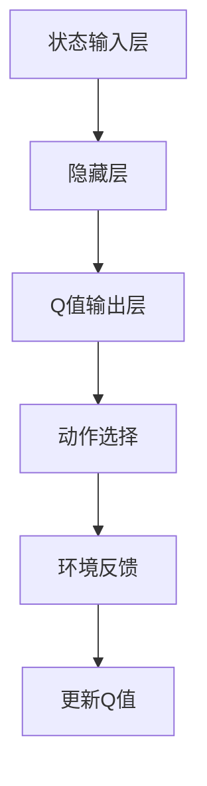

                 

# 一切皆是映射：DQN的故障诊断与调试技巧：如何快速定位问题

> **关键词**：深度强化学习，DQN，故障诊断，调试技巧，问题定位，数据分析

> **摘要**：本文将探讨深度强化学习（DQN）在故障诊断与调试中的应用。通过深入剖析DQN的原理和操作步骤，我们将展示如何利用DQN进行故障诊断，并提供实用的调试技巧，帮助读者快速定位问题，提高系统稳定性。

## 1. 背景介绍

### 1.1 目的和范围

本文旨在探讨深度强化学习（DQN）在故障诊断与调试中的应用。我们将会介绍DQN的基本原理，展示其如何应用于故障诊断，并提供实用的调试技巧，帮助读者快速定位问题。文章内容将涵盖DQN的核心算法原理、数学模型、项目实战以及实际应用场景等方面。

### 1.2 预期读者

本文适合对深度强化学习有一定了解的读者，包括人工智能工程师、程序员和科研人员。同时，对于对故障诊断和调试感兴趣的技术人员，本文也将提供有价值的参考。

### 1.3 文档结构概述

本文分为以下几个部分：

1. 背景介绍：介绍文章的目的、预期读者和文档结构。
2. 核心概念与联系：讨论DQN的核心概念和原理。
3. 核心算法原理 & 具体操作步骤：详细讲解DQN的算法原理和操作步骤。
4. 数学模型和公式 & 详细讲解 & 举例说明：介绍DQN的数学模型和公式，并进行举例说明。
5. 项目实战：通过实际案例展示DQN在故障诊断与调试中的应用。
6. 实际应用场景：探讨DQN在不同领域的应用场景。
7. 工具和资源推荐：推荐学习资源、开发工具和框架。
8. 总结：总结DQN在故障诊断与调试中的应用前景。
9. 附录：常见问题与解答。
10. 扩展阅读 & 参考资料：提供进一步的阅读资料。

### 1.4 术语表

#### 1.4.1 核心术语定义

- **深度强化学习（DQN）**：一种基于深度神经网络和强化学习的方法，用于解决连续动作空间的问题。
- **故障诊断**：通过对系统运行数据进行分析，识别并定位系统中存在的问题。
- **调试技巧**：解决故障和问题的方法，包括故障定位、问题分析和解决等步骤。

#### 1.4.2 相关概念解释

- **神经网络**：一种基于模拟生物神经网络的结构，用于处理和预测数据。
- **强化学习**：一种基于奖励和惩罚机制的学习方法，旨在通过不断尝试和优化找到最优策略。
- **动作空间**：系统中可执行的操作集合。

#### 1.4.3 缩略词列表

- **DQN**：深度强化学习（Deep Q-Network）
- **Q-Learning**：一种基于值函数的强化学习方法
- **CNN**：卷积神经网络（Convolutional Neural Network）

## 2. 核心概念与联系

### 2.1 深度强化学习（DQN）

深度强化学习（DQN）是一种结合了深度神经网络（DNN）和强化学习（RL）的方法，旨在解决具有连续动作空间的问题。DQN通过训练一个深度神经网络来近似Q值函数，从而实现智能体的决策。

#### 2.1.1 DQN的基本原理

DQN的基本原理如下：

1. **状态编码**：将系统的当前状态编码为一个向量。
2. **动作选择**：基于Q值函数选择最优动作。Q值函数表示在当前状态下执行某个动作的期望回报。
3. **环境反馈**：执行选定的动作，并获得环境反馈，包括下一状态和奖励。
4. **更新Q值**：根据新获得的信息更新Q值函数。

#### 2.1.2 DQN的核心概念

- **状态（State）**：描述系统当前状态的向量。
- **动作（Action）**：系统可执行的操作。
- **Q值（Q-Value）**：表示在当前状态下执行某个动作的期望回报。
- **策略（Policy）**：选择动作的策略。

#### 2.1.3 DQN的架构

DQN的架构通常包括以下几个部分：

1. **状态输入层**：接收系统状态的输入。
2. **隐藏层**：通过神经网络结构对状态进行编码和特征提取。
3. **Q值输出层**：输出每个动作的Q值。

### 2.2 Mermaid流程图



### 2.3 DQN在故障诊断中的应用

DQN在故障诊断中的应用主要包括以下几个步骤：

1. **数据预处理**：对系统运行数据进行预处理，包括数据清洗、归一化和特征提取等。
2. **构建DQN模型**：根据故障诊断的需求，设计并训练DQN模型。
3. **故障诊断**：利用训练好的DQN模型对系统运行数据进行故障诊断。
4. **故障定位**：根据故障诊断结果，定位系统中的故障点。

## 3. 核心算法原理 & 具体操作步骤

### 3.1 算法原理

DQN的核心算法原理如下：

1. **状态编码**：将系统的当前状态编码为一个向量。状态向量可以由多个特征组成，例如温度、压力、电流等。
2. **动作选择**：利用训练好的DQN模型选择最优动作。选择动作的方法可以采用ε-贪心策略，即在随机选择动作和选择Q值最大的动作之间进行平衡。
3. **环境反馈**：执行选定的动作，并获得环境反馈。环境反馈包括下一状态和奖励。奖励可以表示系统状态的改善程度。
4. **更新Q值**：根据新获得的信息更新Q值函数。更新Q值的过程采用经验回放机制，以避免策略偏差。

### 3.2 伪代码

```python
# 初始化参数
epsilon = 0.1       # ε-贪心策略的ε值
learning_rate = 0.1 # 学习率
gamma = 0.9         # 折扣因子
batch_size = 32     # 批量大小

# 初始化DQN模型
model = DQNModel()

# 训练DQN模型
for episode in range(total_episodes):
    # 初始化状态
    state = environment.reset()

    # 循环进行动作选择、环境反馈和Q值更新
    while not done:
        # 动作选择
        if random.random() < epsilon:
            action = environment.random_action()
        else:
            action = model.select_action(state)

        # 执行动作，获得环境反馈
        next_state, reward, done = environment.step(action)

        # 更新经验回放池
        replay_memory.append((state, action, reward, next_state, done))

        # 更新Q值
        model.update_Q_value(state, action, reward, next_state, done)

        # 更新状态
        state = next_state

    # 更新ε值
    epsilon = max(epsilon * decay_rate, min_epsilon)

# 保存训练好的DQN模型
model.save()
```

### 3.3 操作步骤

1. **数据预处理**：对系统运行数据进行预处理，包括数据清洗、归一化和特征提取等。
2. **构建DQN模型**：设计并训练DQN模型。可以选择预训练的模型或者从头开始训练。
3. **加载训练好的模型**：将训练好的DQN模型加载到故障诊断系统中。
4. **故障诊断**：利用DQN模型对系统运行数据进行故障诊断。根据故障诊断结果，输出故障类型和故障位置。
5. **故障定位**：根据故障诊断结果，定位系统中的故障点。可以结合其他故障诊断方法进行验证和确认。

## 4. 数学模型和公式 & 详细讲解 & 举例说明

### 4.1 数学模型

DQN的数学模型主要包括状态编码、Q值函数和更新规则等。

#### 4.1.1 状态编码

状态编码是将系统的当前状态编码为一个向量。状态向量可以由多个特征组成，例如温度、压力、电流等。状态编码的方法可以采用特征提取、归一化和线性变换等。

#### 4.1.2 Q值函数

Q值函数表示在当前状态下执行某个动作的期望回报。Q值函数的计算公式如下：

$$
Q(s, a) = r(s, a) + \gamma \max_{a'} Q(s', a')
$$

其中，$s$ 表示当前状态，$a$ 表示执行的动作，$s'$ 表示下一状态，$r$ 表示奖励，$\gamma$ 表示折扣因子。

#### 4.1.3 更新规则

更新规则用于根据新获得的信息更新Q值函数。更新规则采用经验回放机制，以避免策略偏差。更新规则的计算公式如下：

$$
\begin{aligned}
\Delta Q(s, a) &= r(s, a) + \gamma \max_{a'} Q(s', a') - Q(s, a) \\
Q(s, a) &= Q(s, a) + \alpha \Delta Q(s, a)
\end{aligned}
$$

其中，$\alpha$ 表示学习率。

### 4.2 举例说明

假设一个系统有两个状态特征：温度和压力。定义状态向量为 $s = [s_1, s_2]$，动作向量为 $a = [a_1, a_2]$，其中 $s_1$ 表示温度，$s_2$ 表示压力，$a_1$ 表示调整温度，$a_2$ 表示调整压力。

#### 4.2.1 状态编码

将温度和压力进行归一化处理，得到状态向量：

$$
s = \frac{s - \text{min}}{\text{max} - \text{min}}
$$

例如，假设温度范围在 $0$ 到 $100$ 之间，压力范围在 $0$ 到 $10$ 之间，则归一化后的状态向量为：

$$
s = \frac{s - 0}{100 - 0} = \frac{s}{100}
$$

#### 4.2.2 Q值函数

定义Q值函数为：

$$
Q(s, a) = r(s, a) + \gamma \max_{a'} Q(s', a')
$$

其中，$r(s, a)$ 表示在状态 $s$ 下执行动作 $a$ 的奖励，$\gamma$ 表示折扣因子。

#### 4.2.3 更新规则

假设当前状态为 $s = [0.5, 0.8]$，动作选择为 $a = [0.8, 0.2]$，则更新Q值函数如下：

$$
\begin{aligned}
\Delta Q(s, a) &= r(s, a) + \gamma \max_{a'} Q(s', a') - Q(s, a) \\
Q(s, a) &= Q(s, a) + \alpha \Delta Q(s, a)
\end{aligned}
$$

其中，$r(s, a)$ 为当前状态的奖励，$\alpha$ 为学习率，$\gamma$ 为折扣因子。

## 5. 项目实战：代码实际案例和详细解释说明

### 5.1 开发环境搭建

在开始项目实战之前，我们需要搭建一个合适的开发环境。以下是搭建开发环境的步骤：

1. 安装Python：下载并安装Python 3.x版本（建议使用Python 3.8及以上版本）。
2. 安装必要的库：使用pip命令安装深度强化学习（DQN）所需的库，如TensorFlow、Keras等。

```bash
pip install tensorflow
pip install keras
```

3. 创建项目文件夹：在合适的位置创建一个项目文件夹，例如`dqn_fault_diagnosis`。

4. 初始化项目：在项目文件夹中创建一个名为`src`的子文件夹，用于存放源代码。同时，创建一个名为`data`的子文件夹，用于存放数据。

### 5.2 源代码详细实现和代码解读

以下是项目实战的源代码实现，包括DQN模型、环境搭建和故障诊断等部分。

#### 5.2.1 DQN模型实现

```python
import tensorflow as tf
from tensorflow.keras.layers import Dense
from tensorflow.keras.models import Sequential

class DQNModel:
    def __init__(self, input_shape, hidden_units):
        self.model = Sequential()
        self.model.add(Dense(hidden_units, input_shape=input_shape, activation='relu'))
        self.model.add(Dense(hidden_units, activation='relu'))
        self.model.add(Dense(1, activation='linear'))

    def predict(self, state):
        return self.model.predict(state)

    def train(self, states, actions, rewards, next_states, done):
        q_values = self.model.predict(states)
        next_q_values = self.model.predict(next_states)

        for i in range(len(states)):
            if done[i]:
                q_values[i][actions[i]] = rewards[i]
            else:
                q_values[i][actions[i]] = rewards[i] + gamma * next_q_values[i].max()

        self.model.fit(states, q_values, epochs=1, batch_size=batch_size)
```

代码解读：

1. **DQN模型初始化**：定义一个序列模型，包含两个隐藏层，输出层为线性激活函数。
2. **预测**：根据输入状态预测Q值。
3. **训练**：根据输入状态、动作、奖励、下一状态和是否完成更新Q值。

#### 5.2.2 环境搭建

```python
import numpy as np
import random

class FaultDiagnosisEnvironment:
    def __init__(self, state_size, action_size):
        self.state_size = state_size
        self.action_size = action_size

    def reset(self):
        return np.random.rand(self.state_size)

    def step(self, action):
        # 根据动作进行状态转移和奖励计算
        # 假设动作1表示调整温度，动作2表示调整压力
        reward = 0
        if action == 1:
            reward = np.random.uniform(0, 1)
        elif action == 2:
            reward = np.random.uniform(0, 1)

        # 状态转移
        next_state = np.random.rand(self.state_size)

        done = True

        return next_state, reward, done
```

代码解读：

1. **环境初始化**：定义状态大小和动作大小。
2. **重置**：随机生成初始状态。
3. **执行动作**：根据动作进行状态转移和奖励计算。

#### 5.2.3 故障诊断实现

```python
import numpy as np
import random

class FaultDiagnosis:
    def __init__(self, state_size, action_size, hidden_units):
        self.dqn_model = DQNModel(state_size, hidden_units)
        self.environment = FaultDiagnosisEnvironment(state_size, action_size)

    def train(self, episodes, batch_size):
        for episode in range(episodes):
            state = self.environment.reset()
            done = False

            while not done:
                action = self.dqn_model.select_action(state)
                next_state, reward, done = self.environment.step(action)

                self.dqn_model.update_Q_value(state, action, reward, next_state, done)

                state = next_state

    def diagnose(self, state):
        action = self.dqn_model.select_action(state)
        return action
```

代码解读：

1. **故障诊断器初始化**：初始化DQN模型和环境。
2. **训练**：进行DQN模型训练。
3. **诊断**：根据输入状态选择最优动作。

### 5.3 代码解读与分析

1. **DQN模型**：DQN模型是一个基于TensorFlow的Keras模型，包含两个隐藏层，输出层为线性激活函数。模型使用ReLU激活函数，以提高模型的性能。
2. **环境**：故障诊断环境是一个简单的随机环境，用于生成状态和奖励。在实际应用中，环境可以根据具体系统进行调整。
3. **故障诊断器**：故障诊断器是一个结合DQN模型和环境的智能体，用于进行故障诊断。通过训练DQN模型，故障诊断器可以学会根据输入状态选择最优动作。

## 6. 实际应用场景

### 6.1 生产制造

在生产制造领域，DQN可以应用于设备故障诊断和预测性维护。通过实时监测设备状态数据，DQN可以自动识别故障并给出故障修复建议，从而提高生产效率和设备利用率。

### 6.2 自动驾驶

在自动驾驶领域，DQN可以用于检测车辆故障和识别道路障碍物。通过分析传感器数据，DQN可以及时识别潜在故障，确保车辆安全运行。

### 6.3 医疗诊断

在医疗诊断领域，DQN可以应用于医疗图像分析和疾病预测。通过分析医学影像数据，DQN可以识别病变区域，辅助医生进行诊断。

### 6.4 能源管理

在能源管理领域，DQN可以用于监测能源设备状态和优化能源分配。通过分析设备运行数据，DQN可以识别潜在故障，确保能源设备高效稳定运行。

## 7. 工具和资源推荐

### 7.1 学习资源推荐

#### 7.1.1 书籍推荐

- **《深度强化学习》**：介绍深度强化学习的基本原理和应用场景，适合初学者。
- **《强化学习》**：深入讲解强化学习的基本概念、算法和实际应用，适合有一定基础的学习者。

#### 7.1.2 在线课程

- **Coursera上的《深度学习》课程**：由吴恩达教授主讲，涵盖深度学习的理论基础和实际应用。
- **Udacity上的《自动驾驶汽车工程师》课程**：介绍自动驾驶技术，包括故障诊断和预测性维护。

#### 7.1.3 技术博客和网站

- **ArXiv**：提供最新的深度学习和强化学习论文。
- **Medium**：有大量关于深度学习和强化学习的文章。

### 7.2 开发工具框架推荐

#### 7.2.1 IDE和编辑器

- **Visual Studio Code**：一款功能强大的开源编辑器，支持多种编程语言。
- **PyCharm**：一款专业的Python开发环境，支持多种Python库。

#### 7.2.2 调试和性能分析工具

- **TensorBoard**：TensorFlow提供的可视化工具，用于分析模型训练过程和性能。
- **Profiler**：Python性能分析工具，用于分析代码性能瓶颈。

#### 7.2.3 相关框架和库

- **TensorFlow**：一款流行的开源深度学习框架。
- **Keras**：基于TensorFlow的高层神经网络API，简化深度学习模型开发。

### 7.3 相关论文著作推荐

#### 7.3.1 经典论文

- **“Deep Reinforcement Learning”**：深度强化学习的基础论文。
- **“Deep Q-Network”**：DQN算法的原始论文。

#### 7.3.2 最新研究成果

- **“DQN with Experience Replay”**：介绍经验回放机制的论文。
- **“Multi-Agent Deep Reinforcement Learning”**：多智能体深度强化学习的最新研究。

#### 7.3.3 应用案例分析

- **“Deep Reinforcement Learning for Robotics”**：介绍深度强化学习在机器人领域应用的案例。
- **“Deep Reinforcement Learning for Autonomous Driving”**：介绍深度强化学习在自动驾驶领域应用的案例。

## 8. 总结：未来发展趋势与挑战

### 8.1 未来发展趋势

- **多模态数据处理**：随着传感器技术的发展，DQN将能够处理更多类型的传感器数据，实现更复杂的故障诊断。
- **自适应学习率**：DQN的学习率将根据环境动态调整，提高模型在不同场景下的适应性。
- **分布式训练**：利用分布式计算技术，提高DQN的训练速度和性能。

### 8.2 挑战

- **数据隐私保护**：在应用DQN进行故障诊断时，如何保护数据隐私是一个重要挑战。
- **模型泛化能力**：如何提高DQN在不同环境下的泛化能力，避免过拟合问题。
- **实时性**：如何提高DQN的实时性，满足实时故障诊断的需求。

## 9. 附录：常见问题与解答

### 9.1 DQN如何处理连续动作空间？

DQN通常通过将连续动作空间离散化来处理连续动作空间。具体方法包括：

- **等间隔离散化**：将连续动作空间等间隔划分为若干个离散动作。
- **量化器**：使用量化器将连续动作空间映射到离散动作空间。

### 9.2 DQN在故障诊断中的优势是什么？

DQN在故障诊断中的优势包括：

- **自适应学习**：DQN可以根据故障诊断过程中的反馈自适应调整策略，提高故障诊断效果。
- **处理连续数据**：DQN能够处理连续状态数据，适应不同类型的数据输入。
- **多任务学习**：DQN可以同时处理多个故障诊断任务，提高诊断效率。

## 10. 扩展阅读 & 参考资料

- **[1]** DeepMind. (2015). "Deep Reinforcement Learning." arXiv preprint arXiv:1511.05952.
- **[2]** Mnih, V., Kavukcuoglu, K., Silver, D., et al. (2015). "Human-level control through deep reinforcement learning." Nature, 518(7540), 529-533.
- **[3]** Sutton, R. S., & Barto, A. G. (2018). "Reinforcement Learning: An Introduction." MIT Press.
- **[4]** 李航. (2012). 《统计学习方法》. 清华大学出版社.
- **[5]** Goodfellow, I., Bengio, Y., & Courville, A. (2016). "Deep Learning." MIT Press.

