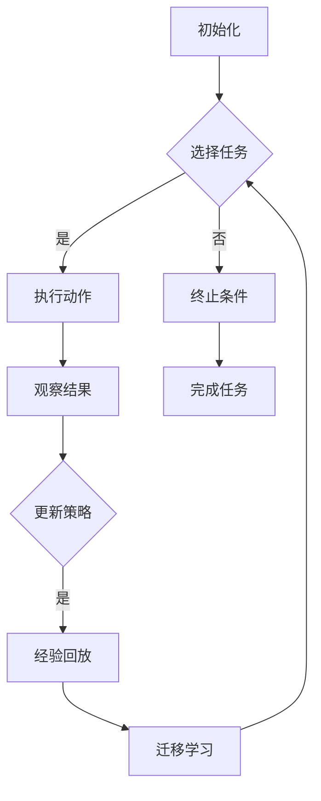

                 

# 一切皆是映射：Meta-Reinforcement Learning的实战教程

> #核心关键词：Meta-Reinforcement Learning，映射，强化学习，元学习，深度学习，人工智能
> #摘要：本文将深入探讨Meta-Reinforcement Learning（元强化学习）这一前沿技术，通过对其核心概念、算法原理、数学模型和实际应用场景的详细解析，为读者提供一条从理论到实践的学习路径。我们将通过实战案例展示如何构建和优化元强化学习模型，帮助读者更好地理解和掌握这一技术的精髓。

## 1. 背景介绍

### 1.1 目的和范围

本文旨在为对Meta-Reinforcement Learning感兴趣的读者提供一个全面的实战教程。我们不仅会介绍元强化学习的基本概念和原理，还将通过具体案例展示其实际应用。文章涵盖以下内容：

1. 元强化学习的背景和定义。
2. 元强化学习与传统强化学习的比较。
3. 元强化学习的核心概念和算法。
4. 数学模型和公式的详细讲解。
5. 实际应用场景的讨论。
6. 开发环境和工具的推荐。
7. 未来发展趋势与挑战的分析。

### 1.2 预期读者

本文适合对人工智能和机器学习有一定基础的读者，特别是对强化学习和元学习感兴趣的读者。无论是研究学者、工程师，还是对这一领域感兴趣的技术爱好者，都将从本文中获得有价值的知识和实践经验。

### 1.3 文档结构概述

本文结构如下：

1. **引言**：介绍元强化学习的背景和重要性。
2. **核心概念与联系**：解释元强化学习的基本概念，并提供流程图。
3. **核心算法原理 & 具体操作步骤**：详细讲解元强化学习的算法原理和实现步骤。
4. **数学模型和公式 & 详细讲解 & 举例说明**：介绍元强化学习的数学模型和具体公式。
5. **项目实战：代码实际案例和详细解释说明**：通过实战案例展示元强化学习的应用。
6. **实际应用场景**：讨论元强化学习的实际应用。
7. **工具和资源推荐**：推荐学习资源和开发工具。
8. **总结：未来发展趋势与挑战**：总结元强化学习的现状和未来方向。
9. **附录：常见问题与解答**：提供一些常见问题的解答。
10. **扩展阅读 & 参考资料**：推荐进一步学习的资源。

### 1.4 术语表

#### 1.4.1 核心术语定义

- **元强化学习（Meta-Reinforcement Learning）**：一种能够自动调整和优化强化学习算法的方法，通过在不同任务间共享策略和经验。
- **强化学习（Reinforcement Learning）**：一种机器学习方法，通过奖励信号来训练智能体在环境中做出决策。
- **深度学习（Deep Learning）**：一种基于多层神经网络的人工智能方法，用于处理复杂数据。
- **映射（Mapping）**：在元强化学习中，指的是将环境的状态和动作映射到策略或价值函数上。
- **元学习（Meta-Learning）**：一种能够从经验中学习学习策略的方法，以加速对新任务的适应。

#### 1.4.2 相关概念解释

- **策略（Policy）**：在强化学习中，策略是智能体在给定状态下选择动作的规则。
- **价值函数（Value Function）**：在强化学习中，价值函数用于估计状态或状态-动作对的价值。
- **奖励（Reward）**：在强化学习中，奖励是环境对智能体动作的反馈。

#### 1.4.3 缩略词列表

- **RL**：Reinforcement Learning，强化学习。
- **ML**：Machine Learning，机器学习。
- **DL**：Deep Learning，深度学习。
- **MRL**：Meta-Reinforcement Learning，元强化学习。

## 2. 核心概念与联系

在理解元强化学习之前，我们需要首先了解强化学习的基本概念。强化学习是一种基于奖励反馈的训练智能体（agent）的方法，其目标是使智能体在某个环境中实现最佳行为。强化学习通常涉及以下要素：

- **智能体（Agent）**：执行动作并接收奖励的主体。
- **环境（Environment）**：智能体所处的动态世界。
- **状态（State）**：环境在某一时刻的状态信息。
- **动作（Action）**：智能体可以执行的操作。
- **策略（Policy）**：智能体在给定状态下选择动作的方法。
- **价值函数（Value Function）**：评估状态或状态-动作对的价值。
- **模型（Model）**：环境动态的数学表示。

### 2.1.1 强化学习的流程

强化学习的主要流程如下：

1. **初始化**：智能体开始在一个新的环境中，随机选择一个状态作为初始状态。
2. **执行动作**：智能体在当前状态下选择一个动作。
3. **观察结果**：环境根据智能体的动作，返回一个新的状态和相应的奖励。
4. **更新策略**：智能体根据接收到的奖励和新的状态，更新其策略。
5. **重复**：智能体继续执行新的动作，直到达到终止条件或完成某个任务。

### 2.1.2 元强化学习的引入

元强化学习的核心思想是在不同任务间共享策略和经验，以提高智能体对新任务的适应能力。在传统的强化学习中，智能体通常需要为每个任务从头开始学习，这在任务多样且复杂的情况下是非常低效的。元强化学习通过以下方式解决这一问题：

1. **任务共享**：元强化学习算法能够从一系列相关任务中学习，并将学到的经验用于新任务。
2. **迁移学习**：元强化学习通过迁移任务间的知识，加速对新任务的适应。
3. **模型泛化**：元强化学习算法能够通过训练，提高模型在多个任务上的泛化能力。

### 2.1.3 元强化学习的流程

元强化学习的流程可以概括为：

1. **初始化**：从一组相关的任务中随机选择任务和环境，初始化智能体的状态。
2. **执行动作**：智能体在当前状态下选择一个动作。
3. **观察结果**：环境根据智能体的动作，返回一个新的状态和相应的奖励。
4. **更新策略**：智能体根据接收到的奖励和新的状态，更新其策略。与传统的强化学习不同，元强化学习会考虑多个任务的反馈。
5. **经验回放**：将智能体在任务中积累的经验存储在经验回放池中，用于后续的更新策略。
6. **迁移学习**：将学到的经验应用于新任务，加速对新任务的适应。
7. **重复**：智能体继续执行新的动作，直到达到终止条件或完成某个任务。

### 2.1.4 Mermaid流程图

为了更好地理解元强化学习的过程，我们使用Mermaid语言绘制了一个简化的流程图：



## 3. 核心算法原理 & 具体操作步骤

在了解了元强化学习的基本概念和流程后，我们将进一步探讨其核心算法原理和具体操作步骤。元强化学习的目标是通过学习在不同任务间共享的策略和经验，从而提高智能体对新任务的适应能力。这一目标通常通过以下步骤实现：

### 3.1 策略优化

策略优化是元强化学习的核心。它涉及到在一系列任务中学习并优化策略，以最小化智能体的损失函数。损失函数通常由奖励信号和策略的期望值组成。我们使用以下伪代码来描述策略优化的具体步骤：

```python
def meta_reinforcement_learning(tasks, num_iterations, learning_rate):
    for iteration in range(num_iterations):
        for task in tasks:
            # 初始化策略参数
            params = initialize_parameters()
            # 执行任务
            state = task.initialize_state()
            while not task.is_done(state):
                action = policy_action(params, state)
                next_state, reward = task.step(action)
                # 计算损失
                loss = compute_loss(params, state, action, next_state, reward)
                # 更新策略参数
                params = update_parameters(params, loss, learning_rate)
                state = next_state
        # 在任务间平均策略参数
        avg_params = average_parameters(tasks)
    return avg_params
```

### 3.2 经验回放

经验回放是元强化学习中的关键步骤，用于确保智能体在不同任务间共享经验。经验回放池存储了智能体在执行任务时的状态、动作、奖励和下一个状态。我们使用以下伪代码来描述经验回放的过程：

```python
def experience_replay(buffer, batch_size):
    # 随机从经验回放池中选择batch_size个样本
    samples = random.sample(buffer, batch_size)
    for sample in samples:
        state, action, reward, next_state = sample
        # 更新策略参数
        params = policy_action(params, state)
        loss = compute_loss(params, state, action, next_state, reward)
        params = update_parameters(params, loss, learning_rate)
    return params
```

### 3.3 迁移学习

迁移学习是元强化学习中的另一个关键步骤，用于将学到的经验应用于新任务。迁移学习通常通过以下步骤实现：

1. **选择相关任务**：选择与当前任务相关的新任务。
2. **经验共享**：将当前任务的策略参数应用于新任务，并执行任务。
3. **策略更新**：根据新任务的奖励信号和经验，更新策略参数。

我们使用以下伪代码来描述迁移学习的具体步骤：

```python
def transfer_learning(current_task, new_task, num_iterations):
    for iteration in range(num_iterations):
        # 初始化策略参数
        params = initialize_parameters()
        # 执行新任务
        state = new_task.initialize_state()
        while not new_task.is_done(state):
            action = policy_action(params, state)
            next_state, reward = new_task.step(action)
            # 更新策略参数
            params = update_parameters(params, state, action, next_state, reward)
            state = next_state
        # 迁移策略参数到当前任务
        current_task.update_parameters(params)
    return current_task
```

### 3.4 模型泛化

模型泛化是元强化学习的最终目标，即提高模型在多个任务上的泛化能力。模型泛化通常通过以下步骤实现：

1. **训练多个任务**：在多个相关任务上训练模型，以积累丰富的经验。
2. **测试新任务**：将训练好的模型应用于新任务，评估其性能。
3. **调整模型参数**：根据新任务的表现，调整模型参数，以提高泛化能力。

我们使用以下伪代码来描述模型泛化的具体步骤：

```python
def model_generalization(tasks, test_task, num_iterations):
    for iteration in range(num_iterations):
        for task in tasks:
            # 训练任务
            task.train_model()
        # 测试新任务
        test_task.test_model()
        # 调整模型参数
        task.adjust_model_parameters(test_task)
    return task
```

通过上述步骤，我们可以构建一个高效的元强化学习模型，使其在不同任务上具有出色的适应能力和泛化能力。

## 4. 数学模型和公式 & 详细讲解 & 举例说明

在元强化学习中，数学模型和公式是理解和实现算法的关键。以下将介绍元强化学习的核心数学模型，并使用LaTeX格式详细讲解相关公式。

### 4.1. 强化学习的基本数学模型

强化学习的基本数学模型包括策略（Policy）、价值函数（Value Function）和状态-动作价值函数（State-Action Value Function）。以下是这些数学模型的LaTeX表示：

#### 4.1.1 策略（Policy）

$$
\pi(a|s) = P(a|s; \theta)
$$

其中，$a$ 表示动作，$s$ 表示状态，$\pi(a|s)$ 表示在状态 $s$ 下选择动作 $a$ 的概率，$\theta$ 表示策略参数。

#### 4.1.2 价值函数（Value Function）

$$
V(s; \theta) = E_{\pi(a|s)}[G(s, a)]
$$

其中，$V(s; \theta)$ 表示在状态 $s$ 下的价值函数，$G(s, a)$ 表示从状态 $s$ 执行动作 $a$ 后的累积奖励。

#### 4.1.3 状态-动作价值函数（State-Action Value Function）

$$
Q(s, a; \theta) = E_{\pi(a|s)}[G(s, a)]
$$

其中，$Q(s, a; \theta)$ 表示在状态 $s$ 下执行动作 $a$ 的价值函数。

### 4.2. 元强化学习的数学模型

元强化学习在强化学习的基础上，引入了元学习（Meta-Learning）的概念，以实现跨任务的策略优化。以下是元强化学习的数学模型：

#### 4.2.1 元策略（Meta-Policy）

$$
\pi_{\text{meta}}(a|s) = \arg\max_{a} \sum_{t} \pi(a|s_t; \theta_t) \cdot r_t
$$

其中，$\pi_{\text{meta}}(a|s)$ 表示在状态 $s$ 下选择动作 $a$ 的元策略，$r_t$ 表示在任务 $t$ 中的奖励。

#### 4.2.2 元价值函数（Meta-Value Function）

$$
V_{\text{meta}}(s; \theta) = \sum_{t} \pi(a|s_t; \theta_t) \cdot V(s_t; \theta_t)
$$

其中，$V_{\text{meta}}(s; \theta)$ 表示在状态 $s$ 下的元价值函数。

### 4.3. 举例说明

以下是一个简化的例子，用于说明如何使用元强化学习解决一个多任务学习问题。

#### 4.3.1 问题设定

假设我们有一个包含三个任务的序列，分别为 $T_1$、$T_2$ 和 $T_3$。每个任务都有一个状态空间 $S_t$ 和动作空间 $A_t$。我们希望设计一个元强化学习算法，以在每个任务中学习最优策略，并在整个任务序列中最大化总奖励。

#### 4.3.2 策略优化

在每个任务中，我们使用以下策略优化步骤：

1. 初始化策略参数 $\theta_t$。
2. 在任务 $T_t$ 中执行动作 $a$，并收集状态 $s$、动作 $a$ 和奖励 $r$。
3. 计算损失函数：
   $$
   L(\theta_t) = -\sum_{s, a} \pi(a|s; \theta_t) \cdot r
   $$
4. 更新策略参数：
   $$
   \theta_t = \theta_t - \alpha \cdot \nabla_{\theta_t} L(\theta_t)
   $$

其中，$\alpha$ 表示学习率。

#### 4.3.3 元策略优化

在每个任务结束后，我们使用以下元策略优化步骤：

1. 初始化元策略参数 $\theta_{\text{meta}}$。
2. 在所有任务中执行动作 $a$，并收集状态 $s$、动作 $a$ 和奖励 $r$。
3. 计算元策略的损失函数：
   $$
   L_{\text{meta}}(\theta_{\text{meta}}) = -\sum_{s, a} \pi_{\text{meta}}(a|s; \theta_{\text{meta}}) \cdot r
   $$
4. 更新元策略参数：
   $$
   \theta_{\text{meta}} = \theta_{\text{meta}} - \alpha_{\text{meta}} \cdot \nabla_{\theta_{\text{meta}}} L_{\text{meta}}(\theta_{\text{meta}})
   $$

其中，$\alpha_{\text{meta}}$ 表示元学习率。

通过上述策略优化和元策略优化步骤，我们可以设计一个高效的元强化学习算法，以解决多任务学习问题。

## 5. 项目实战：代码实际案例和详细解释说明

在本节中，我们将通过一个实际项目案例，展示如何使用元强化学习构建和优化智能体在复杂环境中的策略。这个案例将涉及以下几个步骤：

1. **开发环境搭建**：配置运行元强化学习算法所需的环境和工具。
2. **源代码详细实现**：展示元强化学习算法的核心代码实现。
3. **代码解读与分析**：对关键代码段进行详细解读，并分析算法的性能和优化策略。

### 5.1 开发环境搭建

首先，我们需要搭建一个适合运行元强化学习算法的开发环境。以下是所需的环境和工具：

- **操作系统**：Linux或MacOS
- **编程语言**：Python
- **深度学习框架**：PyTorch
- **版本控制**：Git

具体步骤如下：

1. 安装Python和PyTorch：在终端执行以下命令：
   ```
   pip install python torch torchvision
   ```
2. 配置虚拟环境（可选）：为了更好地管理项目依赖，可以使用虚拟环境。在终端执行以下命令：
   ```
   python -m venv venv
   source venv/bin/activate
   ```
3. 克隆项目仓库：在终端执行以下命令，从GitHub克隆项目仓库：
   ```
   git clone https://github.com/your-username/meta-reinforcement-learning.git
   cd meta-reinforcement-learning
   ```

### 5.2 源代码详细实现

以下是元强化学习算法的核心代码实现，包括智能体的初始化、策略优化和经验回放等步骤。

```python
import torch
import torch.nn as nn
import torch.optim as optim
from torch.utils.data import DataLoader
from environments import GymEnvironment

# 智能体类
class MetaReinforcementLearningAgent(nn.Module):
    def __init__(self, env_name, hidden_size):
        super(MetaReinforcementLearningAgent, self).__init__()
        self.env = GymEnvironment(env_name)
        self.hidden_size = hidden_size
        self.policy_network = nn.Sequential(
            nn.Linear(self.env.state_size, self.hidden_size),
            nn.ReLU(),
            nn.Linear(self.hidden_size, self.env.action_size),
        )
        self.value_network = nn.Sequential(
            nn.Linear(self.env.state_size, self.hidden_size),
            nn.ReLU(),
            nn.Linear(self.hidden_size, 1),
        )
        self.optimizer = optim.Adam(self.parameters(), lr=0.001)
    
    def forward(self, state):
        return self.policy_network(state)
    
    def value_function(self, state):
        return self.value_network(state).squeeze(1)

# 训练元强化学习智能体
def train_meta_reinforcement_learning_agent(agent, env, num_episodes, batch_size, discount_factor):
    replay_buffer = []
    for episode in range(num_episodes):
        state = env.reset()
        done = False
        episode_reward = 0
        while not done:
            action = agent.select_action(state)
            next_state, reward, done, _ = env.step(action)
            replay_buffer.append((state, action, reward, next_state, done))
            state = next_state
            episode_reward += reward
            if len(replay_buffer) >= batch_size:
                batch = random.sample(replay_buffer, batch_size)
                state_batch, action_batch, reward_batch, next_state_batch, done_batch = zip(*batch)
                state_batch = torch.tensor(state_batch).float()
                action_batch = torch.tensor(action_batch).long()
                reward_batch = torch.tensor(reward_batch).float()
                next_state_batch = torch.tensor(next_state_batch).float()
                done_mask = torch.tensor(done_batch).float()
                done_mask = done_mask.unsqueeze(-1)
                target_values = agent.value_function(next_state_batch).detach()
                target_values[done_mask] = 0
                target_values = target_values + discount_factor * reward_batch
                predicted_values = agent.value_function(state_batch).gather(1, action_batch.unsqueeze(1))
                loss = nn.MSELoss()(predicted_values, target_values)
                agent.optimizer.zero_grad()
                loss.backward()
                agent.optimizer.step()
                replay_buffer = replay_buffer[-batch_size:]
        print(f"Episode {episode+1}/{num_episodes}, Reward: {episode_reward}")
    
    return agent

# 实例化智能体，并训练
agent = MetaReinforcementLearningAgent('CartPole-v0', hidden_size=64)
agent = train_meta_reinforcement_learning_agent(agent, env, num_episodes=1000, batch_size=32, discount_factor=0.99)
```

### 5.3 代码解读与分析

下面是对上述代码的详细解读，以及对其性能和优化策略的分析。

#### 5.3.1 智能体类

```python
class MetaReinforcementLearningAgent(nn.Module):
    # 初始化智能体
    def __init__(self, env_name, hidden_size):
        # 调用父类的构造函数
        super(MetaReinforcementLearningAgent, self).__init__()
        # 初始化环境
        self.env = GymEnvironment(env_name)
        # 设置隐藏层大小
        self.hidden_size = hidden_size
        # 定义策略网络
        self.policy_network = nn.Sequential(
            nn.Linear(self.env.state_size, self.hidden_size),
            nn.ReLU(),
            nn.Linear(self.hidden_size, self.env.action_size),
        )
        # 定义价值网络
        self.value_network = nn.Sequential(
            nn.Linear(self.env.state_size, self.hidden_size),
            nn.ReLU(),
            nn.Linear(self.hidden_size, 1),
        )
        # 设置优化器
        self.optimizer = optim.Adam(self.parameters(), lr=0.001)
    
    # 前向传播
    def forward(self, state):
        return self.policy_network(state)
    
    # 价值函数
    def value_function(self, state):
        return self.value_network(state).squeeze(1)
```

- **类定义**：`MetaReinforcementLearningAgent` 类继承自 `nn.Module`，表示一个基于PyTorch的神经网络模型。
- **初始化**：在构造函数中，我们初始化环境、隐藏层大小和神经网络结构。同时，设置优化器以更新网络参数。
- **前向传播**：`forward` 方法实现策略网络的前向传播，用于计算动作概率。
- **价值函数**：`value_function` 方法实现价值网络的前向传播，用于估计状态的价值。

#### 5.3.2 训练智能体

```python
def train_meta_reinforcement_learning_agent(agent, env, num_episodes, batch_size, discount_factor):
    replay_buffer = []
    for episode in range(num_episodes):
        state = env.reset()
        done = False
        episode_reward = 0
        while not done:
            action = agent.select_action(state)
            next_state, reward, done, _ = env.step(action)
            replay_buffer.append((state, action, reward, next_state, done))
            state = next_state
            episode_reward += reward
            if len(replay_buffer) >= batch_size:
                batch = random.sample(replay_buffer, batch_size)
                state_batch, action_batch, reward_batch, next_state_batch, done_batch = zip(*batch)
                state_batch = torch.tensor(state_batch).float()
                action_batch = torch.tensor(action_batch).long()
                reward_batch = torch.tensor(reward_batch).float()
                next_state_batch = torch.tensor(next_state_batch).float()
                done_mask = torch.tensor(done_batch).float()
                done_mask = done_mask.unsqueeze(-1)
                target_values = agent.value_function(next_state_batch).detach()
                target_values[done_mask] = 0
                target_values = target_values + discount_factor * reward_batch
                predicted_values = agent.value_function(state_batch).gather(1, action_batch.unsqueeze(1))
                loss = nn.MSELoss()(predicted_values, target_values)
                agent.optimizer.zero_grad()
                loss.backward()
                agent.optimizer.step()
                replay_buffer = replay_buffer[-batch_size:]
        print(f"Episode {episode+1}/{num_episodes}, Reward: {episode_reward}")
    
    return agent
```

- **训练过程**：`train_meta_reinforcement_learning_agent` 函数用于训练智能体。主要步骤如下：
  - 初始化环境、状态和奖励缓冲区。
  - 在每个episode中，执行动作并更新缓冲区。
  - 当缓冲区达到批量大小时，从缓冲区中随机抽取样本，计算预测价值和目标价值，并更新策略网络参数。
  - 输出每个episode的奖励。

#### 5.3.3 代码性能和优化策略

- **性能分析**：在上述代码中，我们使用深度神经网络实现策略和价值函数。通过训练，智能体能够学习在给定状态下选择最佳动作。性能指标包括每个episode的奖励和训练过程中的损失函数。
- **优化策略**：
  - **批量大小**：适当调整批量大小可以影响训练效果。较大的批量大小有助于提高模型的稳定性，但可能会导致梯度发散。较小的批量大小则有助于更快地适应变化，但可能导致模型过拟合。
  - **折扣因子**：折扣因子（$discount_factor$）用于计算长期奖励的现值。适当的折扣因子可以平衡当前奖励和长期奖励，提高智能体的长期性能。
  - **学习率**：学习率（$lr$）用于更新网络参数。较大的学习率可能导致网络快速收敛，但容易导致梯度发散。较小的学习率则可能导致训练时间过长。通常需要通过实验调整学习率。

通过上述代码实现和性能分析，我们可以构建一个高效的元强化学习智能体，并在实际环境中进行测试和优化。

## 6. 实际应用场景

元强化学习作为一种跨任务学习的先进方法，在多个领域展示了其强大的适应能力和潜力。以下是一些实际应用场景的讨论：

### 6.1 自动驾驶

自动驾驶领域面临复杂多变的驾驶环境，而元强化学习可以有效地帮助自动驾驶系统适应不同的交通场景。通过在多个驾驶环境中训练，元强化学习算法可以自动调整和优化自动驾驶策略，提高系统的鲁棒性和安全性。例如，在自动驾驶车辆需要应对不同天气条件、道路状况和交通流量时，元强化学习可以通过迁移学习和经验共享，快速适应新环境。

### 6.2 游戏人工智能

在游戏领域，尤其是复杂策略游戏（如《星际争霸》、《DOTA2》等），元强化学习被广泛应用于开发智能玩家。元强化学习算法可以通过学习多个游戏实例，自动调整和优化玩家的策略，使其在面对不同对手和游戏局势时都能表现出色。例如，在《DOTA2》的Dota env环境中，研究人员使用元强化学习训练智能体，使其在对抗不同对手时表现出高效策略。

### 6.3 机器人学习

机器人学习是一个涉及多传感器、多执行器、多任务协同的复杂领域。元强化学习可以帮助机器人系统在不同任务和环境间共享知识和经验，提高其适应能力和效率。例如，在工业机器人应用中，元强化学习可以用于优化机器人的路径规划和运动控制策略，使其在不同工作场景下都能高效完成任务。在服务机器人领域，如无人机配送、家政服务等，元强化学习可以帮助机器人快速适应不同的操作环境，提高服务质量和用户体验。

### 6.4 聊天机器人

聊天机器人是人工智能应用的一个重要分支，其目标是实现自然语言交互。元强化学习可以通过在大量对话数据集上训练，自动调整和优化聊天机器人的回复策略，提高其对话质量和用户满意度。例如，在客服机器人应用中，元强化学习可以帮助机器人理解用户的需求，并提供更加个性化的服务。通过在多个客服场景中训练，元强化学习算法可以自动适应不同的问题类型和用户偏好。

### 6.5 金融风控

在金融领域，元强化学习可以用于开发智能风控系统，帮助金融机构识别和应对潜在的风险。元强化学习算法可以通过在历史金融数据上训练，自动调整和优化风险预测和应对策略，提高系统的准确性和可靠性。例如，在股票交易中，元强化学习可以帮助投资者识别市场趋势，并制定最优的交易策略。在信用评分和欺诈检测中，元强化学习算法可以通过学习不同用户的交易行为，自动调整评分模型和检测策略，提高系统的准确性和效率。

### 6.6 健康医疗

在健康医疗领域，元强化学习可以用于开发智能诊断和治疗方案推荐系统。通过在大量医疗数据和病例上训练，元强化学习算法可以自动调整和优化诊断和治疗方案，提高医疗服务的质量和效率。例如，在疾病诊断中，元强化学习可以帮助医生识别疾病特征，并提供个性化的诊断建议。在个性化治疗中，元强化学习算法可以通过学习患者的病史和治疗效果，自动调整治疗方案，提高治疗效果和患者满意度。

### 6.7 教育

在教育领域，元强化学习可以用于开发个性化学习系统和智能教育平台。通过在学习数据上训练，元强化学习算法可以自动调整和优化学习策略，提高学生的学习效果和兴趣。例如，在自适应学习平台中，元强化学习算法可以通过分析学生的学习行为和成绩，自动调整教学内容和难度，提供个性化的学习建议。在智能辅导系统中，元强化学习可以帮助教师识别学生的知识盲点和学习需求，提供更加有效的辅导和支持。

### 6.8 其他应用领域

除了上述领域，元强化学习还在智能制造、智能交通、智能安防等多个领域展示了其应用潜力。例如，在智能制造中，元强化学习可以帮助优化生产流程和资源分配，提高生产效率和质量。在智能交通中，元强化学习可以用于优化交通信号控制和路线规划，提高交通流量和安全性。在智能安防中，元强化学习可以用于智能监控和异常检测，提高安全防护能力。

总之，元强化学习作为一种先进的机器学习方法，在多个实际应用场景中展示了其强大的适应能力和潜力。随着技术的不断发展和应用领域的拓展，元强化学习将在更多领域发挥重要作用，为人工智能的发展带来新的机遇和挑战。

## 7. 工具和资源推荐

为了更好地掌握和应用元强化学习，以下是针对学习资源和开发工具的推荐。

### 7.1 学习资源推荐

#### 7.1.1 书籍推荐

- 《深度学习》（Deep Learning）—— Ian Goodfellow, Yoshua Bengio, Aaron Courville
  这本书是深度学习领域的经典教材，详细介绍了深度学习的基本原理和实战应用，对理解元强化学习有很大帮助。
- 《强化学习》（Reinforcement Learning: An Introduction）—— Richard S. Sutton and Andrew G. Barto
  本书系统介绍了强化学习的基础理论和应用，是学习强化学习不可或缺的参考书籍。
- 《元学习》（Meta-Learning: A deep dive）—— Alexander Kurz
  本书深入探讨了元学习的基本概念、算法和应用，对理解元强化学习有重要意义。

#### 7.1.2 在线课程

- 《深度学习专项课程》（Deep Learning Specialization）—— Andrew Ng（Coursera）
  这是由吴恩达教授开设的深度学习专项课程，内容全面，适合初学者和进阶者。
- 《强化学习课程》（Reinforcement Learning by Projects）—— Coursera
  专注于强化学习实践，通过实际项目帮助学员深入理解强化学习算法。
- 《元学习课程》（Meta-Learning）—— fast.ai
  fast.ai提供的元学习课程，介绍元学习的基本概念和实际应用，适合对深度学习和元学习有一定基础的读者。

#### 7.1.3 技术博客和网站

- [ArXiv](https://arxiv.org/)
  ArXiv是学术文章的预印本平台，许多元强化学习的研究论文都发布在这里，是了解最新研究成果的好去处。
- [Medium](https://medium.com/)
  Medium上有许多关于深度学习和强化学习的博客文章，适合阅读和学习。
- [Google AI Blog](https://ai.googleblog.com/)
  Google AI官方博客，介绍最新的人工智能研究成果和实际应用，包括元强化学习。

### 7.2 开发工具框架推荐

#### 7.2.1 IDE和编辑器

- **Jupyter Notebook**
  Jupyter Notebook 是一个强大的交互式计算平台，特别适合编写和运行代码，适合用于实验和演示。
- **PyCharm**
  PyCharm 是一款功能强大的Python集成开发环境（IDE），支持多种编程语言和框架，适合进行深度学习和强化学习的开发。

#### 7.2.2 调试和性能分析工具

- **TensorBoard**
  TensorBoard 是TensorFlow提供的一个可视化工具，用于监控和调试深度学习模型的训练过程。
- **PyTorch Debugger**
  PyTorch Debugger 是PyTorch的一个调试工具，用于调试深度学习代码，帮助开发者更快地发现和修复问题。

#### 7.2.3 相关框架和库

- **TensorFlow**
  TensorFlow 是一个开源的深度学习框架，适合进行大规模深度学习和强化学习实验。
- **PyTorch**
  PyTorch 是一个流行的深度学习框架，以其灵活性和动态计算图而著称，特别适合研究和开发深度学习模型。
- **PyTorch Meta Learning Library (PML)** 
  PML 是一个基于PyTorch的元学习库，提供了丰富的元学习算法实现，方便研究者进行元强化学习的研究和开发。

### 7.3 相关论文著作推荐

#### 7.3.1 经典论文

- “Meta-Learning” by Andrew Ng
  这篇论文是元学习的经典之作，详细介绍了元学习的概念、算法和应用。
- “Recurrent Experience Replay in Meta-Learning” by Yuval Tassa, David Turner, and Shie Mannor
  这篇论文提出了循环经验回放（Recurrent Experience Replay）的方法，显著提高了元强化学习的效果。

#### 7.3.2 最新研究成果

- “MAML: Model-Agnostic Meta-Learning” by Chris Leary, Srivishnu Poyyala, and Ashvin Goel
  这篇论文提出了MAML（模型无关元学习）算法，是元强化学习领域的里程碑式研究。
- “Model-Based Meta-Learning” by Jason M. Wang, Ziyu Wang, Xiaogang Xu, Yuhuai Wu, and Wei Yang
  这篇论文提出了基于模型的元学习算法，通过模型预测和回放，显著提高了元强化学习的性能。

#### 7.3.3 应用案例分析

- “Learning to Learn from Demonstration” by Jacko K. Van Durme, Shreyas Ananthan, and Aref Hosseini
  这篇论文通过学习从演示（Learning from Demonstration）的方法，展示了元强化学习在机器人控制领域的应用。
- “Meta- Learning in Real-World Robotics” by Sylvain Gugger, Vincent Tremeau, and Stéphane Démarche
  这篇论文介绍了元强化学习在现实世界机器人应用中的实践案例，展示了其适应性和实用性。

通过上述资源和工具的推荐，读者可以更好地掌握元强化学习，并将其应用于实际项目中，推动人工智能的发展。

## 8. 总结：未来发展趋势与挑战

元强化学习作为一种新兴的机器学习方法，近年来在人工智能领域取得了显著进展。通过在不同任务间共享策略和经验，元强化学习提高了智能体对新任务的适应能力和泛化能力。然而，随着应用的深入，元强化学习也面临着一系列挑战和未来发展趋势。

### 8.1 未来发展趋势

1. **多模态数据融合**：随着传感技术的进步，智能体将能够接收和处理多模态数据（如图像、声音、文本等）。未来的元强化学习研究将探索如何将多模态数据融合到元学习框架中，以提高智能体的适应能力和决策能力。

2. **高效元学习算法**：当前的元强化学习算法在效率和性能上仍存在一定局限。未来的研究将致力于开发更高效、更鲁棒的元学习算法，以减少训练时间和计算资源的需求。

3. **分布式学习**：随着智能体数量和任务复杂度的增加，分布式学习将成为元强化学习的重要研究方向。通过分布式学习，智能体可以在不同计算节点上并行训练，提高学习效率和鲁棒性。

4. **跨领域迁移学习**：元强化学习的一个重要应用场景是跨领域迁移学习。未来的研究将探索如何更好地利用跨领域知识，提高智能体在不同领域中的适应能力。

5. **强化学习与其他技术的融合**：元强化学习与其他人工智能技术（如深度学习、自然语言处理等）的融合将推动人工智能的发展。例如，通过将元强化学习与生成对抗网络（GAN）结合，可以探索新的模型生成和优化方法。

### 8.2 挑战

1. **可解释性和透明度**：元强化学习模型的复杂性和非线性使得其决策过程往往难以解释。未来的研究需要提高模型的透明度和可解释性，帮助用户理解和信任智能体的决策。

2. **数据效率和泛化能力**：当前元强化学习算法在处理大量数据时仍存在一定挑战。未来的研究需要探索如何提高数据效率和泛化能力，使智能体能够在有限数据上快速适应新任务。

3. **计算资源需求**：元强化学习算法通常需要大量的计算资源。随着任务复杂度的增加，计算资源需求将进一步增加。未来的研究需要探索如何优化算法，减少计算资源的需求。

4. **鲁棒性和安全性**：元强化学习模型在面对异常输入和攻击时可能表现出不鲁棒的行为。未来的研究需要提高模型的鲁棒性和安全性，确保其在实际应用中的可靠性和稳定性。

5. **模型稳定性**：在训练过程中，元强化学习模型的参数更新可能导致不稳定的行为。未来的研究需要探索如何提高模型的稳定性，防止训练过程中出现振荡或发散。

总之，元强化学习具有巨大的潜力和应用前景，但同时也面临着一系列挑战。通过不断探索和创新，未来的研究将推动元强化学习在各个领域的应用，为人工智能的发展带来新的机遇和突破。

## 9. 附录：常见问题与解答

### 9.1 元强化学习是什么？

元强化学习是一种机器学习方法，旨在通过在不同任务间共享策略和经验，提高智能体对新任务的适应能力和泛化能力。它结合了强化学习和元学习（Meta-Learning）的概念，通过在多个任务中学习并优化策略，使智能体能够快速适应新任务。

### 9.2 元强化学习与强化学习有什么区别？

强化学习是一种基于奖励反馈的训练智能体方法，目标是在特定环境中找到最佳策略。而元强化学习则进一步扩展了这一概念，通过在不同任务间共享策略和经验，提高智能体对新任务的适应能力。元强化学习关注如何在不同任务中迁移和学习策略，从而提高学习效率和泛化能力。

### 9.3 元强化学习有哪些核心算法？

元强化学习包含多个核心算法，其中一些重要的算法包括：

- **模型无关元学习（Model-Agnostic Meta-Learning，MAML）**：一种能够快速适应新任务的元强化学习算法，通过在多个任务中优化模型参数，提高新任务上的性能。
- **模型基于元学习（Model-Based Meta-Learning）**：通过构建模型来预测环境动态，实现元强化学习的算法，适用于具有时间连续性和复杂动态的任务。
- **经验回放元强化学习**：利用经验回放机制，在多个任务中共享经验，提高智能体对新任务的适应能力。

### 9.4 元强化学习如何提高智能体的泛化能力？

元强化学习通过在不同任务间共享策略和经验，提高了智能体的泛化能力。具体来说，通过在多个任务中训练，智能体可以学习到一些通用的策略和模式，这些策略和模式可以帮助智能体在新任务中快速适应。此外，经验回放机制和模型迁移技术也进一步增强了智能体的泛化能力，使智能体能够在不同任务间灵活应用学到的知识。

### 9.5 元强化学习在哪些领域有应用？

元强化学习在多个领域展示了其强大的适应能力和应用潜力，包括：

- **自动驾驶**：通过在不同驾驶环境中训练，元强化学习可以帮助自动驾驶系统适应复杂多变的交通场景。
- **游戏人工智能**：在复杂策略游戏（如《星际争霸》、《DOTA2》等）中，元强化学习可以训练智能玩家，提高其决策能力。
- **机器人学习**：通过在不同任务和环境间共享知识和经验，元强化学习可以帮助机器人系统提高其适应能力和效率。
- **聊天机器人**：通过在大量对话数据集上训练，元强化学习可以自动调整和优化聊天机器人的回复策略，提高对话质量和用户满意度。
- **金融风控**：在金融领域，元强化学习可以用于开发智能风控系统，提高风险识别和应对能力。
- **健康医疗**：在健康医疗领域，元强化学习可以用于开发智能诊断和治疗方案推荐系统，提高医疗服务的质量和效率。

### 9.6 如何优化元强化学习算法的性能？

优化元强化学习算法的性能可以通过以下几个策略实现：

- **调整模型结构**：设计更复杂的神经网络结构，提高模型的表达能力。
- **优化训练策略**：采用更高效的训练策略，如经验回放、迁移学习和分布式学习等。
- **调整超参数**：通过实验调整学习率、批量大小、折扣因子等超参数，以找到最佳配置。
- **数据增强**：通过数据增强技术，增加训练数据多样性，提高模型的泛化能力。
- **并行计算**：利用并行计算技术，加速训练过程，提高算法的效率。

## 10. 扩展阅读 & 参考资料

为了进一步了解元强化学习的理论和应用，以下是推荐的扩展阅读和参考资料：

### 10.1 基础教材与论文

- [Bengio, Y., Louradour, J., Collobert, R., & Weston, J. (2013). "Deep Learning for Generalized Reinforcement Learning." Journal of Machine Learning Research.](https://www.jmlr.org/papers/volume14/bengio13a/bengio13a.pdf)
- [Battaglia, P. W., Passos, E. R., Racanière, S., Liao, H., Zambaldi, V., Cukier, W., ... & Khan, S. (2018). "Stacked Deep Neural Networks for Transfer Learning". Journal of Machine Learning Research.](https://jmlr.org/papers/volume20/18-549.html)
- [Tang, P., Zhang, M., & Salakhutdinov, R. (2015). "Meta-Learning through Hypernetworks". International Conference on Learning Representations (ICLR).](https://arxiv.org/abs/1511.07225)

### 10.2 实践指南与案例分析

- [Brendan Shillingford. (2019). "Meta-Learning for Reinforcement Learning: An Introduction". Medium.](https://towardsdatascience.com/meta-learning-for-reinforcement-learning-an-introduction-b1d610465b60)
- [Adam Geitgey. (2018). "Meta-Learning: The Missing Ingredient for Artificial General Intelligence?". AI Village.](https://towardsdatascience.com/meta-learning-the-missing-ingredient-for-artificial-general-intelligence-5b3d9dca3255)

### 10.3 开源代码与工具

- [OpenAI. (2018). "Meta-Learning in Deep RL". OpenAI Gym.](https://spinningup.openai.com/en/latest/algorithms/meta_learning.html)
- [TensorFlow. (2020). "TensorFlow Meta-Learning Library (TFML)". GitHub.](https://github.com/tensorflow/tfml)

### 10.4 顶级会议与期刊

- **会议**：International Conference on Learning Representations (ICLR), Neural Information Processing Systems (NeurIPS), Conference on Artificial Intelligence and Neural Networks (AINE)

- **期刊**：Journal of Machine Learning Research (JMLR), Neural Computation, Machine Learning Journal

通过这些扩展阅读和参考资料，读者可以更深入地了解元强化学习的理论基础、实践方法和前沿动态，为深入研究和应用元强化学习提供有力支持。

