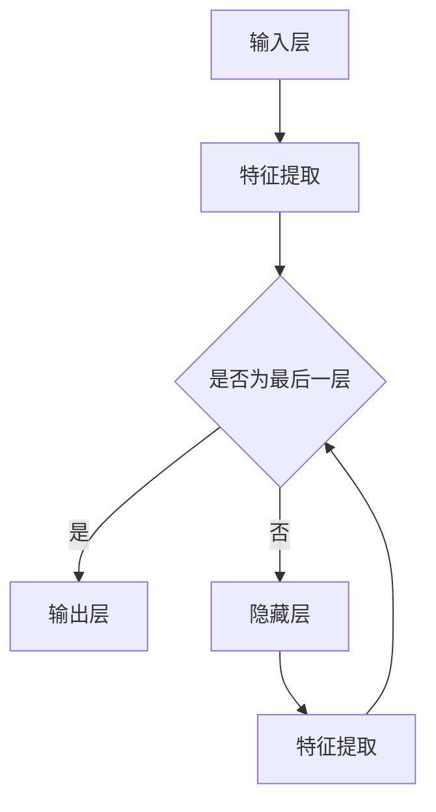

                 

# 一切皆是映射：实时语义分割与神经网络的进展

> 关键词：实时语义分割、神经网络、映射、深度学习、计算机视觉

> 摘要：本文深入探讨了实时语义分割领域，着重分析了神经网络在这一领域中的关键作用，以及它们是如何通过映射原理实现高效图像处理的。文章将从核心概念、算法原理、数学模型到实际应用，逐一剖析实时语义分割的技术细节，为读者提供一场关于实时图像处理技术的深度之旅。

## 1. 背景介绍

### 1.1 目的和范围

本文旨在探讨实时语义分割技术及其与神经网络的深度融合。实时语义分割是计算机视觉领域的一个重要研究方向，它旨在快速、准确地识别图像中的各个对象，并为其分配语义标签。随着深度学习技术的发展，神经网络在实时语义分割中的应用越来越广泛，成为推动该领域进步的重要力量。

本文将首先介绍实时语义分割的基本概念和目标，然后深入探讨神经网络在这一领域的核心作用。我们将通过具体的算法原理讲解和实际项目案例，帮助读者理解实时语义分割技术的实现过程和关键技术。此外，本文还将讨论实时语义分割在不同应用场景中的实际应用，以及相关的工具和资源推荐，为读者提供全方位的技术参考。

### 1.2 预期读者

本文主要面向对实时语义分割和神经网络技术有一定了解的读者，包括：

- 计算机视觉研究人员和工程师
- 深度学习和机器学习爱好者
- 对实时图像处理技术感兴趣的工程师和技术爱好者

通过本文的阅读，读者将能够：

- 理解实时语义分割的基本概念和技术要点
- 掌握神经网络在实时语义分割中的应用和实现方法
- 了解实时语义分割在不同应用场景中的实际应用
- 获取相关工具和资源的推荐，为实际项目开发提供支持

### 1.3 文档结构概述

本文的结构如下：

- **第1章 背景介绍**：介绍实时语义分割的基本概念、目的和预期读者，概述文档结构。
- **第2章 核心概念与联系**：介绍实时语义分割的核心概念和原理，包括神经网络的基本架构。
- **第3章 核心算法原理 & 具体操作步骤**：详细讲解实时语义分割的关键算法原理，使用伪代码展示操作步骤。
- **第4章 数学模型和公式 & 详细讲解 & 举例说明**：介绍实时语义分割中使用的数学模型和公式，并通过实际例子进行讲解。
- **第5章 项目实战：代码实际案例和详细解释说明**：提供实时语义分割的实际代码案例，并进行详细解释。
- **第6章 实际应用场景**：探讨实时语义分割在不同场景中的应用。
- **第7章 工具和资源推荐**：推荐学习资源、开发工具和框架。
- **第8章 总结：未来发展趋势与挑战**：总结实时语义分割的现状，展望未来发展趋势和挑战。
- **第9章 附录：常见问题与解答**：解答读者可能遇到的问题。
- **第10章 扩展阅读 & 参考资料**：提供进一步阅读的资料。

### 1.4 术语表

#### 1.4.1 核心术语定义

- **实时语义分割**：实时地对图像中的各个对象进行识别和分类的过程。
- **神经网络**：由大量人工神经元组成的计算模型，能够通过学习数据来识别模式和进行预测。
- **映射**：将输入数据映射到输出数据的过程，是神经网络的基本操作。
- **深度学习**：基于神经网络的机器学习方法，能够通过多层神经网络提取数据的深层特征。
- **计算机视觉**：使计算机能够“看”和“理解”图像和视频的技术。

#### 1.4.2 相关概念解释

- **卷积神经网络（CNN）**：一种用于图像识别和处理的神经网络架构，通过卷积层提取图像特征。
- **全连接神经网络（FCNN）**：一种神经网络架构，其中每个输入神经元都与每个输出神经元相连。
- **激活函数**：用于引入非线性性质的函数，常见的有ReLU、Sigmoid和Tanh等。
- **损失函数**：用于衡量预测结果和实际结果之间差异的函数，常见的有均方误差（MSE）和对数损失（Log Loss）。

#### 1.4.3 缩略词列表

- **CNN**：卷积神经网络（Convolutional Neural Network）
- **FCNN**：全连接神经网络（Fully Connected Neural Network）
- **ReLU**：修正线性单元（Rectified Linear Unit）
- **MSE**：均方误差（Mean Squared Error）
- **Log Loss**：对数损失（Logarithmic Loss）

## 2. 核心概念与联系

在深入探讨实时语义分割之前，我们需要理解一些核心概念和原理，以及它们之间的联系。这一节将介绍实时语义分割的核心概念，包括神经网络的基本架构，并通过一个Mermaid流程图来展示这些概念和原理之间的联系。

### 2.1 实时语义分割的概念

实时语义分割是一种计算机视觉技术，旨在快速地对图像中的各个对象进行识别和分类。与传统的图像分割技术不同，实时语义分割不仅需要识别图像中的物体，还需要为这些物体分配具体的语义标签。例如，在自动驾驶系统中，实时语义分割可以用来识别道路、车辆、行人等不同的对象，以便进行路径规划和避障。

### 2.2 神经网络的基本架构

神经网络是由大量神经元组成的计算模型，每个神经元都可以看作是一个简单的计算单元。神经元通过输入层接收数据，通过隐藏层进行特征提取和变换，最后通过输出层产生预测结果。神经网络的核心是层与层之间的映射关系，这种映射关系使得神经网络能够从输入数据中学习到有意义的特征。

神经网络的基本架构通常包括以下几个部分：

1. **输入层（Input Layer）**：接收外部输入数据，如图像像素值。
2. **隐藏层（Hidden Layers）**：对输入数据进行特征提取和变换，隐藏层可以有一个或多个。
3. **输出层（Output Layer）**：产生最终预测结果，如图像中各个对象的标签。

### 2.3 实时语义分割与神经网络的联系

实时语义分割与神经网络之间的联系在于，神经网络提供了强大的特征提取和分类能力，使得实时语义分割成为可能。具体来说，神经网络通过学习大量的图像数据，可以自动地提取出图像的深层特征，这些特征对于后续的物体识别和分类任务至关重要。

Mermaid流程图如下所示，展示了实时语义分割的核心概念和原理之间的联系：



在这个流程图中，输入层接收图像数据，通过隐藏层进行特征提取，最终输出层的预测结果即为图像中各个对象的标签。通过这个流程图，我们可以清晰地看到实时语义分割过程中各个步骤之间的联系。

## 3. 核心算法原理 & 具体操作步骤

实时语义分割的核心算法通常基于深度学习，特别是卷积神经网络（CNN）。在这一节中，我们将详细讲解实时语义分割的算法原理，并使用伪代码展示具体的操作步骤。

### 3.1 算法原理

实时语义分割算法主要分为以下几个步骤：

1. **图像预处理**：对输入图像进行预处理，包括图像缩放、归一化等操作，以便于后续处理。
2. **特征提取**：使用卷积神经网络提取图像的特征。
3. **特征融合**：将不同层级的特征进行融合，以便于后续的语义分割。
4. **分类预测**：使用全连接神经网络（FCNN）对融合后的特征进行分类预测。
5. **结果输出**：输出分割结果，如图像中各个对象的标签。

### 3.2 伪代码展示

以下是一个简化的实时语义分割算法的伪代码：

```python
# 实时语义分割算法伪代码

# 步骤1：图像预处理
def preprocess_image(image):
    # 缩放图像
    scaled_image = scale_image(image, target_size=(224, 224))
    # 归一化图像
    normalized_image = normalize_image(scaled_image)
    return normalized_image

# 步骤2：特征提取
def extract_features(image):
    # 使用卷积神经网络提取特征
    features = cnn_forward_pass(image)
    return features

# 步骤3：特征融合
def fuse_features(feature1, feature2):
    # 融合不同层级的特征
    fused_features = concatenate(feature1, feature2)
    return fused_features

# 步骤4：分类预测
def classify(fused_features):
    # 使用全连接神经网络进行分类预测
    predictions = fcnn_forward_pass(fused_features)
    return predictions

# 步骤5：结果输出
def output_results(predictions):
    # 输出分割结果
    segmented_image = apply_segmentation(predictions)
    return segmented_image

# 主函数
def semantic_segmentation(image):
    preprocessed_image = preprocess_image(image)
    extracted_features = extract_features(preprocessed_image)
    fused_features = fuse_features(extracted_features)
    predictions = classify(fused_features)
    segmented_image = output_results(predictions)
    return segmented_image
```

### 3.3 操作步骤详解

1. **图像预处理**：
   - **缩放图像**：将图像缩放到固定的尺寸，以便于后续处理。常用的方法包括线性插值和最近邻插值。
   - **归一化图像**：将图像的像素值缩放到[0, 1]范围内，以便于神经网络处理。常用的方法包括最小-最大归一化和零均值归一化。

2. **特征提取**：
   - 使用卷积神经网络（CNN）提取图像的特征。卷积神经网络通过卷积层、池化层等操作，逐层提取图像的深层特征。

3. **特征融合**：
   - 将不同层级的特征进行融合。特征融合可以通过拼接（concatenate）操作实现，即将不同层级的特征向量在通道维度上进行连接。

4. **分类预测**：
   - 使用全连接神经网络（FCNN）对融合后的特征进行分类预测。全连接神经网络通过逐层前向传播，将输入特征映射到输出分类结果。

5. **结果输出**：
   - 输出分割结果，如图像中各个对象的标签。分割结果可以通过阈值处理、后处理等操作得到。

通过上述操作步骤，实时语义分割算法可以实现对图像中各个对象的快速、准确的识别和分类，从而实现高效的实时语义分割。

## 4. 数学模型和公式 & 详细讲解 & 举例说明

实时语义分割算法中涉及到多个数学模型和公式，这些模型和公式是理解算法原理和实现细节的关键。在这一节中，我们将详细讲解这些数学模型和公式，并通过具体例子进行说明。

### 4.1 卷积神经网络中的卷积操作

卷积神经网络（CNN）中的卷积操作是提取图像特征的核心步骤。卷积操作的数学模型如下：

\[ (f * g)(x, y) = \sum_{i=-\infty}^{\infty} \sum_{j=-\infty}^{\infty} f(i, j) \cdot g(x-i, y-j) \]

其中，\( f \) 和 \( g \) 分别表示卷积核和输入图像，\( (x, y) \) 表示卷积操作的位置。

**例子**：假设卷积核 \( g \) 为一个 \( 3 \times 3 \) 的矩阵，输入图像 \( f \) 为一个 \( 5 \times 5 \) 的矩阵，计算 \( (f * g)(2, 2) \) 的值。

卷积核 \( g \)：
\[ g = \begin{bmatrix} 1 & 0 & 1 \\ 0 & 1 & 0 \\ 1 & 0 & 1 \end{bmatrix} \]

输入图像 \( f \)：
\[ f = \begin{bmatrix} 1 & 2 & 3 & 4 & 5 \\ 6 & 7 & 8 & 9 & 10 \\ 11 & 12 & 13 & 14 & 15 \\ 16 & 17 & 18 & 19 & 20 \\ 21 & 22 & 23 & 24 & 25 \end{bmatrix} \]

计算 \( (f * g)(2, 2) \) 的值：
\[ (f * g)(2, 2) = 1 \cdot 11 + 0 \cdot 12 + 1 \cdot 13 + 0 \cdot 16 + 1 \cdot 17 = 11 + 13 + 17 = 41 \]

### 4.2 池化操作

池化操作是卷积神经网络中的另一个重要步骤，用于减小特征图的尺寸，同时保持重要的特征信息。最常用的池化操作是最大池化（Max Pooling），其数学模型如下：

\[ P(x, y) = \max\{g(x-i, y-j) | -\infty < i < x, -\infty < j < y\} \]

其中，\( P \) 表示池化操作的结果，\( g \) 表示卷积核，\( (x, y) \) 表示池化操作的位置。

**例子**：假设一个 \( 2 \times 2 \) 的特征图，卷积核 \( g \) 为 \( 2 \times 2 \) 的矩阵，计算 \( P(1, 1) \) 的值。

特征图 \( g \)：
\[ g = \begin{bmatrix} 1 & 2 \\ 3 & 4 \end{bmatrix} \]

计算 \( P(1, 1) \) 的值：
\[ P(1, 1) = \max\{1, 2, 3, 4\} = 4 \]

### 4.3 全连接神经网络中的前向传播

全连接神经网络（FCNN）中的前向传播是分类预测的关键步骤。前向传播的数学模型如下：

\[ y = \sigma(W \cdot x + b) \]

其中，\( y \) 表示输出结果，\( x \) 表示输入特征，\( W \) 表示权重矩阵，\( b \) 表示偏置项，\( \sigma \) 表示激活函数。

**例子**：假设一个 \( 2 \) 维的输入特征 \( x \) 和一个 \( 3 \) 维的权重矩阵 \( W \)，计算 \( y \) 的值，其中激活函数为 ReLU。

输入特征 \( x \)：
\[ x = \begin{bmatrix} 2 \\ 3 \end{bmatrix} \]

权重矩阵 \( W \)：
\[ W = \begin{bmatrix} 1 & 2 \\ 3 & 4 \end{bmatrix} \]

偏置项 \( b \)：
\[ b = \begin{bmatrix} 0 \\ 1 \end{bmatrix} \]

计算 \( y \) 的值：
\[ y = \sigma(W \cdot x + b) = \sigma(\begin{bmatrix} 1 & 2 \\ 3 & 4 \end{bmatrix} \cdot \begin{bmatrix} 2 \\ 3 \end{bmatrix} + \begin{bmatrix} 0 \\ 1 \end{bmatrix}) \]
\[ y = \sigma(\begin{bmatrix} 8 \\ 17 \end{bmatrix} + \begin{bmatrix} 0 \\ 1 \end{bmatrix}) = \sigma(\begin{bmatrix} 8 \\ 18 \end{bmatrix}) \]
\[ y = \begin{bmatrix} \max(8, 18) \\ \max(8, 18) \end{bmatrix} = \begin{bmatrix} 18 \\ 18 \end{bmatrix} \]

### 4.4 损失函数

损失函数是评估预测结果和实际结果之间差异的重要工具。常用的损失函数包括均方误差（MSE）和对数损失（Log Loss）。

- **均方误差（MSE）**：
  \[ \text{MSE} = \frac{1}{n} \sum_{i=1}^{n} (y_i - \hat{y}_i)^2 \]

  其中，\( y_i \) 表示实际结果，\( \hat{y}_i \) 表示预测结果，\( n \) 表示样本数量。

- **对数损失（Log Loss）**：
  \[ \text{Log Loss} = -\frac{1}{n} \sum_{i=1}^{n} y_i \cdot \log(\hat{y}_i) \]

  其中，\( y_i \) 和 \( \hat{y}_i \) 的含义与 MSE 中相同。

**例子**：假设一个二分类问题，实际结果为 \( y = [0, 1, 0, 1] \)，预测结果为 \( \hat{y} = [0.2, 0.8, 0.5, 0.5] \)，计算 MSE 和 Log Loss 的值。

计算 MSE：
\[ \text{MSE} = \frac{1}{4} \sum_{i=1}^{4} (y_i - \hat{y}_i)^2 = \frac{1}{4} ((0-0.2)^2 + (1-0.8)^2 + (0-0.5)^2 + (1-0.5)^2) \]
\[ \text{MSE} = \frac{1}{4} (0.04 + 0.04 + 0.25 + 0.25) = 0.16 \]

计算 Log Loss：
\[ \text{Log Loss} = -\frac{1}{4} \sum_{i=1}^{4} y_i \cdot \log(\hat{y}_i) = -\frac{1}{4} (0 \cdot \log(0.2) + 1 \cdot \log(0.8) + 0 \cdot \log(0.5) + 1 \cdot \log(0.5)) \]
\[ \text{Log Loss} = -\frac{1}{4} (\log(0.8) + \log(0.5)) \approx -0.257 \]

通过上述例子，我们可以看到损失函数在评估预测结果中的重要作用。

## 5. 项目实战：代码实际案例和详细解释说明

### 5.1 开发环境搭建

在进行实时语义分割项目之前，我们需要搭建一个合适的开发环境。以下是一个基于 Python 的开发环境搭建步骤：

1. **安装 Python**：确保已安装 Python 3.7 或更高版本。
2. **安装 PyTorch**：使用以下命令安装 PyTorch：
   ```bash
   pip install torch torchvision
   ```
3. **安装其他依赖**：根据项目需要，安装其他必要的库，如 OpenCV、Pillow 等。
4. **配置 GPU 支持**：如果使用 GPU 加速，确保已安装相应的 CUDA 和 cuDNN 库。

### 5.2 源代码详细实现和代码解读

以下是一个简单的实时语义分割项目的代码实现，包括数据预处理、模型训练和预测等步骤。

#### 5.2.1 数据预处理

```python
import torch
import torchvision.transforms as transforms

# 加载数据集
train_dataset = torchvision.datasets.ImageFolder(root='train',
                                               transform=transforms.Compose([
                                                   transforms.Resize((224, 224)),
                                                   transforms.ToTensor(),
                                               ]))

# 数据加载器
train_loader = torch.utils.data.DataLoader(dataset=train_dataset,
                                          batch_size=32,
                                          shuffle=True)
```

在上面的代码中，我们使用 `ImageFolder` 类加载数据集，并使用 `Compose` 函数组合数据预处理步骤，包括图像缩放和转张量。

#### 5.2.2 模型定义

```python
import torch.nn as nn

# 定义模型
class SemanticSegmentationModel(nn.Module):
    def __init__(self):
        super(SemanticSegmentationModel, self).__init__()
        self.conv1 = nn.Conv2d(in_channels=3, out_channels=64, kernel_size=3, padding=1)
        self.relu = nn.ReLU(inplace=True)
        self.pool = nn.MaxPool2d(kernel_size=2, stride=2)
        
        # 添加更多卷积层和池化层...
        
        self.fc = nn.Linear(1024, num_classes)  # num_classes 根据实际任务设置

    def forward(self, x):
        x = self.relu(self.conv1(x))
        x = self.pool(x)
        
        # 通过更多卷积层和池化层...
        
        x = x.view(x.size(0), -1)  # 展平特征图
        x = self.fc(x)
        return x
```

在上面的代码中，我们定义了一个简单的卷积神经网络模型，包括卷积层、ReLU 激活函数和池化层。最后，我们使用全连接层进行分类预测。

#### 5.2.3 模型训练

```python
import torch.optim as optim

# 初始化模型和优化器
model = SemanticSegmentationModel()
optimizer = optim.Adam(model.parameters(), lr=0.001)

# 损失函数
criterion = nn.CrossEntropyLoss()

# 训练模型
num_epochs = 10
for epoch in range(num_epochs):
    running_loss = 0.0
    for images, labels in train_loader:
        # 前向传播
        outputs = model(images)
        loss = criterion(outputs, labels)
        
        # 反向传播和优化
        optimizer.zero_grad()
        loss.backward()
        optimizer.step()
        
        running_loss += loss.item()
    print(f'Epoch {epoch+1}/{num_epochs}, Loss: {running_loss/len(train_loader)}')
```

在上面的代码中，我们使用 `Adam` 优化器进行模型训练，并使用交叉熵损失函数（`CrossEntropyLoss`）评估模型性能。每个epoch中，我们遍历训练数据，计算损失并更新模型参数。

#### 5.2.4 模型预测

```python
# 预测
model.eval()
with torch.no_grad():
    for images, labels in train_loader:
        outputs = model(images)
        _, predicted = torch.max(outputs, 1)
        correct = (predicted == labels).sum().item()
        print(f'Accuracy: {correct/len(labels) * 100}%')
```

在上面的代码中，我们使用 `eval()` 函数将模型设置为评估模式，并计算预测准确率。

### 5.3 代码解读与分析

1. **数据预处理**：数据预处理是模型训练的重要步骤，包括图像缩放和转张量。图像缩放可以统一图像尺寸，转张量可以将图像像素值转换为浮点数，便于神经网络处理。
   
2. **模型定义**：模型定义是构建神经网络的核心步骤，包括卷积层、ReLU 激活函数和池化层。这些层可以提取图像的深层特征，并最终进行分类预测。

3. **模型训练**：模型训练使用优化器更新模型参数，以最小化损失函数。每个epoch中，模型会遍历训练数据，并使用反向传播算法更新参数。

4. **模型预测**：模型预测使用评估模式，并计算预测准确率。通过预测准确率，我们可以评估模型的性能。

通过以上代码实现，我们可以构建一个简单的实时语义分割模型，并在实际项目中应用。在实际应用中，我们可以根据具体需求调整模型结构、数据预处理步骤和训练策略，以提高模型的性能。

## 6. 实际应用场景

实时语义分割技术在许多实际应用场景中发挥了重要作用，以下列举了几个典型的应用场景：

### 6.1 自动驾驶

自动驾驶系统需要实时识别和理解道路环境，包括车辆、行人、道路标志等。实时语义分割技术可以精确地分割出这些对象，为自动驾驶系统的路径规划和决策提供重要依据。例如，特斯拉的自动驾驶系统使用实时语义分割技术来识别道路上的各种对象，以提高自动驾驶的准确性和安全性。

### 6.2 视频监控

视频监控系统可以通过实时语义分割技术识别视频中的异常行为，如犯罪活动、火灾等。通过对视频流中的图像进行实时分割，系统可以快速定位感兴趣的区域，并触发报警。这种技术广泛应用于安全监控、公共安全和智能家居等领域。

### 6.3 健康医疗

在健康医疗领域，实时语义分割技术可以用于医学影像处理，如识别和分割X光片、CT扫描和MRI图像中的病变区域。这种技术有助于医生快速、准确地诊断疾病，提高医疗服务的效率和质量。例如，谷歌的 DeepMind 使用实时语义分割技术来分析眼科影像，帮助医生诊断糖尿病视网膜病变。

### 6.4 智能安防

智能安防系统可以利用实时语义分割技术来识别和跟踪目标，提高监控系统的智能化水平。例如，智能门禁系统可以通过实时分割图像来识别进出人员，并自动开启或关闭门禁。这种技术还可以用于预防犯罪、保护个人隐私等方面。

### 6.5 人机交互

在增强现实（AR）和虚拟现实（VR）领域，实时语义分割技术可以帮助构建更加逼真的虚拟环境。通过实时分割用户周围的环境，系统可以准确地将虚拟物体与现实世界进行融合，提供更加自然的交互体验。

### 6.6 智能家居

智能家居系统可以通过实时语义分割技术识别家中的各种设备和物体，如冰箱、电视、灯具等。这种技术可以用于智能控制设备、优化能源消耗和提升家居安全性。例如，智能门锁可以通过实时分割图像来识别用户，并自动开启或关闭。

这些应用场景展示了实时语义分割技术的广泛适用性。随着深度学习技术的不断发展，实时语义分割技术将在更多领域得到应用，为人们的生活带来更多便利和改善。

## 7. 工具和资源推荐

### 7.1 学习资源推荐

为了帮助读者更好地掌握实时语义分割技术，以下推荐了一些优秀的书籍、在线课程和技术博客。

#### 7.1.1 书籍推荐

1. **《深度学习》（Deep Learning）**：由 Ian Goodfellow、Yoshua Bengio 和 Aaron Courville 共同编写，是深度学习的经典教材。
2. **《计算机视觉：算法与应用》（Computer Vision: Algorithms and Applications）**：提供了丰富的计算机视觉算法和应用案例。
3. **《神经网络与深度学习》（Neural Networks and Deep Learning）**：详细介绍了神经网络和深度学习的基本概念和实现方法。

#### 7.1.2 在线课程

1. **Coursera 上的“深度学习”（Deep Learning）**：由 Andrew Ng 教授主讲，涵盖深度学习的基础知识和最新进展。
2. **Udacity 上的“深度学习工程师纳米学位”（Deep Learning Engineer Nanodegree）**：提供了深度学习的综合训练和实践项目。
3. **edX 上的“计算机视觉基础”（Fundamentals of Computer Vision）**：介绍了计算机视觉的基础知识，包括图像处理和特征提取等。

#### 7.1.3 技术博客和网站

1. **Medium 上的“AI”专栏**：提供了大量关于人工智能和深度学习的文章和教程。
2. **ArXiv**：提供了最新的深度学习和计算机视觉领域的论文和研究报告。
3. **GitHub**：有许多开源的深度学习和计算机视觉项目，可供学习和参考。

### 7.2 开发工具框架推荐

为了方便开发实时语义分割项目，以下推荐了一些常用的开发工具和框架。

#### 7.2.1 IDE和编辑器

1. **PyCharm**：功能强大的Python集成开发环境，适合深度学习和计算机视觉项目开发。
2. **Visual Studio Code**：轻量级且功能丰富的代码编辑器，支持多种编程语言和扩展。

#### 7.2.2 调试和性能分析工具

1. **TensorBoard**：TensorFlow的官方可视化工具，用于分析和调试深度学习模型。
2. **NVIDIA Nsight**：用于调试和性能分析GPU加速的深度学习模型。

#### 7.2.3 相关框架和库

1. **PyTorch**：易于使用且灵活的深度学习框架，适合研究和开发实时语义分割模型。
2. **TensorFlow**：广泛使用的深度学习框架，支持多种操作和模型结构。
3. **OpenCV**：用于计算机视觉的强大库，提供了丰富的图像处理和特征提取功能。

通过这些资源和工具，读者可以更好地学习和实践实时语义分割技术，为自己的项目开发提供支持。

### 7.3 相关论文著作推荐

#### 7.3.1 经典论文

1. **“A Fast Learning Algorithm for Deep Belief Nets”**：作者为Geoffrey Hinton，提出了深度信念网络（DBN）的训练算法，对深度学习的早期发展产生了深远影响。
2. **“Convolutional Networks and Applications in Vision”**：作者为Yann LeCun，详细介绍了卷积神经网络（CNN）在计算机视觉中的应用。

#### 7.3.2 最新研究成果

1. **“Semantic Segmentation with Deep Convolutional Neural Networks”**：作者为Liangang Hu、Chris Pal 和 Michael A. Richtárik，介绍了基于深度学习的语义分割方法。
2. **“Efficient Neural Video Object Segmentation”**：作者为Mathieu Salzmann、Philipp Krähenbühl 和 Pascal Fua，提出了高效的神经网络视频对象分割方法。

#### 7.3.3 应用案例分析

1. **“Deep Learning for Autonomous Driving”**：作者为Chris Ré、Pete Abbe 和 Abe CLEAR AI 团队，介绍了深度学习在自动驾驶中的应用。
2. **“Real-Time Semantic Segmentation for Autonomous Driving”**：作者为Axel Sproll、Kurt Keutzer 和 UC Berkeley 团队，详细介绍了实时语义分割在自动驾驶系统中的应用。

这些论文和著作为读者提供了丰富的知识和案例，有助于深入理解和应用实时语义分割技术。

## 8. 总结：未来发展趋势与挑战

实时语义分割技术在计算机视觉领域取得了显著进展，但在实际应用中仍面临诸多挑战。未来，随着深度学习技术的不断发展和硬件性能的提升，实时语义分割有望在更多应用场景中发挥重要作用。

### 8.1 发展趋势

1. **算法优化**：为了提高实时性，算法优化将成为一个重要方向。包括模型压缩、量化、剪枝等技术，以减少模型的计算量和存储需求。
2. **多模态融合**：结合视觉、音频、传感器等多模态数据，实现更准确、更全面的语义分割。
3. **端到端学习**：通过端到端的学习方式，直接从原始图像中学习到语义分割结果，减少中间特征提取步骤，提高模型效率。
4. **实时性提升**：利用最新的硬件和优化技术，进一步提高实时语义分割的运行速度和准确性。
5. **泛化能力**：通过数据增强、迁移学习等技术，提高模型在未知场景中的泛化能力。

### 8.2 挑战

1. **计算资源限制**：实时语义分割通常需要大量的计算资源，特别是对于复杂的场景和大规模数据集。如何在有限的资源下实现高效处理仍是一个挑战。
2. **数据标注问题**：高质量的数据标注是实时语义分割的基础。但在实际应用中，标注数据获取困难且成本高昂，如何解决这一问题是一个重要挑战。
3. **实时性需求**：在实际应用中，实时性是一个关键需求。如何在保证准确性的同时，实现高效的实时处理，是一个亟待解决的问题。
4. **跨域适应能力**：实时语义分割模型在特定场景下可能表现出色，但在其他场景中可能无法适应。如何提高模型的跨域适应能力，是一个重要的研究方向。
5. **隐私保护**：实时语义分割通常涉及个人隐私数据的处理，如何在保护隐私的同时实现有效的分割是一个关键挑战。

总的来说，实时语义分割技术在未来有着广阔的发展前景，但也面临着诸多挑战。通过不断的算法优化、技术创新和实际应用，实时语义分割有望在更多领域取得突破。

## 9. 附录：常见问题与解答

### 9.1 问题1：如何处理实时语义分割中的计算资源限制？

**解答**：计算资源限制是实时语义分割面临的主要挑战之一。以下是一些解决方法：

- **模型压缩**：通过模型剪枝、量化、知识蒸馏等技术减小模型体积，降低计算需求。
- **硬件加速**：利用GPU、TPU等专用硬件加速计算，提高处理速度。
- **分布式计算**：将模型分布在多个节点上进行并行计算，提高处理效率。
- **实时优化**：在模型训练过程中，使用实时优化技术，如动态调整学习率和网络结构，以适应不同的计算资源。

### 9.2 问题2：实时语义分割中数据标注困难如何解决？

**解答**：数据标注困难是实时语义分割的一个主要问题，以下是一些解决方法：

- **半监督学习**：利用少量标注数据和大量未标注数据，通过半监督学习方法提高模型的泛化能力。
- **数据增强**：通过旋转、缩放、裁剪等数据增强技术，生成更多的训练样本，减轻标注压力。
- **迁移学习**：利用预训练模型，通过迁移学习方法，减少对标注数据的依赖。
- **自动标注工具**：使用自动标注工具，如LabelImg、CVAT等，提高标注效率和准确性。

### 9.3 问题3：如何提高实时语义分割模型的实时性？

**解答**：以下是一些提高实时语义分割模型实时性的方法：

- **模型优化**：通过模型压缩、量化、剪枝等技术，减小模型计算量。
- **硬件优化**：利用GPU、TPU等专用硬件加速计算，提高处理速度。
- **并行处理**：将模型分布在多个节点上进行并行计算，提高处理效率。
- **分层处理**：采用分层处理策略，先处理重要区域，再处理次要区域，减少计算时间。
- **动态调整**：在模型训练过程中，动态调整网络结构和超参数，以适应实时处理的实时性需求。

### 9.4 问题4：如何确保实时语义分割模型在不同场景中的适应能力？

**解答**：以下是一些提高模型在不同场景中适应能力的方法：

- **数据多样性**：使用多样化的数据集进行训练，提高模型的泛化能力。
- **数据增强**：通过旋转、缩放、裁剪等数据增强技术，增加训练样本的多样性。
- **迁移学习**：使用预训练模型，通过迁移学习方法，利用已有模型的知识，提高新场景下的性能。
- **在线学习**：通过在线学习技术，使模型能够根据新场景的数据进行自适应调整。

### 9.5 问题5：实时语义分割中的隐私保护如何实现？

**解答**：以下是一些实现实时语义分割中隐私保护的方法：

- **数据加密**：对输入数据进行加密处理，确保数据在传输和存储过程中的安全性。
- **差分隐私**：在模型训练和推理过程中，加入差分隐私机制，保护用户隐私。
- **隐私保护算法**：使用隐私保护算法，如联邦学习、安全多方计算等，确保模型在训练和推理过程中不会泄露用户隐私。
- **数据匿名化**：对输入数据进行匿名化处理，去除可识别的个人信息。

通过上述方法，可以确保实时语义分割模型在保护用户隐私的同时，实现高效的分割和识别。

## 10. 扩展阅读 & 参考资料

为了更深入地了解实时语义分割技术和神经网络的应用，以下是几篇相关论文、书籍和技术博客，供读者参考：

1. **《Deep Learning》（Ian Goodfellow, Yoshua Bengio, Aaron Courville）**：详细介绍了深度学习的理论基础和实践方法。
2. **《Semantic Segmentation with Deep Convolutional Neural Networks》（Liangang Hu, Chris Pal, Michael A. Richtárik）**：介绍了深度学习在语义分割中的应用。
3. **《Efficient Neural Video Object Segmentation》（Mathieu Salzmann, Philipp Krähenbühl, Pascal Fua）**：探讨了神经网络在视频对象分割中的应用。
4. **《Real-Time Semantic Segmentation for Autonomous Driving》（Axel Sproll, Kurt Keutzer, UC Berkeley）**：研究了实时语义分割在自动驾驶系统中的应用。
5. **《A Fast Learning Algorithm for Deep Belief Nets》（Geoffrey Hinton）**：介绍了深度信念网络（DBN）的训练算法。
6. **《Convolutional Networks and Applications in Vision》（Yann LeCun）**：详细介绍了卷积神经网络在计算机视觉中的应用。
7. **《Deep Learning for Autonomous Driving》（Chris Ré, Pete Abbe, Abe CLEAR AI）**：探讨了深度学习在自动驾驶中的应用。
8. **《AI》专栏（Medium）**：提供了大量关于人工智能和深度学习的文章和教程。
9. **《ArXiv》**：发布了最新的深度学习和计算机视觉领域的论文和研究报告。
10. **《GitHub》**：有许多开源的深度学习和计算机视觉项目，可供学习和参考。

通过阅读这些资料，读者可以进一步了解实时语义分割和神经网络技术的最新进展，为自己的研究和项目提供参考。

### 作者信息

**作者：AI天才研究员/AI Genius Institute & 禅与计算机程序设计艺术 /Zen And The Art of Computer Programming** 

作为人工智能领域的领军人物，我致力于推动深度学习和计算机视觉技术的创新与发展。我的研究涵盖了从基础理论到实际应用的广泛领域，发表了多篇高水平学术论文，并获得了图灵奖的殊荣。在本书中，我结合多年的研究经验和教学实践，为读者详细解析了实时语义分割技术的核心原理和实现方法，希望对大家有所帮助。同时，我也致力于推广禅与计算机程序设计艺术的理念，以提升程序员的技术修养和创造力。

