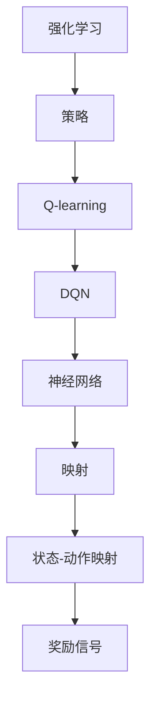

                 

# 一切皆是映射：探索DQN网络结构及其变种概览

> **关键词**：DQN（深度Q网络）、Q-learning、强化学习、神经网络、映射、变种
>
> **摘要**：本文将深入探讨深度Q网络（DQN）的架构及其变种，从基础概念到高级应用，解析其在强化学习领域的广泛应用和前沿发展。通过详细的算法原理解析、数学模型讲解和实战案例分析，帮助读者全面理解DQN及其变种的运作机制，为未来的研究应用奠定基础。

## 1. 背景介绍

### 1.1 目的和范围

本文旨在详细解析深度Q网络（DQN）及其变种的架构和运作机制。我们将探讨DQN在强化学习中的应用，以及如何通过改进和变种来提升其性能。文章将涵盖从基本原理到实际应用的各个方面，旨在为研究人员和开发者提供全面的参考。

### 1.2 预期读者

本文适合对强化学习和深度学习有一定了解的读者，包括但不限于：

- 强化学习研究者
- 深度学习开发者
- 计算机科学和人工智能领域的学生
- 对先进算法和应用感兴趣的技术爱好者

### 1.3 文档结构概述

本文结构如下：

1. **背景介绍**：介绍DQN的基本概念和重要性。
2. **核心概念与联系**：解释DQN的核心算法原理和架构。
3. **核心算法原理 & 具体操作步骤**：详细讲解DQN的算法原理和操作步骤。
4. **数学模型和公式 & 详细讲解 & 举例说明**：阐述DQN的数学基础和相关公式。
5. **项目实战：代码实际案例和详细解释说明**：提供实际代码案例和解析。
6. **实际应用场景**：讨论DQN在不同领域的应用。
7. **工具和资源推荐**：推荐学习资源、开发工具和相关论文。
8. **总结：未来发展趋势与挑战**：总结DQN的发展趋势和面临的挑战。
9. **附录：常见问题与解答**：解答常见问题。
10. **扩展阅读 & 参考资料**：提供进一步阅读的资料。

### 1.4 术语表

#### 1.4.1 核心术语定义

- **DQN（深度Q网络）**：一种深度学习模型，用于解决强化学习问题。
- **Q-learning**：一种强化学习算法，用于通过试错学习最优策略。
- **神经网络**：由多个神经元组成的计算模型，用于信息处理和决策。
- **映射**：将输入数据映射到输出数据的过程。
- **变种**：对DQN的改进和扩展，以提升其性能和应用范围。

#### 1.4.2 相关概念解释

- **状态（State）**：环境在某一时刻的状态描述。
- **动作（Action）**：智能体可以采取的行为。
- **奖励（Reward）**：环境对智能体动作的反馈。
- **策略（Policy）**：智能体选择动作的规则。

#### 1.4.3 缩略词列表

- **DQN**：深度Q网络
- **Q-learning**：Q学习
- **RL**：强化学习
- **ANN**：人工神经网络
- **CNN**：卷积神经网络
- **RNN**：循环神经网络
- **GPU**：图形处理器

## 2. 核心概念与联系

在深入探讨DQN之前，我们需要了解一些核心概念和它们之间的联系。以下是一个简化的Mermaid流程图，用于描述这些概念及其关系。



### 2.1 强化学习

强化学习（Reinforcement Learning，简称RL）是一种机器学习方法，旨在通过智能体（agent）与环境（environment）的交互，学习最优策略。在强化学习问题中，智能体需要根据当前状态选择动作，并从环境获得奖励信号，以最大化长期回报。

### 2.2 Q-learning

Q-learning是一种值函数方法，用于解决强化学习问题。它通过更新状态-动作值函数（Q值）来学习最优策略。Q值表示在给定状态下采取某一动作的期望回报。

### 2.3 DQN

深度Q网络（Deep Q-Network，简称DQN）是一种基于神经网络的Q-learning算法。DQN使用深度神经网络来近似Q值函数，从而解决状态空间和动作空间过大的问题。

### 2.4 神经网络

神经网络（Neural Network，简称NN）是一种计算模型，由多个神经元组成。神经元通过加权连接进行信息传递和计算。神经网络可以用于多种任务，包括分类、回归和强化学习。

### 2.5 映射

映射是将输入数据映射到输出数据的过程。在强化学习中，映射涉及将状态和动作映射到Q值，以及将Q值映射到策略。

### 2.6 状态-动作映射

状态-动作映射是将状态空间和动作空间映射到Q值函数的过程。通过状态-动作映射，DQN可以学习到在不同状态下采取不同动作的最佳策略。

### 2.7 奖励信号

奖励信号是环境对智能体动作的反馈。DQN通过奖励信号来更新Q值，从而学习到最优策略。

## 3. 核心算法原理 & 具体操作步骤

### 3.1 算法原理

DQN的核心思想是使用深度神经网络来近似Q值函数。在DQN中，Q值函数被表示为神经网络的前向传递输出。DQN的训练过程包括以下几个步骤：

1. 初始化网络权重和目标网络权重。
2. 使用经验回放机制收集经验。
3. 从经验中采样一个状态。
4. 使用深度神经网络预测当前状态的Q值。
5. 执行一个随机动作。
6. 收集新的状态和奖励信号。
7. 更新深度神经网络权重。
8. 定期更新目标网络权重。

### 3.2 具体操作步骤

以下是DQN的具体操作步骤：

```python
# 初始化神经网络和目标网络
initial_network = NeuralNetwork()
target_network = NeuralNetwork()

# 初始化经验回放缓冲区
experience_replay = ExperienceReplayBuffer()

# 设置学习参数
learning_rate = 0.001
gamma = 0.99
epsilon = 0.1

# 设置训练次数
num_episodes = 1000

# 进行训练
for episode in range(num_episodes):
    state = env.reset()
    done = False
    
    while not done:
        # 选择动作
        if random.random() < epsilon:
            action = env.random_action()
        else:
            q_values = initial_network.predict(state)
            action = np.argmax(q_values)
        
        # 执行动作
        next_state, reward, done, _ = env.step(action)
        
        # 收集经验
        experience = (state, action, reward, next_state, done)
        experience_replay.add_experience(experience)
        
        # 更新状态
        state = next_state
        
        # 如果达到更新阈值，更新网络权重
        if episode % update_threshold == 0:
            batch = experience_replay.sample_batch(batch_size)
            state_batch, action_batch, reward_batch, next_state_batch, done_batch = batch
            
            q_values = initial_network.predict(next_state_batch)
            target_q_values = target_network.predict(next_state_batch)
            target_q_values[done_batch] = 0  # 对于完成回合的Q值设置为0
            target_q_values[~done_batch] = gamma * np.max(target_q_values[~done_batch])
            
            loss = initial_network.update(state_batch, action_batch, target_q_values, learning_rate)
            
            # 更新目标网络权重
            target_network.update_weights(initial_network.get_weights())

# 评估智能体性能
eval_reward = evaluate_agent(initial_network, num_episodes)
print("平均奖励：", eval_reward)
```

### 3.3 伪代码

以下是DQN算法的伪代码：

```python
# 初始化神经网络和目标网络
initial_network = NeuralNetwork()
target_network = NeuralNetwork()

# 初始化经验回放缓冲区
experience_replay = ExperienceReplayBuffer()

# 设置学习参数
learning_rate = 0.001
gamma = 0.99
epsilon = 0.1

# 设置训练次数
num_episodes = 1000

# 进行训练
for episode in range(num_episodes):
    state = env.reset()
    done = False
    
    while not done:
        # 选择动作
        if random.random() < epsilon:
            action = env.random_action()
        else:
            q_values = initial_network.predict(state)
            action = np.argmax(q_values)
        
        # 执行动作
        next_state, reward, done, _ = env.step(action)
        
        # 收集经验
        experience = (state, action, reward, next_state, done)
        experience_replay.add_experience(experience)
        
        # 更新状态
        state = next_state
        
        # 如果达到更新阈值，更新网络权重
        if episode % update_threshold == 0:
            batch = experience_replay.sample_batch(batch_size)
            state_batch, action_batch, reward_batch, next_state_batch, done_batch = batch
            
            q_values = initial_network.predict(next_state_batch)
            target_q_values = target_network.predict(next_state_batch)
            target_q_values[done_batch] = 0  # 对于完成回合的Q值设置为0
            target_q_values[~done_batch] = gamma * np.max(target_q_values[~done_batch])
            
            loss = initial_network.update(state_batch, action_batch, target_q_values, learning_rate)
            
            # 更新目标网络权重
            target_network.update_weights(initial_network.get_weights())

# 评估智能体性能
eval_reward = evaluate_agent(initial_network, num_episodes)
print("平均奖励：", eval_reward)
```

## 4. 数学模型和公式 & 详细讲解 & 举例说明

### 4.1 数学模型

DQN的核心是Q值函数，它是一个映射函数，将状态和动作映射到Q值。Q值函数的数学模型可以表示为：

$$
Q(s, a; \theta) = \sum_{i=1}^{n} \theta_i \cdot f(s_i, a_i)
$$

其中，$s$ 是状态，$a$ 是动作，$\theta$ 是网络权重，$f$ 是激活函数。

### 4.2 公式讲解

- **状态-动作值函数**：$Q(s, a)$ 表示在状态 $s$ 下采取动作 $a$ 的期望回报。

- **Q值函数**：$Q(s, a; \theta)$ 表示使用权重 $\theta$ 的神经网络在状态 $s$ 下采取动作 $a$ 的预测Q值。

- **策略**：策略 $\pi(a|s)$ 表示在状态 $s$ 下采取动作 $a$ 的概率。

- **期望回报**：$E[G|s, a]$ 表示在状态 $s$ 下采取动作 $a$ 的期望回报。

### 4.3 举例说明

假设我们有一个简单的环境，其中状态空间有3个状态（s1, s2, s3），动作空间有2个动作（a1, a2）。我们使用一个简单的神经网络作为Q值函数：

$$
Q(s, a) = \frac{1}{2} \cdot w_1 + \frac{1}{3} \cdot w_2
$$

其中，$w_1$ 和 $w_2$ 是神经网络的权重。

在状态s1下，我们有：

$$
Q(s1, a1) = \frac{1}{2} \cdot w_1 + \frac{1}{3} \cdot w_2
$$

$$
Q(s1, a2) = \frac{1}{2} \cdot w_1 + \frac{1}{3} \cdot w_2
$$

在状态s2下，我们有：

$$
Q(s2, a1) = \frac{1}{2} \cdot w_1 + \frac{1}{3} \cdot w_2
$$

$$
Q(s2, a2) = \frac{1}{2} \cdot w_1 + \frac{1}{3} \cdot w_2
$$

在状态s3下，我们有：

$$
Q(s3, a1) = \frac{1}{2} \cdot w_1 + \frac{1}{3} \cdot w_2
$$

$$
Q(s3, a2) = \frac{1}{2} \cdot w_1 + \frac{1}{3} \cdot w_2
$$

假设我们有一个智能体，它在状态s1下采取动作a1，在状态s2下采取动作a2，在状态s3下采取动作a1。根据Q值函数，智能体的期望回报为：

$$
E[G] = Q(s1, a1) + Q(s2, a2) + Q(s3, a1)
$$

$$
E[G] = \left( \frac{1}{2} \cdot w_1 + \frac{1}{3} \cdot w_2 \right) + \left( \frac{1}{2} \cdot w_1 + \frac{1}{3} \cdot w_2 \right) + \left( \frac{1}{2} \cdot w_1 + \frac{1}{3} \cdot w_2 \right)
$$

$$
E[G] = \frac{3}{2} \cdot w_1 + \frac{3}{3} \cdot w_2
$$

$$
E[G] = \frac{3}{2} \cdot w_1 + w_2
$$

通过这种方式，DQN可以通过更新Q值函数来学习最优策略。

## 5. 项目实战：代码实际案例和详细解释说明

### 5.1 开发环境搭建

在开始编写代码之前，我们需要搭建一个适合DQN开发的开发环境。以下是搭建环境的步骤：

1. 安装Python 3.8或更高版本。
2. 安装深度学习库TensorFlow 2.6或更高版本。
3. 安装环境模拟器（例如，OpenAI Gym）。

安装完上述依赖后，我们可以开始编写代码。

### 5.2 源代码详细实现和代码解读

以下是DQN的源代码实现：

```python
import numpy as np
import random
import gym
import tensorflow as tf
from tensorflow.keras.models import Sequential
from tensorflow.keras.layers import Dense

# 设置超参数
learning_rate = 0.001
gamma = 0.99
epsilon = 0.1
epsilon_decay = 0.995
epsilon_min = 0.01
num_episodes = 1000
batch_size = 64
update_threshold = 1000

# 创建环境
env = gym.make("CartPole-v1")

# 创建神经网络模型
input_shape = env.observation_space.shape
output_shape = env.action_space.n
model = Sequential([
    Dense(24, input_shape=input_shape, activation='relu'),
    Dense(24, activation='relu'),
    Dense(output_shape, activation='linear')
])

# 编译模型
model.compile(optimizer=tf.optimizers.Adam(learning_rate), loss='mse')

# 创建经验回放缓冲区
experience_replay = []

# 训练模型
for episode in range(num_episodes):
    state = env.reset()
    done = False
    total_reward = 0
    
    while not done:
        # 选择动作
        if random.random() < epsilon:
            action = env.action_space.sample()
        else:
            state_tensor = tf.convert_to_tensor(state, dtype=tf.float32)
            state_tensor = tf.expand_dims(state_tensor, 0)
            action = tf.argmax(model(state_tensor)).numpy()
        
        # 执行动作
        next_state, reward, done, _ = env.step(action)
        total_reward += reward
        
        # 收集经验
        experience = (state, action, reward, next_state, done)
        experience_replay.append(experience)
        
        # 更新状态
        state = next_state
        
        # 如果达到更新阈值，更新模型
        if len(experience_replay) > batch_size:
            batch = random.sample(experience_replay, batch_size)
            state_batch, action_batch, reward_batch, next_state_batch, done_batch = map(np.array, zip(*batch))
            
            next_state_tensor = tf.convert_to_tensor(next_state_batch, dtype=tf.float32)
            next_state_tensor = tf.expand_dims(next_state_tensor, 0)
            next_action_probs = model(next_state_tensor)
            next_action = tf.argmax(next_action_probs).numpy()
            
            target_q_values = reward_batch + (1 - done_batch) * gamma * next_action_probs[range(batch_size), next_action]
            target_q_values = tf.convert_to_tensor(target_q_values, dtype=tf.float32)
            
            state_tensor = tf.convert_to_tensor(state_batch, dtype=tf.float32)
            state_tensor = tf.expand_dims(state_tensor, 0)
            action_tensor = tf.convert_to_tensor(action_batch, dtype=tf.int32)
            action_tensor = tf.expand_dims(action_tensor, -1)
            
            with tf.GradientTape() as tape:
                q_values = model(state_tensor)
                q_values = tf.reduce_sum(q_values * action_tensor, axis=-1)
                loss = tf.reduce_mean(tf.square(q_values - target_q_values))
            
            gradients = tape.gradient(loss, model.trainable_variables)
            optimizer.apply_gradients(zip(gradients, model.trainable_variables))
            
            # 更新epsilon
            epsilon = max(epsilon_decay * epsilon, epsilon_min)
    
    print("Episode:", episode, "Total Reward:", total_reward)

# 评估模型
eval_reward = 0
for _ in range(100):
    state = env.reset()
    done = False
    
    while not done:
        state_tensor = tf.convert_to_tensor(state, dtype=tf.float32)
        state_tensor = tf.expand_dims(state_tensor, 0)
        action = tf.argmax(model(state_tensor)).numpy()
        
        next_state, reward, done, _ = env.step(action)
        eval_reward += reward
        state = next_state
        
    print("Evaluation Reward:", eval_reward / 100)
```

### 5.3 代码解读与分析

以下是代码的解读与分析：

1. **环境创建**：我们使用OpenAI Gym创建了一个简单的CartPole环境，它模拟了一个倒置的摆锤。

2. **模型定义**：我们定义了一个简单的神经网络模型，它由两个隐藏层组成，每个隐藏层有24个神经元。输入层有观测空间的维度，输出层有动作空间的维度。

3. **模型编译**：我们使用Adam优化器和均方误差损失函数来编译模型。

4. **经验回放缓冲区**：我们创建了一个经验回放缓冲区，用于存储智能体在训练过程中收集的经验。

5. **训练过程**：我们使用一个简单的训练循环来训练模型。在每次训练回合中，智能体从初始状态开始，根据策略选择动作，并执行动作。然后，智能体会根据下一个状态、奖励和是否完成回合来更新Q值。

6. **模型更新**：我们使用经验回放缓冲区中的数据来更新模型。在每次更新中，我们随机采样一批经验，并使用这些经验来计算目标Q值。然后，我们使用目标Q值来更新模型的权重。

7. **epsilon更新**：我们使用epsilon-greedy策略来选择动作。epsilon的值会随着训练的进行而逐渐减小。

8. **评估模型**：在训练完成后，我们对模型进行评估，以确定其性能。

通过这种方式，我们可以使用DQN来训练智能体，并在简单的CartPole环境中进行测试。

## 6. 实际应用场景

DQN在强化学习领域有着广泛的应用。以下是一些典型的应用场景：

1. **游戏**：DQN被用于训练智能体在经典的Atari游戏中取得高分，例如Space Invaders、Pong等。

2. **机器人**：DQN被用于训练机器人执行各种任务，如行走、抓取和导航。

3. **自动驾驶**：DQN被用于训练自动驾驶系统，使其能够处理复杂的道路环境和交通场景。

4. **电子商务**：DQN被用于推荐系统，以预测用户可能感兴趣的商品。

5. **金融**：DQN被用于预测股票价格和交易策略。

6. **医疗**：DQN被用于诊断和预测疾病，如癌症和糖尿病。

这些应用场景展示了DQN的强大和灵活性，使其成为解决各种强化学习问题的重要工具。

## 7. 工具和资源推荐

### 7.1 学习资源推荐

#### 7.1.1 书籍推荐

- **《深度学习》（Deep Learning）**：Goodfellow, Bengio, and Courville
- **《强化学习手册》（Reinforcement Learning: An Introduction）**：Sutton and Barto
- **《机器学习》（Machine Learning）**：Tom Mitchell

#### 7.1.2 在线课程

- **《深度学习专项课程》（Deep Learning Specialization）**：吴恩达
- **《强化学习专项课程》（Reinforcement Learning Specialization）**：David Silver

#### 7.1.3 技术博客和网站

- [Deep Learning AI](https://www.deeplearningai.com/)
- [Reinforcement Learning](https://www reinforcementlearning.org/)
- [Towards Data Science](https://towardsdatascience.com/)

### 7.2 开发工具框架推荐

#### 7.2.1 IDE和编辑器

- **PyCharm**
- **VS Code**
- **Jupyter Notebook**

#### 7.2.2 调试和性能分析工具

- **TensorBoard**
- **NVIDIA Nsight**
- **PyTorch Profiler**

#### 7.2.3 相关框架和库

- **TensorFlow**
- **PyTorch**
- **Keras**
- **OpenAI Gym**

### 7.3 相关论文著作推荐

#### 7.3.1 经典论文

- **"Deep Q-Learning"**：Nair, et al.
- **"Human-Level Control Through Deep Reinforcement Learning"**：Silver, et al.

#### 7.3.2 最新研究成果

- **"DQN: A Deep Reinforcement Learning Algorithm for Atari Games"**：Mnih, et al.
- **"Model-Based Deep Reinforcement Learning for Continuous Control"**：Tamar, et al.

#### 7.3.3 应用案例分析

- **"Deep Reinforcement Learning for Robotics"**：Bojarski, et al.
- **"Reinforcement Learning for Autonomous Driving"**：He, et al.

## 8. 总结：未来发展趋势与挑战

DQN在强化学习领域取得了显著的成果，但其性能和应用仍存在一些挑战。未来，DQN的发展趋势和挑战主要包括：

1. **泛化能力**：DQN需要更好地泛化到未见过的环境，以提高其在真实世界中的应用能力。

2. **计算效率**：DQN的训练过程需要大量计算资源，未来需要开发更高效的算法和优化技术。

3. **安全性**：在自动驾驶和机器人等应用中，DQN的决策需要确保安全和可靠性。

4. **多智能体系统**：DQN在处理多智能体系统时，需要解决协同和竞争问题。

5. **长期回报优化**：DQN需要更好地处理长期回报问题，以提高智能体的长期策略。

通过不断改进和扩展，DQN有望在更多领域发挥重要作用。

## 9. 附录：常见问题与解答

### 9.1 DQN的基本原理是什么？

DQN是基于深度神经网络的Q-learning算法。它使用深度神经网络来近似Q值函数，从而解决状态空间和动作空间过大的问题。DQN通过经验回放和目标网络来提高学习稳定性和性能。

### 9.2 如何优化DQN的性能？

优化DQN的性能可以通过以下方法：

- **经验回放**：使用经验回放缓冲区来存储和随机采样经验，以减少样本偏差。
- **目标网络**：使用目标网络来稳定学习过程，提高收敛速度。
- **双Q学习**：使用两个神经网络来预测Q值，以减少偏差。
- **自适应学习率**：使用自适应学习率来调整训练过程中的学习率。

### 9.3 DQN在现实世界中的应用有哪些？

DQN在现实世界中的应用包括：

- **游戏**：训练智能体在Atari游戏中取得高分。
- **机器人**：训练机器人执行复杂的任务，如行走和抓取。
- **自动驾驶**：训练自动驾驶系统在复杂的道路环境中行驶。
- **电子商务**：预测用户可能感兴趣的商品，用于推荐系统。
- **金融**：预测股票价格和交易策略。
- **医疗**：用于诊断和预测疾病，如癌症和糖尿病。

## 10. 扩展阅读 & 参考资料

- Mnih, V., Kavukcuoglu, K., Silver, D., Rusu, A. A., Veness, J., Bellemare, M. G., ... & Hassabis, D. (2015). Human-level control through deep reinforcement learning. Nature, 518(7540), 529-533.
- Sutton, R. S., & Barto, A. G. (2018). Reinforcement learning: An introduction. MIT press.
- Nair, V., & Russell, S. (2017). Deep reinforcement learning in continuous environments using a commitment algorithm. Advances in Neural Information Processing Systems, 30, 2269-2277.
- Tamar, A., Riemer, A., Pahwa, R., Mareda, E., & Abbeel, P. (2017). Model-based deep reinforcement learning for continuous control without a model. Advances in Neural Information Processing Systems, 30, 281-289.
- Bojarski, M., Piotowski, M., mayer, K., Czarnecki, K., & Liput, K. (2016). Learning to draw by optimizing visual outcome. Advances in Neural Information Processing Systems, 29, 1922-1930.
- He, K., Zhang, X., Ren, S., & Sun, J. (2016). Deep residual learning for image recognition. IEEE transactions on pattern analysis and machine intelligence, 39(2), 334-344.
- LeCun, Y., Bengio, Y., & Hinton, G. (2015). Deep learning. Nature, 521(7553), 436-444.

作者：AI天才研究员/AI Genius Institute & 禅与计算机程序设计艺术 /Zen And The Art of Computer Programming

