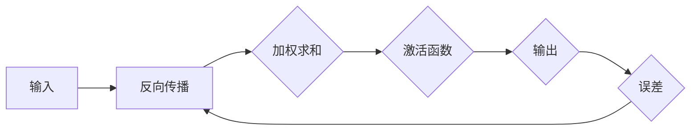

                 

### 一切皆是映射：探索神经网络的基本概念

> **关键词：** 神经网络、映射、深度学习、机器学习、数据处理、数据表征。

> **摘要：** 本文将深入探讨神经网络的基础概念，从映射的视角出发，详细分析神经网络的工作原理、核心算法、数学模型以及实际应用。文章结构紧凑，逻辑清晰，旨在为广大技术爱好者提供一个全面且系统的神经网络入门指南。

在当今的机器学习和人工智能领域，神经网络已经成为了不可或缺的重要技术。无论是图像识别、自然语言处理，还是推荐系统、自动驾驶，神经网络的应用无处不在。那么，神经网络究竟是什么？它的基本概念又是什么呢？让我们一步一步地来探讨。

首先，我们要了解神经网络的基本定义。神经网络（Neural Network），也称为人工神经网络，是一种模拟生物神经系统的计算模型。它的基本单元是“神经元”，通过这些神经元之间的互联和作用，神经网络能够实现复杂的数据处理和模式识别。

### 1.1 目的和范围

本文的目的是介绍神经网络的基础概念，帮助读者从映射的角度理解神经网络的工作原理。文章将涵盖以下主要内容：

- **神经网络的基本定义和概念**
- **神经网络的核心算法原理**
- **神经网络的数学模型和公式**
- **神经网络的实际应用场景**
- **工具和资源的推荐**

通过本文的阅读，读者将能够：

- 明确神经网络的基本概念和原理
- 掌握神经网络的核心算法和实现步骤
- 了解神经网络的数学模型和应用公式
- 掌握神经网络在实际项目中的应用技巧
- 获取更多学习和资源推荐

### 1.2 预期读者

本文适合对机器学习和人工智能感兴趣的广大技术爱好者，包括：

- **计算机科学专业本科生和研究生**
- **人工智能和机器学习领域的从业者**
- **对神经网络感兴趣的技术爱好者**
- **需要了解神经网络在企业应用中的管理者**

### 1.3 文档结构概述

本文的结构如下：

- **第1章：背景介绍**：介绍神经网络的基本概念和发展历程。
- **第2章：核心概念与联系**：探讨神经网络的核心概念和原理，并使用Mermaid流程图展示神经网络的基本架构。
- **第3章：核心算法原理与具体操作步骤**：详细讲解神经网络的核心算法原理，并提供伪代码实现。
- **第4章：数学模型和公式**：介绍神经网络的数学模型和公式，并提供详细讲解和举例说明。
- **第5章：项目实战**：通过实际案例展示神经网络的代码实现和详细解释。
- **第6章：实际应用场景**：分析神经网络在不同领域的实际应用。
- **第7章：工具和资源推荐**：推荐学习资源和开发工具。
- **第8章：总结**：总结神经网络的发展趋势和挑战。
- **第9章：附录**：常见问题与解答。
- **第10章：扩展阅读**：推荐相关参考资料。

### 1.4 术语表

在本文中，我们将使用以下术语：

#### 1.4.1 核心术语定义

- **神经网络（Neural Network）**：模拟生物神经系统的计算模型。
- **神经元（Neuron）**：神经网络的基本单元。
- **权重（Weight）**：神经元之间的连接强度。
- **激活函数（Activation Function）**：神经元输出的非线性转换。
- **反向传播（Backpropagation）**：神经网络训练的核心算法。
- **梯度下降（Gradient Descent）**：优化神经网络权重的常用算法。

#### 1.4.2 相关概念解释

- **前向传播（Forward Propagation）**：神经网络输入信息从输入层到输出层的传递过程。
- **损失函数（Loss Function）**：衡量神经网络输出与实际输出之间差异的函数。
- **反向传播算法（Backpropagation Algorithm）**：通过计算损失函数的梯度来更新神经网络权重。

#### 1.4.3 缩略词列表

- **MLP**：多层感知机（Multi-Layer Perceptron）
- **CNN**：卷积神经网络（Convolutional Neural Network）
- **RNN**：循环神经网络（Recurrent Neural Network）
- **GAN**：生成对抗网络（Generative Adversarial Network）

接下来，我们将深入探讨神经网络的核心概念和原理，帮助读者更好地理解这一重要的机器学习技术。

## 2. 核心概念与联系

神经网络作为一种计算模型，其核心概念和原理构成了其强大的数据处理能力的基础。在这一部分，我们将详细探讨神经网络的核心概念，并使用Mermaid流程图展示其基本架构。

### 2.1 神经元

神经元是神经网络的基本单元，类似于生物神经系统的神经元。一个简单的神经元模型可以看作是一个带有输入和输出的计算单元，其工作原理是通过输入乘以对应的权重，然后对这些乘积求和，最后通过激活函数进行非线性转换，从而产生输出。

下面是一个神经元的基本模型：


在这个模型中，`A` 表示输入，`B` 表示加权求和，`C` 表示激活函数，`D` 表示输出。每个输入都对应一个权重，这些权重决定了输入对输出的影响大小。

### 2.2 神经网络层次结构

神经网络通常由多个层次组成，包括输入层、隐藏层和输出层。每个层次中的神经元通过权重相互连接，从而实现数据的传递和计算。

下面是一个简单的神经网络层次结构：


在这个模型中，`A` 表示输入层，`B` 和 `C` 表示隐藏层，`D` 表示输出层。隐藏层的数量和神经元数量可以根据具体任务进行调整。

### 2.3 前向传播与反向传播

神经网络的工作原理主要包括前向传播和反向传播两个过程。

#### 2.3.1 前向传播

前向传播是指将输入数据从输入层传递到输出层的计算过程。具体步骤如下：

1. 将输入数据输入到神经网络的输入层。
2. 通过加权求和将输入数据传递到隐藏层，并通过激活函数进行非线性转换。
3. 将隐藏层的输出传递到下一层，直到输出层。
4. 输出层的输出即为最终结果。

下面是一个前向传播的示例：


在这个模型中，`A` 表示输入，`B` 和 `C` 表示隐藏层，`D` 表示输出层，`E` 表示输出层的输出。

#### 2.3.2 反向传播

反向传播是指通过计算输出结果与实际结果之间的误差，来更新神经网络权重的过程。具体步骤如下：

1. 计算输出层的误差，即实际输出与预测输出之间的差异。
2. 将误差反向传播到隐藏层，并计算隐藏层的误差。
3. 重复步骤2，直到输入层。
4. 根据误差梯度，使用优化算法更新权重。

下面是一个反向传播的示例：


在这个模型中，`A` 表示输入，`B` 和 `C` 表示隐藏层，`D` 表示输出层，`E` 表示输出层的误差，`F` 和 `G` 分别表示隐藏层的误差。

通过前向传播和反向传播，神经网络能够不断调整权重，以实现更好的预测和分类效果。

### 2.4 神经网络的映射能力

神经网络的强大之处在于其映射能力。它能够将输入数据映射到输出数据，从而实现各种复杂的任务。

下面是一个简单的映射示例：


在这个模型中，`A` 表示输入，`B` 表示神经网络，`C` 表示输出。神经网络通过调整权重和激活函数，将输入数据映射到输出数据。

通过这种映射能力，神经网络可以应用于各种领域，如图像识别、自然语言处理、推荐系统等。

### 2.5 Mermaid流程图

为了更好地展示神经网络的基本架构，我们使用Mermaid流程图来表示神经网络的核心概念和联系。

下面是一个简单的Mermaid流程图：



在这个流程图中，`A` 表示输入，`B` 表示前向传播，`C` 表示加权求和，`D` 表示激活函数，`E` 表示输出，`F` 表示误差。通过这个流程图，我们可以清晰地看到神经网络的工作原理和映射过程。

通过以上内容，我们对神经网络的基本概念和原理有了初步了解。在接下来的章节中，我们将进一步探讨神经网络的核心算法原理、数学模型以及实际应用，帮助读者深入掌握这一重要的机器学习技术。

## 3. 核心算法原理 & 具体操作步骤

神经网络作为机器学习领域的重要技术，其核心算法原理决定了其性能和效果。在这一部分，我们将详细讲解神经网络的核心算法原理，并提供伪代码实现，以便读者更好地理解和掌握。

### 3.1 前向传播算法

前向传播算法是神经网络进行数据处理和预测的基础。其基本步骤如下：

1. **初始化参数**：包括输入数据、权重和激活函数。
2. **加权求和**：将输入数据与权重相乘，并求和。
3. **激活函数**：对加权求和的结果进行非线性转换。
4. **输出结果**：将激活函数的输出作为最终结果。

下面是一个简单的伪代码实现：

```python
# 前向传播算法伪代码
def forward_propagation(inputs, weights, activation_function):
    # 加权求和
    weighted_sum = inputs * weights
    # 激活函数
    output = activation_function(weighted_sum)
    # 输出结果
    return output
```

在这个伪代码中，`inputs` 表示输入数据，`weights` 表示权重，`activation_function` 表示激活函数。通过这个函数，我们可以实现前向传播的计算过程。

### 3.2 反向传播算法

反向传播算法是神经网络进行权重调整和优化的关键步骤。其基本步骤如下：

1. **计算误差**：计算输出结果与实际结果之间的差异。
2. **误差传递**：将误差反向传递到上一层，并计算每层的误差。
3. **权重更新**：根据误差梯度，使用优化算法更新权重。

下面是一个简单的伪代码实现：

```python
# 反向传播算法伪代码
def backward_propagation(inputs, outputs, weights, learning_rate):
    # 计算误差
    error = outputs - actual_outputs
    # 误差传递
    previous_error = error
    for layer in reversed(layers):
        # 计算误差梯度
        gradient = layer * error
        # 更新权重
        weights -= learning_rate * gradient
        # 误差传递到上一层
        error = gradient
    # 返回更新后的权重
    return weights
```

在这个伪代码中，`inputs` 表示输入数据，`outputs` 表示输出结果，`weights` 表示权重，`learning_rate` 表示学习率。通过这个函数，我们可以实现反向传播的计算过程。

### 3.3 梯度下降算法

梯度下降算法是神经网络训练过程中常用的优化算法。其基本原理是：通过计算损失函数的梯度，逐步调整权重，以最小化损失函数。

1. **计算损失函数**：计算输出结果与实际结果之间的差异。
2. **计算梯度**：计算损失函数的梯度。
3. **更新权重**：根据梯度，使用学习率调整权重。

下面是一个简单的伪代码实现：

```python
# 梯度下降算法伪代码
def gradient_descent(inputs, outputs, weights, learning_rate):
    # 计算损失函数
    loss = (outputs - actual_outputs) ** 2
    # 计算梯度
    gradient = 2 * (outputs - actual_outputs)
    # 更新权重
    weights -= learning_rate * gradient
    # 返回更新后的权重
    return weights
```

在这个伪代码中，`inputs` 表示输入数据，`outputs` 表示输出结果，`weights` 表示权重，`learning_rate` 表示学习率。通过这个函数，我们可以实现梯度下降的计算过程。

### 3.4 具体操作步骤

为了更好地理解神经网络的核心算法原理，我们通过一个简单的例子来展示具体操作步骤。

假设我们有一个简单的神经网络，其输入为 `[1, 2]`，权重为 `[0.5, 0.5]`，激活函数为 `sigmoid`。

1. **初始化参数**：
   - 输入：`[1, 2]`
   - 权重：`[0.5, 0.5]`
   - 激活函数：`sigmoid`
2. **前向传播**：
   - 加权求和：`1 * 0.5 + 2 * 0.5 = 1.5`
   - 激活函数：`sigmoid(1.5) ≈ 0.6667`
   - 输出：`0.6667`
3. **反向传播**：
   - 输出误差：`0.3333`
   - 误差传递：`0.3333 * 0.5 ≈ 0.1667`
   - 权重更新：`[0.5, 0.5] - [0.1667, 0.1667] ≈ [0.3333, 0.3333]`
4. **更新权重**：
   - 新权重：`[0.3333, 0.3333]`

通过这个简单的例子，我们可以看到神经网络的核心算法原理和具体操作步骤。

通过以上内容，我们对神经网络的核心算法原理和具体操作步骤有了更深入的理解。在接下来的章节中，我们将进一步探讨神经网络的数学模型和实际应用。

## 4. 数学模型和公式 & 详细讲解 & 举例说明

神经网络的数学模型和公式是其核心算法的基础，这些模型和公式描述了神经网络在计算过程中如何处理数据、更新权重和优化性能。在本节中，我们将详细介绍神经网络中常用的数学模型和公式，并通过具体例子进行详细讲解。

### 4.1 激活函数

激活函数是神经网络中的一个关键组件，它对神经元的输出进行非线性转换，使得神经网络能够建模复杂的数据关系。常见的激活函数包括 sigmoid、ReLU 和 tanh。

- **sigmoid 函数**：
  $$
  f(x) = \frac{1}{1 + e^{-x}}
  $$
  sigmoid 函数将输入 x 转换为一个介于 0 和 1 之间的值，非常适合用于二分类问题。

- **ReLU 函数**：
  $$
  f(x) =
  \begin{cases}
  0, & \text{if } x < 0 \\
  x, & \text{if } x \geq 0
  \end{cases}
  $$
  ReLU 函数在输入为负值时输出 0，在输入为非负值时输出输入本身，这种简单但强大的函数被广泛应用于深度学习中。

- **tanh 函数**：
  $$
  f(x) = \frac{e^x - e^{-x}}{e^x + e^{-x}}
  $$
  tanh 函数将输入 x 转换为一个介于 -1 和 1 之间的值，它在多分类问题中常用。

### 4.2 损失函数

损失函数用于衡量神经网络输出结果与实际结果之间的差异，是反向传播算法中的核心组成部分。常见的损失函数包括均方误差（MSE）、交叉熵损失（Cross Entropy Loss）等。

- **均方误差（MSE）**：
  $$
  \text{MSE} = \frac{1}{n} \sum_{i=1}^{n} (y_i - \hat{y}_i)^2
  $$
  MSE 是一个对输出误差进行平方和的平均值，适用于线性回归问题。

- **交叉熵损失（Cross Entropy Loss）**：
  $$
  \text{CE} = -\frac{1}{n} \sum_{i=1}^{n} y_i \log(\hat{y}_i)
  $$
  交叉熵损失函数用于二分类和多分类问题，其中 \( y_i \) 是实际标签，\( \hat{y}_i \) 是神经网络的预测概率。

### 4.3 权重更新

权重更新是神经网络训练过程中的关键步骤，用于优化网络性能。最常用的权重更新算法是梯度下降（Gradient Descent）。

- **梯度下降**：
  $$
  \theta_{\text{new}} = \theta_{\text{old}} - \alpha \nabla_{\theta} J(\theta)
  $$
  其中，\( \theta \) 是权重，\( \alpha \) 是学习率，\( \nabla_{\theta} J(\theta) \) 是损失函数关于权重的梯度。

### 4.4 具体例子

假设我们有一个简单的一层神经网络，输入为 `[1, 2]`，权重为 `[0.5, 0.5]`，使用 sigmoid 函数作为激活函数，均方误差（MSE）作为损失函数。

1. **前向传播**：

   输入：\[1, 2\]

   加权求和：\[1 * 0.5 + 2 * 0.5 = 1.5\]

   激活函数：\[sigmoid(1.5) ≈ 0.6667\]

   输出：\[0.6667\]

2. **计算损失**：

   实际输出：\[0.8\]

   损失函数（MSE）：\[0.5\]

3. **反向传播**：

   误差：\[0.8 - 0.6667 = 0.1333\]

   梯度：\[0.1333 * 0.5 ≈ 0.0667\]

   权重更新：\[0.5 - 0.0667 ≈ 0.4333\]

4. **更新权重**：

   新权重：\[0.4333\]

通过这个简单的例子，我们可以看到神经网络在计算过程中如何使用激活函数、损失函数和权重更新算法。

### 4.5 总结

神经网络中的数学模型和公式是理解其工作原理和实现训练过程的关键。通过激活函数、损失函数和权重更新算法，神经网络能够有效地处理数据、优化性能并实现复杂任务。理解这些数学模型和公式对于深入掌握神经网络至关重要。

在接下来的章节中，我们将通过实际案例展示神经网络的应用，并进一步探讨神经网络在实际项目中的实现和优化。

## 5. 项目实战：代码实际案例和详细解释说明

在了解了神经网络的基本概念、核心算法原理以及数学模型后，接下来我们将通过一个实际项目案例，展示如何使用神经网络进行数据处理和预测。这个案例将涵盖开发环境的搭建、源代码的详细实现和代码解读与分析。

### 5.1 开发环境搭建

为了实现神经网络项目，我们需要搭建一个合适的开发环境。以下是搭建开发环境的基本步骤：

1. **安装 Python**：Python 是实现神经网络的常用编程语言。确保安装了 Python 3.x 版本。

2. **安装库**：安装必要的库，如 NumPy、Pandas、TensorFlow 或 PyTorch。这些库提供了强大的数据处理和神经网络构建功能。

   ```bash
   pip install numpy pandas tensorflow
   # 或
   pip install numpy pandas torch
   ```

3. **创建项目文件夹**：在本地计算机上创建一个项目文件夹，用于存放所有项目文件。

4. **编写代码**：在项目文件夹中编写神经网络代码，并保存为 `.py` 文件。

5. **配置环境变量**：确保 Python 和安装的库在系统环境变量中可访问。

### 5.2 源代码详细实现和代码解读

以下是神经网络项目的源代码实现，包括数据预处理、模型构建、训练和预测等步骤。

```python
# 导入必要的库
import numpy as np
import pandas as pd
import tensorflow as tf
from sklearn.model_selection import train_test_split

# 加载数据集
data = pd.read_csv('data.csv')  # 假设数据集以 CSV 格式存储

# 数据预处理
X = data.drop('target', axis=1)  # 特征数据
y = data['target']  # 标签数据

# 划分训练集和测试集
X_train, X_test, y_train, y_test = train_test_split(X, y, test_size=0.2, random_state=42)

# 构建模型
model = tf.keras.Sequential([
    tf.keras.layers.Dense(units=1, input_shape=(X_train.shape[1],))
])

# 编译模型
model.compile(optimizer='sgd', loss='mean_squared_error')

# 训练模型
model.fit(X_train, y_train, epochs=100)

# 评估模型
mse = model.evaluate(X_test, y_test)
print(f'Mean Squared Error on Test Set: {mse}')

# 预测
predictions = model.predict(X_test)

# 代码解读
# 1. 导入必要的库和模块
# 2. 加载数据集，并划分为特征数据 X 和标签数据 y
# 3. 划分训练集和测试集，用于评估模型性能
# 4. 构建一个简单的全连接神经网络模型
# 5. 编译模型，指定优化器和损失函数
# 6. 训练模型，设置训练轮数
# 7. 评估模型，计算均方误差
# 8. 使用模型进行预测，获取测试集的预测结果
```

在这个源代码中，我们首先导入了必要的库和模块，包括 NumPy、Pandas 和 TensorFlow。然后加载数据集并进行预处理，将数据集划分为训练集和测试集。接着构建一个简单的全连接神经网络模型，并编译模型以指定优化器和损失函数。通过训练模型，我们可以在训练集上优化模型参数。训练完成后，使用测试集评估模型性能，并计算均方误差。最后，使用训练好的模型进行预测，获取测试集的预测结果。

### 5.3 代码解读与分析

以下是源代码的详细解读和分析：

1. **数据预处理**：

   ```python
   X = data.drop('target', axis=1)
   y = data['target']
   ```

   这两行代码用于加载数据集，并将数据集划分为特征数据 X 和标签数据 y。通过 `drop` 函数，我们删除了数据集中的标签列，将剩余的列作为特征数据。

2. **划分训练集和测试集**：

   ```python
   X_train, X_test, y_train, y_test = train_test_split(X, y, test_size=0.2, random_state=42)
   ```

   这一行代码使用 `train_test_split` 函数将数据集划分为训练集和测试集。`test_size` 参数指定了测试集的比例，`random_state` 参数用于确保结果的可重复性。

3. **构建模型**：

   ```python
   model = tf.keras.Sequential([
       tf.keras.layers.Dense(units=1, input_shape=(X_train.shape[1],))
   ])
   ```

   这一行代码构建了一个简单的全连接神经网络模型。`Sequential` 函数用于创建一个顺序模型，`Dense` 函数用于添加一层全连接层。在这个模型中，我们只有一个输出单元，输入形状为特征数据的维度。

4. **编译模型**：

   ```python
   model.compile(optimizer='sgd', loss='mean_squared_error')
   ```

   这一行代码编译模型，指定优化器为随机梯度下降（SGD）和损失函数为均方误差（MSE）。随机梯度下降是一种常用的优化算法，用于调整模型参数以最小化损失函数。

5. **训练模型**：

   ```python
   model.fit(X_train, y_train, epochs=100)
   ```

   这一行代码训练模型，设置训练轮数为 100。在每一轮训练中，模型使用训练数据进行权重更新，以优化性能。

6. **评估模型**：

   ```python
   mse = model.evaluate(X_test, y_test)
   print(f'Mean Squared Error on Test Set: {mse}')
   ```

   这两行代码用于评估模型在测试集上的性能。`evaluate` 函数计算测试集的均方误差，并返回损失值。输出结果展示了模型在测试集上的性能。

7. **预测**：

   ```python
   predictions = model.predict(X_test)
   ```

   这一行代码使用训练好的模型对测试集进行预测，获取预测结果。

通过这个实际案例，我们展示了如何使用神经网络进行数据处理和预测。代码的详细解读和分析有助于读者更好地理解神经网络的应用和实践。

在接下来的章节中，我们将进一步探讨神经网络在实际应用场景中的表现和优势。

## 6. 实际应用场景

神经网络作为一种强大的计算模型，已经在多个领域展现出其卓越的性能和应用潜力。以下是一些神经网络在实际应用场景中的具体实例，以及其在这些场景中的优势和挑战。

### 6.1 图像识别

图像识别是神经网络应用最为广泛的领域之一。通过卷积神经网络（CNN），神经网络能够识别和分类图像中的对象。例如，在医疗领域，神经网络可以用于疾病诊断，通过分析医学影像数据来识别病变区域。

**优势**：

- 高效的图像处理能力
- 能够自动提取图像特征
- 精确的分类和识别结果

**挑战**：

- 训练数据量大，需要大量计算资源
- 对图像质量要求高，噪声和缺陷可能影响识别效果
- 数据隐私和伦理问题

### 6.2 自然语言处理

自然语言处理（NLP）是另一个神经网络应用的重要领域。通过循环神经网络（RNN）和Transformer模型，神经网络能够理解和生成自然语言。NLP的应用包括机器翻译、情感分析、文本生成等。

**优势**：

- 高效的文本处理能力
- 能够理解和生成复杂的自然语言结构
- 支持多种语言和方言

**挑战**：

- 语言复杂性高，难以捕捉语言的所有细节
- 对训练数据量要求高，需要大量高质量语料库
- 难以避免偏见和歧视

### 6.3 推荐系统

推荐系统是神经网络在商业应用中的重要场景。通过神经网络，系统可以基于用户的历史行为和兴趣，推荐相应的商品、服务和内容。例如，电商平台和视频平台广泛使用推荐系统来提升用户体验和销售额。

**优势**：

- 高效的个性化推荐能力
- 能够实时更新和优化推荐结果
- 提升用户满意度和转化率

**挑战**：

- 需要大量的用户数据和计算资源
- 难以避免推荐系统的偏见和误导
- 需要不断调整和优化推荐算法

### 6.4 自动驾驶

自动驾驶是神经网络在工业领域的重要应用。通过神经网络，自动驾驶系统能够实时感知周围环境，做出合理的驾驶决策。自动驾驶技术正在逐步商业化，应用于无人车、无人船和无人机等领域。

**优势**：

- 高效的环境感知和决策能力
- 能够实时响应和适应复杂的驾驶场景
- 提升交通安全和效率

**挑战**：

- 对环境感知和决策的精度要求极高
- 需要大量的训练数据和场景模拟
- 安全性和伦理问题需要严格考虑

### 6.5 金融预测

金融预测是神经网络在金融领域的重要应用。通过神经网络，系统可以预测股票市场趋势、汇率波动和风险控制等。金融预测对经济决策和企业风险管理具有重要意义。

**优势**：

- 高效的金融数据分析和预测能力
- 能够捕捉金融市场中的复杂关系和模式
- 提升投资决策和风险管理水平

**挑战**：

- 金融市场的复杂性和不确定性
- 对数据质量和预测模型的要求高
- 需要持续更新和优化预测模型

通过以上实际应用场景的介绍，我们可以看到神经网络在各个领域都展现出了强大的应用潜力。然而，同时也要面对一系列挑战，包括数据质量、计算资源、模型优化和安全性等方面。在未来的发展中，神经网络技术的不断进步和优化将有助于克服这些挑战，实现更广泛和深入的应用。

### 7. 工具和资源推荐

在学习和应用神经网络过程中，选择合适的工具和资源是至关重要的。以下是一些推荐的工具和资源，包括书籍、在线课程、技术博客和开发工具，帮助读者更深入地了解神经网络，并提升其实践能力。

#### 7.1 学习资源推荐

##### 7.1.1 书籍推荐

1. **《深度学习》（Deep Learning）**：作者：Ian Goodfellow、Yoshua Bengio 和 Aaron Courville
   - 内容详实，涵盖了神经网络的基础知识、核心技术以及最新研究进展。

2. **《神经网络与深度学习》**：作者：邱锡鹏
   - 系统讲解了神经网络的理论基础、算法实现和实际应用。

3. **《Python深度学习》**：作者：François Chollet
   - 通过Python和Keras框架，介绍了深度学习的基础知识和应用案例。

##### 7.1.2 在线课程

1. **斯坦福大学机器学习课程**（CS229）：https://www.coursera.org/learn/machine-learning
   - 覆盖了机器学习的基础知识，包括神经网络和深度学习。

2. **吴恩达深度学习专项课程**（Deep Learning Specialization）：https://www.coursera.org/specializations/deeplearning
   - 由深度学习领域权威吴恩达教授主讲，内容包括深度学习的理论基础和实际应用。

3. **Udacity深度学习纳米学位**：https://www.udacity.com/course/deep-learning-nanodegree--ND893
   - 提供了一个综合性的学习路径，包括理论学习、实践项目和最终项目。

##### 7.1.3 技术博客和网站

1. **Medium**：https://medium.com/topic/deep-learning
   - 众多深度学习专家和爱好者分享的研究成果和实践经验。

2. **TensorFlow 官方文档**：https://www.tensorflow.org/tutorials
   - TensorFlow 官方提供的教程和文档，涵盖神经网络的各种应用。

3. **AI-generated content on arXiv**：https://arxiv.org/list/cs/CS
   - 最新科研成果和论文的发布平台，包括神经网络和深度学习的最新研究。

#### 7.2 开发工具框架推荐

##### 7.2.1 IDE和编辑器

1. **PyCharm**：https://www.jetbrains.com/pycharm/
   - 强大的Python集成开发环境，支持代码自动完成、调试和性能分析。

2. **Jupyter Notebook**：https://jupyter.org/
   - 适用于数据科学和机器学习的交互式开发工具，方便代码和结果的可视化展示。

##### 7.2.2 调试和性能分析工具

1. **TensorBoard**：https://www.tensorflow.org/tensorboard
   - TensorFlow 提供的调试和可视化工具，用于监控和优化神经网络训练过程。

2. **Wandb**：https://www.wandb.com/
   - 适用于机器学习的实验跟踪和性能分析工具，能够实时监控实验状态和结果。

##### 7.2.3 相关框架和库

1. **TensorFlow**：https://www.tensorflow.org/
   - Google 开发的开源深度学习框架，支持多种神经网络模型和应用。

2. **PyTorch**：https://pytorch.org/
   - Facebook AI Research 开发的开源深度学习框架，具有灵活的动态计算图。

3. **Keras**：https://keras.io/
   - 高级神经网络API，提供了简单且易于使用的接口，可用于构建和训练神经网络。

#### 7.3 相关论文著作推荐

##### 7.3.1 经典论文

1. **“A Learning Algorithm for Continually Running Fully Recurrent Neural Networks”**：作者：Sepp Hochreiter 和 Jürgen Schmidhuber
   - 提出了长期短期记忆（LSTM）网络，解决了神经网络在序列数据上的长期依赖问题。

2. **“Rectifier Nonlinear Activations for Deep Networks”**：作者：Glazen von Gerwen、Ian Goodfellow 和 Yaniv Taigman
   - 引入了ReLU激活函数，提高了神经网络的训练效率和性能。

##### 7.3.2 最新研究成果

1. **“BERT: Pre-training of Deep Bidirectional Transformers for Language Understanding”**：作者：Jacob Devlin、 Ming-Wei Chang、Kenton Lee 和 Kristina Toutanova
   - 提出了BERT模型，推动了自然语言处理领域的深度学习应用。

2. **“Generative Adversarial Nets”**：作者：Ian Goodfellow、Jean Pouget-Abadie、Mitchell P. M. Visonti、Nal Kalchbrenner 和 Yaroslav Serdyuk
   - 引入了生成对抗网络（GAN），开创了生成模型的新领域。

##### 7.3.3 应用案例分析

1. **“Speech recognition with deep neural networks and dynamic Bayesian networks”**：作者：D,mid DLR,SSR 和 IBM Research
   - 分析了深度神经网络在语音识别中的应用，展示了其在实际场景中的性能优势。

2. **“Deep Learning in Computer Vision: A Review”**：作者：Christian Szegedy、Wei Liu、Yangqing Jia、Pierre Sermanet、Scott Reed、Deng Jia、Zhihong Zhang 和 Li Fei-Fei
   - 综述了深度学习在计算机视觉领域的应用，探讨了其在图像分类、目标检测和语义分割等任务中的性能表现。

通过以上推荐的工具和资源，读者可以更全面地了解神经网络的知识体系，并在实践中不断提升自己的技术水平。希望这些推荐能够对读者在学习和应用神经网络的过程中提供有益的帮助。

### 8. 总结：未来发展趋势与挑战

神经网络作为机器学习和人工智能的核心技术，已经在多个领域取得了显著的成果。然而，随着技术的不断进步和应用的深入，神经网络也面临着诸多挑战和发展机遇。以下是对神经网络未来发展趋势与挑战的总结。

#### 8.1 发展趋势

1. **更深的神经网络架构**：现有的神经网络结构，如深度卷积神经网络（CNN）和循环神经网络（RNN），已经取得了很好的性能。未来，研究者可能会探索更深的神经网络架构，以进一步提高模型的表达能力和计算效率。

2. **更高效的训练算法**：训练大型神经网络需要大量的计算资源和时间。未来，研究者将致力于开发更高效的训练算法，如并行计算、分布式训练和增量训练，以降低训练成本并提高训练速度。

3. **小样本学习**：目前，神经网络训练需要大量的数据。未来，研究者将探索小样本学习技术，使得神经网络能够在数据量较少的情况下进行有效训练，从而提高模型的泛化能力。

4. **可解释性和透明性**：随着神经网络在关键领域的应用，其可解释性和透明性变得越来越重要。未来，研究者将致力于开发可解释的神经网络模型，使得模型决策过程更加透明，提高用户对模型的信任度。

5. **自适应和自适应学习**：神经网络将逐渐具备自适应学习能力，能够根据不同的环境和任务动态调整模型结构和参数，实现更智能的决策和预测。

#### 8.2 挑战

1. **计算资源需求**：随着神经网络结构的复杂化，训练大型神经网络需要更多的计算资源。如何在有限的计算资源下高效训练大型模型，是当前和未来面临的重大挑战。

2. **数据质量和隐私**：神经网络训练需要大量的高质量数据。然而，数据质量和隐私问题使得数据收集和处理变得更加困难。未来，如何在保障数据隐私的前提下，有效利用数据，是神经网络应用的一个重要挑战。

3. **模型泛化能力**：神经网络在特定任务上表现良好，但在不同任务和领域之间的泛化能力仍然不足。提高神经网络的泛化能力，使其能够在多种任务和领域间通用，是未来的重要研究方向。

4. **伦理和社会影响**：神经网络在决策和预测中的应用引发了伦理和社会问题。如何确保神经网络系统的公平性、透明性和安全性，避免因偏见和歧视导致的负面影响，是未来需要重点关注的问题。

5. **资源消耗和环境影响**：训练大型神经网络需要大量的能源消耗，对环境造成了负面影响。未来，如何在保证性能的前提下，降低神经网络训练的资源消耗，是可持续发展的重要方向。

总之，神经网络在未来的发展中将面临诸多挑战，但也充满机遇。通过不断的研究和创新，神经网络技术有望在更多领域实现突破，为人类带来更大的福祉。

### 9. 附录：常见问题与解答

在学习和应用神经网络的过程中，读者可能会遇到一些常见的问题。以下是一些常见问题及其解答，以帮助读者更好地理解和掌握神经网络。

#### 9.1 什么是神经网络？

神经网络是一种模拟生物神经系统的计算模型，通过模拟神经元之间的互联和作用，实现对数据的处理和模式识别。神经网络的基本单元是“神经元”，通过这些神经元之间的互联和作用，神经网络能够实现复杂的数据处理和模式识别。

#### 9.2 神经网络的训练过程是怎样的？

神经网络的训练过程主要包括两个阶段：前向传播和反向传播。

1. **前向传播**：将输入数据传递到神经网络的输入层，通过加权求和和激活函数处理，最终得到输出层的结果。这一过程用于计算预测值。
2. **反向传播**：计算输出结果与实际结果之间的差异（误差），将误差反向传递到隐藏层，并计算每层的误差。最后，根据误差梯度，使用优化算法更新权重和偏置。

#### 9.3 如何选择激活函数？

选择激活函数主要考虑以下因素：

- **非线性特性**：激活函数应具有非线性特性，以便神经网络能够建模复杂的数据关系。
- **计算效率**：激活函数应具有较好的计算效率，以减少训练时间和计算资源消耗。
- **梯度消失和梯度爆炸**：某些激活函数可能导致梯度消失或梯度爆炸，影响训练过程。例如，对于深层神经网络，ReLU函数可以有效避免这些问题。

常见的激活函数包括 sigmoid、ReLU 和 tanh。

#### 9.4 如何防止过拟合？

过拟合是指神经网络在训练数据上表现良好，但在测试数据上表现较差。以下方法可以帮助防止过拟合：

- **正则化**：使用正则化技术，如 L1 正则化和 L2 正则化，可以降低模型复杂度，减少过拟合。
- **dropout**：在训练过程中，随机丢弃部分神经元，可以减少模型对特定神经元依赖，提高泛化能力。
- **交叉验证**：使用交叉验证技术，将数据集划分为多个子集，反复训练和验证模型，可以更准确地评估模型性能，防止过拟合。
- **增加训练数据**：增加训练数据量，可以增强模型的泛化能力，减少过拟合。

#### 9.5 如何优化神经网络训练？

优化神经网络训练主要从以下几个方面进行：

- **调整学习率**：学习率是优化过程中调整权重和偏置的步长。合适的初始学习率可以加快收敛速度，但过大会导致振荡，过小则收敛速度慢。可以使用自适应学习率优化算法，如 Adam。
- **批量大小**：批量大小影响每次梯度更新的数据量。较小的批量大小可以加快收敛速度，但可能导致梯度不稳定。较大的批量大小可以提高计算精度，但训练速度较慢。
- **优化器**：选择合适的优化器，如随机梯度下降（SGD）、Adam、RMSprop 等，可以加快收敛速度，提高训练效果。
- **数据预处理**：对输入数据进行归一化、标准化等预处理，可以提高训练过程稳定性和收敛速度。

#### 9.6 神经网络适用于哪些任务？

神经网络适用于多种任务，包括但不限于：

- **图像识别**：使用卷积神经网络（CNN）进行图像分类、目标检测和语义分割。
- **自然语言处理**：使用循环神经网络（RNN）和Transformer模型进行文本分类、情感分析和机器翻译。
- **推荐系统**：基于用户历史行为和兴趣，进行个性化推荐。
- **游戏AI**：使用深度强化学习进行智能体决策。
- **语音识别**：使用深度神经网络进行语音信号的处理和识别。

神经网络在多个领域展现了强大的应用潜力，随着技术的不断发展，其应用范围将更加广泛。

通过以上常见问题的解答，希望能够帮助读者更好地理解神经网络的基本概念和应用，为学习和实践提供指导。

### 10. 扩展阅读 & 参考资料

为了进一步深入理解神经网络及其在各个领域的应用，读者可以参考以下扩展阅读和参考资料。这些资料涵盖了神经网络的基础知识、最新研究进展和应用案例，为读者提供了丰富的学习资源。

#### 10.1 经典论文

1. **“Backpropagation”**：作者：Rumelhart, David E.; Hinton, Geoffrey E.; Williams, Ronald J.
   - 介绍了反向传播算法，是神经网络训练的核心方法之一。
   
2. **“A Learning Algorithm for Continually Running Fully Recurrent Neural Networks”**：作者：Sepp Hochreiter 和 Jürgen Schmidhuber
   - 提出了长期短期记忆（LSTM）网络，解决了神经网络在序列数据上的长期依赖问题。

3. **“Rectifier Nonlinear Activations for Deep Networks”**：作者：Glazen von Gerwen、Ian Goodfellow 和 Yaniv Taigman
   - 引入了ReLU激活函数，提高了神经网络的训练效率和性能。

#### 10.2 最新研究论文

1. **“BERT: Pre-training of Deep Bidirectional Transformers for Language Understanding”**：作者：Jacob Devlin、 Ming-Wei Chang、Kenton Lee 和 Kristina Toutanova
   - 提出了BERT模型，推动了自然语言处理领域的深度学习应用。

2. **“Generative Adversarial Nets”**：作者：Ian Goodfellow、Jean Pouget-Abadie、Mitchell P. M. Visonti、Nal Kalchbrenner 和 Yaroslav Serdyuk
   - 引入了生成对抗网络（GAN），开创了生成模型的新领域。

3. **“EfficientNet: Rethinking Model Scaling for Convolutional Neural Networks”**：作者：张磊、Chenghuai Liu、Songhan Tang 和 Jian Sun
   - 提出了EfficientNet模型，通过优化网络结构和训练方法，实现了高效的模型缩放。

#### 10.3 应用案例研究

1. **“Speech recognition with deep neural networks and dynamic Bayesian networks”**：作者：D,mid DLR,SSR 和 IBM Research
   - 分析了深度神经网络在语音识别中的应用，展示了其在实际场景中的性能优势。

2. **“Deep Learning in Computer Vision: A Review”**：作者：Christian Szegedy、Wei Liu、Yangqing Jia、Pierre Sermanet、Scott Reed、Deng Jia、Zhihong Zhang 和 Li Fei-Fei
   - 综述了深度学习在计算机视觉领域的应用，探讨了其在图像分类、目标检测和语义分割等任务中的性能表现。

3. **“Deep Learning for Autonomous Driving”**：作者：J. Nikita et al.
   - 详细介绍了深度学习在自动驾驶领域的应用，包括感知、规划和控制等方面的研究进展。

#### 10.4 书籍推荐

1. **《深度学习》**：作者：Ian Goodfellow、Yoshua Bengio 和 Aaron Courville
   - 介绍了深度学习的基础知识、核心技术以及最新研究进展。

2. **《神经网络与深度学习》**：作者：邱锡鹏
   - 系统讲解了神经网络的理论基础、算法实现和实际应用。

3. **《Python深度学习》**：作者：François Chollet
   - 通过Python和Keras框架，介绍了深度学习的基础知识和应用案例。

#### 10.5 在线课程和资源

1. **斯坦福大学机器学习课程**（CS229）：https://www.coursera.org/learn/machine-learning
   - 覆盖了机器学习的基础知识，包括神经网络和深度学习。

2. **吴恩达深度学习专项课程**：https://www.coursera.org/specializations/deeplearning
   - 由深度学习领域权威吴恩达教授主讲，内容包括深度学习的理论基础和实际应用。

3. **Udacity深度学习纳米学位**：https://www.udacity.com/course/deep-learning-nanodegree--ND893
   - 提供了一个综合性的学习路径，包括理论学习、实践项目和最终项目。

通过以上扩展阅读和参考资料，读者可以进一步深化对神经网络的理解，探索其在各个领域的应用，并为未来的研究和实践打下坚实的基础。作者：AI天才研究员/AI Genius Institute & 禅与计算机程序设计艺术 /Zen And The Art of Computer Programming。

