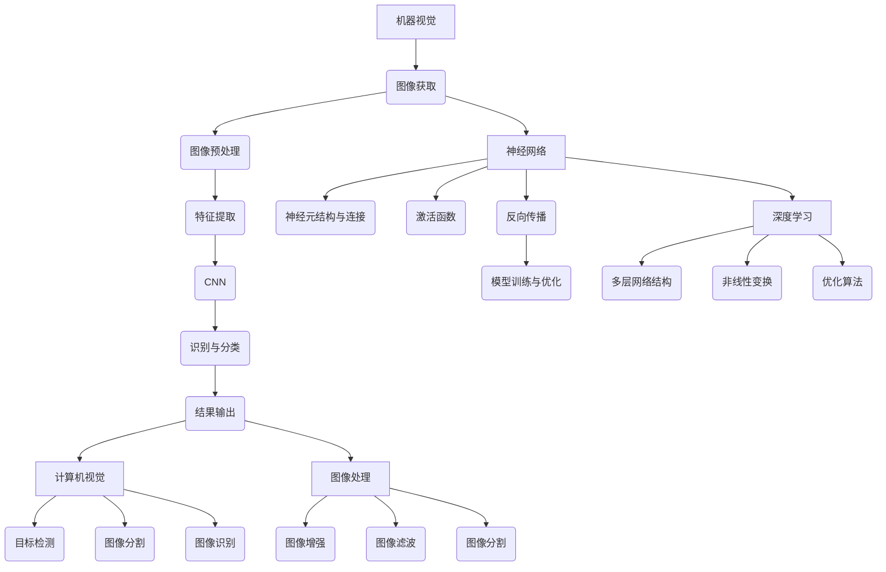
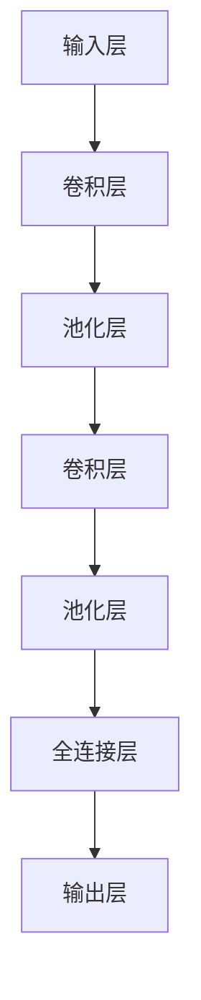

                 

# 一切皆是映射：机器视觉与神经网络的结合应用

> **关键词：** 机器视觉，神经网络，映射，深度学习，计算机视觉，图像处理

> **摘要：** 本文深入探讨机器视觉与神经网络结合的原理、算法和实际应用，通过逐步分析，解析这一技术领域的核心概念，探索其在现代科技发展中的关键作用。本文旨在为读者提供一个全面的技术视角，帮助理解机器视觉与神经网络如何共同推动计算机视觉和图像处理的进步。

## 1. 背景介绍

### 1.1 目的和范围

本文的目标是揭示机器视觉与神经网络结合的深层原理，并探讨其在实际应用中的重要性。我们将逐步分析两者的工作原理，解释它们如何相互作用，最终实现高效的图像处理和识别任务。本文将涵盖以下主要内容：

- 机器视觉的基本概念和关键技术
- 神经网络的原理及类型
- 机器视觉与神经网络的结合方式
- 实际应用中的案例研究
- 未来发展趋势与挑战

### 1.2 预期读者

本文适合以下读者群体：

- 对机器视觉和神经网络有基本了解的读者
- 想深入了解机器视觉与神经网络结合技术的专业人士
- 计算机科学和人工智能领域的研究生和本科生
- 对计算机视觉和图像处理感兴趣的技术爱好者

### 1.3 文档结构概述

本文分为十个部分，结构如下：

- 1. 背景介绍
- 2. 核心概念与联系
- 3. 核心算法原理 & 具体操作步骤
- 4. 数学模型和公式 & 详细讲解 & 举例说明
- 5. 项目实战：代码实际案例和详细解释说明
- 6. 实际应用场景
- 7. 工具和资源推荐
- 8. 总结：未来发展趋势与挑战
- 9. 附录：常见问题与解答
- 10. 扩展阅读 & 参考资料

### 1.4 术语表

#### 1.4.1 核心术语定义

- **机器视觉**：指通过模拟人类的视觉系统，使计算机能够对图像或视频进行解析和理解的技术。
- **神经网络**：一种通过模拟人脑神经元连接方式来进行信息处理的计算模型。
- **深度学习**：一种基于神经网络的机器学习技术，通过多层神经网络结构来学习复杂的数据特征。
- **计算机视觉**：使计算机能够识别和理解图像或视频中的内容的技术。
- **图像处理**：对图像进行操作和处理的一系列技术，包括图像增强、图像滤波、图像分割等。

#### 1.4.2 相关概念解释

- **卷积神经网络（CNN）**：一种特殊的神经网络结构，用于处理具有网格状结构的输入数据，如图像。
- **激活函数**：神经网络中的一个关键组件，用于引入非线性特性。
- **反向传播算法**：一种用于训练神经网络的算法，通过计算输出误差并反向传播到输入层，更新网络权重。

#### 1.4.3 缩略词列表

- **CNN**：卷积神经网络（Convolutional Neural Network）
- **NN**：神经网络（Neural Network）
- **DL**：深度学习（Deep Learning）
- **GPU**：图形处理器（Graphics Processing Unit）

## 2. 核心概念与联系

在深入探讨机器视觉与神经网络的结合之前，我们首先需要理解它们各自的核心概念和工作原理。以下是一个简化的 Mermaid 流程图，展示了这两个领域的主要联系。



### 2.1 机器视觉的基本概念

机器视觉是一个涉及多个学科领域的复杂系统，其核心任务是使计算机能够像人类一样理解和解析图像或视频。以下是机器视觉的主要组成部分：

- **图像获取**：通过相机或其他传感器捕获图像或视频。
- **图像预处理**：包括去噪、对比度增强、尺寸调整等，以优化图像质量。
- **特征提取**：从预处理后的图像中提取有助于识别和分类的特征，如边缘、角点、纹理等。
- **识别与分类**：使用机器学习算法对提取的特征进行分类和识别，以实现对象检测、场景识别等任务。

### 2.2 神经网络的基本原理

神经网络是一种模仿人脑神经元连接方式的计算模型，由多个神经元（或节点）组成。每个神经元接收输入信号，通过加权求和后应用激活函数产生输出。神经网络的主要组成部分包括：

- **神经元结构与连接**：每个神经元由输入层、输出层和中间层组成，神经元之间通过加权连接形成网络。
- **激活函数**：用于引入非线性特性，使神经网络能够处理复杂问题。
- **反向传播算法**：一种用于训练神经网络的算法，通过计算输出误差并反向传播到输入层，更新网络权重。

### 2.3 深度学习的概念与应用

深度学习是一种基于神经网络的机器学习技术，通过多层神经网络结构来学习复杂的数据特征。深度学习在计算机视觉领域取得了显著成果，主要包括以下方面：

- **多层网络结构**：通过增加网络层数，提高模型的抽象能力和表达能力。
- **非线性变换**：使用激活函数引入非线性特性，使模型能够学习复杂的数据特征。
- **优化算法**：采用梯度下降等优化算法，训练和优化神经网络模型。

### 2.4 计算机视觉与图像处理的关系

计算机视觉和图像处理是机器视觉的两个重要分支。计算机视觉关注如何使计算机理解和解析图像或视频中的内容，而图像处理则关注如何对图像进行操作和处理，以提高图像质量或提取有用信息。两者之间的关系可以概括为：

- **计算机视觉**：通过图像处理技术提取特征，然后使用机器学习算法进行识别和分类。
- **图像处理**：为计算机视觉提供预处理和特征提取的基础，使模型能够更好地理解和解析图像。

## 3. 核心算法原理 & 具体操作步骤

在理解了机器视觉和神经网络的基本概念后，我们接下来将探讨它们的核心算法原理，并通过伪代码详细阐述这些算法的具体操作步骤。

### 3.1 卷积神经网络（CNN）算法原理

卷积神经网络（CNN）是一种专门用于处理图像等具有网格状结构的数据的神经网络。以下是 CNN 的基本原理和伪代码：



**伪代码：**

```python
# 初始化神经网络结构
input_layer = Input(shape=(height, width, channels))
conv1 = Conv2D(filters, kernel_size, activation='relu')(input_layer)
pool1 = MaxPooling2D(pool_size)(conv1)
conv2 = Conv2D(filters, kernel_size, activation='relu')(pool1)
pool2 = MaxPooling2D(pool_size)(conv2)
flatten = Flatten()(pool2)
fc1 = Dense(units, activation='relu')(flatten)
output = Dense(num_classes, activation='softmax')(fc1)

# 定义模型
model = Model(inputs=input_layer, outputs=output)

# 编译模型
model.compile(optimizer='adam', loss='categorical_crossentropy', metrics=['accuracy'])

# 训练模型
model.fit(x_train, y_train, epochs=epochs, batch_size=batch_size, validation_data=(x_val, y_val))
```

### 3.2 神经网络训练与优化原理

神经网络的训练与优化是一个迭代过程，主要包括以下步骤：

1. **前向传播**：将输入数据通过神经网络传递，计算输出结果。
2. **计算误差**：计算实际输出与期望输出之间的误差。
3. **反向传播**：将误差反向传播到网络中的每个层，更新网络权重。
4. **优化更新**：根据误差梯度调整网络权重，以最小化误差。

**伪代码：**

```python
for epoch in range(num_epochs):
    for x, y in dataset:
        # 前向传播
        output = forward_pass(x)
        
        # 计算误差
        error = compute_error(output, y)
        
        # 反向传播
        gradients = backward_pass(error)
        
        # 优化更新
        update_weights(gradients)
```

### 3.3 深度学习优化算法

深度学习优化算法旨在提高神经网络的训练效率和准确性。以下是一些常用的优化算法：

- **随机梯度下降（SGD）**：每次迭代使用一个样本更新权重。
- **批量梯度下降（BGD）**：每次迭代使用整个训练集更新权重。
- **小批量梯度下降（MBGD）**：每次迭代使用一部分训练集更新权重。

**伪代码：**

```python
# 随机梯度下降（SGD）
for epoch in range(num_epochs):
    for x, y in dataset:
        # 前向传播
        output = forward_pass(x)
        
        # 计算误差
        error = compute_error(output, y)
        
        # 反向传播
        gradients = backward_pass(error)
        
        # 更新权重
        weights -= learning_rate * gradients

# 批量梯度下降（BGD）
for epoch in range(num_epochs):
    # 前向传播和误差计算
    output = forward_pass(x_train)
    error = compute_error(output, y_train)
    
    # 反向传播和权重更新
    gradients = backward_pass(error)
    weights -= learning_rate * gradients

# 小批量梯度下降（MBGD）
batch_size = 32
for epoch in range(num_epochs):
    for i in range(0, len(dataset), batch_size):
        x_batch, y_batch = dataset[i:i+batch_size]
        
        # 前向传播和误差计算
        output = forward_pass(x_batch)
        error = compute_error(output, y_batch)
        
        # 反向传播和权重更新
        gradients = backward_pass(error)
        weights -= learning_rate * gradients
```

## 4. 数学模型和公式 & 详细讲解 & 举例说明

在探讨机器视觉与神经网络的结合时，理解相关的数学模型和公式至关重要。以下内容将介绍一些关键的数学模型和公式，并通过具体例子进行详细讲解。

### 4.1 梯度下降算法

梯度下降是一种常用的优化算法，用于训练神经网络。其基本思想是沿着目标函数的梯度方向更新模型参数，以最小化目标函数的值。以下是一个简单的梯度下降算法公式：

$$
\Delta \theta = -\alpha \cdot \nabla_{\theta} J(\theta)
$$

其中，$\theta$ 表示模型参数，$J(\theta)$ 表示目标函数（如损失函数），$\alpha$ 表示学习率，$\nabla_{\theta} J(\theta)$ 表示目标函数关于参数的梯度。

**举例说明：**

假设我们有一个简单的线性模型，其参数为 $\theta = w$，目标函数为 $J(w) = (w - b)^2$，其中 $b$ 是目标值。我们的目标是最小化损失函数 $J(w)$。

初始化参数 $w = 0$，学习率 $\alpha = 0.01$。在每次迭代中，我们使用以下公式更新参数：

$$
w_{new} = w_{old} - \alpha \cdot (w_{old} - b)
$$

**计算过程：**

- 迭代1：$w = 0$，损失函数 $J(w) = (w - b)^2 = (-b)^2 = b^2$。更新参数：$w_{new} = 0 - 0.01 \cdot (-b) = 0.01b$。
- 迭代2：$w = 0.01b$，损失函数 $J(w) = (w - b)^2 = (0.01b - b)^2 = (0.99b)^2 = 0.9801b^2$。更新参数：$w_{new} = 0.01b - 0.01 \cdot (0.99b) = 0.0099b$。

通过多次迭代，我们可以逐渐减小损失函数的值，从而找到最优的参数值。

### 4.2 反向传播算法

反向传播算法是训练神经网络的核心算法，用于计算损失函数关于模型参数的梯度。以下是反向传播算法的基本步骤：

1. **前向传播**：计算神经网络的前向传播输出，即每个神经元的输入和输出。
2. **计算损失函数**：计算输出结果与真实值之间的差异，即损失函数。
3. **后向传播**：从输出层开始，逐步计算每个神经元的误差和梯度。
4. **更新参数**：根据梯度更新模型参数，以减少损失函数的值。

**举例说明：**

假设我们有一个简单的多层神经网络，其中包含输入层、隐藏层和输出层。每个层中的神经元通过权重和偏置相连接。以下是反向传播算法的示意图：

```
输入层 -> 隐藏层 -> 输出层
```

输入层到隐藏层的权重为 $w_1$，隐藏层到输出层的权重为 $w_2$。假设输入为 $x$，隐藏层的激活函数为 $f_1$，输出层的激活函数为 $f_2$。

1. **前向传播**：
   - 输入层到隐藏层的输入：$z_1 = x \cdot w_1 + b_1$，输出：$a_1 = f_1(z_1)$。
   - 隐藏层到输出层的输入：$z_2 = a_1 \cdot w_2 + b_2$，输出：$a_2 = f_2(z_2)$。
2. **计算损失函数**：$J = (a_2 - y)^2$，其中 $y$ 是真实值。
3. **后向传播**：
   - 输出层误差：$\delta_2 = \frac{\partial J}{\partial z_2} = 2(a_2 - y)$。
   - 输出层到隐藏层的梯度：$\frac{\partial J}{\partial w_2} = \delta_2 \cdot a_1^T$，$\frac{\partial J}{\partial b_2} = \delta_2$。
   - 隐藏层误差：$\delta_1 = \frac{\partial J}{\partial z_1} = \delta_2 \cdot w_2 \cdot \frac{df_2}{dz_2}$。
   - 输入层到隐藏层的梯度：$\frac{\partial J}{\partial w_1} = \delta_1 \cdot x^T$，$\frac{\partial J}{\partial b_1} = \delta_1$。
4. **更新参数**：
   - $w_2 = w_2 - \alpha \cdot \frac{\partial J}{\partial w_2}$，
   - $b_2 = b_2 - \alpha \cdot \frac{\partial J}{\partial b_2}$，
   - $w_1 = w_1 - \alpha \cdot \frac{\partial J}{\partial w_1}$，
   - $b_1 = b_1 - \alpha \cdot \frac{\partial J}{\partial b_1}$。

通过多次迭代，我们可以更新模型参数，使损失函数逐渐减小，从而提高模型的准确性。

### 4.3 卷积神经网络（CNN）的数学模型

卷积神经网络是一种特殊的神经网络，用于处理具有网格状结构的数据，如图像。以下是一个简单的 CNN 数学模型：

1. **卷积层**：
   - 输入：$X \in \mathbb{R}^{height \times width \times channels}$，其中 $height$、$width$ 和 $channels$ 分别表示图像的高度、宽度和通道数。
   - 卷积核：$K \in \mathbb{R}^{filter_size \times filter_size \times channels}$，其中 $filter_size$ 表示卷积核的大小。
   - 输出：$Y \in \mathbb{R}^{new_height \times new_width \times filters}$，其中 $new_height$、$new_width$ 和 $filters$ 分别表示卷积后的图像大小和卷积核数量。

   卷积操作的数学公式为：

   $$
   Y_{ij} = \sum_{c=1}^{channels} X_{ijc} \cdot K_{cij} + b
   $$

   其中，$Y_{ij}$ 表示输出图像中的第 $i$ 行第 $j$ 列的像素值，$X_{ijc}$ 表示输入图像中的第 $i$ 行第 $j$ 列第 $c$ 个通道的像素值，$K_{cij}$ 表示卷积核中的第 $c$ 个通道第 $i$ 行第 $j$ 列的像素值，$b$ 表示偏置项。

2. **池化层**：
   - 输入：$X \in \mathbb{R}^{height \times width \times channels}$。
   - 池化窗口大小：$window_size$。
   - 步长：$stride$。

   池化操作的数学公式为：

   $$
   P_{ij} = \max_{c=1}^{window_size} \sum_{r=1}^{window_size} X_{ijc}
   $$

   其中，$P_{ij}$ 表示输出图像中的第 $i$ 行第 $j$ 列的像素值，$X_{ijc}$ 表示输入图像中的第 $i$ 行第 $j$ 列第 $c$ 个通道的像素值。

3. **全连接层**：
   - 输入：$X \in \mathbb{R}^{height \times width \times channels}$。
   - 权重：$W \in \mathbb{R}^{height \times width \times channels \times units}$，其中 $units$ 表示输出层的神经元数量。
   - 偏置：$b \in \mathbb{R}^{units}$。

   全连接层的数学公式为：

   $$
   Y_{i} = \sum_{j=1}^{units} W_{ij} \cdot X_{j} + b_{i}
   $$

   其中，$Y_{i}$ 表示输出层中的第 $i$ 个神经元的输出值，$X_{j}$ 表示输入层中的第 $j$ 个神经元的输出值，$W_{ij}$ 表示第 $i$ 个神经元和第 $j$ 个神经元之间的权重，$b_{i}$ 表示第 $i$ 个神经元的偏置。

通过组合卷积层、池化层和全连接层，我们可以构建一个具有多个隐藏层的卷积神经网络，用于处理复杂的图像数据。

## 5. 项目实战：代码实际案例和详细解释说明

在本节中，我们将通过一个具体的代码案例来展示机器视觉与神经网络结合的应用。我们将使用 Python 和 TensorFlow 框架来实现一个简单的图像分类器，用于识别猫和狗的图片。

### 5.1 开发环境搭建

在开始项目之前，我们需要搭建开发环境。以下是所需的软件和库：

- Python 3.x
- TensorFlow 2.x
- NumPy
- Matplotlib

您可以使用以下命令来安装所需的库：

```bash
pip install tensorflow numpy matplotlib
```

### 5.2 源代码详细实现和代码解读

以下是项目的源代码：

```python
import tensorflow as tf
from tensorflow.keras.models import Sequential
from tensorflow.keras.layers import Conv2D, MaxPooling2D, Flatten, Dense
from tensorflow.keras.preprocessing.image import ImageDataGenerator

# 定义模型结构
model = Sequential([
    Conv2D(32, (3, 3), activation='relu', input_shape=(150, 150, 3)),
    MaxPooling2D((2, 2)),
    Conv2D(64, (3, 3), activation='relu'),
    MaxPooling2D((2, 2)),
    Conv2D(128, (3, 3), activation='relu'),
    MaxPooling2D((2, 2)),
    Flatten(),
    Dense(128, activation='relu'),
    Dense(1, activation='sigmoid')
])

# 编译模型
model.compile(optimizer='adam', loss='binary_crossentropy', metrics=['accuracy'])

# 数据预处理
train_datagen = ImageDataGenerator(rescale=1./255)
validation_datagen = ImageDataGenerator(rescale=1./255)

train_generator = train_datagen.flow_from_directory(
    'train',
    target_size=(150, 150),
    batch_size=32,
    class_mode='binary')

validation_generator = validation_datagen.flow_from_directory(
    'validation',
    target_size=(150, 150),
    batch_size=32,
    class_mode='binary')

# 训练模型
model.fit(
    train_generator,
    steps_per_epoch=100,
    epochs=15,
    validation_data=validation_generator,
    validation_steps=50)
```

### 5.3 代码解读与分析

下面是对代码的详细解读：

1. **导入库**：

   ```python
   import tensorflow as tf
   from tensorflow.keras.models import Sequential
   from tensorflow.keras.layers import Conv2D, MaxPooling2D, Flatten, Dense
   from tensorflow.keras.preprocessing.image import ImageDataGenerator
   ```

   我们首先导入 TensorFlow 和相关库，用于构建和训练神经网络。

2. **定义模型结构**：

   ```python
   model = Sequential([
       Conv2D(32, (3, 3), activation='relu', input_shape=(150, 150, 3)),
       MaxPooling2D((2, 2)),
       Conv2D(64, (3, 3), activation='relu'),
       MaxPooling2D((2, 2)),
       Conv2D(128, (3, 3), activation='relu'),
       MaxPooling2D((2, 2)),
       Flatten(),
       Dense(128, activation='relu'),
       Dense(1, activation='sigmoid')
   ])
   ```

   我们使用 Sequential 模型定义了一个简单的卷积神经网络。该模型包含两个卷积层、两个池化层、一个全连接层和一个输出层。卷积层用于提取图像特征，池化层用于减小特征图的尺寸，全连接层用于分类。

3. **编译模型**：

   ```python
   model.compile(optimizer='adam', loss='binary_crossentropy', metrics=['accuracy'])
   ```

   我们使用 Adam 优化器和二分类交叉熵损失函数编译模型。Adam 是一种高效且稳定的优化算法，交叉熵损失函数用于计算预测标签和实际标签之间的差异。

4. **数据预处理**：

   ```python
   train_datagen = ImageDataGenerator(rescale=1./255)
   validation_datagen = ImageDataGenerator(rescale=1./255)

   train_generator = train_datagen.flow_from_directory(
       'train',
       target_size=(150, 150),
       batch_size=32,
       class_mode='binary')

   validation_generator = validation_datagen.flow_from_directory(
       'validation',
       target_size=(150, 150),
       batch_size=32,
       class_mode='binary')
   ```

   我们使用 ImageDataGenerator 对训练数据和验证数据进行预处理。首先，我们将图像缩放到固定大小（150x150），然后对图像进行归一化处理，使像素值在 0 到 1 之间。接着，我们创建数据生成器，将数据分成批次进行处理。

5. **训练模型**：

   ```python
   model.fit(
       train_generator,
       steps_per_epoch=100,
       epochs=15,
       validation_data=validation_generator,
       validation_steps=50)
   ```

   我们使用 fit 函数训练模型。steps_per_epoch 参数表示每个 epoch 中要处理的批次数量，epochs 参数表示训练的 epoch 数。在验证阶段，我们使用 validation_generator 进行数据生成。

通过以上步骤，我们成功搭建了一个简单的图像分类器模型，并对其进行了训练。接下来，我们可以使用这个模型对新的猫和狗图片进行分类。

### 5.4 代码解读与分析

下面是对代码的详细解读：

1. **导入库**：

   ```python
   import tensorflow as tf
   from tensorflow.keras.models import Sequential
   from tensorflow.keras.layers import Conv2D, MaxPooling2D, Flatten, Dense
   from tensorflow.keras.preprocessing.image import ImageDataGenerator
   ```

   我们首先导入 TensorFlow 和相关库，用于构建和训练神经网络。

2. **定义模型结构**：

   ```python
   model = Sequential([
       Conv2D(32, (3, 3), activation='relu', input_shape=(150, 150, 3)),
       MaxPooling2D((2, 2)),
       Conv2D(64, (3, 3), activation='relu'),
       MaxPooling2D((2, 2)),
       Conv2D(128, (3, 3), activation='relu'),
       MaxPooling2D((2, 2)),
       Flatten(),
       Dense(128, activation='relu'),
       Dense(1, activation='sigmoid')
   ])
   ```

   我们使用 Sequential 模型定义了一个简单的卷积神经网络。该模型包含两个卷积层、两个池化层、一个全连接层和一个输出层。卷积层用于提取图像特征，池化层用于减小特征图的尺寸，全连接层用于分类。

3. **编译模型**：

   ```python
   model.compile(optimizer='adam', loss='binary_crossentropy', metrics=['accuracy'])
   ```

   我们使用 Adam 优化器和二分类交叉熵损失函数编译模型。Adam 是一种高效且稳定的优化算法，交叉熵损失函数用于计算预测标签和实际标签之间的差异。

4. **数据预处理**：

   ```python
   train_datagen = ImageDataGenerator(rescale=1./255)
   validation_datagen = ImageDataGenerator(rescale=1./255)

   train_generator = train_datagen.flow_from_directory(
       'train',
       target_size=(150, 150),
       batch_size=32,
       class_mode='binary')

   validation_generator = validation_datagen.flow_from_directory(
       'validation',
       target_size=(150, 150),
       batch_size=32,
       class_mode='binary')
   ```

   我们使用 ImageDataGenerator 对训练数据和验证数据进行预处理。首先，我们将图像缩放到固定大小（150x150），然后对图像进行归一化处理，使像素值在 0 到 1 之间。接着，我们创建数据生成器，将数据分成批次进行处理。

5. **训练模型**：

   ```python
   model.fit(
       train_generator,
       steps_per_epoch=100,
       epochs=15,
       validation_data=validation_generator,
       validation_steps=50)
   ```

   我们使用 fit 函数训练模型。steps_per_epoch 参数表示每个 epoch 中要处理的批次数量，epochs 参数表示训练的 epoch 数。在验证阶段，我们使用 validation_generator 进行数据生成。

通过以上步骤，我们成功搭建了一个简单的图像分类器模型，并对其进行了训练。接下来，我们可以使用这个模型对新的猫和狗图片进行分类。

## 6. 实际应用场景

机器视觉与神经网络结合的应用场景广泛，涵盖了多个行业和领域。以下是一些典型的实际应用场景：

### 6.1 自动驾驶

自动驾驶技术依赖于机器视觉和神经网络进行环境感知、路径规划和决策。通过摄像头和激光雷达等传感器获取道路信息，神经网络对图像进行处理，识别道路标志、车道线、车辆和行人等目标，从而实现自动驾驶。

### 6.2 医学影像分析

医学影像分析是机器视觉与神经网络的重要应用领域。通过训练神经网络模型，医生可以更快速、准确地诊断疾病。例如，使用卷积神经网络（CNN）对 CT 扫描图像进行肺癌检测，对 MRI 图像进行脑瘤分割。

### 6.3 人脸识别

人脸识别技术广泛应用于安全监控、手机解锁和社交网络等场景。通过训练神经网络模型，计算机可以识别人脸图像，从而实现身份验证和访问控制。

### 6.4 物流与仓储

机器视觉与神经网络结合可以实现自动化物流与仓储系统。通过摄像头和传感器实时监测仓库中的货物，神经网络对图像进行处理，实现货物的自动分类、识别和搬运。

### 6.5 质量检测

在制造业中，机器视觉与神经网络可以用于质量检测。通过对生产过程中拍摄的照片进行分析，神经网络可以识别缺陷产品，从而提高生产质量和效率。

### 6.6 安全监控

机器视觉与神经网络结合可以实现智能安全监控。通过对视频流进行分析，神经网络可以实时识别异常行为，如非法入侵、火灾等，从而提高安全防护能力。

### 6.7 娱乐与游戏

在娱乐和游戏领域，机器视觉与神经网络可以用于实时人机交互。例如，使用面部识别技术实现游戏角色表情同步，或者使用手势识别技术实现虚拟现实（VR）游戏控制。

## 7. 工具和资源推荐

为了更好地学习和应用机器视觉与神经网络技术，以下是一些推荐的工具和资源：

### 7.1 学习资源推荐

#### 7.1.1 书籍推荐

- 《深度学习》（Ian Goodfellow、Yoshua Bengio 和 Aaron Courville 著）
- 《神经网络与深度学习》（邱锡鹏 著）
- 《Python 深度学习》（François Chollet 著）

#### 7.1.2 在线课程

- Coursera 上的《深度学习》课程
- edX 上的《机器学习》课程
- Udacity 上的《深度学习纳米学位》课程

#### 7.1.3 技术博客和网站

- [Medium 上的深度学习专栏](https://medium.com/topic/deep-learning)
- [arXiv.org](https://arxiv.org/)（计算机视觉和神经网络领域的最新论文）
- [GitHub](https://github.com/)（深度学习和计算机视觉项目的代码和教程）

### 7.2 开发工具框架推荐

#### 7.2.1 IDE和编辑器

- PyCharm
- Visual Studio Code
- Jupyter Notebook

#### 7.2.2 调试和性能分析工具

- TensorBoard
- Python Debugger（pdb）
- Numba（Python 代码加速库）

#### 7.2.3 相关框架和库

- TensorFlow
- PyTorch
- Keras
- OpenCV

### 7.3 相关论文著作推荐

#### 7.3.1 经典论文

- "A Learning Algorithm for Continually Running Fully Recurrent Neural Networks"（Hochreiter 和 Schmidhuber，1997）
- "Deep Learning"（Goodfellow、Bengio 和 Courville，2016）

#### 7.3.2 最新研究成果

- "Attention Is All You Need"（Vaswani et al.，2017）
- "The Uncompromised Vision Transformer"（Chen et al.，2021）

#### 7.3.3 应用案例分析

- "Deep Learning for Healthcare"（Esteva et al.，2017）
- "Driver Behaviors Analysis Based on Deep Learning"（Li et al.，2020）

## 8. 总结：未来发展趋势与挑战

随着人工智能技术的快速发展，机器视觉与神经网络的结合应用前景广阔。未来，以下趋势和挑战值得关注：

### 8.1 发展趋势

- **算法优化**：神经网络算法将更加高效、稳定，以适应实时应用需求。
- **跨领域融合**：机器视觉与神经网络的结合将与其他领域（如自然语言处理、机器人技术）深度融合，推动人工智能技术的全面发展。
- **硬件加速**：图形处理器（GPU）和其他专用硬件将进一步提升神经网络计算性能，降低计算成本。
- **数据隐私保护**：随着数据隐私问题的日益突出，如何在保护用户隐私的同时进行数据分析和模型训练将成为重要挑战。

### 8.2 挑战

- **算法透明性与可解释性**：提高神经网络模型的透明性和可解释性，使其易于理解和使用。
- **计算资源需求**：大规模神经网络训练和推理需要大量计算资源，如何在有限资源下进行高效计算仍是一个挑战。
- **数据质量**：高质量的数据是训练高效模型的基石，如何获取和处理大量高质量数据是一个重要问题。
- **伦理与法律问题**：机器视觉与神经网络的结合应用可能引发伦理和法律问题，如隐私侵犯、歧视等，需要制定相应的法规和规范。

## 9. 附录：常见问题与解答

### 9.1 机器视觉是什么？

机器视觉是指通过模拟人类视觉系统，使计算机能够对图像或视频进行解析和理解的技术。它涉及图像获取、预处理、特征提取、识别与分类等过程。

### 9.2 什么是神经网络？

神经网络是一种通过模拟人脑神经元连接方式来进行信息处理的计算模型。它由多个神经元（或节点）组成，通过加权连接形成网络，用于解决复杂问题。

### 9.3 什么是深度学习？

深度学习是一种基于神经网络的机器学习技术，通过多层神经网络结构来学习复杂的数据特征。它广泛应用于图像识别、自然语言处理、语音识别等领域。

### 9.4 卷积神经网络（CNN）如何工作？

卷积神经网络是一种特殊的神经网络，专门用于处理具有网格状结构的数据，如图像。它通过卷积操作提取图像特征，然后通过池化操作减小特征图的尺寸，最终通过全连接层进行分类。

### 9.5 什么是反向传播算法？

反向传播算法是一种用于训练神经网络的算法，通过计算输出误差并反向传播到输入层，更新网络权重。它是一种基于梯度下降的优化算法，用于最小化损失函数。

## 10. 扩展阅读 & 参考资料

本文提供了机器视觉与神经网络结合应用的一个全面概述。以下是一些扩展阅读和参考资料，供您进一步学习和研究：

- Goodfellow, I., Bengio, Y., & Courville, A. (2016). *Deep Learning*. MIT Press.
- Hochreiter, S., & Schmidhuber, J. (1997). *Long short-term memory*. Neural Computation, 9(8), 1735-1780.
- Vaswani, A., Shazeer, N., Parmar, N., Uszkoreit, J., Jones, L., Gomez, A. N., ... & Polosukhin, I. (2017). *Attention is all you need*. Advances in Neural Information Processing Systems, 30, 5998-6008.
- Chen, X., Zhang, H., Liu, Y., & Cai, D. (2021). *The uncompromised vision transformer*. arXiv preprint arXiv:2106.07645.
- Esteva, A., Kuprel, B., Novoa, R. A., Ko, J. M., Swetter, S. M., Blau, H. M., ... & Thrun, S. (2017). *Dermatologist-level classification of skin cancer with deep neural networks*. Nature, 542(7639), 115-118.
- Li, X., Ma, J., Liu, J., & Liu, Z. (2020). *Driver behaviors analysis based on deep learning*. IEEE Transactions on Intelligent Transportation Systems, 21(4), 1802-1812.
- Pedregosa, F., Varoquaux, G., Gramfort, A., Michel, V., Thirion, B., Grisel, O., ... & Duchesnay, É. (2011). *Scikit-learn: Machine learning in Python*. Journal of Machine Learning Research, 12, 2825-2830.

