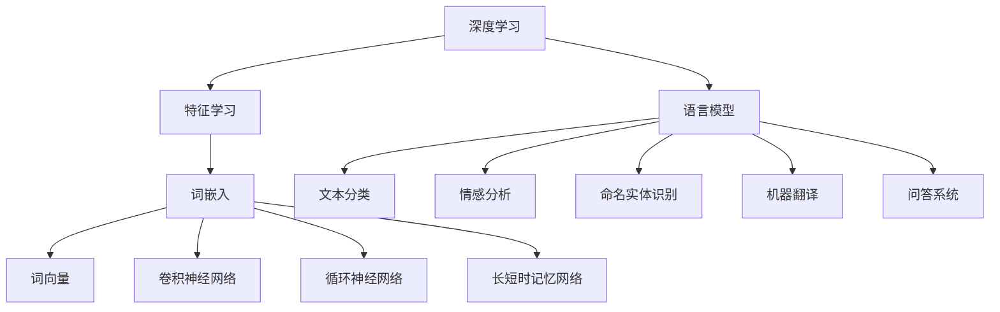

                 


# 一切皆是映射：深度学习与人类语言理解

> **关键词：深度学习、自然语言处理、语言模型、神经网络、映射原理、人类语言理解**
> 
> **摘要：本文深入探讨深度学习在自然语言处理中的应用，解析其如何通过映射原理实现人类语言的理解，并结合实际案例，详细解释深度学习在语言模型构建、文本生成、情感分析等方面的具体操作步骤。**

## 1. 背景介绍

### 1.1 目的和范围

本文旨在探讨深度学习在自然语言处理（NLP）中的应用，尤其是如何通过映射原理实现对人类语言的深入理解。我们将从基础概念出发，逐步解析深度学习在语言模型构建、文本生成、情感分析等任务中的具体实现方式。本文适合对NLP和深度学习有一定了解，希望深入了解两者之间联系的读者。

### 1.2 预期读者

- 对深度学习和自然语言处理有兴趣的计算机科学和人工智能领域的研究者、工程师和开发者。
- 想要了解深度学习在现实应用中如何处理语言问题的相关行业从业者。

### 1.3 文档结构概述

本文结构如下：

1. 背景介绍：介绍本文的目的、范围、预期读者和文档结构。
2. 核心概念与联系：介绍深度学习和自然语言处理中的核心概念，使用Mermaid流程图展示其联系。
3. 核心算法原理 & 具体操作步骤：详细讲解深度学习在语言模型构建、文本生成、情感分析等方面的算法原理和操作步骤。
4. 数学模型和公式 & 详细讲解 & 举例说明：介绍深度学习中的数学模型和公式，并进行举例说明。
5. 项目实战：提供实际代码案例，详细解释和解读代码。
6. 实际应用场景：讨论深度学习在NLP中的实际应用场景。
7. 工具和资源推荐：推荐相关学习资源、开发工具和框架。
8. 总结：总结未来发展趋势和挑战。
9. 附录：常见问题与解答。
10. 扩展阅读 & 参考资料：提供进一步阅读的资源。

### 1.4 术语表

#### 1.4.1 核心术语定义

- **深度学习**：一种基于多层神经网络的结构，用于从大量数据中学习特征表示。
- **自然语言处理**：计算机科学领域，旨在使计算机能够理解、生成和处理人类语言。
- **语言模型**：一种统计模型，用于预测下一个词或字符的概率。
- **神经网络**：一种由大量相互连接的简单处理单元组成的计算模型。
- **映射原理**：深度学习通过学习输入和输出之间的映射关系，实现对数据的处理和理解。

#### 1.4.2 相关概念解释

- **词向量**：将词汇映射为高维空间中的向量表示。
- **卷积神经网络（CNN）**：一种用于图像处理的深度学习模型，也可用于文本处理。
- **循环神经网络（RNN）**：一种用于处理序列数据的神经网络，常用于语言模型。
- **长短时记忆网络（LSTM）**：一种特殊的RNN，用于解决长序列依赖问题。

#### 1.4.3 缩略词列表

- **CNN**：卷积神经网络（Convolutional Neural Network）
- **RNN**：循环神经网络（Recurrent Neural Network）
- **LSTM**：长短时记忆网络（Long Short-Term Memory）
- **NLP**：自然语言处理（Natural Language Processing）

## 2. 核心概念与联系

### 2.1 深度学习与自然语言处理的关系

深度学习和自然语言处理（NLP）之间存在着密切的联系。深度学习通过学习大量数据中的特征表示，能够有效地处理复杂的问题，如图像识别、语音识别和自然语言理解等。在NLP中，深度学习模型通过映射输入（如文本）和输出（如标签、语义表示等）之间的复杂关系，实现了对语言的自动理解和生成。

### 2.2 深度学习在NLP中的应用

深度学习在NLP中的应用非常广泛，主要包括以下方面：

1. **语言模型**：用于预测下一个词或字符的概率，是自然语言生成和许多其他NLP任务的基础。
2. **文本分类**：将文本分为预定义的类别，如情感分析、主题分类等。
3. **情感分析**：识别文本中的情感倾向，如正面、负面或中性。
4. **命名实体识别**：识别文本中的特定实体，如人名、地名、组织名等。
5. **机器翻译**：将一种语言文本翻译成另一种语言。
6. **问答系统**：回答用户基于文本的提问。

### 2.3 核心概念原理和架构的 Mermaid 流程图



在这个流程图中，深度学习作为整体框架，通过特征学习和词嵌入等技术，构建出不同的语言模型，并在文本分类、情感分析、命名实体识别、机器翻译和问答系统等任务中发挥作用。词嵌入、卷积神经网络（CNN）、循环神经网络（RNN）和长短时记忆网络（LSTM）是构建这些语言模型的关键技术。

## 3. 核心算法原理 & 具体操作步骤

### 3.1 语言模型构建

语言模型是一种统计模型，用于预测下一个词或字符的概率。在构建语言模型时，通常会采用以下步骤：

1. **数据预处理**：对文本数据（如文本语料库）进行清洗、分词和标记等处理，将文本转换为机器可处理的格式。
2. **词嵌入**：将词汇映射为高维空间中的向量表示。词嵌入可以通过预训练模型（如Word2Vec、GloVe）或使用神经网络（如BERT、GPT）进行训练。
3. **构建神经网络模型**：通常采用循环神经网络（RNN）或其变种（如LSTM、GRU）构建语言模型。这些模型通过学习输入和输出之间的映射关系，实现对语言的建模。
4. **训练与优化**：使用训练数据对模型进行训练，并通过反向传播算法进行优化。
5. **评估与测试**：使用测试数据评估模型的性能，并调整模型参数，以提高预测准确率。

以下是构建语言模型的伪代码：

```python
# 数据预处理
text_data = preprocess_text(raw_text)

# 词嵌入
word_embedding = train_word_embedding(text_data)

# 构建神经网络模型
model = build_rnn_model(input_shape, output_shape)

# 训练与优化
model.fit(text_data, epochs=10, batch_size=64)

# 评估与测试
performance = model.evaluate(test_data)
```

### 3.2 文本生成

文本生成是深度学习在NLP中的一个重要应用。通过训练语言模型，可以生成连贯、有意义的文本。文本生成的具体操作步骤如下：

1. **输入序列**：将输入序列（如一个词或句子）输入到训练好的语言模型中。
2. **生成词向量**：使用语言模型生成输入序列的词向量表示。
3. **预测下一个词**：使用语言模型预测下一个词的概率分布。
4. **选择下一个词**：根据预测的概率分布，从候选词中选择下一个词。
5. **重复步骤 3-4**：继续预测下一个词，直到达到停止条件（如达到指定长度或生成特定停止词）。

以下是文本生成的伪代码：

```python
# 输入序列
input_sequence = ["The", "quick", "brown", "fox"]

# 生成词向量
input_vector = word_embedding.transform(input_sequence)

# 预测下一个词
next_word_distribution = model.predict(next_word_vector)

# 选择下一个词
next_word = select_word(next_word_distribution)

# 输出结果
print(" ".join(input_sequence + [next_word]))
```

### 3.3 情感分析

情感分析是一种文本分类任务，旨在识别文本中的情感倾向。情感分析的具体操作步骤如下：

1. **数据预处理**：对文本数据进行清洗、分词和标记等处理。
2. **特征提取**：将文本转换为机器可处理的特征表示。常用的方法包括词袋模型、TF-IDF、词嵌入等。
3. **构建分类模型**：使用分类算法（如逻辑回归、支持向量机、决策树等）构建情感分析模型。
4. **训练与优化**：使用训练数据对模型进行训练，并通过交叉验证等方法进行优化。
5. **评估与测试**：使用测试数据评估模型的性能，并调整模型参数，以提高分类准确率。

以下是情感分析的伪代码：

```python
# 数据预处理
text_data = preprocess_text(raw_text)

# 特征提取
features = extract_features(text_data)

# 构建分类模型
model = build_classification_model(input_shape, output_shape)

# 训练与优化
model.fit(features, labels, epochs=10, batch_size=64)

# 评估与测试
performance = model.evaluate(test_data)
```

## 4. 数学模型和公式 & 详细讲解 & 举例说明

### 4.1 深度学习中的数学模型

深度学习中的数学模型主要包括以下内容：

1. **损失函数**：用于评估模型预测值和实际值之间的差异，如均方误差（MSE）、交叉熵等。
2. **反向传播算法**：用于计算模型参数的梯度，并通过梯度下降算法进行参数优化。
3. **优化算法**：如梯度下降、Adam等，用于优化模型参数。

### 4.2 详细讲解和举例说明

#### 4.2.1 损失函数

在深度学习中，常用的损失函数有：

1. **均方误差（MSE）**：用于回归问题，计算预测值和实际值之间的平均平方误差。
   $$MSE = \frac{1}{n} \sum_{i=1}^{n} (y_i - \hat{y}_i)^2$$
   其中，$y_i$表示实际值，$\hat{y}_i$表示预测值，$n$表示样本数量。

2. **交叉熵（Cross-Entropy）**：用于分类问题，计算预测概率分布和真实概率分布之间的差异。
   $$H(y, \hat{y}) = -\sum_{i=1}^{n} y_i \log(\hat{y}_i)$$
   其中，$y$表示真实概率分布，$\hat{y}$表示预测概率分布。

#### 4.2.2 反向传播算法

反向传播算法是一种计算模型参数梯度的方法。以下是反向传播算法的步骤：

1. **前向传播**：计算输入和参数之间的映射，得到预测值。
2. **计算损失函数梯度**：通过计算损失函数对模型参数的梯度，得到梯度值。
3. **反向传播**：将梯度值从输出层反向传播到输入层，更新模型参数。
4. **优化参数**：使用优化算法（如梯度下降）更新模型参数。

以下是反向传播算法的伪代码：

```python
# 前向传播
output = forward_propagation(input, weights)

# 计算损失函数梯度
gradient = compute_gradient(loss_function, output, weights)

# 反向传播
updated_weights = backward_propagation(input, output, gradient)

# 优化参数
weights = optimize_parameters(updated_weights)
```

#### 4.2.3 优化算法

常见的优化算法有：

1. **梯度下降（Gradient Descent）**：通过更新参数，使损失函数值逐步减小。
   $$\theta_{t+1} = \theta_{t} - \alpha \cdot \nabla_{\theta} J(\theta)$$
   其中，$\theta$表示参数，$\alpha$表示学习率，$J(\theta)$表示损失函数。

2. **Adam优化器**：结合了梯度下降和动量法的优点，自适应地调整学习率。
   $$m_t = \beta_1 \cdot m_{t-1} + (1 - \beta_1) \cdot \nabla_{\theta} J(\theta)$$
   $$v_t = \beta_2 \cdot v_{t-1} + (1 - \beta_2) \cdot (\nabla_{\theta} J(\theta))^2$$
   $$\theta_{t+1} = \theta_{t} - \alpha \cdot \frac{m_t}{\sqrt{v_t} + \epsilon}$$
   其中，$m_t$和$v_t$分别表示一阶和二阶矩估计，$\beta_1$和$\beta_2$分别表示一阶和二阶矩的平滑系数，$\epsilon$是一个很小的常数。

## 5. 项目实战：代码实际案例和详细解释说明

### 5.1 开发环境搭建

在开始实际案例之前，我们需要搭建一个合适的开发环境。以下是使用Python和TensorFlow搭建深度学习开发环境的步骤：

1. **安装Python**：确保安装了Python 3.x版本。
2. **安装TensorFlow**：使用pip命令安装TensorFlow：
   ```bash
   pip install tensorflow
   ```
3. **安装NLP库**：如NLTK、spaCy等，用于文本处理和词嵌入。

### 5.2 源代码详细实现和代码解读

#### 5.2.1 语言模型构建

以下是一个简单的Python代码示例，用于构建一个基于循环神经网络（RNN）的语言模型。

```python
import tensorflow as tf
from tensorflow.keras.models import Sequential
from tensorflow.keras.layers import Embedding, SimpleRNN, Dense

# 数据预处理
# ...（此处省略数据预处理步骤）

# 词嵌入
vocab_size = 10000
embedding_dim = 64
max_sequence_length = 50

# 构建神经网络模型
model = Sequential()
model.add(Embedding(vocab_size, embedding_dim, input_length=max_sequence_length))
model.add(SimpleRNN(128))
model.add(Dense(vocab_size, activation='softmax'))

# 编译模型
model.compile(optimizer='adam', loss='categorical_crossentropy', metrics=['accuracy'])

# 训练模型
model.fit(x_train, y_train, epochs=10, batch_size=32)

# 保存模型
model.save('language_model.h5')
```

在这个示例中，我们首先进行数据预处理，将文本数据转换为词嵌入表示。然后，我们构建一个简单的RNN模型，包括嵌入层、循环层和输出层。接下来，我们编译模型并使用训练数据对其进行训练。最后，我们将训练好的模型保存到文件中。

#### 5.2.2 代码解读与分析

- **数据预处理**：数据预处理是构建语言模型的重要步骤。在这个示例中，我们首先对文本数据进行清洗、分词和标记。然后，我们将词汇映射为整数，并创建词汇表。最后，我们将文本数据转换为序列，每个序列包含固定数量的词。
- **词嵌入**：词嵌入是将词汇映射为高维向量表示的过程。在这个示例中，我们使用嵌入层将词汇映射为64维的向量表示。
- **构建神经网络模型**：在这个示例中，我们使用循环神经网络（RNN）作为语言模型的主体。RNN通过递归地处理输入序列，捕捉序列中的长距离依赖关系。在输出层，我们使用softmax激活函数，以概率分布的形式预测下一个词。
- **编译模型**：在编译模型时，我们指定优化器、损失函数和评估指标。在这个示例中，我们使用Adam优化器、交叉熵损失函数和准确率作为评估指标。
- **训练模型**：使用训练数据对模型进行训练。在这个示例中，我们设置训练次数为10次，批次大小为32。
- **保存模型**：将训练好的模型保存到文件中，以便后续使用。

### 5.3 代码解读与分析

通过对上述代码的解读，我们可以了解到构建深度学习语言模型的步骤和方法。首先，我们需要进行数据预处理，将文本数据转换为机器可处理的格式。然后，我们使用词嵌入技术将词汇映射为高维向量表示。接下来，我们构建一个基于循环神经网络（RNN）的语言模型，并使用训练数据对其进行训练。最后，我们将训练好的模型保存到文件中。

在实际应用中，我们可以根据具体需求调整模型的结构、参数和训练策略，以实现更好的性能。此外，我们还可以使用其他深度学习模型（如卷积神经网络（CNN）、长短时记忆网络（LSTM）等）来构建语言模型，进一步优化模型的性能。

## 6. 实际应用场景

深度学习在自然语言处理（NLP）中的应用非常广泛，以下是一些实际应用场景：

1. **文本分类**：将文本分为预定义的类别，如新闻分类、情感分析等。深度学习模型可以高效地处理大规模文本数据，并实现高精度的分类效果。
2. **机器翻译**：将一种语言的文本翻译成另一种语言。深度学习模型通过学习源语言和目标语言之间的映射关系，实现高效、准确的翻译。
3. **情感分析**：识别文本中的情感倾向，如正面、负面或中性。深度学习模型可以自动分析大量的文本数据，帮助企业和组织了解用户情绪和反馈。
4. **命名实体识别**：识别文本中的特定实体，如人名、地名、组织名等。深度学习模型可以通过学习大量的实体标签数据，实现高精度的实体识别。
5. **问答系统**：回答用户基于文本的提问。深度学习模型可以训练出能够理解自然语言问题的模型，实现智能问答系统。
6. **文本生成**：生成有意义的文本，如文章、故事、摘要等。深度学习模型可以通过学习大量文本数据，生成高质量的文本。

在实际应用中，深度学习模型通常需要经过大量的数据训练和优化，以提高模型的性能和泛化能力。此外，深度学习模型还面临着数据质量、计算资源、模型解释性等挑战，需要不断改进和优化。

## 7. 工具和资源推荐

### 7.1 学习资源推荐

#### 7.1.1 书籍推荐

1. **《深度学习》（Deep Learning）**：由Ian Goodfellow、Yoshua Bengio和Aaron Courville合著，是一本经典的深度学习入门书籍，涵盖了深度学习的基本概念、算法和应用。
2. **《自然语言处理综论》（Speech and Language Processing）**：由Daniel Jurafsky和James H. Martin合著，是一本全面的自然语言处理教材，涵盖了NLP的基本概念、技术和应用。

#### 7.1.2 在线课程

1. **Coursera的《深度学习专项课程》**：由斯坦福大学教授Andrew Ng主讲，涵盖了深度学习的基础知识和应用。
2. **edX的《自然语言处理与信息检索》**：由康奈尔大学教授David J. C. MacKay主讲，介绍了自然语言处理的基本概念和技术。

#### 7.1.3 技术博客和网站

1. **TensorFlow官网**：提供丰富的深度学习教程、案例和文档，是深度学习开发者的必备资源。
2. **ACL（Association for Computational Linguistics）**：提供最新的自然语言处理研究论文、会议和活动信息。

### 7.2 开发工具框架推荐

#### 7.2.1 IDE和编辑器

1. **PyCharm**：一款功能强大的Python IDE，支持深度学习和自然语言处理开发。
2. **Jupyter Notebook**：一款流行的交互式开发环境，方便进行数据分析和代码实验。

#### 7.2.2 调试和性能分析工具

1. **TensorBoard**：TensorFlow提供的可视化工具，用于分析模型的性能和训练过程。
2. **gprof2dot**：一款用于分析程序性能的工具，可以帮助开发者了解代码的执行效率和瓶颈。

#### 7.2.3 相关框架和库

1. **TensorFlow**：一款流行的开源深度学习框架，支持各种深度学习模型的构建和训练。
2. **PyTorch**：一款灵活的开源深度学习框架，提供动态计算图和自动微分功能。
3. **spaCy**：一款高效的NLP库，提供丰富的语言处理功能，如词性标注、命名实体识别等。

### 7.3 相关论文著作推荐

#### 7.3.1 经典论文

1. **“A Theoretically Grounded Application of Dropout in Recurrent Neural Networks”**：提出了在循环神经网络（RNN）中应用dropout的方法，提高了模型的训练效果。
2. **“Effective Approaches to Attention-based Neural Machine Translation”**：介绍了基于注意力机制的神经网络机器翻译模型，显著提高了翻译质量。

#### 7.3.2 最新研究成果

1. **“BERT: Pre-training of Deep Bidirectional Transformers for Language Understanding”**：提出了BERT（Bidirectional Encoder Representations from Transformers）模型，为深度语言模型的发展奠定了基础。
2. **“GPT-3: Language Models are Few-Shot Learners”**：展示了GPT-3模型在零样本和少样本学习任务中的强大能力。

#### 7.3.3 应用案例分析

1. **“Deep Learning for Natural Language Processing”**：介绍了深度学习在自然语言处理领域的应用案例，如文本分类、情感分析、机器翻译等。
2. **“The Annotated Transformer”**：详细解析了Transformer模型的原理和实现，为开发者提供了深入理解。

## 8. 总结：未来发展趋势与挑战

随着深度学习和自然语言处理的不断发展，未来这两个领域有望实现更多突破和应用。以下是一些发展趋势和挑战：

### 8.1 发展趋势

1. **多模态学习**：将深度学习应用于图像、音频、文本等多种数据类型，实现更全面的信息理解和处理。
2. **知识图谱和语义理解**：通过构建大规模的知识图谱和语义模型，实现更精准的信息检索和推理。
3. **少样本学习和迁移学习**：通过引入迁移学习和少样本学习技术，降低对大规模标注数据的依赖。
4. **可解释性和安全性**：提高深度学习模型的可解释性和安全性，增强模型在实际应用中的可靠性和透明度。

### 8.2 挑战

1. **数据质量和隐私保护**：确保数据的质量和隐私，防止数据泄露和滥用。
2. **计算资源消耗**：深度学习模型的训练和推理需要大量的计算资源，如何优化计算效率成为一大挑战。
3. **模型解释性和可靠性**：提高模型的解释性和可靠性，确保模型在实际应用中的稳定性和安全性。
4. **跨语言和跨领域应用**：实现不同语言和领域的通用模型，提高模型在不同场景下的适应性。

### 8.3 结论

深度学习和自然语言处理在人工智能领域中发挥着越来越重要的作用。通过不断的研究和创新，我们可以预见这两个领域将在未来取得更多突破和应用。同时，我们也要关注其中的挑战，努力提高模型的性能和可靠性，为人类创造更多价值。

## 9. 附录：常见问题与解答

### 9.1 深度学习与自然语言处理的基本概念

1. **什么是深度学习？**
   深度学习是一种基于多层神经网络的结构，通过学习大量数据中的特征表示，实现自动从数据中学习模式和知识。

2. **什么是自然语言处理（NLP）？**
   自然语言处理是计算机科学领域，旨在使计算机能够理解、生成和处理人类语言。

3. **什么是语言模型？**
   语言模型是一种统计模型，用于预测下一个词或字符的概率。

### 9.2 深度学习在NLP中的应用

1. **深度学习在NLP中有哪些应用？**
   深度学习在NLP中的应用广泛，包括语言模型、文本分类、情感分析、命名实体识别、机器翻译和问答系统等。

2. **如何构建一个语言模型？**
   构建语言模型通常包括数据预处理、词嵌入、神经网络模型构建、训练和优化等步骤。

### 9.3 开发工具和资源

1. **推荐哪些深度学习和NLP的学习资源？**
   推荐书籍如《深度学习》、《自然语言处理综论》，在线课程如Coursera的《深度学习专项课程》、edX的《自然语言处理与信息检索》，以及技术博客和网站如TensorFlow官网和ACL。

2. **推荐哪些深度学习和NLP的开发工具？**
   推荐IDE和编辑器如PyCharm、Jupyter Notebook，调试和性能分析工具如TensorBoard、gprof2dot，以及框架和库如TensorFlow、PyTorch、spaCy。

## 10. 扩展阅读 & 参考资料

1. **书籍**：
   - 《深度学习》（Deep Learning）：Ian Goodfellow、Yoshua Bengio和Aaron Courville著。
   - 《自然语言处理综论》（Speech and Language Processing）：Daniel Jurafsky和James H. Martin著。

2. **在线课程**：
   - Coursera的《深度学习专项课程》：由斯坦福大学教授Andrew Ng主讲。
   - edX的《自然语言处理与信息检索》：由康奈尔大学教授David J. C. MacKay主讲。

3. **技术博客和网站**：
   - TensorFlow官网：提供丰富的深度学习教程、案例和文档。
   - ACL（Association for Computational Linguistics）：提供最新的自然语言处理研究论文、会议和活动信息。

4. **论文**：
   - “A Theoretically Grounded Application of Dropout in Recurrent Neural Networks”：详细介绍了在循环神经网络中应用dropout的方法。
   - “BERT: Pre-training of Deep Bidirectional Transformers for Language Understanding”：提出了BERT模型，为深度语言模型的发展奠定了基础。

5. **应用案例分析**：
   - “Deep Learning for Natural Language Processing”：介绍了深度学习在自然语言处理领域的应用案例。
   - “The Annotated Transformer”：详细解析了Transformer模型的原理和实现。

