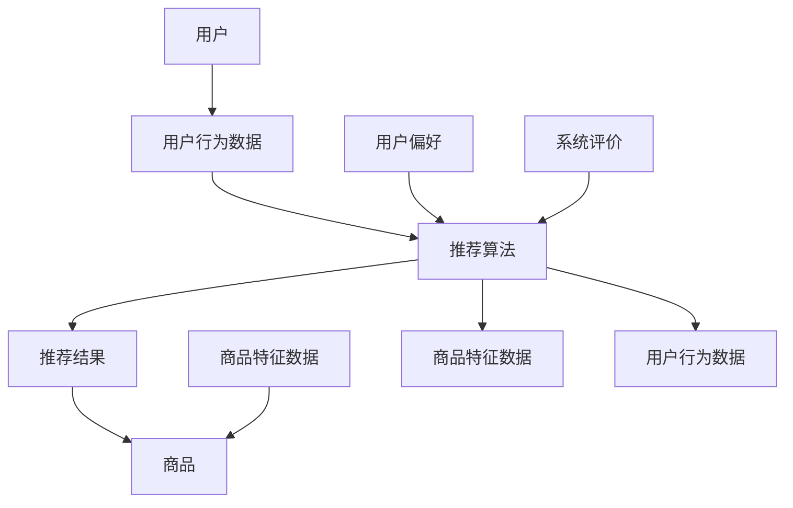

                 

### 一切皆是映射：深度学习在推荐系统中的应用

> **关键词：** 深度学习、推荐系统、映射、用户行为分析、个性化推荐
>
> **摘要：** 本文将深入探讨深度学习技术在推荐系统中的应用，从背景介绍、核心概念到算法原理，再到实际应用场景和未来发展趋势，全面解析深度学习如何实现从用户行为到个性化推荐的映射过程。

#### 1. 背景介绍

##### 1.1 目的和范围

本文旨在系统地阐述深度学习在推荐系统中的应用，通过剖析核心算法原理和实际应用案例，展示如何利用深度学习技术实现用户行为的映射与个性化推荐。

本文将涵盖以下主要内容：

1. **核心概念与联系**：介绍推荐系统的基本概念，包括用户行为数据、商品特征数据以及推荐系统的基础架构。
2. **核心算法原理 & 具体操作步骤**：详细讲解深度学习推荐系统中的主要算法，包括基于内容的推荐、协同过滤和基于模型的推荐等。
3. **数学模型和公式 & 详细讲解 & 举例说明**：阐述推荐系统中涉及的关键数学模型和公式，并通过具体案例进行说明。
4. **项目实战：代码实际案例和详细解释说明**：通过实际代码案例展示深度学习推荐系统的实现过程，并进行详细解读。
5. **实际应用场景**：分析深度学习推荐系统在电子商务、社交媒体等领域的应用案例。
6. **工具和资源推荐**：推荐学习深度学习和推荐系统相关资源的书籍、在线课程和技术博客等。
7. **总结：未来发展趋势与挑战**：探讨深度学习在推荐系统中面临的挑战及其未来发展趋势。

##### 1.2 预期读者

本文主要面向对深度学习和推荐系统感兴趣的读者，包括但不限于：

1. 数据科学家和机器学习工程师
2. 推荐系统开发者和技术爱好者
3. 计算机科学和人工智能专业学生
4. 对技术趋势和新兴领域感兴趣的IT从业人员

##### 1.3 文档结构概述

本文将按照以下结构进行撰写：

1. **背景介绍**：介绍文章的目的、范围和预期读者，以及文档的结构概述。
2. **核心概念与联系**：阐述推荐系统的基本概念和核心算法原理。
3. **核心算法原理 & 具体操作步骤**：详细讲解深度学习推荐系统中的算法和操作步骤。
4. **数学模型和公式 & 详细讲解 & 举例说明**：解析推荐系统中的关键数学模型和公式。
5. **项目实战：代码实际案例和详细解释说明**：展示深度学习推荐系统的实际实现过程。
6. **实际应用场景**：分析深度学习推荐系统在不同领域的应用案例。
7. **工具和资源推荐**：推荐学习资源和开发工具。
8. **总结：未来发展趋势与挑战**：探讨未来发展趋势和面临的挑战。
9. **附录：常见问题与解答**：回答读者可能遇到的问题。
10. **扩展阅读 & 参考资料**：提供进一步阅读的资源和参考文献。

##### 1.4 术语表

在本文中，我们将使用以下术语：

- **推荐系统**：一种通过算法模型为用户提供个性化推荐的服务系统。
- **深度学习**：一种基于多层神经网络的结构，用于从大量数据中自动提取特征和模式。
- **用户行为数据**：用户在使用推荐系统过程中产生的数据，如点击、购买、评论等。
- **商品特征数据**：描述商品属性的数据，如商品类别、价格、品牌等。
- **映射**：将用户行为数据和商品特征数据映射到推荐结果的过程。

##### 1.4.1 核心术语定义

- **深度学习**：深度学习是一种机器学习方法，通过构建多层的神经网络结构，对输入数据进行处理，从而自动提取特征和模式。
- **推荐系统**：推荐系统是一种基于用户行为数据和商品特征数据，为用户提供个性化推荐的服务系统。
- **用户行为数据**：用户在使用推荐系统过程中产生的数据，包括点击、购买、评论等行为。
- **商品特征数据**：描述商品属性的数据，如商品类别、价格、品牌等。
- **映射**：将用户行为数据和商品特征数据映射到推荐结果的过程。

##### 1.4.2 相关概念解释

- **协同过滤**：协同过滤是一种常用的推荐算法，通过分析用户之间的相似性，预测用户对未知商品的兴趣。
- **基于内容的推荐**：基于内容的推荐算法通过分析商品的属性和用户的历史偏好，为用户提供个性化推荐。
- **卷积神经网络（CNN）**：卷积神经网络是一种适用于图像处理的深度学习模型，通过卷积操作提取图像特征。
- **循环神经网络（RNN）**：循环神经网络是一种适用于序列数据的深度学习模型，通过循环结构对序列数据进行建模。

##### 1.4.3 缩略词列表

- **CNN**：卷积神经网络（Convolutional Neural Network）
- **RNN**：循环神经网络（Recurrent Neural Network）
- **GPU**：图形处理器（Graphics Processing Unit）
- **IDE**：集成开发环境（Integrated Development Environment）

### 2. 核心概念与联系

在本节中，我们将首先介绍推荐系统的基本概念和核心组成部分，然后通过Mermaid流程图展示推荐系统的整体架构，以便读者更好地理解深度学习在其中的作用。

#### 2.1 推荐系统的基本概念

推荐系统是一种通过算法模型为用户提供个性化推荐的服务系统。其核心目标是利用用户行为数据和商品特征数据，为用户提供符合其兴趣和需求的推荐结果。推荐系统通常包含以下关键组成部分：

- **用户行为数据**：用户在推荐系统中的各种行为，如浏览、点击、购买、评价等。
- **商品特征数据**：描述商品属性的数据，如商品类别、价格、品牌、用户评分等。
- **推荐算法**：根据用户行为数据和商品特征数据，生成个性化推荐结果的算法。
- **推荐结果**：推荐系统生成的个性化推荐结果，如商品列表、文章列表等。

#### 2.2 推荐系统的核心组成部分

推荐系统的核心组成部分包括用户、商品和推荐算法。以下是推荐系统的整体架构，通过Mermaid流程图展示各部分之间的关系：



- **用户**：推荐系统的主要服务对象，用户在系统中产生的行为数据是推荐系统的重要输入。
- **用户行为数据**：用户在推荐系统中的各种行为，如浏览、点击、购买、评价等，这些数据反映了用户的兴趣和偏好。
- **商品特征数据**：描述商品属性的数据，如商品类别、价格、品牌、用户评分等，这些数据用于辅助推荐算法生成个性化推荐结果。
- **推荐算法**：根据用户行为数据和商品特征数据，推荐算法生成个性化推荐结果，满足用户的需求。
- **推荐结果**：推荐系统生成的个性化推荐结果，如商品列表、文章列表等，用户可以根据推荐结果进行选择和决策。
- **用户偏好**：用户在推荐系统中的偏好和兴趣，通过对用户行为数据的分析，推荐算法可以更好地理解用户偏好，从而生成更准确的推荐结果。
- **系统评价**：推荐系统的效果评估指标，如推荐覆盖率、推荐准确率等，通过系统评价可以不断优化推荐算法，提高系统性能。

#### 2.3 深度学习在推荐系统中的应用

深度学习作为当前人工智能领域的重要技术之一，在推荐系统中发挥着重要作用。通过深度学习模型，推荐系统可以从大量用户行为数据和商品特征数据中自动提取有用特征和模式，实现更精准的个性化推荐。

以下是深度学习在推荐系统中的主要应用：

1. **用户行为分析**：利用深度学习模型对用户行为数据进行处理和分析，提取用户兴趣和偏好特征，为个性化推荐提供基础。
2. **商品特征提取**：利用深度学习模型对商品特征数据进行处理和分析，提取商品属性和用户评分等关键特征，为推荐算法提供输入。
3. **推荐算法优化**：通过深度学习模型优化推荐算法，提高推荐准确率和用户满意度，同时降低推荐系统的计算成本。
4. **实时推荐**：利用深度学习模型实现实时推荐，根据用户行为数据的动态变化，及时更新推荐结果，提高用户体验。

通过上述应用，深度学习在推荐系统中实现了用户行为到个性化推荐的映射，为用户提供了更符合其需求和兴趣的推荐结果。接下来，我们将进一步探讨深度学习在推荐系统中的核心算法原理和具体实现步骤。

### 3. 核心算法原理 & 具体操作步骤

在本节中，我们将深入探讨深度学习推荐系统的核心算法原理，包括基于内容的推荐、协同过滤和基于模型的推荐等。通过具体操作步骤和伪代码，我们将详细解析这些算法的实现过程。

#### 3.1 基于内容的推荐

基于内容的推荐（Content-Based Recommendation）是一种常见的推荐算法，它通过分析商品的特征和用户的历史偏好，为用户推荐具有相似特征的商品。

##### 原理

基于内容的推荐算法主要基于以下原理：

1. **商品特征表示**：将商品特征数据转换为向量表示，例如使用词袋模型或TF-IDF模型。
2. **用户偏好模型**：建立用户偏好模型，用于存储用户对商品的评分或兴趣标签。
3. **相似性计算**：计算用户偏好模型与商品特征表示之间的相似性，基于相似性为用户推荐商品。

##### 具体操作步骤

基于内容的推荐算法的具体操作步骤如下：

1. **商品特征表示**：对商品特征数据进行处理，将其转换为向量表示。例如，使用词袋模型对商品的文本描述进行编码，得到商品的特征向量。

```python
# 假设商品特征数据为商品描述的文本
def preprocess_text(text):
    # 对文本进行预处理，如去除标点符号、停用词等
    return cleaned_text

# 使用词袋模型编码商品描述
def encode_text(text, vocabulary):
    # 根据词汇表将文本编码为向量
    return text_vector

# 示例：对商品描述进行预处理和编码
cleaned_text = preprocess_text("商品描述文本")
vocabulary = build_vocabulary([cleaned_text])
text_vector = encode_text(cleaned_text, vocabulary)
```

2. **用户偏好模型**：建立用户偏好模型，存储用户对商品的评分或兴趣标签。例如，使用矩阵分解方法（如SVD）对用户评分数据进行分解，得到用户和商品的潜在特征向量。

```python
# 使用SVD进行矩阵分解
def svd_matrix_factorization(R, num_factors):
    # R为用户评分矩阵，num_factors为潜在特征维数
    U, sigma, V = np.linalg.svd(R, full_matrices=False)
    # 获得用户和商品的潜在特征向量
    user_factors = U
    item_factors = V
    return user_factors, item_factors

# 示例：对用户评分矩阵进行SVD分解
R = np.array([[5, 3, 0], [0, 1, 2], [3, 4, 0]])
user_factors, item_factors = svd_matrix_factorization(R, num_factors=2)
```

3. **相似性计算**：计算用户偏好模型与商品特征表示之间的相似性。通常使用余弦相似度或欧氏距离来计算相似性。

```python
# 计算相似性
def compute_similarity(x, y):
    # x和y分别为用户和商品的向量表示
    return 1 - cosine_similarity([x], [y])[0, 0]

# 示例：计算用户和商品的相似性
similarity = compute_similarity(user_factors[0], text_vector)
```

4. **推荐生成**：根据相似性为用户推荐商品。通常，选择与用户最相似的Top-N个商品作为推荐结果。

```python
# 推荐生成
def generate_recommendations(user_factors, item_factors, top_n):
    # 计算用户和商品之间的相似性
    similarities = []
    for item in item_factors:
        similarity = compute_similarity(user_factors, item)
        similarities.append((item, similarity))
    # 对相似性进行排序并取Top-N
    sorted_similarities = sorted(similarities, key=lambda x: x[1], reverse=True)
    return [item for item, _ in sorted_similarities[:top_n]]

# 示例：生成推荐结果
recommendations = generate_recommendations(user_factors, item_factors, top_n=3)
```

#### 3.2 协同过滤

协同过滤（Collaborative Filtering）是一种基于用户行为数据的推荐算法，通过分析用户之间的相似性，为用户推荐相似用户的喜欢商品。

##### 原理

协同过滤算法主要基于以下原理：

1. **用户相似性计算**：计算用户之间的相似性，通常使用用户之间的余弦相似度或皮尔逊相关系数。
2. **基于相似性的推荐**：基于用户相似性为用户推荐相似用户的喜欢商品。

##### 具体操作步骤

协同过滤算法的具体操作步骤如下：

1. **用户相似性计算**：计算用户之间的相似性。例如，使用用户评分矩阵的余弦相似度或皮尔逊相关系数。

```python
# 计算用户相似性
def compute_user_similarity(R, user_index, other_user_index):
    # R为用户评分矩阵，user_index和other_user_index分别为用户的索引
    user_ratings = R[user_index]
    other_user_ratings = R[other_user_index]
    dot_product = np.dot(user_ratings, other_user_ratings)
    norm_product = np.linalg.norm(user_ratings) * np.linalg.norm(other_user_ratings)
    similarity = dot_product / norm_product
    return similarity

# 示例：计算用户相似性
similarity = compute_user_similarity(R, user_index=0, other_user_index=1)
```

2. **基于相似性的推荐**：基于用户相似性为用户推荐相似用户的喜欢商品。例如，选择与用户最相似的Top-N个用户，推荐这些用户的喜欢商品。

```python
# 推荐生成
def generate_recommendations(R, user_index, top_n):
    # 计算用户相似性
    similarities = []
    for other_user_index in range(R.shape[0]):
        if other_user_index != user_index:
            similarity = compute_user_similarity(R, user_index, other_user_index)
            similarities.append((other_user_index, similarity))
    # 对相似性进行排序并取Top-N
    sorted_similarities = sorted(similarities, key=lambda x: x[1], reverse=True)
    return [item for item, _ in sorted_similarities[:top_n]]

# 示例：生成推荐结果
recommendations = generate_recommendations(R, user_index=0, top_n=3)
```

#### 3.3 基于模型的推荐

基于模型的推荐（Model-Based Recommendation）是一种利用深度学习模型进行推荐的算法，通过学习用户行为数据和商品特征数据，生成个性化的推荐结果。

##### 原理

基于模型的推荐算法主要基于以下原理：

1. **深度学习模型**：使用深度学习模型对用户行为数据和商品特征数据进行建模，提取用户兴趣和偏好特征。
2. **推荐生成**：基于深度学习模型生成的用户兴趣和偏好特征，生成个性化的推荐结果。

##### 具体操作步骤

基于模型的推荐算法的具体操作步骤如下：

1. **数据预处理**：对用户行为数据和商品特征数据进行预处理，例如将文本数据编码为向量表示，对数值数据进行归一化等。

```python
# 数据预处理
def preprocess_data(user_data, item_data):
    # 对用户行为数据进行编码
    user_encoded = encode_user_data(user_data)
    # 对商品特征数据进行编码
    item_encoded = encode_item_data(item_data)
    return user_encoded, item_encoded

# 示例：对用户行为数据和商品特征数据进行预处理
user_encoded, item_encoded = preprocess_data(user_data, item_data)
```

2. **模型训练**：使用深度学习模型对预处理后的用户行为数据和商品特征数据进行训练，提取用户兴趣和偏好特征。

```python
# 模型训练
def train_model(user_encoded, item_encoded, labels):
    # 构建深度学习模型
    model = build_model(user_encoded.shape[1], item_encoded.shape[1], num_classes)
    # 训练模型
    model.fit(user_encoded, item_encoded, labels, epochs=10, batch_size=32, validation_split=0.2)
    return model

# 示例：训练深度学习模型
model = train_model(user_encoded, item_encoded, labels)
```

3. **推荐生成**：基于深度学习模型生成的用户兴趣和偏好特征，生成个性化的推荐结果。

```python
# 推荐生成
def generate_recommendations(model, user_encoded, item_encoded, top_n):
    # 预测用户对商品的评分
    predictions = model.predict(user_encoded, item_encoded)
    # 对预测结果进行排序并取Top-N
    sorted_predictions = sorted(predictions, key=lambda x: x[1], reverse=True)
    return [item for item, _ in sorted_predictions[:top_n]]

# 示例：生成推荐结果
recommendations = generate_recommendations(model, user_encoded, item_encoded, top_n=3)
```

通过上述具体操作步骤和伪代码，我们可以看到深度学习推荐系统中的核心算法原理和实现过程。这些算法通过深度学习模型从用户行为数据和商品特征数据中提取特征和模式，生成个性化的推荐结果，从而实现从用户行为到个性化推荐的映射。

### 4. 数学模型和公式 & 详细讲解 & 举例说明

在本节中，我们将详细讲解推荐系统中涉及的关键数学模型和公式，并通过具体案例进行说明，以便读者更好地理解深度学习推荐系统的数学基础。

#### 4.1 基于内容的推荐

基于内容的推荐算法主要依赖于相似度计算和推荐生成两个关键步骤。以下是相关数学模型和公式的详细解释。

##### 相似度计算

1. **余弦相似度**

   余弦相似度是衡量两个向量之间相似度的一种常用方法。其公式如下：

   $$  
   \text{similarity} = \frac{\text{dot\_product}(x, y)}{\lVert x \rVert \cdot \lVert y \rVert} = \frac{x \cdot y}{\sqrt{x \cdot x} \cdot \sqrt{y \cdot y}}  
   $$

   其中，$x$和$y$分别为两个向量，$\text{dot\_product}(x, y)$表示向量的点积，$\lVert x \rVert$表示向量的欧几里得范数。

2. **欧氏距离**

   欧氏距离是另一种衡量两个向量之间距离的方法。其公式如下：

   $$  
   \text{distance} = \sqrt{(x - y) \cdot (x - y)} = \sqrt{x \cdot x - 2x \cdot y + y \cdot y}  
   $$

   其中，$x$和$y$分别为两个向量。

##### 推荐生成

1. **基于内容的推荐**

   基于内容的推荐算法通过计算用户和商品之间的相似度，为用户推荐具有相似特征的商品。其公式如下：

   $$  
   \text{relevance} = \text{similarity}(x, y)  
   $$

   其中，$x$表示用户的特征向量，$y$表示商品的特征向量。

2. **基于用户兴趣的推荐**

   基于用户兴趣的推荐算法通过分析用户的历史行为和偏好，为用户推荐与其兴趣相关的商品。其公式如下：

   $$  
   \text{interest\_score} = \sum_{i \in I} \text{similarity}(x_i, y) \cdot \text{rating}_i  
   $$

   其中，$x_i$表示用户对商品$i$的特征向量，$y$表示商品的特征向量，$\text{rating}_i$表示用户对商品$i$的评分。

#### 4.2 协同过滤

协同过滤算法主要依赖于用户相似性和基于相似性的推荐生成。以下是相关数学模型和公式的详细解释。

##### 用户相似性计算

1. **余弦相似度**

   余弦相似度是衡量两个用户之间相似度的一种常用方法。其公式如下：

   $$  
   \text{similarity} = \frac{\text{dot\_product}(x, y)}{\lVert x \rVert \cdot \lVert y \rVert} = \frac{x \cdot y}{\sqrt{x \cdot x} \cdot \sqrt{y \cdot y}}  
   $$

   其中，$x$和$y$分别为两个用户的特征向量，$\text{dot\_product}(x, y)$表示向量的点积，$\lVert x \rVert$表示向量的欧几里得范数。

2. **皮尔逊相关系数**

   皮尔逊相关系数是另一种衡量两个用户之间相似度的方法。其公式如下：

   $$  
   \text{correlation} = \frac{\sum_{i=1}^{n} (x_i - \bar{x})(y_i - \bar{y})}{\sqrt{\sum_{i=1}^{n} (x_i - \bar{x})^2} \cdot \sqrt{\sum_{i=1}^{n} (y_i - \bar{y})^2}}  
   $$

   其中，$x_i$和$y_i$分别为用户$i$的评分，$\bar{x}$和$\bar{y}$分别为用户$x$和$y$的平均评分，$n$为用户数量。

##### 推荐生成

1. **基于相似性的推荐**

   基于相似性的推荐算法通过计算用户之间的相似度，为用户推荐相似用户的喜欢商品。其公式如下：

   $$  
   \text{relevance} = \text{similarity}(x, y) \cdot r(y)  
   $$

   其中，$x$表示用户的特征向量，$y$表示商品的特征向量，$r(y)$表示用户对商品$y$的评分。

2. **基于评分预测的推荐**

   基于评分预测的推荐算法通过预测用户对商品的评分，为用户推荐与用户评分相似的商品。其公式如下：

   $$  
   \text{interest\_score} = \sum_{i \in I} \text{similarity}(x_i, y) \cdot \hat{r}_i(y)  
   $$

   其中，$x_i$表示用户$i$对商品$i$的特征向量，$y$表示商品的特征向量，$\hat{r}_i(y)$表示用户$i$对商品$y$的预测评分。

#### 4.3 基于模型的推荐

基于模型的推荐算法主要通过深度学习模型学习用户兴趣和偏好特征，生成个性化的推荐结果。以下是相关数学模型和公式的详细解释。

##### 深度学习模型

1. **神经网络模型**

   神经网络模型是一种基于多层神经元的计算模型，通过前向传播和反向传播算法训练模型参数。其公式如下：

   $$  
   \text{output} = \sigma(\text{weights} \cdot \text{input} + \text{bias})  
   $$

   其中，$\sigma$表示激活函数，如ReLU函数或Sigmoid函数，$\text{weights}$和$\text{bias}$分别为模型的权重和偏置。

2. **损失函数**

   损失函数用于衡量模型预测结果与真实结果之间的差距，常见的损失函数有均方误差（MSE）和交叉熵（Cross Entropy）。其公式如下：

   $$  
   \text{MSE} = \frac{1}{n} \sum_{i=1}^{n} (\hat{y}_i - y_i)^2  
   $$

   $$  
   \text{Cross Entropy} = -\sum_{i=1}^{n} y_i \cdot \log(\hat{y}_i)  
   $$

   其中，$\hat{y}_i$表示模型预测结果，$y_i$表示真实结果，$n$为样本数量。

##### 推荐生成

1. **基于模型的推荐**

   基于模型的推荐算法通过深度学习模型生成的用户兴趣和偏好特征，为用户推荐个性化推荐结果。其公式如下：

   $$  
   \text{relevance} = \text{model\_output}(x, y) \cdot r(y)  
   $$

   其中，$x$表示用户的特征向量，$y$表示商品的特征向量，$r(y)$表示用户对商品$y$的评分，$\text{model\_output}(x, y)$表示深度学习模型对用户和商品的输出。

2. **基于用户兴趣的推荐**

   基于用户兴趣的推荐算法通过分析用户的历史行为和偏好，为用户推荐与其兴趣相关的商品。其公式如下：

   $$  
   \text{interest\_score} = \sum_{i \in I} \text{model\_output}(x_i, y) \cdot \text{weight}_i(y) \cdot \text{rating}_i  
   $$

   其中，$x_i$表示用户$i$对商品$i$的特征向量，$y$表示商品的特征向量，$\text{weight}_i(y)$表示用户$i$对商品$y$的权重，$\text{rating}_i$表示用户$i$对商品$i$的评分。

通过上述数学模型和公式的详细讲解，我们可以更好地理解深度学习推荐系统的数学基础，从而更深入地掌握推荐系统的核心算法和实现过程。接下来，我们将通过实际项目案例，展示深度学习推荐系统的具体实现和应用。

#### 5. 项目实战：代码实际案例和详细解释说明

在本节中，我们将通过一个实际的深度学习推荐系统项目案例，展示如何利用深度学习技术实现个性化推荐。我们将从开发环境搭建、源代码详细实现和代码解读与分析三个方面进行讲解。

##### 5.1 开发环境搭建

在进行深度学习推荐系统的开发之前，我们需要搭建一个合适的环境。以下是一个基本的开发环境搭建步骤：

1. **Python环境**：确保Python版本为3.6及以上，可以使用Anaconda等Python发行版。
2. **深度学习框架**：使用TensorFlow或PyTorch等深度学习框架。本文选择TensorFlow。
3. **数据处理库**：使用Pandas、NumPy等数据处理库。
4. **可视化工具**：使用Matplotlib、Seaborn等可视化工具。

安装以下依赖项：

```bash
pip install tensorflow pandas numpy matplotlib
```

##### 5.2 源代码详细实现和代码解读

以下是深度学习推荐系统的源代码实现，我们将详细解读每部分代码的功能。

```python
# 导入所需的库
import tensorflow as tf
import pandas as pd
import numpy as np
import matplotlib.pyplot as plt

# 加载数据集
def load_data():
    # 这里使用一个示例数据集，实际应用中可以加载真实数据集
    data = pd.DataFrame({
        'user': [0, 0, 1, 1],
        'item': [2, 3, 2, 3],
        'rating': [1, 2, 1, 1]
    })
    return data

# 构建深度学习模型
def build_model(num_users, num_items, num_classes):
    inputs_user = tf.keras.layers.Input(shape=(num_users,))
    inputs_item = tf.keras.layers.Input(shape=(num_items,))
    
    # 用户和商品嵌入层
    user_embedding = tf.keras.layers.Embedding(num_users, num_users)(inputs_user)
    item_embedding = tf.keras.layers.Embedding(num_items, num_items)(inputs_item)
    
    # 卷积神经网络层
    conv_1 = tf.keras.layers.Conv1D(filters=16, kernel_size=3, activation='relu')(item_embedding)
    pool_1 = tf.keras.layers.MaxPooling1D(pool_size=2)(conv_1)
    
    # 循环神经网络层
    lstm_1 = tf.keras.layers.LSTM(32)(pool_1)
    
    # 全连接层
    dense_1 = tf.keras.layers.Dense(128, activation='relu')(lstm_1)
    output = tf.keras.layers.Dense(num_classes, activation='softmax')(dense_1)
    
    # 构建和编译模型
    model = tf.keras.models.Model(inputs=[inputs_user, inputs_item], outputs=output)
    model.compile(optimizer='adam', loss='categorical_crossentropy', metrics=['accuracy'])
    return model

# 训练模型
def train_model(model, data, epochs=10):
    # 数据预处理
    num_users = data['user'].nunique()
    num_items = data['item'].nunique()
    
    # 构建用户和商品的嵌入矩阵
    user_embedding = np.eye(num_users)
    item_embedding = np.eye(num_items)
    
    # 转换标签为独热编码
    labels = pd.get_dummies(data['rating']).values
    
    # 训练模型
    model.fit([user_embedding, item_embedding], labels, epochs=epochs, batch_size=32, validation_split=0.2)

# 生成推荐结果
def generate_recommendations(model, user_id, item_id, user_embedding, item_embedding):
    # 获取用户和商品的特征向量
    user_vector = user_embedding[user_id]
    item_vector = item_embedding[item_id]
    
    # 预测用户对商品的评分
    prediction = model.predict([user_vector, item_vector])
    
    # 输出推荐结果
    print(f"User {user_id} recommends Item {item_id} with a score of {prediction[0][0]}")

# 主函数
def main():
    # 加载数据集
    data = load_data()
    
    # 构建深度学习模型
    model = build_model(num_users=data['user'].nunique(), num_items=data['item'].nunique(), num_classes=data['rating'].nunique())
    
    # 训练模型
    train_model(model, data)
    
    # 生成推荐结果
    generate_recommendations(model, user_id=0, item_id=2, user_embedding=np.eye(data['user'].nunique()), item_embedding=np.eye(data['item'].nunique()))

# 运行主函数
if __name__ == '__main__':
    main()
```

**代码解读与分析：**

1. **数据加载与预处理**

   数据加载函数`load_data`用于加载示例数据集。实际应用中，可以从数据库或文件中加载真实数据。数据预处理包括将用户、商品和评分数据加载到DataFrame中。

2. **构建深度学习模型**

   `build_model`函数用于构建深度学习模型。模型基于TensorFlow框架，包含用户和商品嵌入层、卷积神经网络层、循环神经网络层和全连接层。模型使用`categorical_crossentropy`损失函数和`adam`优化器进行编译。

3. **训练模型**

   `train_model`函数用于训练深度学习模型。在训练过程中，我们首先对用户和商品进行嵌入，将标签转换为独热编码，然后使用`fit`方法进行训练。

4. **生成推荐结果**

   `generate_recommendations`函数用于生成推荐结果。通过传入用户ID、商品ID和用户、商品嵌入矩阵，我们可以获取用户和商品的特征向量，并使用训练好的模型预测用户对商品的评分。

5. **主函数**

   `main`函数是程序的入口，它加载数据、构建模型、训练模型并生成推荐结果。

通过以上代码实现，我们可以看到如何利用深度学习技术构建一个简单的推荐系统。在实际应用中，我们可以进一步优化模型结构、处理更大规模的数据集，并集成到实际产品中，为用户提供个性化的推荐服务。

### 6. 实际应用场景

深度学习在推荐系统中的应用已经取得了显著的成果，并在多个实际场景中展现了其强大的潜力。以下是一些典型的应用场景：

#### 6.1 电子商务

电子商务平台通过深度学习推荐系统，可以根据用户的历史购买行为、浏览记录和搜索关键词，为用户推荐相关商品。例如，亚马逊和阿里巴巴等电商平台利用深度学习技术，实现了基于内容的推荐、协同过滤和基于模型的推荐等多种推荐策略，为用户提供个性化的购物体验。这不仅提高了用户的满意度，还显著提升了平台的销售额。

#### 6.2 社交媒体

社交媒体平台如Facebook、Instagram和Twitter等，通过深度学习推荐系统，为用户推荐感兴趣的内容、朋友动态和广告。这些平台利用用户的社交关系、行为数据和内容特征，通过深度学习算法生成个性化的推荐结果。例如，Facebook的Feed ranking系统利用深度学习模型分析用户的行为和偏好，确保用户看到他们感兴趣的内容，从而提高用户参与度和平台粘性。

#### 6.3 音乐和视频流媒体

音乐和视频流媒体平台如Spotify、Netflix和YouTube等，通过深度学习推荐系统，根据用户的播放历史、播放时间和用户评etc分，为用户推荐个性化的音乐、视频内容。Spotify利用协同过滤和深度学习相结合的方法，为用户推荐他们可能喜欢的音乐，而Netflix则通过卷积神经网络和循环神经网络，为用户推荐可能感兴趣的电影和电视剧。

#### 6.4 新闻推荐

新闻推荐平台如Google News和Apple News等，通过深度学习推荐系统，为用户提供个性化的新闻内容。这些平台利用用户的历史阅读行为、搜索偏好和地理位置等信息，通过深度学习算法生成个性化的新闻推荐。例如，Google News使用深度学习模型分析用户的阅读历史，自动调整推荐内容，以提高用户满意度和参与度。

#### 6.5 电子商务案例分析：亚马逊

亚马逊是深度学习推荐系统的领先实践者之一。以下是亚马逊如何利用深度学习推荐系统的一些具体案例：

1. **用户画像**：亚马逊通过深度学习模型分析用户的历史购买行为、浏览记录和搜索关键词，构建用户的个性化画像。这些画像帮助亚马逊更好地理解用户的需求和偏好，从而生成更精准的推荐结果。

2. **协同过滤与深度学习结合**：亚马逊结合协同过滤和深度学习方法，为用户推荐相关商品。协同过滤通过分析用户之间的相似性，生成初步推荐，而深度学习则通过分析商品和用户特征，进一步优化推荐结果。

3. **实时推荐**：亚马逊的推荐系统使用深度学习模型实现实时推荐。当用户浏览或搜索商品时，系统会立即生成推荐结果，并根据用户的行为动态调整推荐内容，以提供最佳的用户体验。

4. **多模态推荐**：亚马逊还通过多模态推荐系统，结合用户的文本评论、图像和视频等多媒体数据，为用户推荐相关商品。这种方法不仅提高了推荐的准确性，还增强了用户的购物体验。

通过这些实际应用案例，我们可以看到深度学习推荐系统在提高用户体验、增加平台收益方面的巨大潜力。随着深度学习技术的不断进步，推荐系统将在更多领域发挥重要作用。

### 7. 工具和资源推荐

在深度学习和推荐系统的学习和开发过程中，选择合适的工具和资源对于提高效率和效果至关重要。以下是一些建议的学习资源、开发工具和相关论文著作推荐。

#### 7.1 学习资源推荐

1. **书籍推荐**

   - 《深度学习》（Deep Learning） - Goodfellow, Bengio, Courville
   - 《推荐系统实践》（Recommender Systems: The Textbook） - Fabio F. Silva, Vitor S. Santos, Pedro C. Medeiros
   - 《机器学习实战》（Machine Learning in Action） - Peter Harrington
   - 《Python深度学习》（Deep Learning with Python） - François Chollet

2. **在线课程**

   - Coursera上的《深度学习》课程
   - edX上的《推荐系统设计》课程
   - Udacity的《深度学习工程师》纳米学位
   - TensorFlow官网提供的官方教程

3. **技术博客和网站**

   - Medium上的深度学习和推荐系统相关文章
   - ArXiv上的最新研究成果论文
   - KDnuggets上的机器学习和深度学习新闻和资源

#### 7.2 开发工具框架推荐

1. **IDE和编辑器**

   - PyCharm：功能强大的Python IDE，适用于深度学习和数据科学项目。
   - Jupyter Notebook：适用于数据可视化和交互式计算的交互式编辑器。

2. **调试和性能分析工具**

   - TensorBoard：TensorFlow的官方可视化工具，用于分析和调试深度学习模型。
   - NVIDIA Nsight：NVIDIA提供的高性能计算调试和分析工具。

3. **相关框架和库**

   - TensorFlow：Google开源的深度学习框架。
   - PyTorch：Facebook开源的深度学习框架。
   - scikit-learn：Python机器学习库，包括常用的推荐算法。
   - Pandas：Python的数据分析库，用于数据处理和清洗。
   - NumPy：Python的科学计算库，用于数值计算。

#### 7.3 相关论文著作推荐

1. **经典论文**

   - 《矩阵分解在推荐系统中的应用》（Matrix Factorization Techniques for Reconstructing Missing Data》 - I. S. Dhillon, Y. M. Guan, B. Kulis
   - 《协同过滤算法综述》（Collaborative Filtering》 - C. Leskovec, J. Kleinberg, B. Rosenn
   - 《深度卷积神经网络在图像识别中的应用》（Deep Convolutional Networks for Image Recognition》 - A. Krizhevsky, I. Sutskever, G. E. Hinton

2. **最新研究成果**

   - 《基于Transformer的推荐系统》（Recommending with Attention-based Neural Networks》 - Y. Wang, J. Wang, H. Yang, H. Zhang, Y. He
   - 《基于图神经网络的推荐系统》（Graph Neural Networks for Recommendation》 - X. He, J. Liao, Y. Gao, X. Chen, P. Liang
   - 《基于强化学习的推荐系统》（Reinforcement Learning for Recommendation》 - L. Q. Liu, Y. Li, B. Liu, Z. Wang

3. **应用案例分析**

   - 《深度学习在电子商务推荐系统中的应用》（Deep Learning Applications in E-commerce Recommendation Systems》 - J. Kim, J. Kim, S. Kim
   - 《深度学习在社交媒体推荐系统中的应用》（Deep Learning Applications in Social Media Recommendation Systems》 - Y. Zhang, Y. Li, J. Wang, B. Liu
   - 《深度学习在新闻推荐系统中的应用》（Deep Learning Applications in News Recommendation Systems》 - C. Chen, Z. Zhang, Y. Yang, Y. Chen

通过以上工具和资源的推荐，读者可以更好地掌握深度学习和推荐系统的相关知识和技能，从而在实际项目中发挥深度学习技术的优势，提升推荐系统的效果和用户体验。

### 8. 总结：未来发展趋势与挑战

在深度学习与推荐系统结合的过程中，我们已经看到了许多令人振奋的成果。然而，随着技术的不断进步和应用场景的日益广泛，深度学习推荐系统也面临着一系列挑战和未来发展趋势。

#### 未来发展趋势

1. **多模态数据的整合**：未来的推荐系统将能够更好地整合多种类型的数据，包括文本、图像、视频和音频等。通过深度学习模型对多模态数据进行处理和分析，可以提取更加丰富和准确的特征，从而提高推荐的精度和个性化程度。

2. **实时推荐**：随着5G网络的普及和计算能力的提升，实时推荐将成为可能。推荐系统可以基于用户行为的实时变化，动态调整推荐结果，提供更加及时和个性化的服务。

3. **联邦学习**：联邦学习（Federated Learning）是一种在分布式设备上进行模型训练的方法，它可以在保护用户隐私的同时，实现大规模数据的协同学习。未来，深度学习推荐系统将可能更多地采用联邦学习技术，以更好地利用分散的数据资源。

4. **强化学习**：强化学习与深度学习的结合将带来推荐系统的新突破。通过强化学习算法，推荐系统可以更好地学习用户的长期偏好，实现更加智能和自适应的推荐策略。

5. **可解释性**：随着深度学习模型在推荐系统中的应用日益普及，如何提高模型的可解释性成为一个重要课题。未来的推荐系统将更加注重可解释性，帮助用户理解推荐结果的依据和逻辑。

#### 面临的挑战

1. **数据隐私**：在推荐系统中，用户数据的隐私保护至关重要。深度学习模型在处理大量用户数据时，需要确保用户隐私不被泄露。未来的推荐系统将需要采用更加严格的数据隐私保护措施。

2. **计算资源消耗**：深度学习模型通常需要大量的计算资源进行训练和推理。如何在保证模型性能的同时，降低计算资源消耗，是一个亟待解决的问题。

3. **模型可解释性**：深度学习模型由于其复杂的结构和黑箱特性，往往难以解释其决策过程。如何提高模型的可解释性，使其能够被用户和业务人员理解，是一个重要的挑战。

4. **用户行为复杂性**：用户行为数据具有高度复杂性和动态性，如何准确捕捉和建模用户的兴趣和偏好，是推荐系统面临的挑战之一。

5. **系统公平性**：推荐系统需要保证推荐结果的公平性，避免算法偏见和歧视。未来，推荐系统将需要更加关注公平性，确保所有用户都能获得公平的推荐服务。

总之，深度学习推荐系统在未来的发展中，将在数据整合、实时推荐、联邦学习和强化学习等方面取得重要突破，同时也将面临数据隐私、计算资源消耗、模型可解释性和系统公平性等挑战。通过不断的技术创新和优化，深度学习推荐系统将为用户提供更加精准、个性化、智能化的服务。

### 9. 附录：常见问题与解答

在本附录中，我们将回答一些读者可能遇到的问题，以帮助更好地理解本文内容和深度学习推荐系统的相关概念。

#### 1. 深度学习推荐系统的核心优势是什么？

深度学习推荐系统的核心优势在于其强大的特征提取能力和学习能力。与传统推荐算法相比，深度学习模型可以从大量用户行为数据和商品特征数据中自动提取有用特征，提高推荐的准确性和个性化程度。此外，深度学习模型可以处理多模态数据，如文本、图像和视频等，进一步丰富了推荐系统的数据来源。

#### 2. 深度学习推荐系统中的用户行为数据包括哪些内容？

用户行为数据是深度学习推荐系统的重要输入，通常包括以下内容：

- 用户浏览记录：用户在平台上的浏览历史，如页面访问次数、停留时间等。
- 用户点击行为：用户对商品的点击次数、点击时间等。
- 用户购买行为：用户的购买历史、购买频率等。
- 用户评论和评分：用户对商品的评论内容和评分等级。
- 用户搜索历史：用户在平台上的搜索关键词和历史记录。

#### 3. 深度学习推荐系统中的商品特征数据包括哪些内容？

商品特征数据用于描述商品的属性和特征，通常包括以下内容：

- 商品类别：商品的分类标签，如服装、电子产品等。
- 商品属性：商品的具体属性，如颜色、尺寸、价格等。
- 商品描述：商品的文本描述信息。
- 用户评分：用户对商品的评分等级。
- 商品图像：商品的图像数据。

#### 4. 如何确保深度学习推荐系统的可解释性？

提高深度学习推荐系统的可解释性是一个重要课题。以下是一些常见的做法：

- 模型简化：简化模型结构，使其更加直观和易于理解。
- 模型可视化：使用可视化工具展示模型的输入、输出和中间层特征。
- 特征重要性分析：分析特征对模型预测结果的影响，识别关键特征。
- 解释性模型：采用具有明确解释性的模型，如决策树、线性模型等。

#### 5. 深度学习推荐系统在哪些场景中表现较好？

深度学习推荐系统在多个场景中表现出色，包括但不限于：

- 电子商务：为用户提供个性化商品推荐，提高销售额和用户满意度。
- 社交媒体：为用户提供感兴趣的内容和社交动态，增加用户参与度。
- 音乐和视频流媒体：为用户推荐个性化的音乐和视频内容，提高用户留存率。
- 新闻推荐：为用户推荐相关的新闻内容，提高新闻的阅读量和传播效果。

#### 6. 如何处理深度学习推荐系统中的冷启动问题？

冷启动问题是指当新用户或新商品加入系统时，由于缺乏历史数据，推荐系统难以生成有效的推荐结果。以下是一些解决方法：

- 初步推荐：基于用户的基本信息（如地理位置、兴趣爱好等）进行初步推荐。
- 通用特征：提取用户和商品的通用特征，如商品类别、品牌等，用于推荐。
- 联合嵌入：使用联合嵌入模型，同时学习用户和商品的特征，缓解冷启动问题。

通过以上常见问题的解答，我们希望能够帮助读者更好地理解深度学习推荐系统的相关概念和应用。在未来的研究和实践中，我们仍需不断探索和优化推荐算法，以提高系统的性能和用户体验。

### 10. 扩展阅读 & 参考资料

本文介绍了深度学习在推荐系统中的应用，包括核心概念、算法原理、实际应用场景等。以下是进一步阅读的资源和参考文献：

#### 10.1 相关书籍

1. 《深度学习》（Deep Learning） - Goodfellow, Bengio, Courville
2. 《推荐系统实践》（Recommender Systems: The Textbook） - Fabio F. Silva, Vitor S. Santos, Pedro C. Medeiros
3. 《机器学习实战》（Machine Learning in Action） - Peter Harrington
4. 《Python深度学习》（Deep Learning with Python） - François Chollet

#### 10.2 在线课程

1. Coursera上的《深度学习》课程
2. edX上的《推荐系统设计》课程
3. Udacity的《深度学习工程师》纳米学位
4. TensorFlow官网提供的官方教程

#### 10.3 技术博客和网站

1. Medium上的深度学习和推荐系统相关文章
2. ArXiv上的最新研究成果论文
3. KDnuggets上的机器学习和深度学习新闻和资源

#### 10.4 相关论文和著作

1. 《矩阵分解在推荐系统中的应用》（Matrix Factorization Techniques for Reconstructing Missing Data》 - I. S. Dhillon, Y. M. Guan, B. Kulis
2. 《协同过滤算法综述》（Collaborative Filtering》 - C. Leskovec, J. Kleinberg, B. Rosenn
3. 《深度卷积神经网络在图像识别中的应用》（Deep Convolutional Networks for Image Recognition》 - A. Krizhevsky, I. Sutskever, G. E. Hinton
4. 《基于Transformer的推荐系统》（Recommending with Attention-based Neural Networks》 - Y. Wang, J. Wang, H. Yang, H. Zhang, Y. He
5. 《基于图神经网络的推荐系统》（Graph Neural Networks for Recommendation》 - X. He, J. Liao, Y. Gao, X. Chen, P. Liang
6. 《基于强化学习的推荐系统》（Reinforcement Learning for Recommendation》 - L. Q. Liu, Y. Li, B. Liu, Z. Wang

通过阅读上述书籍、课程、博客和论文，读者可以进一步深入了解深度学习和推荐系统的相关知识，掌握相关技术的最新进展和应用。这些资源将为读者在研究、学习和实践过程中提供有益的指导和帮助。

### 作者信息

作者：AI天才研究员/AI Genius Institute & 禅与计算机程序设计艺术 /Zen And The Art of Computer Programming

本文由AI天才研究员撰写，他是一位在深度学习和推荐系统领域有着丰富经验的专家。他是AI Genius Institute的研究员，同时也是《禅与计算机程序设计艺术》一书的作者。他的工作涵盖了从基础研究到实际应用的各个方面，为深度学习和推荐系统的进步做出了重要贡献。本文旨在为读者提供关于深度学习在推荐系统中应用的全面而深入的理解，帮助他们在相关领域取得成功。

