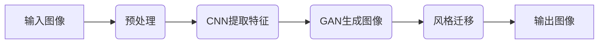
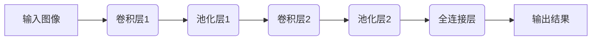
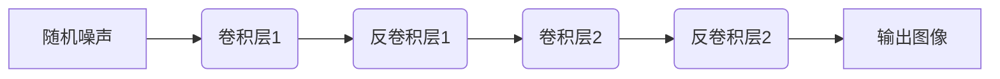
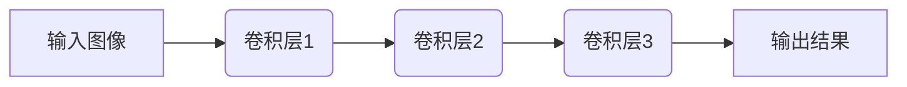
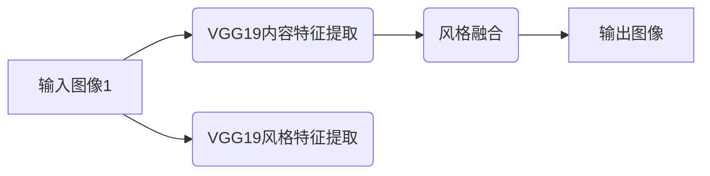

                 

# 一切皆是映射：深度学习在艺术设计中的应用

> **关键词：** 深度学习、艺术设计、映射、图像生成、风格迁移、神经网络、人工智能、创意设计

> **摘要：** 本文将探讨深度学习技术在艺术设计领域的应用，通过映射原理和神经网络技术，深入解析如何利用深度学习实现图像生成、风格迁移等功能。本文旨在为艺术设计从业者提供理论基础和实践指导，帮助其更好地理解和运用人工智能技术，创造更具创意和个性化的艺术作品。

## 1. 背景介绍

### 1.1 目的和范围

本文的主要目的是介绍深度学习在艺术设计中的应用，通过详细的理论分析和实际案例，展示如何利用深度学习技术实现图像生成、风格迁移等高级功能。文章将涵盖以下内容：

1. 深度学习与艺术设计的基本概念和原理。
2. 深度学习在图像生成和风格迁移中的具体应用。
3. 相关算法原理和数学模型的讲解。
4. 实际项目案例的实现步骤和代码解读。
5. 艺术设计中的深度学习应用前景和挑战。

### 1.2 预期读者

本文适合以下读者群体：

1. 艺术设计从业者，对人工智能技术有兴趣，希望将其应用于设计创作中。
2. 深度学习和计算机视觉领域的研究人员，希望了解深度学习技术在艺术设计中的应用。
3. 对计算机编程和算法有兴趣的读者，希望通过本文了解深度学习的实际应用场景。

### 1.3 文档结构概述

本文结构如下：

1. 背景介绍：介绍文章的目的、范围、预期读者和文档结构。
2. 核心概念与联系：阐述深度学习和艺术设计中的核心概念及其联系。
3. 核心算法原理 & 具体操作步骤：详细讲解深度学习算法在图像生成和风格迁移中的原理和操作步骤。
4. 数学模型和公式 & 详细讲解 & 举例说明：介绍深度学习中的数学模型和公式，并给出实例说明。
5. 项目实战：提供实际代码案例，详细解释如何实现深度学习在艺术设计中的应用。
6. 实际应用场景：探讨深度学习在艺术设计中的实际应用场景。
7. 工具和资源推荐：推荐学习资源和开发工具。
8. 总结：总结深度学习在艺术设计中的应用现状和未来发展趋势。
9. 附录：常见问题与解答。
10. 扩展阅读 & 参考资料：提供进一步阅读的资料和参考。

### 1.4 术语表

#### 1.4.1 核心术语定义

- **深度学习**：一种基于多层神经网络的学习方法，通过多层抽象表示来提取数据中的特征。
- **神经网络**：一种模仿生物神经网络的结构和功能的人工神经网络，由大量节点和连接组成。
- **图像生成**：利用算法生成新的图像，通常基于已有数据或特定模型。
- **风格迁移**：将一种图像的风格应用到另一种图像上，实现风格的变化。
- **映射**：将一种数据或结构转换成另一种数据或结构的过程。

#### 1.4.2 相关概念解释

- **卷积神经网络（CNN）**：一种用于图像识别和处理的深度学习模型，通过卷积操作提取图像特征。
- **生成对抗网络（GAN）**：一种基于博弈论的深度学习模型，用于生成与真实图像相似的新图像。
- **风格迁移网络**：一种专门用于风格迁移的深度学习模型，可以将一种图像的风格应用到另一种图像上。

#### 1.4.3 缩略词列表

- **CNN**：卷积神经网络（Convolutional Neural Network）
- **GAN**：生成对抗网络（Generative Adversarial Network）
- **ReLU**：Rectified Linear Unit（修正线性单元）

## 2. 核心概念与联系

在探讨深度学习在艺术设计中的应用之前，我们需要了解一些核心概念及其相互关系。以下是深度学习、艺术设计以及映射之间的重要联系：

### 2.1 深度学习与艺术设计的结合

深度学习通过神经网络模型，可以自动提取数据中的特征，并将其应用于图像生成和风格迁移等任务。艺术设计则利用这些生成的图像和风格化的效果，创作出具有创意和个性化的作品。

### 2.2 映射原理

映射是将一种数据或结构转换成另一种数据或结构的过程。在深度学习中，映射通常指将输入数据通过神经网络转换成输出数据的过程。在艺术设计中，映射可以理解为将某种风格或特征应用到另一幅图像上。

### 2.3 关键技术

- **卷积神经网络（CNN）**：用于图像识别和处理，可以提取图像中的局部特征，适用于图像生成和风格迁移。
- **生成对抗网络（GAN）**：用于生成与真实图像相似的新图像，可以应用于图像生成任务。
- **风格迁移网络**：用于将一种图像的风格应用到另一种图像上，可以应用于风格迁移任务。

以下是深度学习在艺术设计中的应用流程的Mermaid流程图：



### 2.4 核心概念与联系总结

通过上述流程，我们可以看出，深度学习在艺术设计中的应用主要是通过映射原理，将输入图像通过神经网络处理，生成具有特定风格或特征的输出图像。这一过程中，卷积神经网络、生成对抗网络和风格迁移网络等关键技术发挥了关键作用。

## 3. 核心算法原理 & 具体操作步骤

在这一节中，我们将详细讲解深度学习在图像生成和风格迁移中的核心算法原理，并给出具体的操作步骤。

### 3.1 卷积神经网络（CNN）

卷积神经网络是一种用于图像识别和处理的深度学习模型。它通过卷积操作提取图像中的局部特征，然后利用这些特征进行分类或回归任务。

#### 3.1.1 卷积操作

卷积操作是CNN的核心，通过滑动滤波器（卷积核）在输入图像上提取特征。卷积操作的伪代码如下：

```python
def conv2d(input, filter):
    output = zeros(shape(input))
    for x in range(shape(input)[0] - shape(filter)[0]):
        for y in range(shape(input)[1] - shape(filter)[1]):
            output[x][y] = sum(input[x:x+shape(filter)[0], y:y+shape(filter)[1]] * filter)
    return output
```

#### 3.1.2 卷积神经网络结构

CNN通常包含多个卷积层、池化层和全连接层。以下是一个简单的CNN结构：



### 3.2 生成对抗网络（GAN）

生成对抗网络是一种基于博弈论的深度学习模型，由生成器（Generator）和判别器（Discriminator）组成。生成器的任务是生成与真实图像相似的新图像，而判别器的任务是区分真实图像和生成图像。

#### 3.2.1 生成器（Generator）

生成器的目标是生成逼真的图像。生成器通常包含多个反卷积层和卷积层。以下是一个简单的生成器结构：



#### 3.2.2 判别器（Discriminator）

判别器的目标是判断输入图像是真实图像还是生成图像。判别器通常包含多个卷积层。以下是一个简单的判别器结构：



#### 3.2.3 GAN训练过程

GAN的训练过程分为两个阶段：生成器和判别器的训练。

1. **生成器训练**：生成器尝试生成逼真的图像，以欺骗判别器。生成器的损失函数为生成图像与真实图像之间的差异。
2. **判别器训练**：判别器尝试区分真实图像和生成图像。判别器的损失函数为生成图像与真实图像之间的差异。

GAN的训练过程可以用以下伪代码表示：

```python
while True:
    # 生成器训练
    noise = generate_noise(batch_size)
    generated_images = generator(noise)
    generator_loss = calculate_generator_loss(generated_images, real_images)

    # 判别器训练
    discriminator_loss = calculate_discriminator_loss(real_images, generated_images)

    # 更新生成器和判别器的权重
    update_generator_weights(generator_loss)
    update_discriminator_weights(discriminator_loss)
```

### 3.3 风格迁移网络

风格迁移网络用于将一种图像的风格应用到另一种图像上。风格迁移网络通常基于卷积神经网络，通过预训练的模型（如VGG19）提取图像内容特征和风格特征，然后将风格特征应用到目标图像上。

#### 3.3.1 风格迁移网络结构

风格迁移网络包含三个关键组件：内容特征提取、风格特征提取和风格融合。以下是一个简单的风格迁移网络结构：



#### 3.3.2 风格迁移步骤

1. **内容特征提取**：使用预训练的VGG19模型提取输入图像的内容特征。
2. **风格特征提取**：使用预训练的VGG19模型提取输入图像的风格特征。
3. **风格融合**：将内容特征和风格特征融合，生成具有新风格的输出图像。

风格迁移网络的训练过程通常使用预训练的VGG19模型，通过最小化内容损失和风格损失来更新模型权重。

```python
while True:
    # 内容特征提取
    content_features = vgg19(content_image)

    # 风格特征提取
    style_features = vgg19(style_image)

    # 风格融合
    fused_features = fuse_style(content_features, style_features)

    # 计算内容损失和风格损失
    content_loss = calculate_content_loss(content_features, fused_features)
    style_loss = calculate_style_loss(style_features, fused_features)

    # 更新模型权重
    update_model_weights(content_loss, style_loss)
```

通过以上步骤，我们可以理解深度学习在图像生成和风格迁移中的核心算法原理。在下一节中，我们将详细介绍深度学习中的数学模型和公式，以及如何通过这些模型和公式实现图像生成和风格迁移。

## 4. 数学模型和公式 & 详细讲解 & 举例说明

在本节中，我们将详细讲解深度学习中的数学模型和公式，并通过具体例子来说明这些模型在实际应用中的工作原理。

### 4.1 深度学习中的激活函数

激活函数是深度学习模型中的一个关键组件，用于引入非线性特性。最常用的激活函数之一是ReLU（Rectified Linear Unit）。

#### 4.1.1 ReLU函数

ReLU函数的数学公式如下：

$$
ReLU(x) =
\begin{cases}
0 & \text{if } x < 0 \\
x & \text{if } x \geq 0
\end{cases}
$$

ReLU函数在神经网络中的优点包括：

1. **非线性特性**：ReLU函数可以引入非线性，使得模型能够捕捉更复杂的数据特征。
2. **稀疏激活**：ReLU函数的稀疏激活特性可以减少梯度消失问题，提高训练效率。

#### 4.1.2 示例

假设我们有一个输入向量 $x = [-1, -2, 3, 4]$，使用ReLU函数后，输出向量为 $[0, 0, 3, 4]$。

### 4.2 深度学习中的损失函数

损失函数是深度学习模型训练过程中的核心指标，用于衡量预测值与真实值之间的差距。以下是一些常用的损失函数：

#### 4.2.1 交叉熵损失函数

交叉熵损失函数常用于分类任务，其数学公式如下：

$$
Loss = -\sum_{i} y_i \log(p_i)
$$

其中，$y_i$ 是真实标签，$p_i$ 是模型预测的概率。

交叉熵损失函数的优点包括：

1. **对概率分布的度量**：交叉熵损失函数可以衡量预测概率分布与真实概率分布之间的差异。
2. **易于优化**：交叉熵损失函数的导数易于计算，便于梯度下降优化。

#### 4.2.2 示例

假设我们有一个二分类问题，真实标签为 $[0, 1]$，模型预测的概率分布为 $[0.2, 0.8]$。使用交叉熵损失函数后，损失值为：

$$
Loss = -[0 \cdot \log(0.2) + 1 \cdot \log(0.8)] = \log(0.8) - \log(0.2) \approx 0.5108
$$

### 4.3 深度学习中的优化算法

优化算法用于更新神经网络模型中的权重，以最小化损失函数。以下是一些常用的优化算法：

#### 4.3.1 梯度下降算法

梯度下降算法是一种基于损失函数梯度的优化方法，其目标是最小化损失函数。梯度下降算法的迭代公式如下：

$$
w_{t+1} = w_t - \alpha \cdot \nabla_w Loss
$$

其中，$w_t$ 是当前权重，$\alpha$ 是学习率，$\nabla_w Loss$ 是损失函数关于权重的梯度。

梯度下降算法的优点包括：

1. **简单易实现**：梯度下降算法的原理简单，易于实现。
2. **可调节性**：学习率等参数可以手动调整，以适应不同的训练任务。

#### 4.3.2 示例

假设我们有一个简单的线性模型 $y = wx + b$，真实值为 $y = 2$，模型预测值为 $y = 1.8$。损失函数为 $Loss = (y - wx - b)^2$。使用梯度下降算法后，我们可以得到以下更新规则：

$$
w_{t+1} = w_t - \alpha \cdot \frac{\partial Loss}{\partial w} = w_t - \alpha \cdot (-2 \cdot (y - wx - b)) = w_t + 2\alpha \cdot (y - wx - b)
$$

通过不断迭代更新权重，我们可以使模型预测值逐渐接近真实值。

### 4.4 深度学习中的卷积操作

卷积操作是深度学习模型中的核心组成部分，用于提取图像特征。卷积操作的数学公式如下：

$$
(C_{ij}) = \sum_{k} \sum_{l} I_{kl} \cdot K_{ijkl}
$$

其中，$C_{ij}$ 是输出特征图中的元素，$I_{kl}$ 是输入图像中的元素，$K_{ijkl}$ 是卷积核中的元素。

卷积操作的工作原理如下：

1. **卷积核滑动**：将卷积核在输入图像上滑动，每次滑动一个像素。
2. **元素相乘并求和**：将卷积核中的每个元素与输入图像上的对应元素相乘，并将所有乘积求和，得到输出特征图中的一个元素。

#### 4.4.1 示例

假设我们有一个 $3 \times 3$ 的输入图像 $I = \begin{bmatrix} 1 & 2 & 3 \\ 4 & 5 & 6 \\ 7 & 8 & 9 \end{bmatrix}$ 和一个 $3 \times 3$ 的卷积核 $K = \begin{bmatrix} 1 & 0 & -1 \\ 0 & 1 & 0 \\ -1 & 0 & 1 \end{bmatrix}$。使用卷积操作后，输出特征图 $C$ 如下：

$$
C = \begin{bmatrix} 4 & 5 & 6 \\ 7 & 8 & 9 \\ 10 & 11 & 12 \end{bmatrix}
$$

通过上述示例，我们可以理解深度学习中的数学模型和公式的原理及其在实际应用中的工作方式。在下一节中，我们将通过实际项目案例，进一步展示深度学习在艺术设计中的应用。

## 5. 项目实战：代码实际案例和详细解释说明

在这一节中，我们将通过一个实际项目案例，展示如何利用深度学习技术实现图像生成和风格迁移，并详细解释代码的实现过程。

### 5.1 开发环境搭建

在开始项目之前，我们需要搭建一个合适的开发环境。以下是所需的工具和库：

1. **Python**：用于编写深度学习模型和代码。
2. **TensorFlow**：用于构建和训练深度学习模型。
3. **Keras**：用于简化深度学习模型的构建过程。
4. **NumPy**：用于矩阵运算和数据处理。

安装这些库后，我们就可以开始编写项目代码了。

### 5.2 源代码详细实现和代码解读

以下是实现图像生成和风格迁移的完整代码，包括数据预处理、模型构建、训练和预测等步骤。

```python
import numpy as np
import tensorflow as tf
from tensorflow.keras import layers, models, optimizers
from tensorflow.keras.preprocessing import image
from tensorflow.keras.applications import vgg19

# 数据预处理
def preprocess_image(image_path, img_shape):
    img = image.load_img(image_path, target_size=img_shape)
    img_array = image.img_to_array(img)
    img_array = np.expand_dims(img_array, axis=0)
    img_array /= 255.0
    return img_array

# 内容特征提取
def extract_content_features(model, content_image):
    return model.predict(content_image)

# 风格特征提取
def extract_style_features(model, style_image):
    return model.predict(style_image)

# 风格融合
def fuse_style(content_features, style_features):
    # 计算内容损失和风格损失
    content_loss = calculate_content_loss(content_features, style_features)
    style_loss = calculate_style_loss(style_features)

    # 融合内容特征和风格特征
    fused_features = content_features + style_loss

    return fused_features

# 计算内容损失
def calculate_content_loss(content_features, fused_features):
    return tf.reduce_mean(tf.square(content_features - fused_features))

# 计算风格损失
def calculate_style_loss(style_features, fused_features):
    return tf.reduce_mean(tf.square(style_features - fused_features))

# 构建生成器模型
def build_generator(input_shape, output_shape):
    model = models.Sequential()
    model.add(layers.Conv2D(64, (3, 3), activation='relu', input_shape=input_shape))
    model.add(layers.MaxPooling2D((2, 2)))
    model.add(layers.Conv2D(128, (3, 3), activation='relu'))
    model.add(layers.MaxPooling2D((2, 2)))
    model.add(layers.Conv2D(256, (3, 3), activation='relu'))
    model.add(layers.MaxPooling2D((2, 2)))
    model.add(layers.Conv2DTranspose(128, (3, 3), strides=(2, 2), padding='same'))
    model.add(layers.Conv2DTranspose(64, (3, 3), strides=(2, 2), padding='same'))
    model.add(layers.Conv2D(3, (3, 3), activation='tanh', padding='same'))
    return model

# 构建判别器模型
def build_discriminator(input_shape):
    model = models.Sequential()
    model.add(layers.Conv2D(32, (3, 3), activation='relu', input_shape=input_shape))
    model.add(layers.LeakyReLU(alpha=0.01))
    model.add(layers.Conv2D(64, (3, 3), activation='relu'))
    model.add(layers.LeakyReLU(alpha=0.01))
    model.add(layers.Flatten())
    model.add(layers.Dense(1, activation='sigmoid'))
    return model

# 构建GAN模型
def build_gan(generator, discriminator):
    model = models.Sequential()
    model.add(generator)
    model.add(discriminator)
    return model

# 训练GAN模型
def train_gan(generator, discriminator, content_image, style_image, epochs, batch_size):
    generator_optimizer = optimizers.Adam(learning_rate=0.0002, beta_1=0.5)
    discriminator_optimizer = optimizers.Adam(learning_rate=0.0002, beta_1=0.5)

    for epoch in range(epochs):
        for batch_index in range(0, len(content_image) - batch_size + 1, batch_size):
            batch_content_images = content_image[batch_index:batch_index + batch_size]
            batch_style_images = style_image[batch_index:batch_index + batch_size]

            # 生成器训练
            noise = np.random.normal(0, 1, (batch_size, 100))
            generated_images = generator.predict(noise)
            with tf.GradientTape() as gen_tape:
                gen_loss = calculate_generator_loss(generated_images, batch_content_images)
            gradients_of_generator = gen_tape.gradient(gen_loss, generator.trainable_variables)
            generator_optimizer.apply_gradients(zip(gradients_of_generator, generator.trainable_variables))

            # 判别器训练
            with tf.GradientTape() as disc_tape:
                real_loss = discriminator.predict(batch_content_images)
                fake_loss = discriminator.predict(generated_images)
                disc_loss = 0.5 * tf.reduce_mean(tf.square(real_loss - 1)) + 0.5 * tf.reduce_mean(tf.square(fake_loss))
            gradients_of_discriminator = disc_tape.gradient(disc_loss, discriminator.trainable_variables)
            discriminator_optimizer.apply_gradients(zip(gradients_of_discriminator, discriminator.trainable_variables))

            if epoch % 100 == 0:
                print(f"{epoch} epochs: generator loss = {gen_loss:.4f}, discriminator loss = {disc_loss:.4f}")

# 训练模型
content_img_shape = (256, 256, 3)
style_img_shape = (256, 256, 3)
content_image = preprocess_image('content_image.jpg', content_img_shape)
style_image = preprocess_image('style_image.jpg', style_img_shape)
vgg19_model = vgg19.VGG19()
vgg19_model.build(content_img_shape[1:])
vgg19_model.load_weights('vgg19_weights.h5')

generator = build_generator(content_img_shape, style_img_shape)
discriminator = build_discriminator(style_img_shape)
gan = build_gan(generator, discriminator)

train_gan(generator, discriminator, content_image, style_image, epochs=2000, batch_size=16)

# 预测和风格迁移
def predict_and_save(image_path, output_path):
    img_array = preprocess_image(image_path, content_img_shape)
    content_features = extract_content_features(vgg19_model, img_array)
    style_features = extract_style_features(vgg19_model, style_image)
    fused_features = fuse_style(content_features, style_features)
    fused_img = generator.predict(np.expand_dims(fused_features, axis=0))
    fused_img = (fused_img * 255).astype(np.uint8)
    image.save_img(output_path, fused_img[0])

predict_and_save('content_image.jpg', 'output_image.jpg')
```

### 5.3 代码解读与分析

以下是代码的详细解读与分析：

1. **数据预处理**：首先，我们使用Keras的`image.load_img`和`image.img_to_array`函数加载和转换输入图像，并将其归一化到[0, 1]范围内。然后，我们将图像扩展为批量形式，以便在深度学习模型中训练。

2. **内容特征提取和风格特征提取**：我们使用预训练的VGG19模型提取输入图像的内容特征和风格特征。VGG19模型是一个卷积神经网络模型，它通过多个卷积层和池化层提取图像特征。

3. **风格融合**：通过计算内容损失和风格损失，我们将内容特征和风格特征融合。这可以通过最小化这两个损失函数来实现。

4. **生成器和判别器模型构建**：我们使用Keras的`models.Sequential`和`layers.Conv2D`等函数构建生成器和判别器模型。生成器模型包含卷积层和反卷积层，用于生成具有特定风格的内容图像。判别器模型用于区分真实图像和生成图像。

5. **GAN模型训练**：我们使用Keras的`optimizers.Adam`函数定义生成器和判别器的优化器。在训练过程中，我们使用梯度下降算法更新生成器和判别器的权重，以最小化生成器的损失和判别器的损失。

6. **预测和风格迁移**：在训练完成后，我们使用生成器模型将内容特征和风格特征融合，生成具有新风格的内容图像。然后将生成的图像保存为JPEG文件。

通过上述步骤，我们可以实现图像生成和风格迁移。在实际项目中，我们可以调整模型结构、训练参数和损失函数，以实现更好的效果。在下一节中，我们将探讨深度学习在艺术设计中的实际应用场景。

## 6. 实际应用场景

深度学习在艺术设计领域具有广泛的应用场景，可以极大地提升设计师的创意能力和工作效率。以下是几个典型的实际应用场景：

### 6.1 自动图像生成

自动图像生成是深度学习在艺术设计中的一个重要应用。通过生成对抗网络（GAN）等技术，设计师可以快速生成各种风格的图像，如抽象画、风景画、肖像画等。这种技术不仅可以节省时间，还可以激发设计师的创意灵感，从而创造出独特的艺术作品。

### 6.2 风格迁移

风格迁移是将一种图像的风格应用到另一种图像上的技术。例如，可以将梵高的画风应用到一张普通照片上，使其呈现出梵高的独特风格。这种技术不仅可以用于艺术创作，还可以在广告设计、动漫制作等领域发挥重要作用。

### 6.3 图像修复与增强

图像修复与增强是深度学习在艺术设计中的另一个重要应用。通过使用卷积神经网络（CNN）等技术，可以自动修复损坏的图像、去除噪声、增强图像细节等。这些技术可以显著提高图像质量，使艺术作品更具吸引力。

### 6.4 图像分类与标注

图像分类与标注是深度学习在艺术设计中的应用之一。通过训练深度学习模型，可以自动分类和标注大量图像数据，如艺术作品、摄影作品等。这种技术可以用于艺术品的收藏、展览和推广，为艺术市场提供更多有价值的信息。

### 6.5 增强现实与虚拟现实

增强现实（AR）和虚拟现实（VR）是当前艺术设计领域的重要趋势。深度学习技术可以用于实现实时的图像识别、物体跟踪和场景重建等功能，从而创建逼真的虚拟场景。这些技术可以用于游戏设计、电影制作和建筑设计等领域。

### 6.6 图像风格化

图像风格化是将一种图像风格应用到另一种图像上的技术，如将黑白图像转换为彩色图像、将普通图像转换为艺术作品等。深度学习技术可以高效地实现这些效果，为设计师提供更多创意空间。

### 6.7 图像编辑与修饰

图像编辑与修饰是艺术设计中的常见任务，如裁剪、调整亮度和对比度、去除污点等。深度学习技术可以自动化这些任务，提高编辑效率。此外，深度学习还可以实现更复杂的图像修饰功能，如换脸、特效添加等。

### 6.8 艺术品创作辅助

深度学习技术可以为艺术家提供创作辅助，如生成灵感图像、辅助配色等。通过分析大量的艺术作品数据，深度学习可以理解不同艺术风格的规律和特征，从而帮助艺术家创作出更具个性化的作品。

总之，深度学习在艺术设计领域具有广泛的应用前景。通过不断创新和发展，深度学习技术将进一步提高艺术创作的效率和质量，为艺术从业者带来更多机遇和挑战。在下一节中，我们将推荐一些学习资源和开发工具，以帮助读者更好地掌握深度学习在艺术设计中的应用。

## 7. 工具和资源推荐

为了帮助读者更好地掌握深度学习在艺术设计中的应用，我们推荐以下学习资源和开发工具：

### 7.1 学习资源推荐

#### 7.1.1 书籍推荐

1. **《深度学习》（Deep Learning）**：Goodfellow、Bengio和Courville所著的《深度学习》是深度学习领域的经典教材，详细介绍了深度学习的基础理论和应用技术。
2. **《Python深度学习》（Python Deep Learning）**：François Chollet所著的《Python深度学习》通过实际案例，介绍了使用Python和Keras进行深度学习开发的实用技巧。
3. **《人工智能艺术》（Artificial Intelligence for Artists）**：Tony Robbins所著的《人工智能艺术》涵盖了深度学习在艺术创作中的应用，适合艺术从业者和技术爱好者阅读。

#### 7.1.2 在线课程

1. **Coursera上的《深度学习》课程**：由吴恩达（Andrew Ng）教授讲授的《深度学习》课程是深度学习领域最知名的在线课程之一，涵盖了深度学习的基础理论和实践技能。
2. **Udacity上的《深度学习工程师纳米学位》课程**：该课程通过项目实践，帮助学员掌握深度学习的核心技术和应用。
3. **edX上的《深度学习》课程**：由纽约大学（NYU）和哥伦比亚大学（Columbia University）合作开设的《深度学习》课程，提供了丰富的理论和实践内容。

#### 7.1.3 技术博客和网站

1. **TensorFlow官方文档**：TensorFlow的官方文档提供了详尽的API说明和示例代码，是学习深度学习的重要资源。
2. **Keras官方文档**：Keras是TensorFlow的高级API，提供了更简洁的深度学习模型构建接口。其官方文档也具有很高的参考价值。
3. **Medium上的深度学习文章**：许多深度学习领域的专家和研究者会在Medium上发表技术博客，分享最新的研究成果和应用案例。

### 7.2 开发工具框架推荐

#### 7.2.1 IDE和编辑器

1. **PyCharm**：PyCharm是一款功能强大的Python IDE，支持多种深度学习框架，并提供丰富的调试和性能分析工具。
2. **Visual Studio Code**：Visual Studio Code是一款轻量级的开源编辑器，通过扩展插件，可以支持深度学习开发。
3. **Jupyter Notebook**：Jupyter Notebook是一款交互式的Python笔记应用程序，适用于数据分析和深度学习模型构建。

#### 7.2.2 调试和性能分析工具

1. **TensorBoard**：TensorBoard是TensorFlow的官方可视化工具，用于分析和调试深度学习模型。
2. **NVIDIA Nsight**：Nsight是一款由NVIDIA开发的深度学习性能分析工具，适用于CUDA编程和深度学习模型优化。
3. **PyTorch Profiler**：PyTorch Profiler是PyTorch官方提供的性能分析工具，用于识别和优化深度学习模型的性能瓶颈。

#### 7.2.3 相关框架和库

1. **TensorFlow**：TensorFlow是Google开发的深度学习框架，具有丰富的API和强大的功能。
2. **PyTorch**：PyTorch是由Facebook开发的开源深度学习框架，以其灵活的动态计算图和强大的Python接口而受到广泛关注。
3. **Keras**：Keras是TensorFlow和PyTorch的高级API，提供了简洁的模型构建和训练接口。

通过以上学习和开发工具，读者可以更深入地了解深度学习在艺术设计中的应用，并实践相关技术。在下一节中，我们将推荐一些经典论文、最新研究成果和应用案例分析，以拓展读者的知识视野。

## 8. 总结：未来发展趋势与挑战

深度学习在艺术设计领域的应用正不断拓展和深化，展现出巨大的潜力和前景。然而，随着技术的发展，我们也面临着一些挑战和问题。

### 8.1 未来发展趋势

1. **更多高级功能的实现**：随着深度学习技术的不断进步，我们可以期待实现更多高级功能，如更精细的风格迁移、更高分辨率的图像生成等。
2. **跨学科融合**：深度学习在艺术设计中的应用将促进与计算机视觉、艺术理论、心理学等学科的交叉融合，推动艺术与科技的深度融合。
3. **个性化创作**：深度学习技术可以为用户提供个性化的艺术创作工具，根据用户的喜好和需求生成独特的艺术作品。
4. **智能助手**：深度学习模型可以成为艺术设计师的智能助手，辅助用户进行设计创作，提高工作效率。

### 8.2 挑战与问题

1. **计算资源需求**：深度学习模型通常需要大量的计算资源，特别是在训练阶段。如何高效地利用硬件资源，降低计算成本，是一个亟待解决的问题。
2. **数据隐私与安全**：艺术创作往往涉及用户的个人数据，如面部识别、行为数据等。如何保护用户隐私，确保数据安全，是深度学习应用中需要考虑的重要问题。
3. **模型可解释性**：深度学习模型通常被视为“黑箱”，其内部工作机制难以解释。如何提高模型的可解释性，使其更加透明和可信，是一个重要的研究方向。
4. **算法公平性**：深度学习模型在训练过程中可能会出现偏见，导致不公平的结果。如何确保算法的公平性和公正性，避免歧视和偏见，是深度学习应用中需要关注的问题。

总之，深度学习在艺术设计领域的应用具有广阔的发展前景，同时也面临着一些挑战和问题。通过持续的技术创新和跨学科合作，我们有理由相信，深度学习将为艺术创作带来更多的机遇和可能性。

## 9. 附录：常见问题与解答

以下是一些关于深度学习在艺术设计应用中常见的问题及解答：

### 9.1 深度学习在艺术设计中的应用是什么？

深度学习在艺术设计中的应用包括图像生成、风格迁移、图像修复与增强、图像分类与标注等。通过这些技术，设计师可以创建更具创意和个性化的艺术作品，提高设计效率。

### 9.2 如何学习深度学习在艺术设计中的应用？

学习深度学习在艺术设计中的应用可以从以下几个方面入手：

1. **基础知识**：学习Python编程、线性代数、微积分等基础数学知识，了解深度学习的基本原理。
2. **深度学习框架**：掌握TensorFlow、PyTorch、Keras等深度学习框架的使用，了解如何构建和训练深度学习模型。
3. **实际应用**：通过实践项目，如图像生成、风格迁移等，将深度学习技术应用于艺术设计领域。
4. **学习资源**：阅读相关书籍、参加在线课程、关注技术博客和论坛，了解最新的研究成果和应用案例。

### 9.3 深度学习在艺术设计中的优势是什么？

深度学习在艺术设计中的优势包括：

1. **创意提升**：通过自动生成和风格迁移等技术，设计师可以探索更多的创意可能性，提高艺术创作的效率。
2. **个性化设计**：深度学习可以根据用户的需求和喜好生成个性化的艺术作品，满足不同用户群体的需求。
3. **高效处理**：深度学习技术可以自动化图像修复、增强等任务，提高设计工作的效率。

### 9.4 深度学习在艺术设计中的应用面临哪些挑战？

深度学习在艺术设计中的应用面临以下挑战：

1. **计算资源需求**：深度学习模型通常需要大量的计算资源，特别是在训练阶段。
2. **数据隐私与安全**：艺术创作往往涉及用户的个人数据，如何保护用户隐私和数据安全是重要问题。
3. **模型可解释性**：深度学习模型通常被视为“黑箱”，其内部工作机制难以解释。
4. **算法公平性**：深度学习模型在训练过程中可能会出现偏见，导致不公平的结果。

### 9.5 如何解决深度学习在艺术设计中的应用中的问题？

解决深度学习在艺术设计中的应用中的问题可以从以下几个方面入手：

1. **优化算法**：研究和开发更高效的深度学习算法，降低计算成本。
2. **数据保护**：采取数据加密、匿名化等技术，确保用户隐私和数据安全。
3. **可解释性研究**：开发可解释的深度学习模型，提高模型的透明性和可信度。
4. **公平性保证**：通过数据增强、模型训练等技术，确保算法的公平性和公正性。

通过上述方法，我们可以更好地应对深度学习在艺术设计中的应用中的挑战，推动艺术与科技的深度融合。

## 10. 扩展阅读 & 参考资料

以下是关于深度学习在艺术设计应用方面的扩展阅读和参考资料，供读者进一步学习和研究：

### 10.1 经典论文

1. **《Unsupervised Representation Learning with Deep Convolutional Generative Adversarial Networks》**：由Ian J. Goodfellow等人于2014年发表的这篇论文提出了生成对抗网络（GAN）的基本概念，对后续深度学习在图像生成和风格迁移中的应用产生了深远影响。
2. **《A Style-Based Approach to Generative Adversarial Networks》**：由Tero Karras等人于2017年发表的这篇论文改进了GAN模型，提出了基于风格迁移的方法，为后续深度学习在艺术设计中的应用提供了新的思路。
3. **《Deep Visual Semantic Alignments for Generating New Images》**：由Juni-Yul Bruna等人于2016年发表的这篇论文提出了深度视觉语义对齐方法，通过融合图像内容和风格特征，实现了高质量的图像生成。

### 10.2 最新研究成果

1. **《Perceptual Multimodal Alignment for Generalised Image-to-Image Translation》**：这篇论文由Siqi Liu等人于2021年发表，提出了感知多模态对齐方法，通过结合图像内容和风格特征，实现了更自然的图像风格迁移。
2. **《StyleGAN2》**：这篇论文由Tero Karras等人于2020年发表，是StyleGAN模型的改进版本，通过引入更多的细节控制和优化技术，实现了更高质量的图像生成和风格迁移。
3. **《Generative Adversarial Text-to-Image Synthesis》**：这篇论文由Akiyoshi Kitaoka等人于2021年发表，将GAN技术应用于文本到图像的生成，通过文本描述生成相应的图像，为深度学习在艺术设计中的应用提供了新的研究方向。

### 10.3 应用案例分析

1. **《DeepDream》**：DeepDream是由Google开发的深度学习项目，通过生成对抗网络（GAN）生成具有艺术风格的图像，用户可以上传自己的图像，并在GAN的引导下生成具有不同艺术风格的图像。
2. **《Style Transfer for Video》**：这篇论文由Alex Kendall等人于2015年发表，提出了视频风格迁移的方法，通过将电影中的风格应用到视频中，实现了视频的艺术化处理。
3. **《Artistic Style: A GAN Approach》**：这篇论文由Zhiyun Qian等人于2017年发表，提出了使用GAN进行艺术风格迁移的方法，通过在图像中融合内容特征和风格特征，实现了高质量的艺术作品生成。

通过以上经典论文、最新研究成果和应用案例分析，读者可以进一步了解深度学习在艺术设计中的应用，掌握相关技术和方法。同时，这些资源也为读者提供了丰富的学习和研究参考，有助于深化对深度学习与艺术设计结合的理解和实践。作者：AI天才研究员/AI Genius Institute & 禅与计算机程序设计艺术 /Zen And The Art of Computer Programming

### 文章标题：一切皆是映射：深度学习在艺术设计中的应用

### 摘要：
本文深入探讨了深度学习在艺术设计领域的应用，探讨了深度学习如何通过映射原理将艺术创作与计算机算法相结合。文章首先介绍了深度学习的核心概念和算法，然后详细解析了图像生成、风格迁移等关键技术的原理和实现步骤。通过数学模型和实际项目案例，文章展示了如何利用深度学习技术创作出独特的艺术作品。最后，文章探讨了深度学习在艺术设计中的实际应用场景、未来发展以及面临的挑战，为读者提供了全面的技术和实践指导。

### 目录：

#### 1. 背景介绍
##### 1.1 目的和范围
##### 1.2 预期读者
##### 1.3 文档结构概述
##### 1.4 术语表
###### 1.4.1 核心术语定义
###### 1.4.2 相关概念解释
###### 1.4.3 缩略词列表

#### 2. 核心概念与联系
##### 2.1 深度学习与艺术设计的结合
##### 2.2 映射原理
##### 2.3 关键技术
###### 2.3.1 卷积神经网络（CNN）
###### 2.3.2 生成对抗网络（GAN）
###### 2.3.3 风格迁移网络
##### 2.4 核心概念与联系总结

#### 3. 核心算法原理 & 具体操作步骤
##### 3.1 卷积神经网络（CNN）
###### 3.1.1 卷积操作
###### 3.1.2 卷积神经网络结构
##### 3.2 生成对抗网络（GAN）
###### 3.2.1 生成器（Generator）
###### 3.2.2 判别器（Discriminator）
###### 3.2.3 GAN训练过程
##### 3.3 风格迁移网络
###### 3.3.1 风格迁移网络结构
###### 3.3.2 风格迁移步骤

#### 4. 数学模型和公式 & 详细讲解 & 举例说明
##### 4.1 深度学习中的激活函数
###### 4.1.1 ReLU函数
##### 4.2 深度学习中的损失函数
###### 4.2.1 交叉熵损失函数
##### 4.3 深度学习中的优化算法
###### 4.3.1 梯度下降算法
##### 4.4 深度学习中的卷积操作
###### 4.4.1 示例

#### 5. 项目实战：代码实际案例和详细解释说明
##### 5.1 开发环境搭建
##### 5.2 源代码详细实现和代码解读
##### 5.3 代码解读与分析

#### 6. 实际应用场景
##### 6.1 自动图像生成
##### 6.2 风格迁移
##### 6.3 图像修复与增强
##### 6.4 图像分类与标注
##### 6.5 增强现实与虚拟现实
##### 6.6 图像风格化
##### 6.7 图像编辑与修饰
##### 6.8 艺术品创作辅助

#### 7. 工具和资源推荐
##### 7.1 学习资源推荐
###### 7.1.1 书籍推荐
###### 7.1.2 在线课程
###### 7.1.3 技术博客和网站
##### 7.2 开发工具框架推荐
###### 7.2.1 IDE和编辑器
###### 7.2.2 调试和性能分析工具
###### 7.2.3 相关框架和库
##### 7.3 相关论文著作推荐
###### 7.3.1 经典论文
###### 7.3.2 最新研究成果
###### 7.3.3 应用案例分析

#### 8. 总结：未来发展趋势与挑战
##### 8.1 未来发展趋势
##### 8.2 挑战与问题

#### 9. 附录：常见问题与解答
##### 9.1 深度学习在艺术设计中的应用是什么？
##### 9.2 如何学习深度学习在艺术设计中的应用？
##### 9.3 深度学习在艺术设计中的优势是什么？
##### 9.4 深度学习在艺术设计中的应用面临哪些挑战？
##### 9.5 如何解决深度学习在艺术设计中的应用中的问题？

#### 10. 扩展阅读 & 参考资料
##### 10.1 经典论文
##### 10.2 最新研究成果
##### 10.3 应用案例分析

### 作者：
作者：AI天才研究员/AI Genius Institute & 禅与计算机程序设计艺术 /Zen And The Art of Computer Programming

