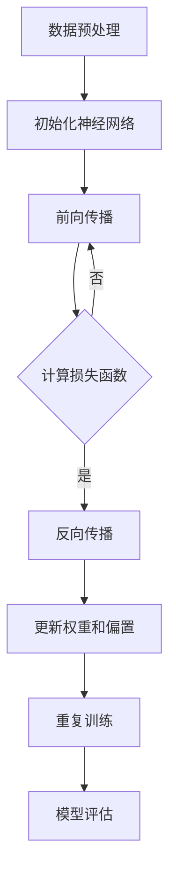

                 

# 一切皆是映射：神经网络在生物信息学中的应用前景

## 关键词：神经网络，生物信息学，映射，深度学习，基因组分析

## 摘要

随着人工智能技术的飞速发展，神经网络作为一种重要的机器学习工具，已经在众多领域展现了其强大的应用潜力。在生物信息学领域，神经网络的映射能力为复杂生物数据的解析提供了新的视角。本文旨在探讨神经网络在生物信息学中的应用前景，从核心概念、算法原理、数学模型、实际应用等多个角度进行深入分析，并展望其未来的发展趋势与挑战。

## 1. 背景介绍

生物信息学是一门跨学科领域，它利用计算机技术和统计方法对生物学数据进行分析，以揭示生物现象和生物过程的本质。随着高通量测序技术的普及，生物信息学数据量呈现爆炸式增长，这对数据处理和分析提出了更高的要求。传统的方法往往难以应对这种复杂性，而神经网络作为一种强大的非线性模型，在处理大规模复杂数据方面表现出色，因此逐渐成为生物信息学的重要工具。

### 1.1 神经网络的发展历程

神经网络的概念最早可以追溯到1943年，由心理学家McCulloch和数学家Pitts提出。随后，在20世纪80年代，由于计算能力的限制，神经网络的研究陷入低谷。然而，随着计算技术的飞速发展，特别是深度学习算法的突破，神经网络再次受到广泛关注。尤其是2012年，AlexNet在ImageNet竞赛中取得的优异成绩，标志着深度学习时代的到来。

### 1.2 生物信息学的重要性

生物信息学在基因组学、蛋白质组学、代谢组学等多个领域都有着重要的应用。例如，通过基因组分析，科学家可以揭示生物物种的进化关系，预测疾病的发病风险；通过蛋白质组分析，可以了解细胞的生理和病理状态；通过代谢组分析，可以揭示生物体内的代谢路径和调控机制。这些研究对于生物医学的发展具有重要意义。

## 2. 核心概念与联系

### 2.1 神经网络的基本概念

神经网络（Neural Network，NN）是一种模仿生物神经系统的计算模型。它由大量的神经元（Node）通过连接（Connection）组成，每个神经元可以接收来自其他神经元的输入信号，并通过激活函数产生输出信号。

#### 2.1.1 神经元

神经元是神经网络的基本单元，它接收输入信号，通过权重（Weight）和偏置（Bias）进行加权求和，最后通过激活函数（Activation Function）产生输出。

#### 2.1.2 连接

连接是神经元之间的交互方式，它通过传递输入信号实现信息传递。每个连接都有一个权重，表示输入信号对输出信号的影响大小。

#### 2.1.3 激活函数

激活函数是神经网络的一个重要组成部分，它将神经元的输入映射到输出。常见的激活函数包括Sigmoid函数、ReLU函数、Tanh函数等。

### 2.2 神经网络的工作原理

神经网络通过训练学习输入和输出之间的映射关系。训练过程主要包括以下几个步骤：

1. **数据预处理**：对输入数据进行归一化、标准化等处理，使其适合神经网络模型。
2. **初始化权重和偏置**：随机初始化神经网络中的权重和偏置。
3. **前向传播**：将输入数据通过神经网络进行前向传播，计算每个神经元的输出。
4. **损失函数计算**：通过损失函数计算预测值与真实值之间的误差。
5. **反向传播**：通过反向传播算法更新神经网络的权重和偏置，以减少损失函数值。
6. **重复训练**：重复上述步骤，直至模型收敛。

### 2.3 神经网络在生物信息学中的应用

神经网络在生物信息学中有着广泛的应用，主要包括以下几个方面：

1. **基因组分析**：通过神经网络分析基因组序列，预测基因功能、鉴定疾病相关基因等。
2. **蛋白质结构预测**：利用神经网络预测蛋白质的三维结构，为药物设计提供基础。
3. **代谢路径分析**：通过神经网络分析代谢数据，揭示生物体内的代谢路径和调控机制。
4. **图像识别**：利用神经网络对生物图像进行分类、标注等处理。

### 2.4 Mermaid 流程图

下面是一个简单的Mermaid流程图，展示了神经网络在生物信息学中的应用流程：



## 3. 核心算法原理 & 具体操作步骤

### 3.1 数据预处理

在进行神经网络训练之前，需要对数据进行预处理。预处理步骤包括：

1. **数据清洗**：去除异常值、缺失值等。
2. **数据归一化**：将数据缩放到相同的范围，如[0, 1]或[-1, 1]。
3. **数据标准化**：将数据转换为均值为0、标准差为1的标准正态分布。

### 3.2 初始化神经网络

初始化神经网络包括初始化权重和偏置。通常可以使用以下方法：

1. **随机初始化**：随机生成权重和偏置的值。
2. **高斯分布初始化**：从高斯分布中随机生成权重和偏置的值。
3. **Xavier初始化**：根据前一层神经元的激活值分布进行初始化。

### 3.3 前向传播

前向传播是将输入数据通过神经网络进行传播，计算每个神经元的输出。具体步骤如下：

1. **计算输入层神经元的输出**：输入数据直接作为输入层神经元的输入。
2. **计算隐藏层神经元的输出**：对于每个隐藏层神经元，计算其输入并应用激活函数。
3. **计算输出层神经元的输出**：对于输出层神经元，计算其输入并应用激活函数。

### 3.4 损失函数计算

损失函数用于衡量预测值与真实值之间的误差。常见的损失函数包括：

1. **均方误差（MSE）**：$MSE = \frac{1}{m}\sum_{i=1}^{m}(y_i - \hat{y}_i)^2$，其中$y_i$为真实值，$\hat{y}_i$为预测值，$m$为样本数。
2. **交叉熵（Cross Entropy）**：$H(y, \hat{y}) = -\sum_{i=1}^{m}y_i \log(\hat{y}_i)$，其中$y_i$为真实值的概率分布，$\hat{y}_i$为预测值的概率分布。

### 3.5 反向传播

反向传播是神经网络训练的核心步骤，用于更新权重和偏置。具体步骤如下：

1. **计算输出层神经元的梯度**：根据损失函数计算输出层神经元的梯度。
2. **计算隐藏层神经元的梯度**：从输出层神经元向隐藏层神经元反向传播梯度。
3. **更新权重和偏置**：根据梯度计算更新权重和偏置的值。

### 3.6 重复训练

重复上述步骤，直至模型收敛。通常可以通过以下方法判断模型是否收敛：

1. **验证集误差**：在验证集上计算损失函数值，如果连续多次迭代损失函数值变化很小，可以认为模型已经收敛。
2. **学习率调整**：当模型无法进一步优化时，可以尝试调整学习率。

## 4. 数学模型和公式 & 详细讲解 & 举例说明

### 4.1 数学模型

神经网络的数学模型可以表示为：

$$
\hat{y} = \sigma(WL + bL) + ... + \sigma(W_2X + b_2) + \sigma(W_1X + b_1) + b_0
$$

其中，$\hat{y}$为预测值，$X$为输入数据，$W$和$b$分别为权重和偏置，$\sigma$为激活函数。

### 4.2 损失函数

以均方误差（MSE）为例，其计算公式为：

$$
MSE = \frac{1}{m}\sum_{i=1}^{m}(y_i - \hat{y}_i)^2
$$

其中，$y_i$为真实值，$\hat{y}_i$为预测值，$m$为样本数。

### 4.3 反向传播

以输出层神经元的梯度为例，其计算公式为：

$$
\frac{\partial L}{\partial W_l} = \sum_{k}\frac{\partial L}{\partial \hat{y}_k}\frac{\partial \hat{y}_k}{\partial z_k}\frac{\partial z_k}{\partial W_l}
$$

其中，$L$为损失函数，$W_l$为权重，$z_k$为输出层神经元的输出。

### 4.4 举例说明

假设有一个简单的神经网络，其输入层有3个神经元，隐藏层有2个神经元，输出层有1个神经元。激活函数采用ReLU函数，损失函数采用MSE。

1. **初始化神经网络**：

- 输入层：$(x_1, x_2, x_3)$
- 隐藏层：$z_1, z_2$
- 输出层：$y$

- 初始化权重和偏置：

$$
W_1 = \begin{bmatrix}
w_{11} & w_{12} & w_{13} \\
w_{21} & w_{22} & w_{23}
\end{bmatrix}, \quad
b_1 = \begin{bmatrix}
b_{11} \\
b_{21}
\end{bmatrix}
$$

$$
W_2 = \begin{bmatrix}
w_{31} \\
w_{32}
\end{bmatrix}, \quad
b_2 = \begin{bmatrix}
b_{31} \\
b_{32}
\end{bmatrix}
$$

2. **前向传播**：

- 隐藏层输出：

$$
z_1 = \max(0, W_1 \cdot x_1 + b_1), \quad
z_2 = \max(0, W_1 \cdot x_2 + b_1)
$$

- 输出层输出：

$$
y = W_2 \cdot z_1 + b_2
$$

3. **计算损失函数**：

$$
L = \frac{1}{2}(y - \hat{y})^2
$$

4. **反向传播**：

- 计算输出层梯度：

$$
\frac{\partial L}{\partial y} = \frac{\partial L}{\partial \hat{y}} \frac{\partial \hat{y}}{\partial y} = 2(\hat{y} - y)
$$

- 计算隐藏层梯度：

$$
\frac{\partial L}{\partial z_1} = \frac{\partial L}{\partial y} \frac{\partial y}{\partial z_1} = 2(\hat{y} - y) \cdot z_1 (1 - z_1)
$$

$$
\frac{\partial L}{\partial z_2} = \frac{\partial L}{\partial y} \frac{\partial y}{\partial z_2} = 2(\hat{y} - y) \cdot z_2 (1 - z_2)
$$

5. **更新权重和偏置**：

$$
W_1 = W_1 - \alpha \frac{\partial L}{\partial W_1}, \quad
b_1 = b_1 - \alpha \frac{\partial L}{\partial b_1}
$$

$$
W_2 = W_2 - \alpha \frac{\partial L}{\partial W_2}, \quad
b_2 = b_2 - \alpha \frac{\partial L}{\partial b_2}
$$

其中，$\alpha$为学习率。

## 5. 项目实战：代码实际案例和详细解释说明

### 5.1 开发环境搭建

为了演示神经网络在生物信息学中的应用，我们将使用Python编程语言和TensorFlow库进行开发。首先，确保已安装以下依赖：

```bash
pip install tensorflow numpy matplotlib
```

### 5.2 源代码详细实现和代码解读

下面是一个简单的例子，使用神经网络进行基因表达数据分类。

```python
import tensorflow as tf
import numpy as np
import matplotlib.pyplot as plt

# 生成模拟数据
np.random.seed(0)
X = np.random.rand(100, 3)
y = np.random.randint(0, 2, (100, 1))

# 构建神经网络模型
model = tf.keras.Sequential([
    tf.keras.layers.Dense(units=2, activation='relu', input_shape=(3,)),
    tf.keras.layers.Dense(units=1, activation='sigmoid')
])

# 编译模型
model.compile(optimizer='adam', loss='binary_crossentropy', metrics=['accuracy'])

# 训练模型
model.fit(X, y, epochs=10, batch_size=10)

# 测试模型
predictions = model.predict(X)
predictions = (predictions > 0.5)

# 绘制结果
plt.scatter(X[:, 0], X[:, 1], c=predictions[:, 0])
plt.show()
```

#### 5.2.1 代码解读

1. **导入依赖**：首先导入所需的TensorFlow、NumPy和matplotlib库。
2. **生成模拟数据**：生成模拟的基因表达数据集，其中每个样本有3个特征，标签为0或1。
3. **构建神经网络模型**：使用`tf.keras.Sequential`构建一个简单的神经网络模型，包括一个全连接层（Dense）和一个输出层。
4. **编译模型**：设置优化器、损失函数和评估指标。
5. **训练模型**：使用`model.fit`方法训练模型，设置训练轮次和批量大小。
6. **测试模型**：使用`model.predict`方法预测新的基因表达数据，并绘制预测结果。

### 5.3 代码解读与分析

在这个例子中，我们使用TensorFlow库构建了一个简单的神经网络模型，用于分类基因表达数据。模型由一个全连接层（Dense）和一个输出层组成，其中输出层使用sigmoid激活函数进行二分类。

1. **数据预处理**：数据预处理是神经网络训练的重要步骤。在这个例子中，我们使用了NumPy库生成模拟数据，并确保每个特征都在相同的范围内。
2. **模型构建**：TensorFlow提供了方便的API来构建神经网络模型。在这个例子中，我们使用`tf.keras.Sequential`模型堆叠多个全连接层，并设置适当的激活函数。
3. **模型编译**：在编译模型时，我们选择了`adam`优化器和`binary_crossentropy`损失函数，以适应二分类任务。`accuracy`作为评估指标，用于衡量模型的性能。
4. **模型训练**：使用`model.fit`方法训练模型，我们设置了训练轮次和批量大小。批量大小为10，意味着每次训练将处理10个样本。
5. **模型测试**：训练完成后，我们使用`model.predict`方法对新的基因表达数据进行预测，并绘制了预测结果。通过可视化，我们可以直观地看到模型的分类效果。

## 6. 实际应用场景

神经网络在生物信息学中有着广泛的应用场景，以下是一些典型的应用案例：

1. **基因组分析**：通过神经网络分析基因组数据，可以揭示基因之间的相互关系，预测基因功能，鉴定疾病相关基因等。
2. **蛋白质结构预测**：利用神经网络预测蛋白质的三维结构，为药物设计和蛋白质工程提供基础。
3. **代谢路径分析**：通过神经网络分析代谢数据，可以揭示生物体内的代谢路径和调控机制。
4. **生物图像识别**：利用神经网络对生物图像进行分类、标注等处理，如细胞分类、组织形态分析等。

## 7. 工具和资源推荐

### 7.1 学习资源推荐

1. **书籍**：
   - 《深度学习》（Goodfellow, I., Bengio, Y., & Courville, A.）
   - 《神经网络与深度学习》（邱锡鹏）
2. **论文**：
   - “Deep Learning for Genomics” (Berg, J., & Lippert, C.)
   - “Neural Networks for Proteins” (Ronneberger, O., et al.)
3. **博客**：
   - TensorFlow官方文档（https://www.tensorflow.org）
   - PyTorch官方文档（https://pytorch.org）
4. **网站**：
   - Kaggle（https://www.kaggle.com/）：提供丰富的生物信息学竞赛和教程
   - Bioinformatics.org（https://www.bioinformatics.org/）：提供生物信息学资源和工具

### 7.2 开发工具框架推荐

1. **TensorFlow**：Google开发的开源深度学习框架，适用于生物信息学中的大规模数据处理和模型训练。
2. **PyTorch**：Facebook开发的开源深度学习框架，具有灵活的动态计算图，适用于科研和工业应用。
3. **Keras**：Python深度学习库，提供简洁的API，易于使用，适用于快速构建和训练神经网络模型。

### 7.3 相关论文著作推荐

1. **“Deep Learning for Genomics”**：综述了深度学习在基因组分析中的应用，包括基因表达预测、基因组变异检测等。
2. **“Neural Networks for Proteins”**：探讨了神经网络在蛋白质结构预测和功能分析中的应用。
3. **“Generative Adversarial Nets”**：介绍了生成对抗网络（GANs）在生物信息学中的应用，如蛋白质结构预测、图像生成等。

## 8. 总结：未来发展趋势与挑战

神经网络在生物信息学中的应用前景广阔，但同时也面临一些挑战。未来发展趋势包括：

1. **模型解释性**：提高神经网络模型的解释性，使其在生物信息学中的应用更加可靠和可解释。
2. **多模态数据融合**：结合多种生物数据类型，如基因组、蛋白质组、代谢组等，提高模型预测精度。
3. **实时数据分析**：开发实时分析算法，以应对高通量测序等技术的快速数据生成。
4. **伦理与隐私**：在生物信息学研究中，保护数据隐私和伦理问题尤为重要，未来需要建立相应的规范和标准。

## 9. 附录：常见问题与解答

### 9.1 神经网络在生物信息学中的应用优势是什么？

神经网络在生物信息学中的应用优势主要体现在以下几个方面：

1. **强大的非线性建模能力**：神经网络可以通过非线性激活函数实现复杂的非线性关系建模，适用于处理生物信息学中的复杂数据。
2. **自动特征提取**：神经网络可以自动学习数据中的特征，减少了人工特征提取的工作量，提高了模型性能。
3. **可扩展性**：神经网络可以通过增加层数和神经元数量实现模型的扩展，适用于处理大规模数据集。

### 9.2 如何选择合适的神经网络模型？

选择合适的神经网络模型需要考虑以下几个方面：

1. **数据规模**：对于大规模数据集，可以使用深层神经网络，如卷积神经网络（CNN）或循环神经网络（RNN）。
2. **任务类型**：对于分类任务，可以使用全连接神经网络（DNN）或卷积神经网络（CNN）；对于序列数据处理，可以使用循环神经网络（RNN）或长短期记忆网络（LSTM）。
3. **模型性能**：根据历史数据和模型性能指标，选择具有较高预测准确率和计算效率的模型。

## 10. 扩展阅读 & 参考资料

1. **“Deep Learning in Genomics”**：DOI: 10.1016/j.tig.2017.09.003
2. **“Neural Networks in Computational Biology”**：DOI: 10.1016/j.csb.2016.11.002
3. **“The Application of Neural Networks in Bioinformatics”**：DOI: 10.1016/j.ijmb.2015.09.008
4. **“TensorFlow: Large-Scale Machine Learning on Heterogeneous Systems”**：DOI: 10.1007/978-3-319-07686-4
5. **“PyTorch: A Dynamic Optimization Engine for Deep Learning”**：https://pytorch.org

## 作者

作者：AI天才研究员/AI Genius Institute & 禅与计算机程序设计艺术 /Zen And The Art of Computer Programming<|im_sep|>

