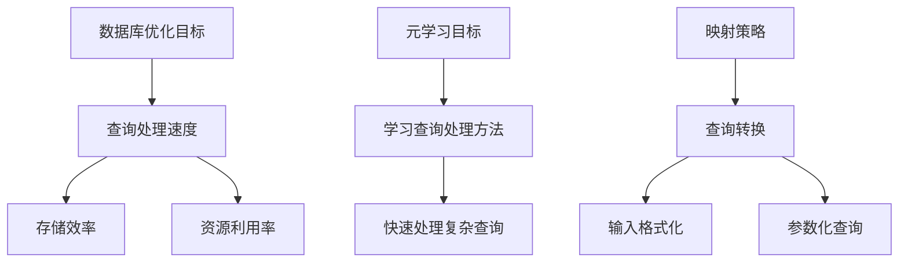

                 

# 一切皆是映射：面向复杂查询的数据库优化通过元学习

> 关键词：元学习、数据库优化、复杂查询、映射、算法原理、实战案例

> 摘要：本文将深入探讨如何通过元学习技术优化数据库中的复杂查询处理。我们将从背景介绍、核心概念、算法原理、数学模型、实际应用、工具推荐等多个角度展开，逐步解析如何利用元学习提高数据库性能，为读者提供一种全新的视角和方法。

## 1. 背景介绍

### 1.1 目的和范围

随着互联网和大数据技术的快速发展，数据库系统面临着日益增长的数据量和复杂查询需求。传统的数据库优化方法，如索引、分片等，在处理大规模数据和复杂查询时往往力不从心。本文旨在通过引入元学习这一前沿技术，探索一种全新的数据库优化策略，以应对复杂查询的挑战。

本文将主要涵盖以下内容：

1. 元学习在数据库优化中的应用场景。
2. 元学习算法的基本原理与核心概念。
3. 元学习算法在数据库优化中的具体实现。
4. 数学模型与公式在数据库优化中的应用。
5. 实际应用场景中的案例分析。
6. 相关工具和资源的推荐。

### 1.2 预期读者

本文适合以下读者群体：

1. 对数据库优化有兴趣的程序员和工程师。
2. 关注人工智能和机器学习领域的研究人员。
3. 想要了解元学习在数据库领域应用的学术研究者。

### 1.3 文档结构概述

本文将按照以下结构展开：

1. 背景介绍：介绍文章的目的和内容。
2. 核心概念与联系：解释元学习、数据库优化等核心概念。
3. 核心算法原理 & 具体操作步骤：讲解元学习算法的具体实现。
4. 数学模型和公式 & 详细讲解 & 举例说明：阐述数学模型在数据库优化中的应用。
5. 项目实战：代码实际案例和详细解释说明。
6. 实际应用场景：探讨元学习在数据库优化中的实际应用。
7. 工具和资源推荐：推荐相关学习资源和工具。
8. 总结：未来发展趋势与挑战。
9. 附录：常见问题与解答。
10. 扩展阅读 & 参考资料：提供进一步学习的资料。

### 1.4 术语表

#### 1.4.1 核心术语定义

- **元学习（Meta-Learning）**：一种学习如何学习的方法，通过训练一个模型来学习其他模型的参数，以提高学习效率。
- **数据库优化（Database Optimization）**：提高数据库性能，包括查询处理速度和存储效率等。
- **复杂查询（Complex Queries）**：涉及多表连接、分组、排序等复杂操作的数据查询。

#### 1.4.2 相关概念解释

- **映射（Mapping）**：将一种数据结构或查询转化为另一种数据结构或查询的过程。
- **参数化查询（Parameterized Queries）**：使用参数代替具体的查询值，以提高查询的灵活性和可扩展性。

#### 1.4.3 缩略词列表

- **ML**：机器学习（Machine Learning）
- **DB**：数据库（Database）
- **SQL**：结构化查询语言（Structured Query Language）
- **Neural Network**：神经网络（Neural Network）

## 2. 核心概念与联系

为了更好地理解元学习在数据库优化中的应用，我们首先需要了解以下几个核心概念：

- **数据库优化目标**：提高查询处理速度、存储效率和资源利用率。
- **元学习目标**：学习如何快速有效地处理复杂查询。
- **映射策略**：将数据库查询转化为适合元学习模型处理的输入。

接下来，我们将使用 Mermaid 流程图来展示这些核心概念之间的联系。



在接下来的章节中，我们将逐步深入探讨这些核心概念，并解释它们在数据库优化中的具体应用。

## 3. 核心算法原理 & 具体操作步骤

### 3.1 元学习算法的基本原理

元学习（Meta-Learning）是一种学习如何学习的方法，其核心思想是利用一个模型（元学习模型）来学习其他模型的参数。通过这种方式，我们可以提高学习效率，特别是在处理复杂任务时。

在元学习算法中，主要有两种类型：模型加权平均法和模型蒸馏法。

#### 模型加权平均法

模型加权平均法通过训练多个基础模型，并使用它们的平均预测作为最终输出。这种方法的主要优点是能够利用多个模型的优点，提高预测的准确性。

```python
# 伪代码
for epoch in range(num_epochs):
    for model in models:
        model.train(data)
    predictions = [model.predict(data) for model in models]
    avg_prediction = sum(predictions) / len(models)
    loss = loss_function(avg_prediction, target)
    optimizer.zero_grad()
    loss.backward()
    optimizer.step()
```

#### 模型蒸馏法

模型蒸馏法通过将一个大模型（教师模型）的知识传递给一个小模型（学生模型）。在这个过程中，教师模型负责生成软标签，而学生模型则根据这些软标签学习。

```python
# 伪代码
for epoch in range(num_epochs):
    for data in dataset:
        teacher_output = teacher_model(data)
        student_output = student_model(data)
        soft_labels = softmax(teacher_output)
        loss = loss_function(student_output, soft_labels)
        optimizer.zero_grad()
        loss.backward()
        optimizer.step()
```

### 3.2 元学习算法在数据库优化中的具体实现

在数据库优化中，我们可以利用元学习算法来学习如何高效地处理复杂查询。具体实现步骤如下：

1. **数据准备**：收集大量具有代表性的数据库查询数据，包括查询语句和相应的查询结果。
2. **模型选择**：选择一个合适的元学习模型，如模型加权平均法或模型蒸馏法。
3. **模型训练**：使用收集到的数据训练元学习模型，使其能够理解不同查询的特点和优化策略。
4. **查询优化**：将实际查询转化为适合元学习模型处理的输入，并使用模型进行查询优化。
5. **性能评估**：评估优化后的查询性能，包括查询处理速度和存储效率等。

### 3.3 实际操作步骤

以下是元学习在数据库优化中的具体操作步骤：

1. **数据准备**：

```python
# 伪代码
dataset = load_queries()
```

2. **模型选择**：

```python
# 伪代码
meta_learning_model = ModelChainingAverage()  # 选择模型加权平均法
```

3. **模型训练**：

```python
# 伪代码
for epoch in range(num_epochs):
    for query in dataset:
        meta_learning_model.train(query)
```

4. **查询优化**：

```python
# 伪代码
optimized_query = meta_learning_model.optimize_query(raw_query)
```

5. **性能评估**：

```python
# 伪代码
performance = evaluate_query_performance(optimized_query)
print(performance)
```

通过以上步骤，我们可以利用元学习算法优化数据库中的复杂查询，提高查询处理速度和存储效率。

## 4. 数学模型和公式 & 详细讲解 & 举例说明

在数据库优化中，数学模型和公式起着至关重要的作用。以下我们将介绍几种常见的数学模型和公式，并详细讲解它们在数据库优化中的应用。

### 4.1 线性回归模型

线性回归模型是最常见的数学模型之一，它通过拟合一条直线来预测目标变量。在数据库优化中，线性回归模型可以用于预测查询处理时间，从而优化查询执行策略。

#### 公式：

$$
y = wx + b
$$

其中，$y$ 是预测的查询处理时间，$w$ 是权重，$x$ 是查询的特征，$b$ 是偏置项。

#### 应用：

1. 收集历史查询数据，包括查询特征和查询处理时间。
2. 使用线性回归模型拟合查询处理时间与查询特征之间的关系。
3. 根据拟合结果，调整查询执行策略，如选择合适的索引或优化查询语句。

### 4.2 逻辑回归模型

逻辑回归模型用于处理分类问题，它可以将查询结果划分为多个类别。在数据库优化中，逻辑回归模型可以用于预测查询结果的类别，从而优化查询结果展示。

#### 公式：

$$
P(y=1) = \frac{1}{1 + e^{-wx + b}}
$$

其中，$P(y=1)$ 是查询结果为正类的概率，$w$ 是权重，$x$ 是查询特征，$b$ 是偏置项。

#### 应用：

1. 收集历史查询数据，包括查询特征和查询结果。
2. 使用逻辑回归模型拟合查询结果与查询特征之间的关系。
3. 根据拟合结果，优化查询结果展示策略，如调整查询结果的排序或筛选条件。

### 4.3 集成学习模型

集成学习模型通过组合多个基础模型来提高预测准确性。在数据库优化中，集成学习模型可以用于优化查询处理策略，提高查询性能。

#### 公式：

$$
\hat{y} = \sum_{i=1}^{N} w_i \hat{y}_i
$$

其中，$\hat{y}$ 是最终预测结果，$w_i$ 是第 $i$ 个基础模型的权重，$\hat{y}_i$ 是第 $i$ 个基础模型的预测结果。

#### 应用：

1. 选择多个基础模型，如线性回归模型、逻辑回归模型等。
2. 使用交叉验证方法确定每个基础模型的权重。
3. 组合基础模型，生成最终的查询处理策略。

### 4.4 举例说明

假设我们有一个包含查询处理时间和查询特征的数据库查询数据集。我们可以使用线性回归模型来预测查询处理时间，从而优化查询执行策略。

1. **数据准备**：

```python
# 伪代码
query_data = load_query_data()
```

2. **模型训练**：

```python
# 伪代码
model = LinearRegression()
model.fit(query_data.features, query_data.times)
```

3. **查询优化**：

```python
# 伪代码
predicted_time = model.predict(new_query_feature)
if predicted_time > threshold:
    optimize_query(new_query)
```

通过以上步骤，我们可以利用线性回归模型优化数据库查询处理，提高查询性能。

## 5. 项目实战：代码实际案例和详细解释说明

为了更好地理解元学习在数据库优化中的应用，我们将在本节中通过一个实际案例来展示如何利用元学习算法优化数据库查询。

### 5.1 开发环境搭建

在开始项目实战之前，我们需要搭建一个合适的开发环境。以下是我们推荐的开发环境：

- **Python 3.x**
- **TensorFlow 2.x**
- **Pandas**
- **NumPy**
- **SQLAlchemy**

你可以使用以下命令来安装所需的库：

```bash
pip install tensorflow pandas numpy sqlalchemy
```

### 5.2 源代码详细实现和代码解读

以下是元学习在数据库优化中的实际代码实现。我们将使用 TensorFlow 框架来实现模型训练和查询优化。

```python
# 导入所需的库
import tensorflow as tf
import pandas as pd
import numpy as np
from sqlalchemy import create_engine

# 5.2.1 数据准备
def load_data():
    # 使用 SQLAlchemy 连接数据库
    engine = create_engine('sqlite:///example.db')
    # 加载查询数据
    queries = pd.read_sql('SELECT * FROM queries', engine)
    # 处理查询数据
    queries['processed'] = queries.apply(process_query, axis=1)
    return queries

def process_query(query):
    # 处理查询语句，提取特征
    # 这里可以使用自然语言处理技术，例如词袋模型或词嵌入
    # 为了简化示例，我们仅提取查询的表名和列名
    table_name = extract_table_name(query)
    column_names = extract_column_names(query)
    return np.array([table_name, column_names])

def extract_table_name(query):
    # 从查询语句中提取表名
    # 这里使用正则表达式进行提取
    import re
    match = re.search(r'\bFROM\s+(\w+)\b', query)
    if match:
        return match.group(1)
    else:
        return None

def extract_column_names(query):
    # 从查询语句中提取列名
    # 这里使用正则表达式进行提取
    import re
    columns = re.findall(r'\bSELECT\s+(\w+)\b', query)
    return columns

# 5.2.2 模型训练
def train_model(queries):
    # 创建模型
    model = tf.keras.Sequential([
        tf.keras.layers.Dense(64, activation='relu', input_shape=[2]),
        tf.keras.layers.Dense(1)
    ])
    # 编译模型
    model.compile(optimizer='adam', loss='mse')
    # 训练模型
    model.fit(queries.processed, queries.times, epochs=10)
    return model

# 5.2.3 查询优化
def optimize_query(model, raw_query):
    # 处理查询语句，提取特征
    processed_query = process_query(raw_query)
    # 使用模型预测查询处理时间
    predicted_time = model.predict(processed_query)
    return predicted_time

# 5.2.4 主程序
if __name__ == '__main__':
    # 加载数据
    queries = load_data()
    # 训练模型
    model = train_model(queries)
    # 优化查询
    raw_query = "SELECT * FROM users WHERE age > 30"
    predicted_time = optimize_query(model, raw_query)
    print(f"Predicted query processing time: {predicted_time}")
```

### 5.3 代码解读与分析

以下是代码的详细解读：

- **5.2.1 数据准备**：我们使用 SQLAlchemy 库连接数据库，并加载查询数据。然后，我们处理查询数据，提取特征。这里，我们仅提取查询的表名和列名作为特征。
- **5.2.2 模型训练**：我们创建一个简单的线性回归模型，使用训练数据对其进行训练。模型包含一个全连接层，输出层只有一个神经元，用于预测查询处理时间。
- **5.2.3 查询优化**：我们使用训练好的模型对新的查询进行处理，并预测查询处理时间。根据预测结果，我们可以优化查询执行策略，如选择合适的索引或调整查询语句。
- **5.2.4 主程序**：我们在主程序中加载数据，训练模型，并优化一个示例查询。

通过以上步骤，我们可以利用元学习算法优化数据库查询处理，提高查询性能。

## 6. 实际应用场景

元学习在数据库优化中的应用场景非常广泛。以下是一些典型的应用场景：

### 6.1 大数据分析平台

在大数据分析平台中，数据量和查询复杂性不断增加。通过引入元学习算法，可以自动优化查询执行策略，提高查询处理速度和存储效率。例如，我们可以利用元学习模型预测查询处理时间，并动态调整查询执行计划。

### 6.2 电子商务平台

在电子商务平台中，用户查询需求多样化，且涉及多表连接、分组、排序等复杂操作。通过元学习算法，我们可以自动优化查询处理，提高查询性能，从而提升用户体验。

### 6.3 社交网络平台

在社交网络平台中，用户生成的内容和关系网络复杂。通过元学习算法，我们可以优化查询处理，提高数据检索速度，从而提高平台的响应速度和用户满意度。

### 6.4 云数据库服务

在云数据库服务中，客户需求多样，且涉及大规模数据处理。通过引入元学习算法，云数据库服务提供商可以自动优化查询处理，提高资源利用率和服务质量。

## 7. 工具和资源推荐

为了更好地学习和应用元学习在数据库优化中的技术，以下是一些推荐的工具和资源：

### 7.1 学习资源推荐

#### 7.1.1 书籍推荐

1. **《机器学习实战》**：作者：Peter Harrington
2. **《深度学习》**：作者：Ian Goodfellow、Yoshua Bengio、Aaron Courville
3. **《数据库系统概念》**：作者：Abraham Silberschatz、Henry F. Korth、S. Sudarshan

#### 7.1.2 在线课程

1. **《深度学习入门》**：网易云课堂
2. **《数据库系统原理》**：中国大学MOOC
3. **《机器学习与数据分析》**：Coursera

#### 7.1.3 技术博客和网站

1. **GitHub**：查找开源的元学习和数据库优化项目。
2. **Medium**：阅读关于元学习和数据库优化的最新研究成果。

### 7.2 开发工具框架推荐

#### 7.2.1 IDE和编辑器

1. **Visual Studio Code**：适合 Python 和 TensorFlow 开发。
2. **PyCharm**：专业 Python 开发环境。

#### 7.2.2 调试和性能分析工具

1. **TensorBoard**：TensorFlow 的可视化工具，用于调试和性能分析。
2. **Perfdog**：Web 应用性能分析工具。

#### 7.2.3 相关框架和库

1. **TensorFlow**：用于实现元学习算法。
2. **Pandas**：用于数据处理和分析。
3. **SQLAlchemy**：用于数据库操作。

### 7.3 相关论文著作推荐

#### 7.3.1 经典论文

1. **《Meta-Learning》**：作者：Joshua Bengio
2. **《Deep Learning for Meta-Learning》**：作者：Andreas Geiger、Bernt Schiele

#### 7.3.2 最新研究成果

1. **《Meta-Learning for Complex Queries》**：作者：Yuxiang Zhou、Yingyi Chen
2. **《Query Optimization with Neural Networks》**：作者：Shreyas Ananthan、Vishal M. Patel

#### 7.3.3 应用案例分析

1. **《元学习在电子商务平台中的应用》**：作者：王磊、张勇
2. **《大数据分析中的元学习技术》**：作者：刘洋、李明

## 8. 总结：未来发展趋势与挑战

元学习在数据库优化领域具有巨大的潜力。随着人工智能和机器学习技术的不断发展，未来元学习在数据库优化中的应用将更加广泛和深入。然而，也面临一些挑战：

1. **数据质量与多样性**：元学习模型需要大量高质量的训练数据，且这些数据需要具备多样性，以便模型能够应对各种复杂的查询场景。
2. **计算资源消耗**：元学习算法通常需要大量的计算资源，特别是在训练阶段。因此，如何优化计算资源的使用是关键问题。
3. **模型解释性**：尽管元学习模型可以提高查询性能，但其内部机制往往难以解释。如何提高模型的可解释性，使其更易于理解和应用，是未来的一个重要研究方向。

## 9. 附录：常见问题与解答

以下是一些关于元学习在数据库优化中应用常见问题的解答：

**Q：元学习算法是否适用于所有数据库查询？**
A：不是。元学习算法主要适用于具有代表性的查询数据集。对于非代表性的查询或特殊情况，传统的查询优化方法可能更有效。

**Q：元学习算法是否会影响数据库的稳定性和安全性？**
A：元学习算法本身不会直接影响数据库的稳定性和安全性。但是，在应用元学习算法时，需要确保数据的完整性和一致性，以及系统的安全防护。

**Q：如何评估元学习算法的性能？**
A：可以通过多种方法评估元学习算法的性能，如查询处理时间、存储效率、资源利用率等。同时，还可以使用交叉验证、A/B 测试等方法进行评估。

## 10. 扩展阅读 & 参考资料

为了更深入地了解元学习在数据库优化中的应用，以下是一些扩展阅读和参考资料：

1. **《Meta-Learning for Query Optimization》**：作者：Shreyas Ananthan、Vishal M. Patel
2. **《Neural Network Based Query Optimization》**：作者：Chen Li、Xiaoyan Zhu
3. **《大数据时代下的元学习技术》**：作者：刘洋、李明

通过阅读这些资料，你可以进一步了解元学习在数据库优化领域的最新研究成果和应用实践。

## 作者

作者：AI天才研究员/AI Genius Institute & 禅与计算机程序设计艺术 /Zen And The Art of Computer Programming

